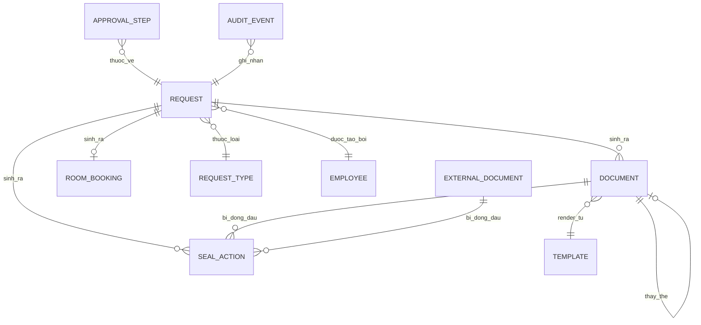
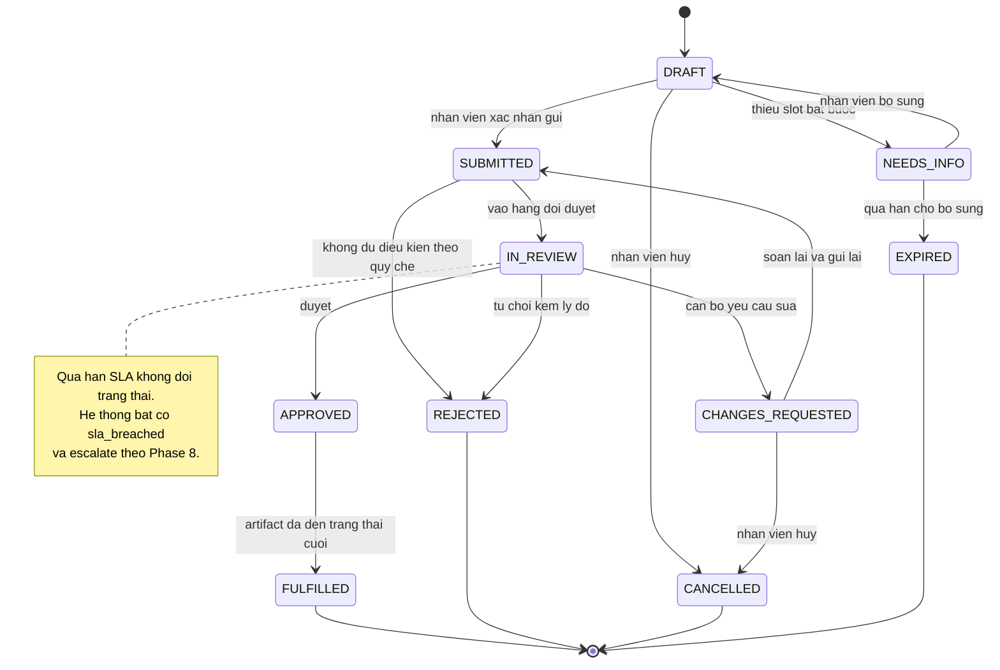
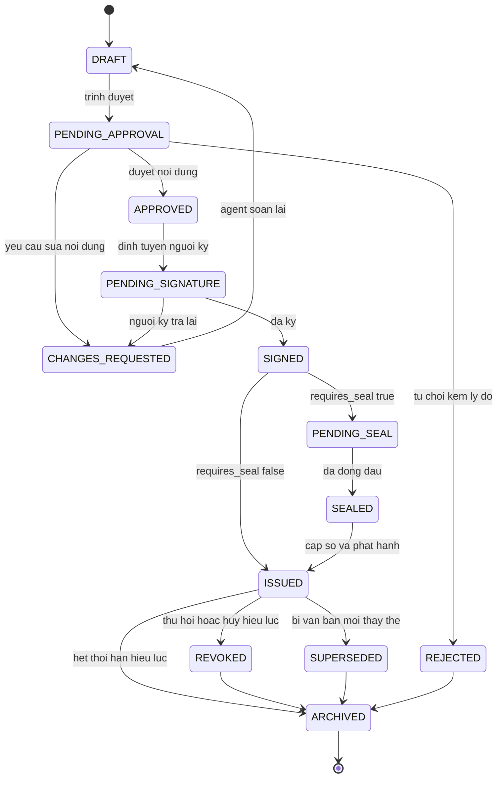
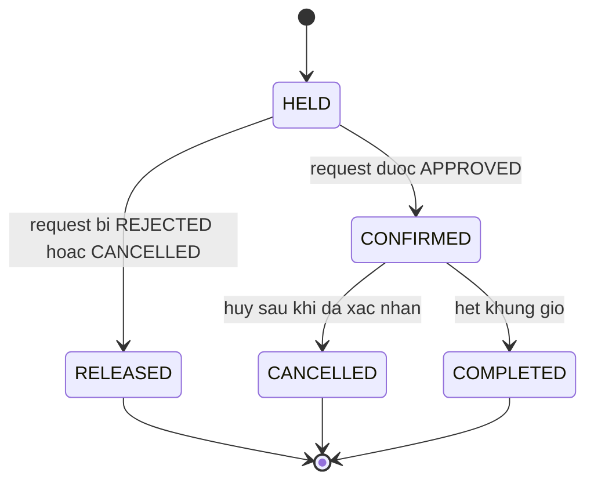

# Phase 0 — Domain Discovery

**Dự án:** BO-19 — Admin Service Desk Agent · **Phiên bản:** 0.9 · **Trạng thái:** Draft chờ duyệt

> File này chốt **từ vựng nghiệp vụ**: có những loại yêu cầu nào, mỗi loại cần dữ liệu gì, văn bản đi qua những trạng thái nào, ai được làm gì. Từ Phase 1 trở đi mọi tài liệu phải dùng đúng tên ở đây và ở [`GLOSSARY.md`](./GLOSSARY.md). File này **không** chọn công nghệ, **không** thiết kế API, **không** định nghĩa agent hay tool.

**Quy ước ưu tiên:** ưu tiên MoSCoW được khai báo **đúng một lần** ở mục Scope & priority của PRD (Phase 1). File này không lặp lại mức ưu tiên; chỗ nào cần đánh dấu hạng mục có thể cắt khỏi Sprint đầu thì dùng `[Should]` hoặc `[Could]`. Hạng mục **không** mang nhãn nào là hạng mục nằm trong Sprint đầu.

**Quy ước ký hiệu:** `✔` bắt buộc · `○` tuỳ chọn · `[ĐỀ XUẤT]` do tôi thêm ngoài đề bài · `TBD` chưa có dữ liệu thật, đã ghi vào [`ASSUMPTIONS.md`](./ASSUMPTIONS.md).

---

## 1. Một Request, nhiều loại artifact

Đề bài gộp chung "yêu cầu hành chính", nhưng bốn loại yêu cầu trong đề bài cho ra **ba dạng kết quả khác hẳn nhau**:

| Dạng kết quả — **artifact** | Loại yêu cầu | Sinh văn bản mới? | Tác động lên gì |
|---|---|---|---|
| `document` | Xác nhận công tác, Giấy giới thiệu | Có | Tạo `document` mới, cần cấp số |
| `room_booking` `[Should]` | Đặt phòng họp | Không | Giữ chỗ tài nguyên, không đụng sổ văn bản |
| `seal_action` | Xin con dấu | Không | Ghi nhận một lần dùng dấu trên `document` hoặc `external_document` `[Could]` |

**Nguyên tắc mô hình hoá — quyết định D-004:**

- **Có đúng MỘT máy trạng thái cho `request`**, dùng chung cho mọi loại yêu cầu. Không tách máy trạng thái Request theo loại.
- **Mỗi loại artifact có máy trạng thái riêng.** Hiện có hai: `document` (mục 5.2) và `room_booking` `[Should]` (mục 5.3).
- `request` sinh ra 0..n artifact. Trạng thái `request` mô tả *hành trình của người yêu cầu*; trạng thái artifact mô tả *vòng đời của vật được tạo ra*. Hai thứ này tiến triển độc lập và phải được nhìn riêng.

---

## 2. Request Type Catalog

Bốn loại đầu lấy nguyên từ đề bài. Hai loại cuối là `[ĐỀ XUẤT]`, đưa vào catalog để kiểm chứng tính tổng quát của slot schema.

| Mã | Tên | Artifact | Mẫu văn bản | Người duyệt | Cần con dấu | SLA mục tiêu | Phạm vi |
|---|---|---|---|---|---|---|---|
| `WORK_CONFIRMATION` | Giấy xác nhận công tác | `document` | `tpl_work_confirmation` | `ADMIN_OFFICER` | Có — dấu tròn | TBD (A-002) | — |
| `INTRODUCTION_LETTER` | Giấy giới thiệu | `document` | `tpl_introduction_letter` | `ADMIN_OFFICER` | Có — dấu tròn | TBD (A-002) | — |
| `ROOM_BOOKING` | Đặt phòng họp | `room_booking` | Không có | `ADMIN_OFFICER` | Không | TBD (A-002) | `[Should]` |
| `SEAL_REQUEST` | Yêu cầu đóng dấu cho văn bản ngoài | `seal_action` | Không có | `ADMIN_OFFICER` + `SIGNER` | Đây chính là hành vi được duyệt | TBD (A-002) | `[Could]` |
| `INCOME_CONFIRMATION` `[ĐỀ XUẤT]` | Giấy xác nhận thu nhập | `document` | `tpl_income_confirmation` | `ADMIN_OFFICER` + phê duyệt dữ liệu lương | Có — dấu tròn | TBD | `[Could]` |
| `BUSINESS_TRIP_ORDER` `[ĐỀ XUẤT]` | Quyết định cử đi công tác | `document` | `tpl_business_trip_order` | `SIGNER` | Có — dấu tròn | TBD | `[Could]` |

Cột **Phạm vi** chỉ đánh dấu hạng mục sẽ bị cắt khỏi Sprint đầu. Mức MoSCoW đầy đủ chốt ở mục Scope & priority của PRD.

**Lý do đề xuất thêm hai loại:** `INCOME_CONFIRMATION` là đích đến khi nhân viên xin xác nhận công tác nhưng thật ra cần chứng minh thu nhập (EC-WC-03) — không có loại này thì agent không có chỗ để định tuyến sang. `BUSINESS_TRIP_ORDER` là loại đầu tiên mà người duyệt **không** phải cán bộ hành chính, dùng để kiểm chứng thiết kế định tuyến nhiều cấp. Cả hai đều là đề xuất của tôi, chưa được xác nhận là có thật trong nghiệp vụ của tổ chức (A-015).

### 2.1 Con dấu: thuộc tính của văn bản, không phải một loại yêu cầu — quyết định D-003

Xin con dấu tồn tại ở **hai hình thái khác nhau** và chúng được tách đôi:

| | Nằm trong Sprint đầu | `[Could]` |
|---|---|---|
| **Cái gì** | `requires_seal` là **thuộc tính của `document`** | `SEAL_REQUEST` là **loại yêu cầu độc lập** |
| **Áp dụng cho** | Văn bản do hệ thống sinh | Văn bản do bên ngoài soạn, nhân viên tải lên |
| **Cơ chế** | Cổng HITL `PENDING_SEAL` trong vòng đời `document`, **tách rời** cổng duyệt nội dung `PENDING_APPROVAL` | Một `request` riêng, sinh `seal_action` trỏ tới `external_document` |
| **Vì sao ở mức đó** | HITL trước khi dùng dấu là ràng buộc bắt buộc của mục Bối cảnh đề tài của `CLAUDE.md`, không thể hoãn (A-006) | Đụng tính năng upload file ngoài, hiện nằm ngoài phạm vi Sprint đầu |

Hệ quả: nhân viên **không** phải tự xin dấu cho giấy xác nhận của chính mình — văn bản nội bộ tự đi qua `PENDING_SEAL`. Và dù ở hình thái nào, permission dùng dấu là `document.apply_seal`, tách riêng khỏi `document.issue` (mục 7).

---

## 3. Slot schema

**Nguồn dữ liệu** — enum dùng thống nhất mọi nơi:

| Nguồn | Ý nghĩa | Agent được tự điền? |
|---|---|---|
| `USER_INPUT` | Nhân viên nói trong hội thoại | Không — phải do người dùng cung cấp |
| `HR_PROFILE` | Tra từ bảng `employee` | Chỉ được **đề xuất**, xem mục 3.1 |
| `RESOURCE_CATALOG` | Danh mục phòng họp, thiết bị | Có |
| `UPLOAD` | File nhân viên tải lên | Không |
| `SYSTEM` | Hệ thống sinh | Có — và **chỉ** hệ thống được sinh |

**Độ nhạy** — thuộc tính của **dữ liệu**, không suy ra từ tên trường hay từ nguồn:

| Mã | Tên | Nghĩa |
|---|---|---|
| `INT` | `INTERNAL` | Dữ liệu tổ chức hoặc tham chiếu, không tự nó nhận dạng cá nhân |
| `PER` | `PERSONAL` | Nhận dạng một cá nhân cụ thể |
| `RES` | `RESTRICTED` | Định danh pháp lý, hoặc nội dung suy ra được tình trạng sức khoẻ, pháp lý, tài chính của cá nhân |

Độ nhạy **không trùng với nguồn**. `purpose` và `work_content` là `USER_INPUT` nhưng ở mức `RES` vì text tự do có thể chứa "đi làm thủ tục tại Toà án" hay "khám tại bệnh viện"; `date_of_birth` là `HR_PROFILE` nhưng chỉ ở mức `PER`. Mọi rule về mask log, giữ hay xoá dữ liệu khi `EXPIRED`, và hiển thị trên màn hình duyệt đều phải key theo cột này, **không** theo danh sách tên trường viết tay. Slot nào được vào prompt gửi LLM **không** do cột này quyết định, mà do danh sách input tự khai của từng prompt module (NFR-05 của PRD). Ánh xạ ba mức này sang phân loại của Nghị định 13/2023/NĐ-CP `[CẦN XÁC MINH]` — chưa có văn bản gốc trong `docs/reference/`.

**Quy tắc cứng:** agent **không bao giờ** được suy diễn giá trị của slot `USER_INPUT` từ ngữ cảnh hội thoại, từ yêu cầu cũ, hay từ hồ sơ nhân viên. Thiếu thì hỏi lại.

Định nghĩa vận hành đầy đủ của "yêu cầu đủ điều kiện xử lý" và "văn bản đủ điều kiện trình duyệt" được chốt ở **Phase 1**. Phase 0 cung cấp hai nguyên liệu: cột `Bắt buộc` trong các bảng dưới đây, và ba ràng buộc provenance ở mục 3.1.

### 3.1 Hồ sơ nhân viên và ràng buộc provenance — quyết định D-002

Dữ liệu nhân sự nằm trong bảng `employee` trên PostgreSQL, **import thủ công từ CSV**. Không tích hợp HRM thật. Mỗi bản ghi mang hai cột bắt buộc:

| Cột | Ý nghĩa |
|---|---|
| `source` | Nguồn của bản ghi, ví dụ tên file CSV hoặc đợt import |
| `synced_at` | Thời điểm bản ghi được nạp vào hệ thống |

Cơ chế này đã chốt (A-005). Ngưỡng để coi `synced_at` là quá cũ vẫn `TBD` và **không** được dùng làm tiêu chí nghiệm thu chừng nào chưa có căn cứ (A-017) — nhưng ràng buộc 3 dưới đây luôn hiển thị `synced_at` nên người duyệt không bị giấu thông tin.

Vì dữ liệu có thể cũ so với thực tế, **ba ràng buộc sau là bắt buộc và phải đi vào định nghĩa "Yêu cầu đủ điều kiện xử lý" ở Phase 1**:

1. Agent chỉ được **đề xuất** giá trị cho slot nguồn `HR_PROFILE`. Không tự điền thẳng vào văn bản.
2. **Nhân viên phải xác nhận** từng giá trị `HR_PROFILE` được đề xuất trước khi yêu cầu rời trạng thái `DRAFT`. Không xác nhận thì yêu cầu không đủ điều kiện xử lý.
3. Màn hình duyệt phải **hiển thị `source` và `synced_at`** của mọi giá trị `HR_PROFILE` có trong văn bản, để người duyệt biết dữ liệu lấy từ đâu và lúc nào.

Agent tự điền toàn bộ mà không qua bước xác nhận của nhân viên nằm ngoài phạm vi Sprint đầu (A-007).

Trách nhiệm khi văn bản sai vì dữ liệu nhân sự sai thuộc về người nhập CSV, không thuộc về agent. Ràng buộc 3 tồn tại để điều đó kiểm chứng được.

### 3.2 `WORK_CONFIRMATION` — Giấy xác nhận công tác

| Slot | Kiểu | Nguồn | Nhạy cảm | Bắt buộc | Rule kiểm tra |
|---|---|---|---|---|---|
| `requester_employee_code` | string | `SYSTEM` | `INT` | ✔ | Lấy từ phiên đăng nhập, không cho sửa |
| `beneficiary_employee_id` | string | `SYSTEM` | `INT` | ✔ | Người thụ hưởng văn bản. Mặc định bằng `requester_employee_code`; người có `request.create_on_behalf` được đặt khác. Là căn cứ của quy tắc tách biệt trách nhiệm ở mục 7.3 |
| `full_name` | string | `HR_PROFILE` | `PER` | ✔ | Chỉ đọc. Lệch so với lời nhân viên khai thì chặn và báo phòng HC |
| `department_name` | string | `HR_PROFILE` | `INT` | ✔ | Chỉ đọc |
| `job_title` | string | `HR_PROFILE` | `INT` | ✔ | Chỉ đọc |
| `contract_type` | enum | `HR_PROFILE` | `PER` | ✔ | Quyết định câu chữ trong văn bản. Agent **cấm** suy diễn — xem EC-WC-01 |
| `employment_start_date` | date | `HR_PROFILE` | `PER` | ✔ | Chỉ đọc |
| `employment_end_date` | date | `HR_PROFILE` | `PER` | ○ | Có giá trị và đã ở quá khứ → chuyển sang thể thức "đã từng công tác" (EC-WC-02) |
| `date_of_birth` | date | `HR_PROFILE` | `PER` | ○ | Chỉ đưa vào văn bản khi `recipient_org` yêu cầu. Là PII |
| `national_id` | string | `HR_PROFILE` | `RES` | ○ | PII mức cao. Mask trong log. Không prompt module nào khai nó làm input (NFR-05 của PRD). Chỉ đưa vào bản render cuối |
| `purpose` | text | `USER_INPUT` | `RES` | ✔ | Không rỗng. Nếu mục đích cần chứng minh thu nhập → xem EC-WC-03 |
| `recipient_org` | string | `USER_INPUT` | `PER` | ✔ | Dùng cho phần "Kính gửi" |
| `copies_count` | int | `USER_INPUT` | `INT` | ○ | Mặc định 1. Trần TBD (A-011) |
| `language` | enum `vi`/`en` | `USER_INPUT` | `INT` | ○ | `[Could]`. Bản tiếng Anh cần mẫu riêng |
| `document_number` | string | `SYSTEM` | `INT` | ✔ khi `ISSUED` | Cấp tại thời điểm phát hành, không cấp sớm hơn — xem mục 6 |
| `issued_date` | date | `SYSTEM` | `INT` | ✔ khi `ISSUED` | Bằng ngày cấp số |
| `signer_user_id` | string | `SYSTEM` | `INT` | ✔ khi `PENDING_SIGNATURE` | Do định tuyến duyệt quyết định |

Mọi slot nguồn `HR_PROFILE` ở bảng này chịu ba ràng buộc provenance ở mục 3.1.

### 3.3 `INTRODUCTION_LETTER` — Giấy giới thiệu

| Slot | Kiểu | Nguồn | Nhạy cảm | Bắt buộc | Rule kiểm tra |
|---|---|---|---|---|---|
| `requester_employee_code` | string | `SYSTEM` | `INT` | ✔ | Từ phiên đăng nhập |
| `bearer_employee_code` | string | `USER_INPUT` | `INT` | ✔ | Người mang giấy, đồng thời là `beneficiary_employee_id`. Mặc định bằng requester. Nếu khác → bắt buộc có `delegation` hoặc permission `request.create_on_behalf`, xem EC-IL-01 |
| `bearer_full_name`, `bearer_job_title` | string | `HR_PROFILE` | `PER` | ✔ | Chỉ đọc, tra theo `bearer_employee_code` |
| `bearer_national_id` | string | `HR_PROFILE` | `RES` | ○ | PII mức cao. Bắt buộc khi `recipient_org` là cơ quan nhà nước (A-013) |
| `recipient_org` | string | `USER_INPUT` | `PER` | ✔ | Không rỗng |
| `recipient_person` | string | `USER_INPUT` | `PER` | ○ | Tên hoặc chức danh người nhận |
| `work_content` | text | `USER_INPUT` | `RES` | ✔ | Nội dung công việc được giới thiệu. Không rỗng, không dùng từ ngữ cam kết thay tổ chức |
| `valid_from` | date | `USER_INPUT` | `INT` | ✔ | `>=` ngày cấp |
| `valid_to` | date | `USER_INPUT` | `INT` | ✔ | `>= valid_from`; khoảng hiệu lực tối đa TBD (A-011) — xem EC-IL-02 |
| `accompanying_persons` | list | `USER_INPUT` | `PER` | ○ | Mỗi người phải có mã nhân viên hợp lệ |
| `document_number`, `issued_date`, `signer_user_id` | | `SYSTEM` | ✔ | Như mục 3.2 |

### 3.4 `ROOM_BOOKING` — Đặt phòng họp `[Should]`

| Slot | Kiểu | Nguồn | Nhạy cảm | Bắt buộc | Rule kiểm tra |
|---|---|---|---|---|---|
| `requester_employee_code` | string | `SYSTEM` | `INT` | ✔ | Từ phiên đăng nhập |
| `room_id` | string | `RESOURCE_CATALOG` | `INT` | ✔ | Phải tồn tại trong danh mục phòng (A-012) |
| `start_at`, `end_at` | timestamp | `USER_INPUT` | `INT` | ✔ | `end_at > start_at`; `start_at` ở tương lai; nằm trong giờ làm việc, ngoài giờ thì cần duyệt bổ sung (EC-RB-03) |
| `attendee_count` | int | `USER_INPUT` | `INT` | ✔ | `<=` sức chứa phòng (EC-RB-02) |
| `purpose` | text | `USER_INPUT` | `RES` | ✔ | Không rỗng |
| `equipment_needed` | list | `RESOURCE_CATALOG` | `INT` | ○ | Phải có trong thiết bị của phòng |
| `external_guests` | list | `USER_INPUT` | `PER` | ○ | Có giá trị → bật cờ thông báo lễ tân và bảo vệ |
| `recurrence_rule` | string | `USER_INPUT` | `INT` | ○ | `[Could]` |

Không có slot dạng `document_number` vì loại này không sinh văn bản.

### 3.5 `SEAL_REQUEST` — Đóng dấu cho văn bản ngoài `[Could]`

| Slot | Kiểu | Nguồn | Nhạy cảm | Bắt buộc | Rule kiểm tra |
|---|---|---|---|---|---|
| `requester_employee_code` | string | `SYSTEM` | `INT` | ✔ | Từ phiên đăng nhập |
| `external_file` | file | `UPLOAD` | `RES` | ✔ | Nội dung file là **dữ liệu không tin cậy**, xem EC-SR-02 |
| `seal_type` | enum | `USER_INPUT` | `INT` | ✔ | `ORGANIZATION_ROUND` · `TITLE_STAMP` · `OVERLAP_STAMP` dấu treo · `EDGE_STAMP` dấu giáp lai |
| `page_count` | int | `SYSTEM` hoặc `USER_INPUT` | `INT` | ✔ khi `seal_type = EDGE_STAMP` | `>= 2` |
| `copies_count` | int | `USER_INPUT` | `INT` | ✔ | `>= 1`, trần TBD (A-011) |
| `reason` | text | `USER_INPUT` | `RES` | ✔ | Không rỗng — là căn cứ ghi vào `seal_register` |
| `signed_by_verified` | bool | `USER_INPUT` | `INT` | ✔ | Người yêu cầu khẳng định văn bản đã có chữ ký người có thẩm quyền; người duyệt phải kiểm chứng lại trên bản gốc (EC-SR-01) |

Với văn bản do hệ thống sinh, không có bảng slot tương ứng: `requires_seal` và `seal_type` là thuộc tính của `document`, quyết định bởi `request_type` và bởi `recipient_org` (EC-IL-03).

### 3.6 Hai loại `[ĐỀ XUẤT]`

Không đặc tả slot chi tiết vì chưa nằm trong phạm vi gần. Hai điểm khác biệt cần xử lý khi kích hoạt: `INCOME_CONFIRMATION` đụng dữ liệu lương nên cần thêm một tầng phê duyệt dữ liệu ngoài `ADMIN_OFFICER`; `BUSINESS_TRIP_ORDER` có người duyệt là `SIGNER`, nên là ca thử cho định tuyến nhiều cấp.

---

## 4. Quan hệ giữa các entity

Sơ đồ chỉ chốt **tên và bản số** của quan hệ. Thuộc tính, khoá, index là việc của Phase 4.

`EXTERNAL_DOCUMENT` chỉ xuất hiện cùng `SEAL_REQUEST`, nên nó cũng ở mức `[Could]`. Trong Sprint đầu mọi `SEAL_ACTION` đều trỏ tới `DOCUMENT`.

---

## 5. Vòng đời

### 5.1 Vòng đời `request` — một máy trạng thái cho mọi loại yêu cầu

| Trạng thái | Nghĩa | Ai đẩy sang trạng thái này |
|---|---|---|
| `DRAFT` | Đang hội thoại thu thập slot, chưa cam kết | `EMPLOYEE` |
| `NEEDS_INFO` | Agent đã hỏi, đang chờ nhân viên trả lời | Hệ thống |
| `SUBMITTED` | Nhân viên đã xác nhận gửi, chưa ai nhận xử lý | `EMPLOYEE` |
| `IN_REVIEW` | Đã vào hàng đợi duyệt của phòng HC | Hệ thống |
| `CHANGES_REQUESTED` | Người duyệt trả lại kèm yêu cầu sửa cụ thể | Người có `document.request_changes` |
| `APPROVED` | Đã duyệt, đang thực thi artifact | Người có `document.approve_content` |
| `FULFILLED` | Artifact đã tới trạng thái cuối — `document` `ISSUED`, hoặc `room_booking` `CONFIRMED` | Hệ thống |
| `REJECTED` | Từ chối, bắt buộc có `rejection_reason` | Người có `document.reject` |
| `CANCELLED` | Nhân viên tự huỷ khi chưa `APPROVED` | `EMPLOYEE` |
| `EXPIRED` | Hết hạn chờ nhân viên bổ sung thông tin (A-014) | Hệ thống |

**Quan hệ với artifact:** `request` chuyển sang `FULFILLED` khi **mọi** artifact của nó đã tới trạng thái cuối. Sau mốc đó, artifact vẫn tiếp tục sống đời riêng — văn bản có thể bị `REVOKED`, phòng có thể bị `CANCELLED` — mà không kéo `request` ra khỏi `FULFILLED`. Đây chính là lý do tách máy trạng thái.

**Tại sao "quá hạn" không phải một trạng thái:** quá hạn SLA không kết thúc yêu cầu — yêu cầu vẫn phải được xử lý. Mô hình hoá nó thành trạng thái sẽ nhân đôi mọi trạng thái mở. Vì vậy quá hạn là **điều kiện dẫn xuất** từ `due_at` cộng cờ `sla_breached`. `EXPIRED` là chuyện khác: đó là kết thúc thật khi nhân viên im lặng quá lâu ở `NEEDS_INFO`.

### 5.2 Vòng đời `document`

| Trạng thái | Nghĩa | Ghi chú |
|---|---|---|
| `DRAFT` | Agent đã render từ template, chưa ai duyệt | Nội dung còn sửa được. Được tạo **tại thời điểm `request` chuyển sang `SUBMITTED`** (D-010) |
| `PENDING_APPROVAL` | Nằm trong hàng đợi duyệt **nội dung** | **Cổng HITL số 1** · permission `document.approve_content` |
| `CHANGES_REQUESTED` | Bị trả lại kèm lý do cụ thể | Quay về `DRAFT` để agent soạn lại |
| `REJECTED` | Bị từ chối hẳn | Giữ lại để truy vết, không xoá |
| `APPROVED` | Nội dung được chấp nhận | Từ đây nội dung **bất biến** |
| `PENDING_SIGNATURE` | Chờ người có thẩm quyền ký | Sprint đầu một cấp · nhiều cấp là `[Should]` |
| `SIGNED` | Đã có chữ ký người có thẩm quyền | Sprint đầu ghi nhận sự kiện ký tay; chữ ký số ngoài phạm vi (A-003) |
| `PENDING_SEAL` | Chờ đóng dấu, chỉ khi `requires_seal = true` | **Cổng HITL số 2** · permission `document.apply_seal` |
| `SEALED` | Đã đóng dấu, đã ghi `seal_register` | |
| `ISSUED` | Đã cấp số và phát hành cho nhân viên | Permission `document.issue` · thời điểm **duy nhất** cấp `document_number` |
| `REVOKED` | Thu hồi hoặc huỷ hiệu lực | Bắt buộc có `revocation_reason` và người quyết định |
| `SUPERSEDED` | Bị một văn bản mới thay thế | Trỏ tới `document` thay thế |
| `ARCHIVED` | Chuyển sang lưu trữ | Thời hạn lưu TBD (A-010) |

**Ba bất biến của vòng đời này:**

1. Không có đường nào đi từ `DRAFT` tới `ISSUED` mà không qua `PENDING_APPROVAL`, và khi `requires_seal = true` thì không có đường nào tới `ISSUED` mà không qua `PENDING_SEAL`. Không có nhánh auto-approve, kể cả khi confidence cao (mục Bối cảnh đề tài của `CLAUDE.md`).
2. **Hai cổng HITL là hai quyết định riêng biệt.** Duyệt nội dung không đồng nghĩa với cho phép dùng dấu. Chúng dùng hai permission khác nhau và được ghi hai `audit_event` khác nhau, kể cả khi cùng một người thực hiện cả hai.
3. Từ `APPROVED` trở đi nội dung văn bản bất biến. Muốn sửa thì quay lại qua `CHANGES_REQUESTED`; nếu đã `ISSUED` thì phải `REVOKED` rồi phát hành văn bản mới — không sửa tại chỗ.

**Thu hồi:** người có `document.revoke_initiate` khởi tạo, người có `document.revoke_confirm` xác nhận. Trong Sprint đầu cả hai nằm ở `ADMIN_OFFICER` nhưng vẫn là hai permission tách rời, và quy tắc tách biệt trách nhiệm ở mục 7.3 cấm cùng một người làm cả hai. Văn bản `REVOKED` vẫn phải truy xuất được — thu hồi là đánh dấu mất hiệu lực, không phải xoá.

### 5.3 Vòng đời `room_booking` `[Should]`

`HELD` là trạng thái giữ chỗ tạm, tạo ngay khi `request` chuyển sang `SUBMITTED`. Nó tồn tại để hai nhân viên gửi yêu cầu cùng khung giờ không cùng được duyệt — người thứ hai bị chặn ở bước kiểm tra xung đột chứ không phải ở bước duyệt. Thời gian giữ chỗ tối đa TBD (A-008).

---

## 6. Cấp số văn bản

Ràng buộc nghiệp vụ; cơ chế thực thi thuộc Phase 4.

- **Sổ văn bản** (`document_register`) là nguồn sự thật duy nhất về số văn bản. Mỗi bản ghi gắn với một `document` hoặc mang trạng thái `VOIDED`. Thiết kế này giả định tổ chức là một pháp nhân đơn nhất dùng một dãy số duy nhất (A-001).
- **Thời điểm cấp số:** đúng lúc `document` chuyển sang `ISSUED`, không sớm hơn. Cấp số ở `DRAFT` sẽ tạo lỗ hổng số mỗi khi bản nháp bị từ chối.
- **Chống trùng số:** việc cấp số phải là thao tác nguyên tử trên sổ. Hai yêu cầu phát hành đồng thời không bao giờ nhận cùng một số.
- **Chống lỗ hổng số:** nếu giao dịch phát hành thất bại **sau** khi đã cấp số, số đó được đánh dấu `VOIDED` kèm lý do và **không bao giờ tái sử dụng**. Sổ ưu tiên tính giải trình được hơn tính liên tục của dãy số.
- **Định dạng số: cấu hình được, không hardcode.** Ký hiệu văn bản chứa phần viết tắt tên cơ quan nên khác nhau theo từng tổ chức — hardcode là sai trong **mọi** trường hợp, không chỉ trường hợp chưa biết giá trị. Vì vậy Phase 4 thiết kế `document_register` với định dạng số cấu hình được **ngay từ đầu**, không chờ ai xác nhận. Đây là yêu cầu gốc, không phải chi phí phát sinh (ADR-001).
- **Giá trị định dạng cụ thể:** `TBD` (A-009), do Product Owner xác minh **trước Phase 4**.
- **Chu kỳ:** giả định đánh số theo năm và reset đầu năm (A-009).

### 6.1 Thể thức văn bản — ai chịu trách nhiệm

Thể thức **không** do agent sinh và **không** thuộc Phase 7. Khung thể thức nằm trong file template `.docx` do người soạn; agent chỉ điền biến. Lý do đầy đủ ở **ADR-001**.

| Việc | Owner | Mốc |
|---|---|---|
| Xác minh định dạng số và ký hiệu văn bản | Product Owner | Trước Phase 4 |
| Chuẩn bị mẫu `.docx` đúng thể thức | Product Owner | Trước Phase 7 |
| Nghiệm thu thể thức của văn bản phát hành | **Không có ai** — đây là câu trả lời cuối, không phải khoảng trống chờ lấp | Không có. Hệ quả: hệ thống chạy ở **chế độ phi sản xuất**, mục 6.2 (A-018, D-009) |

**Quy tắc trích dẫn pháp lý:** cấm viết số điều, khoản, điểm hay phụ lục của Nghị định 30/2020/NĐ-CP **từ trí nhớ**. Chỉ trích dẫn khi văn bản gốc đã có trong `docs/reference/`. Chưa có thì ghi `[CẦN XÁC MINH]` và chỉ mô tả ở mức nguyên tắc. Áp dụng cho mọi phase.

**Xử lý rủi ro thể thức:** hệ thống **không bao giờ tự khẳng định** một văn bản đúng thể thức. Chốt kiểm soát duy nhất là HITL — cán bộ hành chính duyệt tại cổng `PENDING_APPROVAL` trước khi phát hành. **Residual risk** sau chốt này: nếu template sai thể thức **và** người duyệt không phát hiện, văn bản sai vẫn được phát hành; không có lớp kiểm soát tự động nào phía sau. Rủi ro này được chấp nhận có ý thức và là nguyên liệu cho mục Risk register của PRD (Phase 1).

**Sổ theo dõi con dấu** (`seal_register`) là sổ riêng, ghi mọi `seal_action` kể cả trên văn bản ngoài. Không dùng chung dãy số với sổ văn bản. Hệ thống chỉ quản lý quy trình duyệt và nhật ký, không điều khiển thiết bị đóng dấu và không sinh ảnh dấu (A-004).

### 6.2 Chế độ phi sản xuất — quyết định D-009

Không có ai nghiệm thu thể thức (A-018). Hệ quả **không** phải là dừng thiết kế, mà là hệ thống chỉ được chạy ở **chế độ phi sản xuất** — `operating_mode = NON_PRODUCTION` — chừng nào A-018 còn `Mở`. Ba ràng buộc, bắt buộc đồng thời:

| # | Ràng buộc | Ghi chú |
|---|---|---|
| 1 | Mọi văn bản sinh ra mang **watermark không gỡ được**: `BẢN THỬ NGHIỆM — KHÔNG CÓ GIÁ TRỊ PHÁP LÝ` | Nằm trong bản render, không phải một lớp hiển thị của giao diện. Không có tham số nào tắt được nó khi đang ở chế độ này |
| 2 | `document_register` cấp số từ **dải số riêng**, tách hẳn khỏi dải số thật | `register_series = TRIAL`. Dải thật `OFFICIAL` không bị tiêu tốn số nào, nên khi chuyển sang sản xuất thì sổ số thật vẫn sạch |
| 3 | **Không đóng dấu thật.** Cổng `PENDING_SEAL` vẫn chạy đủ quy trình duyệt, nhưng `seal_action` được ghi là thử nghiệm và không có thao tác đóng dấu vật lý nào xảy ra | Giữ nguyên cổng HITL để luồng được kiểm thử thật, chỉ chặn hành vi vật lý |

**Tháo chế độ này là một quyết định có người ký, không phải một cờ cấu hình.** Thiết kế phải làm cho việc chuyển sang `PRODUCTION` đòi hỏi một hành động được ghi nhận và quy trách nhiệm được — không phải sửa biến môi trường rồi deploy lại. Cơ chế cụ thể thuộc Phase 9 và Phase 11.

Ba ràng buộc này phải trở thành **NFR ở Phase 1**, không chỉ nằm trong `ASSUMPTIONS.md`.

---

## 7. Permission và vai trò — quyết định D-005

Mô hình hoá theo **permission**, không theo vai trò cứng. Vai trò chỉ là một gói permission có sẵn; kiểm tra quyền ở mọi nơi phải hỏi "người này có permission X trên đối tượng Y không", không bao giờ hỏi "người này có phải `ADMIN_OFFICER` không".

### 7.1 Danh mục permission

| Permission | Cho phép làm gì | Phạm vi |
|---|---|---|
| `request.create` | Tạo yêu cầu qua chat cho chính mình | — |
| `request.create_on_behalf` | Tạo yêu cầu với `beneficiary_employee_id` khác người tạo | — |
| `request.read_own` | Xem yêu cầu do mình tạo | — |
| `request.read_assigned` | Xem yêu cầu được định tuyến tới mình | — |
| `request.read_all` | Xem mọi yêu cầu trong tổ chức | — |
| `request.supply_info` | Bổ sung thông tin cho yêu cầu của mình | — |
| `request.cancel_own` | Huỷ yêu cầu của mình khi chưa `APPROVED` | — |
| `document.approve_content` | Duyệt nội dung tại cổng `PENDING_APPROVAL` | — |
| `document.request_changes` | Trả lại kèm yêu cầu sửa | — |
| `document.reject` | Từ chối kèm lý do | — |
| `document.sign` | Ký văn bản tại `PENDING_SIGNATURE` | — |
| `document.apply_seal` | Đóng dấu tại cổng `PENDING_SEAL` | — |
| `document.issue` | Cấp số và phát hành | — |
| `document.revoke_initiate` | Khởi tạo thu hồi văn bản đã phát hành | — |
| `document.revoke_confirm` | Xác nhận thu hồi | — |
| `template.manage` | Quản lý mẫu văn bản và phiên bản mẫu | — |
| `employee.import` | Import CSV hồ sơ nhân viên | — |
| `booking.confirm` | Xác nhận hoặc từ chối đặt phòng | `[Should]` |
| `delegation.manage` | Lập và thu hồi uỷ quyền | `[Should]` |
| `audit.read_own` | Xem nhật ký của yêu cầu liên quan tới mình | — |
| `audit.read_all` | Xem toàn bộ nhật ký kiểm toán | — |

`document.issue` và `document.apply_seal` **là hai permission tách rời** và không bao giờ được gộp. Cấp dấu và cấp số là hai rủi ro khác nhau: một cái làm văn bản có hiệu lực pháp lý, một cái đưa nó vào sổ.

**Không tồn tại permission xoá hay sửa `audit_event`.** Đây không phải là quyền chưa cấp cho ai — nó không có trong danh mục.

### 7.2 Gói permission theo vai trò

| Vai trò | Permission |
|---|---|
| `EMPLOYEE` | `request.create` · `request.read_own` · `request.supply_info` · `request.cancel_own` · `audit.read_own` |
| `ADMIN_OFFICER` | Toàn bộ của `EMPLOYEE`, cộng `request.create_on_behalf` · `request.read_all` · `document.approve_content` · `document.request_changes` · `document.reject` · `document.apply_seal` · `document.issue` · `document.revoke_initiate` · `template.manage` · `employee.import` · `audit.read_all` · `booking.confirm` `[Should]` |
| `SIGNER` `[Should]` | `request.read_assigned` · `document.approve_content` · `document.request_changes` · `document.reject` · `document.sign` · `document.revoke_confirm` · `audit.read_own` |

Trong Sprint đầu chưa có vai trò `SIGNER`. `document.sign` và `document.revoke_confirm` được cấp lẻ cho một hoặc vài `ADMIN_OFFICER` cụ thể, không mặc định đi kèm vai trò. Quyền `request.read_all` còn bị giới hạn thêm theo phòng ban ở Phase 9; danh mục này là tầng thô.

Vai trò quản trị hệ thống (tạo tài khoản, cấu hình hạ tầng) không được đề bài nhắc tới và không mô hình hoá ở phase này.

### 7.3 Tách biệt trách nhiệm — quyết định D-006

#### Căn cứ chặn là **người thụ hưởng**, không phải người tạo yêu cầu

Cột `beneficiary_employee_id` của `request` là nhân viên mà kết quả của yêu cầu phục vụ. Mặc định bằng người tạo, nhưng không phải lúc nào cũng vậy:

| `request_type` | `beneficiary_employee_id` lấy từ |
|---|---|
| `WORK_CONFIRMATION` | Chính nó — slot bắt buộc |
| `INTRODUCTION_LETTER` | `bearer_employee_code` |
| `ROOM_BOOKING` `[Should]` | Người tạo yêu cầu |
| `SEAL_REQUEST` `[Could]` | Người tạo yêu cầu |

**Quy tắc:** khi `beneficiary_employee_id == approver_employee_id`, mọi permission duyệt sau đây bị chặn trên đối tượng đó — `document.approve_content`, `document.request_changes`, `document.reject`, `document.sign`, `document.apply_seal`, `document.issue`, `document.revoke_initiate`, `document.revoke_confirm`, `booking.confirm`.

Hệ quả cần đọc kỹ: **cán bộ hành chính nhập hộ cho người khác rồi tự duyệt là hợp lệ**, vì người thụ hưởng không phải người duyệt. Cái bị chặn là tự duyệt giấy tờ của chính mình. Dùng người tạo làm căn cứ sẽ chặn nhầm luồng nhập hộ, vốn là luồng bình thường của phòng hành chính.

Ràng buộc thứ hai, độc lập với ràng buộc trên: `document.revoke_initiate` và `document.revoke_confirm` trên cùng một văn bản phải do hai người khác nhau thực hiện.

#### Đường thoát — bật mặc định, không bao giờ im lặng

Thiết kế **không giả định** tổ chức có từ hai người duyệt trở lên. Khi chỉ có một người mang permission cần thiết, hệ thống **cho phép tự duyệt**, nhưng chỉ khi đủ cả bốn điều kiện dưới đây. Thiếu bất kỳ điều nào thì thao tác bị từ chối, không có ngoại lệ:

1. Người duyệt **nhập `self_approval_reason`** — văn bản tự do, không rỗng, không có giá trị mặc định để bấm cho xong.
2. Bản ghi duyệt mang cờ **`approval_step.self_approved = true`**, lưu vĩnh viễn cùng bản ghi.
3. `audit_event` tương ứng ghi ở mức **`WARNING`**, không phải `INFO`.
4. Bản ghi **hiện trên dashboard** ở mục riêng dành cho tự duyệt, không trộn vào danh sách duyệt thường.

**Cấm tuyệt đối** mọi phương án tự động bỏ qua kiểm tra: cấu hình tắt ràng buộc, whitelist người dùng, hay im lặng cho qua khi hệ thống phát hiện chỉ có một người đủ quyền. Đường thoát ở đây là *ghi lại thật rõ*, không phải *bỏ qua*. Cùng cơ chế này áp dụng cho ràng buộc hai người ở bước thu hồi.

#### Việc còn lại cho phase sau

Ràng buộc này phải trở thành một **NFR ở Phase 1** và một rule kiểm tra ở **Phase 9**. **Phase 8** thiết kế chi tiết: cách hệ thống xác định "chỉ còn một người đủ quyền", màn hình nhập lý do, mục tự duyệt trên dashboard, và quan hệ giữa đường thoát này với cơ chế uỷ quyền khi vắng mặt.

---

## 8. Edge case nghiệp vụ

Bảng edge case có **hai chiều**, không phải một:

| Chiều | Nhóm | Xảy ra khi nào |
|---|---|---|
| **Tầng hội thoại và phân loại** | `EC-CV-xx` | **Trước** khi biết `request_type`. Không gắn với loại yêu cầu nào vì tại thời điểm đó chưa có loại nào để gắn |
| **Tầng nghiệp vụ theo loại** | `EC-WC-xx`, `EC-IL-xx`, `EC-RB-xx`, `EC-SR-xx` | **Sau** khi đã biết `request_type`, khi kiểm tra điều kiện và sinh artifact |

Chiều thứ nhất được bổ sung ở phiên bản 0.6 sau khi Phase 1 phát hiện bảng cũ — tổ chức thuần theo `request_type` — **về cấu trúc không chứa được** ca xảy ra trước lúc phân loại. Đây là thiếu một chiều phân loại, không phải thiếu vài ca.

Mỗi loại yêu cầu có tối thiểu 2 ca ở chiều thứ hai. Toàn bộ bảng là nguyên liệu trực tiếp cho bộ eval ở Phase 1 và Phase 10.

### Tầng hội thoại và phân loại — `EC-CV-xx`

Áp dụng cho mọi yêu cầu, kể cả yêu cầu cuối cùng hoá ra thuộc loại chưa hỗ trợ.

| ID | Tình huống | Hành vi đúng |
|---|---|---|
| EC-CV-01 | **Nhiều nhu cầu trong một lượt** — nhân viên nêu hai việc trong cùng một tin nhắn | Một `request` mang đúng một `request_type`, nên hai nhu cầu phải thành hai `request`. Agent **nhận ra và nêu rõ cả hai**, xử lý **tuần tự** — hoàn tất cái thứ nhất rồi hỏi có tiếp tục cái thứ hai không. **Không bao giờ** im lặng bỏ qua nhu cầu thứ hai, **không** gộp hai nhu cầu vào một văn bản. Nếu chỉ một trong hai thuộc loại đang hỗ trợ thì xử lý cái đó và báo rõ cái còn lại |
| EC-CV-02 | **Đổi loại giữa chừng hội thoại** — đã thu được vài slot thì nhân viên nói thực ra cần loại khác | Slot đã thu của loại cũ **không được mang sang** loại mới, kể cả khi trùng tên, vì rule kiểm tra và nguồn dữ liệu có thể khác. Agent xác nhận việc đổi loại, nêu rõ thông tin nào phải hỏi lại, rồi bắt đầu thu slot theo schema mới. Yêu cầu cũ chưa `SUBMITTED` thì chuyển `CANCELLED`, không để lại `DRAFT` mồ côi |
| EC-CV-03 | **Từ ngữ trỏ một loại, ý định thuộc loại khác** — hai chiều: (a) mô tả nhập nhằng giữa hai loại đang hỗ trợ; (b) dùng từ ngữ của loại **chưa hỗ trợ** nhưng ý định thật thuộc loại đang hỗ trợ | Agent **hỏi lại để làm rõ ý định**, không chọn theo từ khoá khớp gần nhất. Đặc biệt nguy hiểm ở chiều (b): tên các loại giấy tờ hành chính giống nhau về mặt chữ — "xác nhận công tác" và "xác nhận thu nhập" cùng chữ *xác nhận* — nên khớp từ khoá sẽ sai một cách rất thuyết phục. Chiều ngược lại của (b), tức từ ngữ của loại đang hỗ trợ nhưng ý định thuộc loại chưa hỗ trợ, đã có ở EC-WC-03 |
| EC-CV-04 | **Bỏ giữa chừng rồi quay lại sau** — nhân viên rời đi ở `DRAFT` hoặc `NEEDS_INFO`, quay lại sau nhiều ngày | Quay lại **trong hạn**: agent khôi phục đúng trạng thái đã thu, nhắc lại đã có gì và còn thiếu gì, **không** bắt khai lại từ đầu và **không** im lặng coi như hội thoại mới. Quay lại **sau khi `EXPIRED`**: agent nói rõ yêu cầu đã hết hạn và vì sao, rồi bắt đầu lại — **không** âm thầm dùng tiếp dữ liệu của yêu cầu đã hết hạn. Ca này gắn trực tiếp với NFR-04 ở PRD: người dùng thưa gần như chắc chắn sẽ rơi vào nó. Thời hạn chờ và số phận dữ liệu đã thu khi `EXPIRED`: xem A-014 |

### `WORK_CONFIRMATION`

| ID | Tình huống | Hành vi đúng |
|---|---|---|
| EC-WC-01 | Nhân viên **thử việc** xin giấy xác nhận công tác | Vẫn cấp, nhưng văn bản phải ghi đúng `contract_type = PROBATION`. Cấm dùng câu chữ hàm ý nhân viên chính thức. Agent đề xuất `contract_type` từ `HR_PROFILE` và nhân viên phải xác nhận; tuyệt đối không suy ra từ lời nhân viên |
| EC-WC-02 | Nhân viên **đã nghỉ việc** xin xác nhận | Chuyển sang thể thức "đã từng công tác" với mốc bắt đầu và kết thúc. Nếu `employment_end_date` rỗng nhưng nhân viên khai đã nghỉ → `NEEDS_INFO`, chuyển phòng HC xác minh và cập nhật `employee`, không tự chọn thể thức |
| EC-WC-03 | Mục đích là vay ngân hàng, yêu cầu ghi **mức lương** | Không thêm lương vào giấy xác nhận công tác. `INCOME_CONFIRMATION` chưa nằm trong phạm vi gần, nên agent phải trả lời rõ là chưa hỗ trợ và chuyển phòng HC xử lý thủ công. Không tự chế thêm dòng thu nhập vào mẫu hiện có |

### `INTRODUCTION_LETTER`

| ID | Tình huống | Hành vi đúng |
|---|---|---|
| EC-IL-01 | Trợ lý xin giấy giới thiệu **hộ người khác** | `bearer_employee_code` khác `requester_employee_code` → bắt buộc có `delegation` còn hiệu lực. Chưa có thì `NEEDS_INFO`. Agent **không** được tra hồ sơ người thứ ba trước khi uỷ quyền được xác nhận |
| EC-IL-02 | Xin hiệu lực **6 tháng** cho một chuyến làm việc một ngày | Chặn nếu vượt trần `valid_to - valid_from` (TBD, A-011); dưới trần nhưng lệch bất thường so với `work_content` thì cảnh báo cho người duyệt, không tự cắt ngắn |
| EC-IL-03 | Giới thiệu tới **cơ quan nhà nước** | Đặt `requires_seal = true` với `seal_type = ORGANIZATION_ROUND` và bắt buộc có `bearer_national_id`. Thiếu thì không được vào hàng đợi duyệt |

### `ROOM_BOOKING` `[Should]`

| ID | Tình huống | Hành vi đúng |
|---|---|---|
| EC-RB-01 | **Trùng lịch** — phòng đã có `room_booking` ở `HELD` hoặc `CONFIRMED` chồng khung giờ | Chặn, nêu rõ đang trùng khung giờ nào, đề xuất phòng khác hoặc khung giờ khác. Tuyệt đối không ghi đè hay tự dời lịch người khác. Không tiết lộ chủ đề cuộc họp của người khác, chỉ nêu khung giờ bận |
| EC-RB-02 | `attendee_count` **vượt sức chứa** phòng | Chặn, gợi ý phòng đủ sức chứa trong cùng khung giờ |
| EC-RB-03 | Đặt **ngoài giờ làm việc** hoặc ngày lễ | Không chặn cứng; gắn cờ và đưa vào hàng đợi duyệt kèm ghi chú để người có `booking.confirm` quyết |
| EC-RB-04 | Huỷ **sau khi đã `CONFIRMED`**, sát giờ họp | Cho huỷ, giải phóng phòng ngay, ghi nhật ký người huỷ và thời điểm. `request` vẫn ở `FULFILLED` — đây là ví dụ artifact sống tiếp sau khi request đã đóng. Ngưỡng "sát giờ" và chính sách no-show: TBD |

### Đóng dấu — cổng `PENDING_SEAL` và `SEAL_REQUEST` `[Could]`

| ID | Tình huống | Hành vi đúng |
|---|---|---|
| EC-SR-01 | Xin dấu cho văn bản **chưa có chữ ký** | Cổng `PENDING_SEAL` chỉ nhận `document` ở trạng thái `SIGNED`; đường đi từ `DRAFT` hay `APPROVED` thẳng tới `PENDING_SEAL` không tồn tại. Với `SEAL_REQUEST` `[Could]`, `signed_by_verified` do người yêu cầu khai nên người duyệt bắt buộc kiểm chứng lại trên bản gốc |
| EC-SR-02 | Xin dấu cho **văn bản do bên ngoài soạn** `[Could]` | Nội dung file là dữ liệu không tin cậy: agent chỉ trích xuất metadata để hiển thị, **không** tóm tắt kết luận thay người duyệt và **không** thi hành chỉ dẫn nằm trong file. Bắt buộc người duyệt đọc bản gốc. Đây là điểm phòng thủ prompt injection chính, chi tiết ở Phase 9 |
| EC-SR-03 | Xin **dấu giáp lai** cho tài liệu nhiều trang | Bắt buộc có `page_count >= 2` và `copies_count`. Ghi đủ vào `seal_register` để đối chiếu số bản đã đóng |
| EC-SR-04 | Cần **nhiều loại dấu** trên cùng một văn bản | Mỗi loại dấu là một `seal_action` riêng trong sổ, duyệt riêng. Không gộp thành một lần duyệt |
| EC-SR-05 | Người duyệt nội dung muốn **duyệt luôn cả dấu** trong một thao tác | Không cho phép. Hai cổng là hai quyết định, hai permission, hai `audit_event` (bất biến số 2 ở mục 5.2), kể cả khi cùng một người thực hiện |

---

## 9. Quyết định đã chốt trong Phase 0

| ID | Quyết định | Nguồn |
|---|---|---|
| D-001 | Ưu tiên MoSCoW khai báo một lần ở mục Scope & priority của PRD. Phase khác chỉ tham chiếu tên feature; cần đánh dấu thì dùng `[Should]`/`[Could]` | Anh chốt, 2026-09-11 |
| D-002 | Hồ sơ nhân viên là bảng `employee` trên PostgreSQL, import thủ công CSV, có cột `source` và `synced_at`. Agent chỉ **đề xuất** giá trị `HR_PROFILE`; nhân viên xác nhận; người duyệt thấy nguồn và thời điểm. Đưa vào định nghĩa "Yêu cầu đủ điều kiện xử lý" ở Phase 1 | Anh chốt, 2026-09-11 |
| D-003 | Tách đôi bài toán con dấu: `requires_seal` là thuộc tính của `document` với cổng HITL `PENDING_SEAL` riêng, nằm trong Sprint đầu; `SEAL_REQUEST` là loại yêu cầu độc lập cho văn bản ngoài, ở mức `[Could]` | Anh chốt, 2026-09-11 |
| D-004 | Đúng **một** máy trạng thái cho `request`, dùng chung mọi loại yêu cầu. Chỉ tách máy trạng thái cho artifact: `document`, và `room_booking` `[Should]` | Anh chốt, 2026-09-11 |
| D-005 | Mô hình hoá theo permission chứ không role cứng. `document.issue` và `document.apply_seal` tách rời | Anh chốt, 2026-09-11 |
| D-006 | Căn cứ chặn của tách biệt trách nhiệm là `beneficiary_employee_id == approver_employee_id`, **không** phải người tạo yêu cầu — nhập hộ rồi duyệt là hợp lệ. Không giả định tổ chức có hai người duyệt: có đường thoát tự duyệt nhưng bắt buộc lý do, cờ `self_approved`, audit mức `WARNING`, hiện trên dashboard. Cấm mọi phương án tự động bỏ qua kiểm tra. Chi tiết ở Phase 8 | Anh chốt, 2026-09-11 |
| D-007 | Khung thể thức nằm trong template `.docx` do người soạn; agent chỉ điền biến; prompt Phase 7 chỉ sinh nội dung tự do. Thể thức không thuộc phạm vi Phase 7 → **ADR-001** | Anh chốt, 2026-09-11 |
| D-008 | Phase 4 thiết kế `document_register` với định dạng số **cấu hình được ngay từ đầu**. Owner xác minh: định dạng số trước Phase 4, mẫu `.docx` trước Phase 7. Nghiệm thu thể thức chưa có người có thẩm quyền — ghi nhận ở NFR-03 của PRD là không có người đảm nhận, cấm bịa owner. Cấm trích dẫn điều khoản ND 30/2020 từ trí nhớ. A-009 giữ mức rủi ro cao, mitigation là HITL, residual risk ghi rõ ở mục 6.1 | Anh chốt, 2026-09-11 |
| D-009 | Không có ai nghiệm thu thể thức — câu trả lời cuối, A-018 đóng ở trạng thái `Mở` vĩnh viễn cho tới khi có người. Hệ quả: hệ thống chỉ chạy ở **chế độ phi sản xuất** (watermark không gỡ được · dải số `TRIAL` riêng · không đóng dấu thật). Tháo chế độ là quyết định có người ký, không phải cờ cấu hình. Vào NFR ở Phase 1 | Anh chốt, 2026-09-11 |
| D-010 | `document` được render **tại thời điểm `request` chuyển sang `SUBMITTED`** — đủ hai biên: không bao giờ **trước** `SUBMITTED`, và không hoãn tới sau đó. *Không trước:* yêu cầu chưa đủ điều kiện xử lý theo định nghĩa ở PRD F1, render sẽ tạo ra đúng thứ ADR-001 muốn tránh — một artifact trông như văn bản thật nhưng không phải; và mỗi lần sửa slot phải render lại, tốn token cho thứ chưa chắc được gửi. *Không hoãn tới `IN_REVIEW`:* `IN_REVIEW` không phải trạng thái do hệ thống điều khiển — nó phụ thuộc việc có người mở hàng đợi hay không, nên yêu cầu gửi chiều thứ Sáu sẽ không có văn bản tới sáng thứ Hai mà không vì bất kỳ lý do kỹ thuật nào. Văn bản tồn tại trước khi có người nhận xử lý là **điều mong muốn**: cán bộ mở hàng đợi là thấy bản nháp sẵn. Hệ quả: ở `EXPIRED` **không tồn tại file nháp nào**. Tính năng cho nhân viên xem trước, nếu cần, là một feature riêng có tên và ở mức `[Could]`, **không** phải hệ quả ngầm của việc render sớm | Anh chốt, 2026-09-11 |

---

## 10. Đã đối chiếu những gì

- Mục Bối cảnh đề tài của `CLAUDE.md` — HITL bắt buộc: hai cổng `PENDING_APPROVAL` và `PENDING_SEAL` tách rời, cộng ba bất biến ở mục 5.2.
- Mục Phạm vi của `CLAUDE.md` — phạm vi: không thêm loại yêu cầu nào ngoài đề bài trừ hai loại `[ĐỀ XUẤT]` đã ghi lý do; không có graph database.
- Mục Ràng buộc domain bắt buộc phải xử lý của `CLAUDE.md` — ràng buộc domain: thể thức văn bản (mục 6, có `[CẦN XÁC MINH]`), dữ liệu cá nhân (mục 3.1 và A-010), cấp số (mục 6), vòng đời đủ nhánh thu hồi (mục 5.2), định tuyến duyệt (mục 7).
- `_PLAN.md` — quy ước ưu tiên mới ở đầu file; DoD riêng Phase 0 về edge case.
- `docs/reference/sample_prd.md` — học quy ước MoSCoW, cách gọi tên giả thuyết chưa kiểm chứng, cách để `TBD` thay vì bịa số. Không lấy nội dung nghiệp vụ kế toán.
- Không có phase nào trước Phase 0 nên không có mâu thuẫn liên phase cần kiểm.
- **Phiên bản 0.6:** Phase 1 phát hiện bảng mục 8 thiếu chiều *tầng hội thoại và phân loại*. Đã bổ sung nhóm `EC-CV-xx` tại file gốc này, rồi để Phase 1 dẫn xuất lại — không vá ở Phase 1. Xem `CHANGELOG.md`.

---

## 11. Open Questions

**Không có.**

Toàn bộ câu hỏi của Phase 0 đã được trả lời: Q1, Q2, Q3, Q5 → D-002 đến D-005 · Q4 → A-014 · Q6 → D-006 · Q7 đã sửa trong `CLAUDE.md` · Q8 → D-007, D-008, ADR-001 · Q9 → D-009.

Riêng Q9 — *ai nghiệm thu thể thức văn bản* — có câu trả lời là **không có ai**. Đây là kết luận cuối, không phải khoảng trống chờ lấp. Phase sau **không hỏi lại**; thay vào đó áp dụng chế độ phi sản xuất ở mục 6.2 và để NFR-03 của PRD ghi nhận là không có người đảm nhận.

Những thứ còn chưa xác minh đều là **giả định có cách xác minh và có người làm**, không phải câu hỏi chặn thiết kế. Danh sách đầy đủ ở [`ASSUMPTIONS.md`](./ASSUMPTIONS.md); ba cái Phase 1 sẽ chạm tới sớm nhất:

| Mã | Chưa có gì | Ai gỡ |
|---|---|---|
| A-002 | Số liệu vận hành thật — không có baseline cho metric ở mục Goals & metrics của PRD | Product Owner, phỏng vấn phòng hành chính |
| A-009 | Giá trị định dạng số và ký hiệu văn bản | Product Owner, trước Phase 4 |
| A-018 | Người nghiệm thu thể thức — đã trả lời là không có; cách thay thế là xin văn bản mẫu thật để đối chiếu ngược | Product Owner |
