# System Architecture — Admin Service Desk Agent (BO-19)

**Phiên bản:** 0.2 · **Trạng thái:** Draft để xác thực với người dùng

> File này chốt kiến trúc mức component: thành phần nào tồn tại, chạy ở đâu trên Render, phụ thuộc gì, và luồng dữ liệu đi qua chúng thế nào. File này **không** đổi state machine hay entity đã chốt ở `00-domain.md`, không chọn agent/tool cụ thể (Phase 3), không thiết kế bảng/cột (Phase 4).

Tên component dùng đúng mục Thành phần kiến trúc hệ thống của `GLOSSARY.md`. Tên entity, trạng thái, permission dùng đúng `GLOSSARY.md` các mục còn lại. Quyết định `D-xxx`/`A-xxx` tham chiếu `00-domain.md` và `ASSUMPTIONS.md`.

**Đã đối chiếu:** `CLAUDE.md`, `_PLAN.md`, `GLOSSARY.md`, `ASSUMPTIONS.md`, `00-domain.md`, `01-prd.md`, `decisions/ADR-001-template-giu-khung-the-thuc.md`. Một mâu thuẫn được tìm thấy và sửa ở phase gốc (`01-prd.md` NFR-05, xem `CHANGELOG.md`), không vá ở file này.

---

## 1. Thành phần

Mười thành phần theo yêu cầu của `_PLAN.md`. Bốn trong số đó (`ai_gateway`, `orchestrator`, `vector_store`, `queue_worker` một phần) **không phải đơn vị triển khai riêng trên Render** — chúng là module/thư viện hoặc extension chạy bên trong các đơn vị triển khai khác. Bảng ánh xạ ở mục 1.11 làm rõ điều này trước khi mô tả từng thành phần, để tránh đọc nhầm "10 thành phần" thành "10 service".

### 1.1 `client`

- **Trách nhiệm:** giao diện chat streaming cho nhân viên; giao diện hàng đợi duyệt, form duyệt nội dung/từ chối/yêu cầu sửa/ký/đóng dấu/cấp số/thu hồi cho cán bộ hành chính; hiển thị trạng thái `request`/artifact đúng tên `GLOSSARY.md` kèm diễn giải tiếng Việt (NFR-04 của `01-prd.md`).
- **Công nghệ:** React SPA, tiêu thụ REST và SSE của `api`.
- **Lý do:** React là bắt buộc theo `CLAUDE.md`; SSE phù hợp luồng chat tăng dần và cập nhật trạng thái duyệt mà không cần hạ tầng WebSocket (quyết định đầy đủ ở Phase 5).
- **Không thuộc:** không tự validate business rule (slot bắt buộc, permission, điều kiện trình duyệt) — chỉ hiển thị kết quả `api` trả về; không giữ trạng thái nghiệp vụ lâu dài ngoài phiên đăng nhập; không render `.docx`/`.pdf`.

### 1.2 `api`

- **Trách nhiệm:** FastAPI; AuthN/AuthZ (RBAC + row-level theo phòng ban, chi tiết Phase 9); validate HTTP; là điểm vào duy nhất gọi `orchestrator` (lượt chat) hoặc gọi thẳng `tool_layer` (hành động duyệt/ký/đóng dấu/cấp số/thu hồi/booking — không cần LLM); publish sự kiện SSE.
- **Công nghệ:** FastAPI, chạy như Render Web Service.
- **Lý do:** bắt buộc theo `CLAUDE.md`.
- **Không thuộc:** không gọi LLM provider trực tiếp (qua `ai_gateway`); không render `.docx`/PDF (qua `tool_layer`); không chứa logic quyết định chuyển trạng thái của state machine (`orchestrator`/`tool_layer` sở hữu, `api` chỉ là nơi lời gọi HTTP đi vào).

### 1.3 `ai_gateway`

- **Trách nhiệm:** model routing rẻ/mạnh theo bước (NFR-06 của `01-prd.md`); lắp ráp prompt **chỉ với slot mà prompt module đang gọi tự khai là input** (nguyên tắc tối thiểu hoá theo nhu cầu từng bước — xem NFR-05 đã sửa của `01-prd.md`); token budget accounting mỗi request; ép output theo JSON Schema và retry khi parse lỗi; timeout/retry gọi model.
- **Công nghệ:** module Python, chạy trong cùng tiến trình với nơi gọi nó (`api` hoặc `queue_worker`) — không phải service riêng. Gọi LLM provider qua HTTP; nhà cung cấp cụ thể chưa chốt ở phase này (không ảnh hưởng kiến trúc, chỉ ảnh hưởng cấu hình — chi tiết chọn model thuộc Agent Registry của Phase 3).
- **Lý do:** tách "gọi model" khỏi "quyết định luồng nghiệp vụ" để đổi model/provider không đụng logic LangGraph của `orchestrator`.
- **Không thuộc:** không quyết định node kế tiếp trong graph; không thực hiện side effect ghi dữ liệu nghiệp vụ; không tự ý gửi slot ngoài allowlist của prompt module đang gọi nó — đây là ranh giới cứng, vi phạm nó chính là vi phạm NFR-05.

### 1.4 `orchestrator`

- **Trách nhiệm:** graph LangGraph — node/edge cho phân loại, thu slot, retrieval, sinh nội dung tự do; `interrupt` tại hai cổng HITL (`PENDING_APPROVAL`, `PENDING_SEAL`); resume qua checkpointer.
- **Công nghệ:** LangGraph, checkpointer trên PostgreSQL. Chạy như thư viện dùng chung, gọi từ `api` (lượt chat đồng bộ) và từ `queue_worker` (job nền). Xem ADR-005 cho lý do đầy đủ.
- **Lý do:** bắt buộc theo `CLAUDE.md`; ADR-005 giải thích vì sao không cần service riêng.
- **Không thuộc:** không tự gọi LLM provider (qua `ai_gateway`); không tự ghi PostgreSQL/Object Storage (qua `tool_layer`); không giữ trạng thái trong bộ nhớ tiến trình giữa hai lượt gọi — mọi trạng thái sống ở checkpointer.

### 1.5 `tool_layer`

- **Trách nhiệm:** mọi thao tác có side effect qua permission check — employee lookup, policy/template retrieval, docx render, document numbering (nguyên tử), PDF export, notification, `[Should]` calendar/room booking. Danh mục tool cụ thể thuộc Phase 3.
- **Công nghệ:** thư viện Python dùng chung bởi `api`, `orchestrator`, `queue_worker`.
- **Lý do:** một nơi duy nhất enforce permission và sinh `audit_event` cho mọi ghi dữ liệu — tránh `api` hay `orchestrator` tự ý ghi tắt qua đường khác.
- **Không thuộc:** không quyết định *khi nào* được gọi (`api`/`orchestrator` quyết định); không soạn prompt; không quyết định model nào được dùng.

### 1.6 `vector_store`

- **Trách nhiệm:** embedding kho mẫu văn bản và quy trình hành chính; hybrid search (BM25 + vector) phục vụ retrieval cho bước sinh nội dung tự do.
- **Công nghệ:** `pgvector` trong cùng `postgresql` — không phải service riêng. Xem ADR-002.
- **Lý do:** ADR-002.
- **Không thuộc:** không phải nguồn sự thật cho entity nghiệp vụ (các bảng thường của `postgresql` đảm nhiệm); không lưu file gốc (`object_storage` đảm nhiệm).

### 1.7 `postgresql`

- **Trách nhiệm:** toàn bộ entity nghiệp vụ (`request`, `document`, `employee`, ...), `document_register`, `seal_register`, `audit_event`, checkpoint của `orchestrator`, bảng job của `queue_worker`, extension `pgvector`.
- **Công nghệ:** PostgreSQL managed trên Render.
- **Lý do:** bắt buộc theo `CLAUDE.md`; managed để tránh tự vận hành backup/HA.
- **Không thuộc:** không lưu file `.docx`/`.pdf` (`object_storage` đảm nhiệm); không tự chạy job định kỳ (`queue_worker` đọc/ghi nó, không phải ngược lại).

### 1.8 `object_storage`

- **Trách nhiệm:** lưu bản gốc `template` (bất biến, có phiên bản) và bản render `.docx`/`.pdf`; bản gắn với `document` ở `SEALED`/`ISSUED` phải bất biến tuyệt đối (AC F3 của `01-prd.md`).
- **Công nghệ:** dịch vụ S3-compatible ngoài Render; vendor cụ thể `TBD` (A-024). Xem ADR-003.
- **Lý do:** ADR-003 — ràng buộc Render "filesystem không bền vững".
- **Không thuộc:** không phải nơi truy vấn metadata (`postgresql` giữ path + checksum); không tự enforce business rule ngoài bất biến đã khai ở ADR-003.

### 1.9 `queue_worker`

- **Trách nhiệm:** render `document` (gọi `orchestrator` + `tool_layer`) sau khi enqueue tại thời điểm `request` chuyển `SUBMITTED`; quét `NEEDS_INFO → EXPIRED`; quét SLA/escalation; giải phóng `room_booking` `HELD` quá hạn; gửi notification; tổng hợp chi phí LLM.
- **Công nghệ:** Render Background Worker (poll bảng job trong `postgresql`) + Render Cron Job (job thuần định kỳ). Xem ADR-004.
- **Lý do:** ADR-004.
- **Không thuộc:** không phục vụ request đồng bộ của `client`; không giữ session người dùng.

### 1.10 `observability`

- **Trách nhiệm:** log kỹ thuật có `trace_id` xuyên suốt `api` → `orchestrator` → `tool_layer` → `queue_worker`; metric (latency, token usage, độ dài hàng đợi job).
- **Công nghệ:** log JSON có cấu trúc ra stdout, thu bởi log viewer của Render. Lựa chọn công cụ APM/metric cụ thể để Phase 11 quyết khi có số liệu tải (A-002).
- **Lý do:** tối thiểu hoá phụ thuộc ngoài trước khi có số liệu tải thật để biện minh cho một công cụ trả phí.
- **Không thuộc:** **không phải** `audit_event`. `audit_event` là nhật ký nghiệp vụ bất biến, cho người dùng và kiểm toán, sống trong `postgresql`, không bao giờ bị xoá/sửa. `observability` là log vận hành cho kỹ sư, có thể xoay vòng/hết hạn theo chính sách retention kỹ thuật. Nhầm hai khái niệm này là lỗi cần tránh — chúng phục vụ hai đối tượng đọc khác nhau với hai yêu cầu bất biến khác nhau.

### 1.11 Ánh xạ sang đơn vị triển khai trên Render

| Đơn vị triển khai Render | Gồm những thành phần logic nào |
|---|---|
| Web Service (`api`) | `client` phục vụ tĩnh hoặc build riêng; `api`; `ai_gateway`; `orchestrator`; `tool_layer` (thư viện dùng chung) |
| Background Worker (`queue_worker`) | `queue_worker`; cùng thư viện `orchestrator`, `tool_layer`, `ai_gateway` |
| Cron Job | các job thuần định kỳ của `queue_worker` (quét `EXPIRED`, quét SLA, giải phóng `HELD`) |
| PostgreSQL managed | `postgresql`, `vector_store` (`pgvector`) |
| Dịch vụ ngoài Render | `object_storage` (S3-compatible, vendor `TBD`) |

`vector_store` và `postgresql` là **cùng một instance vật lý** — tách thành hai dòng trong bảng thành phần chỉ để nói rõ hai trách nhiệm logic khác nhau (ADR-002).

---

## 2. Ràng buộc nền tảng Render

| Ràng buộc | Hệ quả thiết kế |
|---|---|
| **Cold start** (Web Service có thể sleep ở gói thấp) | Không ảnh hưởng tính đúng đắn: trạng thái hội thoại và trạng thái duyệt sống ở checkpointer/`postgresql`, không sống trong RAM của tiến trình `api`. Cold start chỉ cộng thêm độ trễ cho lần gọi đầu sau khi sleep, không làm mất tiến trình đang dừng ở `interrupt`. |
| **Filesystem không bền vững** | Không file nghiệp vụ nào (template gốc, bản render) được coi là tồn tại nếu chỉ nằm trên đĩa cục bộ của một instance — mọi file đi qua `object_storage` (ADR-003). File tạm trong một request/job không phải nguồn sự thật. |
| **Background worker** | `queue_worker` là một Render Background Worker riêng, tách khỏi Web Service phục vụ `api`. |
| **Cron job** | Các job thuần định kỳ (không cần vòng lặp poll liên tục) chạy qua Render Cron Job thay vì giữ Background Worker chạy trần cho việc đó. |
| **Giới hạn thời gian request** | Giá trị cụ thể **`[CẦN XÁC MINH]`** — cấm ghi từ trí nhớ theo quy tắc trích dẫn tài liệu sản phẩm của `CLAUDE.md` (A-025). Hệ quả thiết kế không phụ thuộc con số: bước "render + RAG + LLM soạn nội dung tự do" (thời gian không cố định, phụ thuộc model mạnh) **không chạy đồng bộ trong request chuyển `SUBMITTED`** — được enqueue nguyên tử trong cùng giao dịch DB (D-010, ADR-004), trả response ngay, `queue_worker` xử lý sau. Xem sequence diagram (b) và điều kiện đảo ngược của ADR-005. |

---

## 3. Component diagram

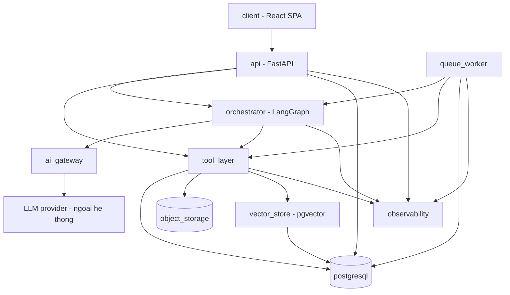

Mọi cạnh có một chiều duy nhất; không có cạnh nào đi ngược lại `Client`, `API`, `Worker`, `Orchestrator`, `ToolLayer`, `AIGateway` hay `VectorStore` — không tồn tại vòng phụ thuộc.

---

## 4. Data flow diagram — điểm chứa PII

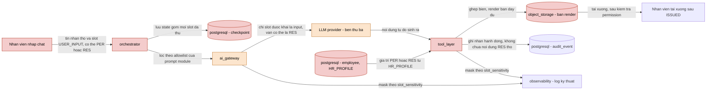

Hai mức tô màu, ứng với hai cơ chế ở NFR-05 của `01-prd.md`:

- **Đỏ — PII không bị giới hạn theo bước:** điểm chứa hoặc xử lý dữ liệu `PER`/`RES` ở dạng chưa mask. Trong đó có **checkpoint của `orchestrator`** trong `postgresql`: state LangGraph lưu mọi slot đã thu, nên nó là một kho PII ngang hàng với bảng `employee`, không phải dữ liệu kỹ thuật. Hệ quả: việc xoá slot `RES` khi `request` `EXPIRED` (A-014) phải xoá cả trong checkpoint — kể cả checkpoint của những bước trước, vì LangGraph giữ lịch sử state theo từng bước. Nếu không, giá trị đã xoá khỏi `request` vẫn còn nguyên trong lịch sử state. Thời hạn giữ checkpoint cũng thuộc phạm vi A-010.
- **Cam — PII đã bị allowlist giới hạn:** `ai_gateway` và LLM provider chỉ thấy những slot mà bước đang chạy tự khai cần. Allowlist thu hẹp **tập** slot đi ra ngoài hệ thống; nó **không** làm những slot đó bớt nhạy cảm. LLM provider là bên thứ ba, và `purpose` gửi tới đó vẫn là dữ liệu `RES`.

`observability` không tô màu vì mọi luồng vào nó đều mask theo `slot_sensitivity` — kể cả log của chính lời gọi LLM đã chở slot đó đi. Hai cơ chế gặp nhau đúng ở chỗ này: allowlist quyết định slot nào vào prompt, còn `slot_sensitivity` quyết định slot nào bị mask khi prompt đó được ghi log.

---

## 5. State machine — tái hiện từ `00-domain.md`, không đổi trạng thái nào

Ba máy trạng thái dưới đây **giống hệt** mục Vòng đời của `00-domain.md`. Cột "Thành phần sở hữu transition" là nội dung mới của Phase 2 — không đổi tên hay thêm/bớt trạng thái nào (DoD của Phase 2 cấm việc đó).

### 5.1 `request` — đúng một máy trạng thái cho mọi loại yêu cầu

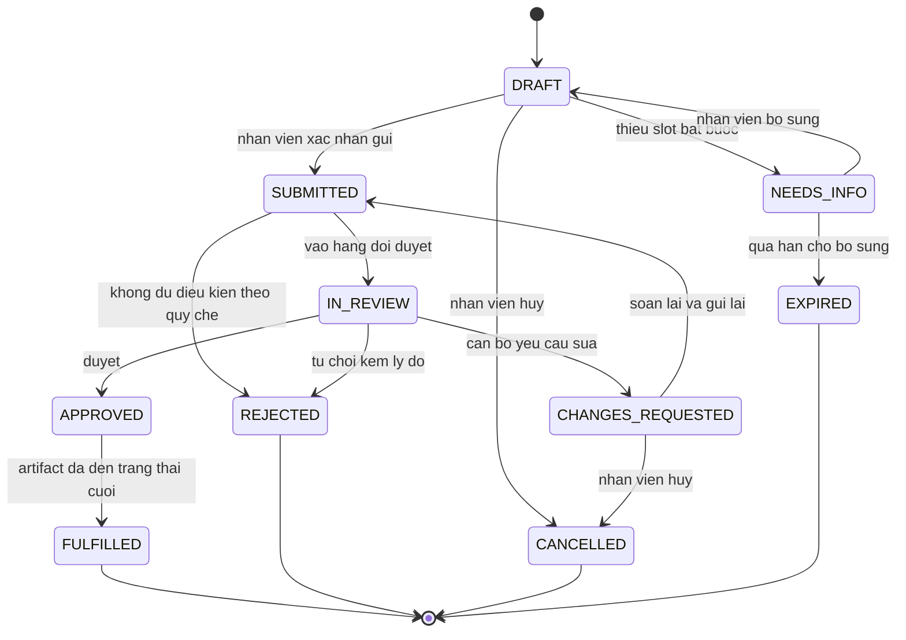

| Trạng thái | Thành phần sở hữu transition |
|---|---|
| `DRAFT` | `orchestrator` (thu slot qua chat) |
| `NEEDS_INFO` | `orchestrator` |
| `SUBMITTED` | `api` — giao dịch chuyển trạng thái và enqueue job render là **cùng một transaction** (D-010, ADR-004) |
| `IN_REVIEW` | `tool_layer`, kích hoạt khi `document` vào `PENDING_APPROVAL` |
| `CHANGES_REQUESTED` | `api`/`tool_layer`, permission `document.request_changes` |
| `APPROVED` | `api`/`tool_layer`, permission `document.approve_content` |
| `FULFILLED` | `tool_layer`, khi mọi artifact của `request` tới trạng thái cuối |
| `REJECTED` | `api`/`tool_layer`, permission `document.reject` |
| `CANCELLED` | `api` (nhân viên) |
| `EXPIRED` | `queue_worker` (Cron Job quét quá hạn — A-014) |

### 5.2 `document`

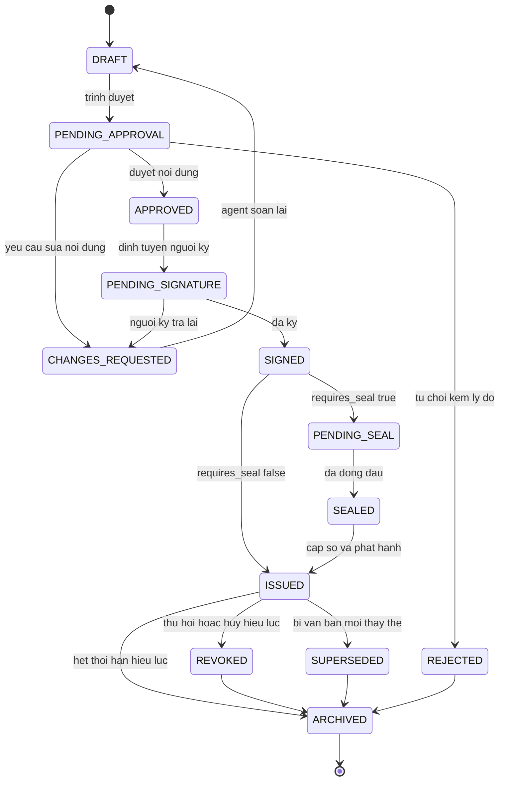

| Trạng thái | Thành phần sở hữu transition |
|---|---|
| `DRAFT` | `queue_worker` tạo ra (job render sau `SUBMITTED`, D-010); `queue_worker` cũng đưa `CHANGES_REQUESTED → DRAFT` về đây khi soạn lại |
| `PENDING_APPROVAL` | `queue_worker`, sau khi `tool_layer` xác nhận đủ điều kiện trình duyệt (F2) |
| `CHANGES_REQUESTED` | `api`/`tool_layer`, permission `document.request_changes` |
| `REJECTED` | `api`/`tool_layer`, permission `document.reject` |
| `APPROVED` | `api`/`tool_layer`, permission `document.approve_content` |
| `PENDING_SIGNATURE` | `tool_layer` (định tuyến ký) |
| `SIGNED` | `api`/`tool_layer`, permission `document.sign` |
| `PENDING_SEAL` | `tool_layer`, tự động khi `requires_seal = true` |
| `SEALED` | `api`/`tool_layer`, permission `document.apply_seal` |
| `ISSUED` | `api`/`tool_layer`, permission `document.issue`, giao dịch nguyên tử trên `document_register` |
| `REVOKED` | `api`/`tool_layer`, hai permission tách rời `document.revoke_initiate`/`document.revoke_confirm` |
| `SUPERSEDED` | `api`/`tool_layer` |
| `ARCHIVED` | `queue_worker` (Cron Job theo thời hạn lưu trữ, `TBD` — A-010) |

### 5.3 `room_booking` `[Should]`

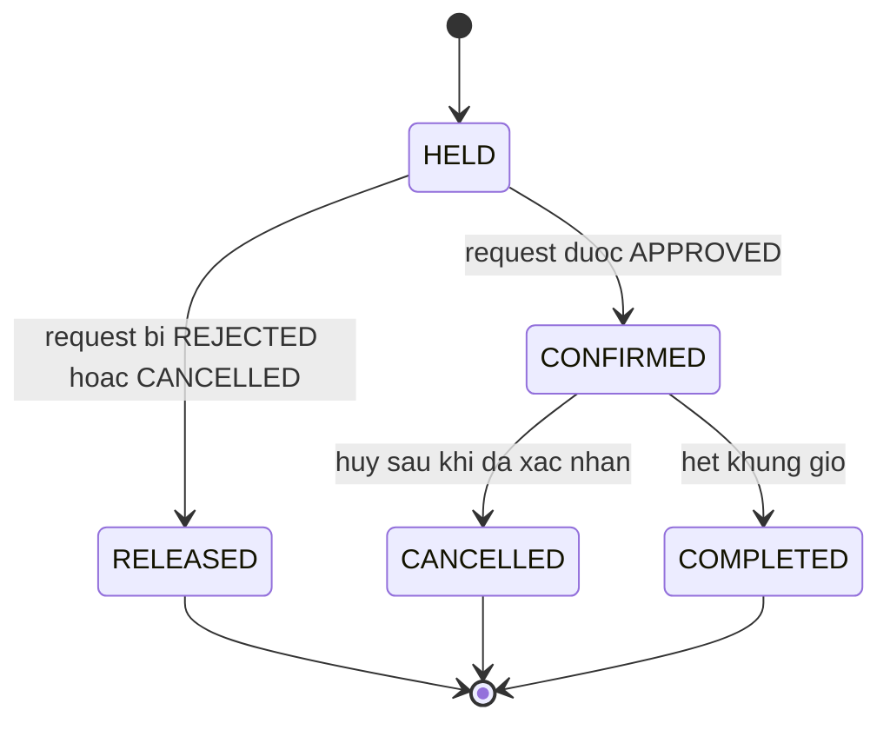

| Trạng thái | Thành phần sở hữu transition |
|---|---|
| `HELD` | `tool_layer`, tạo ngay khi `request` chuyển `SUBMITTED` (kiểm tra xung đột lịch — sequence diagram (f)) |
| `CONFIRMED` | `api`/`tool_layer`, permission `booking.confirm` |
| `RELEASED` | `api`/`tool_layer`, khi `request` bị `REJECTED`/`CANCELLED` |
| `CANCELLED` | `api`/`tool_layer` |
| `COMPLETED` | `queue_worker` (Cron Job theo `end_at` đã qua) |

### 5.4 Quan hệ `request` ↔ artifact

Không đổi so với mục Một Request, nhiều loại artifact của `00-domain.md`: một `request` sinh 0..n artifact (`document`, `room_booking` `[Should]`); `request` chuyển `FULFILLED` khi mọi artifact tới trạng thái cuối; sau đó artifact tiếp tục sống đời riêng (ví dụ `document` bị `REVOKED`) mà không kéo `request` ra khỏi `FULFILLED`. Về mặt component: `tool_layer` là nơi duy nhất kiểm tra điều kiện "mọi artifact đã tới trạng thái cuối" trước khi phát transition `FULFILLED`.

---

## 6. Sequence diagram

Mỗi luồng có ít nhất một nhánh lỗi/thay thế (đánh dấu `alt`/`else`).

### (a) Tạo yêu cầu qua chat → phân loại → thiếu slot → hỏi lại

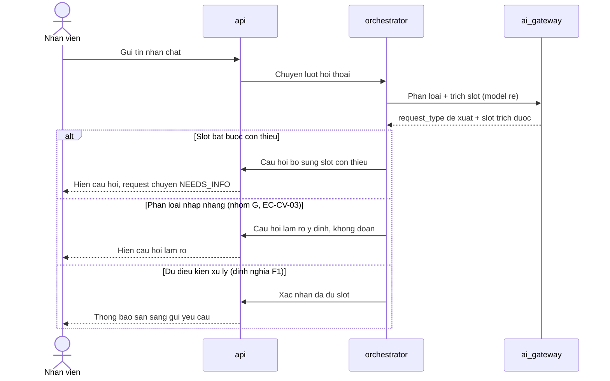

### (b) Sinh văn bản từ template + RAG

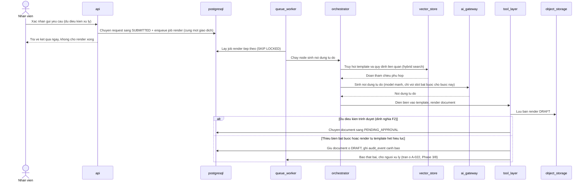

### (c) HITL duyệt/từ chối/yêu cầu sửa — `interrupt` + resume

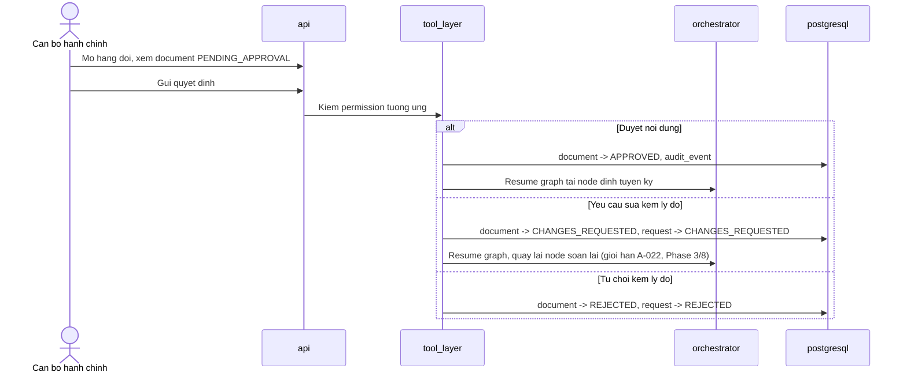

### (d) Phát hành + cấp số + đóng dấu

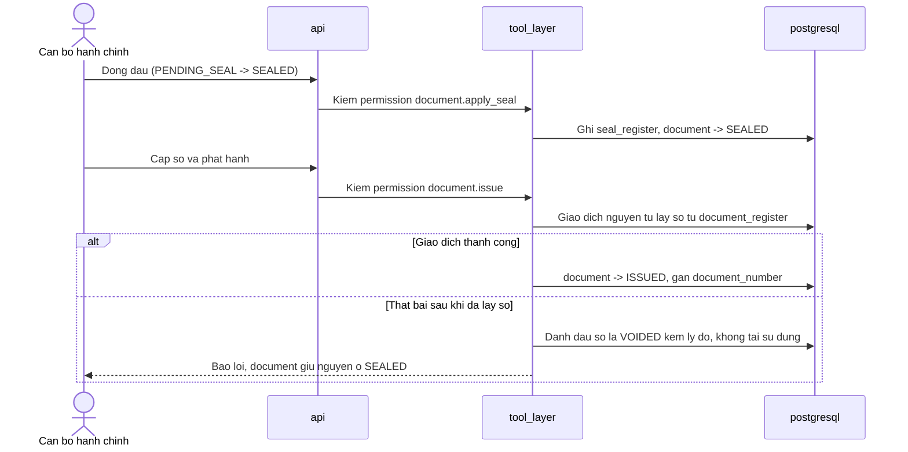

### (e) Thu hồi văn bản đã phát hành

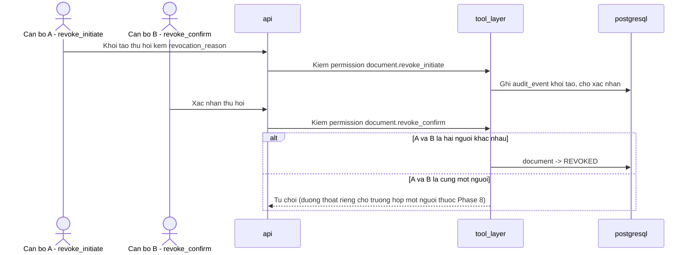

### (f) `[Should]` Đặt phòng họp có xung đột lịch

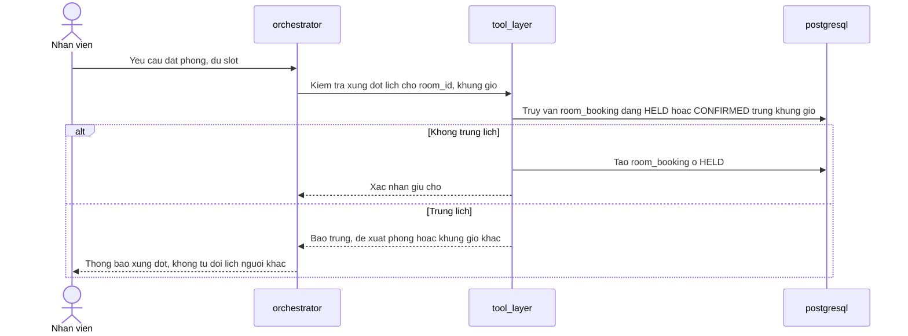

---

## 7. ADR mới ở phase này

- **ADR-002** — `vector_store` là `pgvector` trong `postgresql`, không phải vector DB riêng.
- **ADR-003** — `object_storage` là dịch vụ S3-compatible, bất biến đảm bảo ở tầng ứng dụng, vendor `TBD` (A-024).
- **ADR-004** — `queue_worker` dùng bảng job trong `postgresql`, không thêm Redis/Celery.
- **ADR-005** — `orchestrator` là thư viện dùng chung trong `api`/`queue_worker`, không phải service riêng.

Cả bốn ADR đều nêu **điều kiện đảo ngược** (hình dạng tín hiệu, không phải con số — vì A-002 chưa có số liệu tải) và **lý do loại phương án khác nhau giữa bốn ADR**, không dùng chung một khuôn lập luận.

---

## Open Questions

Không có câu hỏi mở nào chỉ tồn tại trong file này.

Giả định mới do Phase 2 phát sinh nằm ở `ASSUMPTIONS.md`: **A-024** (nhà cung cấp `object_storage` cụ thể), **A-025** (giới hạn thời gian request của Render). File này cũng phụ thuộc **A-002** (chưa có số liệu tải thật) — đây là lý do cả bốn ADR chỉ mô tả được hình dạng tín hiệu đảo ngược, không đặt được ngưỡng số.

Một mâu thuẫn giữa phase trước đã được tìm thấy và xử lý ở phase gốc, không phải ở đây: NFR-05 của `01-prd.md` (đã sửa, xem `CHANGELOG.md`) — chi tiết ở mục Đã đối chiếu ở đầu file này.
