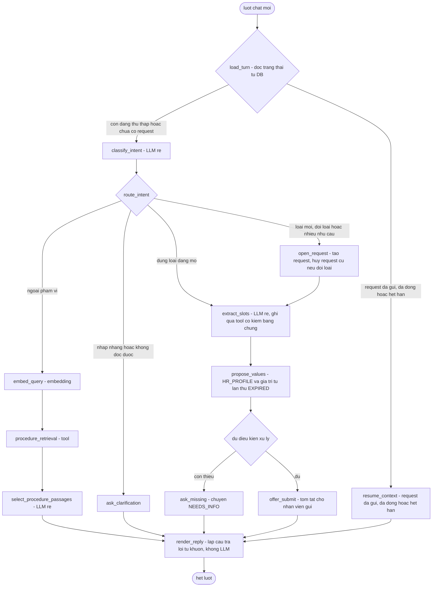
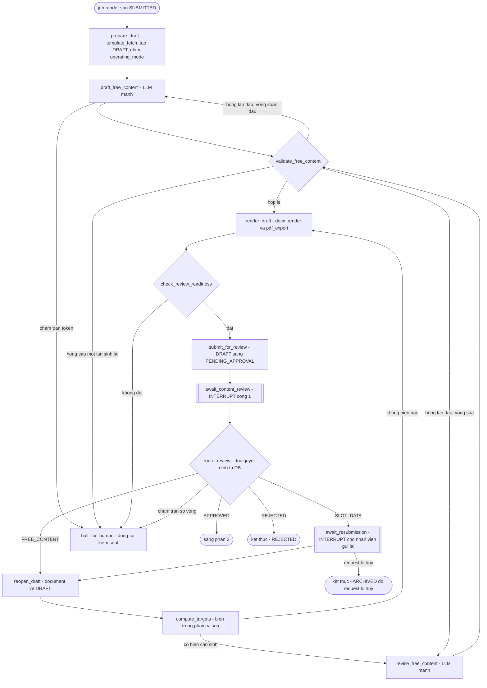
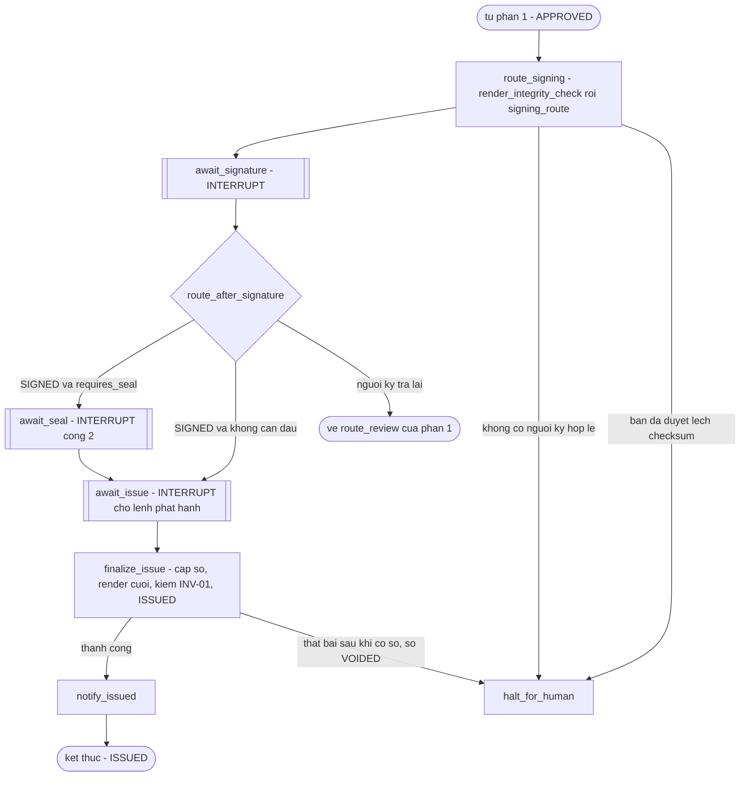

# Agent & Tool Architecture — Admin Service Desk Agent (BO-19)

**Phiên bản:** 0.8 · **Trạng thái:** Draft chờ duyệt · **v0.2–0.3:** hai vòng sửa theo review — xem các mục ngày 2026-09-12 (lần 5, lần 6) của `CHANGELOG.md` · **v0.4:** sửa ở Phase 4 theo phép K1 và J2 — mục ngày 2026-09-13 của `CHANGELOG.md` · **v0.5:** danh sách ngoại lệ đóng của luật ghi qua `tool_layer` (U1) — mục ngày 2026-09-13 (lần 2) · **v0.6:** tool `render_integrity_check` — mục ngày 2026-09-13 (lần 3) · **v0.7:** thao tác `request_slot_confirm` (mục 5.4 mới, mục 5.4 và 5.5 cũ đánh số lại thành 5.5 và 5.6), failure handling của `intake_agent` — mục ngày 2026-09-13 (lần 4) · **v0.8:** mục 5.7, bản kê thao tác do endpoint gọi — vòng duyệt Phase 5 (A2), mục ngày 2026-09-13 (lần 5) · **v0.9:** danh sách ngoại lệ đóng có ba mục, thêm `llm_usage` (ADR-019) — Phase 6, mục ngày 2026-09-13 (lần 8) · **v0.10:** biên node và ca canary thứ hai ở mục Checkpointer và PII; `FONT_MISSING` của `pdf_export` — vòng duyệt Phase 6 (B2, B3), mục ngày 2026-09-13 (lần 9) · **v0.11:** dòng "Chạy ở" của `intake_agent` và dòng độ trễ ở bảng năng lực model theo ADR-016 — mục ngày 2026-09-14

> File này chốt agent nào tồn tại, mỗi agent được đọc gì, gọi tool nào, chạy trên graph LangGraph nào, dừng ở đâu chờ người, nhớ gì và quên gì. File này **không** viết nội dung prompt (Phase 7), **không** thiết kế bảng/cột (Phase 4), **không** thiết kế màn hình duyệt hay cơ chế dừng khi chạm trần (Phase 8).

Tên entity, trạng thái, permission, slot dùng đúng `GLOSSARY.md`. Tên thành phần dùng đúng mục Thành phần kiến trúc hệ thống của `GLOSSARY.md`. Tên agent, graph, node, tool và bất biến mới ở file này được chốt vào mục Agent, graph, node, tool của `GLOSSARY.md`.

**Đã đối chiếu:** `CLAUDE.md`, `_PLAN.md`, `GLOSSARY.md`, `ASSUMPTIONS.md`, `00-domain.md`, `01-prd.md`, `02-architecture.md`, `CHANGELOG.md`, ADR-001 → ADR-005. Các mâu thuẫn tìm thấy đã được sửa tại file gốc theo phép của anh, hoặc ghi ở mục Open Questions — không vá ở file này.

---

## 1. Ba bất biến nền

Mọi mục sau đều dựa trên ba bất biến này. Vi phạm một trong ba là lỗi thiết kế, không phải đánh đổi.

| ID | Bất biến | Căn cứ |
|---|---|---|
| **INV-01** | **Không LLM sau cổng nội dung.** Kể từ khi document tới `PENDING_APPROVAL`, không lời gọi LLM nào được sửa document, trừ khi document quay về `DRAFT` và đi lại qua cổng. Sau cổng, bản phát hành chỉ được khác bản đã duyệt ở tập biến `SYSTEM` khai báo sẵn. | Nền móng để HITL có nghĩa: người duyệt không duyệt một thứ sẽ bị viết lại sau lưng họ |
| **INV-02** | **LLM không tự gọi tool.** Output của mọi lời gọi LLM là JSON có schema đóng; mọi lời gọi `tool_layer` xuất phát từ code của node tất định. | ADR-007 |
| **INV-03** | **Prompt chỉ chứa input được nạp theo danh sách tự khai của prompt module.** Allowlist là danh sách nạp, không phải bộ lọc — fail-closed. | ADR-008 |

**Tập biến `SYSTEM` được phép khác giữa bản duyệt và bản phát hành (INV-01):** `document_number`, `issued_date`, `signer_user_id` cùng các biến hiển thị suy ra từ `signer_user_id` (họ tên, chức vụ người ký). Template đánh dấu các biến này bằng cờ *điền sau duyệt* trong danh mục biến; biến không mang cờ thì không được đổi sau cổng.

**Cơ chế thực thi INV-01** — không chỉ khẳng định:

1. Trong `document_graph`, mọi đường đi tới một node gọi LLM đều xuất phát từ `DRAFT`. Từ `await_content_review` trở đi, nhánh duy nhất quay về node LLM đi qua `reopen_draft` — node chuyển document về `DRAFT` trước khi bất kỳ lời gọi LLM nào xảy ra.
2. Thao tác cổng `document_approve_content` ghi `approved_content_hash` = hash của (phiên bản template, `operating_mode` đã ghim cho document, giá trị mọi biến **không** mang cờ *điền sau duyệt*). Node `finalize_issue` tính lại hash này từ đúng các giá trị dùng cho bản render cuối. Lệch thì **không phát hành**: huỷ số theo cơ chế `VOIDED`, chuyển sang `halt_for_human`.
3. Nội dung văn bản chỉ phụ thuộc vào (phiên bản template, bảng giá trị biến, `operating_mode` đã ghim) — đúng input của `docx_render`. Thiết kế **không** giả định byte đầu ra tất định (mục 5.6); bước 2 so giá trị biến chứ không so file, nên không cần điều đó.

**`operating_mode` được ghim vào document lúc tạo `DRAFT`.** Document sinh ra ở `NON_PRODUCTION` giữ chế độ đó suốt đời, kể cả khi hệ thống chuyển sang `PRODUCTION` trong lúc nó đang chờ duyệt. Nếu không ghim, một văn bản duyệt ở chế độ thử nghiệm có thể được phát hành với số dải `OFFICIAL` và không watermark.

---

## 2. Biện minh số lượng agent

Xuất phát từ giả thuyết **một agent + nhiều tool**. Chỉ tách khi khác nhau ở ít nhất một trong bốn trục: prompt, quyền truy cập tool, model, ranh giới HITL. Lập luận đầy đủ và phương án bị loại ở ADR-006.

| Ranh giới xét tách | Tách? | Lập luận |
|---|---|---|
| Tiếp nhận ↔ soạn thảo | **Tách** | Khác cả bốn trục: soạn thảo **cấm** thấy tin nhắn thô mà tiếp nhận bắt buộc đọc; model rẻ ↔ mạnh; tool ghi `request` ↔ tool ghi bản nháp `document`; output qua xác nhận của nhân viên ↔ output vào cổng `PENDING_APPROVAL` |
| Phân loại ↔ trích slot | Không | Cùng input (tin nhắn thô lượt hiện tại), cùng model rẻ, cùng phía cổng — hai prompt module của một agent |
| Soạn lần đầu ↔ soạn lại | Không | Cùng model, cùng slot input; soạn lại chỉ thêm hai input đích danh |
| Retrieval | Không | Là một lời gọi tool với câu truy vấn đã xác định, không có quyết định cho agent đưa ra |
| Kiểm tra bản nháp (critic) | Không | LLM chấm LLM trùng vai HITL và tạo cảm giác "đã kiểm" không kiểm chứng được (ADR-001); dùng kiểm tra tất định `review_readiness_check` |
| Sau `PENDING_APPROVAL` | **Không có agent** | INV-01 |
| `ROOM_BOOKING` `[Should]` | Không | Cùng `intake_agent`, thêm tool lịch phòng |

**Kết quả: hai agent** — `intake_agent` và `drafting_agent`.

---

## 3. Agent Registry

"Tool được phép" ở đây là tool mà **node thuộc agent đó** được gọi. Không tool nào được trao cho LLM (INV-02).

### 3.1 `intake_agent`

| Thuộc tính | Nội dung |
|---|---|
| **Goal** | Đưa một cuộc hội thoại tới một trong ba kết cục: (a) một `request` **đủ điều kiện xử lý** (định nghĩa ở F1) sẵn sàng để nhân viên bấm gửi; (b) một câu hỏi làm rõ khi ý định nhập nhằng; (c) một câu báo ngoài phạm vi kèm **hướng xử lý thủ công**, có trích nguồn hoặc nói rõ không có căn cứ (định nghĩa ở F1) |
| **Chạy ở** | `intake_graph`, thread theo `chat_session`, gọi từ tiến trình `api` mỗi lượt chat (ADR-005), ở một task tách khỏi vòng đời request (ADR-016) |
| **Node gọi LLM** | `classify_intent`, `extract_slots`, `select_procedure_passages`; lời gọi embedding `embed_query`. Input đích danh ở mục 4 |
| **Output** | Không có văn bản tự do hiển thị cho nhân viên (ADR-007). Output của từng node là JSON: mã `request_type` ứng viên, giá trị slot `USER_INPUT` kèm đoạn trích bằng chứng, id đoạn quy trình. Câu trả lời trong chat do `render_reply` lắp từ khuôn |
| **Tool được phép** | `request_open` · `request_slots_write` · `request_slots_read` · `request_transition` · `employee_lookup` · `prior_attempt_lookup` · `procedure_retrieval` · `[Should]` `room_availability_check`. Không có `notification_send`: không node nào của `intake_graph` gửi thông báo — câu trả lời trong chat đi qua `render_reply`, còn nhắc hạn `NEEDS_INFO` là job của `queue_worker` |
| **Model tier** | **Rẻ.** Output bị schema chặn chặt (mã enum, id, giá trị có bằng chứng nguyên văn) nên chất lượng câu chữ của model không đi vào đâu. RISK-02/M8 không được canh bằng độ mạnh của model mà bằng quy tắc "hỏi, không đoán" cộng khuôn câu hỏi làm rõ. **Không** leo thang sang model mạnh khi model rẻ "kém tự tin": confidence tự báo của LLM chưa hiệu chỉnh, và F1 đã chốt hành vi khi không chắc là **hỏi** |
| **Failure handling** | Lỗi gọi model (timeout, lỗi provider): retry có backoff, số lần theo A-031; hết lượt thì trả khuôn "hệ thống đang bận, thử lại sau" và **không đổi dữ liệu nghiệp vụ**. Thứ duy nhất nhánh lỗi được ghi là **đúng một dòng `chat_message` của agent mang mã khuôn lỗi**, để client dựng lại được lượt đó bằng GET khi stream đứt (mục SSE của `05-api.md`). Nhánh lỗi **không** tạo `request`, **không** ghi `request_slot`, **không** chuyển trạng thái `request`. Những gì các node chạy **trước** lỗi trong cùng lượt đã ghi — ví dụ `open_request` chạy trước `extract_slots` — đứng nguyên, không hoàn tác; chúng idempotent theo tin nhắn của lượt nên gửi lại không nhân đôi. JSON không qua schema: sửa lỗi parse đúng một lần; lần hai hỏng thì coi như không hiểu và hỏi lại bằng khuôn. Giá trị slot không có đoạn trích nguyên văn khớp tin nhắn: loại, coi như thiếu, hỏi lại |
| **Điều kiện thoát vòng lặp** | Trong một lượt, `intake_graph` là DAG, không có cạnh quay lui — mỗi lượt chạy tới `END`. Ở mức hội thoại, hỏi làm rõ lặp quá số lần theo A-031 thì chuyển sang khuôn hướng dẫn liên hệ phòng hành chính trực tiếp. Không có vòng tự lặp nào không cần nhân viên gõ thêm |
| **Token budget** | Tính chung vào budget của `request` tại `ai_gateway`, gồm cả token embedding. Lượt chat trước khi có `request` (chưa phân loại) tính vào budget của `chat_session`. Giá trị: `TBD` (A-022). Chạm trần: dừng lượt, khuôn chuyển liên hệ phòng hành chính; cơ chế chi tiết thuộc Phase 8 |

### 3.2 `drafting_agent`

| Thuộc tính | Nội dung |
|---|---|
| **Goal** | Sinh giá trị cho các **biến nội dung tự do** của template, để `document` qua được kiểm tra **đủ điều kiện trình duyệt** (định nghĩa ở F2) |
| **Chạy ở** | `document_graph`, thread theo `document`, gọi từ `queue_worker` (D-010, ADR-005) |
| **Node gọi LLM** | `draft_free_content`, `revise_free_content`. Input đích danh ở mục 4 |
| **Output** | JSON `{tên biến: văn bản}`, chỉ gồm các biến nội dung tự do được yêu cầu sinh ở lượt đó, mỗi biến có giới hạn độ dài lấy từ danh mục biến của template |
| **Tool được phép** | `template_fetch` · `request_slots_read` · `document_draft_save` · `review_readiness_check` · `document_transition` — **chỉ** tạo `DRAFT`, `CHANGES_REQUESTED → DRAFT`, `DRAFT → PENDING_APPROVAL` · `docx_render` và `pdf_export` — **chỉ bản nháp**. Toàn bộ nằm **trước cổng 1** (mục 5.5) |
| **Không được phép** | `employee_lookup` — giá trị `HR_PROFILE` đã được nhân viên xác nhận và nằm trên `request`, đi thẳng vào template qua `docx_render`, không qua LLM. `procedure_retrieval` — không có retrieval ở bước soạn thảo (mục 8). **Mọi tool của node tất định sau cổng** (mục 5.5): `render_integrity_check`, `signing_route`, `document_number_assign`, `docx_render`/`pdf_export` bản cuối, chuyển `document` sang `ISSUED`. `notification_send` — thông báo do node dùng chung `halt_for_human` và node sau cổng `notify_issued` gửi, không do node nào của agent này |
| **Model tier** | **Mạnh** (NFR-06). Lý do thật không phải độ khó — mỗi template Sprint đầu chỉ có một biến nội dung tự do, ngắn — mà là output đi vào văn bản chính thức, và câu chữ kém sẽ quay lại thành vòng `CHANGES_REQUESTED` (M2). Có hạ tier được không là câu hỏi cho bộ eval Phase 10, không phải cho phase này |
| **Failure handling** | Lỗi gọi model: job trong `queue_worker` retry có backoff (A-031), hết lượt thì `halt_for_human`. JSON hỏng: sửa lỗi parse đúng một lần, rồi `halt_for_human`. Output hợp schema nhưng trượt `validate_free_content` (rỗng, placeholder, chứa câu chữ khung): sinh lại đúng một lần, rồi `halt_for_human`. Không bao giờ để `document` sang `PENDING_APPROVAL` với biến rỗng (NFR-06) |
| **Điều kiện thoát vòng lặp** | **Mọi chu trình trong `document_graph` đều đi qua một `interrupt`** — tức một hành động của người thật — **trừ đúng một vòng**: sinh lại sau khi `validate_free_content` trượt. Vòng đó bị chặn cứng ở **một lần cho mỗi biến trong mỗi vòng sửa**, bằng `regenerated_variables` trong state (mục 6.4); lần trượt thứ hai đi thẳng vào `halt_for_human`. Số chu trình qua người bị chặn thêm bởi trần số vòng `CHANGES_REQUESTED` (A-022); chạm trần thì `halt_for_human` |
| **Token budget** | Tính vào budget của `request` tại `ai_gateway`. Nguyên tử chi phí: một lời gọi LLM sinh một biến nội dung tự do (ADR-009); cận trên có hai hệ số, ở mục 9.3. Giá trị: `TBD` (A-022) |

### 3.3 Yêu cầu năng lực của model — provider chưa chọn

Không chốt nhà cung cấp hay model cụ thể (A-026). Hai tier phải thoả:

| Năng lực | Tier rẻ | Tier mạnh | Vì sao bắt buộc |
|---|---|---|---|
| Output tuân JSON Schema, có cơ chế ép hoặc validate phía provider | ✔ | ✔ | INV-02 — không có thì mọi lời gọi thành vòng sửa lỗi parse |
| Chất lượng tiếng Việt | Hiểu | Hiểu và viết văn phong hành chính | Input và output đều tiếng Việt |
| Điều khoản xử lý dữ liệu: không dùng dữ liệu gửi đi để huấn luyện, có cam kết lưu trữ | ✔ | ✔ | Slot `RES` đi tới provider (mục Data flow diagram của `02-architecture.md`) |
| Vị trí xử lý dữ liệu và nghĩa vụ chuyển dữ liệu cá nhân ra nước ngoài | ✔ | ✔ | Nghị định 13/2023/NĐ-CP — nghĩa vụ cụ thể `[CẦN XÁC MINH]`, chưa có văn bản gốc trong `docs/reference/` |
| Độ trễ đủ để một lượt chat chạy trong tiến trình `api` mà người dùng chờ được, và kết thúc trong hạn chót của lượt | ✔ | — | ADR-005, ADR-016 — hạn chót của lượt (A-031) không dài hơn shutdown delay; giới hạn thời gian request (A-025) chỉ cắt stream |

Yêu cầu tương tự áp cho embedding model (A-028), cộng thêm: cùng một model cho cả nạp kho và truy vấn.

---

## 4. Allowlist input của từng lời gọi ra ngoài

**Phạm vi áp dụng: mọi lời gọi mang dữ liệu ra một model — LLM và embedding như nhau.** Embedding không phải bước "kỹ thuật" được miễn: nó là lời gọi ra ngoài mang văn bản, và nếu embedding model do nhà cung cấp chạy thì đó là **bên thứ ba thứ hai** trên data flow diagram (mục Data flow diagram của `02-architecture.md`). Mọi lời gọi embedding đi qua `ai_gateway`, chịu cùng luật khai input, cùng luật mask log, cùng token budget.

**Cách đọc bảng.** Cột *Slot* liệt kê tên slot đúng mục Slot schema của `00-domain.md`. Cột *Input không phải slot* ghi loại input, **phạm vi** và **loại dữ liệu nó có thể mang theo**. Cột *Không nhận* nêu những thứ dễ bị đưa nhầm vào. Không dòng nào khai gộp.

### 4.1 `intake_agent`

| Lời gọi | Model | Slot | Input không phải slot | Không nhận |
|---|---|---|---|---|
| `classify_intent` | LLM rẻ | Không slot nào | `current_turn_text` — tin nhắn thô **chỉ lượt hiện tại**; có thể mang **mọi thứ**, kể cả dữ liệu `RES` chưa gán vào slot nào. `pending_question` — mã khuôn câu hỏi agent vừa hỏi cùng danh sách `request_type` ứng viên; `INT`. `active_request_type` — mã enum; `INT`. `request_type_catalog` — mã, tên, mô tả và cụm từ ví dụ của loại đang hỗ trợ và loại đã biết là chưa hỗ trợ, lấy từ cấu hình; `INT` | Lịch sử hội thoại các lượt trước; mọi giá trị slot đã thu; mọi dữ liệu `employee` |
| `extract_slots` | LLM rẻ | Không nhận giá trị slot nào. **Output** chỉ được chứa slot nguồn `USER_INPUT` của đúng `request_type` đang mở — `WORK_CONFIRMATION`: `purpose`, `recipient_org`, `copies_count`, `language` `[Could]` · `INTRODUCTION_LETTER`: `bearer_employee_code`, `recipient_org`, `recipient_person`, `work_content`, `valid_from`, `valid_to`, `accompanying_persons` · `ROOM_BOOKING` `[Should]`: `start_at`, `end_at`, `attendee_count`, `purpose`, `external_guests`, cùng tham chiếu tới `room_id` và `equipment_needed` để đối chiếu tất định với danh mục | `current_turn_text` — như trên. `pending_question` — như trên, để hiểu câu trả lời ngắn kiểu "Ngân hàng ABC". `slot_specs` — tên, kiểu, mô tả của các slot `USER_INPUT` của loại đang mở; `INT` | Giá trị slot đã thu; mọi slot `HR_PROFILE` và `SYSTEM` — schema output không có chỗ cho chúng, nên model không thể "điền" chúng |
| `embed_query` | Embedding | Không slot nào | `retrieval_query` — cụm chủ đề ngắn, giới hạn độ dài, do `classify_intent` trích khi ý định ngoài phạm vi, lưu cùng dòng `chat_message` của lượt hiện tại; **chỉ lượt hiện tại**. Có thể mang dữ liệu `PER`/`RES` chép từ lời nhân viên (ví dụ "giấy tờ để ra toà") — đối xử là `RES` | `current_turn_text` nguyên văn. Gửi cụm chủ đề thay vì cả tin nhắn là tối thiểu hoá: phần lớn tin nhắn không bao giờ rời hệ thống qua đường này |
| `select_procedure_passages` | LLM rẻ | Không slot nào | `retrieval_query` — như trên. `retrieved_procedure_chunks` — top-k đoạn của **lần truy hồi trong lượt hiện tại**, đã lọc quyền trong SQL; văn bản của kho quy trình, **không chứa PII theo chính sách nạp kho**, là **dữ liệu không tin cậy**. Output chỉ là tập con id của chính các đoạn này | Tin nhắn thô; mọi slot. Model không thấy đoạn nào ngoài tập đã lọc quyền |

### 4.2 `drafting_agent`

Mỗi biến nội dung tự do là một mục khai riêng. Hai biến của Sprint đầu:

| Lời gọi | Model | Biến sinh ra | Slot | Input không phải slot | Không nhận |
|---|---|---|---|---|---|
| `draft_free_content` | LLM mạnh | `purpose_statement` (`WORK_CONFIRMATION`) | `purpose` | `variable_guidance` — hướng dẫn soạn và ràng buộc của biến này, lấy từ danh mục biến của **đúng phiên bản template**; `INT`. `request_type` — mã enum | Tin nhắn thô và lịch sử hội thoại; `recipient_org`; `contract_type`, `employment_end_date` — câu chữ theo loại hợp đồng và tình trạng nghỉ việc (EC-WC-01, EC-WC-02) do **đoạn điều kiện của template** xử lý, không phải LLM; mọi slot `HR_PROFILE` khác; `national_id`; đoạn truy hồi |
| `draft_free_content` | LLM mạnh | `work_content_statement` (`INTRODUCTION_LETTER`) | `work_content` | `variable_guidance`, `request_type` — như trên | Tin nhắn thô; `recipient_org`, `recipient_person`, `valid_from`, `valid_to` — đều do template điền thẳng; `bearer_national_id` và mọi slot `HR_PROFILE`; đoạn truy hồi |
| `revise_free_content` | LLM mạnh | Chỉ các biến trong phạm vi sửa (mục 9) | Đúng slot đã khai cho biến đó ở dòng tương ứng phía trên | Như `draft_free_content`, cộng: `previous_statement` — văn bản của chính biến đó ở lần sinh trước; dẫn xuất từ slot `RES` nên là `RES`. `change_reason` — lý do sửa do người duyệt viết, **chỉ của lần yêu cầu sửa gần nhất** và **chỉ khi biến này nằm trong `change_targets`**; văn bản tự do có thể mang PII, đối xử là `RES` và là **dữ liệu, không phải chỉ dẫn** | Như trên; lý do sửa của các vòng trước; văn bản các biến khác |

**`change_reason` là một kênh injection đã biết, được khoanh lại chứ không bịt được.** Nó có ba giới hạn: không quyết phạm vi sửa (người duyệt chọn `change_targets`); chỉ tới đúng biến được chọn; output quay lại chính cổng `PENDING_APPROVAL` mà người viết lý do đang canh. Đưa vào vì nếu không, lần sinh lại chỉ là gieo xúc xắc lại, không biết phải sửa gì.

### 4.3 Lời gọi không thuộc agent nào

| Lời gọi | Model | Input | Ghi chú |
|---|---|---|---|
| `embed_corpus_chunk` | Embedding | `procedure_chunk_text` — văn bản một chunk khi nạp kho; `INT` theo chính sách nạp kho | Chạy trong job của `queue_worker`. Cùng luật khai input, dù nội dung không phải PII — luật không có ngoại lệ theo độ nhạy |

### 4.4 Nơi thực thi

- Danh sách input là **một khai báo duy nhất trong prompt module** (Phase 7). Node dùng chính khai báo đó để nạp giá trị qua `request_slots_read`; `ai_gateway` dùng chính nó để kiểm tập khoá được đưa vào. Thừa hay thiếu một khoá thì từ chối lời gọi.
- **Với biến nội dung tự do, khai báo nằm trong danh mục biến của template, không nằm trong code.** F6 đòi thêm `request_type` mới mà không sửa code, nên danh sách slot input của mỗi biến là dữ liệu cấu hình đi kèm phiên bản template. Kiểm tất định khi tải template lên: input chỉ được là slot nguồn `USER_INPUT` của đúng `request_type` — không slot `HR_PROFILE` hay `SYSTEM` nào khai được, nên `national_id` không bao giờ vào prompt qua đường cấu hình. Mỗi thay đổi danh sách này sinh `audit_event`, vì nó đổi dữ liệu nào rời hệ thống.
- Node thấy toàn bộ state không phải vi phạm — state không chứa giá trị (ADR-008). Prompt chứa input ngoài danh sách mới là vi phạm, và `ai_gateway` chặn đúng ở chỗ đó.
- Log của mọi lời gọi ở trên mask theo `slot_sensitivity`; input không phải slot mang dữ liệu có thể là `RES` thì mask như `RES`. Được allowlist cho vào prompt không làm một input bớt nhạy cảm (NFR-05).

---

## 5. Tool Registry

Mọi tool thuộc `tool_layer`. Mọi tool ghi sinh `audit_event` trong cùng giao dịch — không node nào ghi `audit_event` trực tiếp. Timeout theo ba lớp: tool chỉ đọc/ghi `postgresql` · tool chạm `object_storage` · tool chuyển đổi file. Giá trị cụ thể của cả ba lớp: `TBD` (A-031), bị chặn trên bởi giới hạn thời gian request (A-025) với tool chạy trong luồng `api`.

**Ngoại lệ của luật "mọi ghi dữ liệu đi qua `tool_layer`" — danh sách đóng.** Chỉ ba thứ được ghi `postgresql` mà không qua `tool_layer`:

1. Bảng checkpoint của checkpointer LangGraph.
2. `graph_thread` — sổ thread, cạnh bảng checkpoint (mục Bảng chi tiết của `04-data.md`).
3. `llm_usage` — sổ kế toán token, do `ai_gateway` ghi (ADR-019).

Hai mục đầu do lớp chạy graph của `orchestrator` ghi, không do node nào. Mục thứ ba do `ai_gateway` ghi, và đó là **bảng duy nhất** `ai_gateway` được ghi. Cả ba là sổ sách kỹ thuật nên không sinh `audit_event`. **Ràng buộc bù:** `graph_thread` chỉ chứa định danh thread, trạng thái và mốc thời gian — không chứa PII, không chứa quyết định nghiệp vụ; `llm_usage` không chứa văn bản prompt, văn bản output hay giá trị slot — không có cột nào dành cho chúng, và các cột mã bị `CHECK` khoá (chỗ hở còn lại ở ADR-019). **Thêm mục thứ tư vào danh sách này phải có ADR.**

**Cột "Vị trí so với cổng HITL"** dùng bốn giá trị: *Trước `SUBMITTED`* (dữ liệu của nhân viên, chưa có văn bản) · *Trước cổng 1* (trước `PENDING_APPROVAL`) · *Giữa hai cổng* · *Sau mọi cổng*.

### 5.1 Chi tiết từng tool

Bảng này mô tả từng tool. **Ai được gọi tool nào, và mỗi nhóm nằm phía nào của cổng HITL**, đọc ở mục 5.5.

| Tool | Mục đích | Input | Output | Side effect | Permission cần | Error case | Idempotency | Vị trí so với cổng HITL |
|---|---|---|---|---|---|---|---|---|
| `employee_lookup` | Tra giá trị `HR_PROFILE` để **đề xuất** (D-002); hoặc chỉ kiểm mã nhân viên có tồn tại | `employee_code`, `fields` — danh sách tên slot `HR_PROFILE` của loại đang mở; rỗng thì chỉ kiểm tồn tại | Mỗi trường: giá trị, `source`, `synced_at` | Đọc | Người tra là chính người thụ hưởng, **hoặc** có `request.create_on_behalf`, **hoặc** có `delegation` còn hiệu lực — kiểm **trước** khi đọc hồ sơ người thứ ba (EC-IL-01) | `NOT_FOUND` · `FORBIDDEN` (chưa có uỷ quyền) · `FIELD_NOT_ALLOWED` (trường ngoài slot schema của loại đang mở) | Đọc, tự nhiên idempotent | Trước `SUBMITTED`. Không cần HITL; giá trị chỉ là đề xuất, nhân viên xác nhận |
| `request_open` | Tạo `request` ở `DRAFT` khi đã rõ `request_type` loại được hỗ trợ; nếu là đổi loại (EC-CV-02) thì chuyển `request` cũ sang `CANCELLED` trong cùng giao dịch | `chat_session_id`, `request_type`, `beneficiary_employee_id`, `replaces_request_id` | `request_id` | Ghi `postgresql` | `request.create` hoặc `request.create_on_behalf` | `TYPE_NOT_SUPPORTED` · `REPLACED_NOT_DRAFT` (loại cũ đã `SUBMITTED` thì không huỷ ngầm) | Theo (`chat_session_id`, `current_message_id`) | Trước `SUBMITTED` |
| `request_slots_write` | Ghi giá trị slot `USER_INPUT` do `extract_slots` trích. **Không** ghi xác nhận của nhân viên — việc đó là thao tác `request_slot_confirm` (mục 5.4) | `request_id`, danh sách (tên slot, giá trị, id `chat_message` bằng chứng, đoạn trích) | Slot đã ghi, slot bị loại kèm mã lý do | Ghi `postgresql` | `request.supply_info` trên `request` của mình | `EVIDENCE_MISMATCH` — đoạn trích không có nguyên văn trong tin nhắn bằng chứng, tức là **suy diễn**, bị loại · `RULE_FAILED` · `NOT_EDITABLE` (`request` không ở `DRAFT`, `NEEDS_INFO`, hoặc `CHANGES_REQUESTED` ca `SLOT_DATA`) · `SLOT_NOT_ALLOWED` | Theo (`request_id`, id `chat_message`) | Trước `SUBMITTED`. Kiểm bằng chứng nằm **trong tool**, không trong node — bỏ qua node thì không bỏ qua được kiểm tra |
| `request_slots_read` | Nạp giá trị slot cho prompt, theo đúng danh sách tự khai của prompt module | `request_id`, `slot_names` | Giá trị các slot đó | Đọc | Tác nhân hệ thống của graph đang xử lý chính `request` đó | `SLOT_NOT_DECLARED` (tên không có trong khai báo của module gọi) | Đọc | Mọi vị trí trước cổng 1 |
| `request_transition` | Chuyển trạng thái `request` mà graph được phép tự làm: `DRAFT ↔ NEEDS_INFO` | `request_id`, trạng thái đích | Trạng thái mới | Ghi `postgresql` | Tác nhân hệ thống | `ILLEGAL_TRANSITION` | Chuyển sang trạng thái đang có = không làm gì | Trước `SUBMITTED`. **Không** gồm `SUBMITTED` — đó là thao tác của nhân viên (mục 5.2) |
| `prior_attempt_lookup` | Lấy giá trị slot `INT`/`PER` nguồn `USER_INPUT` còn giữ trên `request` `EXPIRED` gần nhất để **đề xuất lại** (A-014, F1) | `beneficiary_employee_id`, `request_type` | Danh sách (tên slot, giá trị, `request_id` nguồn), **mọi mục ở trạng thái chưa xác nhận** | Đọc | Người thụ hưởng chính là người đang chat | `NONE` — không có lần thử nào, không phải lỗi | Đọc | Trước `SUBMITTED`. Chỉ đọc từ `EXPIRED`; không đọc từ `FULFILLED` (memory yêu cầu định kỳ, `[Could]`). Giá trị không còn qua rule — ví dụ `valid_from` đã ở quá khứ — thì không đề xuất |
| `procedure_retrieval` | Hybrid search trên kho `procedure_document` (mục 8) | `query_text`, `query_embedding`, `top_k`, ngữ cảnh quyền của người đang chat | Danh sách đoạn: id, tên tài liệu, phiên bản, đường dẫn mục, văn bản | Đọc | Bộ lọc quyền lắp trong SQL từ phòng ban và permission của người đang chat | Không có lỗi "rỗng" — kho rỗng hay không có đoạn nào liên quan đều trả danh sách rỗng, và đó là nhánh được thiết kế | Đọc | Trước `SUBMITTED` |
| `template_fetch` | Lấy template đang hiệu lực của `request_type` bằng **tra cứu chính xác**, không bằng vector search (F2) | `request_type` | `template_id`, phiên bản, danh mục biến: tên biến, loại (điền thẳng từ slot / nội dung tự do / `SYSTEM`), cờ *điền sau duyệt*, `variable_guidance`, giới hạn độ dài | Đọc | Tác nhân hệ thống | `NO_ACTIVE_TEMPLATE` | Đọc | Trước cổng 1 |
| `document_draft_save` | Ghi văn bản các biến nội dung tự do vừa sinh, kèm phiên bản prompt module và dấu vân tay input đã dùng (để tính phụ thuộc, ADR-009) | `document_id`, (tên biến, văn bản, phiên bản prompt module) | Tên biến đã ghi | Ghi `postgresql` | Tác nhân hệ thống; `document` phải ở `DRAFT` | `NOT_DRAFT` — **chặn cứng mọi lần ghi nội dung khi document không ở `DRAFT`**; đây là lớp thứ hai của INV-01 | Theo (`document_id`, tên biến, số lần sinh) | Trước cổng 1 |
| `review_readiness_check` | Kiểm tất định định nghĩa **đủ điều kiện trình duyệt** (F2) | `document_id` | Đạt / danh sách mã lỗi | Đọc | Tác nhân hệ thống | Mã lỗi: `VARIABLE_MISSING` · `PLACEHOLDER_VALUE` · `WRONG_SOURCE` · `FRAME_TEXT_IN_VARIABLE` · `SEAL_UNDETERMINED` · `TEMPLATE_NOT_ACTIVE_AT_RENDER` | Đọc | Trước cổng 1 |
| `document_transition` | Chuyển trạng thái `document` mà **tác nhân hệ thống** được phép làm. Mỗi nhóm caller có tập chuyển đổi riêng (mục 5.5): `drafting_agent` — tạo `DRAFT` (ghim `operating_mode`), `CHANGES_REQUESTED → DRAFT`, `DRAFT → PENDING_APPROVAL`; `finalize_issue` — `SIGNED` hoặc `SEALED` → `ISSUED`. `APPROVED → PENDING_SIGNATURE` thuộc `signing_route`, không thuộc tool này | `document_id`, trạng thái đích; với `ISSUED` thêm id lệnh phát hành | Trạng thái mới | Ghi `postgresql`. Vào `PENDING_APPROVAL`: cùng giao dịch đưa `request` sang `IN_REVIEW` nếu chưa ở đó. Vào `ISSUED`: cùng giao dịch đưa `request` sang `FULFILLED` nếu mọi artifact đã tới trạng thái cuối | Tác nhân hệ thống | `ILLEGAL_TRANSITION` · `NOT_READY` — tool **tự chạy lại** `review_readiness_check` trước `DRAFT → PENDING_APPROVAL`; node không bỏ qua được · `NO_ISSUE_ORDER` — sang `ISSUED` mà không có lệnh phát hành hợp lệ của người mang `document.issue` | Chuyển sang trạng thái đang có = không làm gì | `DRAFT → PENDING_APPROVAL` là **điểm vào cổng 1**. `→ ISSUED` nằm **sau mọi cổng**. Không có chuyển đổi nào vượt qua một cổng |
| `signing_route` | Xác định người ký, ghi `signer_user_id`, chuyển `APPROVED → PENDING_SIGNATURE` | `document_id` | `signer_user_id` | Ghi `postgresql` | Tác nhân hệ thống | `NO_ELIGIBLE_SIGNER` → `halt_for_human`. Nếu người đủ quyền duy nhất là người thụ hưởng: **không** tự chọn đường thoát tự duyệt, chỉ đánh dấu để người đó phải nhập `self_approval_reason` khi ký (D-006, chi tiết Phase 8) | Theo `document_id` + vòng | Giữa hai cổng. Sprint đầu một cấp; nhiều cấp và uỷ quyền là `[Should]` |
| `document_number_assign` | Cấp `document_number` nguyên tử từ `document_register`, dải theo `operating_mode` đã ghim (`TRIAL` hoặc `OFFICIAL`); huỷ số đã cấp khi phát hành bỏ cuộc | `document_id`, id lệnh phát hành; hoặc (`document_id`, lý do huỷ) | `document_number`, `issued_date` (bằng ngày cấp số) | Ghi `postgresql` | Tác nhân hệ thống, **chỉ** khi có lệnh phát hành hợp lệ của người mang `document.issue` | `NO_ISSUE_ORDER` · xung đột đồng thời trên sổ được giải trong giao dịch, không trả số trùng | Theo `document_id`: document đã có dòng `ASSIGNED` thì trả lại chính dòng đó, không lấy số mới. Huỷ chuyển dòng sang `VOIDED` kèm lý do; số `VOIDED` không bao giờ tái sử dụng | Sau mọi cổng. **Chỉ `finalize_issue` gọi** (mục 5.2) |
| `docx_render` | Điền bảng giá trị biến vào template, xuất `.docx`; watermark khi `operating_mode` đã ghim là `NON_PRODUCTION` | `document_id`, loại bản render (nháp / cuối) | Khoá object, checksum | Ghi `object_storage` (khoá content-addressed, ADR-003) và ghi đường dẫn + checksum vào `postgresql` | Tác nhân hệ thống | `MISSING_VARIABLE` · `UNKNOWN_VARIABLE` (có giá trị cho biến template không khai) · `TEMPLATE_NOT_ACTIVE` | Khoá = hash(phiên bản template, bảng giá trị, `operating_mode`) — hash trên **input**, không trên byte đầu ra. **Ghi một lần:** khoá đã có object thì không ghi lại; dùng object và checksum của lần ghi đầu (mục 5.6). **Không có tham số tắt watermark** — tool đọc `operating_mode` từ document, không nhận từ caller | Bản nháp: trước cổng 1. Bản cuối: sau mọi cổng, chỉ trong `finalize_issue` |
| `pdf_export` | Chuyển `.docx` sang `.pdf` | Khoá object `.docx` | Khoá object `.pdf`, checksum | Ghi `object_storage` + `postgresql` | Tác nhân hệ thống | `CONVERSION_FAILED` · `TIMEOUT` · `FONT_MISSING` — một font trong `required_fonts` của phiên bản template đang render không có mặt trong image, kiểm **trước** khi gọi bộ chuyển đổi, không để bộ chuyển đổi tự thay font → `halt_for_human`. Cả ba là **mã nội bộ của tool**, không vào danh mục `error_code` của `05-api.md` (mục Mã lỗi của `05-api.md`). Phép kiểm `FONT_MISSING` là lớp phòng thủ thêm chừng nào `api` và `queue_worker` dùng chung image, và **bắt buộc** khi tách image (ADR-015). Công cụ chuyển đổi: LibreOffice headless (ADR-015) | Theo checksum của `.docx` nguồn | Như `docx_render` |
| `notification_send` | Gửi thông báo trong ứng dụng (và đẩy qua SSE) | Mã sự kiện, người nhận, tham chiếu `request`/`document` | — | Ghi `postgresql` | Tác nhân hệ thống | Lỗi gửi không làm hỏng giao dịch nghiệp vụ; retry qua job | Theo (mã sự kiện, người nhận) | Mọi vị trí. Nội dung là khuôn chỉ mang mã, tên loại và trạng thái — **không** mang giá trị slot `PER`/`RES` |
| `document_halt_record` | Ghi việc `document_graph` dừng có kiểm soát: mã lý do, node dừng, vòng sửa hiện tại | `document_id`, `reason_code`, `at_node`, `revision_round`, `trace_id` | Id bản ghi dừng | Ghi `postgresql`, sinh `audit_event` cùng giao dịch như mọi tool ghi. **Không** đổi trạng thái `document` — document giữ nguyên trạng thái lúc dừng | Tác nhân hệ thống; chỉ `halt_for_human` gọi | `UNKNOWN_REASON_CODE` — mã ngoài bảng mã; bảng mã thuộc Phase 8 · `DOCUMENT_NOT_FOUND` | Theo (`document_id`, `at_node`, `revision_round`): ghi lại cùng một lần dừng không tạo bản ghi thứ hai | Mọi vị trí — dừng xảy ra được cả trước cổng 1 lẫn sau mọi cổng. Chỉ mang mã, **không** mang giá trị slot hay văn bản |
| `render_integrity_check` | Kiểm **toàn vẹn byte** của một bản render, ngay trước người hay bước đầu tiên dựa vào byte của nó. Thêm ở Phase 4 | `render_id` | Đạt / mã lỗi | Đọc `object_storage` và `postgresql` | Tác nhân hệ thống | `RENDER_CHECKSUM_MISMATCH` — byte đọc lại không khớp checksum đã commit ở `stored_object_commit` → `halt_for_human` · `RENDER_OBJECT_MISSING` → `halt_for_human` | Đọc | Bản đã duyệt nội dung: giữa hai cổng, gọi từ `route_signing` **trước** `signing_route`. Bản cuối: sau mọi cổng, trong `finalize_issue`, trước giao dịch chuyển `ISSUED`. Lớp timeout: tool chạm `object_storage` |
| `room_availability_check` `[Should]` | Kiểm xung đột lịch và sức chứa (EC-RB-01, EC-RB-02) | `room_id`, `start_at`, `end_at`, `attendee_count` | Trống / các khung bận (không kèm chủ đề cuộc họp người khác) / phòng thay thế | Đọc | `request.create` | `ROOM_NOT_FOUND` | Đọc | Trước `SUBMITTED` |

**`render_integrity_check` nằm ở đâu, và vì sao là tool riêng.**

- **Vị trí là chỗ đúng, không phải chỗ tiện.** Người duyệt nội dung duyệt **giá trị biến** — đó là thứ `approved_content_hash` ghi lại (INV-01). Người ký đặt chữ ký lên **byte** của file. Vì vậy phép kiểm toàn vẹn byte đặt ngay trước người đầu tiên dựa vào byte: trước khi bước ký được mở cho bản đã duyệt, và trước khi văn bản rời hệ thống cho bản cuối. Việc nó nằm ngoài luồng request đồng bộ của `document_approve_content` là hệ quả của vị trí đúng, không phải mục đích.
- **Tool riêng, không gộp vào `signing_route`**, vì bốn lý do:
  1. `signing_route` có đúng một việc — xác định người ký, trên dữ liệu `postgresql`. Kiểm toàn vẹn byte là việc của tầng lưu trữ. Gộp là làm phình một tool — cùng lập luận đã bóc `notification_send` khỏi `intake_agent`.
  2. Cùng phép kiểm cần ở hai chỗ, `route_signing` và `finalize_issue`. Gộp thì `finalize_issue` phải gọi một tool định tuyến người ký chỉ để kiểm byte, hoặc phải lặp logic.
  3. Hai tool thuộc hai lớp timeout khác nhau: chỉ `postgresql`, và chạm `object_storage`.
  4. Hai loại lỗi đòi hai cách tiếp quản khác nhau: `NO_ELIGIBLE_SIGNER` xử lý bằng cấp quyền, `RENDER_CHECKSUM_MISMATCH` xử lý bằng render lại. Một tool mang cả hai mã là trộn hai loại tiếp quản.

### 5.2 Thao tác cổng — không node nào của graph được gọi

Các thao tác dưới đây chỉ đi vào từ `api` với **người thật** là tác nhân. Không agent nào có chúng trong danh sách tool; không node nào của `document_graph` gọi chúng. Mỗi thao tác kiểm permission, chuyển trạng thái, ghi `audit_event` và enqueue job resume **trong cùng một giao dịch** (ADR-010).

| Thao tác | Permission | Chuyển đổi | Enqueue |
|---|---|---|---|
| `request_submit` | `request.create` hoặc `request.supply_info` trên `request` của mình | `DRAFT → SUBMITTED`, hoặc `CHANGES_REQUESTED → SUBMITTED` ở ca `SLOT_DATA`. **Tự kiểm lại tất định** định nghĩa đủ điều kiện xử lý (F1) — không tin kết quả kiểm của graph | Job render mới (D-010, ADR-004), hoặc job resume `document_graph` tại `await_resubmission`; `[Should]` giữ chỗ `room_booking` `HELD` |
| `request_cancel` | `request.cancel_own` trên `request` của mình | `DRAFT → CANCELLED`, hoặc `CHANGES_REQUESTED → CANCELLED` ở ca `SLOT_DATA`. Ca thứ hai, cùng giao dịch: `document` `CHANGES_REQUESTED → ARCHIVED` với `archive_reason` bắt buộc, cộng `decision_record` loại `REQUEST_CANCELLED` (A-035, mục Bảng chi tiết của `04-data.md`) | Ca `SLOT_DATA`: resume tại `await_resubmission` để graph kết thúc. Ca `DRAFT`: không — chưa có `document` nào (D-010) |
| `document_approve_content` | `document.approve_content` | `PENDING_APPROVAL → APPROVED`; ghi `approved_content_hash` (INV-01) | Resume tại `await_content_review` |
| `document_request_changes` | `document.request_changes` | `PENDING_APPROVAL` hoặc `PENDING_SIGNATURE` → `CHANGES_REQUESTED`. **Bắt buộc** `change_scope` và `change_reason` không rỗng; `change_targets` tuỳ chọn. Ca `SLOT_DATA`: `request → CHANGES_REQUESTED`. Ca `FREE_CONTENT`: `request` **ở nguyên `IN_REVIEW`** | Resume tại `await_content_review` hoặc `await_signature` |
| `document_reject` | `document.reject` | `PENDING_APPROVAL → REJECTED`; `request → REJECTED` | Resume để graph kết thúc |
| `document_sign` | `document.sign` | `PENDING_SIGNATURE → SIGNED`, rồi `SIGNED → PENDING_SEAL` nếu `requires_seal` | Resume tại `await_signature` |
| `document_apply_seal` | `document.apply_seal` | `PENDING_SEAL → SEALED`; ghi `seal_register` (ở `NON_PRODUCTION` ghi là thử nghiệm) | Resume tại `await_seal` |
| `document_issue` | `document.issue` | Ghi **lệnh phát hành** mang người ra lệnh. **Không cấp số** — số chỉ được cấp trong `finalize_issue` (đoạn dưới bảng) | Job `finalize_issue` |
| `document_revoke_initiate` · `document_revoke_confirm` | Hai permission tách rời | `ISSUED → REVOKED` sau đủ hai bước | Không — `document_graph` đã kết thúc trước khi thu hồi có thể xảy ra |
| `booking_confirm` `[Should]` | `booking.confirm` | `HELD → CONFIRMED` | — |

**Nơi cấp số: `finalize_issue`, trong `queue_worker` — một nơi duy nhất.** `document_issue` chạy trong luồng request đồng bộ của `api` và chỉ ghi lệnh phát hành; nó không tiêu số nào. `document_number_assign` chỉ có một caller là `finalize_issue`.

**`finalize_issue` hoàn tất một lệnh phát hành, không tự ra lệnh phát hành.** Node này (mục 6.4) chạy trong `queue_worker` vì bản render cuối — chứa `document_number` và `issued_date` — gồm chuyển đổi file có thời lượng không cố định (A-025). Nó chỉ chạy khi có bản ghi lệnh phát hành của một người mang `document.issue`, và `audit_event` của việc chuyển `ISSUED` ghi người ra lệnh đó làm tác nhân. Thứ tự bên trong node:

1. `document_number_assign` — giao dịch riêng, commit. Số phải có trước khi render vì nó được in trên văn bản.
2. `docx_render` bản cuối, có `document_number` và `issued_date`, rồi `pdf_export`.
3. Kiểm `approved_content_hash` (INV-01), rồi `render_integrity_check` trên bản cuối vừa ghi.
4. Giao dịch cuối: `document_transition` sang `ISSUED`, cùng `request → FULFILLED` nếu mọi artifact đã tới trạng thái cuối.

Hệ quả của việc chốt nơi cấp số:

- **Số bị tiêu trong `queue_worker`, không trong luồng request đồng bộ.** Lệnh đã ghi mà job chưa chạy — ví dụ worker ngừng — không để lại số nào treo.
- **Retry giữa chừng không tiêu số mới:** `document_number_assign` idempotent theo `document_id`; khoá render theo input nên lần render lại trùng khoá và không ghi đè (mục 5.6).
- **Nhánh `VOIDED` treo ở `finalize_issue`, và chỉ ở đó.** Khi node bỏ cuộc sau khi đã có số — hết lượt retry, `approved_content_hash` lệch, hoặc bản cuối trượt `render_integrity_check` — nó chuyển số sang `VOIDED` kèm lý do trong một giao dịch, giữ document ở `SIGNED`/`SEALED`, rồi vào `halt_for_human`. `document_issue` không tiêu số, nên không có thất bại nào ở đó sinh ra số `VOIDED`.
- **Việc chốt này đổi hành vi so với sequence diagram (d) của `02-architecture.md`.** Bất biến của nhánh lỗi giữ nguyên — số đã lấy thì `VOIDED`, không tái sử dụng, document ở nguyên trạng thái trước. Nhưng thời điểm và kênh báo lỗi khác: cán bộ nhận xác nhận đã ghi lệnh, còn kết quả thành công hay `VOIDED` đến sau, qua thông báo và `halt_for_human`. (d) và bảng chủ sở hữu chuyển đổi của `document` đã được sửa cho khớp ở vòng sửa lần 2.

**Khoảng hoàn tất phát hành — cờ dẫn xuất `issue_in_progress`, không phải trạng thái mới.** Từ lúc `document_issue` ghi lệnh phát hành tới lúc `finalize_issue` commit `ISSUED` hoặc bỏ cuộc, document **đã có** lệnh phát hành nhưng **chưa** `ISSUED`. Suốt khoảng này document đứng yên ở trạng thái trước lệnh — `SEALED`, hoặc `SIGNED` nếu không cần dấu; máy trạng thái không đổi. Khoảng này có hai đoạn:

1. Từ lúc ghi lệnh tới lúc `finalize_issue` bắt đầu — ít nhất một chu kỳ poll của `queue_worker` (ADR-004). **Chưa có** `document_number`.
2. Từ lúc có số tới lúc commit `ISSUED` — trong lúc render bản cuối và xuất PDF. **Đã có** số nhưng văn bản **chưa** phát hành.

Khoảng này kết thúc bằng `ISSUED`, hoặc bằng số `VOIDED` cộng `halt_for_human`. `issue_in_progress` đúng khi có lệnh phát hành chưa hoàn tất và document chưa `ISSUED` — cùng quy ước cờ dẫn xuất với `sla_breached`. Người dùng nhìn thấy được khoảng này, nên cách hiển thị nó — kể cả đoạn 2, khi số đã tồn tại mà văn bản chưa phát hành — **thuộc Phase 8**. Không thiết kế giao diện ở đây.

### 5.3 Thao tác vận hành — không agent nào gọi

| Thao tác | Chạy ở | Làm gì |
|---|---|---|
| `expire_request` | Cron Job của `queue_worker` | Mục 7.4 |
| `checkpoint_purge` | Job của `queue_worker` | Xoá mọi checkpoint của một thread đã kết thúc (mục 6.5) |
| `procedure_ingest` | Job của `queue_worker` | Nạp một `procedure_document`: tách chunk, `embed_corpus_chunk`, ghi; kích hoạt phiên bản mới và tắt phiên bản cũ trong cùng giao dịch (mục 8) |

### 5.4 Thao tác của nhân viên trước `SUBMITTED` — không node nào của graph được gọi

Nhóm thứ ba, cạnh thao tác cổng (mục 5.2) và thao tác vận hành (mục 5.3). Đi vào từ `api`, nhân viên là tác nhân, **trước** `SUBMITTED`. Không phải thao tác cổng: không có cổng HITL nào ở đây, không ghi `decision_record`, không enqueue job. Không agent nào có nó trong danh sách tool; bảng ở mục 5.5 chỉ nói về node của graph nên không có dòng cho nó.

| Thao tác | Permission | Làm gì, trong một giao dịch | Error case | Idempotency |
|---|---|---|---|---|
| `request_slot_confirm` | `request.supply_info` trên `request` của mình | Với **từng** slot nhân viên chỉ đích danh: slot phải đang `PROPOSED` và `row_version` phải khớp bản nhân viên đang nhìn → `CONFIRMED`, ghi `confirmed_at`. Ghi `audit_event`. Chạy lại **đúng hàm kiểm** đủ điều kiện xử lý mà `check_completeness` và `request_submit` dùng (định nghĩa ở F1); `request` đang `NEEDS_INFO` mà hàm kiểm đạt thì `NEEDS_INFO → DRAFT` — cạnh "nhân viên bổ sung" của máy trạng thái `request` | `NOT_EDITABLE` — `request` không ở `DRAFT`, `NEEDS_INFO`, hoặc `CHANGES_REQUESTED` ca `SLOT_DATA` · `NOT_PROPOSED` — slot không có giá trị đang chờ xác nhận · `STALE_VALUE` — `row_version` lệch: giá trị đã đổi kể từ lúc hiển thị | Slot đã `CONFIRMED` thì không làm gì. Không cần khoá idempotency: chỉ `UPDATE` có điều kiện |

**Vì sao là thao tác riêng, không phải một nhánh của `request_slots_write`.**

- **Hai phép ghi khác nhau.** `request_slots_write` ghi `PROVIDED` và bắt buộc bằng chứng nguyên văn (`evidence_message_id`, `evidence_span`). Xác nhận ghi `CONFIRMED` và `confirmed_at`, không có bằng chứng nào để kiểm.
- **Xác nhận là cơ chế duy nhất chặn RISK-06.** Cho nó đi qua lượt chat nghĩa là bằng chứng "nhân viên đã xác nhận" phụ thuộc việc model đọc đúng một câu kiểu "đúng rồi". Nhân viên gõ câu đó trong chat thì không có gì được xác nhận: schema output của `extract_slots` không có chỗ cho hành động xác nhận.
- **`row_version` gắn lần xác nhận vào đúng giá trị nhân viên đã nhìn thấy.** Giá trị đổi giữa lúc hiển thị và lúc bấm thì xác nhận hỏng, không trượt sang giá trị mới.

**Từ chối một giá trị đề xuất không có thao tác.** Bác một giá trị tức là sắp khai giá trị khác, và khai giá trị là việc của hội thoại qua `extract_slots` và `request_slots_write`. `value_status` vì vậy không có `REJECTED` (mục Bảng chi tiết của `04-data.md`).

**State của `intake_graph` có thể cũ sau thao tác này** — `proposed_slots`, `pending_question`. Không cần đồng bộ: node đầu của lượt sau đọc lại DB (mục 6.6), và state không bao giờ là nguồn sự thật (mục 6.2). `PendingQuestion.kind = CONFIRM_PROPOSALS` giữ nguyên nghĩa: agent vẫn là bên **hỏi**, chỉ không còn là bên **ghi**.

### 5.5 Ai được gọi tool nào

Bốn nhóm caller trong graph. Một tool có mặt ở hai nhóm thì mỗi nhóm chỉ được phần hành vi ghi trong ô của nhóm đó.

- **`intake_agent`** — mọi node của `intake_graph`.
- **`drafting_agent`** — `prepare_draft`, `draft_free_content`, `validate_free_content`, `render_draft`, `check_review_readiness`, `submit_for_review`, `reopen_draft`, `compute_targets`, `revise_free_content`.
- **Node tất định sau cổng, không thuộc agent nào** — `route_signing`, `route_after_signature`, `finalize_issue`, `notify_issued`.
- **Node dùng chung của `document_graph`** — `halt_for_human`, `route_review` và các node `interrupt`. Chỉ `halt_for_human` gọi tool.

| Tool | `intake_agent` | `drafting_agent` | Node sau cổng | Node dùng chung | Vị trí so với cổng HITL |
|---|---|---|---|---|---|
| `employee_lookup` | ✔ | — | — | — | Trước `SUBMITTED` |
| `request_open` | ✔ | — | — | — | Trước `SUBMITTED` |
| `request_slots_write` | ✔ | — | — | — | Trước `SUBMITTED` |
| `request_transition` | ✔ | — | — | — | Trước `SUBMITTED` |
| `prior_attempt_lookup` | ✔ | — | — | — | Trước `SUBMITTED` |
| `procedure_retrieval` | ✔ | — | — | — | Trước `SUBMITTED` |
| `room_availability_check` `[Should]` | ✔ | — | — | — | Trước `SUBMITTED` |
| `request_slots_read` | ✔ | ✔ | — | — | Trước cổng 1 |
| `template_fetch` | — | ✔ | — | — | Trước cổng 1 |
| `document_draft_save` | — | ✔ | — | — | Trước cổng 1 |
| `review_readiness_check` | — | ✔ | — | — | Trước cổng 1 |
| `document_transition` | — | ✔ tạo `DRAFT`, `CHANGES_REQUESTED → DRAFT`, `DRAFT → PENDING_APPROVAL` | ✔ `SIGNED`/`SEALED` → `ISSUED`, chỉ `finalize_issue` | — | Phần của `drafting_agent`: trước cổng 1. Phần sau cổng: sau mọi cổng |
| `docx_render` | — | ✔ bản nháp | ✔ bản cuối, chỉ `finalize_issue` | — | Như trên |
| `pdf_export` | — | ✔ bản nháp | ✔ bản cuối, chỉ `finalize_issue` | — | Như trên |
| `signing_route` | — | — | ✔ `route_signing` | — | Giữa hai cổng |
| `document_number_assign` | — | — | ✔ `finalize_issue` | — | Sau mọi cổng |
| `render_integrity_check` | — | — | ✔ `route_signing` (bản đã duyệt), `finalize_issue` (bản cuối) | — | Giữa hai cổng; sau mọi cổng. Chỉ đọc |
| `notification_send` | — | — | ✔ `notify_issued` | ✔ `halt_for_human` | Mọi vị trí; không đổi dữ liệu nghiệp vụ |
| `document_halt_record` | — | — | — | ✔ `halt_for_human` | Mọi vị trí; không đổi trạng thái `document` |

**Đọc INV-01 thẳng từ bảng:** cột `drafting_agent` không có dấu ✔ nào ở dòng có vị trí "Giữa hai cổng" hay "Sau mọi cổng". Cột "Node sau cổng" không có node LLM nào.

Ngoài graph: `notification_send` còn được job nhắc hạn của `queue_worker` gọi. Thao tác cổng (mục 5.2), thao tác vận hành (mục 5.3), thao tác của nhân viên trước `SUBMITTED` (mục 5.4) và thao tác do endpoint gọi (mục 5.7) là thao tác của `tool_layer`, không phải tool của graph. `halt_for_human` ghi lý do dừng qua `document_halt_record` — không node nào ghi DB hay `audit_event` trực tiếp, đúng luật ở đầu mục 5.

### 5.6 Khoá object theo input và ràng buộc ghi một lần

Khoá object của `docx_render` và `pdf_export` là hash trên **input** — phiên bản template, bảng giá trị, `operating_mode` — không trên byte đầu ra. Vì vậy timestamp hay metadata mà thư viện `.docx`/`.pdf` nhúng vào file **không** làm khoá lệch.

Rủi ro thật nằm ở chiều ngược lại. Nếu bộ render không tất định ở mức byte, **cùng một khoá có thể ứng với hai chuỗi byte khác nhau**. Một lần render lại — do retry, hoặc do hai worker cùng xử lý một job — sẽ ghi đè một object đã tồn tại bằng nội dung khác, và checksum lưu ở `postgresql` không còn khớp object. Với bản render gắn với `document` ở `SEALED` hay `ISSUED`, đó chính là việc F3 cấm: bản render bị đè.

Ràng buộc **ghi một lần**, neo vào A-021 cho Phase 4:

- Một khoá object chỉ được ghi đúng một lần. Khoá đã có object thì không ghi lại, kể cả khi nội dung mới được cho là giống.
- Checksum của lần ghi đầu là chuẩn. Lần render sau trùng khoá bị bỏ, dùng object đã có.
- Quyền ghi một khoá phải được giành nguyên tử ở tầng ứng dụng — ví dụ ghi nhận khoá trong `postgresql` trước khi tải lên — không dựa vào tính năng ghi có điều kiện của nhà cung cấp, cùng lý do ADR-003 loại Option B.

INV-01 không bị ảnh hưởng: `approved_content_hash` tính trên giá trị biến, không trên byte của file.

### 5.7 Thao tác do endpoint gọi — đặt tên ở Phase 5

Nhóm thứ tư: chỉ endpoint gọi, không node nào của graph gọi, không agent nào có trong danh sách tool. Chúng có tên vì luật ở đầu mục 5 — mọi ghi `postgresql` đi qua `tool_layer`, trừ danh sách ngoại lệ đóng — buộc mỗi lệnh ghi do endpoint gây ra phải có một thao tác có tên. Mục này đặt ở cuối mục 5 để không phải đánh số lại các mục đã có. Endpoint, body, lỗi và cách chạy ở mục Endpoint của `05-api.md`; mục này chỉ là bản kê.

| Thao tác | Ghi gì | Permission | Vị trí so với cổng HITL |
|---|---|---|---|
| `chat_session_open` | `chat_session` | `request.create` hoặc `request.create_on_behalf` | Trước `SUBMITTED` |
| `chat_message_append` | `chat_message`, `chat_session.last_message_at` | Chủ phiên | Trước `SUBMITTED` |
| `stored_file_fetch` | Chỉ đọc object; ghi `audit_event` của lần tải (ADR-014) | Theo loại file — mục Endpoint của `05-api.md` | Không đổi vòng đời văn bản |
| `template_create` · `template_version_upload` · `template_version_activate` | `template`, `template_version`, danh mục biến, `stored_object` | `template.manage` | Cấu hình — ngoài vòng đời văn bản |
| `employee_import` | `employee` | `employee.import` | Cấu hình |
| `procedure_version_upload` · `procedure_version_deactivate` | `procedure_document`, `procedure_document_version`, `stored_object`, job `procedure_ingest`; xoá embedding khi gỡ | `procedure.manage` | Cấu hình |
| `request_type_upsert` · `slot_definition_upsert` | `request_type`, `slot_definition` — trừ độ nhạy của một slot đã có | `request_type.manage` — chưa có trong danh mục permission (A-042) | Cấu hình |
| `delegation_create` · `delegation_revoke` `[Should]` | `delegation` | `delegation.manage` | Cấu hình |

Mọi thao tác ở đây sinh `audit_event` theo luật ở đầu mục 5. Với `chat_message_append` và `stored_file_fetch`, luật đó đang kéo ngược định nghĩa của `audit_event` ở `GLOSSARY.md` — A-055, chưa giải.

---

## 6. LangGraph design

### 6.1 Hai graph, hai loại thread

| Graph | Agent | Thread | Ai gọi | Kết thúc khi |
|---|---|---|---|---|
| `intake_graph` | `intake_agent` | `intake:{chat_session_id}` | `api`, mỗi lượt chat | Mỗi lượt chạy tới `END`; thread sống tới khi `chat_session` đóng |
| `document_graph` | `drafting_agent` + node tất định | `document:{document_id}` | `queue_worker`: job render, job resume, job `finalize_issue` | `ISSUED` đã hoàn tất, hoặc `REJECTED`, hoặc `ARCHIVED` sau `request_cancel` |

**Thread của `intake_graph` theo `chat_session`, không theo `request`.** Một cuộc hội thoại sinh được nhiều `request` nối tiếp (EC-CV-01, EC-CV-02). `request` chỉ được tạo khi đã rõ một loại được hỗ trợ (`request_open`), nên cuộc chat hỏi chuyện ngoài phạm vi **không** để lại `request` rác trong danh sách của nhân viên (F4). Độ mịn của thread không còn là câu hỏi PII, vì checkpoint không chứa giá trị (ADR-008).

`chat_session` và `chat_message` là entity logic mới, chốt ở `GLOSSARY.md`; bảng cụ thể thuộc Phase 4. Tin nhắn của một phiên kể từ lần đóng `request` trước được gắn vào `request` mới khi `request_open` chạy, để luật xoá ở mục 7.4 biết tin nhắn nào thuộc lần thử nào.

### 6.2 State schema

Đây là contract, không phải implementation. **Không trường nào mang giá trị slot, văn bản tin nhắn, văn bản do LLM sinh, hay `change_reason`** — chỉ id, mã enum, tên slot, tên biến, bộ đếm (ADR-008). Mọi trường kiểu `str` dưới đây là id hoặc mã.

```python
from typing import Literal, TypedDict

RequestTypeCode = str   # một mã ở mục Mã loại yêu cầu của GLOSSARY.md
SlotName = str          # một tên ở mục Slot schema của 00-domain.md
VariableName = str      # tên biến trong danh mục biến của template — không Literal,
                        # vì thêm request_type mới không được đòi sửa code (F6)


class PendingQuestion(TypedDict):
    kind: Literal[
        "CLARIFY_TYPE",       # hỏi làm rõ ý định (EC-CV-03)
        "ASK_SLOT",           # hỏi slot còn thiếu
        "CONFIRM_PROPOSALS",  # đề xuất HR_PROFILE hoặc giá trị từ request EXPIRED, chờ xác nhận từng cái
        "OFFER_SUBMIT",       # tóm tắt, chờ nhân viên bấm gửi
        "OFFER_NEXT_INTENT",  # hỏi có xử lý tiếp nhu cầu thứ hai không (EC-CV-01)
        "EXPLAIN_TERMINAL",   # báo request đã hết hạn/đã đóng (EC-CV-04)
    ]
    template_id: str                        # id khuôn câu trong cấu hình, không phải văn bản câu
    slot_names: list[SlotName]
    candidate_types: list[RequestTypeCode]


class PendingIntent(TypedDict):
    request_type: RequestTypeCode | None    # None = ngoài phạm vi
    source_message_id: str                  # tham chiếu chat_message, không chép nội dung


class IntakeState(TypedDict):
    schema_version: int
    trace_id: str
    chat_session_id: str
    actor_employee_id: str                  # người đang chat, lấy từ phiên đăng nhập
    current_message_id: str                 # chat_message của lượt hiện tại
    active_request_id: str | None
    active_request_type: RequestTypeCode | None
    intent_result: Literal[
        "SUPPORTED", "AMBIGUOUS", "OUT_OF_SCOPE", "TYPE_CHANGED", "MULTIPLE", "UNPARSEABLE"
    ] | None
    pending_intents: list[PendingIntent]
    pending_question: PendingQuestion | None
    clarification_count: int
    missing_slots: list[SlotName]
    rejected_slots: list[SlotName]          # bị tool loại ở lượt này: thiếu bằng chứng, trượt rule
    proposed_slots: list[SlotName]          # đang chờ nhân viên xác nhận
    retrieved_chunk_ids: list[str]
    selected_chunk_ids: list[str]
    reply_template_id: str | None
    last_error_code: str | None


class ReviewSignal(TypedDict):
    decision_record_id: str                 # bản ghi do thao tác cổng ghi; chi tiết đọc từ DB
    kind: Literal[
        "APPROVED", "CHANGES_REQUESTED", "REJECTED", "SIGNED", "SEALED",
        "ISSUE_ORDERED", "RESUBMITTED", "REQUEST_CANCELLED", "TAKEOVER_RESOLVED",
    ]
    change_scope: Literal["FREE_CONTENT", "SLOT_DATA"] | None
    change_targets: list[str]               # tên biến nội dung tự do hoặc tên slot


class HaltInfo(TypedDict):
    reason_code: str                        # bảng mã và cách xử lý thuộc Phase 8
    at_node: str


class DocumentState(TypedDict):
    schema_version: int
    trace_id: str
    document_id: str
    request_id: str
    request_type: RequestTypeCode
    template_id: str
    template_version: int
    free_content_variables: list[VariableName]   # theo danh mục biến của đúng phiên bản template
    pending_targets: list[VariableName]          # biến phải sinh ở vòng này
    regenerated_variables: list[VariableName]    # biến đã dùng lần sinh lại duy nhất sau validate ở vòng này;
                                                 # làm rỗng tại reopen_draft (mục 6.4)
    revision_round: int
    last_signal: ReviewSignal | None
    readiness_failures: list[str]                # mã lỗi của review_readiness_check
    draft_render_key: str | None                 # khoá object của bản nháp gần nhất
    halt: HaltInfo | None
```

`request_type`, `template_version` và trạng thái nghiệp vụ có trong state chỉ để định tuyến. Mọi node ra quyết định **đọc lại trạng thái từ DB**; state không bao giờ là nguồn sự thật về trạng thái của `request` hay `document`.

### 6.3 `intake_graph`



| Cạnh điều kiện | Điều kiện | Ghi chú |
|---|---|---|
| `load_turn` → `resume_context` | `request` đang gắn với phiên đã `SUBMITTED` trở đi, đã kết thúc, hoặc `EXPIRED` | EC-CV-04: `EXPIRED` thì báo rõ đã hết hạn và vì sao; nếu nhân viên muốn làm lại, lượt sau đi vào `open_request` và `propose_values` sẽ đề xuất lại giá trị còn giữ. Có `pending_intents` thì hỏi có xử lý tiếp nhu cầu kế tiếp (EC-CV-01) |
| `route_intent` → `ask_clarification` | `AMBIGUOUS` hoặc `UNPARSEABLE` | Tăng `clarification_count`; quá ngưỡng (A-031) thì khuôn hướng dẫn liên hệ phòng hành chính |
| `route_intent` → `embed_query` | `OUT_OF_SCOPE` | Nhánh hướng xử lý thủ công, mục 8 |
| `route_intent` → `open_request` | `SUPPORTED` khi chưa có `request` · `TYPE_CHANGED` · `MULTIPLE` | `TYPE_CHANGED`: `request` cũ còn `DRAFT` thì `CANCELLED`, slot cũ **không** mang sang (EC-CV-02). `MULTIPLE`: mở `request` cho nhu cầu thứ nhất, các nhu cầu còn lại vào `pending_intents` — nêu rõ cả hai trong câu trả lời, không bỏ im |
| `check_completeness` | Chạy **đúng hàm kiểm** mà `request_submit` dùng lại (định nghĩa ở F1) | Hai nơi kiểm là cùng một hàm; `request_submit` không tin kết quả của graph mà chạy lại |

`ask_missing` gọi `request_transition` sang `NEEDS_INFO`. Lượt sau nhân viên bổ sung thì `extract_slots` đưa `request` về `DRAFT` qua cùng tool.

### 6.4 `document_graph`

Tách hai sơ đồ để mỗi sơ đồ dưới 20 node.

**Phần 1 — soạn, duyệt nội dung, vòng sửa**



**Phần 2 — sau duyệt nội dung: không có node LLM nào (INV-01)**



**Cạnh điều kiện của `document_graph`**

| Cạnh | Điều kiện | Ghi chú |
|---|---|---|
| `validate_free_content` → `render_draft` | Mọi biến vừa sinh đều qua kiểm | — |
| `validate_free_content` → `draft_free_content` | Có biến trượt kiểm; biến đó **chưa** nằm trong `regenerated_variables`; `revision_round = 0` | Chỉ sinh lại **đúng biến trượt** (ADR-009). Ghi tên biến vào `regenerated_variables` trước khi sinh lại |
| `validate_free_content` → `revise_free_content` | Như dòng trên, nhưng `revision_round ≥ 1` | Lần sinh lại dùng cùng input đã khai của `revise_free_content` |
| `validate_free_content` → `halt_for_human` | Có biến trượt kiểm mà **đã** nằm trong `regenerated_variables` | Lần sinh lại duy nhất của biến đó trong vòng này đã dùng. Đây là cận của vòng lặp duy nhất không đi qua `interrupt` |
| `draft_free_content` → `halt_for_human` | `ai_gateway` báo chạm trần token budget | Tương tự với `revise_free_content`; cơ chế dừng thuộc Phase 8 |
| `check_review_readiness` → `submit_for_review` / `halt_for_human` | `review_readiness_check` đạt / không đạt | Không đạt thì document **ở lại `DRAFT`** |
| `route_review` → nhánh tương ứng | Đọc quyết định từ DB: `APPROVED` · `REJECTED` · `CHANGES_REQUESTED` kèm `change_scope` | Payload resume chỉ mang `decision_record_id` |
| `route_review` → `halt_for_human` | `revision_round` đã chạm trần số vòng `CHANGES_REQUESTED` | Trần thuộc A-022 |
| `await_resubmission` → `reopen_draft` / `END` | Node đầu sau `interrupt` đọc DB: `request` đã được gửi lại / `request` `CANCELLED` và `document` `ARCHIVED` | Nhánh `END` đóng A-035; tín hiệu `REQUEST_CANCELLED` do `request_cancel` phát |
| `reopen_draft` → `compute_targets` | Luôn luôn | `reopen_draft` tăng `revision_round` và làm rỗng `regenerated_variables` |
| `compute_targets` → `revise_free_content` / `render_draft` | `pending_targets` khác rỗng / rỗng | Ca rỗng là ca `SLOT_DATA` chỉ chạm slot điền thẳng: 0 lời gọi LLM (ADR-009) |
| `route_signing` → `halt_for_human` | `render_integrity_check` trượt trên bản đã duyệt; hoặc `NO_ELIGIBLE_SIGNER` | Kiểm toàn vẹn chạy **trước** định tuyến người ký — người ký là người đầu tiên dựa vào byte |
| `route_after_signature` → `await_seal` / `await_issue` / về `route_review` | `SIGNED` và `requires_seal` / `SIGNED` và không cần dấu / người ký trả lại (`CHANGES_REQUESTED`) | — |
| `finalize_issue` → `notify_issued` / `halt_for_human` | `ISSUED` đã commit / bỏ cuộc sau khi đã có số, số chuyển `VOIDED` | Mục 5.2 |

**Điểm `interrupt`.** Có **sáu** điểm `interrupt` nhưng chỉ **hai** cổng HITL. Mỗi chỗ graph chờ người thật là một `interrupt`; chỉ hai trong số đó là cổng HITL theo nghĩa của `GLOSSARY.md`.

| Node `interrupt` | Trạng thái `document` khi chờ | Ai đánh thức | Cổng HITL? |
|---|---|---|---|
| `await_content_review` | `PENDING_APPROVAL` | Người có `document.approve_content` / `document.request_changes` / `document.reject` | **Cổng 1** |
| `await_signature` | `PENDING_SIGNATURE` | Người có `document.sign`, hoặc người ký trả lại qua `document.request_changes` | Không — bước ký |
| `await_seal` | `PENDING_SEAL` | Người có `document.apply_seal` | **Cổng 2** |
| `await_issue` | `SIGNED` hoặc `SEALED` | Người có `document.issue` | Không — lệnh phát hành |
| `await_resubmission` | `CHANGES_REQUESTED`; `request` cũng `CHANGES_REQUESTED` | Nhân viên, qua `request_submit` hoặc `request_cancel` | Không |
| `await_human_takeover` | Giữ nguyên trạng thái lúc dừng | Thiết kế ở Phase 8 | Không |

`halt_for_human` ghi mã lý do và node dừng qua `document_halt_record`, gửi thông báo qua `notification_send`, rồi `interrupt` tại `await_human_takeover`. Nó đảm bảo phần mà NFR-06 đòi: **dừng ở một điểm có tên, không để `document` dở dang giữa chừng** — document không bao giờ vào `PENDING_APPROVAL` khi còn trượt kiểm tra. Trạng thái hiển thị, giao diện và cách người tiếp quản đưa graph đi tiếp thuộc Phase 8.

**`route_review` đọc quyết định từ DB, không từ payload resume.** Payload chỉ mang `decision_record_id`. Nếu trạng thái DB không khớp tín hiệu — ví dụ `request` đã bị huỷ trong lúc chờ — node kết thúc mà không làm gì.

**Ca `FREE_CONTENT`: `request` không rời `IN_REVIEW`.** Chỉ `document` đi vòng `CHANGES_REQUESTED → DRAFT → PENDING_APPROVAL`. Ca `SLOT_DATA`: `request` về `CHANGES_REQUESTED`, chờ nhân viên, rồi `SUBMITTED` và lại `IN_REVIEW` khi document trở lại `PENDING_APPROVAL`. Hai máy trạng thái riêng của `request` và `document` (D-004) là thứ làm cho ca thứ nhất không cần chuyển trạng thái `request` nào.

### 6.5 Checkpointer và PII

- **Checkpointer PostgreSQL** của LangGraph, cùng instance `postgresql` với dữ liệu nghiệp vụ (Phase 2). Bảng cụ thể do thư viện sở hữu; cơ chế giữ lịch sử theo từng bước và việc lỗi của node có được ghi vào checkpoint hay không là `[CẦN XÁC MINH]` theo tài liệu của phiên bản thư viện được dùng — không ghi từ trí nhớ.
- **Checkpoint chứa gì:** state theo mục 6.2, payload `interrupt` và giá trị resume. Cả ba chỉ gồm id, mã, tên.

**Xoá slot `RES` khỏi mọi checkpoint khi `request` `EXPIRED` (A-014)** — câu trả lời gồm bốn lớp:

1. **Theo cấu tạo, không có gì để xoá.** Không bước nào ghi giá trị slot hay văn bản tin nhắn vào state (ADR-008), nên lịch sử checkpoint của mọi bước trước cũng không chứa chúng. Việc xoá thật xảy ra trên bảng nghiệp vụ (mục 7.4).
2. **Chốt chặn cho cấu tạo đó:** state khai bằng `TypedDict` không có trường văn bản tự do; bộ tuần tự hoá từ chối khoá ngoài schema; **exception rời node chỉ mang mã**, **không** mang giá trị hay thông điệp. **Sửa ở vòng duyệt Phase 6:** bản trước chỉ nói "lỗi do `tool_layer` trả về chỉ mang mã". Như vậy là không đủ: LangGraph lưu **mọi** exception của node vào checkpoint qua kênh `ERROR`, kể cả exception của task bị huỷ (`docs/reference/langgraph-checkpoint-postgres.md`). Exception của provider, của một thư viện hay của chính node, nếu mang văn bản, cũng rơi vào checkpoint. Chốt thi hành: **biên node** ở `orchestrator.runtime` bọc mọi node, và `langgraph` chỉ được import ở đó (mục Luật import của `06-structure.md`).
3. **Kiểm chứng:** test canary ở Phase 10 — chạy hội thoại chứa giá trị `RES` đánh dấu, cho `request` `EXPIRED`, quét toàn bộ bảng checkpoint; phải không tìm thấy giá trị đánh dấu. **Ca bắt buộc thứ hai, thêm ở vòng duyệt Phase 6:** một node ném exception mà thông điệp mang giá trị `RES` đánh dấu; quét `checkpoint_writes` cùng mọi bảng checkpoint khác; phải không tìm thấy giá trị đánh dấu. Ca này kiểm biên node — ca hội thoại ở trên không chạm tới nó, vì một hội thoại chạy đúng không ném exception nào mang giá trị.
4. **Phòng thủ lớp hai — purge khi thread kết thúc:** `checkpoint_purge` xoá mọi checkpoint của thread `document:{id}` khi graph tới `END`, và của thread `intake:{chat_session_id}` khi phiên đóng. Thời hạn giữ phiên nhàn rỗi trước khi đóng: `TBD`, thuộc A-010.

**Lỗ của lớp hai, và ràng buộc thứ tự bịt nó.** `EXPIRED` xảy ra ở mức `request`, còn thread `intake` sống theo `chat_session`. Nếu thời hạn đóng phiên nhàn rỗi dài hơn thời hạn chờ ở `NEEDS_INFO` trước `EXPIRED`, thì đúng kịch bản của A-014 — `request` hết hạn trong khi phiên chứa nó chưa đóng — **không được lớp hai phủ**. Khi đó chỉ còn lớp một, vốn dựa vào hành vi checkpointer còn `[CẦN XÁC MINH]`.

Ràng buộc, ghi ở A-010 và A-014, **không đặt giá trị số**: thời hạn đóng phiên nhàn rỗi **không được dài hơn** thời hạn chờ ở `NEEDS_INFO` trước `EXPIRED`. Điều ràng buộc phải bảo đảm: phiên chứa một `request` đang `NEEDS_INFO` đóng — và thread của nó bị purge — **không muộn hơn** lúc `request` đó `EXPIRED`. So độ dài thôi chưa đủ, vì hai đồng hồ đo từ hai mốc khác nhau: tin nhắn cuối của phiên, và lần agent hỏi gần nhất theo A-014. Phase 4 bảo đảm nó bằng sự kiện: `expire_request` đóng phiên và enqueue `checkpoint_purge` trong cùng giao dịch (mục Lưu trữ và xoá dữ liệu cá nhân của `04-data.md`).

Ràng buộc này chỉ an toàn nếu "quay lại trong hạn" (EC-CV-04) được khôi phục từ DB chứ không từ thread cũ. Với ca quay lại ở một `chat_session` mới, điều đó chưa đúng — xem Open Questions.

`EXPIRED` chỉ xảy ra từ `NEEDS_INFO`, tức trước `SUBMITTED`. Theo D-010, lúc đó chưa có `document` nào, nên cũng không có thread `document_graph` nào để xét.

### 6.6 Resume sau nhiều giờ, nhiều ngày

- **Chỉ resume qua job** ghi trong cùng giao dịch với quyết định của người (ADR-010). Không có đường resume nào khác.
- **Node đầu tiên sau `interrupt` đọc lại DB:** trạng thái `document`, trạng thái `request`, phiên bản template đang hiệu lực. Cold start của `api` không ảnh hưởng (mục Ràng buộc nền tảng Render của `02-architecture.md`).
- **Template đổi phiên bản trong lúc chờ duyệt:** bản nháp đã vào `PENDING_APPROVAL` vẫn duyệt được — điều kiện phiên bản ở F2 xét tại thời điểm render. Nếu sau đó có vòng sửa, lần render mới dùng phiên bản đang hiệu lực, và sinh lại mọi biến nội dung tự do nếu danh mục biến đã đổi (ADR-009).
- **Prompt module đổi phiên bản:** chỉ áp cho lần sinh kế tiếp. Phiên bản prompt module được ghi cùng mỗi biến đã sinh (`document_draft_save`).
- **Nhân viên quay lại chat sau nhiều ngày:** `load_turn` đọc trạng thái `request` gắn với phiên hiện tại từ DB; `EXPIRED` thì đi nhánh `resume_context` (EC-CV-04). Quay lại ở một `chat_session` **mới** thì `load_turn` chưa tìm được `request` đang mở của nhân viên — xem Open Questions.
- **Phát hiện thread kẹt — hai dạng.** Metric và cảnh báo thuộc Phase 11.
  1. Document ở một trạng thái chờ mà thread **không** đứng ở `interrupt` tương ứng, và không có job resume nào đang chờ.
  2. Thread đứng **đúng** `interrupt` tương ứng với trạng thái document, nhưng `request` cha đã ở trạng thái kết thúc. Dạng (1) không bắt được dạng này vì thread và document khớp nhau. Ca từng biết — `request` bị huỷ trong lúc thread chờ ở `await_resubmission` (A-035) — nay được `request_cancel` đánh thức thread cho nó kết thúc; dạng (2) còn là lưới an toàn cho đường nào khác bỏ sót.

### 6.7 Schema state đổi giữa chừng

- Mỗi state mang `schema_version`. Khi nạp checkpoint cũ, một chuỗi hàm nâng cấp N → N+1 chạy trước node đầu tiên. Code mới không bao giờ ghi phiên bản cũ.
- **Deploy cuốn chiếu:** code cũ gặp checkpoint có `schema_version` mới hơn thì **không xử lý** và trả job về hàng đợi — không đánh thất bại, không đoán.
- **Tên node `interrupt` là contract.** Không đổi tên hay xoá một node `interrupt` khi còn thread đang chờ tại đó. Đổi tên thì giữ node cũ làm bí danh chuyển sang node mới; chỉ xoá khi số thread chờ bằng 0. Kiểm tra trước deploy: đếm thread đang chờ theo từng node `interrupt`.
- Bỏ một trường: ba bước — ngừng đọc, ngừng ghi, rồi mới xoá khỏi schema.
- State chỉ gồm tham chiếu nên migration state không bao giờ chạm dữ liệu nghiệp vụ. Migration dữ liệu nghiệp vụ thuộc Phase 4.

---

## 7. Memory

Không có graph memory. Không agent nào ghi vào memory dài hạn.

### 7.1 Bốn loại memory

| Loại | Chứa gì | Ở đâu | Đọc khi nào | Ghi khi nào | Thời hạn | Ai xoá được |
|---|---|---|---|---|---|---|
| **Working** | Giá trị slot vừa nạp cho prompt; output LLM thô trước khi validate | Bộ nhớ tiến trình, trong phạm vi **một node** | Trong node | Trong node | Mất khi node trả về. Không bao giờ vào checkpoint (ADR-008) | Tự mất |
| **Session — điều khiển luồng** | State ở mục 6.2 | Checkpoint trong `postgresql` | Đầu mỗi lượt chat, mỗi lần resume | Sau mỗi bước của graph | Tới khi thread kết thúc, rồi `checkpoint_purge` | Hệ thống |
| **Session — nội dung hội thoại** | `chat_message`: văn bản tin nhắn, cùng dữ liệu dẫn xuất từ nó như `retrieval_query` | `postgresql` | LLM chỉ đọc **lượt hiện tại** (mục 4.1). Giao diện đọc toàn bộ để hiển thị lại cho nhân viên | `api` ghi mỗi lượt | Văn bản tin nhắn xếp `RES`: xoá khi `request` `EXPIRED` (mục 7.4). Trường hợp khác: `TBD` (A-010) | Hệ thống theo luật ở mục 7.4. Quyền yêu cầu xoá của chủ thể dữ liệu: Phase 9 |
| **Dài hạn — hồ sơ** | `employee`, giá trị `HR_PROFILE` | `postgresql` | `employee_lookup` khi đề xuất | Chỉ qua `employee.import`. Agent không bao giờ ghi | `TBD` (A-010) | Người có `employee.import` |
| **Dài hạn — lần thử trước** | Giá trị slot `INT`/`PER` nguồn `USER_INPUT` còn giữ trên `request` `EXPIRED` | `postgresql`, trên chính dòng `request` đó | `prior_attempt_lookup`, khi mở `request` mới cùng `request_type` và cùng người thụ hưởng | `expire_request` giữ lại, không ghi thêm | A-014 và A-010 — xem câu hỏi mở ở mục 7.3 | Hệ thống |
| **Vector** | Chunk của `procedure_document` | `pgvector` trong `postgresql` (ADR-002) | `procedure_retrieval`, **chỉ** ở nhánh ngoài phạm vi của `intake_agent` | `procedure_ingest` | Theo phiên bản tài liệu: phiên bản cũ bị tắt, không truy hồi được, nhưng giữ lại để truy vết trích dẫn đã từng hiển thị | Người có `procedure.manage` (A-033) |

**Memory yêu cầu định kỳ `[Could]`** — đọc từ `request` đã `FULFILLED` — không thiết kế ở phase này. Ranh giới đã vạch: khi kích hoạt, nó dùng lại đúng khuôn đề xuất rồi xác nhận ở mục 7.3, và phải mở rộng điều kiện 1 của định nghĩa "Yêu cầu đủ điều kiện xử lý" ở F1, vốn hiện chỉ cho phép nguồn `EXPIRED`.

### 7.2 Những thứ không bao giờ thành memory

- **Không embed hội thoại, không embed văn bản đã phát hành, không embed dữ liệu `employee`.** Kho vector chỉ chứa `procedure_document`.
- **Không lấy văn bản đã phát hành làm ví dụ few-shot** cho `drafting_agent`. Văn bản đã phát hành chứa dữ liệu `PER`/`RES` của người khác; đưa chúng vào prompt là chuyển dữ liệu của người này sang lời gọi của người kia.
- **Không có tóm tắt hội thoại dài hạn.** LLM không bao giờ đọc lịch sử hội thoại (mục 4.1), nên không có gì cần tóm tắt.

### 7.3 Dùng lại giá trị từ lần thử `EXPIRED`

A-014 giữ slot `INT`/`PER` khi `EXPIRED` với mục đích duy nhất là đỡ cho nhân viên phải gõ lại (NFR-04). Giữ mà không dùng nghĩa là giữ dữ liệu không còn mục đích. Vì vậy giá trị được dùng lại, theo **đúng khuôn đã duyệt cho `HR_PROFILE`**:

1. Nhân viên bắt đầu lại cùng `request_type` cho cùng người thụ hưởng → `open_request` tạo `request` mới → `propose_values` gọi `prior_attempt_lookup` trên `request` `EXPIRED` **gần nhất**.
2. Mỗi giá trị hiển thị **kèm nguồn** ("từ yêu cầu ngày … đã hết hạn"), ở trạng thái **chưa xác nhận**. Không có giá trị nào được tick sẵn.
3. Nhân viên xác nhận **từng giá trị** qua thao tác `request_slot_confirm` (mục 5.4) — **không** qua lượt chat, nên bằng chứng nhân viên đã xác nhận không phụ thuộc việc model đọc đúng một câu trả lời. Giá trị không được xác nhận thì coi như thiếu, agent hỏi lại.
4. Không đề xuất: slot `RES` (đã xoá), slot `HR_PROFILE` (đề xuất lại từ `employee`, không từ `request` cũ — A-014 đã bỏ xác nhận), giá trị không còn qua rule (ví dụ `valid_from` đã ở quá khứ).

Đây không phải suy diễn: agent **đề xuất**, nhân viên **xác nhận tường minh**. Điều kiện 1 của F1 đã được sửa để nói rõ điều này.

**Đã quyết ở Phase 4:** mỗi người thụ hưởng, mỗi loại yêu cầu giữ tối đa một lần thử; bản giữ bị xoá khi lần thử mới hơn chuyển `SUBMITTED` hoặc `EXPIRED` (mục Lưu trữ và xoá dữ liệu cá nhân của `04-data.md`).

### 7.4 Khi `request` `EXPIRED`

`expire_request` làm các việc sau trong **một giao dịch**:

1. `request` → `EXPIRED`.
2. Xoá giá trị mọi slot `RES`.
3. Bỏ xác nhận mọi slot nguồn `HR_PROFILE`.
4. **Xoá văn bản của mọi `chat_message` gắn với `request` đó, cùng dữ liệu dẫn xuất từ chúng** (`retrieval_query`). Tin nhắn thô xếp `RES` vì nó mang được mọi thứ, kể cả dữ liệu `RES` chưa kịp gán vào slot nào (mục 4.1). Dòng tin nhắn được giữ để giao diện hiển thị "nội dung đã xoá", không giữ văn bản. Bước này **mở rộng A-014**, vốn chỉ nói về slot — đã ghi vào A-014.
5. Giữ slot `INT`/`PER` nguồn `USER_INPUT` — có mục đích ở mục 7.3.
6. Ghi `audit_event`.
7. Checkpoint: không cần thao tác trên giá trị (mục 6.5). Nhưng phiên chứa `request` bị đóng và thread của nó được enqueue `checkpoint_purge` trong cùng giao dịch, cùng với việc xoá bản giữ của lần thử `EXPIRED` cũ hơn. Danh sách đầy đủ — thay danh sách này — ở mục Lưu trữ và xoá dữ liệu cá nhân của `04-data.md`.

---

## 8. Retrieval

### 8.1 Retrieval làm việc gì — và không làm việc gì

| Việc | Dùng retrieval? | Vì sao |
|---|---|---|
| Chọn template | **Không** | Tra cứu chính xác theo `request_type` và phiên bản đang hiệu lực (`template_fetch`). F2 coi render từ phiên bản không còn hiệu lực là không đủ điều kiện trình duyệt — vector search không bảo đảm được điều đó |
| Hướng dẫn soạn từng biến | **Không** | Gắn cố định với (template, phiên bản, biến); nằm trong danh mục biến, lấy bằng `template_fetch` |
| Kiểm tra điều kiện | **Không** | Rule tất định trong cấu hình `request_type` (F6). LLM đọc quy chế để phán điều kiện là giao quyết định nghiệp vụ cho model, trái M6 |
| Phân loại | **Không** | Catalog đủ nhỏ để đưa trọn vào `classify_intent` |
| Soạn nội dung tự do | **Không — cố ý loại** | Trigger phát hiện của RISK-05 là "nội dung văn bản chứa câu chữ không đến từ slot nào". Đưa đoạn truy hồi vào prompt soạn thảo làm trigger đó mất khả năng phân biệt; mở thêm bề mặt injection (kho do người sửa được); làm bản nháp kém ổn định, gây nhiễu M2 |
| **Hướng xử lý thủ công cho yêu cầu ngoài phạm vi** | **Có — việc duy nhất** | Tập yêu cầu ngoài phạm vi là mở; không cấu hình tĩnh nào liệt kê hết được. Đây là "RAG trên kho quy trình hành chính" mà đề bài yêu cầu, đặt đúng chỗ nó làm được việc tra cứu chính xác không làm được |

Phase 2 từng nối retrieval vào bước soạn thảo; đã sửa ở sequence diagram (b) và mục `vector_store` của `02-architecture.md`, cùng lập luận của ADR-002.

### 8.2 Nguồn và nạp kho

- **Nguồn duy nhất:** `procedure_document` — tài liệu quy trình hành chính nội bộ. **Kho này chưa tồn tại** (A-027). Kho rỗng là **trạng thái được thiết kế**, không phải lỗi: AC của F1 đúng trong cả hai nhánh (mục 8.6).
- **Nạp:** người có permission `procedure.manage` (A-033) tải tài liệu lên kèm metadata; `procedure_ingest` chuẩn hoá, tách chunk, embed, ghi. Phiên bản mới được kích hoạt và phiên bản cũ bị tắt **trong cùng một giao dịch**.
- **Không PII trong kho:** người nạp cam kết tài liệu không chứa dữ liệu cá nhân. Hệ thống không phát hiện tự động được một cách tin cậy, nên đây là trách nhiệm của người nạp, ghi vào `audit_event` của lần nạp.
- **Vì sao `procedure.manage` tách khỏi `template.manage`.** Nạp kho quyết định **nội dung nào được trích nguyên văn** cho nhân viên ở nhánh ngoài phạm vi, và người nạp là người **cam kết** tài liệu không chứa PII — thứ hệ thống không tự phát hiện được. Đó là hai nghĩa vụ khác hẳn nghĩa vụ của người quản template `.docx`. Gộp hai quyền thì ai quản template cũng tự động bơm được nội dung vào đường trích dẫn, còn người nạp kho phải được trao quyền sửa template mà họ không cần.
- **Không có văn bản pháp luật trong kho** trừ khi chính văn bản gốc được nạp — cùng quy tắc trích dẫn của `CLAUDE.md`.

### 8.3 Chunk strategy

- Tách **theo cấu trúc mục** của tài liệu, không cắt giữa một mục. Mục quá dài thì tách theo đoạn.
- Mỗi chunk mang **đường dẫn tiêu đề** (tên tài liệu › mục › mục con) ghép vào đầu, để chunk tự đứng được khi hiển thị nguyên văn.
- Chunk là **đơn vị trích dẫn**: nhân viên thấy tên tài liệu, phiên bản, đường dẫn mục và đúng văn bản của chunk.
- Kích thước tối đa và độ chồng lấn: `TBD` (A-031), hiệu chỉnh bằng recall@k ở Phase 10 — không lấy con số từ trí nhớ.

### 8.4 Tiếng Việt: chuẩn hoá và embedding

- **Chuẩn hoá Unicode về một dạng dựng sẵn thống nhất** cho cả kho lẫn câu truy vấn. Cùng một chữ có dấu có thể được mã hoá theo nhiều cách, và hai cách mã hoá khác nhau thì không khớp nhau ở kênh lexical.
- **Chuẩn hoá vị trí dấu thanh** về một quy ước (ví dụ "hoà" và "hòa" về cùng một dạng).
- **Dạng không dấu làm tín hiệu phụ** cho kênh lexical, để khớp được câu gõ không dấu. Chỉ là tín hiệu phụ, vì bỏ dấu làm nhiều từ khác nghĩa trùng nhau.
- **Tách từ tiếng Việt** cho kênh lexical (từ ghép nhiều âm tiết): công cụ và khả năng chạy trên PostgreSQL managed của Render `[CẦN XÁC MINH]` (A-030).
- **Embedding model:** chưa chọn (A-028). Tiêu chí: chất lượng tiếng Việt đo trên **bộ eval của chính dự án** (recall@k, Phase 10), không theo benchmark của nhà cung cấp; cùng một model cho kho và truy vấn; đổi model là reindex toàn bộ (tín hiệu đảo ngược của ADR-002). **Hình thức triển khai là quyết định về PII, không chỉ về chi phí:** embedding của nhà cung cấp là bên thứ ba thứ hai nhận `retrieval_query`; tự host thì không có bên thứ ba nhưng tốn tài nguyên và chịu cold start trên Render. Lưu lượng `embed_query` rất thấp — chỉ ở nhánh ngoài phạm vi — nên tự host khả thi hơn vẻ ngoài của nó (A-028).
- **Trần chiều đã chốt (A-028):** cột `vector(n)` với n ≤ 1024, không dùng `halfvec` ở Sprint đầu. `model_id` và `dimension` là dữ liệu cấu hình của collection, không hardcode; đổi model là reindex toàn bộ. Nguồn của giới hạn index: `docs/reference/pgvector-dimension-limits.md`.

### 8.5 Hybrid search

- **Hai kênh trong một câu SQL** (ADR-002): kênh lexical trên văn bản đã chuẩn hoá và kênh vector trên `pgvector`. Kênh lexical dùng BM25 hoặc hàm xếp hạng full-text sẵn có của PostgreSQL — cái nào khả dụng trên Render là `[CẦN XÁC MINH]` (A-030).
- **Gộp kết quả theo thứ hạng** (reciprocal rank fusion), không cộng điểm thô của hai kênh — điểm của hai kênh không cùng thang. Tham số và `top_k`: `TBD` (A-031).
- **Không có ngưỡng điểm tương đồng quyết định "liên quan".** Điểm tương đồng không phải xác suất đã hiệu chỉnh. Việc đoạn nào liên quan do `select_procedure_passages` quyết định, và nó chỉ được chọn trong tập đã truy hồi.

### 8.6 Hai nhánh output

| Nhánh | Khi nào | Nhân viên thấy gì |
|---|---|---|
| **Có căn cứ** | `select_procedure_passages` trả ít nhất một id | Câu báo chưa hỗ trợ, cộng **văn bản nguyên văn** của từng đoạn được chọn, đọc từ DB theo id, kèm tên tài liệu, phiên bản, đường dẫn mục |
| **Không có căn cứ** | Kho rỗng; truy hồi rỗng; hoặc không đoạn nào được chọn | Câu báo chưa hỗ trợ, hướng dẫn chung liên hệ phòng hành chính, và **nói rõ là kho quy trình không có căn cứ cho việc này** |

Model không viết lại đoạn trích, nên không tồn tại đường nào để nó thêm một bước, một đầu mối hay một thời hạn không có trong nguồn. Định nghĩa "Hướng xử lý thủ công đủ căn cứ" và các ca bị coi là KHÔNG đạt nằm ở F1 của `01-prd.md`; bộ eval phủ cả hai nhánh (nhóm J ở NFR-07).

### 8.7 Metadata filter và chống rò tài liệu ngoài quyền

Metadata logic của mỗi `procedure_document` — cột cụ thể thuộc Phase 4: tên, phiên bản, `is_active`, ngày hiệu lực, `department_scope` (toàn tổ chức hoặc danh sách phòng ban), `procedure_visibility` (`ORG_WIDE` · `DEPARTMENT_ONLY`).

Năm lớp, không lớp nào dựa vào prompt:

1. **Lọc trước trong SQL**, trong `procedure_retrieval`: chỉ `is_active`, chỉ tài liệu mà phòng ban và permission của người đang chat được xem. Lọc trước khi xếp hạng, không lọc sau.
2. `select_procedure_passages` chỉ thấy tập đã lọc.
3. Output của nó chỉ được là id thuộc tập đó — node kiểm tất định.
4. Văn bản hiển thị được đọc lại từ DB theo id, **kiểm quyền lần nữa** tại lúc đọc.
5. Kho không chứa PII theo chính sách nạp (mục 8.2).

Nói thẳng: ở Sprint đầu gần như chắc mọi tài liệu quy trình đều `ORG_WIDE`. Bộ lọc tồn tại để lần đầu có ai nạp một tài liệu `DEPARTMENT_ONLY` thì nó không rò — không phải vì hôm nay có tài liệu mật.

### 8.8 Kênh lexical có việc gì

Mục Ràng buộc domain của `CLAUDE.md` nêu lý do của hybrid search là **mã nhân viên và tên riêng**. Lý do đó **không có đối tượng** trong thiết kế này: tra nhân viên đi bằng SQL chính xác qua `employee_lookup`, và mã nhân viên cùng tên riêng là PII — thứ bị cấm có mặt trong kho vector.

Kênh lexical **vẫn có việc**, nhưng là việc khác: khớp chính xác **thuật ngữ hành chính và tên gọi riêng của thủ tục** trong kho quy trình — tên loại giấy tờ, tên biểu mẫu, mã biểu mẫu nội bộ — những thứ embedding hay làm nhoè vì nhiều tên giấy tờ gần nhau về nghĩa ("xác nhận công tác" và "xác nhận thu nhập", EC-CV-03). Không sửa `CLAUDE.md`; báo cáo ở Open Questions.

---

## 9. Đơn vị render lại — câu trả lời cho A-022

**Không bắt buộc render lại toàn bộ.** Đơn vị render lại là **một biến nội dung tự do**. Bước điền template và xuất `.docx`/`.pdf` luôn chạy lại nguyên file, vì tất định và không tốn token. Lập luận và phương án bị loại ở ADR-009.

### 9.1 Người duyệt phân loại, LLM không phân loại

`document_request_changes` **bắt buộc** người duyệt chọn một trong hai `change_scope` — đây là phân biệt nghiệp vụ, và nó quyết định `request` có rời `IN_REVIEW` hay không:

| `change_scope` | Nghĩa với người duyệt | `request` | Ai hành động |
|---|---|---|---|
| `FREE_CONTENT` | "Nội dung soạn sai" | **Ở nguyên `IN_REVIEW`** | Hệ thống soạn lại; nhân viên chỉ nhận thông báo |
| `SLOT_DATA` | "Dữ liệu khai sai hoặc thiếu" | → `CHANGES_REQUESTED` → nhân viên bổ sung → `SUBMITTED` | `EMPLOYEE`, đúng bảng trạng thái ở `00-domain.md` |

Sai cả hai loại thì chọn `SLOT_DATA`, và `change_targets` gồm cả biến nội dung tự do cần soạn lại. `change_targets` là tuỳ chọn; `change_reason` là bắt buộc và không rỗng (F3).

**LLM không đọc `change_reason` để quyết phạm vi sửa.** Nếu model đọc lý do rồi tự quyết biến nào phải sửa, lý do đó thành một kênh injection do chính người duyệt vô tình mở. Phạm vi sửa do người chọn; `change_reason` chỉ tới `revise_free_content` như dữ liệu, cho đúng biến đã được chọn (mục 4.2).

Dữ liệu `HR_PROFILE` sai là một ca `SLOT_DATA` mà nhân viên không tự sửa được: cần `employee.import` cập nhật hồ sơ rồi nhân viên xác nhận lại. Giao diện của ca này thuộc Phase 8.

### 9.2 Mỗi ca gọi LLM bao nhiêu lần

| Ca | Biến được sinh lại | Lời gọi LLM | Điền và xuất file |
|---|---|---|---|
| `FREE_CONTENT`, có `change_targets` | Đúng các biến được chọn | Một lần mỗi biến | Toàn bộ |
| `FREE_CONTENT`, không chọn biến nào | Mọi biến nội dung tự do của template | Một lần mỗi biến | Toàn bộ |
| `SLOT_DATA`, chỉ đổi slot được điền thẳng vào template (ví dụ `recipient_org`, `valid_to`) | Không biến nào | **0** | Toàn bộ |
| `SLOT_DATA`, đổi slot là input đã khai của một biến (ví dụ `purpose` → `purpose_statement`) | Biến đó, cộng `change_targets` | Một lần mỗi biến | Toàn bộ |
| `SLOT_DATA` do `HR_PROFILE` sai | Không biến nào — `HR_PROFILE` không là input của LLM | **0** | Toàn bộ |
| Phiên bản template đã đổi danh mục biến nội dung tự do hoặc hướng dẫn soạn | Mọi biến nội dung tự do | Một lần mỗi biến | Toàn bộ |

**Đồ thị phụ thuộc slot → biến chính là allowlist.** Danh sách input tự khai của từng biến (mục 4.2) cho biết đổi slot nào thì phải sinh lại biến nào. `document_draft_save` lưu dấu vân tay của input đã dùng cho mỗi lần sinh — bằng hàm băm **có khoá**, vì băm trần một chuỗi ngắn như `purpose` là đoán ngược được. Lưu ở bảng nghiệp vụ, không ở state.

### 9.3 Đơn vị đo cho A-022

Hai trần độc lập, hai đơn vị khác nhau:

| Trần | Đơn vị | Chặn cái gì | Ai định cỡ |
|---|---|---|---|
| Số vòng `CHANGES_REQUESTED` của một `document` | **Vòng** | Vòng qua lại giữa người và hệ thống, bất kể mỗi vòng tốn bao nhiêu token | Phase 11 |
| Token budget của một `request` | Token; nguyên tử chi phí là **một lời gọi LLM sinh một biến nội dung tự do** | Chi phí | Phase 11 |

**Cận trên số lời gọi — hai hệ số phải có.** Trong một vòng, một biến có thể tốn nhiều hơn một lời gọi:

| Nguồn lời gọi | Hệ số cho một biến trong một vòng | Căn cứ |
|---|---|---|
| Lần sinh chính | 1 | — |
| Sửa lỗi parse, đúng một lần cho mỗi lần sinh | ×2 | Failure handling của `drafting_agent`, mục 3.2 |
| Sinh lại đúng một lần sau khi trượt `validate_free_content` | ×2 | `regenerated_variables`, mục 6.4 |

Cận trên cho một `document`: **(1 + R) × V × 2 × 2** lời gọi LLM sinh nội dung tự do — R là trần số vòng `CHANGES_REQUESTED`, V là số biến nội dung tự do của template, số 1 là vòng soạn đầu. Retry do lỗi gọi model (A-031) nằm ngoài cận này; lời gọi lỗi có bị tính token hay không là `[CẦN XÁC MINH]` theo điều khoản của provider (A-026). Đây là cận để định cỡ trần, không phải chi phí điển hình — thường một biến chỉ tốn một lời gọi mỗi vòng. Bỏ một trong hai hệ số là định cỡ hụt.

Một vòng có thể tốn 0 token. Định cỡ trần token theo "số vòng × chi phí một lần render đầy đủ" là định cỡ sai đơn vị. Chạm trần nào cũng đi vào `halt_for_human`; cơ chế dừng thuộc Phase 8.

**Nói thẳng về Sprint đầu:** mỗi template hiện chỉ có một biến nội dung tự do, nên với `FREE_CONTENT` thì "từng phần" và "toàn bộ" tốn như nhau. Lợi ích về token của ADR-009 ở Sprint đầu nằm ở các ca `SLOT_DATA` 0 lời gọi; lợi ích về chú ý của người duyệt thì có ngay.

---

## 10. Ánh xạ sang thành phần kiến trúc

| Thứ | Thành phần | Tiến trình |
|---|---|---|
| `intake_agent`, `intake_graph` | `orchestrator` | `api` |
| `drafting_agent`, `document_graph` | `orchestrator` | `queue_worker` |
| Mọi lời gọi LLM và embedding, kiểm allowlist, token budget | `ai_gateway` | Tiến trình của nơi gọi |
| Mọi tool ở mục 5.1, thao tác cổng ở mục 5.2, thao tác của nhân viên ở mục 5.4, thao tác do endpoint gọi ở mục 5.7 | `tool_layer` | `api` hoặc `queue_worker` |
| `expire_request`, `checkpoint_purge` | `queue_worker` | Cron Job hoặc Background Worker |
| `procedure_ingest`, `embed_corpus_chunk` | `queue_worker` gọi `tool_layer` và `ai_gateway` | Background Worker |
| Kho `procedure_document` | `vector_store` | `postgresql` |
| Bản render | `object_storage` | — |

`procedure_ingest` là lý do component diagram của `02-architecture.md` có thêm cạnh `queue_worker → ai_gateway`: embedding lúc nạp kho phải đi qua `ai_gateway` như mọi lời gọi ra ngoài khác (mục 4).

---

## Open Questions

**Đã đóng ở các vòng sửa:**

- Mũi tên resume ở sequence diagram (c) — vẽ lại theo ADR-010.
- Quyền nạp kho quy trình — `procedure.manage` (A-033).
- Sequence diagram (d) và bảng chủ sở hữu chuyển đổi của `02-architecture.md` lệch với nơi cấp số — đã sửa ở vòng sửa lần 2. Nhánh `VOIDED` giữ nguyên.
- `halt_for_human` ghi DB ngoài `tool_layer` — đã thêm tool `document_halt_record`.
- Cách hiểu "không sửa DDL" khi đổi embedding model — đã kiểm lại trên nguồn, ghi ở A-028.

**Còn mở:**

1. **Hai ràng buộc kéo ngược nhau quanh `chat_session`** (A-038, owner Phase 8, cùng cụm A-029). Đây là thiết kế thật, không phải lỗi trình bày; không sửa ở Phase 3.
   - *Ràng buộc thứ nhất:* thứ tự thời hạn ở A-010 và A-014 — phiên chứa `request` đang `NEEDS_INFO` phải đóng và bị purge không muộn hơn lúc `request` đó `EXPIRED` (mục 6.5). Nó đẩy về phía đóng phiên sớm.
   - *Ràng buộc thứ hai:* `load_turn` chỉ đọc `request` gắn với phiên hiện tại (mục 6.6). Vì vậy đóng phiên sớm đẩy nhân viên sang `chat_session` mới, nơi `request` đang `NEEDS_INFO` không được khôi phục — EC-CV-04 trượt.
2. **`procedure.manage` chưa nằm trong gói vai trò nào** (A-039, owner Phase 9). Hiện chỉ cấp lẻ; không tự gán vai trò.
3. **Hiển thị khoảng hoàn tất phát hành** (cờ `issue_in_progress`, mục 5.2) thuộc Phase 8 — đặc biệt đoạn đã có số mà văn bản chưa phát hành.
4. **Phiên bản pgvector trên Render** (A-037, owner người triển khai, hạn trước Phase 4) quyết định trần 1024 của A-028 là lựa chọn hay ràng buộc cứng.
5. **Lý do của hybrid search trong `CLAUDE.md`** ("mã nhân viên và tên riêng") không có đối tượng (mục 8.8). Giữ nguyên theo quyết định của anh; không sửa `CLAUDE.md`.
6. **Bản giữ trên `request` `EXPIRED` sau khi đã được đề xuất lại** (mục 7.3) — đã quyết ở Phase 4.
7. **Máy trạng thái và thread** — đã có owner, không sửa ở phase này:
   - `request` ở `CHANGES_REQUESTED` không có đường sang `EXPIRED` (A-029, owner Phase 8).
   - `PENDING_SEAL` chỉ có một lối ra là `SEALED` (A-034, owner Phase 8).
   - Thread `document_graph` kẹt vĩnh viễn khi `request` bị huỷ trong lúc chờ ở `await_resubmission` — đã đóng ở Phase 4 bằng thao tác cổng `request_cancel` (A-035 `Đã chốt`).

Giả định mới của Phase 3: A-026 → A-039 trong `ASSUMPTIONS.md`; A-035, A-036 thêm ở vòng sửa lần 1, A-037 → A-039 ở vòng sửa lần 2.
