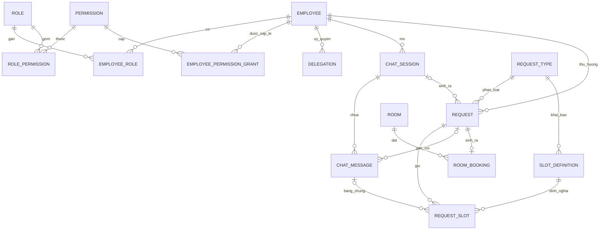
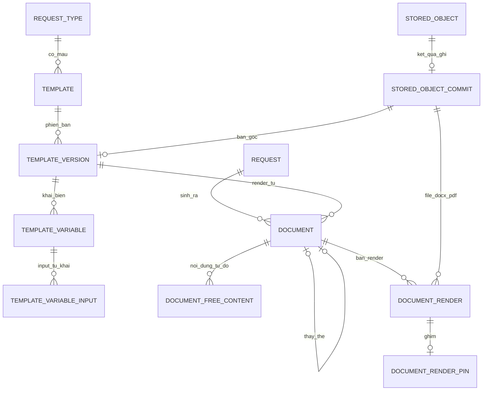
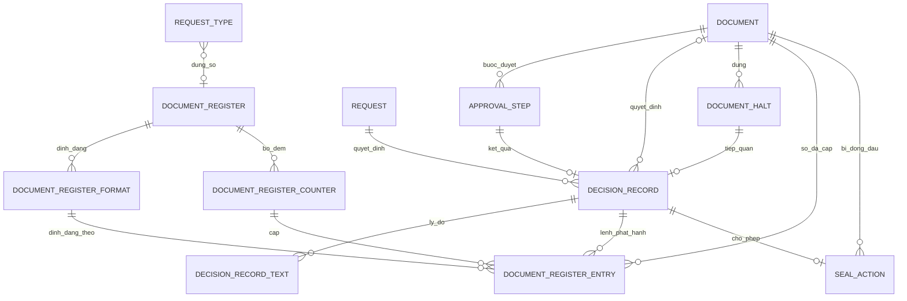
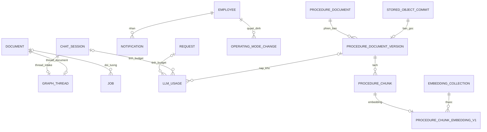

# Data Architecture — Admin Service Desk Agent (BO-19)

**Phiên bản:** 0.3 · **Trạng thái:** Draft chờ duyệt · **v0.2:** vòng duyệt Phase 4 (S–V) — mục ngày 2026-09-13 (lần 2) của `CHANGELOG.md` · **v0.3:** `render_integrity_check` — mục ngày 2026-09-13 (lần 3)

> File này chốt mô hình dữ liệu vật lý: bảng, cột, ràng buộc, index, quyền trên cơ sở dữ liệu, lưu trữ file, vector collection và chính sách xoá dữ liệu cá nhân. Contract DDL nằm ở [`contracts/schema.sql`](./contracts/schema.sql). File này **không** thiết kế API (Phase 5), màn hình duyệt hay bảng mã lý do (Phase 8), AuthZ chi tiết (Phase 9), và **không** định cỡ thời hạn hay tham số vận hành (Phase 11).

Tên entity, trạng thái, enum, agent, tool dùng đúng `GLOSSARY.md`. Ánh xạ từ entity logic sang bảng ở mục 1.1.

**Đã đối chiếu:** `CLAUDE.md`, `_PLAN.md`, `GLOSSARY.md`, `ASSUMPTIONS.md`, `CHANGELOG.md`, `00-domain.md`, `01-prd.md`, `02-architecture.md`, `03-agents.md`, ADR-001 → ADR-010, `docs/reference/pgvector-dimension-limits.md`. Mâu thuẫn tìm thấy đã được sửa tại file gốc trong phạm vi anh cho phép (K1, J2, P), hoặc ghi ở mục Open Questions — không vá ở file này.

**ADR mới:** ADR-011 (sổ số văn bản), ADR-012 (vector collection).

---

## 1. Nguyên tắc dữ liệu

### 1.1 Ánh xạ entity → bảng

| Entity logic (`GLOSSARY.md`) | Bảng | Ghi chú |
|---|---|---|
| `employee` | `employee` | Cột `department_code` là khoá lọc quyền theo phòng ban (mục 6.3) |
| `permission`, vai trò | `permission`, `role`, `role_permission`, `employee_role`, `employee_permission_grant` | Hai bảng nối nhiều-nhiều (vai trò × permission, nhân viên × vai trò); bảng cuối giữ quyền cấp lẻ ngoài gói vai trò |
| `delegation` `[Should]` | `delegation` | Đã có việc thật: `employee_lookup` và điều kiện 4 của F1 đọc nó |
| `request_type` | `request_type`, `slot_definition` | Slot schema là cấu hình, không version (mục 3.2) |
| `request` | `request`, `request_slot` | Một dòng mỗi slot |
| `chat_session`, `chat_message` | `chat_session`, `chat_message` | — |
| `template` | `template`, `template_version`, `template_variable`, `template_variable_input` | Mẫu có phiên bản bất biến; danh mục biến nằm trên phiên bản; danh sách input tự khai là quan hệ nhiều-nhiều biến × slot |
| `document` | `document`, `document_free_content` | `document_free_content` giữ **từng lần sinh** một biến — cần cho dấu vân tay input của ADR-009 và cho `previous_statement`; một cột trên `document` chỉ giữ được bản cuối |
| `document_render` | `document_render`, `document_render_pin` | Ghim tách thành bảng chỉ thêm, để ghim là một chiều bằng quyền chứ không bằng code (mục 5.5) |
| `document_register` | `document_register`, `document_register_format`, `document_register_counter`, `document_register_entry` | Bốn vòng đời khác nhau: danh tính sổ · định dạng chỉ thêm · bộ đếm khoá dòng · dòng sổ (ADR-011) |
| `seal_register`, `seal_action` | `seal_action` | Sổ theo dõi con dấu là toàn bộ bảng `seal_action`, sắp theo `sealed_at` |
| `approval_step` | `approval_step` | — |
| `decision_record` | `decision_record`, `decision_record_text` | Văn bản lý do tách riêng để xoá được mà bản ghi quyết định vẫn bất biến |
| `document_halt` | `document_halt` | Do tool `document_halt_record` ghi |
| `audit_event` | `audit_event` | Không khoá ngoại (mục 7) |
| `notification` | `notification` | — |
| `operating_mode_change` | `operating_mode_change` | — |
| `room`, `room_booking` `[Should]` | `room`, `room_booking` | — |
| `procedure_document` | `procedure_document`, `procedure_document_version` | Tài liệu có phiên bản; bản gốc và phạm vi hiển thị thuộc từng phiên bản |
| `procedure_chunk` | `procedure_chunk` | Đơn vị trích dẫn |
| `external_document` `[Could]` | **Không có DDL** | Điểm mở rộng ở mục 3.9 |
| *Tầng kỹ thuật* — `job` | `job` | ADR-004, ADR-010 |
| *Tầng kỹ thuật* — `graph_thread` | `graph_thread` | Sổ thread, cạnh bảng checkpoint của thư viện |
| *Tầng kỹ thuật* — `stored_object` | `stored_object`, `stored_object_commit` | Sổ giành khoá ghi-một-lần (mục 5); commit tách riêng để checksum được ghi đúng một lần bằng khoá chính |
| *Tầng kỹ thuật* — `llm_usage` | `llm_usage` | Kế toán token; không chứa văn bản |
| *Tầng kỹ thuật* — `embedding_collection` | `embedding_collection`, `procedure_chunk_embedding_v1` | Một bảng cho mỗi phiên bản collection (ADR-012) |
| Checkpoint của `orchestrator` | Bảng của LangGraph | **Không** nằm trong `schema.sql` (mục 8.6) |

**Độ phủ (V3):** bảng trên phủ đủ **45 bảng** của `schema.sql`. Mỗi bảng hoặc là entity của chính nó, hoặc thuộc một dòng có lý do tách ở cột ghi chú; không bảng nào đứng ngoài ánh xạ.

**Không có** bảng `department`. **Không** version cấu hình `request_type`. Lý do và hệ quả ở mục 3.2 và mục 6.3.

### 1.2 Quy ước

- **`id` là `uuid` do ứng dụng sinh**, DB không có giá trị mặc định. Lời gọi thử lại mang lại đúng id cũ, nên idempotency của tool (mục Tool Registry của `03-agents.md`) có chỗ bám mà không cần cột phụ.
- **Enum là `text` + `CHECK`**, không dùng kiểu enum riêng. Thêm một giá trị là thay một `CHECK` trong migration — một loại thao tác duy nhất cho mọi enum.
- **Tên ràng buộc** mang tiền tố `ck_`, `uq_`, `fk_`, `ix_`, để lỗi vi phạm ở `tool_layer` ánh xạ được sang mã lỗi của tool.
- **Audit column.** Bảng sửa được có `created_at`, `updated_at`, `row_version`. Mọi `UPDATE` điều kiện theo `row_version` đã đọc; mọi chuyển trạng thái điều kiện thêm theo trạng thái đang mong đợi. Hai người bấm cùng lúc thì một người thắng, người kia nhận lỗi xung đột — không ai ghi đè ai. Bảng chỉ thêm chỉ có thời điểm tạo.
- **Không có cột `created_by`/`updated_by`.** Ai làm gì nằm ở `audit_event` và `decision_record` — một nơi, không hai.
- **Không soft delete dòng nghiệp vụ.** Không bảng nào có `deleted_at`. Vòng đời do máy trạng thái quyết; `document` và `request` không bao giờ bị xoá (mục 1.3). **Xoá dữ liệu cá nhân là xoá giá trị trong dòng**: cột về `NULL`, cột `*_erased_at` ghi thời điểm, dòng giữ nguyên để giao diện hiển thị "nội dung đã xoá". Xoá dòng thật chỉ xảy ra ở nhóm bảng "thêm và xoá" của mục 1.3.
- **Cờ dẫn xuất không lưu.** `sla_breached` tính từ `due_at`; `issue_in_progress` tính từ việc có `decision_record` loại `ISSUE_ORDERED` mà `document` chưa `ISSUED`. Không có cột nào cho hai cờ này.
- **Độ nhạy ghi bằng chú thích trong DDL** (`-- PER`, `-- RES`) cho cột nằm ngoài slot schema. Với giá trị slot, độ nhạy **không** nằm trên dòng giá trị (mục 8.2).

### 1.3 Hai role, và bất biến bằng quyền

**Quyết định (J4):** bất biến được thực thi bằng `GRANT`/`REVOKE`, không bằng trigger và không bằng row-level security.

- **`bo19_migrator`** sở hữu mọi bảng, chạy `schema.sql` và mọi migration sau.
- **`bo19_app`** là role runtime của `api` và `queue_worker`. **Không sở hữu bảng nào**, nên chỉ có đúng các quyền cấp ở cuối `schema.sql`.
- Việc Render có cho tạo hai role như vậy hay không chưa được xác minh — hai câu hỏi riêng ở A-040.

| Nhóm quyền của `bo19_app` | Bảng | Nghĩa |
|---|---|---|
| Chỉ đọc | `role`, `permission`, `role_permission`, `employee_role`, `employee_permission_grant` | Danh mục nạp bằng data migration (mục 1.4) |
| **Chỉ thêm** | `audit_event`, `decision_record`, `document_render_pin`, `document_register_format`, `template_variable`, `template_variable_input`, `seal_action`, `document_halt`, `operating_mode_change`, `llm_usage`, `procedure_chunk` | Không `UPDATE`, không `DELETE`. Bản ghi một khi đã ghi thì đứng yên |
| **Thêm và xoá, không sửa** | `decision_record_text`, `document_render`, `document_free_content`, `stored_object`, `stored_object_commit`, `procedure_chunk_embedding_v1` | Ghi một lần, xoá được khi hết hạn lưu, **không sửa được** |
| Sửa được, không xoá | `employee`, `request`, `request_slot`, `chat_session`, `document`, `approval_step`, `graph_thread`, `delegation`, `request_type`, `slot_definition`, `template`, `procedure_document`, `room`, `room_booking` | Không có `DELETE` trên `document`: "không tồn tại đường xoá cứng `document` đã `ISSUED`" (AC của F3) đứng ở tầng quyền |
| Sửa theo cột | `chat_message`, `template_version`, `document_register`, `document_register_counter`, `document_register_entry`, `notification`, `procedure_document_version`, `embedding_collection` | `UPDATE` chỉ trên các cột liệt kê trong `schema.sql`. Ví dụ `document_register_entry` chỉ sửa được `status`, `voided_at`, `void_reason` |
| Đủ vòng đời | `job` | Kể cả dọn job đã xong |

**Không dùng row-level security.** Trong phạm vi Phase 4 không có nhu cầu lọc hiển thị nào phải đặt ở tầng DB. Lọc quyền xem theo phòng ban là việc của Phase 9; nếu Phase 9 chọn row-level security cho **việc lọc**, đó là quyết định của Phase 9, không phải công cụ bất biến.

**Giới hạn — nói thẳng.**

- Role sở hữu vẫn sửa được mọi thứ. Ranh giới tin cậy vì vậy là credential của `bo19_migrator`: ai giữ, dùng khi nào, và việc dùng nó có để lại vết không — thuộc Phase 9 và Phase 11. Bất biến ở đây chặn **ứng dụng**, kể cả khi ứng dụng có lỗi hay bị prompt injection khai thác. Nó không chặn người vận hành cơ sở dữ liệu.
- Quyền theo cột không phân biệt được *giá trị*. `bo19_app` sửa được `document_register_entry.status`, nên về quyền nó có thể chuyển sang `VOIDED` cả một dòng đã gắn với văn bản `ISSUED`. Chặn điều đó là việc của `document_number_assign`; `ck_document_issued_complete` chỉ bảo đảm document `ISSUED` luôn trỏ tới một dòng sổ.

### 1.4 Dữ liệu danh mục nạp ở đâu

`schema.sql` không có câu `INSERT` nào (L4).

| Danh mục | Cách nạp |
|---|---|
| `permission`, `role`, `role_permission` | **Data migration** có phiên bản, tách khỏi schema migration, chạy bằng `bo19_migrator`. Nội dung lấy từ mục Permission và vai trò của `00-domain.md` |
| `employee_role`, `employee_permission_grant` | Data migration hoặc script vận hành chạy bằng `bo19_migrator`. Không có màn hình quản trị trong phạm vi — vai trò quản trị hệ thống không được mô hình hoá (mục Permission và vai trò của `00-domain.md`) |
| `employee` | Import CSV qua ứng dụng, permission `employee.import` (D-002) |
| `request_type`, `slot_definition` | Luồng cấu hình của F6 qua ứng dụng. Bản đầu cho hai loại của Sprint đầu nạp bằng data migration. Permission của luồng này **chưa tồn tại** trong danh mục — A-042 |
| `document_register`, `document_register_format` | Qua ứng dụng; bản đầu nạp bằng data migration khi Product Owner có giá trị (A-009) |
| `template*` | Tải lên qua F6, permission `template.manage` |
| `embedding_collection` | Dòng của một phiên bản collection đi cùng migration tạo bảng của phiên bản đó, **sau khi** model được chọn (A-028). Trước lúc đó không có collection `ACTIVE` nào, và `procedure_retrieval` trả danh sách rỗng — đúng nhánh "không có căn cứ" đã thiết kế cho kho rỗng |
| Mã `archive_reason`, `reason_code` của `document_halt` | Bảng mã thuộc Phase 8. DB chỉ kiểm hình dạng mã |
| `room` | Chờ A-012 |
| `operating_mode_change` | Không nạp gì. Chưa có dòng nào nghĩa là `NON_PRODUCTION` — mặc định an toàn |

### 1.5 Enum của Phase 4 — phép thử xuyên phase (U2)

**Phép thử:** enum nào xuất hiện trong **phản hồi API**, **trên màn hình**, hoặc trong **payload của `audit_event`** là enum xuyên phase và phải vào `GLOSSARY.md`. Enum chỉ sống trong DB và `observability` thì ở lại file này.

Đã vào `GLOSSARY.md` ở Phase 4: `decision_kind`, `archive_reason`. Bảng dưới đánh dấu các enum còn lại **có khả năng** vượt ranh giới, để Phase 5 nâng chúng lên `GLOSSARY.md` khi viết API thay vì phát hiện muộn.

| Enum (bảng.cột) | Giá trị | Vượt ranh giới? | Ở đâu |
|---|---|---|---|
| `request_slot.value_status` | `PROVIDED` · `PROPOSED` · `CONFIRMED` · `SYSTEM_SET` · `ERASED` | **Có** | Màn hình xác nhận của nhân viên (D-002), màn hình duyệt, API chat |
| `approval_step.step_kind`, `approval_step.status` | `CONTENT_REVIEW` · `SIGNATURE` · `SEAL` · `BOOKING_CONFIRM`; `OPEN` · `DECIDED` · `CANCELLED` | **Có** | Hàng đợi duyệt, API |
| `chat_session.close_reason` | `IDLE_TIMEOUT` · `REQUEST_EXPIRED` | **Có** | Câu báo khi nhân viên quay lại (EC-CV-04, A-038) |
| `document_render.render_kind` | `DRAFT` · `FINAL` | **Có** | API tải file: bản nháp hay bản phát hành |
| `document_render_pin.pin_reason` | `APPROVED_CONTENT` · `ISSUED` | **Có** | Payload `audit_event` của việc ghim |
| `decision_record_text.text_kind` | `CHANGE_REASON` · `REJECTION_REASON` · `REVOCATION_REASON` | **Có** | Màn hình trạng thái F4 — "cần sửa gì", API |
| `request_type.support_status`, `request_type.artifact_kind` | Mục 3.2 | **Có** | Màn hình cấu hình F6, API |
| `slot_definition.data_type` | Mục 3.2 | **Có** | Màn hình cấu hình F6 |
| `template_variable.kind`, `template_version.status` | Mục 3.3 | **Có** | Màn hình tải template của F6 |
| `document_register.reset_policy` | `YEARLY` · `NEVER` | **Có** | Cấu hình sổ |
| `audit_event.actor_kind` | `EMPLOYEE` · `SYSTEM` | **Có** | Màn hình nhật ký |
| `notification.event_code`, `document_halt.reason_code` | Chưa có bảng mã | **Có**, khi có bảng mã (Phase 8) | Hộp thông báo, màn hình tiếp quản |
| `job.job_type`, `job.status`, `graph_thread.status`, `stored_object.purpose`, `embedding_collection.status`, `embedding_collection.distance_metric` | Mục 3.8, mục 5, mục 6 | Không | Chỉ DB và `observability` |
| `llm_usage.model_tier`, `llm_usage.outcome` | Mục 3.8 | Không — trừ khi Phase 11 đưa chúng lên một màn hình cho người dùng | Tổng hợp chi phí |

---

## 2. ERD

Tách bốn sơ đồ để mỗi sơ đồ dưới 20 entity. Sơ đồ chỉ vẽ quan hệ; cột và ràng buộc ở mục 3. Tên entity viết HOA theo quy ước Mermaid (mục Tên chưa chốt của `GLOSSARY.md`).

`audit_event` **không có mặt** trong sơ đồ nào vì nó không có khoá ngoại: nó giữ id của dòng nghiệp vụ dưới dạng giá trị, để sống lâu hơn chính dòng đó (mục 7).

### 2.1 Người, hội thoại, request

### 2.2 Văn bản, template, file

### 2.3 Duyệt, quyết định, sổ số, sổ dấu

### 2.4 Vận hành, kho quy trình

---

## 3. Bảng chi tiết

**Cách đọc.** Cột *Null*: `—` là `NOT NULL`, `✔` là cho phép `NULL`. Mọi bảng sửa được có thêm `created_at`, `updated_at`, `row_version` (mục 1.2) — không liệt kê lại. Tên ràng buộc đầy đủ ở `schema.sql`; bảng dưới đây nêu **nội dung** ràng buộc. Mỗi nhóm kết thúc bằng bảng index kèm lý do. Khoá chính và ràng buộc `UNIQUE` đã tự tạo index, nên chỉ được nhắc khi chúng phục vụ một truy vấn cụ thể.

### 3.1 Nhân sự và quyền

**`employee`** — import CSV (D-002).

| Cột | Kiểu | Null | Mặc định | Ràng buộc · ghi chú |
|---|---|---|---|---|
| `id` | uuid | — | — | PK |
| `employee_code` | text | — | — | `UNIQUE` |
| `full_name` | text | — | — | `PER` |
| `department_code` | text | — | — | `INT`, không rỗng. Khoá lọc quyền theo phòng ban (mục 6.3) |
| `department_name`, `job_title` | text | — | — | `INT` |
| `contract_type` | text | — | — | `PER`. `PROBATION` · `FIXED_TERM` · `INDEFINITE` (A-013) |
| `employment_start_date` | date | — | — | `PER` |
| `employment_end_date` | date | ✔ | — | `PER`. Không trước ngày bắt đầu |
| `date_of_birth` | date | ✔ | — | `PER` |
| `national_id` | text | ✔ | — | `RES` |
| `is_active` | boolean | — | `true` | Nhân viên nghỉ việc **không bị xoá** — `employee` bị tham chiếu khắp nơi |
| `source`, `synced_at` | text, timestamptz | — | — | Provenance (D-002). `source` không rỗng |

**`permission`** (`code` dạng `entity.action`, PK) · **`role`** (`code` viết HOA, PK) · **`role_permission`** (PK ghép) · **`employee_role`** (PK ghép, `granted_at`) — danh mục, nạp bằng data migration.

**`employee_permission_grant`** — quyền cấp lẻ ngoài gói vai trò: `id`, `employee_id`, `permission_code`, `granted_at`, `revoked_at` (✔, không trước `granted_at`).

**`delegation`** `[Should]` — `delegator_employee_id` và `delegate_employee_id` (phải khác nhau), `permission_code` là quyền được uỷ, `valid_from` < `valid_to`, `revoked_at` ✔. Ở ca EC-IL-01, người mang giấy uỷ cho người lập quyền tạo yêu cầu nhân danh mình. Ngữ nghĩa uỷ quyền khi vắng mặt cho người duyệt thuộc Phase 8; bảng chỉ chốt hình dạng.

| Index | Lý do |
|---|---|
| `uq_employee_code` | `employee_lookup` tra theo mã; chặn trùng mã khi import |
| `uq_permission_grant_active` — partial, `revoked_at IS NULL` | Kiểm quyền cấp lẻ còn hiệu lực bằng một lần tra; chặn cấp trùng một quyền đang còn hiệu lực |
| `ix_delegation_lookup` — partial, `revoked_at IS NULL` | `employee_lookup` phải kiểm uỷ quyền **trước khi** đọc hồ sơ người thứ ba (EC-IL-01); điều kiện 4 của F1 kiểm cùng câu hỏi |

### 3.2 Cấu hình loại yêu cầu và slot schema

**`request_type`**

| Cột | Kiểu | Null | Mặc định | Ràng buộc · ghi chú |
|---|---|---|---|---|
| `code` | text | — | — | PK, viết HOA. Mã ở mục Mã loại yêu cầu của `GLOSSARY.md` |
| `name_vi`, `description` | text | — | — | — |
| `support_status` | text | — | — | `SUPPORTED` · `KNOWN_UNSUPPORTED`. Loại đã biết là chưa hỗ trợ vẫn có dòng, vì `classify_intent` cần nó trong `request_type_catalog` để nhận ra EC-CV-03 và EC-WC-03 |
| `artifact_kind` | text | — | — | `DOCUMENT` · `ROOM_BOOKING` · `SEAL_ACTION` |
| `requires_seal_default`, `seal_type_default` | boolean, text | ✔ | — | Có dấu thì phải có loại dấu. Giá trị cuối trên `document` còn phụ thuộc `recipient_org` (EC-IL-03) |
| `document_register_id` | uuid | ✔ | — | FK. Loại `DOCUMENT` đang hỗ trợ **bắt buộc** có sổ |
| `sla_target` | interval | ✔ | — | `TBD` (A-002) |
| `example_phrases` | text[] | — | `{}` | `INT`. Đầu vào của `request_type_catalog` |

**`slot_definition`** — PK (`request_type_code`, `slot_name`).

| Cột | Kiểu | Null | Mặc định | Ràng buộc · ghi chú |
|---|---|---|---|---|
| `data_type` | text | — | — | `STRING` · `TEXT` · `INT` · `DATE` · `TIMESTAMP` · `ENUM` · `LIST` · `BOOL` · `FILE` |
| `source` | text | — | — | Enum `slot_source` |
| `sensitivity` | text | — | — | Enum `slot_sensitivity`. **Phân loại hiện hành**; luật xoá đọc cột này tại lúc xoá (mục 8.2) |
| `is_required` | boolean | — | — | — |
| `validation_rules` | jsonb | — | `{}` | Rule khai báo, do `tool_layer` diễn giải (F6) |
| `description` | text | — | — | `INT`. Đầu vào của `slot_specs` |
| `display_order` | smallint | — | 0 | — |

**Không version cấu hình `request_type` — xác nhận của P5.** Danh mục biến và danh sách slot input tự khai của từng biến nội dung tự do nằm trên `template_version`, trong `template_variable` và `template_variable_input` — đúng mục Allowlist input của `03-agents.md`. Phiên bản template là bất biến. Không phần nào của danh sách input sống ngoài `template_version`; các input không phải slot của `draft_free_content` và `revise_free_content` đều dựng lại được: `variable_guidance` nằm trên phiên bản template, `request_type` nằm trên `request`, `previous_statement` là dòng `document_free_content` trước đó, `change_reason` nằm ở `decision_record_text`.

**Một chỗ hở tìm thấy khi kiểm P5, đã vá trong DDL:** `document.template_version_id` **đổi được** — một vòng sửa dùng phiên bản template đang hiệu lực (mục Resume sau nhiều giờ, nhiều ngày của `03-agents.md`). Nếu dòng `document_free_content` không tự mang phiên bản template của nó thì không biết lần sinh đó đã dùng danh sách input nào. Vì vậy `document_free_content` có cột `template_version_id` riêng.

**Cái giá của việc không version:** `is_required` và `validation_rules` được đánh giá theo cấu hình **hiện hành** tại lúc kiểm, kể cả với `request` đang dở. `request_submit` chạy lại kiểm tra với cấu hình của lúc bấm gửi. Đây cùng nguyên tắc "đọc hiện hành" với luật xoá ở mục 8.2.

Không có index ngoài khoá chính.

### 3.3 Template

**`template`** — `id`, `code` (`UNIQUE`, ví dụ `tpl_work_confirmation`), `request_type_code` (FK), `name`.

**`template_version`**

| Cột | Kiểu | Null | Mặc định | Ràng buộc · ghi chú |
|---|---|---|---|---|
| `template_id`, `version_no` | uuid, integer | — | — | `UNIQUE` ghép; `version_no ≥ 1` |
| `status` | text | — | — | `UPLOADED` · `ACTIVE` · `RETIRED` |
| `source_object_key` | text | — | — | FK tới `stored_object_commit`: bản gốc `.docx` bất biến (F6) |
| `uploaded_by_employee_id` | uuid | — | — | FK |
| `activated_at` | timestamptz | ✔ | — | Bắt buộc khi đã từng `ACTIVE` |
| `retired_at` | timestamptz | ✔ | — | Có khi và chỉ khi `RETIRED` |

Ứng dụng chỉ sửa được `status`, `activated_at`, `retired_at` (quyền theo cột). Cặp `activated_at`/`retired_at` trả lời được câu hỏi "phiên bản nào đang hiệu lực tại thời điểm T" — căn cứ của mã lỗi `TEMPLATE_NOT_ACTIVE_AT_RENDER`.

**`template_variable`** — PK (`template_version_id`, `variable_name`). Chỉ thêm.

| Cột | Kiểu | Null | Ràng buộc · ghi chú |
|---|---|---|---|
| `kind` | text | — | `DIRECT_SLOT` · `FREE_CONTENT` · `SYSTEM` |
| `source_slot_name` | text | ✔ | Có khi và chỉ khi `DIRECT_SLOT` |
| `fill_after_approval` | boolean | — | Mặc định `false`. Chỉ biến `SYSTEM` được mang cờ này — **cờ điền sau duyệt** của INV-01 |
| `variable_guidance`, `max_length` | text, integer | ✔ | Bắt buộc với `FREE_CONTENT` |

**`template_variable_input`** — PK (`template_version_id`, `variable_name`, `slot_name`). Chỉ thêm. Khoá ngoại ghép tới `template_variable` **qua cả cột `kind`**, cộng `CHECK (variable_kind = 'FREE_CONTENT')`: DB từ chối khai input cho một biến không phải nội dung tự do.

**Kiểm lúc tải lên, không biểu diễn được bằng DDL** — vì phiên bản bất biến nên chỉ cần kiểm một lần: mọi `slot_name` khai làm input là slot nguồn `USER_INPUT` của đúng `request_type` (mục Allowlist input của `03-agents.md`); mọi `source_slot_name` tồn tại trong slot schema; đủ biến bắt buộc theo cấu hình loại yêu cầu (AC của F6).

| Index | Lý do |
|---|---|
| `uq_template_version_one_active` — partial, `status = 'ACTIVE'` | `template_fetch` tra chính xác "phiên bản đang hiệu lực" và phải ra **đúng một** dòng (F2). Hai phiên bản cùng `ACTIVE` thì DB từ chối, không để code chọn bừa |

### 3.4 Hội thoại và request

**`chat_session`**

| Cột | Kiểu | Null | Mặc định | Ràng buộc · ghi chú |
|---|---|---|---|---|
| `employee_id` | uuid | — | — | FK — người đang chat |
| `status` | text | — | `OPEN` | `OPEN` · `CLOSED` |
| `opened_at`, `last_message_at` | timestamptz | — | `now()` | — |
| `closed_at`, `close_reason` | timestamptz, text | ✔ | — | Có cả hai khi và chỉ khi `CLOSED`. `close_reason`: `IDLE_TIMEOUT` · `REQUEST_EXPIRED` (mục 8.5) |

**`chat_message`** — `UNIQUE` (`chat_session_id`, `seq`).

| Cột | Kiểu | Null | Ràng buộc · ghi chú |
|---|---|---|---|
| `author` | text | — | `EMPLOYEE` · `AGENT` |
| `request_id` | uuid | ✔ | FK. Gắn khi `request_open` chạy, để luật xoá biết tin nhắn thuộc lần thử nào |
| `body` | text | ✔ | `RES` — mọi tin nhắn, kể cả tin của agent vì nó nhắc lại giá trị slot. Không `NULL` cho tới khi bị xoá |
| `reply_template_id` | text | ✔ | Chỉ tin của agent |
| `retrieval_query` | text | ✔ | `RES`. Chỉ tin của nhân viên (ADR-008) |
| `content_erased_at` | timestamptz | ✔ | Có thì `body` và `retrieval_query` phải `NULL` |

Ứng dụng chỉ sửa được `request_id`, `body`, `retrieval_query`, `content_erased_at`. Không có `DELETE`: dòng giữ lại để giao diện hiển thị "nội dung đã xoá".

**`request`**

| Cột | Kiểu | Null | Mặc định | Ràng buộc · ghi chú |
|---|---|---|---|---|
| `request_type_code` | text | — | — | FK. `UNIQUE (id, request_type_code)` làm đích cho khoá ngoại ghép của `request_slot` |
| `status` | text | — | — | Mười trạng thái `request` |
| `status_changed_at` | timestamptz | — | `now()` | — |
| `chat_session_id` | uuid | ✔ | — | FK |
| `created_by_employee_id`, `beneficiary_employee_id` | uuid | — | — | FK. Người thụ hưởng là căn cứ của D-006 |
| `delegation_id` | uuid | ✔ | — | FK. Điều kiện 4 của F1 |
| `replaces_request_id` | uuid | ✔ | — | FK. Đổi loại giữa chừng (EC-CV-02); không trỏ về chính nó |
| `opened_by_message_id` | uuid | ✔ | — | FK tới `chat_message`, `UNIQUE`. Idempotency của `request_open` theo tin nhắn của lượt |
| `needs_info_asked_at` | timestamptz | ✔ | — | Mốc đếm của A-014. Bắt buộc khi `NEEDS_INFO` |
| `expires_at` | timestamptz | ✔ | — | Hạn `EXPIRED`; thời hạn `TBD` (A-014) |
| `submitted_at`, `due_at` | timestamptz | ✔ | — | `due_at`: SLA `TBD` (A-002) |
| `closed_at` | timestamptz | ✔ | — | Có khi và chỉ khi ở trạng thái kết thúc |
| `retained_values_cleared_at` | timestamptz | ✔ | — | Chỉ có trên `request` `EXPIRED`. Đánh dấu lần thử này **đã hết** giữ giá trị (mục 8.3) |

**`request_slot`** — PK (`request_id`, `slot_name`). Hai khoá ngoại ghép: (`request_id`, `request_type_code`) → `request`, và (`request_type_code`, `slot_name`) → `slot_definition`. Hệ quả: một slot không thể thuộc `request_type` khác với `request` chứa nó, nên EC-CV-02 "không mang slot cũ sang" đứng ở tầng DB; và không xoá được một định nghĩa slot đang có giá trị.

| Cột | Kiểu | Null | Ràng buộc · ghi chú |
|---|---|---|---|
| `value` | jsonb | ✔ | `NULL` khi và chỉ khi `ERASED` |
| `value_status` | text | — | Bảng dưới |
| `provenance_source`, `provenance_synced_at` | text, timestamptz | ✔ | Chép từ `employee` lúc đề xuất `HR_PROFILE` — ràng buộc 3 của D-002 hiển thị đúng hai giá trị này. Có cả hai hoặc không có cái nào |
| `proposed_from_request_id` | uuid | ✔ | FK. Giá trị đề xuất lại từ lần thử `EXPIRED` (mục Memory của `03-agents.md`) |
| `evidence_message_id`, `evidence_span` | uuid, int4range | ✔ | Có cả hai hoặc không. **Vị trí** đoạn trích trong `chat_message.body`, không phải bản chép. Giá trị `PROVIDED` bắt buộc có |
| `confirmed_at` | timestamptz | ✔ | Bắt buộc khi `CONFIRMED` |
| `value_erased_at` | timestamptz | ✔ | Có khi và chỉ khi `ERASED` |

| `value_status` | Nghĩa |
|---|---|
| `PROVIDED` | Nhân viên nói trong hội thoại; `extract_slots` trích, `request_slots_write` đã kiểm bằng chứng |
| `PROPOSED` | Agent đề xuất — `HR_PROFILE`, hoặc từ lần thử `EXPIRED` — chưa xác nhận |
| `CONFIRMED` | Nhân viên đã xác nhận tường minh |
| `SYSTEM_SET` | Nguồn `SYSTEM` |
| `ERASED` | Giá trị đã bị xoá theo luật ở mục 8 |

Slot chưa có dòng nào là slot còn thiếu. **Bằng chứng lưu dạng vị trí** nên khi `chat_message.body` bị xoá, bằng chứng mất theo — trên `request_slot` không có bản chép `RES` nào để quên xoá.

| Index | Lý do |
|---|---|
| `ix_chat_session_open_by_employee` — partial, `OPEN` | Mở chat là tìm phiên đang mở của nhân viên. Chính truy vấn này quyết định ca "quay lại trong hạn" có ở lại phiên cũ hay không (A-038) |
| `ix_chat_session_idle` — partial, `OPEN` | Cron đóng phiên nhàn rỗi |
| `ix_chat_message_request` — partial | `expire_request` xoá văn bản tin nhắn theo `request` (mục 8.3) |
| `uq_request_opened_by_message` | Idempotency của `request_open`: thử lại cùng lượt không tạo `request` thứ hai |
| `uq_request_one_retained_attempt` — partial, `EXPIRED` và chưa xoá giá trị giữ lại | Chính sách "mỗi người thụ hưởng, mỗi loại giữ tối đa một lần thử" (K3) thành ràng buộc DB; đồng thời là đường tra của `prior_attempt_lookup` |
| `ix_request_needs_info_expiry` — partial, `NEEDS_INFO` | Cron `expire_request` quét theo `expires_at` |
| `ix_request_created_by` | F4: nhân viên xem yêu cầu của mình, mới nhất trước |
| `ix_request_chat_session` — partial | `load_turn` đọc `request` gắn với phiên hiện tại |
| `ix_request_open_due` — partial, bốn trạng thái mở sau `SUBMITTED` | Quét SLA và escalation (Phase 8) |

### 3.5 Văn bản

**`document`**

| Cột | Kiểu | Null | Mặc định | Ràng buộc · ghi chú |
|---|---|---|---|---|
| `request_id` | uuid | — | — | FK |
| `template_version_id` | uuid | — | — | FK. Phiên bản dùng cho vòng hiện tại; đổi được khi có vòng sửa (mục Resume sau nhiều giờ, nhiều ngày của `03-agents.md`) |
| `status` | text | — | — | Mười ba trạng thái `document` |
| `status_changed_at` | timestamptz | — | `now()` | — |
| `operating_mode` | text | — | — | **Ghim lúc tạo `DRAFT`** (INV-01). `UNIQUE (id, operating_mode)` làm đích cho khoá ngoại ghép từ `document_render` và `seal_action` |
| `register_series` | text | — | *GENERATED* | `TRIAL` khi `NON_PRODUCTION`, ngược lại `OFFICIAL`. `UNIQUE (id, register_series)` làm đích cho khoá ngoại từ `document_register_entry` — D-009 ràng buộc 2 đứng ở tầng DB |
| `requires_seal`, `seal_type` | boolean, text | ✔ | — | Có dấu thì có loại dấu. Rời `DRAFT` rồi thì `requires_seal` phải đã xác định (`SEAL_UNDETERMINED`) |
| `revision_round` | integer | — | 0 | Số vòng `CHANGES_REQUESTED` đã đi |
| `current_draft_render_id` | uuid | ✔ | — | Bản nháp đang hiện cho người duyệt |
| `approved_content_hash`, `approved_decision_id`, `approved_render_id` | bytea, uuid, uuid | ✔ | — | Bắt buộc cả ba từ `APPROVED` trở đi (INV-01) |
| `signer_employee_id` | uuid | ✔ | — | Biến `signer_user_id`. Bắt buộc từ `PENDING_SIGNATURE` trở đi |
| `final_render_id`, `issued_register_entry_id`, `issued_date`, `issued_at` | | ✔ | — | Bắt buộc cả bốn ở `ISSUED`, `REVOKED`, `SUPERSEDED`. `issued_register_entry_id` **chỉ** được có sau `ISSUED`: số tồn tại trong khoảng hoàn tất phát hành nhưng chưa gắn vào `document` |
| `supersedes_document_id` | uuid | ✔ | — | FK tới `document`, `UNIQUE`: một văn bản bị thay thế bởi tối đa một văn bản |
| `archived_from_status`, `archived_at` | text, timestamptz | ✔ | — | Có cả hai khi và chỉ khi `ARCHIVED`. `archived_from_status` ∈ {`ISSUED`, `REVOKED`, `SUPERSEDED`, `REJECTED`, `CHANGES_REQUESTED`} |
| `archive_reason` | text | ✔ | — | **Bắt buộc khi `archived_from_status = 'CHANGES_REQUESTED'`** — đường vào thứ hai của `ARCHIVED` (mục 3.5.1). Bảng mã: Phase 8 |

Năm khoá ngoại ghép với chính `id` của `document` — tới bản nháp hiện hành, bản đã duyệt, bản cuối, quyết định duyệt và dòng sổ đã cấp — bảo đảm mọi thứ `document` trỏ tới **thuộc về đúng nó**. Không có quyền `DELETE`.

**`document_free_content`** — mỗi lần sinh một biến là một dòng. Chỉ thêm và xoá.

| Cột | Kiểu | Null | Ràng buộc · ghi chú |
|---|---|---|---|
| `document_id`, `variable_name`, `revision_round`, `attempt_no` | | — | `UNIQUE` cả bốn — idempotency của `document_draft_save`. `attempt_no` ∈ {1, 2}: lần sinh chính và lần sinh lại duy nhất (`regenerated_variables`) |
| `template_version_id` | uuid | — | FK. Phiên bản template của **lần sinh này** — dựng lại được danh sách input (mục 3.2) |
| `body` | text | — | `RES` — dẫn xuất từ slot `RES` |
| `validation_outcome` | text | — | `PASSED` · `FAILED` |
| `prompt_module_version` | text | — | — |
| `input_fingerprint`, `fingerprint_key_id` | bytea, text | — | Hash **có khoá** của input đã dùng (ADR-009); khoá quản lý ở Phase 9 |

Giá trị hiện hành của một biến là dòng `PASSED` có (`revision_round`, `attempt_no`) lớn nhất. Không có cờ "hiện hành" để phải sửa — bảng không cần quyền `UPDATE`.

| Index | Lý do |
|---|---|
| `ix_document_request` | Tra `document` của một `request` (F4, `load_turn`) |
| `ix_document_review_queue` — partial, ba trạng thái chờ người | Hàng đợi duyệt sắp theo thời gian chờ (F4) |
| `uq_free_content_attempt` | Idempotency; cũng phục vụ tra giá trị hiện hành theo thứ tự giảm dần |

#### 3.5.1 Khi `request` bị huỷ lúc `document` đang `CHANGES_REQUESTED` — A-035

Thao tác cổng mới **`request_cancel`** (mục Tool Registry của `03-agents.md`), ca `SLOT_DATA`, ghi trong **một giao dịch**:

1. `request`: `CHANGES_REQUESTED` → `CANCELLED`.
2. `decision_record` loại `REQUEST_CANCELLED`, tác nhân là nhân viên.
3. `document`: `CHANGES_REQUESTED` → `ARCHIVED`, `archived_from_status = 'CHANGES_REQUESTED'`, `archive_reason` bắt buộc — `ck_document_archive_reason_abandoned_draft` từ chối giao dịch nếu thiếu.
4. `audit_event`.
5. Job `resume_document_graph` mang id của `decision_record` (ADR-010).

Thread đang chờ ở `await_resubmission` được đánh thức; node đầu tiên sau `interrupt` đọc DB, thấy `request` `CANCELLED` và `document` `ARCHIVED`, rồi tới `END`. `graph_thread` chuyển `ENDED`, `checkpoint_purge` dọn checkpoint. Thread không còn kẹt, lớp phòng thủ thứ hai của ADR-008 chạy được.

Ràng buộc "`request` `CANCELLED` thì `document` của nó không còn ở trạng thái chờ" là ràng buộc **giữa hai bảng**, không viết được bằng `CHECK`. Nó đứng nhờ việc bốn thay đổi nằm trong một giao dịch; bộ phát hiện thread kẹt dạng (2) ở mục Resume sau nhiều giờ, nhiều ngày của `03-agents.md` là lưới an toàn nếu có đường nào khác bỏ sót.

### 3.6 Duyệt và quyết định

**Ranh giới đã chốt:** `approval_step` là việc **yêu cầu** một người hành động; `decision_record` là **hành động đã xảy ra**.

**`approval_step`**

| Cột | Kiểu | Null | Mặc định | Ràng buộc · ghi chú |
|---|---|---|---|---|
| `document_id`, `room_booking_id` | uuid | ✔ | — | Đúng một trong hai. `room_booking_id` chỉ đi với `BOOKING_CONFIRM` `[Should]` |
| `step_kind` | text | — | — | `CONTENT_REVIEW` · `SIGNATURE` · `SEAL` · `BOOKING_CONFIRM` |
| `level` | smallint | — | 1 | Định tuyến nhiều cấp `[Should]` |
| `revision_round` | integer | — | 0 | — |
| `assignee_employee_id` | uuid | ✔ | — | `NULL`: bất kỳ ai mang permission tương ứng |
| `delegation_id` | uuid | ✔ | — | Uỷ quyền khi vắng mặt `[Should]` |
| `status` | text | — | `OPEN` | `OPEN` · `DECIDED` · `CANCELLED`; `closed_at` có khi và chỉ khi không còn `OPEN` |
| `due_at` | timestamptz | ✔ | — | SLA `TBD` (A-002) |
| `self_approval_expected` | boolean | — | `false` | `signing_route` đánh dấu khi người đủ quyền duy nhất là người thụ hưởng |
| `self_approved`, `self_approval_reason` | boolean, text | ✔ | `false` | D-006: tự duyệt khi và chỉ khi có lý do không rỗng; chỉ ở bước đã `DECIDED` |

**`decision_record`** — chỉ thêm. Mỗi thao tác cổng ghi đúng một dòng:

| `kind` | Thao tác cổng |
|---|---|
| `SUBMITTED` · `RESUBMITTED` | `request_submit` — lần đầu, và lần gửi lại ở ca `SLOT_DATA` |
| `REQUEST_CANCELLED` | `request_cancel` |
| `APPROVED` · `CHANGES_REQUESTED` · `REJECTED` | `document_approve_content` · `document_request_changes` · `document_reject` |
| `SIGNED` · `SEALED` | `document_sign` · `document_apply_seal` |
| `ISSUE_ORDERED` | `document_issue` — đây chính là **lệnh phát hành**, không có bảng riêng |
| `REVOKE_INITIATED` · `REVOKE_CONFIRMED` | `document_revoke_initiate` · `document_revoke_confirm` |
| `TAKEOVER_RESOLVED` | Thao tác tiếp quản sau `halt_for_human` — Phase 8 |
| `BOOKING_CONFIRMED` | `booking_confirm` `[Should]` |

Cột: `actor_employee_id` (—, luôn là người thật), `delegation_id` ✔, `request_id` (—), `document_id` ✔ (bắt buộc với các loại chạm văn bản), `approval_step_id` ✔ (bắt buộc với `APPROVED`, `CHANGES_REQUESTED`, `SIGNED`, `SEALED`, `BOOKING_CONFIRMED`), `document_halt_id` ✔ (có khi và chỉ khi `TAKEOVER_RESOLVED`), `change_scope` (có khi và chỉ khi `CHANGES_REQUESTED`), `change_targets` ✔ (chỉ với `CHANGES_REQUESTED`).

**`decision_record_text`** — PK (`decision_record_id`, `text_kind`), `text_kind` ∈ {`CHANGE_REASON`, `REJECTION_REASON`, `REVOCATION_REASON`}, `body` không rỗng, `RES`. Tách khỏi `decision_record` vì hai nghĩa vụ đối nghịch: bản ghi quyết định phải **bất biến**, còn văn bản lý do — có thể mang dữ liệu cá nhân — phải **xoá được** khi hết hạn lưu (A-010). Bảng tách ra có quyền thêm và xoá, không có quyền sửa: lý do ghi một lần, xoá được, **không bao giờ bị viết lại**. Lý do bắt buộc với loại nào là kiểm của thao tác cổng, vì nó là ràng buộc giữa hai bảng.

**`document_halt`** — `document_id`, `reason_code` (dạng mã viết HOA; bảng mã Phase 8), `at_node`, `revision_round`, `trace_id`. `UNIQUE (document_id, at_node, revision_round)` là idempotency của `document_halt_record` theo mục Tool Registry của `03-agents.md`. Chỉ thêm.

**`operating_mode_change` không phải một `decision_record`.** `decision_record` luôn gắn một `request` (`request_id` `NOT NULL`), và nghĩa của nó — đánh thức thread nào, đổi trạng thái gì — xác định theo `request` và `document`. Việc tháo chế độ phi sản xuất không thuộc `request` nào.

**Không viết được bằng DDL, thuộc thao tác cổng và Phase 9:** người thụ hưởng không được duyệt (D-006); hai người khác nhau cho khởi tạo và xác nhận thu hồi. Cả hai cần dữ liệu từ dòng hoặc bảng khác.

| Index | Lý do |
|---|---|
| `uq_approval_step_one_open` — partial, `OPEN` | Chặn mở hai bước cùng loại, cùng cấp cho một văn bản khi job resume chạy hai lần |
| `ix_approval_step_assignee` — partial, `OPEN` | Hàng đợi của một người được giao (`request.read_assigned`) |
| `ix_approval_step_self_approved` — partial | Mục tự duyệt riêng trên dashboard (D-006 điều kiện 4) |
| `uq_decision_one_per_approval_step` — partial | Hai cán bộ bấm cùng lúc trên một bước: DB chỉ nhận một quyết định |
| `ix_decision_record_document` | `route_review` và màn hình duyệt đọc quyết định mới nhất của văn bản |
| `ix_decision_record_request` | F4 và `audit.read_own` theo `request` |

### 3.7 Sổ theo dõi con dấu

**`seal_action`** — sổ theo dõi con dấu là toàn bộ bảng này, sắp theo `sealed_at`; không dùng chung dãy số với `document_register`. Chỉ thêm.

| Cột | Kiểu | Null | Ràng buộc · ghi chú |
|---|---|---|---|
| `document_id`, `operating_mode` | uuid, text | — | Khoá ngoại ghép tới `document (id, operating_mode)`. `NON_PRODUCTION` = dấu thử nghiệm (D-009 ràng buộc 3), không cần cờ riêng |
| `seal_type` | text | — | Enum `seal_type` |
| `copies_count` | integer | — | ≥ 1 |
| `page_count` | integer | ✔ | ≥ 2 khi `EDGE_STAMP` (EC-SR-03) |
| `decision_record_id` | uuid | — | FK, `UNIQUE`: mỗi lần dùng dấu một quyết định riêng, không gộp (EC-SR-04) |

| Index | Lý do |
|---|---|
| `ix_seal_action_document` | Các lần đóng dấu của một văn bản |
| `ix_seal_action_sealed_at` | Tra sổ dấu theo khoảng thời gian — việc đối chiếu mà sổ tay hiện nay không làm được (pain point của F3) |

### 3.8 Vận hành

**`job`** — ADR-004, ADR-010. `payload` chỉ mang tham chiếu, không mang giá trị.

| Cột | Kiểu | Null | Ràng buộc · ghi chú |
|---|---|---|---|
| `job_type` | text | — | `render_document` · `resume_document_graph` · `finalize_issue` · `checkpoint_purge` · `procedure_ingest` · `notification_send`. Ba loại cuối là thao tác đã được `03-agents.md` mô tả là chạy bằng job; nay có tên trong enum |
| `subject_document_id` | uuid | ✔ | Bắt buộc với `resume_document_graph` và `finalize_issue`. `render_document` không có vì `document` chưa tồn tại lúc enqueue |
| `dedupe_key` | text | ✔ | Chặn job trùng đang chờ |
| `status` | text | — | `QUEUED` · `RUNNING` · `SUCCEEDED` · `FAILED`. `RUNNING` khi và chỉ khi có `locked_at` và `lease_expires_at` |
| `attempts`, `max_attempts` | integer | — | `max_attempts` theo A-031 |
| `run_after`, `enqueued_at`, `started_at`, `finished_at` | timestamptz | | `enqueued_at` và `started_at` cho metric độ trễ dispatch của ADR-004 |
| `last_error_code` | text | ✔ | Chỉ mã |

**`graph_thread`** — PK `thread_id`. `CHECK` buộc `thread_id` đúng dạng `intake:{chat_session_id}` hoặc `document:{document_id}`, và `waiting_at_node` ∈ sáu node `interrupt`. `status`: `ACTIVE` · `WAITING` · `ENDED` · `PURGED`. `state_schema_version` phục vụ kiểm tra deploy cuốn chiếu ở mục Schema state đổi giữa chừng của `03-agents.md`.

**`graph_thread` chỉ chứa định danh thread, trạng thái và mốc thời gian — không chứa PII, không chứa quyết định nghiệp vụ.** Đây là ràng buộc bù cho việc nó được ghi ngoài `tool_layer` (U1).

**Ai ghi `graph_thread`:** lớp chạy graph của `orchestrator`, cùng loại với checkpointer — **không** phải một node, **không** đi qua `tool_layer`, **không** sinh `audit_event`, vì đây là sổ sách kỹ thuật chứ không phải hành động nghiệp vụ. Nó là một trong **hai** mục của danh sách ngoại lệ đóng ghi ở mục Tool Registry của `03-agents.md`; thêm mục thứ ba phải có ADR. Nó có ghi cùng giao dịch với checkpoint của thư viện được hay không là `[CẦN XÁC MINH]`. Nếu không, `graph_thread` có thể trễ sau checkpoint một nhịp, và bộ phát hiện thread kẹt có thể báo nhầm trong khoảng đó — chấp nhận được vì bộ phát hiện chỉ cảnh báo, không tự sửa.

**`notification`** — `recipient_employee_id`, `event_code`, `request_id` ✔, `document_id` ✔, `dedupe_key`; `UNIQUE (recipient_employee_id, event_code, dedupe_key)` là idempotency của `notification_send`. Chỉ mang mã và tham chiếu. Ứng dụng chỉ sửa được `pushed_at`, `read_at`.

**`llm_usage` — ràng buộc cứng, ghim ngay tại định nghĩa (P3):** bảng này chứa mã lời gọi, tier, phiên bản prompt module, số token, kết quả, tham chiếu `request`/`chat_session`/`document`/phiên bản tài liệu quy trình và `trace_id` — **TUYỆT ĐỐI KHÔNG** chứa văn bản prompt, văn bản output hay bất kỳ giá trị slot nào. Cùng luật với `audit_event`. Debug chi phí dùng `trace_id` để nhảy sang log kỹ thuật đã mask của `observability`, không bao giờ bằng cách thêm cột văn bản vào đây. `CHECK` buộc mỗi dòng có ít nhất một chủ budget (`request`, `chat_session` hoặc lần nạp kho), và buộc hai lời gọi embedding đi với tier `EMBEDDING`. **Không** có `CHECK` ghép lời gọi LLM với tier rẻ hay mạnh: có hạ tier được không là câu hỏi của Phase 10, và một ràng buộc DB khoá câu trả lời lại sẽ thành thứ phải sửa migration khi câu trả lời đổi.

**`operating_mode_change`** — `from_mode`, `to_mode` (khác nhau), `decided_by_employee_id`, `decision_reference` (tham chiếu văn bản quyết định có người ký, không rỗng), `effective_at` (`UNIQUE`). Chỉ thêm. Chế độ hiện hành là dòng có `effective_at` lớn nhất đã tới; **chưa có dòng nào nghĩa là `NON_PRODUCTION`**, nên một cơ sở dữ liệu mới luôn khởi đầu ở chế độ an toàn. Cơ chế ký và xác nhận thuộc Phase 9 và Phase 11.

| Index | Lý do |
|---|---|
| `ix_job_dispatch` — partial, `QUEUED` | Vòng poll `SKIP LOCKED` của `queue_worker` |
| `ix_job_running_lease` — partial, `RUNNING` | Thu hồi job của worker đã chết khi lease hết hạn |
| `uq_job_dedupe_pending` — partial | Hai lần enqueue cùng một việc — ví dụ hai job resume cho cùng một quyết định — không cùng chờ |
| `ix_job_pending_by_document` — partial | Bộ phát hiện thread kẹt dạng (1): "không có job resume nào đang chờ" cho văn bản đó |
| `ix_graph_thread_waiting` — partial, `WAITING` | Đếm thread đang chờ theo từng node `interrupt` trước khi deploy; bộ phát hiện thread kẹt |
| `ix_graph_thread_to_purge` — partial, `ENDED` | `checkpoint_purge` nhặt thread đã kết thúc |
| `ix_notification_inbox` | Hộp thông báo của một người |
| `ix_llm_usage_request`, `ix_llm_usage_chat_session` — partial | `ai_gateway` cộng token đã tiêu của chủ budget trước mỗi lời gọi — nằm trên đường nóng |
| `ix_llm_usage_created` | Tổng hợp chi phí theo thời gian (Phase 11) |

### 3.9 `[Should]` Phòng họp và điểm mở rộng `[Could]`

**`room`** — `code` (`UNIQUE`), `name`, `capacity` ≥ 1 (A-012), `equipment`, `is_active`.

**`room_booking`** — `request_id` (`UNIQUE`: một `request` một lượt đặt), `room_id`, `start_at` < `end_at`, `attendee_count` ≥ 1, `status` theo năm trạng thái `room_booking`, `hold_expires_at` ✔ (A-008).

**Chống trùng lịch — thiết kế đích và thiết kế tạm (T3).** Theo đúng nguyên tắc của phase này — quy tắc domain đứng bằng ràng buộc DB — **thiết kế đích là một exclusion constraint** trên (`room_id`, khoảng thời gian) cho các lượt `HELD`/`CONFIRMED`. Nó chưa vào `schema.sql` vì hai lý do, cùng ghi ở A-046:

1. Kết hợp phép so bằng trên `room_id` với phép chồng lấn khoảng thời gian trong một exclusion constraint cần một extension bổ trợ. **Chính điều này** là hiểu biết của tôi, `[CẦN XÁC MINH]` theo tài liệu PostgreSQL; extension đó có trên Render hay không cũng `[CẦN XÁC MINH]`.
2. `schema.sql` được áp nguyên vẹn từ Sprint đầu, kể cả bảng `[Should]` (K5). Một extension chưa xác minh, phục vụ một feature đã bị cắt khỏi Sprint đầu, có thể làm hỏng migration của cả Sprint đầu.

**Thiết kế tạm**, cho tới khi A-046 đóng: giao dịch giữ chỗ khoá dòng `room` tương ứng, truy vấn lượt đặt `HELD`/`CONFIRMED` chồng khung giờ, rồi mới tạo `HELD`; hai giao dịch cùng phòng xếp hàng tại dòng `room`. A-046 trả lời "có" thì exclusion constraint được thêm bằng migration **trước** khi kích hoạt `ROOM_BOOKING`, và khoá dòng bị gỡ. Trả lời "không" thì khoá dòng là thiết kế cuối, và chống chồng lịch là một **ngoại lệ có tên** của nguyên tắc — không phải một lựa chọn im lặng.

| Index | Lý do |
|---|---|
| `ix_room_booking_overlap` — partial, `HELD`/`CONFIRMED` | Truy vấn chồng lịch trong giao dịch giữ chỗ |
| `ix_room_booking_hold_expiry` — partial, `HELD` | Cron nhả chỗ quá hạn (A-008) |

**`external_document` `[Could]` — không có DDL (K5).** Khi kích hoạt `SEAL_REQUEST`, điểm mở rộng và ràng buộc phải thoả:

- Bảng `external_document` giữ file tải lên qua `stored_object`, với một giá trị `purpose` mới. Nội dung là `RES` và là **dữ liệu không tin cậy** (EC-SR-02).
- `seal_action` đổi thành có đúng một trong hai đích (`document_id` hoặc `external_document_id`). Đó là một migration **sửa** `seal_action` — cái giá được chấp nhận để không có bảng nào tồn tại mà không ai ghi vào.
- Nội dung file **không bao giờ** vào prompt hay vào `vector_store`; agent chỉ trích metadata để hiển thị.
- Không có đường nào từ `external_document` tới `document_register`: văn bản ngoài không được cấp số.
- Cổng `PENDING_SEAL` và `document.apply_seal` áp nguyên vẹn.

---

## 4. Sổ số văn bản

Lập luận và phương án bị loại ở ADR-011. Mục này chỉ mô tả cấu trúc và cơ chế.

### 4.1 Bốn bảng

**`document_register`** — danh tính của sổ: `code` (`UNIQUE`), `name`, `reset_policy` (`YEARLY` · `NEVER`), `is_active`. Ứng dụng **không sửa được** `reset_policy` (quyền theo cột): đổi chu kỳ giữa kỳ làm bộ đếm đang chạy mất nghĩa; đổi chu kỳ là tạo sổ mới.

**`document_register_format`** — mọi giá trị ảnh hưởng tới chuỗi số, theo (sổ, dải). Chỉ thêm; đổi định dạng là thêm dòng với `effective_from` mới. Mẫu áp cho một lần cấp là dòng có `effective_from` lớn nhất không sau thời điểm cấp.

| Token trong `format_pattern` | Thay bằng | Ghi chú |
|---|---|---|
| `{seq}` | Số thứ tự trong kỳ, đệm 0 tới `seq_min_digits` chữ số | **Bắt buộc** — `CHECK` |
| `{year}` | Năm của `issued_date` theo múi giờ tổ chức | A-041 |
| `{symbol}` | Cột `symbol` — ký hiệu văn bản, chứa viết tắt tên cơ quan | Giá trị: A-009 |

Mẫu cụ thể trông thế nào là `[CẦN XÁC MINH]` theo Nghị định 30/2020/NĐ-CP (A-009, A-036). Không chỗ nào trong thiết kế giả định hình dạng của nó; tập token là thứ duy nhất được chốt.

**`document_register_counter`** — PK (sổ, `series`, `period_key`), `next_seq ≥ 1`. `period_key` là năm bốn chữ số khi `YEARLY`, `ALL` khi `NEVER`.

**`document_register_entry`**

| Cột | Kiểu | Null | Ràng buộc · ghi chú |
|---|---|---|---|
| `document_register_id`, `series`, `period_key` | | — | FK ghép tới bộ đếm |
| `seq` | bigint | — | `UNIQUE (sổ, series, period_key, seq)` — không trùng số |
| `formatted_number` | text | — | Chuỗi số đã định dạng, **lưu nguyên**. `UNIQUE (sổ, series, formatted_number)` |
| `format_id` | uuid | — | FK ghép (`format_id`, sổ, `series`): mẫu phải thuộc đúng sổ và đúng dải |
| `document_id` | uuid | — | FK ghép (`document_id`, `series`) → `document (id, register_series)` |
| `issue_decision_id` | uuid | — | FK tới `decision_record` loại `ISSUE_ORDERED` — lệnh phát hành của người mang `document.issue` |
| `status` | text | — | `ASSIGNED` · `VOIDED` (enum `document_register_entry_status`) |
| `voided_at`, `void_reason` | timestamptz, text | ✔ | Có khi và chỉ khi `VOIDED`; lý do không rỗng |

Ứng dụng chỉ sửa được `status`, `voided_at`, `void_reason`. Không có `DELETE`.

### 4.2 Giao dịch cấp số

`document_number_assign`, gọi từ bước 1 của `finalize_issue` — **một giao dịch ngắn, riêng**:

1. Lấy sổ từ `request_type.document_register_id`; lấy `series` từ `document.register_series`; tính `period_key` từ `issued_date` theo múi giờ tổ chức (A-041).
2. Bảo đảm dòng bộ đếm của kỳ tồn tại — thêm nếu chưa có, bỏ qua nếu đã có. Hai giao dịch cùng tạo thì khoá chính cho một bên thắng.
3. `document` đã có dòng `ASSIGNED` thì trả lại chính dòng đó và kết thúc — idempotent theo `document_id`.
4. Tăng `next_seq` bằng một câu `UPDATE` trả về giá trị trước khi tăng. Dòng bộ đếm bị khoá tới lúc commit.
5. Định dạng chuỗi số; thêm dòng `ASSIGNED` mang `issue_decision_id`; ghi `audit_event`.
6. Commit. Khoá được thả.

**Không bước nào trong giao dịch này chạm `object_storage`, gọi render, hay chờ một hệ thống nào ngoài `postgresql`.** Khoá bộ đếm không bao giờ bị giữ xuyên qua bước render và upload bản cuối (ADR-011).

**Hai `finalize_issue` chạy trùng cho cùng một văn bản:** cả hai có thể qua bước 3 cùng lúc và cùng tăng bộ đếm, nhưng bên thứ hai đụng `uq_register_entry_one_assigned_per_document` ở bước 5. Giao dịch của nó rollback — **kể cả lần tăng bộ đếm** — nên không sinh lỗ hổng. Lần thử lại của nó đọc thấy dòng đã có ở bước 3.

**Thất bại sau khi đã commit số** — hết lượt retry khi render hay upload, hoặc `approved_content_hash` lệch: một giao dịch riêng chuyển dòng sang `VOIDED` kèm lý do, ghi `audit_event`; `document` đứng yên ở `SIGNED`/`SEALED`; graph vào `halt_for_human`. Lần phát hành sau khi tiếp quản nhận số **mới**, vì chỉ dòng `ASSIGNED` mới chặn.

**Số chỉ gắn vào `document` ở giao dịch chuyển `ISSUED`** (bước 4 của `finalize_issue`): `document.issued_register_entry_id` được ghi cùng lúc với `status = 'ISSUED'`. Trước đó, trong khoảng hoàn tất phát hành, số đã có trong sổ nhưng `document` chưa trỏ tới nó (`ck_document_number_only_after_issue`).

### 4.3 Bất biến nào đứng ở đâu

| Bất biến | Nơi thực thi |
|---|---|
| Không trùng số trong (sổ, dải, kỳ) | `uq_register_entry_seq` |
| Không trùng chuỗi số trong (sổ, dải) — kể cả khi mẫu cấu hình sai, ví dụ sổ `YEARLY` mà mẫu thiếu `{year}` | `uq_register_entry_number`: giao dịch cấp số hỏng, không phát số trùng |
| **Số không tái sử dụng** | `uq_register_entry_seq` — đứng ở dòng sổ, không ở bộ đếm. Kể cả khi bộ đếm bị ghi lùi, dòng mới vẫn đụng dòng cũ |
| Một văn bản có tối đa một số đang `ASSIGNED` | `uq_register_entry_one_assigned_per_document` |
| Dải của số khớp chế độ đã ghim (D-009) | `fk_register_entry_document_series` |
| `VOIDED` luôn có lý do | `ck_register_entry_void_reason` |
| Số chỉ gắn vào văn bản sau `ISSUED`; văn bản `ISSUED` luôn có số | `ck_document_number_only_after_issue`, `ck_document_issued_complete` |
| Chuỗi số đã cấp không đổi | Không có quyền `UPDATE` trên `formatted_number` |
| Không `VOIDED` số của văn bản đã `ISSUED` | `document_number_assign` — không phải DB (mục 1.3) |
| Không giữ khoá bộ đếm xuyên render | Cấu trúc của `finalize_issue` (ADR-011) |

### 4.4 Khoảng hoàn tất phát hành trong dữ liệu — V1

Khoảng từ lúc có lệnh phát hành tới lúc `ISSUED` — cờ dẫn xuất `issue_in_progress` ở mục Tool Registry của `03-agents.md` — **không có cột riêng**, đúng quy ước cờ dẫn xuất ở mục 1.2. Nó được dẫn xuất từ ba bảng đã có. Với một `document` chưa `ISSUED`, gọi O là `decision_record` loại `ISSUE_ORDERED` mới nhất của nó:

| Dữ kiện | Trạng thái của khoảng |
|---|---|
| Không có O | Chưa có lệnh phát hành |
| Có O; không dòng sổ nào mang `issue_decision_id` = O; không có `document_halt` tại `finalize_issue` tạo sau O | **Đoạn 1** — có lệnh, chưa có số |
| Có O; một dòng sổ `ASSIGNED` mang `issue_decision_id` = O | **Đoạn 2** — đã có số, chưa phát hành. Số đã nằm trong sổ nhưng `document.issued_register_entry_id` còn `NULL` |
| Có O; dòng sổ mang O đã `VOIDED`, hoặc có `document_halt` tại `finalize_issue` tạo sau O | Lệnh đã bỏ cuộc — **ra khỏi** khoảng, chờ tiếp quản |

`issue_in_progress` đúng ở đoạn 1 và đoạn 2. Phase 8 hiển thị được cả hai đoạn từ: `decision_record` (`kind`, `document_id`, `created_at`), `document_register_entry` (`issue_decision_id`, `status`, `formatted_number`), `document_halt` (`document_id`, `at_node`, `created_at`). Không cần cột mới.

| Index | Lý do |
|---|---|
| `ix_register_entry_issue_decision` | Nối lệnh phát hành với dòng sổ của nó — phân biệt đoạn 1, đoạn 2 và ca bỏ cuộc |
| `ix_decision_record_document` (mục 3.6) | Tìm O |

---

## 5. Lưu trữ file và bất biến bản render — A-021

### 5.1 Quyết định

- **Bản render ở `DRAFT` nằm ở `object_storage`**, cùng chỗ với bản cuối. Khoá object là `renders/{document_id}/{input_hash}.docx` và `.pdf`: gồm `document_id` (ADR-003) và hash trên **input** — phiên bản template, bảng giá trị biến, `operating_mode` (mục Tool Registry của `03-agents.md`).
- **Tích luỹ, không đè.** Mỗi vòng render có input khác nên ra khoá khác và một dòng `document_render` mới; `document.current_draft_render_id` trỏ bản hiện hành. Đè không xảy ra được theo cấu tạo: trùng khoá nghĩa là trùng input (mục 5.4).
- **Ghim ở hai thời điểm, cùng giao dịch với chuyển trạng thái:**
  1. `document_approve_content`: bản đang hiện cho người duyệt được ghim với lý do `APPROVED_CONTENT` và ghi vào `approved_render_id`. Đây là bản gắn với `document` suốt `SIGNED` và `SEALED` — thoả F3 cho `SEALED`. Ghim ngay ở `APPROVED` chứ không đợi `SEALED`, vì nội dung bất biến từ `APPROVED`, và văn bản không cần dấu cũng phải được phủ.
  2. Giao dịch cuối của `finalize_issue`: bản cuối được ghim với lý do `ISSUED` và ghi vào `final_render_id`.
- **Bản trung gian** — không ghim — xoá được theo thời hạn lưu (mục 5.6). Chúng chứa dữ liệu `PER` và `RES` (giá trị `HR_PROFILE`, biến nội dung tự do), nên việc giữ chúng không phải vô hại.

### 5.2 Ranh giới `document_render` và `stored_object` — P4

- **`stored_object`** (cùng `stored_object_commit`) là **sổ giành khoá ghi-một-lần** cho **mọi** object — bản gốc template, bản render, bản gốc tài liệu quy trình. Nó là tầng kỹ thuật và không biết `document` là gì.
- **`document_render`** là **bản ghi nghiệp vụ** "`document` này có những bản render nào": loại bản, vòng, phiên bản template, chế độ — trỏ tới hai object đã commit.

Module lưu trữ của `tool_layer` là nơi duy nhất ghi `stored_object`. Dòng `document_render` do `pdf_export` thêm — bước sau cùng của một lần render — khi cả hai object đã commit (mục 5.3, bước 5). Phase 6 không được viết hai thứ này trùng nhau.

### 5.3 Giao thức ghi một lần

1. Tính khoá từ input.
2. **Giành khoá:** thêm dòng `stored_object` với `claim_token` mới và `lease_expires_at`. Khoá chính quyết định ai thắng.
3. Chỉ người giữ claim được ghi lên `object_storage`, và chỉ khi lease **còn hạn lúc bắt đầu ghi**.
4. **Commit:** thêm dòng `stored_object_commit` với checksum của đúng chuỗi byte vừa ghi. Khoá ngoại ghép (`object_key`, `committed_claim_token`) chỉ nhận đúng `claim_token` của dòng claim.
5. Chỉ khi cả `.docx` lẫn `.pdf` đã commit mới thêm dòng `document_render`. Khoá ngoại tới `stored_object_commit` bảo đảm **không dòng `document_render` nào trỏ tới một object chưa commit**.

Độ dài lease: `TBD` (A-031), bắt buộc dài hơn hẳn timeout của lớp tool chạm `object_storage`.

### 5.4 Ba ca của L2

**(a) Render lại với cùng input, cùng khoá** — bước 2 đụng khoá chính. **Chọn: idempotent, trả lại object đã có**, không báo lỗi. ADR-004 giao job theo kiểu ít nhất một lần, nên retry và hai worker cùng một job là chuyện bình thường, không phải lỗi.
- Đã có commit: dùng khoá và checksum của lần ghi đầu, bỏ chuỗi byte vừa render, **không ghi**.
- Chưa commit, lease còn hạn: một người khác đang giữ claim. Job trả về hàng đợi, không ghi.
- Chưa commit, lease đã hết: ca (b).

**(b) Giành khoá thành công nhưng upload hỏng** — hoặc worker chết giữa chừng — để lại một claim không có object hay commit. **Cơ chế đối soát `object_claim_reconcile`**, Cron của `queue_worker`:
1. Nhặt dòng `stored_object` chưa có commit và đã hết lease (`ix_stored_object_lease`).
2. Xoá object ở `object_storage` nếu có.
3. Xoá dòng `stored_object`.

Việc này an toàn vì theo bước 5 ở mục 5.3, **không có gì trong DB trỏ tới một object chưa commit**. Lần thử lại của job render giành claim mới từ đầu. Người giữ claim cũ nếu hoá ra còn sống mà commit muộn thì bị khoá ngoại ghép từ chối, vì dòng claim của nó không còn — lần ghi muộn không bao giờ thành chuẩn.

**(c) Cùng khoá, khác byte** — ca B6. Bị chặn ở hai chỗ:
- **Khoá chính của `stored_object`:** với một khoá chỉ có một claim tồn tại. Lần render thứ hai rơi vào ca (a) và không ghi.
- **Khoá chính của `stored_object_commit`:** checksum được ghi đúng một lần, và bảng không có quyền `UPDATE` — checksum của lần ghi đầu là chuẩn và không bị viết lại.

**Rủi ro còn lại — nói thẳng.** DB chặn được mọi lệnh ghi **mới**, nhưng không thu hồi được một lệnh ghi **đã gửi đi**. Nếu lệnh ghi của người giữ claim cũ treo lâu hơn lease, rồi (b) xoá claim, rồi một claim mới ghi và commit, thì lệnh ghi cũ vẫn có thể tới sau và đè byte. ADR-003 đã chủ đích không dựa vào ghi có điều kiện của nhà cung cấp, nên ca này chỉ **thu hẹp** được:

- lease dài hơn hẳn timeout của tool (A-031);
- người giữ claim không bắt đầu ghi khi lease đã hết;
- **kiểm toàn vẹn byte ngay trước người đầu tiên dựa vào byte** — tool `render_integrity_check` đọc lại hai object và so với checksum đã commit. Bản đã duyệt nội dung được kiểm ở `route_signing`, trước khi bước ký được mở. Bản cuối được kiểm trong `finalize_issue`, trước giao dịch chuyển `ISSUED`. Lệch hoặc mất object thì không đi tiếp, graph vào `halt_for_human`.

Việc ghim xảy ra khi người thật bấm duyệt, thường sau nhiều giờ, nên cửa sổ còn lại là "một lệnh ghi treo lâu hơn lease **và** tới sau lúc ghim". **Cửa sổ này phải được đóng ở tầng lưu trữ (T2).** A-024 nay mang một yêu cầu bắt buộc với nhà cung cấp: ghi có điều kiện, khoá đối tượng, hoặc versioning. Không nhà cung cấp khả dụng nào đáp ứng thì ca ghi đè thành rủi ro chấp nhận có người ký, ghi ở mục Risk register của PRD — một quyết định, không phải một hệ quả mặc định.

**Vì sao phép kiểm nằm ở chỗ nó nằm.** Người duyệt nội dung duyệt **giá trị biến** — thứ `approved_content_hash` ghi lại (INV-01). Người ký đặt chữ ký lên **byte** của file. Toàn vẹn byte vì vậy được kiểm **ngay trước người đầu tiên dựa vào byte**: trước khi mở bước ký cho bản đã duyệt, và trước khi văn bản rời hệ thống cho bản cuối. Đó là chỗ đúng, không phải chỗ tiện.

**Hệ quả cho luồng request đồng bộ.** Chỉ một lần ghim nằm trong luồng request: ghim `APPROVED_CONTENT` trong `document_approve_content`. Việc ghim tự nó chỉ là một câu `INSERT` vào `postgresql`, cùng giao dịch với duyệt. Việc đọc object để kiểm checksum nằm ở `route_signing` và `finalize_issue`, cả hai trong `queue_worker`. Không thao tác cổng nào đọc `object_storage`, nên lo ngại A-025 cho biện pháp này **đã hết** — và hết vì phép kiểm đã về đúng chỗ, không phải vì nó được dời đi để lách giới hạn.

**Sau khi trượt kiểm:** `document` đứng yên ở trạng thái lúc kiểm — `APPROVED` với bản đã duyệt, `SIGNED`/`SEALED` với bản cuối. Máy trạng thái không đổi. Cách tiếp quản — render lại từ đúng giá trị đã duyệt rồi ghim bản mới — thuộc thiết kế tiếp quản của Phase 8, cùng bảng mã lý do dừng.

### 5.5 Chuỗi bảo đảm bất biến của bản đã ghim

Không chỉ khẳng định — đây là từng mắt xích:

1. `document_render_pin` chỉ thêm: **không bỏ ghim được**.
2. Khoá ngoại từ `document_render_pin` tới `document_render`: **dòng render đã ghim không xoá được**.
3. `document_render` không có quyền `UPDATE`: **không đổi được khoá object** mà nó trỏ tới.
4. Khoá ngoại từ `document_render` tới `stored_object_commit`: **commit của object đang được trỏ không xoá được**; bảng không có quyền `UPDATE` nên **checksum không đổi**.
5. Khoá ngoại từ `stored_object_commit` tới `stored_object`: claim của một object đã commit không xoá được.
6. Object vật lý chỉ bị xoá **sau khi** xoá được dòng commit trong DB — thứ tự ở mục 5.6. Mắt xích 2 và 4 làm cho việc xoá dòng đó thất bại với mọi bản đã ghim.
7. `document` không có quyền `DELETE`.

**DB không bảo đảm:** việc xoá hay ghi object trực tiếp bằng credential của bucket, bỏ qua `tool_layer` — thuộc quản lý secret ở Phase 9; và rủi ro còn lại của mục 5.4. Bản gốc template và bản gốc tài liệu quy trình dùng cùng chuỗi mắt xích: `template_version` và `procedure_document_version` trỏ tới `stored_object_commit` và không có quyền `DELETE`.

### 5.6 Dọn bản trung gian

Thứ tự bắt buộc:

1. Xoá dòng `document_render` không ghim — mắt xích 2 chặn mọi bản đã ghim.
2. Xoá hai dòng `stored_object_commit` — thất bại nếu object còn được trỏ tới.
3. Xoá object ở `object_storage`.
4. Xoá dòng `stored_object`.

Chết giữa bước 2 và 4 để lại object không còn trong DB: đó là **rò dung lượng**, không phải lỗi đúng sai. Phát hiện bằng đối chiếu danh sách object với DB (Phase 11). Thời điểm dọn: sau khi `document` tới trạng thái kết thúc, cộng một thời hạn `TBD` (A-010).

---

## 6. Vector collection

Lập luận và phương án bị loại ở ADR-012. Việc của retrieval — hướng xử lý thủ công cho yêu cầu ngoài phạm vi, và **chỉ** việc đó — đã chốt ở mục Retrieval của `03-agents.md`. **Chunk strategy** cũng đã chốt ở đó — tách theo cấu trúc mục, mỗi chunk mang đường dẫn tiêu đề, chunk là đơn vị trích dẫn, kích thước theo A-031 — và không lặp lại ở đây; mục này chỉ nêu nơi lưu từng phần của nó.

### 6.1 Cấu trúc

**`procedure_document`** — `code` (`UNIQUE`), `title`.

**`procedure_document_version`**

| Cột | Kiểu | Null | Ràng buộc · ghi chú |
|---|---|---|---|
| `procedure_document_id`, `version_no` | uuid, integer | — | `UNIQUE` ghép |
| `source_object_key` | text | — | FK tới `stored_object_commit` — bản gốc |
| `procedure_visibility` | text | — | Enum `procedure_visibility` |
| `department_scope` | text[] | ✔ | Mã `employee.department_code`. `NULL` khi và chỉ khi `ORG_WIDE`; không rỗng khi `DEPARTMENT_ONLY` |
| `effective_from` | date | — | Ngày hiệu lực |
| `is_active`, `activated_at`, `deactivated_at` | | | Tối đa một phiên bản hiệu lực cho mỗi tài liệu |
| `ingested_by_employee_id` | uuid | — | Người mang `procedure.manage` (A-033) |
| `pii_free_attested` | boolean | — | `CHECK` phải `true` — cam kết không chứa dữ liệu cá nhân của người nạp, lưu cùng phiên bản |

**`procedure_chunk`** — đơn vị trích dẫn. Chỉ thêm.

| Cột | Kiểu | Ghi chú |
|---|---|---|
| `procedure_document_version_id`, `chunk_no` | uuid, integer | `UNIQUE` ghép |
| `heading_path` | text | Tên tài liệu › mục › mục con, hiển thị kèm đoạn trích |
| `body` | text | Văn bản **nguyên văn** — thứ nhân viên đọc được |
| `normalized_text` | text | Chuẩn hoá Unicode và vị trí dấu thanh, do `procedure_ingest` tính (mục Retrieval của `03-agents.md`) |
| `unaccented_text` | text | Dạng không dấu, tín hiệu phụ của kênh lexical |
| `lexical_tsv` | tsvector | *GENERATED* từ hai cột trên, cấu hình `simple` của full-text lõi PostgreSQL. Tách từ tiếng Việt và BM25: `[CẦN XÁC MINH]`, A-030 |

**`embedding_collection`** — `code`, `embedding_table` (tên bảng của phiên bản, dạng `procedure_chunk_embedding_v{k}`), `model_id`, `dimension` (≤ 1024 — A-028), `distance_metric` (`L2_UNIT_NORMALIZED`), `status` (`BUILDING` · `ACTIVE` · `RETIRED`). Tối đa một collection `ACTIVE`.

**`procedure_chunk_embedding_v1`** — `chunk_id` (PK, FK), `collection_id`, `embedding vector(1024)` đã chuẩn hoá độ dài đơn vị, `embedded_at`. Không có index ANN (ADR-012).

**Metadata schema** của collection nằm trên các cột quan hệ ở trên — mã và tên tài liệu, phiên bản, ngày hiệu lực, `is_active`, `procedure_visibility`, `department_scope`, `heading_path`, `chunk_no` — **không** nằm trong một cột JSON cạnh vector. Bộ lọc vì vậy là SQL thường, kiểm được bằng ràng buộc.

| Index | Lý do |
|---|---|
| `uq_procedure_version_one_active` — partial | "Chỉ phiên bản đang hiệu lực" là một mệnh đề đơn trị (F1: trích phiên bản hết hiệu lực là KHÔNG đủ căn cứ) |
| `ix_procedure_chunk_lexical` — GIN | Kênh lexical của hybrid search |
| `uq_embedding_collection_one_active` | `embed_query` và `procedure_retrieval` phải cùng thấy đúng một collection hiện hành |
| *Không có index ANN trên `embedding`* | Tìm chính xác trên kho rỗng hoặc nhỏ; recall@k ở Phase 10 đo model, không đo sai số của index. Vì vậy cột `vector(1024)` cố định hôm nay là ràng buộc **đề phòng** — nó chỉ gánh việc chính khi có index (ADR-012) |

### 6.2 Kiểm lúc khởi động — O2

`api` và `queue_worker`, lúc khởi động:

1. Đọc collection `ACTIVE`, nếu có.
2. Đối chiếu `embedding_table` với danh sách bảng collection mà **chính phiên bản code đó** biết. Tên bảng đọc từ DB không bao giờ được ghép thẳng vào SQL mà không qua đối chiếu này.
3. Đọc số chiều thật của cột `embedding` trong bảng đó từ catalog của PostgreSQL, so với `dimension`.
4. Lệch ở bước 2 hoặc bước 3 thì **từ chối khởi động**, không phục vụ kèm cảnh báo.

Không có collection `ACTIVE` thì khởi động bình thường và `procedure_retrieval` trả danh sách rỗng.

### 6.3 Lọc quyền và so khớp phòng ban — P2

- **Phòng ban của nhân viên** nằm ở `employee.department_code` — `text`, `NOT NULL`, không rỗng — nhập từ CSV cùng đợt import hồ sơ (A-005, D-002). Không có bảng `department`: mã phòng ban là chuỗi do CSV quyết định.
- **Phạm vi của tài liệu** nằm ở `procedure_document_version.procedure_visibility` và `department_scope` (`text[]` các mã `department_code`).
- **Chỗ so khớp trong câu SQL của `procedure_retrieval`** là **bước đầu tiên**: một biểu thức bảng chung chọn tập chunk đủ điều kiện — phiên bản `is_active`, và (`procedure_visibility = 'ORG_WIDE'` hoặc mã phòng ban của người đang chat nằm trong `department_scope`). Hai kênh xếp hạng — lexical và vector — **chỉ chạy trên tập đó**, rồi mới gộp thứ hạng. Đó là lớp 1 của mục Retrieval trong `03-agents.md`: lọc **trước** khi xếp hạng, trong cùng một câu truy vấn.
- **Mã phòng ban của người đang chat** lấy từ `employee` theo phiên đăng nhập, không bao giờ từ nội dung chat.
- **Lớp 4** — đọc lại đoạn trích theo id để hiển thị — dùng lại đúng biểu thức điều kiện đó.
- **Vế permission** của bộ lọc ("phòng ban **và permission** của người đang chat") chưa có permission nào được định nghĩa cho việc xem tài liệu quy trình. Thuộc Phase 9 (Open Questions).

**Hệ quả của việc không có bảng `department`:** CSV đổi mã một phòng ban mà `department_scope` không được cập nhật thì tài liệu `DEPARTMENT_ONLY` đó **không còn ai thấy**. Hỏng theo hướng mất chức năng, không theo hướng rò — cùng họ fail-closed với ADR-008. `procedure_ingest` đối chiếu mọi mã trong `department_scope` với mã đang có ở `employee` còn hoạt động và cảnh báo mã không tồn tại.

### 6.4 Hybrid search

- **Kênh lexical:** index GIN trên `lexical_tsv`; hàm xếp hạng full-text lõi của PostgreSQL, không phải BM25, cho tới khi A-030 xác minh có gì khả dụng.
- **Kênh vector:** tìm chính xác theo L2 trên vector độ dài đơn vị, trong bảng của collection `ACTIVE`, nối về `procedure_chunk` đã lọc.
- **Gộp theo thứ hạng**, không cộng điểm thô; tham số và `top_k`: A-031.

### 6.5 Kho rỗng — A-027

Bảng rỗng; không index nào cần dữ liệu mẫu; truy vấn trả danh sách rỗng và đi nhánh "không có căn cứ". Chưa có collection `ACTIVE` cũng đi đúng nhánh đó. Không migration nào phụ thuộc vào việc có dòng dữ liệu.

### 6.6 Chiến lược re-index

**(1) Một tài liệu có phiên bản mới** — `procedure_ingest`:
1. Nạp phiên bản mới ở trạng thái chưa kích hoạt: tách chunk, `embed_corpus_chunk` qua `ai_gateway` (token ghi vào `llm_usage`), ghi embedding vào bảng của collection `ACTIVE`.
2. **Một giao dịch:** phiên bản mới `is_active = true`, phiên bản cũ `false`, xoá embedding của các chunk thuộc phiên bản cũ.
3. Chunk cũ **được giữ** để truy vết trích dẫn đã từng hiển thị; không có embedding nên không bao giờ được truy hồi lại.

**(2) Đổi embedding model** — phiên bản collection mới:
1. Migration tạo `procedure_chunk_embedding_v{k+1}` với `vector(n')`, n' ≤ 1024; data migration thêm dòng `embedding_collection` ở `BUILDING`.
2. Job nạp lại embedding cho mọi chunk thuộc phiên bản đang hiệu lực. Trong lúc có collection `BUILDING`, `procedure_ingest` **hoãn** — một bất biến đơn giản hơn là bắt nó ghi vào hai bảng.
3. Kiểm đủ: số embedding bằng số chunk đang hiệu lực.
4. **Một giao dịch:** collection mới `ACTIVE`, collection cũ `RETIRED`. `ai_gateway` đọc `model_id` của collection `ACTIVE` ở mỗi lời gọi `embed_query`, nên model của truy vấn đổi đúng lúc với bảng được truy vấn.
5. Migration sau đó xoá bảng cũ.

Trong suốt quá trình, truy vấn chạy trên collection cũ. Kho rỗng thì bước 2 không có việc gì và việc đổi diễn ra ngay.

**(3) Thêm index ANN:** migration tạo index HNSW trên cột `embedding` của bảng collection `ACTIVE`, opclass L2 (`vector_l2_ops` — mục 4 của `docs/reference/pgvector-dimension-limits.md`). Kích hoạt khi tín hiệu "latency của `procedure_retrieval` đặt cạnh số chunk đang hiệu lực" phát ra — dòng ADR-012 ở bảng chỗ quan sát của Phase 11 trong `_PLAN.md`; ngưỡng đặt khi có số liệu thật (A-002, A-031). Thời lượng tạo index và ảnh hưởng của nó lên ghi giao dịch là đúng tín hiệu thứ hai của ADR-002, đã có chỗ quan sát ở Phase 11.

**A-037 hôm nay không chặn gì — vì chưa có index ANN**, không phải vì giới hạn phiên bản. Nó thành ràng buộc cứng kể từ bước (3); khi đó `vector(1024)` nằm trong giới hạn index của mọi phiên bản mà nguồn mô tả (ADR-012).

---

## 7. Audit log bất biến

**`audit_event`**

| Cột | Kiểu | Null | Ràng buộc · ghi chú |
|---|---|---|---|
| `id` | uuid | — | PK |
| `occurred_at` | timestamptz | — | Mặc định `now()` |
| `actor_kind`, `actor_employee_id` | text, uuid | ✔ | `EMPLOYEE` khi và chỉ khi có `actor_employee_id`; `SYSTEM` cho job và Cron |
| `action` | text | — | Dạng `entity.action`, ví dụ `document.approve_content`, `request.expire` |
| `severity` | text | — | Enum `audit_severity`, mặc định `INFO` |
| `entity_type`, `entity_id` | text | — | Dòng bị tác động |
| `request_id`, `document_id`, `decision_record_id` | uuid | ✔ | Tham chiếu **theo giá trị**, không khoá ngoại |
| `payload` | jsonb | — | **Chỉ mã, id, tên slot, số đếm** |
| `trace_id` | text | ✔ | Nối sang log kỹ thuật của `observability` |

**Ghi gì.** Mọi tool ghi sinh `audit_event` trong cùng giao dịch (mục Tool Registry của `03-agents.md`); mọi thao tác cổng cũng vậy. Việc chuyển `ISSUED` trong `finalize_issue` ghi **người ra lệnh phát hành** làm tác nhân, không ghi `SYSTEM`. Thao tác cấu hình đổi dữ liệu nào rời hệ thống — danh sách input của biến, độ nhạy của slot — cũng ghi (mục 8.2).

**Không bao giờ chứa** văn bản tự do, giá trị slot, văn bản prompt hay output. Cùng luật với `llm_usage` (mục 3.8). Ví dụ payload của `slot_sensitivity_change`: tên slot, mức cũ, mức mới, số dòng bị xoá giá trị.

**Vì sao không có khoá ngoại.** Nhật ký phải sống lâu hơn chính dòng nghiệp vụ mà nó ghi nhận. Khoá ngoại sẽ hoặc chặn việc xoá dòng nghiệp vụ khi hết hạn lưu (A-010), hoặc kéo theo xoá luôn nhật ký. Cả hai đều sai.

**Bất biến đứng ở đâu.**
- `bo19_app` chỉ có `SELECT`, `INSERT` (mục 1.3). Không có `UPDATE`, `DELETE`, `TRUNCATE`.
- Danh mục permission không có quyền sửa hay xoá `audit_event` (mục Permission và vai trò của `00-domain.md`). Hai lớp khớp nhau: không người dùng nào có quyền nghiệp vụ đó, và ứng dụng không có quyền DB đó.
- **Chưa có ở phase này:** bằng chứng chống sửa ở phía người vận hành DB — ví dụ chuỗi hash nối các bản ghi. `_PLAN.md` giao việc "chứng minh tính bất biến" cho Phase 8; nếu Phase 8 cần thêm cột thì đó là một migration thêm cột, không đổi cột nào đang có.

**Ai xem:** `audit.read_own` và `audit.read_all`; lọc theo phòng ban thuộc Phase 9. **Thời hạn lưu:** A-010. Ứng dụng không xoá được; nếu luật lưu trữ cho phép hay buộc xoá khi hết hạn, đó là một thủ tục vận hành bằng role sở hữu, thiết kế cùng lúc với A-010.

| Index | Lý do |
|---|---|
| `ix_audit_event_request` — partial | Nhật ký của một `request` (`audit.read_own`, F4) |
| `ix_audit_event_document` — partial | Nhật ký của một văn bản — hai `audit_event` riêng cho hai cổng (NFR-01) phải tra được cạnh nhau |
| `ix_audit_event_occurred` | Duyệt theo thời gian (`audit.read_all`) |
| `ix_audit_event_warning` — partial, `WARNING` | Mục tự duyệt trên dashboard (D-006 điều kiện 3 và 4) |

---

## 8. Lưu trữ và xoá dữ liệu cá nhân

Nghĩa vụ theo Nghị định 13/2023/NĐ-CP — mục đích thu thập, thời hạn lưu, quyền của chủ thể — xử lý ở mức nghĩa vụ. Không trích điều khoản; bản gốc chưa có trong `docs/reference/` — `[CẦN XÁC MINH]`. Mọi thời hạn cuối cùng: `TBD` (A-010).

### 8.1 Ma trận dữ liệu × sự kiện

| Dữ liệu | Nơi | Khi `request` `EXPIRED` | Sự kiện khác | Thời hạn cuối |
|---|---|---|---|---|
| Slot `RES` theo phân loại **hiện hành** | `request_slot` | Xoá giá trị (`ERASED`) | Nâng mức lên `RES` sau khi đã `EXPIRED`: xoá hồi tố (mục 8.2) | A-010 |
| Slot `INT`/`PER` nguồn `USER_INPUT` | `request_slot` | **Giữ**, có mục đích: đề xuất lại (A-014) | Xoá khi lần thử mới hơn cùng (người thụ hưởng, loại) `SUBMITTED` hoặc `EXPIRED` (mục 8.3) | A-010 |
| Slot nguồn `HR_PROFILE` | `request_slot` | Bỏ xác nhận; phần `RES` (`national_id`, `bearer_national_id`) bị xoá theo dòng đầu | — | A-010 |
| Văn bản tin nhắn, `retrieval_query` | `chat_message` | Xoá — luật chung, **không** qua `slot_sensitivity` | Phiên đóng mà không có `request` nào `EXPIRED`: A-010 | A-010 |
| Biến nội dung tự do | `document_free_content` | Không áp dụng — `EXPIRED` chỉ xảy ra trước `SUBMITTED`, lúc chưa có `document` (D-010) | Xoá cùng bản render trung gian (mục 5.6) | A-010 |
| Bản render trung gian | `object_storage`, `document_render` | Không áp dụng (D-010) | Mục 5.6 | A-010 |
| Bản render đã ghim | `object_storage`, `document_render` | Không áp dụng | **Ứng dụng không bao giờ xoá** | Luật lưu trữ, A-010 |
| Văn bản lý do | `decision_record_text` | Không áp dụng | Xoá dòng; `decision_record` giữ nguyên | A-010 |
| `self_approval_reason` | `approval_step` | Không áp dụng | Giữ cùng bản ghi duyệt — trách nhiệm giải trình của D-006 | A-010 |
| Hồ sơ nhân viên | `employee` | — | Nghỉ việc: `is_active = false`, không xoá dòng. Xoá hay ẩn danh, và quyền yêu cầu xoá của chủ thể: Phase 9 | A-010 |
| Checkpoint | Bảng của LangGraph | Không cần thao tác (ADR-008); phiên chứa `request` bị đóng và purge (mục 8.5) | Purge khi thread kết thúc (mục 8.6) | — |
| `audit_event`, `llm_usage`, `notification`, `document_halt`, `job.payload` | | Không chứa PII theo luật của từng bảng | — | Phase 11, A-010 |

### 8.2 Đọc phân loại hiện hành, và xoá hồi tố khi nâng mức — J3, Q1–Q4

**Quyết định xoá đọc `slot_definition.sensitivity` tại lúc xoá**, bằng cách nối `request_slot` với `slot_definition`. Không có cột chụp độ nhạy trên dòng giá trị: một cột như vậy nằm cạnh giá trị là lời mời dùng nhầm nó cho việc xoá. Câu hỏi "lúc đó hệ thống coi dữ liệu này nhạy tới đâu" được trả lời bằng `audit_event` của từng lần đổi phân loại, mang mức cũ và mức mới.

**Lỗ mà đọc hiện hành không phủ:** nó chỉ đúng cho `request` **chưa** `EXPIRED`. Giá trị `INT`/`PER` đang giữ trên `request` **đã** `EXPIRED` sẽ nằm nguyên nếu slot đó về sau bị nâng lên `RES`. Vì vậy thao tác cấu hình **`slot_sensitivity_change`** của F6 làm như sau:

| Thay đổi | Trong **cùng một giao dịch** với việc sửa `slot_definition` |
|---|---|
| Nâng lên `RES`, từ `INT` hoặc `PER` | Xoá giá trị của slot đó trên **mọi** `request` `EXPIRED` cùng `request_type` (`ERASED`) · ghi `audit_event` mang mức cũ, mức mới và **số dòng đã bị xoá giá trị** (Q1) |
| Nâng từ `INT` lên `PER` | Không xoá gì — `EXPIRED` giữ cả `INT` lẫn `PER` · vẫn ghi `audit_event` |
| **Hạ mức**, bất kỳ | Không chạm dữ liệu cũ · **vẫn ghi `audit_event`** (Q3). Hạ mức là **nới** chính sách: từ đó về sau, giá trị lẽ ra bị xoá khi `EXPIRED` sẽ được giữ. Một thay đổi không đụng dữ liệu cũ nhưng đổi số phận dữ liệu tương lai vẫn phải để lại dấu vết |

- **Nhãn PHÁ HUỶ (Q2).** Nâng lên `RES` là một thao tác phá huỷ dữ liệu, kích hoạt bởi một thay đổi cấu hình. Trong luồng cấu hình của F6 nó mang nhãn phá huỷ: người thực hiện phải thấy trước số dòng sẽ bị xoá giá trị rồi mới xác nhận. Giao diện thuộc Phase 8.
- `request` ở trạng thái kết thúc khác — `FULFILLED`, `REJECTED`, `CANCELLED` — không thuộc luật `EXPIRED`; thời hạn của chúng ở A-010. Thao tác này không quét chúng.
- **Log kỹ thuật đã ghi thì không sửa lại được.** Nâng một slot từ `INT` lên `RES` không che được giá trị đã từng xuất hiện không mask trong log trước đó; thời hạn giữ log thuộc Phase 11.
- **Permission của thao tác này chưa tồn tại** — cả luồng cấu hình `request_type` của F6 chưa có permission (A-042).

**Cơ chế này KHÔNG phủ văn bản `chat_message` (Q4).** Tin nhắn thô xếp `RES` bằng một luật chung ở mục Memory của `03-agents.md`, không đi qua `slot_sensitivity`, và bị xoá khi `EXPIRED` bất kể slot nào được phân loại thế nào. Đó là **hai đường xoá khác nhau**: đổi phân loại slot không làm tin nhắn bị xoá sớm hơn hay muộn hơn.

### 8.3 Lần thử `EXPIRED` được giữ — K3

**Mỗi người thụ hưởng, mỗi loại yêu cầu, giữ tối đa một lần thử.** Chính sách này là một ràng buộc đọc được từ dữ liệu: `uq_request_one_retained_attempt`.

Bản giữ trên lần thử cũ bị xoá — mọi slot còn giá trị chuyển `ERASED`, `retained_values_cleared_at` được ghi, dòng `request` giữ làm bản ghi — ở một trong hai thời điểm:

1. **`request` mới cùng cặp chuyển `SUBMITTED`**, trong giao dịch của `request_submit`. Giá trị đã được xác nhận vào `request` mới, nên bản cũ hết mục đích đỡ gõ lại.
2. **`request` mới cùng cặp `EXPIRED`**, trong giao dịch của `expire_request`. Bản mới thay bản cũ — `prior_attempt_lookup` luôn lấy lần gần nhất.

`request` mới bị `CANCELLED` từ `DRAFT` — ví dụ đổi loại giữa chừng — thì bản cũ **chưa** bị xoá, nên không mất gì.

**Ca biên, ghi trước để Phase 8 không gặp như một bất ngờ.** `request` mới được `SUBMITTED` — bản cũ bị xoá lúc đó — rồi bị trả về ở ca `SLOT_DATA` và nhân viên huỷ từ `CHANGES_REQUESTED`. Nhân viên mất khả năng được đề xuất lại từ **cả hai** lần thử, vì `prior_attempt_lookup` chỉ đọc `EXPIRED`. Chấp nhận được, vì ba lý do:

1. Lần thử được giữ tồn tại để đỡ cho người dùng thưa khi họ **im lặng** quá hạn (NFR-04). Huỷ là một hành động **chủ động**.
2. Một `request` bị huỷ sau khi bị trả về vì dữ liệu khai sai hoặc thiếu là tín hiệu chính dữ liệu đó có vấn đề. Đề xuất lại nó là đẩy lại đúng thứ vừa bị trả về.
3. Mở `prior_attempt_lookup` sang `CANCELLED` làm mờ ranh giới với memory yêu cầu định kỳ, đang ở `[Could]`.

Nếu M3 ở UAT cho thấy ca này gây ma sát thật, xét lại lúc đó.

### 8.4 Khi `request` `EXPIRED`

`expire_request` làm các việc sau trong **một giao dịch**. Danh sách này thay danh sách ở mục Memory của `03-agents.md` (đã sửa cho khớp):

1. `request` → `EXPIRED`, ghi `closed_at`.
2. Slot `RES` theo phân loại **hiện hành** → `ERASED`.
3. Slot nguồn `HR_PROFILE` → bỏ xác nhận.
4. Văn bản `chat_message` gắn với `request` và `retrieval_query` → `NULL`, ghi `content_erased_at`.
5. Lần thử `EXPIRED` cũ hơn cùng (người thụ hưởng, loại) → xoá bản giữ (mục 8.3).
6. `chat_session` chứa `request`, nếu còn mở → `CLOSED` với `close_reason = 'REQUEST_EXPIRED'`; `graph_thread` của phiên → `ENDED`; enqueue `checkpoint_purge` (mục 8.5).
7. Ghi `audit_event`.

### 8.5 Đóng phiên và ràng buộc thứ tự — K4, A-038

**Bảo đảm.** Bước 6 ở mục 8.4 làm cho phiên chứa một `request` đang `NEEDS_INFO` đóng — và thread của nó bị purge — **không muộn hơn** lúc `request` đó `EXPIRED`. Ràng buộc thứ tự ở A-010 và A-014 được bảo đảm **bằng sự kiện**, không bằng việc so hai độ dài thời hạn đo từ hai mốc khác nhau.

**Hệ quả (K4) — không chỉ "nặng hơn".** Theo ràng buộc như A-010 đang viết — thời hạn đóng phiên nhàn rỗi không dài hơn thời hạn chờ ở `NEEDS_INFO` — nhân viên quay lại **trong hạn** gần như luôn quay lại **sau** khi phiên đã đóng vì nhàn rỗi. Họ vào một `chat_session` mới, nơi `load_turn` không thấy `request` đang dở. Ca "quay lại trong hạn ở một phiên mới" **thành đường đi chính** của EC-CV-04, không còn là ca biên. Hai ràng buộc kéo ngược nhau:

1. Ràng buộc thứ tự thời hạn của A-010 và A-014 — đẩy về phía **đóng phiên sớm**.
2. `load_turn` chỉ đọc `request` gắn với phiên hiện tại (mục Resume sau nhiều giờ, nhiều ngày của `03-agents.md`) — làm cho đóng phiên sớm đồng nghĩa với **mất `request` đang dở** trong giao diện chat.

Giao Phase 8, cùng cụm với A-029.

**Phát hiện mới, không tự sửa.** Vì bước 6 bảo đảm thứ tự bằng sự kiện, **bất đẳng thức giữa hai thời hạn ở A-010 không còn cần thiết cho chính bảo đảm đó.** Nếu Phase 8 nới bất đẳng thức — cho phiên nhàn rỗi sống lâu hơn thời hạn chờ — thì ca quay lại trong hạn ở lại phiên cũ, và `ix_chat_session_open_by_employee` giúp giao diện tìm lại phiên đó. Cái giá của lối nới này: phiên sống lâu hơn thì thread `intake` sống lâu hơn, và đóng phiên lúc một `request` hết hạn cũng đóng luôn các nhu cầu đang chờ khác trong cùng phiên (EC-CV-01). Phase 4 không đổi A-010 và không quyết. Phương án này, cùng đủ hai vế được và mất, và lối ra còn lại, được ghi ở A-038 cho Phase 8.

### 8.6 Vòng đời checkpoint

- Bảng checkpoint của LangGraph **không** nằm trong `schema.sql`. Chúng được tạo và cấp quyền theo migration của thư viện; bảng nào, quyền nào, và thư viện có ghi cùng giao dịch với bảng ứng dụng không là `[CẦN XÁC MINH]` (A-045).
- Checkpoint chỉ chứa tham chiếu (ADR-008); test canary ở Phase 10 kiểm điều đó.
- `graph_thread` là sổ để purge. Thread `intake` kết thúc khi `chat_session` đóng — nhàn rỗi hoặc `REQUEST_EXPIRED`. Thread `document` kết thúc khi graph tới `END` — `ISSUED`, `REJECTED`, hoặc `ARCHIVED` sau `request_cancel`. Thread kết thúc chuyển `ENDED`; job `checkpoint_purge` xoá mọi checkpoint của `thread_id` đó rồi chuyển `PURGED`.

---

## Open Questions

**Đã đóng trong phase này:**

- **A-021** — lưu trữ bản render: mục 5. → `Đã chốt`.
- **A-035** — thread kẹt khi `request` bị huỷ: `request_cancel` cộng cạnh `CHANGES_REQUESTED → ARCHIVED` có `archive_reason` bắt buộc, mục 3.5.1. → `Đã chốt`.
- **A-014 (3)** — bản giữ trên `request` `EXPIRED` sau khi đã được đề xuất lại: mục 8.3.
- **P5** — không version `request_type` là an toàn, sau khi `document_free_content` mang `template_version_id` riêng (mục 3.2).

**Điều kiện chặn — A-047.** `schema.sql` chưa từng được áp lên một PostgreSQL thật; mới qua parser, và parser không kiểm ngữ nghĩa. Chủ: Phase 6. Hạn: **trước khi viết bất kỳ dòng code nào của Phase 6**. Đây là điều kiện chặn, không phải việc nên làm.

**Còn mở — mỗi mục có owner và hạn ở `ASSUMPTIONS.md`:**

1. **A-040 — Render có cho tạo role runtime không sở hữu bảng, và có cho chạy migration bằng một role khác không.** Toàn bộ mục 1.3 dựa trên câu trả lời "có" cho cả hai. Nếu "không", mọi bất biến ở mục 1.3, mục 4.3, mục 5.5 và mục 7 rơi về tầng ứng dụng, và thiết kế phải được xét lại — không phải chỉnh nhẹ.
2. **A-041** — múi giờ của tổ chức, quyết định ngày cấp số và kỳ đánh số.
3. **A-042** — luồng cấu hình `request_type` và slot schema của F6, kể cả `slot_sensitivity_change`, chưa có permission nào trong danh mục. Không tự thêm permission.
4. **A-043** — vế permission của bộ lọc quyền tài liệu quy trình (mục 6.3) chưa có permission nào được định nghĩa.
5. **A-044** — khoá idempotency (`document_id`, `at_node`, `revision_round`) của `document_halt_record`, chốt ở Phase 3, sẽ gộp nhầm hai lần dừng nếu sau khi tiếp quản graph lại dừng ở cùng node trong cùng vòng. Cơ chế tiếp quản thuộc Phase 8.
6. **A-045** — hành vi của checkpointer LangGraph: bảng, migration và quyền; lịch sử theo bước; có ghi cùng giao dịch với bảng ứng dụng không (mục 3.8, mục 8.6).
7. **A-038** — đã cập nhật theo K4 và phát hiện ở mục 8.5; owner Phase 8.
8. **A-024 — ràng buộc mua sắm.** Nhà cung cấp `object_storage` bắt buộc có ghi có điều kiện, khoá đối tượng hoặc versioning (mục 5.4). Không nhà cung cấp nào đáp ứng thì ca ghi đè thành rủi ro chấp nhận, ghi ở mục Risk register của PRD kèm người chấp nhận.
9. **A-046** — exclusion constraint cho `room_booking` `[Should]`: thiết kế đích, chờ xác minh (mục 3.9).
10. **Kiểm toàn vẹn bản đã ghim** — đã làm theo phép của anh, bằng tool riêng `render_integrity_check` chứ không gộp vào `signing_route` (mục 5.4; lý do ở mục Tool Registry của `03-agents.md`). Cách tiếp quản sau khi trượt kiểm thuộc Phase 8.
11. **Bảng chỗ quan sát của Phase 11 trong `_PLAN.md`** đã có hai dòng cho ADR-011 và ADR-012 (phép S3). Câu dẫn của khối đó vẫn ghi "điều kiện đảo ngược của ADR ở Phase 2"; không sửa vì phép S3 chỉ phủ cái bảng.

