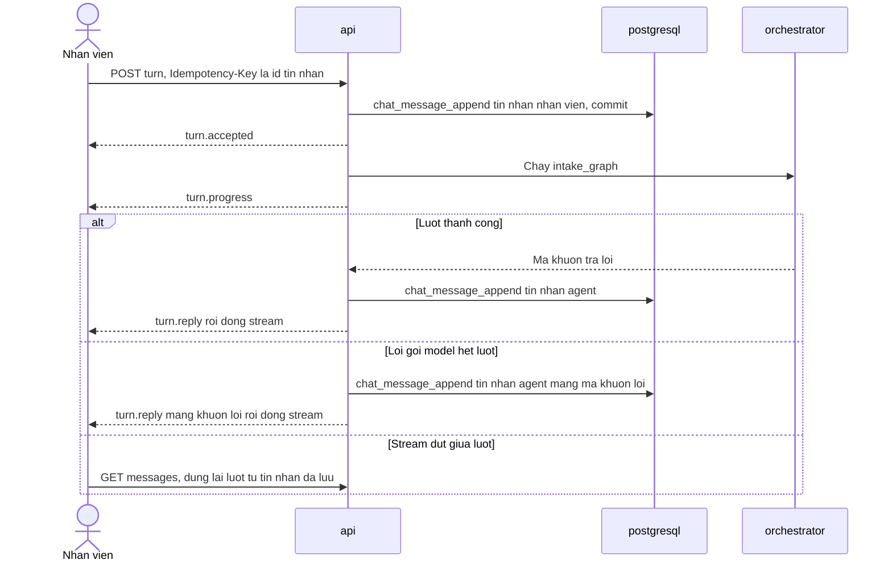

# API Spec — Admin Service Desk Agent (BO-19)

**Phiên bản:** 0.4 · **Trạng thái:** Draft chờ duyệt · **v0.2:** vòng duyệt Phase 5 — mục ngày 2026-09-13 (lần 5) của `CHANGELOG.md` · **v0.3:** vòng duyệt Phase 5 lần 2 — mục ngày 2026-09-13 (lần 6) · **v0.4:** đóng Phase 5 — mục ngày 2026-09-13 (lần 7) · **v0.5:** `manifest.required_fonts` và mã lỗi `TEMPLATE_FONTS_INVALID` (ADR-015) — Phase 6, mục ngày 2026-09-13 (lần 8) · **v0.6:** mục SSE và dòng `SYNC_GRAPH` theo ADR-016 — bỏ cận dưới của hạn chót lượt — vòng duyệt Phase 6 (A), mục ngày 2026-09-13 (lần 9) · **v0.7:** `FONT_MISSING` ở bảng mã lỗi của tool — mục ngày 2026-09-14 của `CHANGELOG.md`

> File này chốt contract giữa `client` và `api`: endpoint REST, hai stream SSE, xác thực, lỗi chuẩn hoá, phân trang, idempotency và cách xử lý hai người thao tác cùng lúc. Contract máy đọc được nằm ở [`contracts/openapi.yaml`](./contracts/openapi.yaml). File này **không** thiết kế cấu trúc code (Phase 6), màn hình duyệt, bảng mã lý do hay cơ chế tiếp quản (Phase 8), chi tiết AuthZ, rate limit và vòng đời credential (Phase 9), và **không** định cỡ tham số vận hành (Phase 11).

Tên entity, trạng thái, enum, permission, agent, tool dùng đúng `GLOSSARY.md`. Bảng và cột dùng đúng `schema.sql`.

**Đã đối chiếu:** `CLAUDE.md`, `_PLAN.md`, `GLOSSARY.md`, `ASSUMPTIONS.md`, `CHANGELOG.md`, `00-domain.md`, `01-prd.md`, `02-architecture.md`, `03-agents.md`, `04-data.md`, `contracts/schema.sql`, ADR-001 → ADR-012. Chỗ lệch tìm thấy đã sửa tại file gốc trong phạm vi anh cho phép (mục ngày 2026-09-13, lần 4 của `CHANGELOG.md`), hoặc ghi ở Open Questions — không vá ở file này.

**ADR mới:** ADR-013 (hai luồng SSE và session cookie), ADR-014 (tải file qua `api`).

---

## 1. Nguyên tắc chung

### 1.1 Phạm vi của contract

- **"Khớp 100%" áp cho tập endpoint có contract** — mọi endpoint ở mục 2 **không** mang nhãn `[NGOÀI-OPENAPI]`. Mỗi endpoint đó có đúng một operation trong `openapi.yaml`, cùng method, cùng path, cùng permission, cùng cách chạy, cùng loại khoá idempotency.
- **`openapi.yaml` không phải bản kê đầy đủ mọi endpoint mà tài liệu nhắc tới.** Endpoint mang nhãn `[NGOÀI-OPENAPI]` chỉ được khai tên và trỏ về nơi thiết kế của nó. Chúng không có trong `openapi.yaml`, vì OpenAPI không có chỗ cho một operation không có response, và viết schema trên một mô hình dữ liệu tạm là viết để vứt.
- **Nhãn `[NGOÀI-OPENAPI]` là nhãn cố định**, viết đúng từng ký tự, để Phase 13 lọc ra được: endpoint mang nhãn này mà vắng trong `openapi.yaml` **không phải** lỗi lệch. Hiện chỉ có khối `ROOM_BOOKING` ở mục 2.13.

### 1.2 Quy ước chung

- Tiền tố `/api/v1`. Thân request và response là JSON UTF-8, trừ tải lên (multipart) và tải xuống (file).
- Mọi `id` là uuid. Mọi thời điểm là RFC 3339 có độ lệch múi giờ, lưu dạng `timestamptz`. Ngày hiển thị theo múi giờ tổ chức (A-041).
- Mã trạng thái và enum trả về **đúng mã** ở `GLOSSARY.md`, kèm `status_label` tiếng Việt lấy từ **một** danh mục phía server. `client` không giữ bản sao thứ hai của tên trạng thái, và không hiển thị mã trần cho nhân viên (NFR-04).
- **Không dữ liệu cá nhân trong URL hay query string.** Path và query chỉ mang uuid, mã enum, mã nhân viên và mã loại yêu cầu. Lý do: query string đi vào log kỹ thuật (NFR-05), cùng lý do ADR-013 loại token trong query string.
- **Chỉ `request_type_code` không phải enum đóng** trong `openapi.yaml`, mà là chuỗi theo mẫu. F6 đòi thêm loại yêu cầu mới mà không sửa code, nên một enum trong contract sẽ thành thứ phải sửa mỗi lần thêm loại.

### 1.3 Xác thực và chống CSRF

Lập luận và phương án bị loại ở ADR-013.

- **Session cookie** `bo19_session`: `HttpOnly`, `Secure`, `SameSite=Strict`, `Path=/api`.
- **Phiên không lưu DB** (ADR-013). Cookie mang một token **ký bằng secret phía server**, stateless: định danh nhân viên cộng thời điểm hết hạn, không mang permission. Không bảng nào trong `schema.sql` giữ phiên, và đăng nhập không ghi gì vào `postgresql`. Mỗi request, `api` kiểm chữ ký và hạn, rồi **đọc lại từ DB** `employee.is_active` và permission hiệu lực — nên nghỉ việc hay bị thu quyền có hiệu lực ngay ở request kế tiếp. Thời hạn token `TBD` (A-048); quản lý secret thuộc Phase 9.
- **Cái phải chấp nhận, nói thẳng:** không thu hồi được **một** phiên đơn lẻ trước khi hết hạn. `DELETE /auth/session` chỉ xoá cookie ở trình duyệt đó; một token đã bị sao chép vẫn dùng được tới hạn. Cách duy nhất để vô hiệu hoá sớm là đổi secret — và nó vô hiệu hoá **mọi** phiên. Chấp nhận cho Sprint đầu, như một **rủi ro có chủ** — owner Phase 9 (A-048).
- **Đăng nhập** bằng `employee_code` và mật khẩu. Credential sống ở một **bảng riêng**, không ở `employee`, do Phase 9 thêm bằng migration — nên import CSV không bao giờ chạm tới nó (A-048). Mật khẩu ban đầu do một thao tác vận hành seed và giao ngoài hệ thống.
- **Không thuộc Sprint đầu:** buộc đổi mật khẩu lần đầu, đổi, quên, khoá sau nhiều lần sai — không endpoint nào cho chúng. Mọi ca đăng nhập sai trả `INVALID_CREDENTIALS` đồng nhất. **Không** có mã khoá tài khoản: một mã như vậy để lộ tài khoản nào tồn tại. Chống dò mật khẩu là rate limit của Phase 9.
- **Chống CSRF — hai lớp, cả hai bắt buộc:**
  1. `SameSite=Strict`: cookie không đi kèm request khác site.
  2. Header **`X-BO19-CSRF`** bắt buộc trên **mọi** lệnh không phải `GET` — kể cả đăng nhập, để chặn CSRF đăng nhập. Giá trị là chuỗi không rỗng bất kỳ; server chỉ kiểm sự có mặt. Lớp này không dựa vào bí mật, mà dựa vào việc một header tuỳ biến trên request khác origin buộc trình duyệt hỏi trước, và `api` không cho phép origin nào khác (A-051). Thiếu header thì trả `CSRF_HEADER_MISSING`.
- `GET` không đổi trạng thái nào — trừ việc ghi `audit_event` khi tải file (ADR-014), là việc ghi vết chứ không phải thay đổi nghiệp vụ.
- **Cùng origin — đã chốt.** `client` được `api` (FastAPI) phục vụ tĩnh, dưới chính origin của `api`. Cùng origin tuyệt đối, nên hai lớp trên đứng mà không phụ thuộc việc hai subdomain trên domain mặc định của Render có cùng site hay không — A-049 đã đóng bằng quyết định. Hệ quả cho Phase 6 ghi ở Consequences của ADR-013.

### 1.4 Phân quyền ở tầng API

- Mỗi endpoint khai **permission**, không khai vai trò (D-005). Cột Permission ở mục 2 là điều kiện cần. `tool_layer` kiểm lại, vì `api` không phải lớp kiểm duy nhất.
- **Tài nguyên tồn tại nhưng người gọi không được xem thì trả `NOT_FOUND`**, không trả `PERMISSION_DENIED`. Nếu trả 403 thì người gọi dò được sự tồn tại của yêu cầu và văn bản của người khác.
- `PERMISSION_DENIED` chỉ dùng khi người gọi đã được xem tài nguyên nhưng không có permission cho hành động — ví dụ cán bộ xem được văn bản nhưng không có `document.apply_seal`.
- **Tách biệt trách nhiệm (D-006)** kiểm ở thao tác cổng, không kiểm ở tầng HTTP: thao tác cần dữ liệu từ `request.beneficiary_employee_id`. Cách xác định "chỉ còn một người đủ quyền" thuộc Phase 8. Contract chốt ba điều: trường `self_approval_reason` có mặt trên mọi endpoint duyệt, ký, đóng dấu, phát hành; hai mã lỗi `SELF_APPROVAL_BLOCKED` và `SELF_APPROVAL_REASON_REQUIRED`; và `approval_step.self_approval_expected` được trả về để giao diện biết khi nào phải hỏi lý do.
- Lọc theo phòng ban cho `request.read_all` thuộc Phase 9. Contract không giả định có hay không.

**Permission chưa có trong danh mục.** Endpoint cấu hình `request_type` và slot schema (mục 2.10) khai permission **`request_type.manage`** — *chưa có trong danh mục permission, A-042, chưa cấp cho vai trò nào*. Tên này **không** được đưa vào mục Permission của `GLOSSARY.md` hay mục Permission và vai trò của `00-domain.md`: danh mục là của Phase 0, và chỉ Phase 9 được thêm vào. Hệ quả: các endpoint đó **từ chối mọi người** cho tới khi Phase 9 quyết. Có một tên thay vì `TBD` là để contract không có một permission rỗng — `TBD` trong file contract sẽ thành `null` trong code, và một kiểm quyền với `null` là lỗ.

### 1.5 Đồng bộ hay enqueue

Mỗi endpoint ghi khai **chạy ở đâu**. Đây là sự thật ở mức contract: Phase 6 dựa vào nó để biết endpoint nào chịu giới hạn thời gian request của Render (A-025), và `client` dựa vào nó để biết khi nào kết quả đến sau.

| Mã | Nghĩa | Chịu A-025? |
|---|---|---|
| `SYNC` | Toàn bộ trong luồng request; chỉ `postgresql` | Có, nhưng chỉ là giao dịch DB ngắn |
| `SYNC_ENQUEUE` | Ghi đồng bộ, **enqueue job trong cùng giao dịch** (ADR-004, ADR-010). Response phản ánh trạng thái đã commit; bước tiếp theo chạy ở `queue_worker` và tới client qua stream tín hiệu | Như `SYNC` |
| `SYNC_OBJECT_STORAGE` | Trong luồng request **có chạm `object_storage`** | Có — thời lượng phụ thuộc nhà cung cấp và kích thước file |
| `SYNC_GRAPH` | Chạy `intake_graph` trong tiến trình `api`, có gọi LLM (ADR-005), ở một task tách khỏi vòng đời request (ADR-016). Response là stream lượt chat, chỉ chuyển tiếp sự kiện của task | Chỉ phần stream: A-025 cắt stream, không cắt lượt. Hạn chót của lượt có cận riêng ở mục SSE |
| `STREAM` | Stream tín hiệu dài; server tự đóng trước giới hạn (ADR-013) | Có — thiết kế để bị cắt mà không mất gì |

**Không endpoint nào tiêu số văn bản, render văn bản hay gọi LLM soạn thảo trong luồng request.** Cấp số nằm ở `finalize_issue`, render nằm ở job `render_document`, soạn thảo nằm ở `document_graph` — cả ba ở `queue_worker`.

**Endpoint chạm `object_storage` trong luồng request — danh sách đóng:** tải lên phiên bản template, tải lên tài liệu quy trình, tải file (ADR-014). Không thao tác cổng nào nằm trong danh sách này.

### 1.6 Lỗi chuẩn hoá

**Mọi** response lỗi, ở mọi endpoint và mọi mã HTTP, có đủ ba trường:

```json
{
  "error_code": "STATE_CONFLICT",
  "message": "Văn bản đã được người khác xử lý. Hãy tải lại để xem trạng thái mới.",
  "trace_id": "4f1c2e7a9b0d4c3e",
  "details": { "current_status": "APPROVED" }
}
```

*Ví dụ trên là dữ liệu giả.*

| Trường | Bắt buộc | Quy tắc |
|---|---|---|
| `error_code` | ✔ | Một mã trong danh mục ở mục 4.1. Ổn định: `client` rẽ nhánh theo mã này, không theo `message` |
| `message` | ✔ | Tiếng Việt, nói rõ **người dùng cần làm gì tiếp** (NFR-04). **Không bao giờ** chứa giá trị slot, tên người, nội dung văn bản hay tên node, tên prompt, tên bảng |
| `trace_id` | ✔ | Nối sang log kỹ thuật đã mask ở `observability`. Có cả ở lỗi 500 |
| `details` | — | Chỉ tên trường, tên slot, tên biến, số dòng, mã con, số đếm. **Không giá trị** |

Lỗi xảy ra **sau khi** stream lượt chat đã bắt đầu thì không đổi được mã HTTP nữa; nó đi thành sự kiện `turn.error` mang đúng envelope trên (mục 3.1).

### 1.7 Phân trang

- **Keyset**, không offset. Response danh sách có dạng `{ "items": [...], "next_cursor": "..." }`; `next_cursor = null` là hết. Không trả tổng số dòng — đếm toàn bộ không có index chống lưng và không AC nào cần.
- `cursor` là chuỗi mờ, mã hoá bộ khoá của dòng cuối cộng bộ lọc đã dùng. Cursor dùng với bộ lọc khác thì trả `VALIDATION_FAILED`.
- `limit`: mặc định và trần `TBD` (A-031).
- **Mọi thứ tự phải bám một index đã có trong `schema.sql`.** Không thêm index ở phase này. Chỗ thiếu thì ghi dưới đây và ở Open Questions, kèm tên và hình dạng index đề xuất.

| Endpoint | Thứ tự | Index | Ghi chú |
|---|---|---|---|
| `GET /requests?scope=OWN` | `created_at` giảm dần, `id` giảm dần | `ix_request_created_by` | `id` không có trong index. Các dòng trùng `created_at` được sắp thêm ngay trong nhóm trùng — đúng, chỉ tốn thêm ở chỗ trùng |
| `GET /requests?scope=ASSIGNED` | `approval_step.opened_at` tăng dần | `ix_approval_step_assignee` | — |
| `GET /requests?scope=ALL` | `status_changed_at` tăng dần — chờ lâu nhất trước | **Không có** | Open Questions: `ix_request_waiting` |
| `GET /review-queue?status=…` | `status_changed_at` tăng dần, `id` | `ix_document_review_queue` | `status` **bắt buộc, một giá trị**, vì cột đầu của index là `status` |
| `GET /issue-queue` | `status_changed_at` tăng dần, `id` | **Không có** | Open Questions: `ix_document_awaiting_issue` |
| `GET /chat-sessions/{id}/messages` | `seq` giảm dần | `uq_chat_message_seq` | — |
| `GET /notifications` | `created_at` giảm dần, `id` | `ix_notification_inbox` | — |
| `GET /audit-events?request_id=` · `?document_id=` · `?severity=WARNING` · không lọc | `occurred_at` | `ix_audit_event_request` · `ix_audit_event_document` · `ix_audit_event_warning` · `ix_audit_event_occurred` | Lọc thêm `action` là lọc trên đường quét đã có index, không phải một thứ tự mới |
| `GET /self-approvals` | `closed_at` giảm dần | `ix_approval_step_self_approved` | — |
| `GET /templates` · `/procedures` · `/config/request-types` | `code` | `uq_template_code` · `uq_procedure_document_code` · khoá chính | — |
| `GET /delegations` `[Should]` | — | Chỉ vế `as=DELEGATE` có `ix_delegation_lookup` | Hình dạng; thứ tự chốt ở Phase 8 |

**"Thời gian chờ" của F4 được định nghĩa bằng `status_changed_at`, không bằng `due_at`.** `due_at` còn trống chừng nào SLA còn `TBD` (A-002), nên sắp theo nó là sắp theo `NULL`. Thời gian chờ là thời gian trôi kể từ lúc đối tượng vào trạng thái chờ hiện tại:

- hàng đợi duyệt dùng **`document.status_changed_at`**, vì ở ca `FREE_CONTENT` `request` đứng yên ở `IN_REVIEW` trong khi `document` đi một vòng mới — dùng cột của `request` sẽ tính cả thời gian của vòng trước;
- danh sách `request` dùng **`request.status_changed_at`**.

Hệ quả cho Phase 6: **mọi** câu `UPDATE` chuyển trạng thái phải ghi `status_changed_at` trong cùng câu. Cột có mặc định `now()` chỉ phủ lúc tạo dòng.

### 1.8 Idempotency

- **Chỉ endpoint tạo dòng mới cần khoá.** Header **`Idempotency-Key`** bắt buộc, và giá trị của nó **chính là uuid của dòng chính mà lệnh ghi tạo ra** — cột "Khoá = id của" ở mục 2. Không có bảng lưu khoá; khoá chính của bảng làm việc đó (quy ước "id là uuid do ứng dụng sinh" ở mục Nguyên tắc dữ liệu của `04-data.md`).
- **Ngoại lệ tường minh — ba endpoint lấy khoá bằng id của `audit_event` của lần tạo, không bằng id của dòng chính:** `POST /employee-imports` — đợt import không có dòng chính nào khác; `POST /templates` và `POST /delegations` `[Should]` — bảng `template` và `delegation` không có cột người thực hiện, và người lập uỷ quyền có thể không phải người trao quyền. **Lý do:** `audit_event` được ghi trong cùng giao dịch và mang `actor_employee_id`, `action`, `entity_id`, nên khi trùng khoá, `api` tra nó **theo khoá chính** — không cần index mới. Ba điều kiện ở dưới đọc từ chính dòng đó: tác nhân là `actor_employee_id`; loại thao tác là `action` — `employee.import`, `template.create`, `delegation.create`; đối tượng là dòng mà `entity_id` trỏ tới, và được trả về khi lặp lại hợp lệ. **Cái giá:** quy tắc "khoá bằng id của dòng chính" có một ngoại lệ, nên ngoại lệ phải được liệt kê đích danh — ở đây, và ở dòng `Idempotency-Key` của `GLOSSARY.md`. Không endpoint nào khác được dùng ngoại lệ này.
- **Thao tác chỉ `UPDATE` không cần khoá.** Chúng đã idempotent nhờ điều kiện trạng thái mong đợi cộng `row_version` (mục 1.9). Lặp lại một `UPDATE` đã thành công thì gặp trạng thái đích và không làm gì.
- **Khi trùng khoá, `api` kiểm ba điều — và đây là toàn bộ phép kiểm:**
  1. **cùng tác nhân** — người gọi đúng là người đã tạo dòng đó;
  2. **cùng đối tượng** — dòng đó gắn với đúng `request`, `document` hay phiên mà path đang chỉ;
  3. **cùng loại thao tác** — với `decision_record` là cột `kind` khớp endpoint; với bảng khác là endpoint tạo ra loại dòng đó.
- **Đủ ba thì là lặp lại hợp lệ:** trả tài nguyên đang có, cùng mã HTTP của lần thành công đầu, kèm header `Idempotent-Replayed: true`. Tài nguyên trả về phản ánh **trạng thái hiện tại** — nếu graph đã chạy tiếp thì client thấy trạng thái mới hơn lúc ghi.
- **Lệch bất kỳ điều nào thì trả `IDEMPOTENCY_KEY_CONFLICT` (409) và tuyệt đối không trả nội dung dòng đang có.** Nếu trả nội dung thì client gửi `Idempotency-Key` bằng `decision_record.id` của người khác sẽ đọc được quyết định của người đó — một lỗ rò.
- **Tác nhân đọc từ đâu:** từ cột người thực hiện của chính dòng chính — `decision_record.actor_employee_id`, `template_version.uploaded_by_employee_id`, `procedure_document_version.ingested_by_employee_id`, `chat_session.employee_id`; với tin nhắn thì là chủ phiên. Với ba endpoint của ngoại lệ trên: `audit_event.actor_employee_id`. **Không ca nào phải tra `audit_event` theo đối tượng**, nên không cần index mới — phương án index bị loại ở Open Questions.

**Giới hạn đã biết, nói thẳng.** Ba điều trên **không thay việc so payload**. So payload đòi một bảng lưu vân tay của request, mà ta đã chọn không thêm bảng. Cùng người, cùng văn bản, cùng loại thao tác mà khác nội dung — ví dụ khác `change_reason` — thì **lần ghi đầu thắng, lần sau bị bỏ im lặng**. Client thấy nội dung thật trong response lặp lại và phải tự nhận ra.

**Idempotency không phải là xử lý hai người bấm cùng lúc.** Hai cán bộ bấm duyệt cùng một văn bản dùng **hai khoá khác nhau**, nên không có lần trùng khoá nào. Việc đó thuộc mục 1.9.

### 1.9 Hai người thao tác cùng lúc

- Mọi endpoint đổi trạng thái hay sửa dòng nhận **`expected_row_version`** của đối tượng chính, và chỉ chạy khi đối tượng đang ở **trạng thái mà endpoint mong đợi** (quy ước ở mục Nguyên tắc dữ liệu của `04-data.md`). Lệch một trong hai thì trả `STATE_CONFLICT` (409), kèm `details.current_status` nếu người gọi được xem trạng thái đó.
- Hai cán bộ bấm duyệt cùng lúc: một người thắng; người kia nhận `STATE_CONFLICT`, không ai ghi đè ai. Lớp chặn thứ hai ở DB là `uq_decision_one_per_approval_step`.
- Đối tượng chính của từng endpoint ghi ở cột Body của mục 2 — `document`, `request`, `request_slot`, `template_version`, `request_type`, `slot_definition`, `procedure_document_version`, `delegation`.

### 1.10 Nhãn phạm vi và loại trừ có chủ đích

- Endpoint thuộc hạng mục `[Should]` mang **`x-bo19-scope: Should`** trong `openapi.yaml` và nhãn `[Should]` ở mục 2. Endpoint không mang nhãn là Sprint đầu. Mức MoSCoW đầy đủ ở mục Scope & priority của PRD.
- Hạng mục `[Should]` được đưa vào theo **mức mà nền của nó đã đóng**, không đưa nguyên khối:

| Hạng mục | Mức trong contract | Vì sao |
|---|---|---|
| Thu hồi — F5 | **Đầy đủ** | `decision_kind` có `REVOKE_INITIATED`/`REVOKE_CONFIRMED`, permission đã có, ràng buộc hai người khác nhau đã chốt |
| Uỷ quyền | **Chỉ hình dạng** | Ngữ nghĩa uỷ quyền cho người duyệt thuộc Phase 8 |
| `ROOM_BOOKING` | **Khai tên, `[NGOÀI-OPENAPI]`** | `04-data.md` ghi rõ chống trùng lịch đang là thiết kế tạm; A-012 và A-046 còn mở |
| Dashboard SLA | **Không có** | `_PLAN.md` giao Phase 11 |

- **Ba loại trừ có chủ đích** — không phải thiếu sót, và không phase nào được coi là đã phủ chúng:
  1. **Dashboard SLA và cảnh báo tồn đọng** — Phase 11. Phần thuộc F4, là Must — hàng đợi sắp theo thời gian chờ — đã nằm ở `GET /review-queue` và `GET /requests?scope=ALL`. Mục tự duyệt riêng của D-006 **không** thuộc dashboard SLA; nó có endpoint riêng, `GET /self-approvals`.
  2. **Màn hình tiếp quản sau `halt_for_human`**, cùng thao tác ghi `decision_record` loại `TAKEOVER_RESOLVED` — Phase 8. Contract chỉ trả `document.halted` và `latest_halt.reason_code` để người duyệt **thấy** văn bản đang dừng.
  3. **`operating_mode_change`** — Phase 9. `GET /me` trả `operating_mode` hiện hành, chỉ đọc, để giao diện hiện dải báo chế độ thử nghiệm.

### 1.11 Dữ liệu trong response

- **Mỗi giá trị slot đi kèm `sensitivity`** của nó. Quy tắc hiển thị theo độ nhạy trên màn hình duyệt chưa được đặc tả ở đâu cả — thuộc Phase 8 và Phase 9 (NFR-05). Contract không che giá trị với người được xem; nó trả đủ thông tin để giao diện áp quy tắc khi quy tắc có.
- **Mọi giá trị nguồn `HR_PROFILE` đi kèm `provenance`** gồm `source` và `synced_at` (D-002 ràng buộc 3).
- Giá trị đã bị xoá theo luật: `value = null`, `erased = true`. Giao diện hiển thị "nội dung đã xoá", không hiển thị như slot còn thiếu.
- `document_number` chỉ xuất hiện khi `document` đã `ISSUED`, hoặc ở trạng thái sau đó. Trong khoảng hoàn tất phát hành, response chỉ mang cờ `issue_in_progress`. Cách hiển thị hai đoạn của khoảng đó thuộc Phase 8.

---

## 2. Endpoint

**Cách đọc.** Mọi path có tiền tố `/api/v1`. Cột **Chạy** dùng mã ở mục 1.5. Cột **Khoá = id của** là dòng chính mà `Idempotency-Key` phải bằng; `—` là không cần khoá. Cột **Thao tác** là tên ở mục Agent, graph, node, tool của `GLOSSARY.md` — thao tác nào không có tên ở đó thì được đặt tên ở mục 2.1. Cột Body và Response chỉ tên schema ở `openapi.yaml`.

### 2.1 Thao tác của `tool_layer` được đặt tên ở Phase 5

Luật ở mục Tool Registry của `03-agents.md`: **mọi** ghi `postgresql` đi qua `tool_layer`, trừ danh sách ngoại lệ đóng gồm hai mục (bảng checkpoint và `graph_thread`); mọi thao tác ghi sinh `audit_event`. Phase 3 đặt tên cho tool của graph, thao tác cổng, thao tác vận hành và một thao tác cấu hình, nhưng chưa đặt tên cho các lệnh ghi mà chỉ endpoint gây ra — ví dụ `03-agents.md` ghi "`api` ghi mỗi lượt" cho `chat_message` mà không nói qua thao tác nào. Không có tên thì Phase 13 không truy vết được endpoint về thao tác. Các tên dưới đây được đặt vì lý do đó, và **chỉ** endpoint gọi chúng — không node nào của graph gọi. Bản kê của chúng nằm ở mục Tool Registry của `03-agents.md`. Mọi thao tác ghi dưới đây sinh `audit_event` theo luật chung; với `chat_message_append` và `stored_file_fetch`, luật đó đang kéo ngược định nghĩa của `audit_event` — A-055, chưa giải.

| Thao tác | Ghi gì, trong một giao dịch | Endpoint |
|---|---|---|
| `chat_session_open` | Trả `chat_session` đang `OPEN` của nhân viên nếu có; không có thì tạo mới | `POST /chat-sessions` |
| `chat_message_append` | Một dòng `chat_message`, cập nhật `chat_session.last_message_at` | `POST /chat-sessions/{id}/turns` — tin nhắn của nhân viên lúc nhận lượt, và **đúng một** tin nhắn của agent lúc kết thúc lượt, kể cả lượt lỗi — trừ ca tiến trình chết giữa lượt (A-056) |
| `stored_file_fetch` | Chỉ đọc object; ghi `audit_event` của lần tải | Tải file (ADR-014) |
| `template_create` | `template` | `POST /templates` |
| `template_version_upload` | `stored_object`, `stored_object_commit`, `template_version` ở `UPLOADED`, `template_variable`, `template_variable_input` | `POST /templates/{id}/versions` |
| `template_version_activate` | Phiên bản mới `ACTIVE`; phiên bản đang `ACTIVE` sang `RETIRED` | `POST …/actions/activate` |
| `employee_import` | `employee` — cả đợt hoặc không dòng nào | `POST /employee-imports` |
| `procedure_version_upload` | `procedure_document` nếu mã mới; `stored_object`, `stored_object_commit`; `procedure_document_version` chưa hiệu lực; job `procedure_ingest` | `POST /procedures/versions` |
| `procedure_version_deactivate` | Phiên bản sang không hiệu lực; xoá embedding của các chunk thuộc phiên bản đó. Chunk được giữ để truy vết trích dẫn | `POST …/actions/deactivate` |
| `request_type_upsert` | `request_type` | `PUT /config/request-types/{code}` |
| `slot_definition_upsert` | `slot_definition`, **trừ** độ nhạy của một slot đã có | `PUT /config/request-types/{code}/slots/{slot}` |
| `delegation_create` · `delegation_revoke` `[Should]` | `delegation` | Mục 2.12 |

Đăng nhập và đăng xuất **không** có thao tác nào ở đây: phiên không lưu DB (mục 1.3), nên chúng không ghi gì vào `postgresql` và không đụng luật ghi qua `tool_layer`.

### 2.2 Phiên đăng nhập

| Method | Path | Mô tả | Permission | Chạy | Khoá = id của | Body → Response |
|---|---|---|---|---|---|---|
| POST | `/auth/session` | Đăng nhập. Sai mã hay sai mật khẩu đều trả cùng một lỗi | Công khai | `SYNC` | — | `LoginBody` → 204, `Set-Cookie` |
| DELETE | `/auth/session` | Đăng xuất: xoá cookie ở trình duyệt này. Token đã phát không bị thu hồi trước hạn (mục 1.3) | Đã đăng nhập | `SYNC` | — | → 204 |
| GET | `/me` | Nhân viên đang đăng nhập, **permission hiệu lực** (gói vai trò cộng quyền cấp lẻ còn hiệu lực), `operating_mode` hiện hành | Đã đăng nhập | — | — | → `Me` |

Đăng nhập không cần khoá: phiên không phải một dòng trong DB, nên đăng nhập lại chỉ phát thêm một token. `client` quyết hiện gì theo **permission** trong `Me`, không theo tên vai trò (D-005).

### 2.3 Hội thoại — F1

| Method | Path | Mô tả | Permission | Thao tác | Chạy | Khoá = id của | Body → Response |
|---|---|---|---|---|---|---|---|
| POST | `/chat-sessions` | Lấy phiên đang mở, hoặc mở phiên mới | `request.create` hoặc `request.create_on_behalf` | `chat_session_open` | `SYNC` | `chat_session` — chỉ dùng khi tạo | — → 200 phiên có sẵn · 201 phiên mới `ChatSession` |
| GET | `/chat-sessions/{chat_session_id}` | Một phiên | Chủ phiên | — | — | — | → `ChatSession` |
| GET | `/chat-sessions/{chat_session_id}/messages` | Tin nhắn, mới nhất trước | Chủ phiên | — | — | — | → `ChatMessagePage` |
| POST | `/chat-sessions/{chat_session_id}/turns` | Một lượt chat. Response là **stream lượt chat** (mục 3.1) | Chủ phiên, cộng `request.create` hoặc `request.create_on_behalf` | `chat_message_append`, rồi `intake_graph` | `SYNC_GRAPH` | `chat_message` của nhân viên | `TurnBody` → `text/event-stream` |

Phiên đã `CLOSED` thì không nhận lượt mới; `client` mở phiên mới. Chuyện nhân viên quay lại trong hạn ở một phiên mới là A-038, của Phase 8.

### 2.4 Request — F1, F4

| Method | Path | Mô tả | Permission | Thao tác | Chạy | Khoá = id của | Body → Response |
|---|---|---|---|---|---|---|---|
| GET | `/requests?scope=OWN\|ALL\|ASSIGNED` | Danh sách. `OWN` là yêu cầu do mình tạo; `ALL` mặc định lọc bốn trạng thái mở sau `SUBMITTED`; `ASSIGNED` là yêu cầu có bước duyệt giao cho mình | `request.read_own` · `request.read_all` · `request.read_assigned` | — | — | — | → `RequestSummaryPage` |
| GET | `/requests/{request_id}` | Chi tiết: slot, còn thiếu gì, cần sửa gì, artifact | Người tạo có `request.read_own` · `request.read_all` · `request.read_assigned` | — | — | — | → `RequestDetail` |
| POST | `/requests/{request_id}/actions/confirm-slots` | Xác nhận từng giá trị đề xuất | `request.supply_info` trên `request` của mình | `request_slot_confirm` | `SYNC` | — | `SlotConfirmBody` → `RequestDetail` |
| POST | `/requests/{request_id}/actions/submit` | Gửi, hoặc gửi lại ở ca `SLOT_DATA` | `request.create` hoặc `request.supply_info` trên `request` của mình | `request_submit` | `SYNC_ENQUEUE` — `render_document` lần đầu, `resume_document_graph` khi gửi lại | `decision_record` loại `SUBMITTED` hoặc `RESUBMITTED` | `SubmitBody` → `DecisionResult` |
| POST | `/requests/{request_id}/actions/cancel` | Huỷ | `request.cancel_own` | `request_cancel` | `SYNC`; ca `SLOT_DATA` là `SYNC_ENQUEUE` `resume_document_graph` | `decision_record` loại `REQUEST_CANCELLED` | `CancelBody` → `DecisionResult` |

**Ghi chú**

- **`RequestDetail` trả `missing_slots`, `unconfirmed_slots` và `submit_ready`,** tính bằng **đúng hàm kiểm** đủ điều kiện xử lý mà `check_completeness` và `request_submit` dùng. Đó là cách F4 nêu "thiếu gì" mà không cần một nguồn thứ hai. Ở `CHANGES_REQUESTED`, `changes_requested` mang `change_scope`, `change_targets` và `change_reason` của lần yêu cầu sửa gần nhất — "cần sửa gì" của F4. Nhân viên đọc lý do sửa của chính yêu cầu mình.
- **`confirm-slots`** nhận danh sách slot **đích danh**, mỗi slot kèm `expected_row_version` của đúng giá trị đang hiển thị. Không có chế độ "xác nhận tất cả" — đó sẽ là tick sẵn, mà F1 cấm. Lần xác nhận làm `request` đủ điều kiện khi đang `NEEDS_INFO` thì đưa nó về `DRAFT` trong cùng giao dịch, nên `client` gọi `submit` được ngay mà không cần một lượt chat. Không có endpoint **từ chối** giá trị đề xuất: bác một giá trị là khai giá trị khác, và đó là việc của hội thoại (mục Tool Registry của `03-agents.md`).
- **`submit`** chạy lại hàm kiểm và **không tin** kết quả của graph. Không đạt thì trả `REQUEST_NOT_READY`, kèm tên slot còn thiếu, chưa xác nhận hay trượt rule — không kèm giá trị.
- **`cancel`** nhận đúng hai trạng thái của máy trạng thái `request`: `DRAFT`, và `CHANGES_REQUESTED` ở ca `SLOT_DATA`. Trạng thái khác thì trả `REQUEST_NOT_CANCELLABLE`. `archive_reason` của `document` do server gán từ bảng mã của Phase 8; nhân viên không chọn. Bảng nghĩa ở `00-domain.md` viết "huỷ khi chưa `APPROVED`", rộng hơn sơ đồ — A-053.

### 2.5 Hàng đợi và văn bản — F2, F3, F4

| Method | Path | Mô tả | Permission | Chạy | Body → Response |
|---|---|---|---|---|---|
| GET | `/review-queue?status=PENDING_APPROVAL\|PENDING_SIGNATURE\|PENDING_SEAL` | Hàng đợi một trạng thái, chờ lâu nhất trước. `status` **bắt buộc, một giá trị** | Theo `status`: `document.approve_content` · `document.sign` · `document.apply_seal`. Có `request.read_all` thì thấy mọi văn bản; chỉ có `request.read_assigned` thì thấy văn bản có bước duyệt giao cho mình | — | → `ReviewQueuePage` |
| GET | `/issue-queue` | Văn bản `SIGNED` không cần dấu hoặc `SEALED`, chưa có lệnh phát hành đang chạy | `document.issue` | — | → `ReviewQueuePage` |
| GET | `/documents/{document_id}` | Màn hình duyệt: biến và giá trị, nguồn và `provenance`, bản render, bước duyệt, quyết định, lần dừng gần nhất | `request.read_all`, hoặc `request.read_assigned` với bước duyệt giao cho mình trên văn bản đó | — | → `DocumentReviewView` |

Nhân viên — người tạo yêu cầu — **không** gọi `GET /documents/{id}`. Họ thấy trạng thái văn bản của mình trong `RequestDetail.documents`, gồm trạng thái, số, ngày phát hành và id bản cuối để tải.

### 2.6 Thao tác cổng trên văn bản — F3

Mọi endpoint ở đây: `SYNC_ENQUEUE`, đối tượng chính là `document`, khoá = id của `decision_record`. Mỗi endpoint ghi **đúng một** `decision_record` với loại cố định, cộng `audit_event`, cộng job — trong một giao dịch (ADR-010).

| Method | Path | Thao tác | Permission | `decision_record.kind` | Job | Body |
|---|---|---|---|---|---|---|
| POST | `/documents/{document_id}/actions/approve-content` | `document_approve_content` | `document.approve_content` | `APPROVED` | `resume_document_graph` | `ApproveContentBody` |
| POST | `/documents/{document_id}/actions/request-changes` | `document_request_changes` | `document.request_changes` | `CHANGES_REQUESTED` | `resume_document_graph` | `RequestChangesBody` |
| POST | `/documents/{document_id}/actions/reject` | `document_reject` | `document.reject` | `REJECTED` | `resume_document_graph` | `RejectBody` |
| POST | `/documents/{document_id}/actions/sign` | `document_sign` | `document.sign` | `SIGNED` | `resume_document_graph` | `SignBody` |
| POST | `/documents/{document_id}/actions/apply-seal` | `document_apply_seal` | `document.apply_seal` | `SEALED` | `resume_document_graph` | `ApplySealBody` |
| POST | `/documents/{document_id}/actions/issue` | `document_issue` | `document.issue` | `ISSUE_ORDERED` | `finalize_issue` | `IssueBody` |

Response của năm endpoint đầu là **200** `DecisionResult`. `issue` trả **202**: lệnh phát hành đã ghi, còn việc cấp số và `ISSUED` đến sau qua stream tín hiệu. Response mang `document.issue_in_progress = true` và **chưa có số** (mục Tool Registry của `03-agents.md`).

**Ghi chú**

- **Hai cổng là hai endpoint.** `approve-content` và `apply-seal` không có tham số nào gộp được thành một thao tác (NFR-01, EC-SR-05).
- **`request-changes`:** `change_scope` và `change_reason` không rỗng là bắt buộc; `change_targets` tuỳ chọn. Mỗi phần tử của `change_targets` phải là tên một biến nội dung tự do của phiên bản template đang dùng, hoặc tên một slot của `request_type` đó; sai thì trả `CHANGE_TARGET_INVALID`. Nhận ở `PENDING_APPROVAL` và `PENDING_SIGNATURE`.
- **`apply-seal`:** `copies_count ≥ 1`; `page_count ≥ 2` khi `seal_type = EDGE_STAMP`. `seal_type` lấy từ `document`, không nhận từ client. Ở `NON_PRODUCTION`, `seal_action` mang chế độ đã ghim — là dấu thử nghiệm (D-009).
- **`self_approval_reason`** có mặt trên `approve-content`, `request-changes`, `reject`, `sign`, `apply-seal`, `issue` — đúng các permission bị chặn khi người thụ hưởng là người duyệt (mục Tách biệt trách nhiệm của `00-domain.md`).
- Lối ra khác `SEALED` ở `PENDING_SEAL` chưa có (A-034, Phase 8), nên chưa có endpoint từ chối dùng dấu.

### 2.7 Tải file — F3, F4, F6

Lập luận ở ADR-014. Mọi endpoint: `SYNC_OBJECT_STORAGE`, thao tác `stored_file_fetch`, so checksum trước khi gửi byte đầu tiên, ghi `audit_event`, `Cache-Control: no-store`.

| Method | Path | Permission |
|---|---|---|
| GET | `/documents/{document_id}/renders/{render_id}/file?format=pdf\|docx` | Người có `request.read_all`, hoặc `request.read_assigned` trên văn bản đó: mọi bản, cả hai định dạng. **Người tạo yêu cầu** có `request.read_own`: **chỉ bản `FINAL`**, **chỉ `pdf`**, chỉ khi `document` đã `ISSUED` hoặc ở trạng thái sau đó |
| GET | `/templates/{template_id}/versions/{template_version_id}/source` | `template.manage` |

Nhân viên chỉ nhận `pdf`: `.docx` là bản sửa được của một văn bản đã phát hành, và nhân viên không có việc gì cần tới nó.

### 2.8 Thu hồi `[Should]` — F5

| Method | Path | Thao tác | Permission | Chạy | Khoá = id của | Body |
|---|---|---|---|---|---|---|
| POST | `/documents/{document_id}/actions/revoke-initiate` | `document_revoke_initiate` | `document.revoke_initiate` | `SYNC` | `decision_record` loại `REVOKE_INITIATED` | `RevokeInitiateBody` |
| POST | `/documents/{document_id}/actions/revoke-confirm` | `document_revoke_confirm` | `document.revoke_confirm` | `SYNC` | `decision_record` loại `REVOKE_CONFIRMED` | `RevokeConfirmBody` |

- `revocation_reason` là bắt buộc ở bước khởi tạo, lưu ở `decision_record_text` loại `REVOCATION_REASON`. `document` đứng yên ở `ISSUED` giữa hai bước.
- Bước xác nhận chỉ đích danh `decision_record` khởi tạo mà nó xác nhận. **Người xác nhận trùng người khởi tạo thì trả `SEPARATION_OF_DUTIES_VIOLATION`.** Đường thoát cho tổ chức chỉ có một người thuộc Phase 8 (sequence diagram (e) của `02-architecture.md`), nên contract hôm nay không có đường thoát. `approval_step` cũng không có loại bước nào cho thu hồi để mang cờ `self_approved`.
- Không job nào: `document_graph` đã kết thúc trước khi thu hồi xảy ra được.
- Chuyển sang `SUPERSEDED` không có endpoint: chưa có thao tác nào đưa `document` vào trạng thái đó (A-054).

### 2.9 Thông báo và tín hiệu — F4

| Method | Path | Mô tả | Permission | Chạy | Response |
|---|---|---|---|---|---|
| GET | `/notifications` | Thông báo của mình, mới nhất trước | Đã đăng nhập | — | `NotificationPage` |
| GET | `/signals` | **Stream tín hiệu** (mục 3.2) | Đã đăng nhập | `STREAM` | `text/event-stream` |

Không có endpoint đánh dấu đã đọc. Cột `notification.read_at` và `pushed_at` có trong DDL, nhưng không thao tác nào có tên ghi chúng, và không AC nào cần. Stream tín hiệu **không** dùng `pushed_at` để quyết định phát tín hiệu — lý do ở mục 3.2.

### 2.10 Cấu hình — F6

**Template** — `template.manage`.

| Method | Path | Thao tác | Chạy | Khoá = id của | Body → Response |
|---|---|---|---|---|---|
| GET | `/templates` | — | — | — | → `TemplatePage` |
| POST | `/templates` | `template_create` | `SYNC` | `audit_event` của lần tạo — ngoại lệ, mục 1.8 | `TemplateCreateBody` → 201 `Template` |
| GET | `/templates/{template_id}` | — | — | — | → `Template`, gồm các phiên bản và danh mục biến |
| POST | `/templates/{template_id}/versions` | `template_version_upload` | `SYNC_OBJECT_STORAGE` | `template_version` | multipart `file` (`.docx`) + `manifest` → 201 `TemplateVersion` |
| POST | `/templates/{template_id}/versions/{template_version_id}/actions/activate` | `template_version_activate` | `SYNC` | — | `ActivateBody` → `TemplateVersion` |

- **`manifest`** khai danh mục biến: tên biến, loại (`DIRECT_SLOT` · `FREE_CONTENT` · `SYSTEM`), slot nguồn, cờ điền sau duyệt, `variable_guidance`, `max_length`, và **danh sách input tự khai** của từng biến nội dung tự do. Server đối chiếu `manifest` với biến tìm thấy trong file và với slot schema, theo đúng các phép kiểm lúc tải lên ở mục Template của `04-data.md`. Lệch thì trả `TEMPLATE_VARIABLES_INVALID`, kèm tên từng biến và mã lỗi con — F6: "nêu rõ thiếu biến nào". Hệ thống **không** kiểm thể thức (ADR-001).
- **`manifest.required_fonts`** — thêm ở Phase 6 (ADR-015, A-058): tên họ font mà template cần. Lúc tải lên, server kiểm hai điều: mọi font mà file `.docx` khai dùng có trong danh sách (`NOT_IN_MANIFEST`), và mọi font trong danh sách có mặt trong image đang chạy `api` (`NOT_INSTALLED`). `activate` kiểm lại điều thứ hai. Lệch thì trả `TEMPLATE_FONTS_INVALID`, kèm tên font và mã con. Phép kiểm `NOT_INSTALLED` trong `api` chỉ đúng chừng nào `api` và `queue_worker` dùng chung một image (ADR-015); tách image thì phép kiểm phải chuyển chỗ.
- Phiên bản là bất biến. Đổi danh sách input của một biến là tải lên phiên bản mới, và việc đó sinh `audit_event` vì nó đổi dữ liệu nào rời hệ thống (mục Allowlist input của `03-agents.md`).

**Hồ sơ nhân viên** — `employee.import`.

| Method | Path | Thao tác | Chạy | Khoá = id của | Body → Response |
|---|---|---|---|---|---|
| POST | `/employee-imports` | `employee_import` | `SYNC` | `audit_event` của đợt import — ngoại lệ, mục 1.8 | multipart `file` (CSV) + `source_label` → 201 `EmployeeImportResult` |
| GET | `/employee-imports/{import_id}` | — | — | — | → `EmployeeImportResult` |

- **Cả đợt hoặc không dòng nào.** Một dòng sai thì không ghi gì, trả `IMPORT_ROWS_INVALID` kèm số dòng, tên cột và mã lỗi con — không kèm giá trị ô, vì ô có thể là `national_id`.
- Kết quả trả số dòng thêm, số dòng sửa, số dòng không đổi, và với mỗi nhân viên bị sửa là **mã nhân viên cùng tên các cột bị ghi đè** — F6: "thấy rõ đợt import nào ghi đè cái gì". Không trả giá trị cũ hay mới. Đợt import **là** `audit_event` của nó: `payload` mang đúng các mã và số đếm đó, và `import_id` là id của `audit_event` ấy.
- `source` của mọi dòng trong đợt là `source_label`; `synced_at` là thời điểm của đợt (D-002). Nhân viên không có trong tệp thì không bị đổi.
- File CSV không được lưu vào `object_storage`: nó được đọc trong bộ nhớ của request rồi bỏ.

**Kho quy trình** — `procedure.manage`.

| Method | Path | Thao tác | Chạy | Khoá = id của | Body → Response |
|---|---|---|---|---|---|
| GET | `/procedures` | — | — | — | → `ProcedurePage` |
| POST | `/procedures/versions` | `procedure_version_upload` | `SYNC_OBJECT_STORAGE`, rồi enqueue `procedure_ingest` | `procedure_document_version` | multipart `file` + `metadata` → **202** `ProcedureVersion` |
| POST | `/procedures/{procedure_document_id}/versions/{version_id}/actions/deactivate` | `procedure_version_deactivate` | `SYNC` | — | `DeactivateBody` → `ProcedureVersion` |

- `metadata.pii_free_attested` phải là `true` — cam kết của người nạp (A-033). Kích hoạt phiên bản mới và tắt phiên bản cũ xảy ra trong job `procedure_ingest`, không trong request. Trong lúc có collection đang `BUILDING`, job hoãn (mục Vector collection của `04-data.md`).

**Loại yêu cầu và slot schema** — `request_type.manage`: *chưa có trong danh mục permission, A-042, chưa cấp cho vai trò nào.* Từ chối mọi người cho tới khi Phase 9 quyết.

| Method | Path | Thao tác | Chạy | Khoá | Body → Response |
|---|---|---|---|---|---|
| GET | `/config/request-types` | — | — | — | → `RequestTypeConfigPage` |
| GET | `/config/request-types/{request_type_code}` | — | — | — | → `RequestTypeConfig`, gồm slot |
| PUT | `/config/request-types/{request_type_code}` | `request_type_upsert` | `SYNC` | — | `RequestTypeUpsertBody` → `RequestTypeConfig` |
| PUT | `/config/request-types/{request_type_code}/slots/{slot_name}` | `slot_definition_upsert` | `SYNC` | — | `SlotDefinitionUpsertBody` → `SlotDefinitionConfig` |
| GET | `/config/request-types/{request_type_code}/slots/{slot_name}/sensitivity-change-preview?to=` | — | — | — | → `SensitivityChangePreview` |
| POST | `/config/request-types/{request_type_code}/slots/{slot_name}/actions/change-sensitivity` | `slot_sensitivity_change` | `SYNC` | — | `ChangeSensitivityBody` → `SensitivityChangeResult` |

- Hai lệnh `GET` đầu cũng nhận `template.manage`: người tải template cần đọc slot schema để viết `manifest`.
- **`PUT` theo khoá tự nhiên, không cần `Idempotency-Key`.** Không có `expected_row_version` là tạo mới; có thì là sửa có điều kiện.
- **`slot_definition_upsert` không đổi độ nhạy của một slot đã có.** Khác độ nhạy hiện hành thì trả `USE_SENSITIVITY_CHANGE`. Đổi độ nhạy chỉ đi qua `change-sensitivity`, vì nâng lên `RES` là thao tác **phá huỷ** (mục Lưu trữ và xoá dữ liệu cá nhân của `04-data.md`).
- **Nhãn phá huỷ ở mức contract:** `preview` trả số dòng sẽ bị xoá giá trị. Khi thay đổi là phá huỷ, `change-sensitivity` bắt buộc có `expected_erase_count`: thiếu thì trả `DESTRUCTIVE_CONFIRMATION_REQUIRED`, lệch với số đếm lúc chạy thì trả `DESTRUCTIVE_COUNT_CHANGED` và không xoá gì. Người thực hiện vì vậy luôn thấy trước đúng số dòng mình sẽ xoá. Giao diện thuộc Phase 8.
- Cấu hình sổ văn bản và định dạng số không có endpoint: chưa có permission nào (A-042). Bản đầu nạp bằng data migration (mục Nguyên tắc dữ liệu của `04-data.md`).

### 2.11 Nhật ký và tự duyệt — NFR-02, F3

| Method | Path | Mô tả | Permission | Response |
|---|---|---|---|---|
| GET | `/audit-events?request_id=&document_id=&severity=&action=` | Nhật ký nghiệp vụ | `audit.read_own` — bắt buộc lọc `request_id` của `request` do mình tạo · `audit.read_all` | `AuditEventPage` |
| GET | `/self-approvals` | Mục riêng cho các lần tự duyệt — D-006 điều kiện 4 | `audit.read_all` | `SelfApprovalPage` |

`payload` của `audit_event` chỉ mang mã và id theo luật của bảng, nên trả nguyên được.

### 2.12 Uỷ quyền `[Should]` — chỉ hình dạng

| Method | Path | Thao tác | Permission | Chạy | Khoá = id của | Body → Response |
|---|---|---|---|---|---|---|
| GET | `/delegations?as=DELEGATOR\|DELEGATE` | — | `delegation.manage`, hoặc chính người trao hay nhận | — | — | → `DelegationPage` |
| POST | `/delegations` | `delegation_create` | `delegation.manage` | `SYNC` | `audit_event` của lần tạo — ngoại lệ, mục 1.8 | `DelegationCreateBody` → 201 `Delegation` |
| POST | `/delegations/{delegation_id}/actions/revoke` | `delegation_revoke` | `delegation.manage` | `SYNC` | — | `RevokeDelegationBody` → `Delegation` |

Schema theo đúng cột của bảng `delegation`. Ai được uỷ quyền cho ai, uỷ quyền có áp cho bước duyệt đang mở không, và quan hệ với đường thoát tự duyệt thuộc Phase 8.

### 2.13 `ROOM_BOOKING` `[Should]` `[NGOÀI-OPENAPI]`

Chỉ khai tên; không có trong `openapi.yaml` (mục 1.1). Thiết kế đích và thiết kế tạm ở mục `[Should]` Phòng họp và điểm mở rộng `[Could]` của `04-data.md`; chờ A-008, A-012, A-046. Giữ chỗ `HELD` được tạo trong giao dịch của `request_submit`, không có endpoint riêng.

| Method | Path | Thao tác |
|---|---|---|
| GET | `/rooms` | — |
| GET | `/rooms/{room_id}/availability` | `room_availability_check` |
| POST | `/room-bookings/{room_booking_id}/actions/confirm` | `booking_confirm` |
| POST | `/room-bookings/{room_booking_id}/actions/cancel` | Chưa có tên — chưa có thao tác nào đưa `room_booking` sang `CANCELLED` |

### 2.14 Không có endpoint vì chưa có thao tác

Ngoài ba loại trừ có chủ đích ở mục 1.10:

| Việc | Vì sao chưa có | Ở đâu |
|---|---|---|
| Vòng đời credential: buộc đổi lần đầu, đổi, quên, khoá sau nhiều lần sai | Không thuộc Sprint đầu. Mật khẩu ban đầu do thao tác vận hành seed, ngoài ứng dụng | A-048 |
| Từ chối dùng dấu ở `PENDING_SEAL` | Máy trạng thái chưa có lối ra | A-034 |
| Chuyển `document` sang `SUPERSEDED` | Chưa có thao tác | A-054 |
| Huỷ `request` ở `NEEDS_INFO`, `SUBMITTED`, `IN_REVIEW` | Sơ đồ không có cạnh | A-053 |
| Đặt người thụ hưởng khác người tạo — nhập hộ, ở cả `WORK_CONFIRMATION` lẫn `INTRODUCTION_LETTER` | Không thao tác nào ghi `request.beneficiary_employee_id` | A-052 |
| Cấu hình sổ văn bản | Chưa có permission | A-042 |
| Rate limit | Phase 9 | — |
| `SEAL_REQUEST` và văn bản ngoài; memory yêu cầu định kỳ | `[Could]` | Mục Scope & priority của PRD |

---

## 3. SSE

Lập luận, phương án bị loại và điều kiện đảo ngược ở ADR-013. Mục này là contract. Hai stream **tách riêng**: một ngắn theo lượt, một dài cho tín hiệu.

### 3.1 Stream lượt chat

`POST /chat-sessions/{chat_session_id}/turns`, header `Accept: text/event-stream`, `Idempotency-Key` bằng id của tin nhắn nhân viên. `client` đọc bằng `fetch`.



| Sự kiện | `data` | Khi nào |
|---|---|---|
| `turn.accepted` | `{ "message": ChatMessage }` — tin nhắn của nhân viên, đã commit | Ngay sau khi ghi tin nhắn |
| `turn.progress` | `{ "stage": "UNDERSTANDING" \| "LOOKING_UP" \| "PREPARING_REPLY" }` | Khi graph sang giai đoạn mới. Có thể không có sự kiện nào |
| `turn.reply` | `{ "message": ChatMessage, "active_request": RequestSummary \| null, "pending_question": PendingQuestionView \| null }` | Kết thúc lượt, kể cả lượt lỗi mang khuôn "hệ thống đang bận" |
| `turn.error` | `ErrorEnvelope` | Lỗi xảy ra sau khi stream đã bắt đầu mà **không** ghi được tin nhắn của agent |

Sau `turn.reply` hoặc `turn.error`, server đóng stream.

- **Bản có thẩm quyền là dòng `chat_message`,** không phải stream. Mọi lượt đã nhận mà **tiến trình chạy tới cuối** — thành công hay lỗi — kết thúc bằng **đúng một** tin nhắn của agent (failure handling của `intake_agent` ở mục Agent Registry của `03-agents.md`). Stream đứt thì `client` dựng lại lượt đó bằng `GET /chat-sessions/{id}/messages`.
- **Đây không phải bất biến tuyệt đối.** Có đúng một ca phá nó: tiến trình chết giữa lượt — tiến trình bị giết, hoặc instance bị thay mà không kịp drain. Framework huỷ xử lý khi client ngắt kết nối **không còn** là một đường phá nó, vì lượt không chạy trong phạm vi của request (ADR-016). Khi đó tin nhắn của nhân viên không bao giờ có câu trả lời, và không có điểm dừng nào có tên. Cách hệ thống phát hiện và báo lại cho nhân viên ở ca này là A-056, của Phase 8.
- **`pending_question` và `active_request` là tiện ích, không phải sự thật.** Stream đứt thì chúng mất, và không cần: đề xuất đang chờ xác nhận đọc lại được từ `GET /requests/{id}` (slot `PROPOSED`); câu hỏi làm rõ nằm trong văn bản tin nhắn, và nhân viên trả lời bằng chat.
- **`stage` không phải tên node.** Ba giá trị gom nhiều node: `UNDERSTANDING` gồm `classify_intent`, `extract_slots`, `propose_values`; `LOOKING_UP` gồm `embed_query`, `procedure_retrieval`, `select_procedure_passages`; `PREPARING_REPLY` là `render_reply`. Tên node không ra khỏi `api`, cùng lý do mã lỗi nội bộ không ra khỏi `api` (mục 4.2).
- **Lượt không bị huỷ khi client ngắt kết nối.** Server chạy lượt tới cuối và ghi tin nhắn của agent. Lượt chạy ở một task riêng trong tiến trình `api`, tách khỏi vòng đời của request; response stream chỉ chuyển tiếp sự kiện của task đó, nên client ngắt thì stream dừng còn lượt thì không (ADR-016).
- **Lỗi trước khi stream bắt đầu** — xác thực, quyền, phiên đã đóng, trùng khoá — trả JSON `ErrorEnvelope` với mã HTTP tương ứng, không mở stream.

**Gửi lại cùng một tin nhắn** (cùng `Idempotency-Key`) — theo ba điều kiện ở mục 1.8, "đối tượng" là phiên, "loại" là tin nhắn của nhân viên:

| Tình huống | Response |
|---|---|
| Tin nhắn của agent cho lượt đó đã có | Stream gồm `turn.accepted` và `turn.reply` đọc từ DB, header `Idempotent-Replayed: true` |
| Chưa có, và lượt còn trong hạn chót | 409 `TURN_NOT_FINISHED`, `details.message_saved = true`, `details.turn_abandoned = false`, header `Retry-After` |
| Chưa có, và đã quá hạn chót | 409 `TURN_NOT_FINISHED`, `details.message_saved = true`, `details.turn_abandoned = true` |

**Hạn chót của một lượt:** `TBD` (A-031), do chính task lượt thi hành (ADR-016). **Một cận duy nhất:** hạn chót cộng biên an toàn **không được dài hơn** shutdown delay đã cấu hình của `api`, để mọi lượt bắt đầu trước `SIGTERM` kết thúc trong cửa sổ drain. Bước kiểm khởi động của `api` từ chối khởi động khi cấu hình vi phạm (mục Bước kiểm khởi động của `06-structure.md`).

- **Không có cận dưới theo giới hạn thời gian request của Render (A-025).** Bản trước của mục này đòi hạn chót không ngắn hơn A-025, vì khi đó lượt chạy bên trong request. ADR-016 đã tách lượt khỏi request, nên lý do đó mất và cận dưới bị bỏ. Giữ nó thì cùng với cận trên có thể cho một khoảng hợp lệ **rỗng** — A-025 còn `Mở` — và `api` sẽ không bao giờ khởi động được.
- **A-025 nay chỉ cắt stream, không cắt lượt.** Stream bị cắt thì lượt vẫn chạy tới cuối; client dựng lại lượt bằng `GET /chat-sessions/{id}/messages`.
- **Giới hạn đã biết:** tiến trình chết, hay instance bị thay mà không kịp drain, thì lượt không có câu trả lời — ca phá bất biến ở trên (A-056).

**`message` của `TURN_NOT_FINISHED` phải nói tin nhắn của nhân viên vẫn còn** — NFR-04: người dùng thưa, không được để họ tưởng mất bài đã gõ. Ví dụ, dữ liệu giả: *"Tin nhắn của bạn đã được lưu. Hệ thống chưa trả lời xong — vui lòng chờ một chút rồi tải lại."* Với `turn_abandoned = true`: *"Tin nhắn của bạn đã được lưu nhưng hệ thống không trả lời được. Vui lòng gửi lại nội dung trong một tin nhắn mới."*

**Lượt mới khi lượt trước chưa có câu trả lời và còn trong hạn chót** thì trả 409 `TURN_IN_PROGRESS`. Hai lượt cùng chạy trên một thread `intake:{chat_session_id}` là hai lần ghi checkpoint tranh nhau.

### 3.2 Stream tín hiệu

`GET /signals`, header `Accept: text/event-stream`. `client` đọc bằng `EventSource`, cookie đi kèm.

| Sự kiện | `data` | Nghĩa |
|---|---|---|
| `signal` | `{ "topics": ["NOTIFICATIONS" \| "MY_REQUESTS" \| "REVIEW_QUEUE", ...] }` | Các chủ đề này **có thể** đã đổi. `client` GET lại danh sách tương ứng |
| *(comment)* | — | Nhịp giữ kết nối, chu kỳ `TBD` (A-031) |

**Không có trường `id`, không dùng `Last-Event-ID`, không bảo đảm giao đúng một lần.** Stream chỉ mang tín hiệu; sự thật luôn là kết quả GET. Tín hiệu trùng thì tốn một round-trip; tín hiệu mất thì được bù ở lần nối lại kế tiếp.

- **Sự kiện đầu tiên sau mỗi lần kết nối** mang **mọi** chủ đề mà người đó được theo dõi. Vì vậy quy tắc của `client` chỉ có một: gặp `signal` nào thì GET lại đúng các chủ đề trong đó. Nối lại không cần con trỏ.
- **Server tự đóng stream** sau một thời lượng có chặn trên — `TBD` (A-031), thấp hơn giới hạn thời gian request của Render (A-025). `client` nối lại. Render có gom đệm response dạng stream hay không: A-050.

| Chủ đề | Ai được theo dõi | `client` GET lại | Cách phát hiện — mỗi kết nối, mỗi chu kỳ poll | Index |
|---|---|---|---|---|
| `NOTIFICATIONS` | Mọi người đã đăng nhập | `GET /notifications` | **Số dòng** `notification` của người nhận | `uq_notification_dedupe` — cột đầu là `recipient_employee_id`, nên `COUNT` theo người nhận đi bằng index đã có |
| `MY_REQUESTS` | Người có `request.read_own` | `GET /requests?scope=OWN` | Dấu vân tay của tập (`id`, `row_version`) các `request` do mình tạo | `ix_request_created_by` |
| `REVIEW_QUEUE` | Người có `document.approve_content`, `document.sign`, `document.apply_seal` hoặc `document.issue` | `GET /review-queue` và `GET /issue-queue` | Dấu vân tay của tập (`id`, `row_version`) các `document` ở ba trạng thái chờ | `ix_document_review_queue` |

**Vì sao đếm số dòng, không so timestamp, không dùng `pushed_at`.**

- `bo19_app` **không có quyền `DELETE`** trên `notification`, nên số dòng của một người nhận chỉ tăng. Mỗi dòng mới làm số đếm đổi, **bất kể** nó commit sớm hay muộn so với `created_at` của nó. So `created_at` với mốc lần trước sẽ bỏ sót dòng commit muộn — đúng lỗi mà lý do loại phương án (α) của ADR-013 chỉ ra.
- `pushed_at` là cột trên dòng, không phải trên kết nối. Nhân viên mở hai tab thì tab thứ nhất ghi `pushed_at`, và tab thứ hai không bao giờ thấy tín hiệu.

**Vì sao dấu vân tay, không số đếm, cho hai chủ đề còn lại.** Một văn bản rời hàng đợi và một văn bản khác vào hàng đợi trong cùng một chu kỳ thì số đếm không đổi. Dấu vân tay trên (`id`, `row_version`) đổi khi một dòng vào tập, ra khỏi tập, hay đổi phiên bản.

**`REVIEW_QUEUE` phủ luôn hàng đợi phát hành, ở chiều vào.** Một văn bản chỉ vào hàng đợi phát hành bằng cách rời `PENDING_SIGNATURE` (không cần dấu) hoặc rời `PENDING_SEAL`, nên dấu vân tay của hàng đợi duyệt đổi đúng lúc đó. Chiều ra — văn bản đã `ISSUED` — không làm tín hiệu phát; hàng đợi phát hành chỉ được làm mới khi có tín hiệu khác hoặc khi nối lại. Người vừa ra lệnh phát hành thì đã thấy kết quả trong response của chính họ.

**Chi phí và pool kết nối.** Mỗi kết nối tín hiệu chạy tối đa ba truy vấn mỗi chu kỳ. Dấu vân tay `REVIEW_QUEUE` quét toàn bộ phần index của ba trạng thái chờ, nên chi phí tăng theo kích thước hàng đợi. **Mỗi nhịp poll mượn một connection của pool rồi trả ngay** — không kết nối tín hiệu nào giữ connection suốt đời stream. **Pool cạn thì nhịp đó bỏ lượt, không chờ**, để vòng poll không tranh connection với request nghiệp vụ; tín hiệu trễ một nhịp, không sai. Công thức bậc độ lớn ở Consequences của ADR-013; trần pool ở A-057; điều kiện đảo ngược đo đúng tải này.

---

## 4. Mã lỗi

### 4.1 Danh mục `error_code`

Nguồn duy nhất của danh mục. `openapi.yaml` khai đúng tập này dưới dạng enum.

| `error_code` | HTTP | Khi nào | `message` bảo người dùng làm gì | `details` |
|---|---|---|---|---|
| `UNAUTHENTICATED` | 401 | Không có phiên, hoặc phiên hết hạn | Đăng nhập lại | — |
| `INVALID_CREDENTIALS` | 401 | Sai mã nhân viên hoặc mật khẩu — **một** mã cho cả hai, để không dò được mã nào tồn tại | Kiểm lại thông tin đăng nhập | — |
| `CSRF_HEADER_MISSING` | 403 | Lệnh không phải `GET` mà thiếu `X-BO19-CSRF` | Tải lại trang | — |
| `PERMISSION_DENIED` | 403 | Được xem tài nguyên, không có permission cho hành động | Liên hệ phòng hành chính nếu cần quyền | `permission` |
| `SELF_APPROVAL_BLOCKED` | 403 | Người thụ hưởng làm hành động bị chặn, và đường thoát không áp dụng (D-006) | Chuyển cho người khác xử lý | — |
| `NOT_FOUND` | 404 | Không tồn tại, **hoặc** không được xem | Kiểm lại đường dẫn | — |
| `NOT_ACCEPTABLE` | 406 | Endpoint stream mà thiếu `Accept: text/event-stream` | — | — |
| `IDEMPOTENCY_KEY_REQUIRED` | 400 | Endpoint tạo dòng mà thiếu `Idempotency-Key` | — | — |
| `IDEMPOTENCY_KEY_CONFLICT` | 409 | Trùng khoá mà lệch tác nhân, đối tượng hoặc loại thao tác (mục 1.8). **Không** trả nội dung dòng | Thử lại thao tác | — |
| `STATE_CONFLICT` | 409 | Trạng thái hay `row_version` không còn như lúc đọc (mục 1.9) | Tải lại để xem trạng thái mới | `current_status` |
| `SEPARATION_OF_DUTIES_VIOLATION` | 409 | Người xác nhận thu hồi trùng người khởi tạo | Chuyển cho người khác xác nhận | — |
| `REQUEST_NOT_EDITABLE` | 409 | Xác nhận slot khi `request` không còn ở trạng thái bổ sung được | Tải lại yêu cầu | `current_status` |
| `SLOT_NOT_PROPOSED` | 409 | Xác nhận một slot không có giá trị đang chờ xác nhận | Tải lại yêu cầu | `slot_names` |
| `SLOT_VALUE_STALE` | 409 | Giá trị đề xuất đã đổi kể từ lúc hiển thị | Xem lại giá trị mới rồi xác nhận | `slot_names` |
| `REQUEST_NOT_CANCELLABLE` | 409 | Huỷ ở trạng thái máy trạng thái không cho | Liên hệ phòng hành chính | `current_status` |
| `CHAT_SESSION_CLOSED` | 409 | Gửi lượt vào phiên đã đóng | Mở cuộc trò chuyện mới | `close_reason` |
| `TURN_IN_PROGRESS` | 409 | Lượt trước chưa trả lời xong, còn trong hạn chót | Chờ rồi gửi | `retry_after_seconds` |
| `TURN_NOT_FINISHED` | 409 | Gửi lại một tin nhắn chưa có câu trả lời. **Phải** nói tin nhắn vẫn còn | Mục 3.1 | `message_saved`, `turn_abandoned`, `retry_after_seconds` |
| `USE_SENSITIVITY_CHANGE` | 409 | `PUT` slot với độ nhạy khác độ nhạy hiện hành | Dùng thao tác đổi độ nhạy | — |
| `DESTRUCTIVE_COUNT_CHANGED` | 409 | Số dòng sẽ bị xoá giá trị khác số người thực hiện đã xác nhận | Xem lại bản xem trước | `erase_count` |
| `PAYLOAD_TOO_LARGE` | 413 | File vượt trần — trần `TBD` (A-031) | Chọn file nhỏ hơn | — |
| `UNSUPPORTED_MEDIA_TYPE` | 415 | Sai loại file | Chọn đúng loại file | — |
| `VALIDATION_FAILED` | 422 | Body, tham số hoặc cursor sai | Sửa đúng các trường được nêu | `fields[]`: `field`, `code` |
| `SELF_APPROVAL_REASON_REQUIRED` | 422 | Đường thoát tự duyệt áp dụng mà thiếu lý do | Nhập lý do tự duyệt | — |
| `REQUEST_NOT_READY` | 422 | `submit` mà chưa đủ điều kiện xử lý | Bổ sung hoặc xác nhận các mục được nêu | `missing_slots`, `unconfirmed_slots`, `failed_rules` |
| `CHANGE_TARGET_INVALID` | 422 | `change_targets` có tên không phải biến hay slot của văn bản đó | Chọn lại phạm vi sửa | `targets` |
| `TEMPLATE_VARIABLES_INVALID` | 422 | `manifest` lệch với file hoặc với slot schema | Sửa template hoặc `manifest` | `variables[]`: `variable_name`, `code` |
| `TEMPLATE_FONTS_INVALID` | 422 | File dùng font ngoài `required_fonts`, hoặc font trong `required_fonts` không có trong image — lúc tải lên và lúc kích hoạt. Thêm ở Phase 6 (ADR-015) | Sửa template, hoặc bổ sung font vào image rồi thử lại | `fonts[]`: `font_name`, `code` |
| `IMPORT_ROWS_INVALID` | 422 | Có dòng CSV sai; **không ghi dòng nào** | Sửa các dòng được nêu | `rows[]`: `row_number`, `column`, `code` |
| `DESTRUCTIVE_CONFIRMATION_REQUIRED` | 422 | Đổi độ nhạy mang tính phá huỷ mà thiếu `expected_erase_count` | Xem bản xem trước trước khi xác nhận | `erase_count` |
| `INTERNAL_ERROR` | 500 | Lỗi không lường trước, **và** mọi mã lỗi nội bộ ở mục 4.2 lọt tới `api` | Thử lại sau; báo `trace_id` nếu lặp lại | — |
| `FILE_UNAVAILABLE` | 503 | Object mất hoặc lệch checksum lúc tải (ADR-014) | Liên hệ phòng hành chính | — |

Mã con của `fields[].code`: `REQUIRED` · `BLANK` · `INVALID_FORMAT` · `OUT_OF_RANGE` · `NOT_ALLOWED` · `TOO_LONG`. Mã con của `variables[].code`: `MISSING_REQUIRED` · `NOT_IN_FILE` · `NOT_IN_MANIFEST` · `INPUT_NOT_ALLOWED` · `SOURCE_SLOT_UNKNOWN`. Mã con của `rows[].code` dùng đúng tập của `fields[].code`. Mã con của `fonts[].code`: `NOT_IN_MANIFEST` · `NOT_INSTALLED`.

### 4.2 Mã lỗi của tool và thao tác — cái nào lộ ra client

**Quy tắc:** mã lỗi nội bộ không bao giờ ra khỏi `api`. Lộ ra là rò cấu trúc bên trong — tên slot đã khai cho một prompt module, tên node, tên bảng — và người dùng không làm được gì với nó. Mã nào lộ ra thì lộ **qua một mã ở mục 4.1**, không bao giờ nguyên văn.

| Tool / thao tác | Mã | Lộ ra client? | Đi tới người bằng đường nào |
|---|---|---|---|
| `employee_lookup` | `NOT_FOUND` · `FORBIDDEN` · `FIELD_NOT_ALLOWED` | **Không** | Graph xử lý; nhân viên thấy câu trả lời từ khuôn — ví dụ cần uỷ quyền (EC-IL-01). Khuôn không nói nhân viên thứ ba có tồn tại hay không |
| `request_open` | `TYPE_NOT_SUPPORTED` · `REPLACED_NOT_DRAFT` | **Không** | Khuôn câu trả lời |
| `request_slots_write` | `EVIDENCE_MISMATCH` · `RULE_FAILED` · `NOT_EDITABLE` · `SLOT_NOT_ALLOWED` | **Không** | Slot bị loại thì agent hỏi lại bằng khuôn |
| `request_slots_read` | `SLOT_NOT_DECLARED` | **Không bao giờ** | Đây là bug: prompt module xin một slot nó không khai. Lộ ra là rò cấu trúc prompt. Trong lượt chat nó thành khuôn "hệ thống đang bận"; trong `document_graph` nó dẫn tới `halt_for_human` với một mã lý do chung của bảng mã Phase 8 — **không** phải mã này. Chỉ `observability` thấy mã thật |
| `request_transition`, `document_transition`, `document_draft_save`, `document_number_assign`, `document_halt_record` | `ILLEGAL_TRANSITION` · `NOT_READY` · `NO_ISSUE_ORDER` · `NOT_DRAFT` · `UNKNOWN_REASON_CODE` · `DOCUMENT_NOT_FOUND` | **Không** | Bất biến nội bộ. Lọt tới `api` thì thành `INTERNAL_ERROR` |
| `prior_attempt_lookup` · `procedure_retrieval` | `NONE` · danh sách rỗng | Không phải lỗi | Nhánh đã thiết kế |
| `template_fetch` · `review_readiness_check` · `signing_route` · `docx_render` · `pdf_export` · `render_integrity_check` | `NO_ACTIVE_TEMPLATE` · `VARIABLE_MISSING` · `PLACEHOLDER_VALUE` · `WRONG_SOURCE` · `FRAME_TEXT_IN_VARIABLE` · `SEAL_UNDETERMINED` · `TEMPLATE_NOT_ACTIVE_AT_RENDER` · `NO_ELIGIBLE_SIGNER` · `MISSING_VARIABLE` · `UNKNOWN_VARIABLE` · `TEMPLATE_NOT_ACTIVE` · `CONVERSION_FAILED` · `TIMEOUT` · `FONT_MISSING` · `RENDER_CHECKSUM_MISMATCH` · `RENDER_OBJECT_MISSING` | **Không qua `error_code`** | Chạy trong `queue_worker`, dẫn tới `halt_for_human`. Cán bộ thấy qua `DocumentReviewView.latest_halt.reason_code` — một mã của **bảng mã Phase 8**, không phải nguyên văn các mã này. Bảng mã quyết mã nào của tool được giữ nguyên cho người tiếp quản |
| `request_slot_confirm` | `NOT_EDITABLE` · `NOT_PROPOSED` · `STALE_VALUE` | **Có** | `REQUEST_NOT_EDITABLE` · `SLOT_NOT_PROPOSED` · `SLOT_VALUE_STALE` |
| `stored_file_fetch` | Lệch checksum · mất object | **Có, gộp** | `FILE_UNAVAILABLE` — không nói là lệch hay mất; chi tiết ở `observability` |
| `room_availability_check` `[Should]` | `ROOM_NOT_FOUND` | `[NGOÀI-OPENAPI]` | — |

---

## 5. Ma trận thao tác → endpoint

Cho Phase 13: mọi thao tác của `tool_layer` có một đích, hoặc có lý do không có đích.

| Nhóm | Thao tác | Endpoint |
|---|---|---|
| Thao tác cổng | `request_submit` | `POST /requests/{id}/actions/submit` |
| | `request_cancel` | `POST /requests/{id}/actions/cancel` |
| | `document_approve_content` · `document_request_changes` · `document_reject` · `document_sign` · `document_apply_seal` · `document_issue` | Mục 2.6, một endpoint mỗi thao tác |
| | `document_revoke_initiate` · `document_revoke_confirm` `[Should]` | Mục 2.8 |
| | `booking_confirm` `[Should]` | `[NGOÀI-OPENAPI]`, mục 2.13 |
| Thao tác của nhân viên trước `SUBMITTED` | `request_slot_confirm` | `POST /requests/{id}/actions/confirm-slots` |
| Thao tác cấu hình | `slot_sensitivity_change` | `POST …/actions/change-sensitivity` |
| Thao tác đặt tên ở Phase 5 | Mục 2.1 | Cột Endpoint của mục 2.1 |
| Thao tác vận hành | `expire_request` · `checkpoint_purge` · `procedure_ingest` · `object_claim_reconcile` | **Không có endpoint** — Cron Job hoặc job của `queue_worker`. `procedure_ingest` được enqueue bởi `procedure_version_upload` |
| Tool của graph | Mọi tool ở mục Tool Registry của `03-agents.md` trừ `room_availability_check` | **Không có endpoint** — chỉ node của graph gọi (INV-02). `intake_graph` chạy qua `POST …/turns`; `document_graph` chạy qua job |

---

## Open Questions

Mọi mục có owner và hạn ở `ASSUMPTIONS.md`. Mục này chỉ gom lại những gì Phase 5 phát hiện hoặc làm nặng thêm.

**A-042 — chặn nghiệm thu, đã có đường ra: chọn đường (i).** AC cứng của F6, và điều 4 ở mục Definition of Done của PRD, đòi **thêm một `request_type` thứ ba trong UAT, không sửa code, không deploy lại**. Endpoint cấu hình `request_type` hôm nay từ chối mọi người, vì `request_type.manage` chưa có trong danh mục. **Khi đó cách duy nhất để thêm loại thứ ba là data migration — đúng thứ AC loại trừ.** Hai đường ra:

- **(i) — chọn.** Thêm `request_type.manage` vào danh mục permission. Owner Phase 9; hạn cứng: Phase 9 không được duyệt khi chưa thêm. Bản thân việc thêm chỉ là một dòng trong danh mục; câu hỏi thật là nó vào gói vai trò nào, hay được cấp lẻ như `procedure.manage` (A-033).
- **(ii) — loại.** Sửa điều 4 của Definition of Done cho khớp thực tế. Loại vì điều 4 kiểm đúng giá trị cốt lõi của F6: hạ cổng nghiệm thu để hợp với một ô trống trong danh mục là sửa ngược chiều. Và sửa riêng điều 4 là chưa đủ — AC của F6 cũng thành sai theo, tức phải cắt phạm vi của một feature Must.

Chi tiết ở A-042.

**A-052 — chạm cổng nghiệm thu.** Nhập hộ giữ trong Sprint đầu, nhưng chưa chạy được ở **cả hai** loại yêu cầu: `WORK_CONFIRMATION` không có đường đặt người thụ hưởng khác người tạo, và không thao tác nào ghi `request.beneficiary_employee_id` từ `bearer_employee_code` của `INTRODUCTION_LETTER`. EC-IL-01 là một ca của nhóm E trong bộ eval; nhóm E do M6 chấm; M6 là metric loại Bất biến — tức cổng nghiệm thu. Chừng nào A-052 chưa giải, ca đó không đạt được **đúng căn cứ**.

**Phép tách biệt trách nhiệm (D-006) đang sai theo hai chiều, không phải đang thiếu:** nó chặn nhầm người tạo, và để lọt người mang giấy nếu chính người đó duyệt.

Owner Phase 8; hai phương án đề xuất ở A-052.

**Thứ tự chưa có index — đề xuất, chưa thêm.** `schema.sql` đã chốt; Phase 13 duyệt các đề xuất này.

| Endpoint | Đề xuất | Lý do hình dạng |
|---|---|---|
| `GET /requests?scope=ALL` — AC Must của F4 | `ix_request_waiting ON request (status_changed_at, id) WHERE status IN ('SUBMITTED', 'IN_REVIEW', 'CHANGES_REQUESTED', 'APPROVED')` | Một cột thời gian đứng đầu, nên danh sách **gộp** bốn trạng thái đi thẳng theo index. `id` ở cuối để keyset không phải sắp thêm ở chỗ trùng |
| `GET /issue-queue` | `ix_document_awaiting_issue ON document (status_changed_at, id) WHERE status IN ('SIGNED', 'SEALED')` | Cùng hình dạng. Dòng `SIGNED` cần dấu chỉ tồn tại thoáng qua vì `document_sign` chuyển tiếp sang `PENDING_SEAL` trong cùng thao tác |
| `GET /delegations?as=DELEGATOR` `[Should]` | Chờ Phase 8 chốt ngữ nghĩa | — |

**Phương án bị loại — `ix_audit_event_entity ON audit_event (entity_type, entity_id)`** (vòng duyệt Phase 5 lần 2, F3). Được đề xuất để tra tác nhân khi trùng khoá idempotency ở hai bảng không có cột người thực hiện, `template` và `delegation`. Loại vì hai lý do:

1. Ngoại lệ idempotency ở mục 1.8 đưa phép tra đó về **khoá chính** của `audit_event`, nên không còn phép tra nào theo đối tượng.
2. Mọi thao tác ghi đều sinh một dòng `audit_event`, nên mỗi index trên bảng này được cập nhật ở **mọi** lệnh ghi của hệ thống. Trả chi phí đó cho một phép tra chỉ xảy ra khi client gửi lại là trả sai chỗ.

Nếu Phase 8 cần xem lịch sử của một đối tượng không mang `request_id` hay `document_id` — ví dụ một template — thì index này được bàn lại, với lý do của Phase 8.

**Nếu giao diện cần một hàng đợi duyệt gộp ba trạng thái:** `UNION ALL` ba nhánh, mỗi nhánh một `status` và vẫn dùng `ix_document_review_queue`, rồi trộn ba danh sách đã sắp ở `api`. **Không** làm ở phase này; Sprint đầu dùng bộ lọc một giá trị.

**Còn mở — Phase 5 phát hiện:**

1. **A-048** — đã quyết ở vòng duyệt Phase 5: phiên không lưu DB; credential ở bảng riêng do Phase 9 thêm; khoá sau nhiều lần sai và buộc đổi lần đầu không thuộc Sprint đầu. Còn mở ở Phase 9, **không chặn Phase 6**. Kèm hai rủi ro có chủ: không thu hồi được phiên đã cấp trước khi hết hạn; mật khẩu seed cũng là mật khẩu dùng lâu dài.
2. **A-049 — đã chốt** bằng quyết định: `client` do `api` phục vụ tĩnh, cùng origin tuyệt đối.
3. **A-050** — Render có chuyển tiếp response dạng stream mà không gom đệm không. Nếu không, NFR-08 mất phần "tăng dần" nhưng không mất tính đúng.
4. **A-051** — hành vi nền tảng web và framework mà contract dựa vào: `EventSource`, `SameSite=Strict`, preflight của header tuỳ biến, framework có huỷ xử lý khi client ngắt kết nối không.
5. **A-052** — nhập hộ giữ trong Sprint đầu nhưng chưa chạy được ở **cả hai** loại, và chạm cổng nghiệm thu — đoạn A-052 ở đầu mục này. Đề xuất cắt nhập hộ cho `WORK_CONFIRMATION` đã bỏ. Owner Phase 8.
6. **A-053** — bảng nghĩa `CANCELLED` ở `00-domain.md` ("khi chưa `APPROVED`") rộng hơn sơ đồ (chỉ từ `DRAFT` và `CHANGES_REQUESTED`). Contract theo sơ đồ.
7. **A-054** — không thao tác nào đưa `document` sang `SUPERSEDED`.
8. **A-038 thêm một vế:** không có ràng buộc "một phiên `OPEN` cho mỗi nhân viên". Hai tab gọi `POST /chat-sessions` cùng lúc có thể mở hai phiên.
9. **A-055** — luật "mọi thao tác ghi sinh `audit_event`" kéo ngược định nghĩa của `audit_event` với tin nhắn chat và lượt tải file; mỗi tin nhắn để lại một dòng mà ứng dụng không xoá được. Owner Phase 8.
10. **A-056** — lượt chat chết giữa chừng không có điểm dừng có tên. Không vi phạm chữ của NFR-06, nhưng là cùng loại hỏng mà NFR-06 cấm. Owner Phase 8.
11. **A-057** — trần kết nối của PostgreSQL managed trên Render và kích thước pool — thứ mà stream tín hiệu mượn ở mỗi nhịp poll.

**Đã làm ở vòng duyệt Phase 5, theo phép A2:** thêm dòng ADR-013 và ADR-014 vào bảng chỗ quan sát của Phase 11 trong `_PLAN.md`; liệt mười ba thao tác của mục 2.1 ở mục Tool Registry của `03-agents.md`; ghi thêm `request_slot_confirm` vào dòng `DRAFT` của bảng chủ sở hữu chuyển đổi `request` trong `02-architecture.md`.

**Không có ở phase này, ghi để khỏi tìm lại:** cột `notification.read_at` và `pushed_at` không có thao tác nào ghi (mục 2.9).
