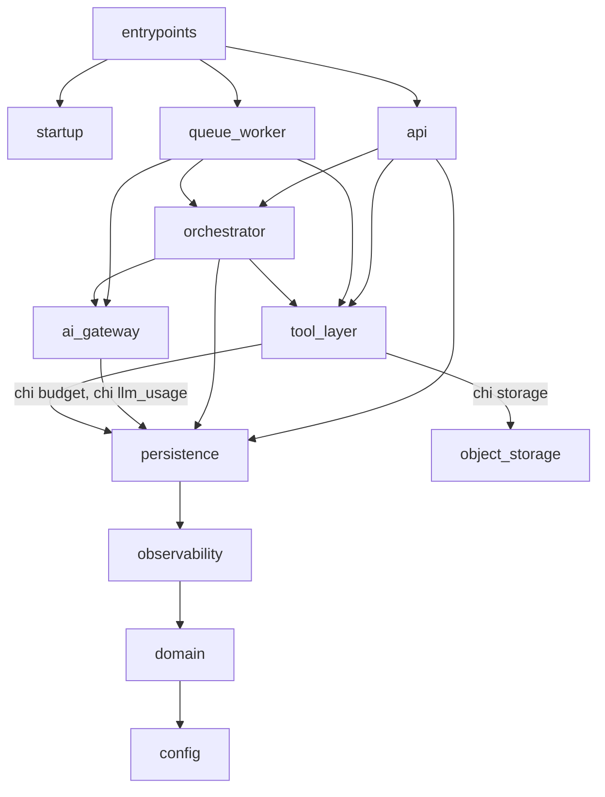
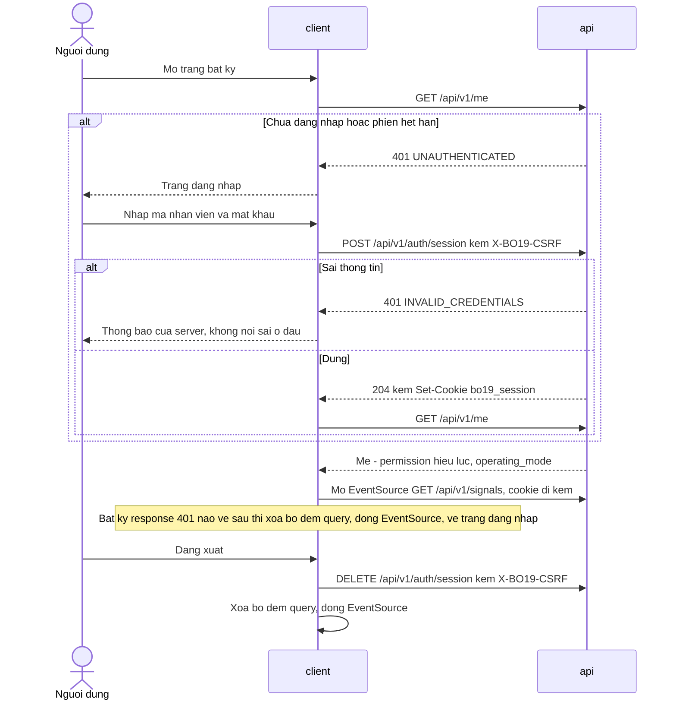
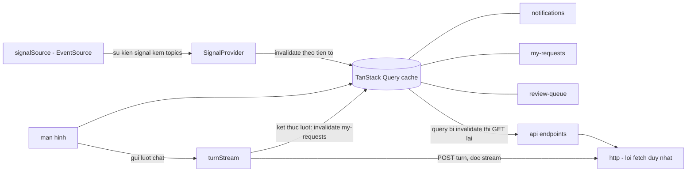

# Project Structure — Admin Service Desk Agent (BO-19)

**Phiên bản:** 0.1 · **Trạng thái:** Draft chờ duyệt

> File này chốt cây thư mục của backend và frontend, luật "được import gì, cấm import gì" kèm **thứ gì chặn vi phạm**, entrypoint và cách chạy trên Render, bước kiểm khởi động, trình tự migration so với checkpointer, và kết quả xác minh contract DDL. File này **không** chứa implementation (DESIGN MODE — mục Chế độ làm việc hiện tại của `CLAUDE.md`). Hai khối `.importlinter` và `Dockerfile` bên dưới là **đặc tả**, không phải file. File này cũng **không** thiết kế màn hình tiếp quản hay quy tắc hiển thị theo độ nhạy (Phase 8), AuthZ chi tiết và quản lý secret (Phase 9), và **không** định cỡ tham số vận hành (Phase 11).

Tên thành phần, entity, trạng thái, tool, endpoint dùng đúng `GLOSSARY.md`.

**Đã đối chiếu:** `CLAUDE.md`, `_PLAN.md`, `GLOSSARY.md`, `ASSUMPTIONS.md`, `CHANGELOG.md`, `01-prd.md` (mục Scope & priority, F3, F4, F6, NFR), `02-architecture.md`, `03-agents.md`, `04-data.md`, `05-api.md`, `contracts/schema.sql`, `contracts/openapi.yaml`, ADR-001 → ADR-014. Chỗ lệch tìm thấy đã sửa ở file gốc theo phép của anh (mục ngày 2026-09-13, lần 8 của `CHANGELOG.md`), hoặc ghi ở Open Questions.

**ADR mới:** ADR-015 (LibreOffice headless, một image, manifest font), ADR-016 (lượt chat tách khỏi kết nối), ADR-017 (SQL-first, migration ngoài runtime), ADR-018 (frontend), ADR-019 (`ai_gateway` ghi `llm_usage`).

**Nguồn mới trong `docs/reference/`:** `langgraph-checkpoint-postgres.md`, `starlette-streaming-disconnect.md`, `web-platform-sse-cors-samesite.md`, `render-deploys-docker.md`, `libreoffice-headless-convert.md`.

---

## 1. Nguyên tắc

- **Một repo, hai cây mã:** `backend/` là một package Python tên `bo19`; `frontend/` là một SPA React. Contract nằm ở `docs/design/contracts/` và là nguồn — mã theo nó, không ngược lại.
- **Mỗi thành phần ở mục Thành phần kiến trúc hệ thống của `GLOSSARY.md` là một package con cùng tên.** Nhìn tên package là biết nó thuộc thành phần nào; ranh giới của component diagram ở `02-architecture.md` thành ranh giới import.
- **Mọi luật trong file này trả lời "thứ gì chặn vi phạm".** Có bốn loại chặn, ghi đúng tên, không làm tròn:

| Loại chặn | Nghĩa |
|---|---|
| **DB** | PostgreSQL từ chối — quyền, ràng buộc, giao dịch chỉ đọc |
| **Tĩnh** | CI đỏ — `import-linter` cho Python, ESLint cho TypeScript |
| **Khởi động** | Tiến trình từ chối khởi động |
| **Quét văn bản** | CI quét mã nguồn theo mẫu. Heuristic: lách được bằng cách viết khác mẫu. **Không** phải bất biến |
| **Review** | Chỉ có người đọc. Nói thẳng khi chỉ có loại này |

| Thành phần | Package | Tiến trình |
|---|---|---|
| `client` | `frontend/` | Bản build tĩnh do `api` phục vụ (ADR-013) |
| `api` | `bo19.api` | Web Service |
| `ai_gateway` | `bo19.ai_gateway` | Thư viện trong `api` và `queue_worker` |
| `orchestrator` | `bo19.orchestrator` | Thư viện trong `api` và `queue_worker` (ADR-005) |
| `tool_layer` | `bo19.tool_layer` | Thư viện trong `api` và `queue_worker` |
| `vector_store` | Truy vấn trong `bo19.tool_layer.retrieval` | `postgresql` (ADR-002) |
| `postgresql` | Lớp truy cập: `bo19.persistence` | — |
| `object_storage` | Adapter: `bo19.object_storage` | Dịch vụ ngoài Render (ADR-003) |
| `queue_worker` | `bo19.queue_worker` | Background Worker và Cron Job |
| `observability` | `bo19.observability` | Thư viện trong mọi tiến trình |

Ba package không phải thành phần: `bo19.domain` (enum, bảng chuyển trạng thái, hàm kiểm thuần), `bo19.config` (cấu hình có kiểu), `bo19.startup` (bước kiểm khởi động), cộng `bo19.entrypoints` (composition root của từng tiến trình).

---

## 2. Cây thư mục gốc

```text
.
├── backend/                  # package bo19 — mục 3
├── frontend/                 # SPA React — mục 10
├── fonts/                    # bộ font của A-058, kèm giấy phép từng font — đưa vào image
├── docs/
│   ├── reference/            # nguồn gốc được phép trích
│   └── design/               # tài liệu thiết kế; contracts/ là nguồn của mã
└── Dockerfile                # một image cho mọi tiến trình — mục 6.2, ADR-015
```

---

## 3. Cây backend

```text
backend/
├── pyproject.toml            # phụ thuộc ghim bằng lockfile, kể cả langgraph-checkpoint-postgres
├── .importlinter             # contract ranh giới — mục 4.1
├── migrations/
│   ├── schema/               # 0001_initial.sql = contracts/schema.sql ở trạng thái đóng Phase 6; về sau mỗi thay đổi một file
│   ├── library/              # checkpointer_grants.sql — quyền trên bảng của thư viện, chạy sau setup() (mục 8)
│   └── data/                 # danh mục permission, vai trò, bản đầu request_type (mục Nguyên tắc dữ liệu của 04-data.md)
└── src/bo19/
    ├── config/               # đọc biến môi trường thành cấu hình có kiểu; trần budget, múi giờ, hạn chót không có giá trị rỗng
    ├── domain/               # enum theo GLOSSARY.md, bảng chuyển trạng thái, hàm kiểm đủ điều kiện xử lý dạng thuần, mã lỗi nội bộ — không IO
    ├── observability/
    │   ├── log.py            # lối ghi log duy nhất: sự kiện = mã + trường có kiểu; giá trị slot phải mang slot_sensitivity
    │   ├── masking.py        # mask PER/RES; input không phải slot mà có thể mang RES thì mask như RES (mục Allowlist input của 03-agents.md)
    │   ├── handler.py        # handler JSON duy nhất gắn vào root logger; bản ghi của thư viện bên thứ ba bị rút về tên logger + mức + kiểu lỗi
    │   ├── trace.py          # trace_id theo contextvar, xuyên api → orchestrator → tool_layer → queue_worker
    │   └── metrics.py        # điểm đo cho bảng chỗ quan sát của Phase 11
    ├── persistence/
    │   ├── pool.py           # hai ngữ nghĩa: acquire(timeout) cho nghiệp vụ; try_acquire() trả None ngay khi pool cạn — cho vòng poll tín hiệu (ADR-013)
    │   ├── read.py           # lối đọc: mọi giao dịch mở ở READ ONLY — ghi bị PostgreSQL từ chối (mục 9)
    │   ├── write.py          # lối ghi: unit of work một giao dịch
    │   ├── probe.py          # phép thử quyền cho bước kiểm khởi động: giao dịch thường, LUÔN rollback, chỉ nhận câu có WHERE false
    │   └── errors.py         # tên ràng buộc ck_/uq_/fk_ → mã lỗi nội bộ của tool
    ├── object_storage/       # adapter S3-compatible; chỉ tool_layer.storage được import (mục 4.2)
    ├── tool_layer/
    │   ├── kernel/
    │   │   ├── context.py    # tác nhân (người thật hoặc hệ thống), permission hiệu lực, trace_id
    │   │   ├── permission.py # kiểm permission — không kiểm tên vai trò (D-005)
    │   │   ├── audit.py      # ghi audit_event trong cùng giao dịch
    │   │   ├── transition.py # ĐIỂM GHI DUY NHẤT của cột status: status, status_changed_at, row_version trong một câu UPDATE (mục 4.2)
    │   │   └── enqueue.py    # enqueue job trong giao dịch của thao tác gọi nó (ADR-004, ADR-010)
    │   ├── jobs/             # giành, gia hạn lease, kết thúc job cho queue_worker — không sinh audit_event, chờ A-055
    │   ├── storage/          # giao thức ghi một lần (mục Lưu trữ file và bất biến bản render của 04-data.md); NƠI DUY NHẤT ghi stored_object, stored_object_commit
    │   ├── rendering/
    │   │   ├── docx_fill.py  # điền bảng giá trị biến vào .docx; watermark theo operating_mode đã ghim
    │   │   ├── convert.py    # tiến trình soffice cho mỗi lần chuyển đổi (ADR-015)
    │   │   └── fonts.py      # liệt kê font file .docx khai dùng; kiểm font có mặt trong image — khớp chính xác tên họ
    │   ├── numbering/        # giao dịch cấp số ngắn (ADR-011)
    │   ├── retrieval/        # hybrid search trên procedure_chunk và bảng collection ACTIVE; lọc quyền trong SQL
    │   ├── checks/           # nạp dữ liệu cho hàm kiểm đủ điều kiện xử lý của domain — một lối nạp cho cả node, thao tác và RequestDetail
    │   ├── tools/            # một module cho mỗi tool ở mục Tool Registry của 03-agents.md
    │   ├── gate_ops/         # thao tác cổng: request_submit … booking_confirm
    │   ├── employee_ops/     # request_slot_confirm
    │   ├── endpoint_ops/     # mười ba thao tác do endpoint gọi — mục Endpoint của 05-api.md
    │   ├── config_ops/       # slot_sensitivity_change
    │   └── ops/              # expire_request, object_claim_reconcile; phần ghi của procedure_ingest
    ├── ai_gateway/
    │   ├── gateway.py        # LỐI VÀO DUY NHẤT: call(module, inputs, budget_owner) → kiểm allowlist → kiểm budget → provider → ép JSON → ghi sổ
    │   ├── allowlist/        # so tập khoá input bằng đúng tập đã khai — thừa hay thiếu đều từ chối (ADR-008)
    │   ├── prompt_modules/   # khai báo từng prompt module: input đích danh, output schema, tier — nội dung thuộc Phase 7
    │   ├── routing/          # tier → model; provider chưa chọn (A-026)
    │   ├── json_contract/    # ép JSON Schema, sửa lỗi parse đúng một lần
    │   ├── budget/           # ADR-019: MODULE DUY NHẤT đọc và ghi llm_usage
    │   └── providers/        # adapter LLM và embedding — nơi duy nhất import SDK của provider
    ├── orchestrator/
    │   ├── state/            # IntakeState, DocumentState, chuỗi nâng cấp schema_version N → N+1 (mục State schema của 03-agents.md)
    │   ├── intake_graph/     # node và cạnh của intake_graph
    │   ├── document_graph/   # node và cạnh của document_graph
    │   ├── runtime/
    │   │   ├── builder.py    # lối dựng graph duy nhất: mọi node đi qua biên node
    │   │   ├── node_boundary.py # chỉ exception mang mã rời một node (mục 4.2)
    │   │   ├── checkpointer.py  # tạo PostgresSaver với kết nối autocommit; KHÔNG BAO GIỜ gọi setup()
    │   │   ├── threads.py    # ghi graph_thread — ngoại lệ đóng số 2
    │   │   └── purge.py      # checkpoint_purge: delete_thread của thư viện, rồi graph_thread → PURGED
    │   └── runner.py         # lối vào công khai: run_intake_turn, run_render, resume_document, run_finalize_issue, purge_thread
    ├── queue_worker/
    │   ├── dispatcher.py     # vòng poll SKIP LOCKED qua tool_layer.jobs; drain khi SIGTERM
    │   ├── handlers/         # job_type → runner của orchestrator, thao tác của tool_layer, hoặc ai_gateway (embedding của procedure_ingest)
    │   └── cron/             # expire_request, object_claim_reconcile; [Should] quét SLA, nhả HELD, hoàn tất room_booking
    ├── api/
    │   ├── app.py            # app factory: mount /api/v1, phục vụ bản build client, luật 404 (mục 10.4)
    │   ├── routers/          # một router cho mỗi nhóm endpoint ở mục Endpoint của 05-api.md
    │   ├── deps/             # xác thực bo19_session, X-BO19-CSRF, permission, Idempotency-Key, expected_row_version
    │   ├── queries/          # truy vấn cho mọi GET — chỉ qua persistence.read
    │   ├── schemas/          # model request/response khớp openapi.yaml
    │   ├── errors.py         # mã lỗi nội bộ → error_code; mã không có ánh xạ thì INTERNAL_ERROR (mục Mã lỗi của 05-api.md)
    │   ├── turns/            # bộ giám sát lượt: task lượt tách khỏi request (ADR-016)
    │   └── sse/              # chuyển tiếp stream lượt; stream tín hiệu dùng try_acquire
    ├── startup/              # bước kiểm khởi động — mục 7
    └── entrypoints/          # api_main, worker_main, cron_main, migrate_main — composition root; không ai import entrypoints
```

Thư mục `tests/` thuộc BUILD MODE; ở phase này chỉ ghi hai nhóm đã có chủ: test đối chiếu `api/schemas` với `openapi.yaml`, và test canary checkpoint của Phase 10.

**Ghi chú về vị trí**

- `procedure_ingest` là thao tác vận hành nhưng cần embedding. `tool_layer` không được gọi `ai_gateway` (mục 4.1). Vì vậy handler của nó ở `queue_worker` ghép ba bước: đọc và tách chunk qua `tool_layer`, embed qua `ai_gateway`, ghi qua `tool_layer.ops`. Cùng khuôn với `procedure_retrieval` nhận `query_embedding` làm input thay vì tự embed.
- `checkpoint_purge` là thao tác vận hành, nhưng thứ nó xoá là bảng checkpoint — ngoại lệ đóng số 1, chỉ lớp chạy graph được ghi. Vì vậy phần xoá nằm ở `orchestrator.runtime.purge`, job handler chỉ gọi nó.
- `api` gọi `orchestrator` qua đúng một hàm, `run_intake_turn`. Mọi đường khác vào graph là job của `queue_worker` (ADR-010).

---

## 4. Luật import

### 4.1 Đặc tả `.importlinter`

Cú pháp theo tài liệu của phiên bản `import-linter` được chọn — `[CẦN XÁC MINH]`, tài liệu chưa có trong `docs/reference/`. Tên package của SDK provider và SDK S3 điền khi A-026, A-024 chốt.

```ini
[importlinter]
root_package = bo19
include_external_packages = True

[importlinter:contract:layers]
name = Tầng — chỉ import xuống
type = layers
layers =
    bo19.entrypoints
    bo19.startup
    bo19.api | bo19.queue_worker
    bo19.orchestrator
    bo19.ai_gateway | bo19.tool_layer
    bo19.object_storage | bo19.persistence
    bo19.observability
    bo19.domain
    bo19.config

[importlinter:contract:siblings-llm-tools]
name = ai_gateway và tool_layer độc lập (ADR-019)
type = independence
modules =
    bo19.ai_gateway
    bo19.tool_layer

[importlinter:contract:api-surface]
name = api chỉ vào orchestrator qua runner, không chạm ai_gateway hay lối ghi
type = forbidden
source_modules = bo19.api
forbidden_modules =
    bo19.ai_gateway
    bo19.persistence.write
    bo19.object_storage
    bo19.orchestrator.intake_graph
    bo19.orchestrator.document_graph
    bo19.orchestrator.runtime
    bo19.orchestrator.state

[importlinter:contract:write-path]
name = Lối ghi DB — chỉ tool_layer và ba chủ ngoại lệ
type = forbidden
source_modules =
    bo19.api
    bo19.queue_worker
    bo19.startup
    bo19.ai_gateway.gateway
    bo19.ai_gateway.allowlist
    bo19.ai_gateway.prompt_modules
    bo19.ai_gateway.routing
    bo19.ai_gateway.json_contract
    bo19.ai_gateway.providers
    bo19.orchestrator.intake_graph
    bo19.orchestrator.document_graph
    bo19.orchestrator.state
    bo19.orchestrator.runner
forbidden_modules = bo19.persistence.write
# Được import bo19.persistence.write: bo19.tool_layer, bo19.ai_gateway.budget (ngoại lệ 3),
# bo19.orchestrator.runtime (ngoại lệ 1 và 2 — checkpoint, graph_thread), bo19.entrypoints.
# bo19.startup dùng bo19.persistence.probe: phép thử quyền cần giao dịch thường — trong giao dịch
# READ ONLY, PostgreSQL báo lỗi chỉ đọc trước khi kiểm quyền, nên phép thử mất nghĩa.

[importlinter:contract:probe]
name = Chỉ bước kiểm khởi động dùng lối thử quyền
type = forbidden
source_modules =
    bo19.api
    bo19.queue_worker
    bo19.orchestrator
    bo19.ai_gateway
    bo19.tool_layer
forbidden_modules = bo19.persistence.probe

[importlinter:contract:object-storage]
name = Chỉ tool_layer.storage chạm object_storage (mục Lưu trữ file và bất biến bản render của 04-data.md)
type = forbidden
source_modules =
    bo19.api
    bo19.queue_worker
    bo19.orchestrator
    bo19.ai_gateway
    bo19.tool_layer.kernel
    bo19.tool_layer.jobs
    bo19.tool_layer.rendering
    bo19.tool_layer.numbering
    bo19.tool_layer.retrieval
    bo19.tool_layer.checks
    bo19.tool_layer.tools
    bo19.tool_layer.gate_ops
    bo19.tool_layer.employee_ops
    bo19.tool_layer.endpoint_ops
    bo19.tool_layer.config_ops
    bo19.tool_layer.ops
forbidden_modules =
    bo19.object_storage
    <sdk-s3>                  # A-024

[importlinter:contract:allowlist-gate]
name = Đường tới provider đi qua gateway — nơi kiểm allowlist
type = forbidden
source_modules =
    bo19.api
    bo19.queue_worker
    bo19.orchestrator
    bo19.tool_layer
    bo19.ai_gateway.prompt_modules
    bo19.ai_gateway.routing
    bo19.ai_gateway.json_contract
    bo19.ai_gateway.budget
forbidden_modules =
    bo19.ai_gateway.providers
    <sdk-llm>                 # A-026
    <sdk-embedding>           # A-028

[importlinter:contract:graph-library]
name = LangGraph chỉ ở orchestrator.runtime — node chỉ vào graph qua builder có biên node
type = forbidden
source_modules =
    bo19.api
    bo19.queue_worker
    bo19.tool_layer
    bo19.ai_gateway
    bo19.orchestrator.intake_graph
    bo19.orchestrator.document_graph
    bo19.orchestrator.state
    bo19.orchestrator.runner
forbidden_modules =
    langgraph
```

### 4.2 Nghĩa vụ kế thừa — thứ gì chặn vi phạm

| Nghĩa vụ | Đặt ở | Chặn bằng | Chỗ hở còn lại |
|---|---|---|---|
| **Mọi chuyển trạng thái ghi `status_changed_at`** (mục Phân trang của `05-api.md`) | `tool_layer.kernel.transition` — hàm duy nhất sinh câu `UPDATE` đổi `status`, luôn ghi `status`, `status_changed_at = now()`, `row_version + 1`, với điều kiện trạng thái mong đợi và `row_version` | **Điểm ghi duy nhất** cộng **quét văn bản**: CI tìm câu SQL gán cột `status` của `request`, `document`, `approval_step`, `room_booking` ngoài `transition.py` | **Không phải bất biến DB.** Một `CHECK` không so được giá trị cũ với giá trị mới, và `schema.sql` không dùng trigger. SQL dựng động lách được phép quét — chỗ đó chỉ còn **review** |
| **Chỉ module lưu trữ ghi `stored_object`** (mục Lưu trữ file và bất biến bản render của `04-data.md`) | `tool_layer.storage` | **Tĩnh:** contract `object-storage` — chỉ `tool_layer.storage` import adapter và SDK S3. **Quét văn bản:** tên bảng `stored_object`, `stored_object_commit` chỉ xuất hiện trong `tool_layer/storage/`; lệnh `INSERT` vào `document_render` chỉ trong `tools/pdf_export` | Credential bucket có mặt trong `api` (tải file) và `queue_worker`. Mã viết một HTTP client riêng tới bucket thì lách được import contract. Quản lý credential: Phase 9 |
| **Allowlist input** (ADR-008, mục Allowlist input của `03-agents.md`) | `ai_gateway.gateway.call` kiểm tập khoá bằng `ai_gateway.allowlist` **trước** mọi thứ khác | **Tĩnh:** contract `allowlist-gate` — không ai ngoài `gateway` import `providers` hay SDK của provider, nên không có đường tới provider mà không đi qua phép kiểm. Contract `api-surface` — `api` không import `ai_gateway` | Mã gọi thẳng HTTP API của provider bằng một HTTP client chung thì lách được. **Quét văn bản:** tên host của provider chỉ xuất hiện trong `providers/` — điền khi A-026 chốt |
| **Mask log theo `slot_sensitivity`** (NFR-05) | `observability` | **Khởi động:** root logger chỉ có đúng handler của `observability` (mục 7, kiểm 10). **Kiểu:** API ghi log chỉ nhận mã sự kiện và trường có kiểu; giá trị slot phải bọc kèm độ nhạy. **Quét văn bản:** không module nào ngoài `observability` tạo logger hay handler riêng | Thư viện bên thứ ba tự ghi log bằng chuỗi tự do. Handler không phân loại được chuỗi đó, nên nó **bỏ nội dung**, chỉ giữ tên logger, mức và kiểu lỗi. Mất thông tin debug của thư viện — chấp nhận |
| **Exception rời node chỉ mang mã** — mới ở Phase 6 (A-045) | `orchestrator.runtime.node_boundary`, gắn vào mọi node qua `builder` | **Tĩnh:** contract `graph-library` — chỉ `orchestrator.runtime` import `langgraph`, nên không đường nào thêm node vào graph mà không qua `builder`. Biên node bắt mọi exception, ném lại một exception chỉ mang mã, cắt chuỗi nguyên nhân | LangGraph lưu exception của node vào checkpoint (`docs/reference/langgraph-checkpoint-postgres.md`). Thông điệp có vào `blob` hay không chưa rõ, nên biên node là cần. Kiểm chứng: test canary Phase 10 phải có ca node ném exception mang giá trị `RES` |
| **Pool cạn thì bỏ lượt** (ADR-013) | `persistence.pool.try_acquire` | **Kiểu:** stream tín hiệu chỉ nhận connection qua `try_acquire` | **Review** — không có contract tĩnh phân biệt hai hàm của cùng module |
| **Bước kiểm khởi động** | `bo19.startup` | Mục 7 | — |

---

## 5. Sơ đồ phụ thuộc giữa package



Chiều phụ thuộc trùng component diagram của `02-architecture.md`, cộng cạnh của ADR-019. Không cạnh nào giữa `ai_gateway` và `tool_layer`, không cạnh nào đi lên. `api` → `persistence` là lối đọc; lối ghi bị contract `api-surface` chặn. Mọi package đều dùng `observability`, `domain`, `config`; sơ đồ chỉ vẽ một cạnh đại diện để giữ dưới 20 node.

---

## 6. Entrypoint và deploy trên Render

### 6.1 Tiến trình

| Lệnh | Service Render | Việc |
|---|---|---|
| `python -m bo19.entrypoints.api_main` | Web Service — `CMD` mặc định của image | REST, hai stream SSE, phục vụ bản build client, bộ giám sát lượt |
| `python -m bo19.entrypoints.worker_main` | Background Worker — Docker Command | Vòng poll job: `render_document`, `resume_document_graph`, `finalize_issue`, `checkpoint_purge`, `procedure_ingest`, `notification_send` |
| `python -m bo19.entrypoints.cron_main <thao tác>` | Một Cron Job cho mỗi thao tác — Docker Command | `expire_request`, `object_claim_reconcile`; `[Should]` quét SLA, nhả `HELD`, hoàn tất `room_booking` |
| `python -m bo19.entrypoints.migrate_main` | **Không phải service runtime** — chạy trong ngữ cảnh chỉ giữ credential `bo19_migrator` (ADR-017, A-060) | Mục 8 |

Theo nguồn đã ghim của Render: cron job dựa trên Docker chạy lệnh khởi động của image, ghi đè được bằng Docker Command; một bản build mới "does not affect in-progress runs (only future runs)" (`docs/reference/render-deploys-docker.md`).

### 6.2 Đặc tả `Dockerfile`

Đây là đặc tả, không phải file. Mọi `<…>` chốt ở BUILD MODE. Tên gói hệ điều hành của LibreOffice và công cụ liệt kê font `[CẦN XÁC MINH]` theo kho gói của image nền được chọn. Không ghi số phiên bản nào từ trí nhớ.

```dockerfile
# --- giai đoạn 1: build client -------------------------------------------
FROM <node-image-ghim-theo-digest> AS client-build
WORKDIR /client
COPY frontend/package.json frontend/<lockfile> ./
RUN <cài phụ thuộc đúng theo lockfile>
COPY frontend/ ./
COPY docs/design/contracts/openapi.yaml /contracts/openapi.yaml
RUN <sinh lại type từ openapi.yaml và so với file đã commit — lệch thì hỏng build> \
 && <lint, gồm luật một lối fetch> \
 && <build Vite ra /client/dist>

# --- giai đoạn 2: runtime chung ---------------------------------------------
FROM <python-image-ghim-theo-digest> AS runtime
RUN <cài LibreOffice bản không giao diện, chỉ phần Writer> \
 && <cài công cụ liệt kê font>
COPY fonts/ /usr/local/share/fonts/bo19/        # A-058 — mỗi font kèm file giấy phép
RUN <làm mới bộ đệm font>
RUN <tạo user hệ thống không đặc quyền: bo19>
WORKDIR /app
COPY backend/pyproject.toml backend/<lockfile> ./
RUN <cài phụ thuộc Python đúng theo lockfile, không có phụ thuộc dev>
COPY backend/ ./
COPY --from=client-build /client/dist /app/static
USER bo19
CMD ["python", "-m", "bo19.entrypoints.api_main"]
```

Một image cho mọi tiến trình. Lý do, cái giá — `api` cõng LibreOffice, và cold start của `api` là cold start của trang — cùng điều kiện tách thành hai target: ADR-015. Chỗ quan sát cold start: dòng ADR-015 ở bảng chỗ quan sát của Phase 11 trong `_PLAN.md`.

### 6.3 Tắt tiến trình êm

Lý do và ràng buộc cấu hình ở ADR-016. Mốc thời gian lấy từ nguồn đã ghim của Render: `SIGTERM` tới instance cũ 60 giây sau khi instance mới nhận traffic; `SIGKILL` sau shutdown delay — mặc định 30 giây, tối đa 300 giây.

| Tiến trình | Khi nhận `SIGTERM` |
|---|---|
| `api` | Ngừng nhận kết nối mới → đóng mọi stream tín hiệu (client nối lại sang instance mới) → chờ task lượt đang chạy xong → tới hạn drain thì huỷ task còn lại, cố ghi tin nhắn agent mang mã khuôn lỗi cho từng task với timeout ngắn → thoát mã 0 |
| `worker` | Ngừng giành job mới → chờ job đang chạy trong hạn drain → job chưa xong thì huỷ tiến trình chuyển đổi đang chạy và trả job về hàng đợi (thả lease). Việc giao job ít nhất một lần của ADR-004 và idempotency của từng tool làm lần chạy lại an toàn → thoát mã 0 |
| cron | Không cần xử lý riêng: lần chạy đang dở không bị bản build mới ảnh hưởng |

---

## 7. Bước kiểm khởi động

Chạy trước khi tiến trình phục vụ request hay giành job đầu tiên. **Chặn** = trượt thì tiến trình ghi danh sách mã trượt vào log rồi thoát với mã khác 0 — không chạy tiếp kèm cảnh báo. Deploy hỏng thì Render giữ bản trước; việc Render tính một tiến trình thoát lúc khởi động là "command fails" `[CẦN XÁC MINH]` bằng một lần deploy thật (ADR-017). **Cảnh báo** = ghi log và metric, vẫn khởi động.

| # | Kiểm gì | `api` | `worker` | cron | Mức | Cơ sở |
|---|---|---|---|---|---|---|
| 1 | Mọi migration mà bản build biết đã có trong `schema_migration`; sha256 khớp | ✔ | ✔ | ✔ | **Chặn** | ADR-017 |
| 2 | **Kiểm phủ định quyền**, qua `persistence.probe`: trong một giao dịch thường rồi rollback, `UPDATE audit_event SET id = id WHERE false` phải bị từ chối vì thiếu quyền; và `current_user` không sở hữu bảng nào trong schema `public`. Chạy thử local: phép thử trả đúng lỗi thiếu quyền, không chạm dòng nào (mục 9) | ✔ | ✔ | ✔ | **Chặn** — phép kiểm giá trị nhất: nó chứng minh mục Nguyên tắc dữ liệu của `04-data.md` có tác dụng thật, và bắt ca lỡ nối bằng `bo19_migrator` | A-040, A-047 |
| 3 | Checkpointer: `max(v)` của `checkpoint_migrations` bằng số mà phiên bản thư viện đã ghim cần (`9` với 3.1.2); `bo19_app` có đủ `SELECT, INSERT, UPDATE, DELETE` trên ba bảng dữ liệu. **Không gọi `setup()`** | ✔ | ✔ | — | **Chặn** | A-045, mục 8 |
| 4a | Extension `vector` có mặt | ✔ | ✔ | — | **Chặn** | ADR-012 |
| 4b | Collection `ACTIVE`, nếu có: tên bảng thuộc danh sách mà bản build biết; số chiều đọc từ catalog bằng `embedding_collection.dimension`; model embedding trong cấu hình bằng `model_id` của collection. Chạy thử local: `bo19_app` đọc được số chiều `1024` từ catalog | ✔ | ✔ | — | **Chặn** khi lệch | Mục Vector collection của `04-data.md`, ADR-012 |
| 4c | Không có collection `ACTIVE` | ✔ | ✔ | — | Cảnh báo — kho rỗng là trạng thái được thiết kế (A-027) | Mục Vector collection của `04-data.md` |
| 5 | Mọi trần budget đã cấu hình: token mỗi `request`, mỗi `chat_session`, mỗi lần nạp kho; trần số vòng `CHANGES_REQUESTED`. Giá trị được phép mang nhãn "chưa hiệu chỉnh" (A-031), không được vắng | ✔ | ✔ | — | **Chặn** | ADR-019, A-022 |
| 6 | Chạy được `soffice` ở chế độ headless trong timeout | — | ✔ | — | **Chặn** | ADR-015 |
| 7 | Mọi font trong `required_fonts` của mọi phiên bản `ACTIVE`, **cộng** của mọi phiên bản mà một `document` chưa tới trạng thái kết thúc đang dùng, có mặt trong image — khớp chính xác tên họ | — | ✔ | — | **Chặn** | ADR-015, A-058 |
| 8 | Bản build client có mặt: `index.html` và danh sách asset | ✔ | — | — | **Chặn** | ADR-013, ADR-018 |
| 9 | Với mọi `graph_thread` đang `ACTIVE` hay `WAITING`: `state_schema_version` không lớn hơn phiên bản code, và có chuỗi nâng cấp từ nó; `waiting_at_node` là tên node `interrupt` mà code biết, kể cả bí danh | ✔ | ✔ | — | **Chặn** | Mục Schema state đổi giữa chừng của `03-agents.md` |
| 10 | Root logger có đúng một handler, là handler mask của `observability` | ✔ | ✔ | ✔ | **Chặn** | NFR-05 |
| 11 | Ràng buộc cấu hình: hạn chót lượt cộng biên không dài hơn shutdown delay (`api`); lease của `stored_object` dài hơn timeout của lớp tool chạm `object_storage` (`worker`) | ✔ | ✔ | — | **Chặn** | ADR-016, mục Lưu trữ file và bất biến bản render của `04-data.md` |
| 12 | Secret ký `bo19_session` có mặt | ✔ | — | — | **Chặn** | ADR-013 |
| 13 | Múi giờ của tổ chức có trong cấu hình | ✔ | ✔ | ✔ | **Chặn** — `issued_date` và kỳ đánh số phụ thuộc nó | A-041 |
| 14 | `object_storage` với tới được | ✔ | ✔ | — | Cảnh báo — sự cố tạm thời không được làm tiến trình khởi động lại liên tục; thao tác hỏng lúc dùng trả `FILE_UNAVAILABLE` hoặc job thử lại | ADR-014 |
| 15 | `operating_mode` hiện hành | ✔ | ✔ | — | Ghi log — chưa có dòng nào là `NON_PRODUCTION` | D-009 |

---

## 8. Migration và checkpointer

Lập luận ở ADR-017; bằng chứng chạy thật ở mục 9. Bảng dưới là thứ tự, không lặp lập luận.

| Bước | Việc | Role | Giao dịch |
|---|---|---|---|
| 0 | `CREATE EXTENSION vector` | Role có quyền tạo extension — local là superuser; Render: A-040 vế (3) | — |
| 1 | `migrations/schema/*.sql` theo thứ tự | `bo19_migrator` | Mỗi file một giao dịch |
| 2 | `setup()` của `langgraph-checkpoint-postgres` đã ghim | `bo19_migrator` | Autocommit — trong giao dịch thì hỏng |
| 3 | `migrations/library/checkpointer_grants.sql` — chạy lại sau mỗi lần nâng thư viện | `bo19_migrator` | Một giao dịch |
| 4 | `migrations/data/*.sql` theo thứ tự | `bo19_migrator` | Mỗi file một giao dịch |

Nội dung `migrations/library/checkpointer_grants.sql` — DDL, là contract; đã chạy thử:

```sql
-- Chạy bằng bo19_migrator, SAU setup() của thư viện checkpointer.
-- Bảng do thư viện tạo (docs/reference/langgraph-checkpoint-postgres.md).
GRANT SELECT, INSERT, UPDATE, DELETE ON checkpoints, checkpoint_blobs, checkpoint_writes TO bo19_app;
GRANT SELECT ON checkpoint_migrations TO bo19_app;
```

- `UPDATE` cần vì thư viện upsert `checkpoints` và `checkpoint_writes`. `DELETE` cần cho `delete_thread`, mà `checkpoint_purge` dùng. `SELECT` trên `checkpoint_migrations` cần cho kiểm 3 ở mục 7.
- **Rủi ro "thư viện đòi quyền rộng" (A-045):** quyền mà thư viện cần lúc chạy chỉ là bốn quyền trên ba bảng của chính nó. Quyền tạo bảng chỉ cần lúc `setup()`, và bước đó chạy bằng `bo19_migrator`. `bo19_app` gọi `setup()` thì bị từ chối — đã chạy thử.

---

## 9. Xác minh contract — kết quả Câu 4

### 9.1 Môi trường

| Hạng mục | Giá trị |
|---|---|
| PostgreSQL | **16.2** — `PostgreSQL 16.2 on x86_64-pc-mingw64`, bản build Windows |
| pgvector | **0.6.2** |
| Cách dựng | Gói Python `pgserver` 0.1.4 trong một venv của scratchpad. **Không qua Docker** như chỉ thị: Docker Desktop trên máy không khởi động được — engine WSL không đọc được đĩa dữ liệu của chính nó — và sửa đĩa đó là thao tác phá huỷ trên dữ liệu Docker của anh, nên không làm |
| Thư viện | `psycopg` 3.3.5 · `langgraph-checkpoint-postgres` 3.1.2 · `langgraph-checkpoint` 4.2.0 |
| `schema.sql` đã áp | sha256 `0ce8ddeeb0fda9df246733af1670c0dd2f70c9dea18d4220149c8a5e05f63e82` — bản cuối của Phase 6, có hai thay đổi của ADR-019 và ADR-015 |
| Ngày chạy | 2026-09-13 |

Bản build là Windows, Render chạy Linux. Kết quả về quyền và DDL không phụ thuộc hệ điều hành theo cách đã biết, nhưng đó là suy luận, không phải số đo.

### 9.2 Kết quả

| Phép thử | Kết quả |
|---|---|
| Tạo role `bo19_migrator`, `bo19_app`; database do `bo19_migrator` sở hữu | Đạt |
| Áp `schema.sql` bằng `bo19_migrator` | **Hỏng ở câu đầu:** `permission denied to create extension "vector"`. Superuser tạo extension rồi áp lại bằng `bo19_migrator`: **đạt**. Phát hiện ghi vào A-040 vế (3) và bước 0 của mục 8 |
| Số bảng trong `public` · chủ sở hữu | **45** · mọi bảng do `bo19_migrator` sở hữu |
| Số chiều cột `embedding` của `procedure_chunk_embedding_v1` | `1024` |
| `setup()` của checkpointer, `bo19_migrator`, autocommit | Đạt; `max(v)` của `checkpoint_migrations` = `9` |
| `setup()` trên database sạch, **không** autocommit | **Hỏng:** `CREATE INDEX CONCURRENTLY cannot run inside a transaction block` |
| **Kiểm phủ định** — `bo19_app` bị từ chối đúng: `INSERT`/`UPDATE`/`DELETE`/`TRUNCATE` trên nhóm chỉ đọc; `UPDATE`/`DELETE`/`TRUNCATE` trên nhóm chỉ thêm — kể cả `audit_event` và `llm_usage`; `UPDATE`/`TRUNCATE` trên nhóm thêm và xoá; `DELETE`/`TRUNCATE` trên nhóm sửa được — kể cả `DELETE` trên `document`; `UPDATE` trên **từng cột ngoài danh sách** của nhóm sửa theo cột; `INSERT` vào `checkpoint_migrations`; `CREATE TABLE` trong `public` | **169 / 169** bị từ chối đúng |
| Kiểm khẳng định — `bo19_app` được phép đúng các quyền đã cấp | **63 / 63** |
| Lệch so với nhóm quyền ở mục Nguyên tắc dữ liệu của `04-data.md` | **0** |
| `bo19_app` ghi một checkpoint rồi `delete_thread` | Đạt: 1 dòng → 0 dòng |
| `bo19_app` gọi `setup()` | Bị từ chối: `permission denied for schema public` |
| Giao dịch `READ ONLY` của `bo19_app` chạy một `UPDATE` mà nó **có quyền** | Bị từ chối: `cannot execute UPDATE in a read-only transaction` — cơ chế của lối đọc (ADR-017) |
| Phép thử khởi động số 2: `UPDATE audit_event SET id = id WHERE false` | Bị từ chối vì thiếu quyền; `has_table_privilege` trả `false` |

Mọi phép thử quyền dùng `WHERE false` hoặc giao dịch rollback: PostgreSQL kiểm quyền mà không chạm dòng nào.

### 9.3 Docker local — hay ở đây là PostgreSQL local — đóng được gì

| Mã | Đóng được? | Trạng thái sau Phase 6 |
|---|---|---|
| A-047 | **Thu hẹp**, không đóng | Đã áp trên PostgreSQL 16.2, chưa áp trên Render |
| A-040 | **Không.** Phụ thuộc Render cho phép gì. Chạy local chỉ cho thấy thiết kế hai role đứng được **nếu** Render cho tạo chúng — và thêm vế (3): ai tạo extension | Mở |
| A-037, A-046 | **Không.** Phụ thuộc extension nào có trên Render, bản nào | Mở |
| A-045 | **Có**, trừ một vế: exception được tuần tự hoá thế nào | Đã chốt — trừ vế đó, chuyển cho test canary Phase 10 |
| A-051 (1), (2), (3) | **Có**, bằng đặc tả đã ghim | Đã chốt |
| A-051 (4) | Thu hẹp bằng tài liệu Starlette; **không dựng test** — ADR-016 làm nó hết quan trọng | Không còn quyết định gì |

---

## 10. Cây frontend

```text
frontend/
├── package.json · <lockfile> · tsconfig.json · vite.config.ts
├── eslint.config.js             # luật ranh giới — mục 10.2
└── src/
    ├── main.tsx
    ├── app/                     # router, QueryClient, AuthGate, SignalProvider, khung trang, dải báo chế độ thử nghiệm
    ├── api/
    │   ├── transport/
    │   │   ├── http.ts          # LỐI fetch DUY NHẤT: X-BO19-CSRF cho mọi lệnh không phải GET, credentials same-origin, phân tích ErrorEnvelope, đọc body dạng stream
    │   │   ├── signalSource.ts  # EventSource DUY NHẤT — GET /api/v1/signals
    │   │   └── sse.ts           # phân tích text/event-stream cho stream lượt chat
    │   ├── generated/openapi.d.ts  # sinh từ contracts/openapi.yaml, commit, CI kiểm lệch
    │   ├── endpoints/           # một file cho mỗi nhóm endpoint ở mục Endpoint của 05-api.md; chỉ gọi qua transport/http
    │   ├── queryKeys.ts         # ba khoá gốc theo chủ đề tín hiệu và khoá con — ADR-018
    │   └── errors.ts            # rẽ nhánh theo error_code; không bao giờ theo message
    ├── auth/                    # useMe, đăng nhập, đăng xuất, hasPermission — theo permission, không theo vai trò
    ├── signals/                 # nghe signalSource, invalidate theo khoá gốc
    ├── features/
    │   ├── chat/                # ChatPage, danh sách tin nhắn, ô soạn; turnStream.ts — stream lượt, ngoài TanStack Query
    │   ├── my-requests/         # MyRequestsPage, RequestDetailPage, bảng xác nhận từng slot, thanh gửi, huỷ
    │   ├── review/              # ReviewQueuePage, IssueQueuePage, DocumentReviewPage, bảng quyết định, hộp lý do tự duyệt
    │   ├── all-requests/        # danh sách scope=ALL và ASSIGNED — chờ lâu nhất trước
    │   ├── notifications/       # chuông và danh sách thông báo
    │   ├── config/              # template và phiên bản, import hồ sơ, kho quy trình, cấu hình loại yêu cầu
    │   ├── audit/               # nhật ký nghiệp vụ, mục tự duyệt
    │   ├── revoke/              # [Should] khởi tạo và xác nhận thu hồi
    │   └── delegation/          # [Should] chỉ hình dạng
    └── components/              # UI không biết nghiệp vụ: nhãn trạng thái (hiện status_label của server), thông báo lỗi, giá trị có độ nhạy, provenance, nút tải file, trạng thái rỗng
```

**Hook.** Mỗi feature phơi hook dữ liệu của chính nó — ví dụ `useReviewQueue`, `useDocumentReview`, `useRequestDetail`, `useConfirmSlots`, `useTurn` — bọc query và mutation của TanStack Query, khoá nằm dưới đúng khoá gốc ở `api/queryKeys`. Component của feature chỉ gọi hook, không gọi `api/endpoints` trực tiếp; nhờ vậy mỗi query khai chủ đề tín hiệu của nó ở một chỗ. Hook dùng chung không phải dữ liệu server không cần thư mục riêng ở Sprint đầu.

### 10.1 Luật import

| Thư mục | Được import | Cấm import | Chặn bằng |
|---|---|---|---|
| `api/transport` | `api/generated` | Mọi thứ khác | Tĩnh |
| `api/endpoints` | `api/transport/http`, `api/generated` | `features`, `signals`, `auth` | Tĩnh |
| `signals` | `api/transport/signalSource`, `api/queryKeys` | `features`, `api/endpoints` | Tĩnh |
| `auth` | `api/endpoints`, `api/queryKeys` | `features` | Tĩnh |
| `features/<x>` | `api/endpoints`, `api/queryKeys`, `api/errors`, `auth`, `components` | `api/transport` — trừ `features/chat/turnStream.ts` được import `http` và `sse`; mọi `features/<y>` khác | Tĩnh |
| `components` | Không gì trong `src` ngoài `components` | `features`, `api`, `signals`, `auth` | Tĩnh |
| Mọi file trừ `api/transport/http.ts` | — | Biến toàn cục `fetch`, `window.fetch` | Tĩnh |
| Mọi file trừ `api/transport/signalSource.ts` | — | Biến toàn cục `EventSource` | Tĩnh |

### 10.2 Đặc tả luật ESLint

Hình dạng contract, không phải file. Tên tuỳ chọn và cú pháp flat config `[CẦN XÁC MINH]` theo tài liệu của phiên bản ESLint được chọn (ADR-018).

```js
// eslint.config.js — đặc tả
export default [
  { files: ['src/**/*.{ts,tsx}'],
    rules: {
      'no-restricted-globals': ['error', 'fetch', 'EventSource'],
      'no-restricted-properties': ['error',
        { object: 'window', property: 'fetch' },
        { object: 'window', property: 'EventSource' }],
    } },
  { files: ['src/api/transport/http.ts'],         rules: { 'no-restricted-globals': ['error', 'EventSource'] } },
  { files: ['src/api/transport/signalSource.ts'], rules: { 'no-restricted-globals': ['error', 'fetch'] } },
  { files: ['src/components/**'],
    rules: { 'no-restricted-imports': ['error', { patterns: ['@/features/*', '@/api/*', '@/signals/*', '@/auth/*'] }] } },
  { files: ['src/features/**'],
    rules: { 'no-restricted-imports': ['error', { patterns: ['@/api/transport/*'] }] } },
  { files: ['src/features/chat/turnStream.ts'],
    rules: { 'no-restricted-imports': 'off' } },
  // Luật "features/<x> không import features/<y>": một khối cho mỗi feature — chi tiết cấu hình ở BUILD MODE.
];
```

### 10.3 Tuyến

`client` chọn hiện gì theo `Me.permissions`, không theo tên vai trò (D-005). Ẩn hiện ở giao diện chỉ là tiện ích; `api` mới là nơi kiểm (mục Nguyên tắc chung của `05-api.md`).

| Đường dẫn | Trang | Hiện khi có |
|---|---|---|
| `/login` | Đăng nhập | Công khai |
| `/chat` | Hội thoại | `request.create` hoặc `request.create_on_behalf` |
| `/my-requests` · `/my-requests/:requestId` | Yêu cầu của tôi · chi tiết | `request.read_own` |
| `/review/:status` | Hàng đợi duyệt theo một trạng thái | Permission tương ứng `status` |
| `/issue` | Hàng đợi phát hành | `document.issue` |
| `/documents/:documentId` | Màn hình duyệt | `request.read_all`, hoặc `request.read_assigned` |
| `/requests` | Mọi yêu cầu, chờ lâu nhất trước | `request.read_all` hoặc `request.read_assigned` |
| `/config/templates` · `/config/templates/:templateId` | Template, phiên bản, tải lên | `template.manage` |
| `/config/employee-imports` | Import hồ sơ | `employee.import` |
| `/config/procedures` | Kho quy trình | `procedure.manage` |
| `/config/request-types` | Loại yêu cầu và slot | `request_type.manage` — hôm nay từ chối mọi người (A-042) |
| `/audit` · `/audit/self-approvals` | Nhật ký · mục tự duyệt | `audit.read_all` |

Không có tuyến cho: màn hình tiếp quản (Phase 8), dashboard SLA (Phase 11), đổi `operating_mode` (Phase 9), `ROOM_BOOKING` (`[NGOÀI-OPENAPI]`).

### 10.4 Phục vụ tĩnh và luật 404 — phía `api`

| Yêu cầu | Trả |
|---|---|
| Đường dẫn khớp một endpoint dưới `/api/v1` | Endpoint đó |
| Đường dẫn lạ **thuộc** `/api` | `ErrorEnvelope` JSON, `NOT_FOUND`, 404 |
| File lạ dưới thư mục asset của bản build | 404, **không** trả `index.html` |
| Mọi GET lạ còn lại | `index.html` |

Không tuyến SPA nào bắt đầu bằng `/api`; cookie `bo19_session` giới hạn ở `Path=/api` (mục Nguyên tắc chung của `05-api.md`).

---

## 11. Auth flow



Đăng xuất chỉ xoá cookie ở trình duyệt đó; token đã phát không bị thu hồi trước hạn — rủi ro có chủ ở A-048. `Me.operating_mode = NON_PRODUCTION` thì mọi trang hiện dải báo chế độ thử nghiệm; watermark thật nằm trong bản render, không phải ở giao diện (NFR-03).

---

## 12. Luồng dữ liệu frontend



Ánh xạ ba chủ đề sang ba khoá gốc, luật invalidate, và luật dựng lại lượt chat khi stream đứt ở ADR-018 — không lặp ở đây.

---

## 13. Màn hình hàng đợi duyệt — F3, F4

**`ReviewQueuePage` — `/review/:status`**

- Mỗi tab là **một** trạng thái mà người đang đăng nhập có permission: `PENDING_APPROVAL`, `PENDING_SIGNATURE`, `PENDING_SEAL`; cộng tab hàng đợi phát hành ở `/issue`. Mỗi tab gọi `GET /review-queue?status=…` với **một giá trị**, vì cột đầu của `ix_document_review_queue` là `status` (mục Phân trang của `05-api.md`). Không hàng đợi gộp ở Sprint đầu.
- Thứ tự do server quyết: chờ lâu nhất trước, theo `document.status_changed_at`. Phân trang keyset, nút "tải thêm"; không có tổng số dòng.
- Mỗi dòng: tên loại yêu cầu và `status_label` do server trả; thời gian chờ tính từ `status_changed_at`; dấu **đang dừng** khi `halted`; dấu **đang hoàn tất phát hành** khi `issue_in_progress`. Hai dấu này hiện gì cụ thể thuộc Phase 8 — ở đây chỉ là chỗ cho chúng.
- Dữ liệu nằm dưới khoá gốc `['review-queue']`, nên tín hiệu `REVIEW_QUEUE` làm mới cả danh sách lẫn văn bản đang mở.

**`DocumentReviewPage` — `/documents/:documentId`**

- Nguồn: `GET /documents/{id}` (`DocumentReviewView`). Hiển thị biến và giá trị; mỗi giá trị kèm `sensitivity`; mỗi giá trị nguồn `HR_PROFILE` kèm `provenance` gồm `source` và `synced_at` (D-002 ràng buộc 3); giá trị đã xoá hiện "nội dung đã xoá"; bản render tải qua `stored_file_fetch`; các bước duyệt; các quyết định; lần dừng gần nhất.
- **Bảng quyết định** chỉ hiện nút mà cả permission lẫn trạng thái cho phép. Hai cổng là **hai nút ở hai trạng thái khác nhau** — duyệt nội dung ở `PENDING_APPROVAL`, đóng dấu ở `PENDING_SEAL` — không có nút nào làm cả hai (NFR-01).
- **Yêu cầu sửa:** chọn `change_scope` là bắt buộc; `change_targets` chọn nhiều từ đúng danh sách biến nội dung tự do và slot của văn bản đó; `change_reason` là bắt buộc và không rỗng.
- `approval_step.self_approval_expected` thì mở hộp nhập `self_approval_reason` trước khi gửi (D-006).
- Mọi lệnh gửi `expected_row_version` của bản đang nhìn. `STATE_CONFLICT` thì hiện `message` của server và tải lại — không tự gửi lại.
- **Không có ở đây:** tiếp quản sau `halt_for_human` (Phase 8); quy tắc che hay hiện giá trị theo độ nhạy (Phase 8, Phase 9 — hôm nay chỉ có chỗ nhận `sensitivity`); từ chối dùng dấu (A-034).

---

## 14. Màn hình theo dõi trạng thái — F4

**`MyRequestsPage` — `/my-requests`:** `GET /requests?scope=OWN`, mới nhất trước; mỗi dòng mang `status_label` do server trả — không có mã trạng thái trần (NFR-04). Nằm dưới khoá gốc `['my-requests']`.

**`RequestDetailPage` — `/my-requests/:requestId`:**

| Trạng thái `request` | Màn hình nêu |
|---|---|
| `DRAFT`, `NEEDS_INFO` | `missing_slots` và `unconfirmed_slots` — **thiếu gì**. Bảng xác nhận **từng slot một**, mỗi slot gửi kèm `expected_row_version` của giá trị đang hiện; **không có nút "xác nhận tất cả"** (F1). `submit_ready` thì hiện thanh gửi |
| `CHANGES_REQUESTED` | Khối `changes_requested` — `change_scope`, `change_targets`, `change_reason` — **cần sửa gì**; nút gửi lại |
| `SUBMITTED`, `IN_REVIEW`, `APPROVED` | Trạng thái kèm diễn giải; văn bản đang ở bước nào |
| `FULFILLED`, `REJECTED`, `CANCELLED`, `EXPIRED` | Kết cục; lý do nếu có |

- **Trạng thái `request` và trạng thái artifact hiển thị riêng** (AC của F4): `request` đã `FULFILLED` mà văn bản về sau `REVOKED` thì hai dòng nói hai điều khác nhau.
- Văn bản của mình: trạng thái, số, ngày phát hành; tải **bản `FINAL`, chỉ `pdf`**, chỉ khi `document` đã `ISSUED` hoặc ở trạng thái sau đó (mục Endpoint của `05-api.md`).
- Người thụ hưởng không phải người tạo thì không thấy yêu cầu này (A-052, Phase 8).

---

## Open Questions

Mọi mục có owner và hạn ở `ASSUMPTIONS.md`. Mục này gom những gì Phase 6 phát hiện, và những việc cần anh cho phép.

**Cần anh cho phép — chưa làm**

1. **Bảng `schema_migration` chưa có trong mục Nguyên tắc dữ liệu của `04-data.md`.** Mục đó ghi độ phủ 45 bảng và có một dòng cho bảng của LangGraph nằm ngoài `schema.sql`. Sổ migration của ADR-017 cũng nằm ngoài `schema.sql` và cần một dòng tương tự.
2. **Biên node** là một chốt chặn mới của lớp 2 ở mục Checkpointer và PII của `03-agents.md`: "exception rời node chỉ mang mã", không chỉ "lỗi do `tool_layer` trả về chỉ mang mã". Cần phép sửa `03-agents.md` để ghi nó ở đó, và thêm ca "node ném exception mang giá trị `RES`" cho test canary của Phase 10.
3. **Kiểm font theo từng job trong `pdf_export`** — lớp phòng thủ thứ tư, cần mã lỗi mới `FONT_MISSING` ở mục Tool Registry của `03-agents.md`. Không bắt buộc khi còn một image: ba chốt của ADR-015 đã đóng lỗ. Nhưng tách image là chốt 2 mất.
4. **Dòng thứ hai cho ADR-015 ở bảng chỗ quan sát của Phase 11** trong `_PLAN.md`: phần đuôi thời lượng upload một bản render, đặt cạnh lease — tín hiệu đảo ngược của phương án (b). Phép lần này chỉ cho một dòng.

**Phát hiện, đã ghi vào `ASSUMPTIONS.md`**

5. **Giành, gia hạn lease và kết thúc job là ghi `postgresql`** mà không phải thao tác nghiệp vụ nào. Đặt ở `tool_layer.jobs` để không mở rộng danh sách ngoại lệ đóng; tạm **không** sinh `audit_event` — một lệch có tên khỏi chữ của luật. Trường hợp thứ ba của A-055.
6. **`llm_usage` còn hai cột `text` không có `CHECK` hình dạng** — `prompt_module_version`, `trace_id` (ADR-019). Thêm `CHECK` cần định dạng của `trace_id`, chưa phase nào chốt.
7. **Chưa có thao tác nào có tên đóng `chat_session` vì nhàn rỗi** (`close_reason = IDLE_TIMEOUT`), dù `04-data.md` và `03-agents.md` đều nói phiên đóng khi nhàn rỗi. Không đặt tên ở đây — cùng cụm A-010, A-038, owner Phase 8.
8. **Hàm kiểm đủ điều kiện xử lý** có một lối nạp dữ liệu duy nhất ở `tool_layer.checks`, dùng chung cho `check_completeness`, `request_submit`, `request_slot_confirm` và `RequestDetail`. Lối nạp đó không có tên tool ở mục Tool Registry của `03-agents.md` — nó chỉ đọc, như `review_readiness_check`. Ghi lại để Phase 13 không coi là thiếu.

**Vẫn Mở vì phụ thuộc Render, không phải vì chưa ai làm:** A-025 · A-037 · A-040 (cả vế 3 mới) · A-046 · A-047 phần trên Render · A-050 · A-057 · A-060. Phase 6 đã làm hết phần làm được mà không có một instance Render.
