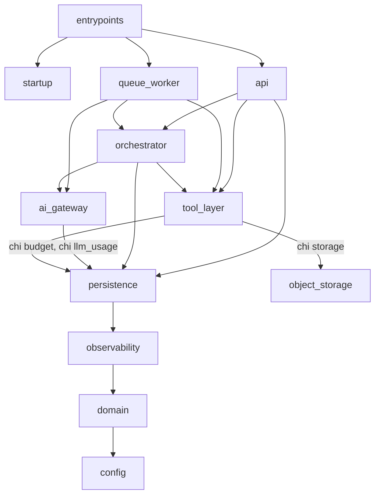
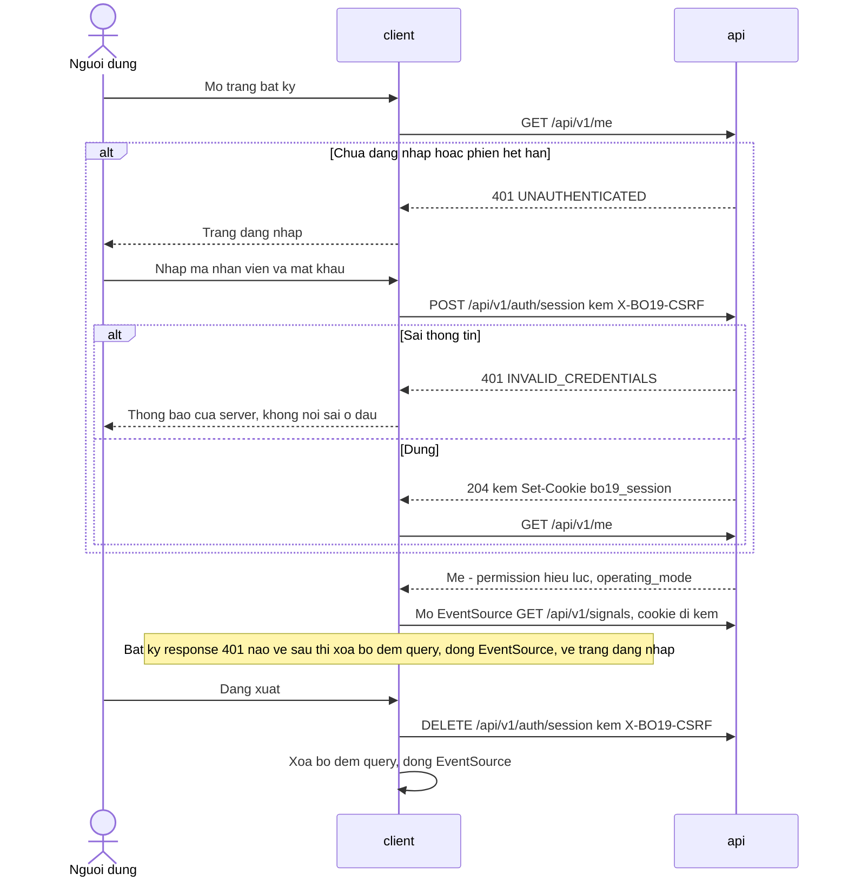
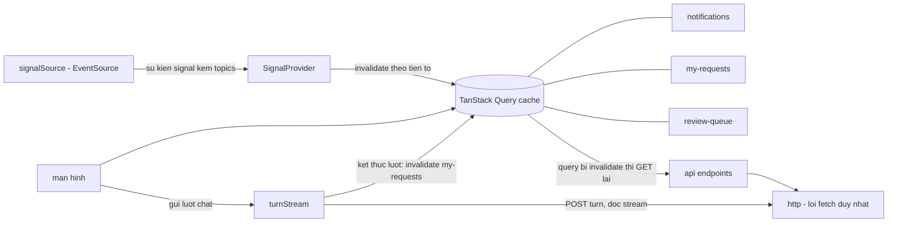

# Project Structure — Admin Service Desk Agent (BO-19)

**Phiên bản:** 0.38 · **Trạng thái:** Đã duyệt ở vòng duyệt Phase 6 · **v0.2:** Open Questions sau các phép B1 → B4; mục 9.4 về bộ kiểm trong repo; `tools/` trong cây gốc — mục ngày 2026-09-13 (lần 9) của `CHANGELOG.md` · **v0.3:** Open Questions sau phép bổ sung — mục ngày 2026-09-14 · **v0.4:** thêm bước kiểm khởi động #16–17 (ADR-023, Phase 11) — quyết định của PO khi duyệt đề xuất diff riêng, không phải một hệ quả của luật 5 (đổi tên cho nhất quán) trong `CLAUDE.md`; mục ngày 2026-09-16 của `CHANGELOG.md` · **v0.5:** làm rõ #15/#17 dùng chung một lần đọc `operating_mode`, #17 chỉ áp dụng ngoài `prod` và tự vệ khi thiếu `BO19_ENVIRONMENT`, nhắc mô hình chạy hết-rồi-gom — cùng mục ngày 2026-09-16 · **v0.6:** đợt sửa 2 sau Phase 13 — cron và `ops/` thêm năm thao tác vận hành mới (AUD-08); `endpoint_ops/` không đếm số; tuyến `/config/request-types` hết "từ chối mọi người" (AUD-05); không có tuyến cho đổi `operating_mode` là có chủ đích (câu 6b); skeleton khớp cây ở mục 3 (AUD-16); số phiên bản đầu dòng nâng cho khớp ghi chú (AUD-18) — mục ngày 2026-09-26 (đợt sửa 2) của `CHANGELOG.md` · **v0.7:** tuyến `/takeover` và phần tiếp quản của `DocumentReviewPage` (AUD-02 (d)) — mục ngày 2026-09-26 (đợt sửa 3) · **v0.8:** thư viện token phiên và log — ADR-028, ADR-029 — mục ngày 2026-09-26 (quyết định PO sau đợt 3) · **v0.9:** Open Questions 7 đã giải — mục ngày 2026-09-26 (đợt sửa 3b) · **v0.10:** đợt sửa 4 sau Phase 13 — ba chế độ của `check_grants.py`, con trỏ cũ (AUD-11) · **v0.11:** dòng cài phụ thuộc Python của đặc tả `Dockerfile` theo ADR-030 (2026-09-27) · **v0.12:** bước kiểm khởi động #13 ghi giá trị múi giờ đã chốt (A-041, 2026-09-27) · **v0.13:** A-055 `Đã chốt` — hướng 1, danh sách miễn `audit_event` (2026-09-27) · **v0.14:** Docker Desktop đã chạy được trên máy người triển khai (2026-10-02) · **v0.15:** entrypoint `combined_main`, `cron_scheduler_main`; bước kiểm #18 — ADR-033 (2026-10-02) · **v0.16:** bước kiểm khởi động #19 — chặn biến tracing của `langsmith` theo mẫu tên (A-082); tên lockfile trong đặc tả `Dockerfile` (2026-10-02) · **v0.17:** bước kiểm khởi động #20 (tham số `argon2id`, ADR-034), #21 (hồ sơ model, ADR-035); luật import điền `httpx` (2026-10-02) · **v0.18:** đính chính sha256 của `schema.sql` — bản LF trong repo (2026-10-02) · **v0.19:** bước 0 của migration: `GRANT CREATE ON SCHEMA public`, chạy bằng `bo19_admin`; kiểm contract trên PostgreSQL 18 (2026-10-04) · **v0.20:** cây gốc thêm `.github/workflows/`, `docs/testing/`; luật trình chạy: file không có câu SQL thực thi thì dừng; bước 3 ngoài sổ (2026-10-04) · **v0.21:** cây gốc: workflow thử S1 đã xoá (2026-10-04) · **v0.22:** bước kiểm #2 mở rộng; cột sổ `schema_migration`; vị trí `backend/tests/` (2026-10-04) · **v0.23:** đặc tả `Dockerfile`: sửa đường dẫn lock; image nền ghim digest (2026-10-04) · **v0.24:** sổ `schema_migration` thành file DDL `migrations/ledger/`; `tools/db-bootstrap/`; biến `BO19_MIGRATOR_DATABASE_URL` của `migrate_main`; số đo mới của bộ kiểm (2026-10-04) · **v0.25:** luật đổi cấu trúc sổ chỉ bằng migration đánh số (2026-10-04) · **v0.26:** mục Bước kiểm khởi động: gỡ `[CẦN XÁC MINH]` về deploy hỏng — S2 (2026-10-04) · **v0.27:** cây gốc: `tools/render-probes/` cho S3 (2026-10-04) · **v0.28:** mục Tắt tiến trình êm: ghi chú S4 — `SIGTERM` lúc instance mới Live, `SIGKILL` ≈ 5 s sau `SIGTERM` trên gói free; cây gốc: `s4_witness_poll.py` (2026-10-05) · **v0.29:** mục Đặc tả `.importlinter`: cú pháp xác minh theo import-linter 2.15; `allow_indirect_imports = True` cho mọi `forbidden`; bỏ hai chỗ giữ chỗ SDK; cây gốc: `ci.yml` (B1, 2026-10-05) · **v0.30:** mục Bước kiểm khởi động: ghi các chỗ B2 đã chọn — ma trận trong code khớp bảng, `STARTUP_CHECK_PENDING`, #17 không đọc được `operating_mode` là Chặn; cây `startup/` (2026-10-05) · **v0.31:** B3 — bước kiểm #12 từ chối secret phiên ngắn hơn 32 byte (A-088); `api/auth/`, `config/working_values.py`, `tools/seed-dev/` vào cây; mục Triển khai ở B3: lối ghi rate limit đi qua `tool_layer.endpoint_ops`, không qua `kernel` (2026-10-05) · **v0.32:** B4 — mục Triển khai ở B4: `ai_gateway` async, hạn chót tổng mỗi lời gọi, vệ sinh lỗi provider và khoá API, sổ `llm_usage`, budget theo chủ, hồ sơ model, bước kiểm #5 và #21 (2026-10-05) · **v0.33:** bước kiểm #22 (khoá API, chưa có code, gắn lát `intake_graph`); trần output cứng theo module; trần nạp kho là nợ O1-11 (PO, 2026-10-05) · **v0.34:** B4b — hồ sơ model schema 2, vệ sinh nội dung suy luận, `tools/llm-probe/` (2026-10-05) · **v0.35:** B4b — include_reasoning false vào hồ sơ; json_validate_failed đi đường sửa parse; chốt chặn test bằng code (2026-10-05) · **v0.36:** B4b — trần P1 1.800 (chat_session 51.900); budget bỏ tính dư reasoning (O1-3 đóng) (2026-10-05) · **v0.37:** mục Triển khai ở B5 — trần output, sổ ước lượng, thời lượng, giới hạn body đăng nhập, kernel (2026-10-09) · **v0.38:** B5 — kernel của tool_layer, máy trạng thái request (2026-10-09)

> File này chốt cây thư mục của backend và frontend, luật "được import gì, cấm import gì" kèm **thứ gì chặn vi phạm**, entrypoint và cách chạy trên Render, bước kiểm khởi động, trình tự migration so với checkpointer, và kết quả xác minh contract DDL. File này **không** chứa implementation (DESIGN MODE — mục Chế độ làm việc hiện tại của `CLAUDE.md`). Hai khối `.importlinter` và `Dockerfile` bên dưới là **đặc tả**, không phải file. File này cũng **không** thiết kế màn hình tiếp quản hay quy tắc hiển thị theo độ nhạy (Phase 8), AuthZ chi tiết và quản lý secret (Phase 9), và **không** định cỡ tham số vận hành (Phase 11).

Tên thành phần, entity, trạng thái, tool, endpoint dùng đúng `GLOSSARY.md`.

**Đã đối chiếu:** `CLAUDE.md`, `_PLAN.md`, `GLOSSARY.md`, `ASSUMPTIONS.md`, `CHANGELOG.md`, `01-prd.md` (mục Scope & priority, F3, F4, F6, NFR), `02-architecture.md`, `03-agents.md`, `04-data.md`, `05-api.md`, `contracts/schema.sql`, `contracts/openapi.yaml`, ADR-001 → ADR-014. Chỗ lệch tìm thấy đã sửa ở file gốc theo phép của anh (mục ngày 2026-09-13, lần 8 của `CHANGELOG.md`), hoặc ghi ở Open Questions.

**ADR mới:** ADR-015 (LibreOffice headless, một image, manifest font), ADR-016 (lượt chat tách khỏi kết nối), ADR-017 (SQL-first, migration ngoài runtime), ADR-018 (frontend), ADR-019 (`ai_gateway` ghi `llm_usage`).

**Nguồn mới trong `docs/reference/`:** `langgraph-checkpoint-postgres.md`, `starlette-streaming-disconnect.md`, `web-platform-sse-cors-samesite.md`, `render-deploys-docker.md`, `libreoffice-headless-convert.md`.

---

## 1. Nguyên tắc

- **Một repo, hai cây mã:** `backend/` là một package Python tên `bo19`; `frontend/` là một SPA React. Contract nằm ở `docs/design/contracts/` và là nguồn — mã theo nó, không ngược lại.
- **Mỗi thành phần ở mục Thành phần kiến trúc hệ thống của `GLOSSARY.md` là một package con cùng tên.** Nhìn tên package là biết nó thuộc thành phần nào; ranh giới của component diagram ở `02-architecture.md` thành ranh giới import.
- **Mọi luật trong file này trả lời "thứ gì chặn vi phạm".** Có bốn loại chặn, ghi đúng tên, không làm tròn:

| Loại chặn | Nghĩa |
|---|---|
| **DB** | PostgreSQL từ chối — quyền, ràng buộc, giao dịch chỉ đọc |
| **Tĩnh** | CI đỏ — `import-linter` cho Python, ESLint cho TypeScript |
| **Khởi động** | Tiến trình từ chối khởi động |
| **Quét văn bản** | CI quét mã nguồn theo mẫu. Heuristic: lách được bằng cách viết khác mẫu. **Không** phải bất biến |
| **Review** | Chỉ có người đọc. Nói thẳng khi chỉ có loại này |

| Thành phần | Package | Tiến trình |
|---|---|---|
| `client` | `frontend/` | Bản build tĩnh do `api` phục vụ (ADR-013) |
| `api` | `bo19.api` | Web Service |
| `ai_gateway` | `bo19.ai_gateway` | Thư viện trong `api` và `queue_worker` |
| `orchestrator` | `bo19.orchestrator` | Thư viện trong `api` và `queue_worker` (ADR-005) |
| `tool_layer` | `bo19.tool_layer` | Thư viện trong `api` và `queue_worker` |
| `vector_store` | Truy vấn trong `bo19.tool_layer.retrieval` | `postgresql` (ADR-002) |
| `postgresql` | Lớp truy cập: `bo19.persistence` | — |
| `object_storage` | Adapter: `bo19.object_storage` | Dịch vụ ngoài Render (ADR-003) |
| `queue_worker` | `bo19.queue_worker` | Background Worker và Cron Job |
| `observability` | `bo19.observability` | Thư viện trong mọi tiến trình |

Ba package không phải thành phần: `bo19.domain` (enum, bảng chuyển trạng thái, hàm kiểm thuần), `bo19.config` (cấu hình có kiểu), `bo19.startup` (bước kiểm khởi động), cộng `bo19.entrypoints` (composition root của từng tiến trình).

---

## 2. Cây thư mục gốc

```text
.
├── backend/                  # package bo19 — mục 3
├── frontend/                 # SPA React — mục 10
├── fonts/                    # bộ font của A-058, kèm giấy phép từng font — đưa vào image
├── .github/
│   └── workflows/            # CI: ci.yml (B1) — job backend (import-linter, test), contracts (check_grants), lock (ADR-030); migrate (ADR-022) khi có secret (cổng 2.6). Workflow thử của S1 đã xoá sau khi ghi kết quả
├── tools/
│   ├── contract-checks/      # bộ kiểm quyền của contract DDL — không phải mã ứng dụng, không vào image (mục 9.4)
│   ├── db-bootstrap/         # bước 0 của mục 8: sinh verifier, step0.sql, step0.sh — do PO chạy bằng bo19_admin; không vào image
│   ├── seed-dev/             # seed dữ liệu GIẢ có nhãn cho DB local: employee, employee_role, employee_credential, employee_permission_grant — chạy bằng bo19_migrator, không phải data migration, không chạy ở runtime; không vào image (mục Triển khai ở B3)
│   ├── llm-probe/            # B4b: đo lời gọi Groq thật (O1-1, O1-3, A-089, A-091, trần output) — chỉ ghi số và mã; gọi mạng chỉ khi có `--confirm-real`; không vào image
│   └── render-probes/        # S3 của Spike 1: probe.py đo SSE và giới hạn thời gian request từ ngoài Render (A-050, A-025); S4: s4_witness_poll.py đọc kết nối nhân chứng qua pg_stat_activity — đo lại shutdown delay trước production (A-031, A-087) — không vào image
├── docs/
│   ├── reference/            # nguồn gốc được phép trích
│   ├── testing/              # hướng dẫn cho người thử — nguoi-thu.md (ADR-032)
│   └── design/               # tài liệu thiết kế; contracts/ là nguồn của mã
└── Dockerfile                # một image cho mọi tiến trình — mục 6.2, ADR-015
```

---

## 3. Cây backend

```text
backend/
├── pyproject.toml            # phụ thuộc ghim bằng lockfile, kể cả langgraph-checkpoint-postgres
├── .importlinter             # contract ranh giới — mục 4.1
├── migrations/
│   ├── ledger/               # schema_migration.sql — DDL sổ migration; migrate_main áp mỗi lần chạy, trước bước 1; không đánh số, không vào sổ (mục 8)
│   ├── schema/               # 0001_initial.sql = contracts/schema.sql ở trạng thái đóng Phase 6; về sau mỗi thay đổi một file
│   ├── library/              # checkpointer_grants.sql — quyền trên bảng của thư viện, chạy sau setup() (mục 8)
│   └── data/                 # danh mục permission, vai trò, bản đầu request_type (mục Nguyên tắc dữ liệu của 04-data.md)
└── src/bo19/
    ├── config/               # đọc biến môi trường thành cấu hình có kiểu; trần budget, múi giờ, hạn chót không có giá trị rỗng. B3: working_values.py — hằng số giá trị làm việc không phải biến môi trường (WV-12, WV-16b, WV-17, trần pool tạm), mỗi hằng một dòng nhãn "chưa hiệu chỉnh"
    ├── domain/               # enum theo GLOSSARY.md, bảng chuyển trạng thái, hàm kiểm đủ điều kiện xử lý dạng thuần, mã lỗi nội bộ — không IO
    ├── observability/
    │   ├── log.py            # lối ghi log duy nhất: sự kiện = mã + trường có kiểu; giá trị slot phải mang slot_sensitivity. Chỉ file này import structlog (ADR-029)
    │   ├── masking.py        # mask PER/RES; input không phải slot mà có thể mang RES thì mask như RES (mục Allowlist input của 03-agents.md)
    │   ├── handler.py        # handler JSON duy nhất gắn vào root logger; bản ghi của thư viện bên thứ ba bị rút về tên logger + mức + kiểu lỗi
    │   ├── trace.py          # trace_id theo contextvar, xuyên api → orchestrator → tool_layer → queue_worker
    │   └── metrics.py        # điểm đo cho bảng chỗ quan sát của Phase 11
    ├── persistence/
    │   ├── pool.py           # hai ngữ nghĩa: acquire(timeout) cho nghiệp vụ; try_acquire() trả None ngay khi pool cạn — cho vòng poll tín hiệu (ADR-013)
    │   ├── read.py           # lối đọc: mọi giao dịch mở ở READ ONLY — ghi bị PostgreSQL từ chối (mục 9)
    │   ├── write.py          # lối ghi: unit of work một giao dịch
    │   ├── probe.py          # phép thử quyền cho bước kiểm khởi động: giao dịch thường, LUÔN rollback, chỉ nhận câu có WHERE false
    │   └── errors.py         # tên ràng buộc ck_/uq_/fk_ → mã lỗi nội bộ của tool
    ├── object_storage/       # adapter S3-compatible; chỉ tool_layer.storage được import (mục 4.2)
    ├── tool_layer/
    │   ├── kernel/
    │   │   ├── context.py    # tác nhân (người thật hoặc hệ thống), permission hiệu lực, trace_id
    │   │   ├── permission.py # kiểm permission — không kiểm tên vai trò (D-005)
    │   │   ├── audit.py      # ghi audit_event trong cùng giao dịch
    │   │   ├── transition.py # ĐIỂM GHI DUY NHẤT của cột status: status, status_changed_at, row_version trong một câu UPDATE (mục 4.2)
    │   │   └── enqueue.py    # enqueue job trong giao dịch của thao tác gọi nó (ADR-004, ADR-010)
    │   ├── jobs/             # giành, gia hạn lease, kết thúc job cho queue_worker — không sinh audit_event, thuộc danh sách miễn (A-055)
    │   ├── storage/          # giao thức ghi một lần (mục Lưu trữ file và bất biến bản render của 04-data.md); NƠI DUY NHẤT ghi stored_object, stored_object_commit
    │   ├── rendering/
    │   │   ├── docx_fill.py  # điền bảng giá trị biến vào .docx; watermark theo operating_mode đã ghim
    │   │   ├── convert.py    # tiến trình soffice cho mỗi lần chuyển đổi (ADR-015)
    │   │   └── fonts.py      # liệt kê font file .docx khai dùng; kiểm font có mặt trong image — khớp chính xác tên họ
    │   ├── numbering/        # giao dịch cấp số ngắn (ADR-011)
    │   ├── retrieval/        # hybrid search trên procedure_chunk và bảng collection ACTIVE; lọc quyền trong SQL
    │   ├── checks/           # nạp dữ liệu cho hàm kiểm đủ điều kiện xử lý của domain — một lối nạp cho cả node, thao tác và RequestDetail
    │   ├── tools/            # một module cho mỗi tool ở mục Tool Registry của 03-agents.md
    │   ├── gate_ops/         # thao tác cổng: request_submit … booking_confirm
    │   ├── employee_ops/     # request_slot_confirm
    │   ├── endpoint_ops/     # thao tác do endpoint gọi — bản kê ở mục Tool Registry của 03-agents.md
    │   ├── config_ops/       # slot_sensitivity_change
    │   └── ops/              # thao tác vận hành: expire_request, object_claim_reconcile, rate_limit_window_sweep, chat_session_idle_close,
    │                         #   needs_info_reminder, document_retention_archive, draft_render_sweep; phần ghi của procedure_ingest
    ├── ai_gateway/
    │   ├── gateway.py        # LỐI VÀO DUY NHẤT: call(module, inputs, budget_owner) → kiểm allowlist → kiểm budget → provider → ép JSON → ghi sổ
    │   ├── allowlist/        # so tập khoá input bằng đúng tập đã khai — thừa hay thiếu đều từ chối (ADR-008)
    │   ├── prompt_modules/   # khai báo từng prompt module: input đích danh, output schema, tier — nội dung ở 07-prompts.md
    │   ├── routing/          # tier → hồ sơ model: profiles.py + model_profiles.json (B4 — cấu hình có schema, không bí mật; ADR-035 điều kiện 1)
    │   ├── json_contract/    # ép JSON Schema, sửa lỗi parse đúng một lần
    │   ├── budget/           # ADR-019: MODULE DUY NHẤT đọc và ghi llm_usage
    │   └── providers/        # adapter LLM và embedding — nơi duy nhất import client gọi provider (httpx, ADR-035)
    ├── orchestrator/
    │   ├── state/            # IntakeState, DocumentState, chuỗi nâng cấp schema_version N → N+1 (mục State schema của 03-agents.md)
    │   ├── intake_graph/     # node và cạnh của intake_graph
    │   ├── document_graph/   # node và cạnh của document_graph
    │   ├── runtime/
    │   │   ├── builder.py    # lối dựng graph duy nhất: mọi node đi qua biên node
    │   │   ├── node_boundary.py # chỉ exception mang mã rời một node (mục 4.2)
    │   │   ├── checkpointer.py  # tạo PostgresSaver với kết nối autocommit; KHÔNG BAO GIỜ gọi setup()
    │   │   ├── threads.py    # ghi graph_thread — ngoại lệ đóng số 2
    │   │   └── purge.py      # checkpoint_purge: delete_thread của thư viện, rồi graph_thread → PURGED
    │   └── runner.py         # lối vào công khai: run_intake_turn, run_render, resume_document, run_finalize_issue, purge_thread
    ├── queue_worker/
    │   ├── dispatcher.py     # vòng poll SKIP LOCKED qua tool_layer.jobs; drain khi SIGTERM
    │   ├── handlers/         # job_type → runner của orchestrator, thao tác của tool_layer, hoặc ai_gateway (embedding của procedure_ingest)
    │   └── cron/             # một lệnh cho mỗi thao tác vận hành chạy theo lịch (mục 6.1); [Should] quét SLA, nhả HELD, hoàn tất room_booking
    ├── api/
    │   ├── app.py            # app factory: mount /api/v1, phục vụ bản build client, luật 404 (mục 10.4)
    │   ├── routers/          # một router cho mỗi nhóm endpoint ở mục Endpoint của 05-api.md
    │   ├── deps/             # xác thực bo19_session, X-BO19-CSRF, permission, Idempotency-Key, expected_row_version
    │   ├── auth/             # B3 — hasher.py (argon2id + trần verify đồng thời, WV-16b), token.py (JWT HS256, ADR-028), client_ip.py (MỘT hàm đọc IP cho rate limit, A-062). Seed dùng lại hasher.py
    │   ├── queries/          # truy vấn cho mọi GET — chỉ qua persistence.read
    │   ├── schemas/          # model request/response khớp openapi.yaml
    │   ├── errors.py         # mã lỗi nội bộ → error_code; mã không có ánh xạ thì INTERNAL_ERROR (mục Mã lỗi của 05-api.md)
    │   ├── turns/            # bộ giám sát lượt: task lượt tách khỏi request (ADR-016)
    │   └── sse/              # chuyển tiếp stream lượt; stream tín hiệu dùng try_acquire
    ├── startup/              # bước kiểm khởi động — mục 7. B2: model.py (ma trận bước × entrypoint, ngữ cảnh), runner.py (bộ chạy), registry.py (bước đã có code), connect.py (nối DB, phân loại lỗi nối), checks.py (#1, #2), checks_logging.py (#10), checks_config.py (#11, #13), checks_security.py (#12, #19, #20), checks_environment.py (#15–#17), checks_gateway.py (#5, #21 — B4)
    └── entrypoints/          # api_main, worker_main, cron_main, migrate_main; combined_main, cron_scheduler_main (ADR-033) — composition root; không ai import entrypoints
```

Thư mục `tests/` thuộc BUILD MODE; ở phase này chỉ ghi hai nhóm đã có chủ: test đối chiếu `api/schemas` với `openapi.yaml`, và test canary checkpoint của Phase 10. **Vị trí — 2026-10-04:** `backend/tests/`, chạy bằng `unittest` của thư viện chuẩn; không thêm phụ thuộc dev vào lock (ADR-030).

**Ghi chú về vị trí**

- `procedure_ingest` là thao tác vận hành nhưng cần embedding. `tool_layer` không được gọi `ai_gateway` (mục 4.1). Vì vậy handler của nó ở `queue_worker` ghép ba bước: đọc và tách chunk qua `tool_layer`, embed qua `ai_gateway`, ghi qua `tool_layer.ops`. Cùng khuôn với `procedure_retrieval` nhận `query_embedding` làm input thay vì tự embed.
- `checkpoint_purge` là thao tác vận hành, nhưng thứ nó xoá là bảng checkpoint — ngoại lệ đóng số 1, chỉ lớp chạy graph được ghi. Vì vậy phần xoá nằm ở `orchestrator.runtime.purge`, job handler chỉ gọi nó.
- `api` gọi `orchestrator` qua đúng một hàm, `run_intake_turn`. Mọi đường khác vào graph là job của `queue_worker` (ADR-010).

---

## 4. Luật import

### 4.1 Đặc tả `.importlinter`

Cú pháp theo tài liệu của `import-linter` **2.15** (phiên bản do công cụ khoá chọn ở mốc `--exclude-newer` của ADR-030), đã có trong `docs/reference/import-linter-2.15.md`. Client gọi provider LLM: `httpx` (ADR-035, 2026-10-02). SDK S3 điền khi A-024 chốt; embedding khi A-028 chốt.

**Hai chỗ khác bản đặc tả trước, 2026-10-05 (B1):** (1) mọi contract `forbidden` có `allow_indirect_imports = True` — theo tài liệu 2.15, `forbidden` mặc định kiểm cả import **gián tiếp**, còn ý của thiết kế là import **trực tiếp**: chuỗi hợp lệ `bo19.api` → `bo19.orchestrator.runner` → `bo19.ai_gateway` không được tính là api chạm `ai_gateway`; (2) hai chỗ giữ chỗ `<sdk-s3>` và `<sdk-embedding>` bỏ khỏi `forbidden_modules` cho tới khi có SDK — 2.15 báo lỗi khi gặp module không tồn tại, nên không thể để chỗ giữ chỗ. Hai file khung `orchestrator/runner.py` và `persistence/write.py`, có trong cây thư mục ở mục Cây backend, được tạo để contract có chỗ bám. File thật: `backend/.importlinter`; test từng contract: `backend/tests/test_import_contracts.py`.

```ini
[importlinter]
root_package = bo19
include_external_packages = True

[importlinter:contract:layers]
name = Tầng — chỉ import xuống
type = layers
layers =
    bo19.entrypoints
    bo19.startup
    bo19.api | bo19.queue_worker
    bo19.orchestrator
    bo19.ai_gateway | bo19.tool_layer
    bo19.object_storage | bo19.persistence
    bo19.observability
    bo19.domain
    bo19.config

[importlinter:contract:siblings-llm-tools]
name = ai_gateway và tool_layer độc lập (ADR-019)
type = independence
modules =
    bo19.ai_gateway
    bo19.tool_layer

[importlinter:contract:api-surface]
name = api chỉ vào orchestrator qua runner, không chạm ai_gateway hay lối ghi
type = forbidden
allow_indirect_imports = True
source_modules = bo19.api
forbidden_modules =
    bo19.ai_gateway
    bo19.persistence.write
    bo19.object_storage
    bo19.orchestrator.intake_graph
    bo19.orchestrator.document_graph
    bo19.orchestrator.runtime
    bo19.orchestrator.state

[importlinter:contract:write-path]
name = Lối ghi DB — chỉ tool_layer và ba chủ ngoại lệ
type = forbidden
allow_indirect_imports = True
source_modules =
    bo19.api
    bo19.queue_worker
    bo19.startup
    bo19.ai_gateway.gateway
    bo19.ai_gateway.allowlist
    bo19.ai_gateway.prompt_modules
    bo19.ai_gateway.routing
    bo19.ai_gateway.json_contract
    bo19.ai_gateway.providers
    bo19.orchestrator.intake_graph
    bo19.orchestrator.document_graph
    bo19.orchestrator.state
    bo19.orchestrator.runner
forbidden_modules = bo19.persistence.write
# Được import bo19.persistence.write: bo19.tool_layer, bo19.ai_gateway.budget (ngoại lệ 3),
# bo19.orchestrator.runtime (ngoại lệ 1 và 2 — checkpoint, graph_thread), bo19.entrypoints.
# bo19.startup dùng bo19.persistence.probe: phép thử quyền cần giao dịch thường — trong giao dịch
# READ ONLY, PostgreSQL báo lỗi chỉ đọc trước khi kiểm quyền, nên phép thử mất nghĩa.

[importlinter:contract:probe]
name = Chỉ bước kiểm khởi động dùng lối thử quyền
type = forbidden
allow_indirect_imports = True
source_modules =
    bo19.api
    bo19.queue_worker
    bo19.orchestrator
    bo19.ai_gateway
    bo19.tool_layer
forbidden_modules = bo19.persistence.probe

[importlinter:contract:object-storage]
name = Chỉ tool_layer.storage chạm object_storage (mục Lưu trữ file và bất biến bản render của 04-data.md)
type = forbidden
allow_indirect_imports = True
source_modules =
    bo19.api
    bo19.queue_worker
    bo19.orchestrator
    bo19.ai_gateway
    bo19.tool_layer.kernel
    bo19.tool_layer.jobs
    bo19.tool_layer.rendering
    bo19.tool_layer.numbering
    bo19.tool_layer.retrieval
    bo19.tool_layer.checks
    bo19.tool_layer.tools
    bo19.tool_layer.gate_ops
    bo19.tool_layer.employee_ops
    bo19.tool_layer.endpoint_ops
    bo19.tool_layer.config_ops
    bo19.tool_layer.ops
forbidden_modules = bo19.object_storage
# SDK S3 điền vào forbidden_modules khi A-024 chốt.

[importlinter:contract:allowlist-gate]
name = Đường tới provider đi qua gateway — nơi kiểm allowlist
type = forbidden
allow_indirect_imports = True
source_modules =
    bo19.api
    bo19.queue_worker
    bo19.orchestrator
    bo19.tool_layer
    bo19.ai_gateway.prompt_modules
    bo19.ai_gateway.routing
    bo19.ai_gateway.json_contract
    bo19.ai_gateway.budget
forbidden_modules =
    bo19.ai_gateway.providers
    httpx
# httpx: ADR-035 — client gọi provider LLM; A-026 mốc 1: Groq. SDK embedding điền khi A-028 chốt.

[importlinter:contract:graph-library]
name = LangGraph chỉ ở orchestrator.runtime — node chỉ vào graph qua builder có biên node
type = forbidden
allow_indirect_imports = True
source_modules =
    bo19.api
    bo19.queue_worker
    bo19.tool_layer
    bo19.ai_gateway
    bo19.orchestrator.intake_graph
    bo19.orchestrator.document_graph
    bo19.orchestrator.state
    bo19.orchestrator.runner
forbidden_modules = langgraph
```

### 4.2 Nghĩa vụ kế thừa — thứ gì chặn vi phạm

| Nghĩa vụ | Đặt ở | Chặn bằng | Chỗ hở còn lại |
|---|---|---|---|
| **Mọi chuyển trạng thái của `request` và `document` ghi `status_changed_at`** (mục Phân trang của `05-api.md`; chỉ hai bảng này có cột đó — mục Bảng chi tiết của `04-data.md`; `approval_step` và `room_booking` không có) | `tool_layer.kernel.transition` — hàm duy nhất sinh câu `UPDATE` đổi `status`, luôn ghi `status`, `row_version + 1`, `updated_at`, và `status_changed_at = now()` ở bảng có cột đó, với điều kiện trạng thái mong đợi và `row_version` | **Điểm ghi duy nhất** cộng **quét văn bản**: CI tìm câu SQL gán cột `status` của `request`, `document`, `approval_step`, `room_booking` ngoài `transition.py` | **Không phải bất biến DB.** Một `CHECK` không so được giá trị cũ với giá trị mới, và `schema.sql` không dùng trigger. SQL dựng động lách được phép quét — chỗ đó chỉ còn **review** |
| **Chỉ module lưu trữ ghi `stored_object`** (mục Lưu trữ file và bất biến bản render của `04-data.md`) | `tool_layer.storage` | **Tĩnh:** contract `object-storage` — chỉ `tool_layer.storage` import adapter và SDK S3. **Quét văn bản:** tên bảng `stored_object`, `stored_object_commit` chỉ xuất hiện trong `tool_layer/storage/`; lệnh `INSERT` vào `document_render` chỉ trong `tools/pdf_export` | Credential bucket có mặt trong `api` (tải file) và `queue_worker`. Mã viết một HTTP client riêng tới bucket thì lách được import contract. Quản lý credential: Phase 9 |
| **Allowlist input** (ADR-008, mục Allowlist input của `03-agents.md`) | `ai_gateway.gateway.call` kiểm tập khoá bằng `ai_gateway.allowlist` **trước** mọi thứ khác | **Tĩnh:** contract `allowlist-gate` — không ai ngoài `gateway` import `providers` hay SDK của provider, nên không có đường tới provider mà không đi qua phép kiểm. Contract `api-surface` — `api` không import `ai_gateway` | Mã gọi thẳng HTTP API của provider bằng một HTTP client chung thì lách được. **Quét văn bản:** tên host của provider chỉ xuất hiện trong `providers/` — điền khi A-026 chốt |
| **Mask log theo `slot_sensitivity`** (NFR-05) | `observability` | **Khởi động:** root logger chỉ có đúng handler của `observability` (mục 7, kiểm 10). **Kiểu:** API ghi log chỉ nhận mã sự kiện và trường có kiểu; giá trị slot phải bọc kèm độ nhạy. **Quét văn bản:** không module nào ngoài `observability` tạo logger hay handler riêng | Thư viện bên thứ ba tự ghi log bằng chuỗi tự do. Handler không phân loại được chuỗi đó, nên nó **bỏ nội dung**, chỉ giữ tên logger, mức và kiểu lỗi. Mất thông tin debug của thư viện — chấp nhận |
| **Exception rời node chỉ mang mã** — mới ở Phase 6 (A-045) | `orchestrator.runtime.node_boundary`, gắn vào mọi node qua `builder` | **Tĩnh:** contract `graph-library` — chỉ `orchestrator.runtime` import `langgraph`, nên không đường nào thêm node vào graph mà không qua `builder`. Biên node bắt mọi exception, ném lại một exception chỉ mang mã, cắt chuỗi nguyên nhân | LangGraph lưu exception của node vào checkpoint (`docs/reference/langgraph-checkpoint-postgres.md`). Thông điệp có vào `blob` hay không chưa rõ, nên biên node là cần. Kiểm chứng: test canary Phase 10 phải có ca node ném exception mang giá trị `RES` |
| **Pool cạn thì bỏ lượt** (ADR-013) | `persistence.pool.try_acquire` | **Kiểu:** stream tín hiệu chỉ nhận connection qua `try_acquire` | **Review** — không có contract tĩnh phân biệt hai hàm của cùng module |
| **Bước kiểm khởi động** | `bo19.startup` | Mục 7 | — |

---

## 5. Sơ đồ phụ thuộc giữa package


```mermaid
graph TD
    EP[entrypoints]
    ST[startup]
    API[api]
    QW[queue_worker]
    ORC[orchestrator]
    GW[ai_gateway]
    TL[tool_layer]
    PER[persistence]
    OS[object_storage]
    OBS[observability]
    DOM[domain]
    CFG[config]

    EP --> ST
    EP --> API
    EP --> QW
    API --> ORC
    API --> TL
    API --> PER
    QW --> ORC
    QW --> GW
    QW --> TL
    ORC --> GW
    ORC --> TL
    ORC --> PER
    GW -->|chi budget, chi llm_usage| PER
    TL --> PER
    TL -->|chi storage| OS
    PER --> OBS
    OBS --> DOM
    DOM --> CFG
```

Chiều phụ thuộc trùng component diagram của `02-architecture.md`, cộng cạnh của ADR-019. Không cạnh nào giữa `ai_gateway` và `tool_layer`, không cạnh nào đi lên. `api` → `persistence` là lối đọc; lối ghi bị contract `api-surface` chặn. Mọi package đều dùng `observability`, `domain`, `config`; sơ đồ chỉ vẽ một cạnh đại diện để giữ dưới 20 node.

---

## 6. Entrypoint và deploy trên Render

### 6.1 Tiến trình

| Lệnh | Service Render | Việc |
|---|---|---|
| `python -m bo19.entrypoints.api_main` | Web Service — `CMD` mặc định của image | REST, hai stream SSE, phục vụ bản build client, bộ giám sát lượt |
| `python -m bo19.entrypoints.worker_main` | Background Worker — Docker Command | Vòng poll job: `render_document`, `resume_document_graph`, `finalize_issue`, `checkpoint_purge`, `procedure_ingest`, `notification_send` |
| `python -m bo19.entrypoints.cron_main <thao tác>` | Một Cron Job cho mỗi thao tác — Docker Command | `expire_request`, `object_claim_reconcile`, `rate_limit_window_sweep`, `chat_session_idle_close`, `needs_info_reminder`, `document_retention_archive`, `draft_render_sweep` — hai tên cuối chưa chạy được khi A-010 còn mở; `[Should]` quét SLA, nhả `HELD`, hoàn tất `room_booking` |
| `python -m bo19.entrypoints.migrate_main` | **Không phải service runtime** — chạy trong ngữ cảnh chỉ giữ credential `bo19_migrator` (ADR-017, A-060). DSN đọc từ `BO19_MIGRATOR_DATABASE_URL` — **không** dùng `BO19_DATABASE_URL`, để không tiến trình nào lỡ nhận credential của role kia | Mục 8. Mã thoát: `0` đạt · `1` dừng vì luật hay lỗi SQL · `2` thiếu biến |
| `python -m bo19.entrypoints.combined_main` | **Chỉ giai đoạn build, Render gói free** — Web Service duy nhất (ADR-033) | `api`, vòng poll job và bộ hẹn giờ cron trong **một** tiến trình; gọi thẳng hàm của từng thao tác cron, không sinh tiến trình con. Một job, một lần chuyển đổi một lúc. Chỉ chạy ở `BO19_ENVIRONMENT = dev` (#18) |
| `python -m bo19.entrypoints.cron_scheduler_main` | Không phải service Render — container `cron` ở local (ADR-033) | Tới lịch thì chạy `cron_main <thao tác>` thành một tiến trình con mới, như Render Cron Job. Lịch đọc từ một nguồn cấu hình duy nhất, dùng chung với `combined_main` và với cấu hình Cron Job khi lên gói trả phí |

**Giai đoạn build (ADR-033, A-085):** gói free của Render không có Background Worker hay Cron Job. Ở local, ba container `api`, `worker`, `cron` chạy từ cùng image, đúng ba dòng đầu của bảng — trong đó container `cron` chạy `cron_scheduler_main`. Trên Render free, một Web Service chạy `combined_main`. Lên gói trả phí: Render chuyển sang ba dòng đầu, không sửa code.

Theo nguồn đã ghim của Render: cron job dựa trên Docker chạy lệnh khởi động của image, ghi đè được bằng Docker Command; một bản build mới "does not affect in-progress runs (only future runs)" (`docs/reference/render-deploys-docker.md`).

### 6.2 Đặc tả `Dockerfile`

Đây là đặc tả, không phải file. Mọi `<…>` chốt ở BUILD MODE. Tên gói hệ điều hành của LibreOffice và công cụ liệt kê font `[CẦN XÁC MINH]` theo kho gói của image nền được chọn. Không ghi số phiên bản nào từ trí nhớ.

```dockerfile
# --- giai đoạn 1: build client -------------------------------------------
FROM <node-image-ghim-theo-digest> AS client-build
WORKDIR /client
COPY frontend/package.json frontend/<lockfile> ./
RUN <cài phụ thuộc đúng theo lockfile>
COPY frontend/ ./
COPY docs/design/contracts/openapi.yaml /contracts/openapi.yaml
RUN <sinh lại type từ openapi.yaml và so với file đã commit — lệch thì hỏng build> \
 && <lint, gồm luật một lối fetch> \
 && <build Vite ra /client/dist>

# --- giai đoạn 2: runtime chung ---------------------------------------------
FROM <python-image-ghim-theo-digest> AS runtime
RUN <cài LibreOffice bản không giao diện, chỉ phần Writer> \
 && <cài công cụ liệt kê font>
COPY fonts/ /usr/local/share/fonts/bo19/        # A-058 — mỗi font kèm file giấy phép
RUN <làm mới bộ đệm font>
RUN <tạo user hệ thống không đặc quyền: bo19>
WORKDIR /app
COPY backend/requirements-linux.lock ./
RUN pip install --no-deps --require-hashes -r requirements-linux.lock   # ADR-030 — lock sinh bằng uv pip compile, không có phụ thuộc dev
COPY backend/ ./
COPY --from=client-build /client/dist /app/static
USER bo19
CMD ["python", "-m", "bo19.entrypoints.api_main"]
```

*Sửa 2026-10-04 khi viết `Dockerfile` thật ở S2:* bản trước chép lock vào `./` rồi cài từ `backend/requirements-linux.lock` — đường dẫn không tồn tại trong image. Image nền đã ghim: `python:3.11-slim@sha256:bab1b7ef4b450c81002278d035eff85ebe394ae94df904f7a3ba14f7e16e487b` (Python 3.11.17); `ENV PYTHONPATH=/app/src`. `.dockerignore` chặn `.env`, `.git`, `docs/`, `tools/`, `backend/tests/`.

Một image cho mọi tiến trình. Lý do, cái giá — `api` cõng LibreOffice, và cold start của `api` là cold start của trang — cùng điều kiện tách thành hai target: ADR-015. Chỗ quan sát cold start: dòng ADR-015 ở bảng chỗ quan sát của Phase 11 trong `_PLAN.md`.

### 6.3 Tắt tiến trình êm

Lý do và ràng buộc cấu hình ở ADR-016. Mốc thời gian lấy từ nguồn đã ghim của Render: `SIGTERM` tới instance cũ 60 giây sau khi instance mới nhận traffic; `SIGKILL` sau shutdown delay — mặc định 30 giây, tối đa 300 giây.

**Ghi chú S4 (2026-10-05) — không đổi quyết định.** Đo trên Web Service free (`docs/reference/render-s4-nhat-ky-do.md`): `SIGTERM` tới instance cũ **vào lúc instance mới Live** (0.70–1.78 s trước lần `GET /` đầu tiên của Render sau khi Live, ba lần), **không** 60 giây sau như đoạn trên; `SIGKILL` tới **≈ 5 s** sau `SIGTERM` (có nhân chứng), không phải 30 s. Ghi chú này không sửa hàng nào của bảng dưới; ADR-016 có ghi chú tương ứng, và A-087 giữ việc đo lại trên gói trả phí.

| Tiến trình | Khi nhận `SIGTERM` |
|---|---|
| `api` | Ngừng nhận kết nối mới → đóng mọi stream tín hiệu (client nối lại sang instance mới) → chờ task lượt đang chạy xong → tới hạn drain thì huỷ task còn lại, cố ghi tin nhắn agent mang mã khuôn lỗi cho từng task với timeout ngắn → thoát mã 0 |
| `worker` | Ngừng giành job mới → chờ job đang chạy trong hạn drain → job chưa xong thì huỷ tiến trình chuyển đổi đang chạy và trả job về hàng đợi (thả lease). Việc giao job ít nhất một lần của ADR-004 và idempotency của từng tool làm lần chạy lại an toàn → thoát mã 0 |
| cron | Không cần xử lý riêng: lần chạy đang dở không bị bản build mới ảnh hưởng |
| `combined_main` (ADR-033) | Làm cả việc của `api` lẫn việc của `worker` ở hai dòng trên, trong cùng shutdown delay; bộ hẹn giờ cron dừng ngay. Ràng buộc của bước kiểm #11 không đổi |

---

## 7. Bước kiểm khởi động

Chạy trước khi tiến trình phục vụ request hay giành job đầu tiên. **Chặn** = trượt thì tiến trình ghi danh sách mã trượt vào log rồi thoát với mã khác 0 — không chạy tiếp kèm cảnh báo. Deploy hỏng thì Render giữ bản trước. **Đã xác minh S2, 2026-10-04:** tiến trình thoát mã khác 0 lúc khởi động → Render ghi `Exited with status 1 while running your code` và đánh dấu `Deploy failed` trong vài phút, không chờ hết cửa sổ health check; khi đã có bản Live, bản đó phục vụ suốt deploy hỏng — `/healthz` 200 liên tục (`docs/reference/render-web-service-s2.md`; ADR-017). **Cảnh báo** = ghi log và metric, vẫn khởi động.

| # | Kiểm gì | `api` | `worker` | cron | Mức | Cơ sở |
|---|---|---|---|---|---|---|
| 1 | Mọi migration mà bản build biết đã có trong `schema_migration`; sha256 khớp | ✔ | ✔ | ✔ | **Chặn** | ADR-017 |
| 2 | **Kiểm phủ định quyền**, qua `persistence.probe`: trong một giao dịch thường rồi rollback, `UPDATE audit_event SET id = id WHERE false` phải bị từ chối vì thiếu quyền; và `current_user` không sở hữu bảng nào trong schema `public`. **Mở rộng 2026-10-04 (PO):** `current_user` không sở hữu database đang nối, không sở hữu schema `public`, không có `CREATEROLE`, `CREATEDB`, không là superuser. Lý do: URL nội bộ Render hiển thị mang credential của user mặc định — chủ database và `public` (S1, `docs/reference/render-postgres-s1.md`) — và vế cũ không chặn được role đó vì role đó không sở hữu bảng nào. Mỗi vế trượt là một mã riêng trong danh sách trượt. Chạy thử local: phép thử trả đúng lỗi thiếu quyền, không chạm dòng nào (mục 9) | ✔ | ✔ | ✔ | **Chặn** — phép kiểm giá trị nhất: nó chứng minh mục Nguyên tắc dữ liệu của `04-data.md` có tác dụng thật, và bắt ca lỡ nối bằng `bo19_migrator` | A-040, A-047 |
| 3 | Checkpointer: `max(v)` của `checkpoint_migrations` bằng số mà phiên bản thư viện đã ghim cần (`9` với 3.1.2); `bo19_app` có đủ `SELECT, INSERT, UPDATE, DELETE` trên ba bảng dữ liệu. **Không gọi `setup()`** | ✔ | ✔ | — | **Chặn** | A-045, mục 8 |
| 4a | Extension `vector` có mặt | ✔ | ✔ | — | **Chặn** | ADR-012 |
| 4b | Collection `ACTIVE`, nếu có: tên bảng thuộc danh sách mà bản build biết; số chiều đọc từ catalog bằng `embedding_collection.dimension`; model embedding trong cấu hình bằng `model_id` của collection. Chạy thử local: `bo19_app` đọc được số chiều `1024` từ catalog | ✔ | ✔ | — | **Chặn** khi lệch | Mục Vector collection của `04-data.md`, ADR-012 |
| 4c | Không có collection `ACTIVE` | ✔ | ✔ | — | Cảnh báo — kho rỗng là trạng thái được thiết kế (A-027) | Mục Vector collection của `04-data.md` |
| 5 | Mọi trần budget đã cấu hình: token mỗi `request`, mỗi `chat_session`, mỗi lần nạp kho; trần số vòng `CHANGES_REQUESTED`. Giá trị được phép mang nhãn "chưa hiệu chỉnh" (A-031), không được vắng | ✔ | ✔ | — | **Chặn** | ADR-019, A-022 |
| 6 | Chạy được `soffice` ở chế độ headless trong timeout | — | ✔ | — | **Chặn** | ADR-015 |
| 7 | Mọi font trong `required_fonts` của mọi phiên bản `ACTIVE`, **cộng** của mọi phiên bản mà một `document` chưa tới trạng thái kết thúc đang dùng, có mặt trong image — khớp chính xác tên họ | — | ✔ | — | **Chặn** | ADR-015, A-058 |
| 8 | Bản build client có mặt: `index.html` và danh sách asset | ✔ | — | — | **Chặn** | ADR-013, ADR-018 |
| 9 | Với mọi `graph_thread` đang `ACTIVE` hay `WAITING`: `state_schema_version` không lớn hơn phiên bản code, và có chuỗi nâng cấp từ nó; `waiting_at_node` là tên node `interrupt` mà code biết, kể cả bí danh | ✔ | ✔ | — | **Chặn** | Mục Schema state đổi giữa chừng của `03-agents.md` |
| 10 | Root logger có đúng một handler, là handler mask của `observability` | ✔ | ✔ | ✔ | **Chặn** | NFR-05 |
| 11 | Ràng buộc cấu hình: hạn chót lượt cộng biên không dài hơn shutdown delay (`api`); lease của `stored_object` dài hơn timeout của lớp tool chạm `object_storage` (`worker`) | ✔ | ✔ | — | **Chặn** | ADR-016, mục Lưu trữ file và bất biến bản render của `04-data.md` |
| 12 | Secret ký `bo19_session` có mặt **và dài ít nhất 32 byte** sau mã hoá UTF-8 — `HS256`, `docs/reference/pyjwt-hmac-key-length.md` (B3, A-088) | ✔ | — | — | **Chặn** | ADR-013; ADR-028; A-088 |
| 13 | Múi giờ của tổ chức có trong cấu hình — giá trị `Asia/Ho_Chi_Minh` (A-041 `Đã chốt`) | ✔ | ✔ | ✔ | **Chặn** — `issued_date` và kỳ đánh số phụ thuộc nó | A-041 |
| 14 | `object_storage` với tới được | ✔ | ✔ | — | Cảnh báo — sự cố tạm thời không được làm tiến trình khởi động lại liên tục; thao tác hỏng lúc dùng trả `FILE_UNAVAILABLE` hoặc job thử lại | ADR-014 |
| 15 | `operating_mode` hiện hành — **một lần đọc, dùng chung với bước #17** (không đọc lại) | ✔ | ✔ | — | Ghi log — chưa có dòng nào là `NON_PRODUCTION`. Tự bước này không chặn gì; giá trị nó đọc còn là đầu vào của #17 | D-009 |
| 16 | Biến môi trường `BO19_ENVIRONMENT` có mặt, giá trị ∈ `{dev, staging, prod}` | ✔ | ✔ | ✔ | **Chặn** — thiếu biến này không được mặc định thành `prod` (fail-closed) | ADR-023 |
| 17 | **Chỉ khi `BO19_ENVIRONMENT ≠ prod`:** `operating_mode` hiện hành (dùng chung giá trị đã đọc ở #15) phải là `NON_PRODUCTION`. Với `BO19_ENVIRONMENT = prod`, điều kiện không kích hoạt — **luôn qua**, bất kể `operating_mode` đang là gì (một `prod` mới dựng, chưa có dòng `operating_mode_change` nào, vẫn ở `NON_PRODUCTION` theo D-009, và vẫn khởi động được). Nếu `BO19_ENVIRONMENT` không đọc được (đã bị #16 bắt riêng), bước này **tự bỏ qua phần so khớp** — không crash, không báo trùng mã với #16 | ✔ | ✔ | — | **Chặn** khi lệch (chỉ áp dụng ngoài `prod`) | ADR-023 |
| 18 | **Chỉ `combined_main`:** `BO19_ENVIRONMENT = dev`. `combined_main` chạy **hợp** mọi bước có ✔ ở bất kỳ cột nào của bảng này, cộng bước này | — | — | — | **Chặn** — topology gộp không bao giờ tới `staging` hay `prod` | ADR-033 |
| 19 | **Không có biến nào bật được tracing của `langsmith`:** môi trường không có biến nào mà tên — so không phân biệt hoa thường — bắt đầu bằng `LANGSMITH_` hoặc `LANGCHAIN_` **và** chứa `TRACING`, **bất kể giá trị, kể cả rỗng**. Log ghi tên biến, không ghi giá trị | ✔ | ✔ | ✔ | **Chặn** — trace gửi nguyên văn input, gồm cả `RES`, ra một dịch vụ ngoài không có trong luồng dữ liệu nào đã duyệt | A-082; `docs/reference/langsmith-tracing-env.md` |
| 20 | **Tham số `argon2id` không thấp hơn WV-16:** `time_cost` ≥ 2, `memory_cost` ≥ 19456 KiB, `parallelism` = 1. **Không ngoại lệ theo môi trường.** Test cần nhanh tự tạo hasher riêng, không đổi cấu hình của ứng dụng | ✔ | — | — | **Chặn** | ADR-034; A-048 |
| 21 | **Hồ sơ model của mọi tier hợp schema:** đủ trường bắt buộc — `base_url`, mã model, tier — và không có tham số nào ngoài danh sách được phép của chính mã model đó, giá trị trong miền cho phép. Ví dụ `reasoning_effort` chỉ hợp lệ với `openai/gpt-oss-20b`, `openai/gpt-oss-120b`, giá trị `low`, `medium`, `high` | ✔ | ✔ | — | **Chặn** | ADR-035; `docs/reference/llm-groq.md` |
| 22 | **`BO19_LLM_API_KEY` có mặt và không rỗng** — áp khi `api` hoặc `worker` bắt đầu gọi LLM. Thiếu khoá thì không khởi động | ✔ | ✔ | — | **Chặn** | ADR-035; PO, 2026-10-05. **Chưa có code — gắn với lát `intake_graph`**: tới đó, `api` chưa gọi LLM nên thiếu khoá chưa chặn |

**Mô hình chạy — nhắc lại cho rõ, không phải quy tắc mới:** câu mở đầu mục này đã nói *"ghi **danh sách** mã trượt vào log rồi thoát"* — số nhiều, tức mọi bước kiểm chạy tới hết rồi mới gom kết quả, **không** dừng ở bước trượt đầu tiên. Vì vậy #17 luôn chạy dù #16 đã trượt, và phải tự vệ theo đúng mô tả ở dòng #17.

**Triển khai ở B2 (2026-10-05) — những chỗ code đã chọn mà bảng trên chưa nói:**

- **Ma trận trong code khớp bảng này từng dòng.** `bo19.startup.model.MATRIX` chép 23 dòng của bảng (bước #4 chia 4a, 4b, 4c); `tests/test_startup_runner.py` đọc lại bảng trong file này và đòi số bước, ba cột `api`/`worker`/cron và mức khớp. Sửa bảng mà không sửa `MATRIX` — hay ngược lại — là test đỏ.
- **Bước chưa có code không được im lặng.** Bước có trong ma trận mà `registry.py` chưa có hàm là bước *chưa làm*: bộ chạy ghi `STARTUP_CHECK_PENDING` (mức `WARNING`, kèm số bước và entrypoint) **mỗi lần khởi động**. Danh sách bước chưa làm bị khoá bằng test (`DECLARED_PENDING`). Bước cần DB mà không nối được ghi `STARTUP_CHECK_SKIPPED` — không bao giờ tính là đạt.
- **Mã trượt:** `STARTUP_<nn>_<đuôi>` (bước #4 giữ hậu tố `A`/`B`/`C`); mã cấu hình dùng chung `STARTUP_CONFIG_DATABASE_URL_MISSING`, `STARTUP_CONFIG_PORT_INVALID`; không nối được DB: `STARTUP_DB_CONNECT_FAILED` kèm một sự kiện `STARTUP_DB_CONNECT_DETAIL` chỉ mang lớp `AUTH`/`NETWORK`/`OTHER` (O1-4). Một bước kiểm nổ ngoại lệ là mã `STARTUP_<nn>_CHECK_CRASHED:<kiểu>` — **trượt**, không phải đạt. Log mọi mã và tên biến, không bao giờ giá trị.
- **#17 khi không đọc được `operating_mode`** (bảng chưa có, thiếu quyền) và `BO19_ENVIRONMENT ≠ prod`: **Chặn** `STARTUP_17_OPERATING_MODE_UNREADABLE` — không xác nhận được `NON_PRODUCTION` thì không khởi động (fail-closed, cùng tinh thần #16). Với `prod`, luôn qua như bảng nói. Bảng chưa nêu ca này; ghi ở đây để không phải đoán.
- **#11 so giá trị cấu hình, không đo Render.** Shutdown delay thực trên gói free đo được ≈ 5 s (S4; A-031) trong khi cấu hình là 30 s; bước kiểm vẫn đạt — nó kiểm ràng buộc giữa các giá trị đã cấu hình (R2-5).
- **#13: chỉ nhận `Asia/Ho_Chi_Minh`** (A-041 `Đã chốt`); biến `BO19_ORG_TIMEZONE` đặt giá trị khác là Chặn.
- **#12: có mặt ở B2; từ B3 thêm độ dài ≥ 32 byte** — A-088 `Đã chốt` (ADR-028, mục Cập nhật B3). Mã trượt: `STARTUP_12_SESSION_SECRET_MISSING`, `STARTUP_12_SESSION_SECRET_TOO_SHORT`. Độ dài là điều kiện cần; entropy không kiểm được bằng độ dài.
- **#19: tên biến lấy từ nguồn gốc tải bằng `curl`** (`docs/reference/langsmith-tracing-env-nguon-goc.md`): bốn tên bật tracing và sáu tên `*_TRACING_*` không tự bật; mẫu chặn cả mười, và không chặn `LANGSMITH_OTEL_*` (không chứa `TRACING`).
- **Chưa có ở B2:** #3, #4a–c, #5, #6, #7, #8, #9, #14, #18, #21 — vì phụ thuộc phần chưa dựng (checkpointer, collection và embedding, `soffice`, font, bản build client, hồ sơ model, `combined_main`).

**Triển khai ở B4 (2026-10-05) — `ai_gateway`. Những chỗ code đã chọn mà thiết kế chưa nói:**

- **API là `async`:** `async call(module, inputs, budget_owner, *, variable=None, turn_deadline=None) -> GatewayResult`. Lý do: hạn chót tổng của lời gọi (dòng dưới) cần huỷ được một lời gọi đang bị chặn ở đọc socket; huỷ coroutine làm được, huỷ luồng thì không. Phía `worker` bọc bằng `asyncio.run`. Truy vấn DB của sổ budget là `psycopg` đồng bộ nên chạy qua `asyncio.to_thread`.
- **Thứ tự trong `call`:** chủ budget (thiếu thì lỗi lập trình, không ghi được dòng) → allowlist → kiểm kiểu input → budget → provider (kèm ép JSON, sửa parse một lần; lần sửa dùng chung hạn chót tổng) → ghi sổ `llm_usage` → trả. Từ chối ở allowlist hay budget **không** có lời gọi nào tới provider.
- **`variable` (P4, P5) và vì sao allowlist của P4 không cố định:** danh sách input của P4 là `variable_guidance`, `request_type` cộng đúng các slot `USER_INPUT` mà `template_variable_input` khai cho biến đó (mục Nơi thực thi của `03-agents.md`) — với `purpose_statement` là `purpose`. `variable` là `VariableSpec` (tên biến, `max_length`, các slot khai) lấy từ danh mục biến của **đúng phiên bản template**; nó dựng `variable_name` (const) và `maxLength` của schema (ADR-025) và cho allowlist biết slot nào hợp lệ. Lớp phòng thủ thứ hai: P4 (và P5 khi dựng) có danh sách **cấm cứng** (`national_id`, `bearer_national_id`, `date_of_birth`, `contract_type`, `employment_end_date`, `recipient_org`, `recipient_person`) — khoá nào trong đó bị `ALLOWLIST_REJECTED` dù `variable` có khai.
- **Hạn chót tổng cho mỗi lời gọi (PO, 2026-10-05):** WV-04 (tier rẻ, 8 s) hoặc WV-06 (tier mạnh, 60 s) là hạn chót **của cả lời gọi `call`** — gồm mọi lần thử, quãng nghỉ 1 s của WV-05 và mọi lần chờ `retry-after`. Cài bằng một `asyncio.timeout` bao toàn bộ vòng thử, **không** dựa vào timeout từng pha của `httpx` (`read` được tính lại sau mỗi byte nên một server nhỏ giọt từng byte không bao giờ chạm nó); timeout của `httpx` chỉ còn là chốt phụ. `turn_deadline` (thời điểm tuyệt đối của hạn chót lượt, WV-02) nếu có thì hạn chót hiệu lực là cái đến trước. Quy tắc thử lại: một lần (WV-05) với lỗi thoáng qua (429, 5xx, đứt kết nối, hết giờ một lần thử), sau nghỉ 1 s, chỉ khi còn thời gian; 429 có `retry-after` thì chờ **chỉ khi `retry-after` nhỏ hơn thời gian còn lại** — và, trong job, không vượt WV-19. Câu "tier rẻ chỉ retry khi còn ≥ WV-04" của WV-05 **thay bằng** quy tắc này, vì WV-04 giờ là hạn chót tổng, không phải timeout một lần thử (ADR-035, mục Cập nhật B4).
- **Lỗi provider — chỉ ba thứ ra log và ra lỗi:** mã HTTP, loại lỗi và `code` nếu có. Thân response thô **không bao giờ** vào log, vào exception hay vào chuỗi nào, vì nó có thể trích lại input — kể cả `RES`. Đọc thân lỗi theo dạng OpenAI một cách dung thứ (`error.type`, `error.code`), mỗi trường chỉ được giữ khi khớp khuôn `[A-Za-z0-9_.-]{1,64}`; không khớp thì bỏ. Exception của `ai_gateway` ném `from None` — chuỗi nguyên nhân của `httpx` mang URL và có thể mang thân.
- **Khoá API (`BO19_LLM_API_KEY`) không xuất hiện ở đâu ngoài header `Authorization` lúc gửi:** `Settings`, client provider và `Gateway` đều ẩn khoá khỏi `repr`; không log header; exception không mang request hay header; 401 từ provider chỉ cho mã HTTP 401. Test dò khoá trong log, trong exception và trong `repr` của mọi đối tượng, kể cả khi provider trả 401.
- **Sổ `llm_usage`: một dòng cho mỗi lần `call` đã tới provider** — token cộng dồn qua mọi phản hồi nhận được (lần đầu và lần sửa parse). Kết quả: `OK`, `PARSE_REPAIRED` (lần đầu hỏng, lần sửa đạt), `PARSE_FAILED` (cả hai hỏng), `PROVIDER_ERROR` (không nhận được phản hồi dùng được; `input_tokens` = 0). Hai ca từ chối (`BUDGET_EXCEEDED`, `ALLOWLIST_REJECTED`) và `BUDGET_UNAVAILABLE` ghi trong giao dịch riêng, commit trước khi trả lỗi (ADR-019). Số token của một dòng = `prompt_tokens`, `completion_tokens`, `reasoning_tokens` đúng như provider trả; budget **chỉ cộng `input_tokens + output_tokens`**: `completion_tokens` đã gồm suy luận (O1-3 đóng 2026-10-05); `reasoning_tokens` ghi sổ để theo dõi, không cộng.
- **Budget — thi hành theo chủ budget, chưa theo từng lời gọi:** trước mỗi lời gọi, tổng token đã tiêu của chủ budget (`chat_session` 51.900, `request` 92.000 — mục Định cỡ A-022 của `11-ops.md`) mà **đã ≥ trần** thì `BUDGET_EXCEEDED`. **Trần token mỗi lời gọi** (1.800, 3.500, 6.000, 500, 4.000) **không chặn được trước lời gọi** — không có bộ đếm token offline trong lock và `max_completion_tokens` chưa có trong tài liệu gốc (A-090) — nên B4 chỉ đo: vượt thì ghi sự kiện `LLM_CALL_OVER_CEILING` và cộng vào tổng của chủ budget. **Trần token mỗi lần nạp kho không có giá trị ở đâu trong thiết kế** (A-090, O1-11 — nợ gắn với lát P3/embedding, PO 2026-10-05): bước kiểm #5 ở B4 chỉ phủ các trần của lời gọi LLM; trần nạp kho vào #5 khi dựng `procedure_ingest`. **Phía output có trần cứng** — `max_completion_tokens` theo từng module trong hồ sơ model (quyết định PO 2026-10-05, thực hiện ở B4b); phía input chỉ cảnh báo.
- **Hồ sơ model:** `ai_gateway/routing/model_profiles.json` — trong repo, không bí mật; schema liệt kê, cho từng mã model, tham số được phép và miền giá trị (`openai/gpt-oss-20b`, `openai/gpt-oss-120b`: `reasoning_effort` ∈ `low`, `medium`, `high`); mỗi tier trỏ một mã model kèm tham số. Tier `CHEAP`: `openai/gpt-oss-20b`, `reasoning_effort: "low"` (chỉ đạo của PO, ADR-035). Tier `STRONG`: `openai/gpt-oss-120b`, **không đặt** `reasoning_effort` (mặc định của provider) và không đặt `temperature` — thiết kế chưa chốt giá trị nào (A-090). Chỉ `base_url` (`BO19_LLM_BASE_URL`, mặc định `https://api.groq.com/openai/v1`, bắt buộc `https://`) và khoá (`BO19_LLM_API_KEY`) là biến môi trường. Bước kiểm #21 đọc file này và `base_url`; khoá có bước kiểm riêng, **#22 — chưa có code, gắn với lát `intake_graph`** (PO, 2026-10-05): ở B4 `api` chưa gọi LLM nên thiếu khoá chưa chặn khởi động, lời gọi đầu tiên trả `PROVIDER_CALL_FAILED` kèm mã `NO_API_KEY`; khi `api` bắt đầu gọi LLM thì thiếu khoá phải chặn khởi động.
- **Ép JSON:** nhánh A (`json_schema` `strict`, dạng request ở `docs/reference/llm-groq-structured-request.md`). Schema dựng lúc gọi (ADR-025); `json_contract` **tự validate** phía client — không có `jsonschema` trong lock nên B4 viết bộ validate cho đúng tập từ khoá mà `07-prompts.md` dùng (`type`, `enum`, `const`, `properties`, `required`, `additionalProperties: false`, `items`, `minItems`, `maxItems`, `minLength`, `maxLength`); từ khoá lạ làm việc dựng schema thất bại (fail-closed), không bị bỏ qua. Nhánh B (provider không ép schema) **chưa có code** — chưa có provider nào cần nó.
- **`catalog_fingerprint`** (P1): sha256 của bản tuần tự hoá chuẩn — sắp theo `code` — của `code`, `support_status`, `name_vi`, `description`, `example_phrases`; ghi vào log kỹ thuật của lời gọi, không vào `llm_usage` (mục Phiên bản và thay đổi của `07-prompts.md`).
- **Chưa làm ở B4:** P3, E1, E2 (embedding — A-028), nhánh B của mục Chiến lược ép JSON, trần nạp kho, lời gọi Groq thật (B4b).

**Triển khai ở B4b (2026-10-05) — hồ sơ model tường minh và vệ sinh nội dung suy luận:**

- **Hồ sơ model schema 2** (`ai_gateway/routing/model_profiles.json`, `profiles.py`): `reasoning_effort` và `temperature` **bắt buộc ở cả hai tier**; mục `module_params` mang **`max_completion_tokens` bắt buộc cho từng module** có prompt module (trần output cứng, A-090); tham số của tier và của module không trùng tên; `max_tokens` (deprecated) không bao giờ khai được. Tham số có miền khoảng (`{"type": "integer"|"number", "min", "max"}`) ngoài danh sách giá trị. Hồ sơ hiệu lực của một lời gọi = tham số của tier + của module (`Profiles.profile_for`). Giá trị khởi đầu PO duyệt 2026-10-05, nhãn "chưa hiệu chỉnh": `CHEAP` `low` và `0.2`, `STRONG` `medium` và `0.3`; trần output 512, 1536, 2048.
- **Adapter không giữ, không log nội dung suy luận (PO, 2026-10-05):** `ProviderResponse` không có trường nào cho văn bản suy luận; `message.reasoning` (nếu provider trả) không bao giờ được đọc; chỉ đếm `reasoning_tokens`. `content` ẩn khỏi `repr` của `ProviderResponse`. Thêm `finish_reason` (khuôn ngắn). Tham số tắt việc trả suy luận: xem số đo ở `docs/reference/llm-groq-do-thuc-te-b4b.md` — `include_reasoning: false` và `reasoning_format: "hidden"` đều được hai model chấp nhận và làm biến mất trường suy luận, `reasoning_tokens` vẫn được tính; **PO chọn `include_reasoning: false` (2026-10-05) — đã vào hồ sơ cả hai tier, bắt buộc, có test**; adapter vẫn bỏ trường suy luận như lớp thứ hai.
- **HTTP 400 `json_validate_failed` đi đường sửa parse (PO, 2026-10-05):** output bị cắt ở trần `max_completion_tokens` hay không hợp schema trả 400 (không phải `finish_reason: length`). Gateway coi nó là vi phạm `JSON_VALIDATE_FAILED`, gửi lời nhắn sửa một lần (không có output cũ để gửi lại), rồi `PARSE_REPAIRED` hoặc `PARSE_FAILED`; log mã con `LLM_PROVIDER_JSON_VALIDATE_FAILED` kèm trần và số lần thử. 400 với mã khác vẫn là `PROVIDER_CALL_FAILED`.
- **Chốt chặn của bộ test bằng code:** `tests/_guard.py` xoá `BO19_LLM_API_KEY` trước từng test và chặn socket ra ngoài (chỉ loopback, socket Unix, host PostgreSQL thử); `tests/test_guard.py` đòi mọi file `test_*.py` (backend và tools) nhập nó. `llm-probe` **không đọc `.env`** — khoá chỉ từ biến môi trường người chạy export.
- **`tools/llm-probe/`:** gọi mạng thật chỉ khi có `--confirm-real` (thêm sau lần chạy nhầm ngày 2026-10-05, CHANGELOG); chỉ ghi số và mã; thân lỗi vào `docs/reference/` phải qua `sanitize.self_check`.

**Triển khai ở B5 (2026-10-09) — trần output đã hiệu chỉnh, sổ ước lượng, thời lượng, giới hạn body đăng nhập, kernel của `tool_layer`:**

- **Trần output theo PO 2026-10-09:** `classify_intent` 512, `extract_slots` **2.048** (từ 1.536), `draft_free_content` 2.048. `model_profiles.json` thêm trường tuỳ chọn `calibration` ở cấp cao nhất, khoá theo module, mỗi giá trị `"hiệu chỉnh theo B4b, n nhỏ"`; loader nhận, test ghim nhãn. `schema_version` giữ 2 (chỉ thêm trường tuỳ chọn).
- **Sổ ước lượng:** theo bảng phân loại ở mục Bổ sung B5 của ADR-019. Adapter theo dõi **từng lần thử**: thân request được gửi bằng một bộ sinh byte (kèm `Content-Length` tường minh) và đặt cờ "đã ghi xong" khi `httpx` lấy hết byte; lần thử nào có thể đã sinh token mà không có `usage` được đếm vào `unmetered_attempts` của `ProviderResponse` hoặc `ProviderError`, cùng `request_bytes`. Gateway nhân: input ước lượng = `request_bytes`, output ước lượng = `max_completion_tokens`.
- **Thời lượng:** `duration_ms` đo ở gateway quanh cả `call`; `provider_completion_ms` là tổng `completion_time` chỉ khi mọi phản hồi đều có và không lần thử nào thiếu `usage`. Cả hai ghi vào `llm_usage` và vào `LLM_CALL_DONE`.
- **`POST /auth/session` (O1-10):** `max_length` 64 và 128 trên `LoginBody` (trùng `openapi.yaml`); body vượt 4096 byte → `PAYLOAD_TOO_LARGE` 413, kiểm bằng đếm byte thực nhận **trước** khi phân tích JSON, không tin `Content-Length`, không tăng bộ đếm rate limit.
- **`tool_layer.kernel` (B5):** năm module theo cây ở đầu file. `context` — `Actor` (người thật kèm **permission hiệu lực**, hoặc hệ thống không có permission) và `ToolContext` (`trace_id` theo ADR-024), bất biến; mọi hàm ghi đòi `conn` đang **trong giao dịch** (`NotInTransaction` nếu không). `permission` — dựng ngữ cảnh bằng cách đọc lại quyền hiệu lực từ DB (gói vai trò + cấp lẻ chưa thu hồi và đã tới hạn; uỷ quyền `[Should]` chưa tính); nhân viên không hoạt động không có ngữ cảnh; `require`, `require_any` (any-of), `require_system` — không kiểm tên vai trò (D-005). `audit.record` — `audit_event` cùng giao dịch với thao tác (lăn thì lăn theo); payload chỉ mang mã và tham chiếu: khoá `snake_case`, giá trị là số, boolean, `null` hoặc chuỗi ≤ 64 ký tự **không khoảng trắng**, lồng ≤ 3 tầng, ≤ 50 phần tử, ≤ 4096 byte — văn bản tự do bị chặn; **chỗ hở còn lại:** một mã ngắn truyền nhầm vẫn lọt. `transition` — hàm duy nhất sinh `UPDATE` đổi `status`: khoá hàng (`FOR UPDATE`), kiểm cạnh theo `domain.request_machine`, ghi `status`, `row_version + 1`, `updated_at`, `status_changed_at` và cột mốc mà ràng buộc DB đòi (`closed_at` ở trạng thái cuối, `needs_info_asked_at` khi vào `NEEDS_INFO`); đã ở trạng thái đích thì không làm gì; **chỉ `request` có máy ở B5** — `document`, `approval_step`, `room_booking` đăng ký khi dựng vòng đời của chúng. `enqueue(conn, *, job_type, …)` — job cùng giao dịch, `max_attempts` theo `config.working_values.JOB_MAX_ATTEMPTS`, idempotent theo (`job_type`, `dedupe_key`) khi job còn `QUEUED`/`RUNNING`; payload cùng luật với `audit_event`; **không** tự sinh `audit_event` (thao tác gọi nó ghi); chưa có caller — caller đầu tiên là `request_submit`. **`status_changed_at`** chỉ ghi ở `request` và `document` — hai bảng có cột đó; mục Nghĩa vụ kế thừa đã sửa cho khớp `04-data.md` (PO, 2026-10-09). **CI quét văn bản** (`tests/test_kernel_transition.py`): không câu SQL nào ngoài `transition.py` gán `status` của bốn bảng; không ai ngoài `audit.py` ghi `audit_event`. **Hoãn sang B6 (báo PO):** hàm 'đủ điều kiện xử lý' (F1) và `tool_layer.checks` — điều kiện 3 của F1 (rule kiểm tra slot) dựa vào `slot_definition.validation_rules` mà thiết kế chưa định nghĩa từ vựng (A-093).

**Triển khai ở B3 (2026-10-05) — khung `api`, lớp `persistence`, xác thực. Những chỗ code đã chọn mà thiết kế chưa nói:**

- **Lối ghi `rate_limit_window` đi qua `tool_layer.endpoint_ops`, không qua `kernel`.** Contract `api-surface` và `write-path` cấm `api` import `persistence.write`, nhưng **không** cấm `api` import `tool_layer`; mọi ghi `postgresql` phải qua `tool_layer` (mục Tool Registry của `03-agents.md`). Thao tác tăng bộ đếm — đặt tên **`rate_limit_window_increment`** — không cần gì của `kernel`: không có tác nhân (người gọi chưa xác thực), không sinh `audit_event` (danh sách miễn của A-055), không đổi `status`, không enqueue. Nó là một hàm của `tool_layer/endpoint_ops/` gọi `persistence.write.unit_of_work`. Không có khung `kernel` nào được dựng ở B3.
- **Thứ tự đăng nhập, trên một connection:** (1) mượn connection (`acquire`, timeout WV-07); (2) `rate_limit_window_increment` — một câu `INSERT … ON CONFLICT … DO UPDATE … RETURNING attempt_count`, commit ngay, nên lần thử sai vẫn được đếm; (3) đếm vượt ngưỡng thì `RATE_LIMITED` — **chưa chạm `employee_credential`**; (4) đọc credential trong giao dịch `READ ONLY`; (5) **trả connection**, rồi mới verify `argon2id` — verify không giữ connection của pool. Bộ đếm tăng ở **mọi** lần thử, kể cả lần đúng (WV-12).
- **Verify luôn chạy một lần `argon2id`.** Mã nhân viên không tồn tại, nhân viên `is_active = false` hay thiếu dòng credential đều verify với một hash giả dựng lúc khởi động cùng tham số, để thời gian phản hồi của hai ca sai không phân biệt được. Hai nhánh cùng trả `INVALID_CREDENTIALS`.
- **IP của rate limit đọc ở đúng một hàm** — `api/auth/client_ip.py`. Mặc định **không tin** `X-Forwarded-For` hay header nào: dùng địa chỉ của kết nối trực tiếp. Cách đọc đúng phía sau proxy của Render là A-062, cổng 2.7 (AC-2.9); trên Render ở B3 mọi request mang IP của proxy nên mọi người dùng chung một ngưỡng — chấp nhận tới cổng 2.7, vì chưa có người dùng thật.
- **`GET /me` và mọi endpoint đã đăng nhập đọc lại `is_active` và permission từ DB ở mỗi request** (ADR-013): token chỉ mang `sub` và `exp`. Tắt `is_active` thì request kế tiếp trả `UNAUTHENTICATED`.
- **Luật 404 (O1-8):** đường lạ thuộc `/api` trả `ErrorEnvelope` `NOT_FOUND` 404; phương thức sai trên đường có thật cũng trả `NOT_FOUND` 404 — danh mục `error_code` không có mã 405, và 404 không lộ gì thêm. Lỗi kiểm body của FastAPI đi thành `VALIDATION_FAILED` 422 với `details.fields[]` chỉ gồm tên trường và mã con — **không bao giờ** có giá trị đã gửi (mật khẩu nằm trong body). Phần phục vụ `index.html` và asset chưa có (chưa có bản build client; bước #8).
- **Pool:** `persistence.pool` bọc `psycopg_pool.ConnectionPool` (đã có trong lock, phụ thuộc bắc cầu của checkpointer). Kích thước 1–5 và timeout `acquire` 5 s (WV-07) là giá trị **tạm, chưa hiệu chỉnh** — A-057 còn mở. `try_acquire()` trả `None` khi pool cạn, sau chờ tối đa 10 ms — không dùng `timeout=0` vì `psycopg_pool` trừ thời gian đã trôi khỏi hạn chót nên `0` không bao giờ giao connection, kể cả khi có connection rảnh; chưa có ai gọi nó (stream tín hiệu ở sprint sau).
- **Seed:** `tools/seed-dev/` — không phải data migration. `migrate_main` áp mọi file `backend/migrations/data/`, nên `employee` giả đặt ở đó sẽ lên cả Render khi migrate chạy; PO chốt seed chỉ trên Postgres local (2026-10-05), Render seed ở mốc riêng của Sprint 2 sau A-062. Khác dòng "Nạp `employee` giả qua data migration" của mục Track build ở `12-roadmap.md` — đã sửa ở đó.

Bước #16–17 (ADR-023, Phase 11) là lớp thứ hai trong ba lớp khoá `operating_mode` theo môi trường — không thay thế bước #15 (D-009, chỉ ghi log), và không thay thế chính sách cấp quyền hay chặn tại endpoint (`POST /operating-mode/transitions`, mục Endpoint của `05-api.md` — diff đã áp 2026-09-25).

---

## 8. Migration và checkpointer

Lập luận ở ADR-017; bằng chứng chạy thật ở mục 9. Bảng dưới là thứ tự, không lặp lập luận.

| Bước | Việc | Role | Giao dịch |
|---|---|---|---|
| 0 | `CREATE EXTENSION vector`; `GRANT CREATE ON SCHEMA public TO bo19_migrator`; `CREATE EXTENSION btree_gist` **chỉ khi** A-046 chốt là cần. Tạo `bo19_migrator`, `bo19_app` nếu chưa có | Local: superuser. **Render: user mặc định `bo19_admin`, do PO** — A-040 vế (3), S0 (`docs/reference/render-postgres-s0.md`); không chạy ở CI (ADR-022) | — |
| Sổ | `migrations/ledger/schema_migration.sql` — mỗi lần chạy, trước bước 1; idempotent | `bo19_migrator` | Một giao dịch |
| 1 | `migrations/schema/*.sql` theo thứ tự | `bo19_migrator` | Mỗi file một giao dịch |
| 2 | `setup()` của `langgraph-checkpoint-postgres` đã ghim | `bo19_migrator` | Autocommit — trong giao dịch thì hỏng |
| 3 | `migrations/library/checkpointer_grants.sql` — chạy lại sau mỗi lần nâng thư viện | `bo19_migrator` | Một giao dịch |
| 4 | `migrations/data/*.sql` theo thứ tự | `bo19_migrator` | Mỗi file một giao dịch |

**Sổ `schema_migration` — PO duyệt tên cột 2026-10-04: `filename`, `kind`, `sha256`, `applied_at`.** DDL là file, không chép vào đây: `backend/migrations/ledger/schema_migration.sql` (ADR-017, cập nhật 2026-10-04). Tóm tắt để đọc, file là nguồn:

- `filename` khoá chính, tương đối với `migrations/` — `schema/0001_initial.sql`; `CHECK` dạng `(schema|data)/NNNN_tên.sql`, và thư mục đầu trùng `kind`.
- `kind` — `CHECK (kind IN ('schema', 'data'))`. `sha256` — 64 ký tự hex thường. `applied_at` — mặc định `now()`.
- Quyền: `REVOKE ALL … FROM PUBLIC`; `bo19_app` **chỉ `SELECT`** — bước kiểm #1 đọc sổ. Chủ sở hữu là `bo19_migrator`, vì `migrate_main` tạo bảng.
- `migrate_main` áp file này **mỗi lần chạy**, trước bước 1, trong một giao dịch — `CREATE TABLE IF NOT EXISTS`, `GRANT` lặp lại vô hại. File không đánh số và không tự ghi vào sổ. **Không sửa file này** — `IF NOT EXISTS` không đổi được sổ đã có; đổi cấu trúc hay quyền của sổ chỉ bằng một migration đánh số ở `migrations/schema/` (ADR-017, PO 2026-10-04).
- `check_grants.py` đọc tên sổ và quyền của `bo19_app` từ chính file này (mục 9.4); file cấp khác `SELECT` thì bộ kiểm dừng mã 2.

**Trình chạy, ở mỗi file của bước 1 và bước 4:** chưa có trong sổ → áp file và ghi dòng sổ **trong cùng một giao dịch**; đã có, cùng `kind` và `sha256` → bỏ qua; đã có mà khác → dừng `MIGRATE_LEDGER_MISMATCH`, không áp file nào sau nó. Chạy lại `migrate_main` trên DB đã migrate đủ không đổi gì — đã chạy thử.

Bước kiểm #1: mọi file của `migrations/schema/` và `migrations/data/` mà image mang theo có một dòng cùng `filename`, `kind` và `sha256`. Sổ vắng là trượt, mã riêng. `filename` là đường dẫn tương đối với `migrations/`.

**Luật của trình chạy — thêm 2026-10-04 (ADR-017):** file của bước 1, 3, 4 **không có câu SQL thực thi được** — chỉ chú thích hay khoảng trắng — thì dừng, không coi là đạt. Bước 3 nằm ngoài sổ `schema_migration` và chạy lại được; sổ chỉ ghi bước 1 và bước 4.

Nội dung `migrations/library/checkpointer_grants.sql` — DDL, là contract; đã chạy thử:

```sql
-- Chạy bằng bo19_migrator, SAU setup() của thư viện checkpointer.
-- Bảng do thư viện tạo (docs/reference/langgraph-checkpoint-postgres.md).
GRANT SELECT, INSERT, UPDATE, DELETE ON checkpoints, checkpoint_blobs, checkpoint_writes TO bo19_app;
GRANT SELECT ON checkpoint_migrations TO bo19_app;
```

- `UPDATE` cần vì thư viện upsert `checkpoints` và `checkpoint_writes`. `DELETE` cần cho `delete_thread`, mà `checkpoint_purge` dùng. `SELECT` trên `checkpoint_migrations` cần cho kiểm 3 ở mục 7.
- **Rủi ro "thư viện đòi quyền rộng" (A-045):** quyền mà thư viện cần lúc chạy chỉ là bốn quyền trên ba bảng của chính nó. Quyền tạo bảng chỉ cần lúc `setup()`, và bước đó chạy bằng `bo19_migrator`. `bo19_app` gọi `setup()` thì bị từ chối — đã chạy thử.

---

## 9. Xác minh contract — kết quả Câu 4

### 9.1 Môi trường

| Hạng mục | Giá trị |
|---|---|
| PostgreSQL | **16.2** — `PostgreSQL 16.2 on x86_64-pc-mingw64`, bản build Windows |
| pgvector | **0.6.2** |
| Cách dựng | Gói Python `pgserver` 0.1.4 trong một venv của scratchpad. **Không qua Docker** như chỉ thị: Docker Desktop trên máy không khởi động được — engine WSL không đọc được đĩa dữ liệu của chính nó — và sửa đĩa đó là thao tác phá huỷ trên dữ liệu Docker của anh, nên không làm |
| Cập nhật 2026-10-02 | Trạng thái Docker ở dòng trên là của lần chạy Phase 6. Nay: Docker Desktop 4.85.0, engine 29.6.2 `linux/amd64` trên WSL2; `docker run --rm hello-world` đạt (kiểm 2026-10-02). Kết quả kiểm contract ở mục này không đổi — nó không phụ thuộc Docker |
| Thư viện | `psycopg` 3.3.5 · `langgraph-checkpoint-postgres` 3.1.2 · `langgraph-checkpoint` 4.2.0 |
| `schema.sql` đã áp | sha256 `0ce8ddeeb0fda9df246733af1670c0dd2f70c9dea18d4220149c8a5e05f63e82` — bản cuối của Phase 6, có hai thay đổi của ADR-019 và ADR-015 |
| Đính chính sha256 — 2026-10-02 | `0ce8dd…` ở dòng trên là sha của **bản checkout CRLF trên Windows** (`core.autocrlf=true`), không phải của file trong repo. File trong repo là LF: sha256 `937ca18412aff409f2dd429a50b550524994fab73579b12bc23f68bc71e242fd` — đó là bản CI và image thấy. Nội dung không đổi; `0001_initial.sql` vẫn trùng byte với `schema.sql` ở cả hai dạng. Từ 2026-10-02, `.gitattributes` giữ LF cho mọi `*.sql` |
| Ngày chạy | 2026-09-13 |

Bản build là Windows, Render chạy Linux. Kết quả về quyền và DDL không phụ thuộc hệ điều hành theo cách đã biết, nhưng đó là suy luận, không phải số đo.

### 9.2 Kết quả

| Phép thử | Kết quả |
|---|---|
| Tạo role `bo19_migrator`, `bo19_app`; database do `bo19_migrator` sở hữu | Đạt |
| Áp `schema.sql` bằng `bo19_migrator` | **Hỏng ở câu đầu:** `permission denied to create extension "vector"`. Superuser tạo extension rồi áp lại bằng `bo19_migrator`: **đạt**. Phát hiện ghi vào A-040 vế (3) và bước 0 của mục 8 |
| Số bảng trong `public` · chủ sở hữu | **45** · mọi bảng do `bo19_migrator` sở hữu |
| Số chiều cột `embedding` của `procedure_chunk_embedding_v1` | `1024` |
| `setup()` của checkpointer, `bo19_migrator`, autocommit | Đạt; `max(v)` của `checkpoint_migrations` = `9` |
| `setup()` trên database sạch, **không** autocommit | **Hỏng:** `CREATE INDEX CONCURRENTLY cannot run inside a transaction block` |
| **Kiểm phủ định** — `bo19_app` bị từ chối đúng: `INSERT`/`UPDATE`/`DELETE`/`TRUNCATE` trên nhóm chỉ đọc; `UPDATE`/`DELETE`/`TRUNCATE` trên nhóm chỉ thêm — kể cả `audit_event` và `llm_usage`; `UPDATE`/`TRUNCATE` trên nhóm thêm và xoá; `DELETE`/`TRUNCATE` trên nhóm sửa được — kể cả `DELETE` trên `document`; `UPDATE` trên **từng cột ngoài danh sách** của nhóm sửa theo cột; `INSERT` vào `checkpoint_migrations`; `CREATE TABLE` trong `public` | **169 / 169** bị từ chối đúng |
| Kiểm khẳng định — `bo19_app` được phép đúng các quyền đã cấp | **63 / 63** |
| Lệch so với nhóm quyền ở mục Nguyên tắc dữ liệu của `04-data.md` | **0** |
| `bo19_app` ghi một checkpoint rồi `delete_thread` | Đạt: 1 dòng → 0 dòng |
| `bo19_app` gọi `setup()` | Bị từ chối: `permission denied for schema public` |
| Giao dịch `READ ONLY` của `bo19_app` chạy một `UPDATE` mà nó **có quyền** | Bị từ chối: `cannot execute UPDATE in a read-only transaction` — cơ chế của lối đọc (ADR-017) |
| Phép thử khởi động số 2: `UPDATE audit_event SET id = id WHERE false` | Bị từ chối vì thiếu quyền; `has_table_privilege` trả `false` |

Mọi phép thử quyền dùng `WHERE false` hoặc giao dịch rollback: PostgreSQL kiểm quyền mà không chạm dòng nào.

### 9.3 Docker local — hay ở đây là PostgreSQL local — đóng được gì

| Mã | Đóng được? | Trạng thái sau Phase 6 |
|---|---|---|
| A-047 | **Thu hẹp**, không đóng | Đã áp trên PostgreSQL 16.2, chưa áp trên Render |
| A-040 | **Không.** Phụ thuộc Render cho phép gì. Chạy local chỉ cho thấy thiết kế hai role đứng được **nếu** Render cho tạo chúng — và thêm vế (3): ai tạo extension | Mở |
| A-037, A-046 | **Không.** Phụ thuộc extension nào có trên Render, bản nào | Mở |
| A-045 | **Có**, trừ một vế: exception được tuần tự hoá thế nào | Đã chốt — trừ vế đó, chuyển cho test canary Phase 10 |
| A-051 (1), (2), (3) | **Có**, bằng đặc tả đã ghim | Đã chốt |
| A-051 (4) | Thu hẹp bằng tài liệu Starlette; **không dựng test** — ADR-016 làm nó hết quan trọng | Không còn quyết định gì |

### 9.4 Chạy lại — `tools/contract-checks/`

Bộ kiểm có chỗ trong repo từ vòng duyệt Phase 6: `tools/contract-checks/check_grants.py`, `requirements.txt` ghim đúng các phiên bản đã dùng, và `README.md` ghi khi nào và cách chạy lại. Nó **không phải mã ứng dụng**: nằm ngoài `backend/`, nên `Dockerfile` ở mục 6.2 không chép nó vào image.

- **Ba chế độ.** `--local` dựng PostgreSQL tạm, áp `schema.sql`, chạy `setup()` của checkpointer rồi kiểm. `--local-migrated` như `--local` nhưng áp lần lượt mọi file ở `backend/migrations/schema/` thay cho `schema.sql` (thêm ở vòng duyệt Phase 12). `--app-dsn` **chỉ kiểm** trên một cơ sở dữ liệu đã migrate — chế độ dành cho Render. Mọi phép thử dùng `WHERE false` hoặc giao dịch rollback; `TRUNCATE` chỉ kiểm bằng `has_table_privilege`.
- **Thêm so với script đầu:** kiểm độ phủ — mọi bảng trong `public` phải thuộc đúng một nhóm quyền, nên một bảng mới chưa được xếp nhóm sẽ bị tính là lệch.
- **Lần chạy từ repo ở vòng duyệt Phase 6**, chế độ `--local`, cùng `schema.sql` sha256 `0ce8dd…`: 49 bảng — 45 của `schema.sql` cộng 4 của thư viện; **169** từ chối đúng; **63** cho phép đúng; **0** lệch; sáu kiểm thêm đạt; mã thoát `0`. Hai con số chính trùng khít lần chạy ở mục 9.2.
- **Chạy lại trên PostgreSQL 18 — 2026-10-04.** Render là 18.6, pgvector 0.8.1 (S0). Bộ kiểm có thêm `--server-dsn` để chạy trên một server có sẵn thay cho `pgserver`, và phần dựng local nay giống Render: database thuộc superuser, `bo19_migrator` nhận `CREATE` trên `public` ở bước 0.

  | Môi trường | Chế độ | Từ chối đúng | Cho phép đúng | Lệch |
  |---|---|---|---|---|
  | `pgserver` — PostgreSQL 16.2, pgvector 0.6.2 | `--local` | 169 | 63 | 0 |
  | `pgserver` — PostgreSQL 16.2, pgvector 0.6.2 | `--local-migrated` | 176 | 68 | 0 |
  | Container `pgvector/pgvector:0.8.1-pg18` (`sha256:508c5290cda481d4f5f846446a26e9c1b804766828a394a5861de1b348a18b4c`) — PostgreSQL 18.2, pgvector 0.8.1 | `--local` | 169 | 63 | 0 |
  | Cùng container | `--local-migrated` | 176 | 68 | 0 |

  **Thêm sổ vào bộ kiểm — 2026-10-04.** Sổ đọc từ `backend/migrations/ledger/schema_migration.sql`, không còn là hằng. Ba chế độ dựng hay kiểm sổ như một bảng chỉ đọc của `bo19_app`: `SELECT` cho phép; `INSERT`, `UPDATE`, `DELETE`, `TRUNCATE` từ chối — thêm 4 phủ định, 1 khẳng định. `--app-dsn` trên DB chưa có sổ là lệch.

  | Môi trường | Chế độ | Từ chối đúng | Cho phép đúng | Lệch |
  |---|---|---|---|---|
  | Container PostgreSQL 18.2 như trên | `--local` | 173 | 64 | 0 |
  | Cùng container | `--local-migrated` | 180 | 69 | 0 |
  | Cùng container, DB do `migrate_main` dựng thật — bước 0 bằng `tools/db-bootstrap/` | `--app-dsn` | 180 | 69 | 0 |

  Cả bốn lượt: chủ schema `public` là `pg_database_owner`; `bo19_migrator` tạo `vector` bị từ chối — kể cả trên pgvector 0.8.1, trong khi trên Render user mặc định tạo được. Bản minor local 18.2 khác Render 18.6.
- **Phải chạy lại** sau mỗi lần `schema.sql` đổi, sau mỗi lần nâng thư viện checkpointer, và trên Render ngay khi có môi trường đầu tiên — cùng lượt A-040, A-047.

---

## 10. Cây frontend

```text
frontend/
├── package.json · <lockfile> · tsconfig.json · vite.config.ts
├── eslint.config.js             # luật ranh giới — mục 10.2
└── src/
    ├── main.tsx
    ├── app/                     # router, QueryClient, AuthGate, SignalProvider, khung trang, dải báo chế độ thử nghiệm
    ├── api/
    │   ├── transport/
    │   │   ├── http.ts          # LỐI fetch DUY NHẤT: X-BO19-CSRF cho mọi lệnh không phải GET, credentials same-origin, phân tích ErrorEnvelope, đọc body dạng stream
    │   │   ├── signalSource.ts  # EventSource DUY NHẤT — GET /api/v1/signals
    │   │   └── sse.ts           # phân tích text/event-stream cho stream lượt chat
    │   ├── generated/openapi.d.ts  # sinh từ contracts/openapi.yaml, commit, CI kiểm lệch
    │   ├── endpoints/           # một file cho mỗi nhóm endpoint ở mục Endpoint của 05-api.md; chỉ gọi qua transport/http
    │   ├── queryKeys.ts         # ba khoá gốc theo chủ đề tín hiệu và khoá con — ADR-018
    │   └── errors.ts            # rẽ nhánh theo error_code; không bao giờ theo message
    ├── auth/                    # useMe, đăng nhập, đăng xuất, hasPermission — theo permission, không theo vai trò
    ├── signals/                 # nghe signalSource, invalidate theo khoá gốc
    ├── features/
    │   ├── chat/                # ChatPage, danh sách tin nhắn, ô soạn; turnStream.ts — stream lượt, ngoài TanStack Query
    │   ├── my-requests/         # MyRequestsPage, RequestDetailPage, bảng xác nhận từng slot, thanh gửi, huỷ
    │   ├── review/              # ReviewQueuePage, IssueQueuePage, TakeoverQueuePage, DocumentReviewPage, bảng quyết định, hộp lý do tự duyệt
    │   ├── all-requests/        # danh sách scope=ALL và ASSIGNED — chờ lâu nhất trước
    │   ├── notifications/       # chuông và danh sách thông báo
    │   ├── config/              # template và phiên bản, import hồ sơ, kho quy trình, cấu hình loại yêu cầu
    │   ├── audit/               # nhật ký nghiệp vụ, mục tự duyệt
    │   ├── revoke/              # [Should] khởi tạo và xác nhận thu hồi
    │   └── delegation/          # [Should] chỉ hình dạng
    └── components/              # UI không biết nghiệp vụ: nhãn trạng thái (hiện status_label của server), thông báo lỗi, giá trị có độ nhạy, provenance, nút tải file, trạng thái rỗng
```

**Hook.** Mỗi feature phơi hook dữ liệu của chính nó — ví dụ `useReviewQueue`, `useDocumentReview`, `useRequestDetail`, `useConfirmSlots`, `useTurn` — bọc query và mutation của TanStack Query, khoá nằm dưới đúng khoá gốc ở `api/queryKeys`. Component của feature chỉ gọi hook, không gọi `api/endpoints` trực tiếp; nhờ vậy mỗi query khai chủ đề tín hiệu của nó ở một chỗ. Hook dùng chung không phải dữ liệu server không cần thư mục riêng ở Sprint đầu.

### 10.1 Luật import

| Thư mục | Được import | Cấm import | Chặn bằng |
|---|---|---|---|
| `api/transport` | `api/generated` | Mọi thứ khác | Tĩnh |
| `api/endpoints` | `api/transport/http`, `api/generated` | `features`, `signals`, `auth` | Tĩnh |
| `signals` | `api/transport/signalSource`, `api/queryKeys` | `features`, `api/endpoints` | Tĩnh |
| `auth` | `api/endpoints`, `api/queryKeys` | `features` | Tĩnh |
| `features/<x>` | `api/endpoints`, `api/queryKeys`, `api/errors`, `auth`, `components` | `api/transport` — trừ `features/chat/turnStream.ts` được import `http` và `sse`; mọi `features/<y>` khác | Tĩnh |
| `components` | Không gì trong `src` ngoài `components` | `features`, `api`, `signals`, `auth` | Tĩnh |
| Mọi file trừ `api/transport/http.ts` | — | Biến toàn cục `fetch`, `window.fetch` | Tĩnh |
| Mọi file trừ `api/transport/signalSource.ts` | — | Biến toàn cục `EventSource` | Tĩnh |

### 10.2 Đặc tả luật ESLint

Hình dạng contract, không phải file. Tên tuỳ chọn và cú pháp flat config `[CẦN XÁC MINH]` theo tài liệu của phiên bản ESLint được chọn (ADR-018).

```js
// eslint.config.js — đặc tả
export default [
  { files: ['src/**/*.{ts,tsx}'],
    rules: {
      'no-restricted-globals': ['error', 'fetch', 'EventSource'],
      'no-restricted-properties': ['error',
        { object: 'window', property: 'fetch' },
        { object: 'window', property: 'EventSource' }],
    } },
  { files: ['src/api/transport/http.ts'],         rules: { 'no-restricted-globals': ['error', 'EventSource'] } },
  { files: ['src/api/transport/signalSource.ts'], rules: { 'no-restricted-globals': ['error', 'fetch'] } },
  { files: ['src/components/**'],
    rules: { 'no-restricted-imports': ['error', { patterns: ['@/features/*', '@/api/*', '@/signals/*', '@/auth/*'] }] } },
  { files: ['src/features/**'],
    rules: { 'no-restricted-imports': ['error', { patterns: ['@/api/transport/*'] }] } },
  { files: ['src/features/chat/turnStream.ts'],
    rules: { 'no-restricted-imports': 'off' } },
  // Luật "features/<x> không import features/<y>": một khối cho mỗi feature — chi tiết cấu hình ở BUILD MODE.
];
```

### 10.3 Tuyến

`client` chọn hiện gì theo `Me.permissions`, không theo tên vai trò (D-005). Ẩn hiện ở giao diện chỉ là tiện ích; `api` mới là nơi kiểm (mục Nguyên tắc chung của `05-api.md`).

| Đường dẫn | Trang | Hiện khi có |
|---|---|---|
| `/login` | Đăng nhập | Công khai |
| `/chat` | Hội thoại | `request.create` hoặc `request.create_on_behalf` |
| `/my-requests` · `/my-requests/:requestId` | Yêu cầu của tôi · chi tiết | `request.read_own` |
| `/review/:status` | Hàng đợi duyệt theo một trạng thái | Permission tương ứng `status` |
| `/issue` | Hàng đợi phát hành | `document.issue` |
| `/takeover` | Hàng đợi tiếp quản — văn bản đang dừng | `document.approve_content`, `document.reject` hoặc `document.issue`, cộng `request.read_all` |
| `/documents/:documentId` | Màn hình duyệt | `request.read_all`, hoặc `request.read_assigned` |
| `/requests` | Mọi yêu cầu, chờ lâu nhất trước | `request.read_all` hoặc `request.read_assigned` |
| `/config/templates` · `/config/templates/:templateId` | Template, phiên bản, tải lên | `template.manage` |
| `/config/employee-imports` | Import hồ sơ | `employee.import` |
| `/config/procedures` | Kho quy trình | `procedure.manage` |
| `/config/request-types` | Loại yêu cầu và slot | `request_type.manage` — cấp lẻ (mục AuthZ của `09-security.md`), có hiệu lực sau data migration `0001_permission_catalog.sql` |
| `/audit` · `/audit/self-approvals` | Nhật ký · mục tự duyệt | `audit.read_all` |

Không có tuyến cho: dashboard SLA (Phase 11), `ROOM_BOOKING` (`[NGOÀI-OPENAPI]`), và đổi `operating_mode`. Tuyến cuối **vắng có chủ đích**: đổi chế độ chỉ qua `POST /operating-mode/transitions` — hành động hiếm, một người, đã có ba lớp khoá của ADR-023; một màn hình thêm bề mặt mà không thêm giá trị (quyết định PO 2026-09-26, câu 6b của `13-audit.md`).

### 10.4 Phục vụ tĩnh và luật 404 — phía `api`

| Yêu cầu | Trả |
|---|---|
| Đường dẫn khớp một endpoint dưới `/api/v1` | Endpoint đó |
| Đường dẫn lạ **thuộc** `/api` | `ErrorEnvelope` JSON, `NOT_FOUND`, 404 |
| File lạ dưới thư mục asset của bản build | 404, **không** trả `index.html` |
| Mọi GET lạ còn lại | `index.html` |

Không tuyến SPA nào bắt đầu bằng `/api`; cookie `bo19_session` giới hạn ở `Path=/api` (mục Nguyên tắc chung của `05-api.md`).

---

## 11. Auth flow

Token trong cookie `bo19_session` là JWT ký HMAC bằng secret phía server, qua `PyJWT` (ADR-028); nội dung chỉ gồm định danh nhân viên và thời điểm hết hạn (ADR-013).


```mermaid
sequenceDiagram
    actor U as Nguoi dung
    participant SPA as client
    participant API as api

    U->>SPA: Mo trang bat ky
    SPA->>API: GET /api/v1/me
    alt Chua dang nhap hoac phien het han
        API-->>SPA: 401 UNAUTHENTICATED
        SPA-->>U: Trang dang nhap
        U->>SPA: Nhap ma nhan vien va mat khau
        SPA->>API: POST /api/v1/auth/session kem X-BO19-CSRF
        alt Sai thong tin
            API-->>SPA: 401 INVALID_CREDENTIALS
            SPA-->>U: Thong bao cua server, khong noi sai o dau
        else Dung
            API-->>SPA: 204 kem Set-Cookie bo19_session
            SPA->>API: GET /api/v1/me
        end
    end
    API-->>SPA: Me - permission hieu luc, operating_mode
    SPA->>API: Mo EventSource GET /api/v1/signals, cookie di kem
    Note over SPA: Bat ky response 401 nao ve sau thi xoa bo dem query, dong EventSource, ve trang dang nhap
    U->>SPA: Dang xuat
    SPA->>API: DELETE /api/v1/auth/session kem X-BO19-CSRF
    SPA->>SPA: Xoa bo dem query, dong EventSource
```

Đăng xuất chỉ xoá cookie ở trình duyệt đó; token đã phát không bị thu hồi trước hạn — rủi ro có chủ ở A-048. `Me.operating_mode = NON_PRODUCTION` thì mọi trang hiện dải báo chế độ thử nghiệm; watermark thật nằm trong bản render, không phải ở giao diện (NFR-03).

---

## 12. Luồng dữ liệu frontend


```mermaid
flowchart LR
    ES[signalSource - EventSource]
    SP[SignalProvider]
    QC[(TanStack Query cache)]
    K1[notifications]
    K2[my-requests]
    K3[review-queue]
    EP[api endpoints]
    HT[http - loi fetch duy nhat]
    TS[turnStream]
    UI[man hinh]

    ES -->|su kien signal kem topics| SP
    SP -->|invalidate theo tien to| QC
    QC --- K1
    QC --- K2
    QC --- K3
    QC -->|query bi invalidate thi GET lai| EP
    EP --> HT
    UI --> QC
    UI -->|gui luot chat| TS
    TS -->|POST turn, doc stream| HT
    TS -->|ket thuc luot: invalidate my-requests| QC
```

Ánh xạ ba chủ đề sang ba khoá gốc, luật invalidate, và luật dựng lại lượt chat khi stream đứt ở ADR-018 — không lặp ở đây.

---

## 13. Màn hình hàng đợi duyệt — F3, F4

**`ReviewQueuePage` — `/review/:status`**

- Mỗi tab là **một** trạng thái mà người đang đăng nhập có permission: `PENDING_APPROVAL`, `PENDING_SIGNATURE`, `PENDING_SEAL`; cộng tab hàng đợi phát hành ở `/issue`. Mỗi tab gọi `GET /review-queue?status=…` với **một giá trị**, vì cột đầu của `ix_document_review_queue` là `status` (mục Phân trang của `05-api.md`). Không hàng đợi gộp ở Sprint đầu.
- Thứ tự do server quyết: chờ lâu nhất trước, theo `document.status_changed_at`. Phân trang keyset, nút "tải thêm"; không có tổng số dòng.
- Mỗi dòng: tên loại yêu cầu và `status_label` do server trả; thời gian chờ tính từ `status_changed_at`; dấu **đang dừng** khi `halted`; dấu **đang hoàn tất phát hành** khi `issue_in_progress`. Dấu **đang hoàn tất phát hành**: nhãn "đang cấp số và phát hành" do server trả, không hiện số (mục Duyệt dấu và khoảng hoàn tất phát hành của `08-hitl.md`).
- Dữ liệu nằm dưới khoá gốc `['review-queue']`, nên tín hiệu `REVIEW_QUEUE` làm mới cả danh sách lẫn văn bản đang mở.

**`DocumentReviewPage` — `/documents/:documentId`**

- Nguồn: `GET /documents/{id}` (`DocumentReviewView`). Hiển thị biến và giá trị; mỗi giá trị kèm `sensitivity`; mỗi giá trị nguồn `HR_PROFILE` kèm `provenance` gồm `source` và `synced_at` (D-002 ràng buộc 3); giá trị đã xoá hiện "nội dung đã xoá"; bản render tải qua `stored_file_fetch`; các bước duyệt; các quyết định; lần dừng gần nhất.
- **Bảng quyết định** chỉ hiện nút mà cả permission lẫn trạng thái cho phép. Hai cổng là **hai nút ở hai trạng thái khác nhau** — duyệt nội dung ở `PENDING_APPROVAL`, đóng dấu ở `PENDING_SEAL` — không có nút nào làm cả hai (NFR-01).
- **Yêu cầu sửa:** chọn `change_scope` là bắt buộc; `change_targets` chọn nhiều từ đúng danh sách biến nội dung tự do và slot của văn bản đó; `change_reason` là bắt buộc và không rỗng.
- `approval_step.self_approval_expected` thì mở hộp nhập `self_approval_reason` trước khi gửi (D-006).
- Mọi lệnh gửi `expected_row_version` của bản đang nhìn. `STATE_CONFLICT` thì hiện `message` của server và tải lại — không tự gửi lại.
- **Tiếp quản** khi `latest_halt.open`: banner mang `reason_code` và `at_node`; một nút cho mỗi lối ra trong `latest_halt.allowed_resolutions` mà `Me.permissions` cho phép; `REJECT_REQUEST` mở hộp nhập `rejection_reason` bắt buộc, và hộp `self_approval_reason` khi server trả `SELF_APPROVAL_REASON_REQUIRED`. Gọi `POST …/actions/resolve-halt` (mục Dừng có kiểm soát và tiếp quản của `08-hitl.md`).
- **`TakeoverQueuePage` — `/takeover`:** `GET /takeover-queue`, mở lâu nhất trước, cùng khoá gốc `['review-queue']`.
- **Theo độ nhạy:** che hay hiện giá trị theo mục Hiển thị trên màn hình duyệt của `09-security.md`.
- **Không có ở đây:** từ chối dùng dấu (A-034).

---

## 14. Màn hình theo dõi trạng thái — F4

**`MyRequestsPage` — `/my-requests`:** `GET /requests?scope=OWN`, mới nhất trước; mỗi dòng mang `status_label` do server trả — không có mã trạng thái trần (NFR-04). Nằm dưới khoá gốc `['my-requests']`.

**`RequestDetailPage` — `/my-requests/:requestId`:**

| Trạng thái `request` | Màn hình nêu |
|---|---|
| `DRAFT`, `NEEDS_INFO` | `missing_slots` và `unconfirmed_slots` — **thiếu gì**. Bảng xác nhận **từng slot một**, mỗi slot gửi kèm `expected_row_version` của giá trị đang hiện; **không có nút "xác nhận tất cả"** (F1). `submit_ready` thì hiện thanh gửi |
| `CHANGES_REQUESTED` | Khối `changes_requested` — `change_scope`, `change_targets`, `change_reason` — **cần sửa gì**; nút gửi lại |
| `SUBMITTED`, `IN_REVIEW`, `APPROVED` | Trạng thái kèm diễn giải; văn bản đang ở bước nào |
| `FULFILLED`, `REJECTED`, `CANCELLED`, `EXPIRED` | Kết cục; lý do nếu có |

- **Trạng thái `request` và trạng thái artifact hiển thị riêng** (AC của F4): `request` đã `FULFILLED` mà văn bản về sau `REVOKED` thì hai dòng nói hai điều khác nhau.
- Văn bản của mình: trạng thái, số, ngày phát hành; tải **bản `FINAL`, chỉ `pdf`**, chỉ khi `document` đã `ISSUED` hoặc ở trạng thái sau đó (mục Endpoint của `05-api.md`).
- Người thụ hưởng không phải người tạo thì không thấy yêu cầu này (A-052, Phase 8).

---

## Open Questions

Mọi mục có owner và hạn ở `ASSUMPTIONS.md`. Mục này gom những gì Phase 6 phát hiện, và những việc cần anh cho phép.

**Đã làm ở vòng duyệt Phase 6 — bốn phép B1 → B4 và mục C**

1. Dòng `schema_migration` ở mục Nguyên tắc dữ liệu của `04-data.md`.
2. Biên node, cùng ca canary thứ hai "node ném exception mang giá trị `RES`", ở mục Checkpointer và PII của `03-agents.md` — đúng chỗ Phase 10 đọc để viết test canary.
3. `FONT_MISSING` ở dòng `pdf_export`, mục Tool Registry của `03-agents.md`. Đó là **mã nội bộ của tool**: danh mục `error_code` của `05-api.md` giữ 32 mã, `openapi.yaml` không đổi. Sự phụ thuộc "tách image thì `FONT_MISSING` thành bắt buộc" nay nằm ở chính điều kiện đảo ngược của ADR-015 (mục C), không chỉ ở đây.
4. Dòng chỗ quan sát thứ hai của ADR-015 trong `_PLAN.md`.

**Phát hiện ở vòng duyệt Phase 6 — đã sửa theo phép bổ sung, mục ngày 2026-09-14 của `CHANGELOG.md`**

- **Bảng "mã lỗi của tool — cái nào lộ ra client" ở mục Mã lỗi của `05-api.md`**: đã thêm `FONT_MISSING` vào dòng của `pdf_export`.
- **Những câu còn giả định lượt chat chạy bên trong request** — đã sửa cả mười một dòng, cộng dòng mơ hồ ở mục `orchestrator` của `02-architecture.md`:
  - dòng "Chạy ở" của `intake_agent` và dòng độ trễ ở bảng năng lực model, mục Agent Registry của `03-agents.md`;
  - ADR-005 — phần Decision, Consequences và điều kiện đảo ngược viết theo giới hạn thời gian request;
  - ADR-006 — câu về nơi chạy;
  - ADR-008 — điều kiện đảo ngược;
  - ADR-013 — mục Context và lý do loại phương án C;
  - dòng ADR-005 ở bảng chỗ quan sát của Phase 11 trong `_PLAN.md` — vẫn đặt thời lượng lượt cạnh A-025, trong khi mốc đúng nay là shutdown delay (ADR-016).

**Phát hiện, đã ghi vào `ASSUMPTIONS.md`**

5. **Giành, gia hạn lease và kết thúc job là ghi `postgresql`** mà không phải thao tác nghiệp vụ nào. Đặt ở `tool_layer.jobs` để không mở rộng danh sách ngoại lệ đóng; **không** sinh `audit_event` — thuộc danh sách miễn của A-055 (`Đã chốt` 2026-09-27, mục Tool Registry của `03-agents.md`).
6. **`llm_usage` còn hai cột `text` không có `CHECK` hình dạng** — `prompt_module_version`, `trace_id` (ADR-019). Thêm `CHECK` cần định dạng của `trace_id`, chưa phase nào chốt. **Giải một nửa:** `trace_id` có `CHECK` UUID v4 (ADR-024, migration `0004`); `prompt_module_version` vẫn chưa có.
7. ~~**Chưa có thao tác nào có tên đóng `chat_session` vì nhàn rỗi** (`close_reason = IDLE_TIMEOUT`), dù `04-data.md` và `03-agents.md` đều nói phiên đóng khi nhàn rỗi. Không đặt tên ở đây — cùng cụm A-010, A-038, owner Phase 8.~~ **Giải:** tên `chat_session_idle_close` (đợt sửa 2), thiết kế ở mục Đóng phiên nhàn rỗi của `08-hitl.md` (đợt sửa 3b). Thời hạn vẫn chờ A-010; quan hệ với `request` đang `NEEDS_INFO` vẫn chờ A-038.
8. **Hàm kiểm đủ điều kiện xử lý** có một lối nạp dữ liệu duy nhất ở `tool_layer.checks`, dùng chung cho `check_completeness`, `request_submit`, `request_slot_confirm` và `RequestDetail`. Lối nạp đó không có tên tool ở mục Tool Registry của `03-agents.md` — nó chỉ đọc, như `review_readiness_check`. Ghi lại để Phase 13 không coi là thiếu.

**Vẫn Mở vì phụ thuộc Render, không phải vì chưa ai làm:** A-025 · A-037 · A-040 (cả vế 3 mới) · A-046 · A-047 phần trên Render · A-050 · A-057 · A-060. Phase 6 đã làm hết phần làm được mà không có một instance Render.
