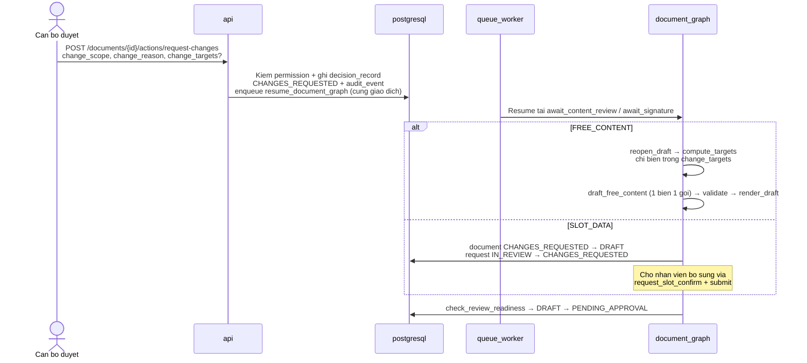
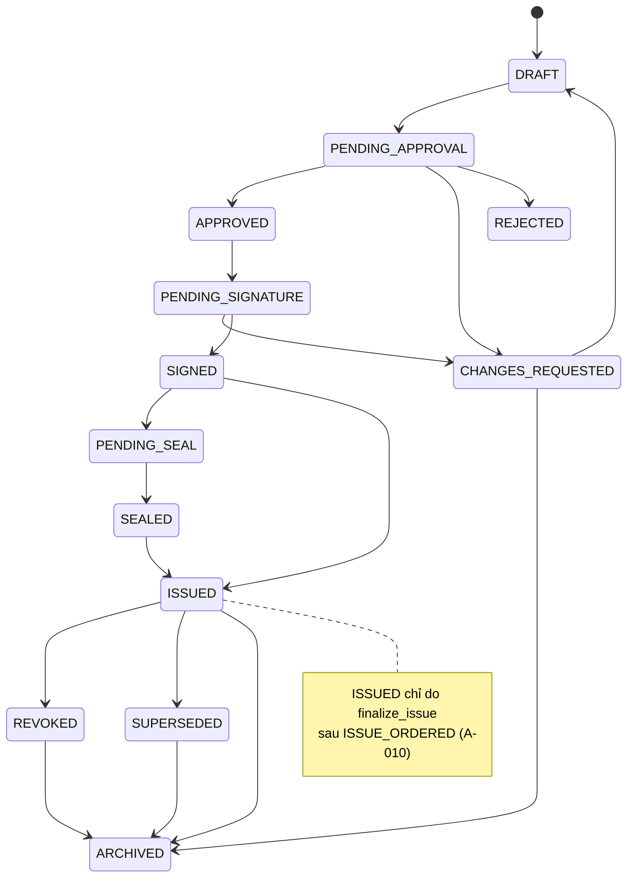

# HITL & Approval Workflow — Admin Service Desk Agent (BO-19)

**Phiên bản:** 0.2 · **Trạng thái:** Draft chờ duyệt

> File này chốt luồng người duyệt: hàng đợi, thứ tự, SLA, từ chối/yêu cầu sửa, định tuyến ký, uỷ quyền vắng mặt, duyệt dấu, thu hồi, và cơ chế dừng khi chạm trần. File này **không** thiết kế AuthZ chi tiết hay rate limit (Phase 9), không định cỡ trần số vòng/token (Phase 11), không viết prompt (Phase 7).

Tên entity, trạng thái, permission, agent, node, tool dùng đúng `GLOSSARY.md`. Quyết định `D-xxx`/`A-xxx` tham chiếu `00-domain.md` và `ASSUMPTIONS.md`.

**Đã đối chiếu:** `CLAUDE.md`, `_PLAN.md`, `GLOSSARY.md`, `ASSUMPTIONS.md`, `00-domain.md`, `01-prd.md`, `02-architecture.md`, `03-agents.md`, `04-data.md`, `05-api.md`, `06-structure.md`, `07-prompts.md`, `decisions/ADR-001` → `ADR-019`.

---

## 1. Hai cổng HITL — bất biến

`NFR-01` của `01-prd.md` và `00-domain.md:301`: không có đường từ `DRAFT` tới `ISSUED` mà không qua `PENDING_APPROVAL`, và khi `requires_seal = true` thì không tới `ISSUED` mà không qua `PENDING_SEAL`. Hai cổng là **hai quyết định riêng**, hai permission (`document.approve_content` / `document.apply_seal`), hai `audit_event`, kể cả cùng một người. Không có nhánh auto-approve, không ngưỡng confidence nào bỏ qua được. `INV-01` (`03-agents.md:19`) bảo đảm sau `PENDING_APPROVAL` không có LLM nào sửa document trừ khi quay về `DRAFT`.

---

## 2. Hàng đợi duyệt

### 2.1 Ba hàng đợi + một hàng đợi phát hành

| Queue | Trạng thái `document` | Permission xem | Endpoint |
|---|---|---|---|
| Duyệt nội dung | `PENDING_APPROVAL` | `document.approve_content` | `GET /review-queue?status=PENDING_APPROVAL` |
| Chờ ký | `PENDING_SIGNATURE` | `document.sign` | `GET /review-queue?status=PENDING_SIGNATURE` |
| Chờ đóng dấu | `PENDING_SEAL` | `document.apply_seal` | `GET /review-queue?status=PENDING_SEAL` |
| Chờ phát hành | `SIGNED`/`SEALED` chưa có `ISSUE_ORDERED` | `document.issue` | `GET /issue-queue` |

Mỗi tab là **một** trạng thái, vì cột đầu của `ix_document_review_queue` là `status` (`05-api.md:108`). Không có hàng đợi gộp ở Sprint đầu.

### 2.2 Sắp xếp và phân trang

* **Sắp xếp:** `document.status_changed_at` tăng dần — chờ lâu nhất trước. Dùng `document.status_changed_at`, không phải `request.status_changed_at` hay `due_at` (chưa có SLA `TBD` — A-002), vì ở ca `FREE_CONTENT` `request` đứng yên `IN_REVIEW` trong khi `document` đi vòng mới (`05-api.md:117`).
* **Phân trang:** keyset `{status_changed_at, id}`, `limit` `TBD` (A-031), `next_cursor` mờ. Không trả tổng số dòng.
* **Tín hiệu làm mới:** `signal` `REVIEW_QUEUE` (`05-api.md:297`) invalidate `['review-queue']` trong `06-structure.md:700`.

### 2.3 Thứ tự hiển thị trên dòng

Mỗi dòng: `request_type` + `status_label` do server trả + thời gian chờ từ `status_changed_at` + cờ `halted` (đang `halt_for_human`) + cờ `issue_in_progress` (đã `ISSUE_ORDERED` chưa `ISSUED`). Hai cờ này là chỗ cho Phase 11 quan sát, giao diện chi tiết thuộc Phase 8 nhưng không phải bảng này.

---

## 3. Ma trận duyệt và tách biệt trách nhiệm

### 3.1 Sáu thao tác cổng (đi vào từ `api`, người thật là tác nhân — `03-agents.md:192`)

| Thao tác | Permission | Chuyển đổi `document` | `request` | `decision_record.kind` |
|---|---|---|---|---|
| `document_approve_content` | `document.approve_content` | `PENDING_APPROVAL → APPROVED` + `approved_content_hash` | — | `APPROVED` |
| `document_request_changes` | `document.request_changes` | `PENDING_APPROVAL`/`PENDING_SIGNATURE` → `CHANGES_REQUESTED` | `SLOT_DATA` → `CHANGES_REQUESTED` | `CHANGES_REQUESTED` |
| `document_reject` | `document.reject` | `PENDING_APPROVAL → REJECTED` | `→ REJECTED` | `REJECTED` |
| `document_sign` | `document.sign` | `PENDING_SIGNATURE → SIGNED` | — | `SIGNED` |
| `document_apply_seal` | `document.apply_seal` | `PENDING_SEAL → SEALED` + `seal_action` | — | `SEALED` |
| `document_issue` | `document.issue` | Ghi `decision_record` `ISSUE_ORDERED`, không cấp số | — | `ISSUE_ORDERED` |

Mỗi thao tác kiểm permission, chuyển trạng thái, ghi `audit_event` và enqueue job resume **trong cùng một giao dịch** (ADR-010). `ISSUED` chỉ do `finalize_issue` trong `queue_worker` (`03-agents.md:210`).

### 3.2 Tách biệt trách nhiệm — D-006

Căn cứ chặn là `beneficiary_employee_id == approver_employee_id` (`00-domain.md:429`), không phải người tạo — nhập hộ rồi duyệt là **hợp lệ**. Khi chỉ còn một người đủ quyền, cho phép tự duyệt nhưng **đủ 4 điều kiện** mới được:

1. `self_approval_reason` không rỗng
2. `approval_step.self_approved = true`
3. `audit_event` mức `WARNING`
4. Hiện riêng ở `GET /self-approvals` (`05-api.md:359`) và `frontend/src/features/audit` (`06-structure.md:545`)

Cấm mọi phương án tự động bỏ qua (cấu hình tắt, whitelist, im lặng cho qua). `request_type.manage` chưa có trong danh mục — `GLOSSARY.md:373` — nên luồng cấu hình từ chối mọi người cho tới Phase 9 (A-042).

---

## 4. Luồng yêu cầu sửa và agent làm lại

* **Bắt buộc:** `change_scope` ∈ `{FREE_CONTENT, SLOT_DATA}` + `change_reason` không rỗng. `change_targets` tuỳ chọn — nếu rỗng thì sinh lại mọi biến nội dung tự do.
* **FREE_CONTENT:** `request` ở nguyên `IN_REVIEW`; chỉ biến trong `change_targets` được sinh lại (ADR-009). `compute_targets` tính tập biến cần sinh từ `change_targets` cộng biến có input đổi.
* **SLOT_DATA:** `request` về `CHANGES_REQUESTED`; nhân viên bổ sung qua `request_slot_confirm` (`05-api.md:224`) rồi `submit` → `resume_document_graph` tại `await_resubmission`.
* **Từ chối:** `document_reject` kèm `REJECTION_REASON` không rỗng → `REJECTED`, `request` → `REJECTED`.

---

## 5. Định tuyến ký và uỷ quyền vắng mặt

* **Sprint đầu:** một cấp ký. `signing_route` xác định `signer_user_id`, chuyển `APPROVED → PENDING_SIGNATURE` (`03-agents.md:175`). `render_integrity_check` chạy ngay trước `signing_route` (`03-agents.md:188`).
* **Nhiều cấp `[Should]`:** `approval_step.level` + `SIGNER` role. Chưa có trong Sprint đầu.
* **Uỷ quyền `[Should]`:** `delegation` (`00-domain.md:396`) — `delegation.manage` tạo/thu hồi. Khi vắng mặt, `assignee_employee_id` được thay bằng `delegate_employee_id` còn hiệu lực. Giao diện Phase 8 hiện `delegation_id` trên `approval_step`.
* **Tự duyệt ở bước ký:** nếu người đủ quyền duy nhất là người thụ hưởng, `signing_route` chỉ đánh dấu `self_approval_expected = true`; người đó phải nhập `self_approval_reason` khi `document_sign` (`03-agents.md:175`).

---

## 6. Duyệt dấu và khoảng hoàn tất phát hành

`document_apply_seal` chỉ nhận `PENDING_SEAL` → `SEALED`, ghi `seal_action` (một loại dấu một dòng, `copies_count ≥ 1`, `page_count ≥ 2` nếu `EDGE_STAMP`). Ở `NON_PRODUCTION` ghi là dấu thử nghiệm (`00-domain.md:362` D-009). Không có lối từ chối dùng dấu ở `PENDING_SEAL` (A-034) — Sprint đầu chỉ có đồng ý.

**Khoảng hoàn tất phát hành** (`03-agents.md:226`): từ `ISSUE_ORDERED` tới `ISSUED`/`VOIDED`. Document đứng yên `SIGNED`/`SEALED`, đã có thể có `document_number` (đoạn 2) nhưng chưa phát hành. Cờ dẫn xuất `issue_in_progress`, hiển thị do Phase 8 quyết. `document_number_assign` chỉ trong `finalize_issue`, idempotent theo `document_id`; `docx_render` khoá theo input, ghi một lần (`04-data.md:705`).

---

## 7. Thu hồi văn bản — F5 `[Should]` nhưng trạng thái bắt buộc

Trạng thái `REVOKED`/`SUPERSEDED`/`ARCHIVED` tồn tại từ Sprint đầu (`01-prd.md:211` AC F3), dù màn hình thu hồi là `[Should]`.

| Bước | Permission | Ghi |
|---|---|---|
| `revoke_initiate` | `document.revoke_initiate` | `REVOCATION_REASON` không rỗng |
| `revoke_confirm` | `document.revoke_confirm` — **khác người** khởi tạo | `SEPARATION_OF_DUTIES_VIOLATION` nếu trùng người |

`document` ở `ISSUED` giữa hai bước; `REVOKED` vẫn truy xuất được. `SUPERSEDED` chưa có endpoint (A-054). Số đã cấp không tái sử dụng.

---

## 8. SLA, escalation và nhắc hạn

* **Quá hạn SLA không đổi trạng thái** — là cờ `sla_breached` tính từ `due_at` (`00-domain.md:254`). Hệ thống bật `sla_breached` và escalate theo Phase 8, không tự chuyển trạng thái.
* **Nhắc `NEEDS_INFO`:** cron `expire_request` quét `expires_at`, nhắc ở ngày thứ 3, `EXPIRED` sau `TBD` (A-014, mặc định 7 ngày làm việc).
* **Escalation trong Sprint đầu:** chỉ **cảnh báo** (ghi `audit_event`, gửi `notification`), không tự duyệt hay tự chuyển người duyệt. Dashboard SLA thuộc Phase 11.

---

## 9. Cơ chế dừng khi chạm trần — A-022

### 9.1 Hai trần độc lập

| Trần | Đơn vị | Giá trị | Chặn gì |
|---|---|---|---|
| Số vòng `CHANGES_REQUESTED` | vòng | `TBD` (A-022) | Vòng qua lại người—hệ thống bất kể token |
| Token budget mỗi `request` | lời gọi LLM sinh một biến | `TBD` (A-022, A-031) | Chi phí/ request |

Nguyên tử chi phí: **một biến một lời gọi** (ADR-009). Cận trên một `document`: `(1 + R) × V × 2 × 2` với `R` vòng, `V` biến, hệ số 2 sinh lại sau trượt kiểm + hệ số 2 sửa parse (`ASSUMPTIONS.md:38`).

### 9.2 Đường vào `halt_for_human`

Mọi nhánh lỗi/ trần đi qua **một** node `halt_for_human` (`03-agents.md:288`):

* `validate_free_content` trượt lần 2
* JSON hỏng lần 2
* `FONT_MISSING` / `RENDER_CHECKSUM_MISMATCH` / `TEMPLATE_NOT_ACTIVE`
* Chạm trần vòng hoặc token (`BUDGET_EXCEEDED`)
* Lỗi provider hết retry (A-031)

Node này **không đổi trạng thái `document`** — document giữ nguyên `PENDING_APPROVAL`/`PENDING_SIGNATURE`/… tại thời điểm dừng, và:

1. Ghi `document_halt` (`reason_code`, `at_node`, `revision_round`, `trace_id`) qua `document_halt_record` (idempotent theo `(document_id, at_node, revision_round)`)
2. Ghi `audit_event`
3. Dừng graph tại `await_human_takeover` (interrupt thứ 6)

### 9.3 Tiếp quản

Người có permission tương ứng xem `DocumentReviewView.halted = true` + `latest_halt.reason_code` (từ `05-api.md:161`), quyết định:

| Mã `reason_code` | Hành động tiếp quản |
|---|---|
| `VALIDATION_FAILED` / `PARSE_FAILED` | Sửa `variable_guidance`/`template_variable` rồi resume |
| `BUDGET_EXCEEDED` / `MAX_ROUNDS_EXCEEDED` | Người thật soạn tay phần còn lại, không gọi LLM |
| `RENDER_CHECKSUM_MISMATCH` | Render lại — khoá object đã có thì không ghi đè |
| `FONT_MISSING` | Cài font vào image rồi resume |

Tiếp quản ghi `decision_record` loại `TAKEOVER_RESOLVED` trỏ `document_halt_id`. Không bao giờ để `document` dở dang với biến rỗng (`01-prd.md:313` NFR-06).

### 9.4 Hiển thị

`DocumentReviewPage` hiện banner `halted` với mã lý do và nút tiếp quản (theo permission). Banner này khác banner `issue_in_progress`. Quyết định ghi `TODO` thành giao diện Phase 8, không phải logic Phase 7.

---

## 10. Audit log

### 10.1 Ghi gì

Mọi thao tác ghi trong `tool_layer` sinh `audit_event` trong **cùng giao dịch** (ADR-010). Bảng `audit_event` chỉ thêm, không `UPDATE`/`DELETE` (`04-data.md:76` nhóm chỉ thêm).

| Nhóm | Sự kiện | `severity` |
|---|---|---|
| Hội thoại | `chat_message` (RES, đã mask), `request_open` | `INFO` |
| Slot | `request_slots_write`, `request_slot_confirm` (từng slot `CONFIRMED`) | `INFO` |
| Duyệt | `APPROVED`, `CHANGES_REQUESTED` + `CHANGE_REASON`, `REJECTED` + `REJECTION_REASON` | `INFO`; `WARNING` nếu `self_approved` |
| Ký/dấu/phát hành | `SIGNED`, `SEALED`, `ISSUE_ORDERED` → `ISSUED`/`VOIDED`, `REVOKE_*` | `INFO`/`WARNING` |
| Cấu hình | `template_version_upload`, `slot_sensitivity_change` (phá huỷ) | `INFO` |
| Dừng | `document_halt` | `INFO` |

`decision_record_text.body` (RES) tách riêng, xoá được khi hết hạn lưu (A-010), không sửa được.

### 10.2 Ai xem được

* `audit.read_own` — bắt buộc lọc `request_id` do mình tạo
* `audit.read_all` — mọi `request`
* `GET /self-approvals` — mục riêng tự duyệt (D-006 điều kiện 4)
* `GET /audit-events?request_id=&document_id=&severity=&action=` (`05-api.md:358`)

### 10.3 Chứng minh bất biến

Thực thi bằng `GRANT`/`REVOKE` (`04-data.md:65` J4): `bo19_app` **không** có `UPDATE`/`DELETE` trên `audit_event`, `decision_record`, `document_render_pin`, `document_register_format`. Kiểm phủ định 169 trường hợp đã chạy ở Phase 6 (`06-structure.md:486`). Credential `bo19_migrator` là ranh giới tin cậy — thuộc Phase 9/11.

---

## 11. Quy tắc cứng — không bao giờ tự động hoá

| # | Hành động | Vì sao không tự động |
|---|---|---|
| 1 | Duyệt nội dung `PENDING_APPROVAL` | NFR-01, RISK-01 — văn bản sai thể thức vô hiệu |
| 2 | Duyệt dấu `PENDING_SEAL` | D-009, EC-SR-05 — hai cổng tách rời, không gộp |
| 3 | Cấp số `document_number` | ADR-011 — sổ số là nguồn sự thật pháp lý, phải do người ra lệnh `ISSUE_ORDERED` |
| 4 | Thu hồi `REVOKED` | Hai người khác nhau, `SEPARATION_OF_DUTIES` |
| 5 | Đổi `operating_mode` `NON_PRODUCTION` → `PRODUCTION` | D-009 — quyết định có người ký, không phải cờ cấu hình |
| 6 | Tự duyệt khi `beneficiary == approver` | D-006 — phải có `self_approval_reason` + `WARNING` |
| 7 | Sửa `change_targets`/`change_scope` | ADR-009 — LLM không tự quyết phạm vi sửa |
| 8 | Gỡ `halt_for_human` | Phải do người tiếp quản `TAKEOVER_RESOLVED` |

Tự động các hành động trên là vi phạm cổng nghiệm thu `01-prd.md:369` M4.

---

## Open Questions

Không có câu hỏi mở chỉ tồn tại trong file này. Các giả định liên quan: `A-022` (trần vòng/token), `A-029` (đường sang `EXPIRED` cho `CHANGES_REQUESTED`), `A-034` (lối ra `PENDING_SEAL`), `A-044` (khoá idempotency `document_halt`), `A-052` (nhập hộ) — xem `ASSUMPTIONS.md`.

---

## Quyết định kiến trúc

Không có ADR mới. Thiết kế dựa trên ADR-009, ADR-010, ADR-011, D-006, D-009 đã chốt.

