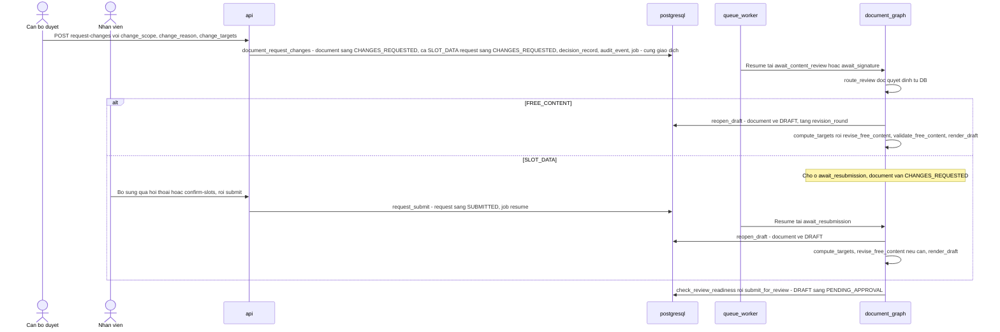
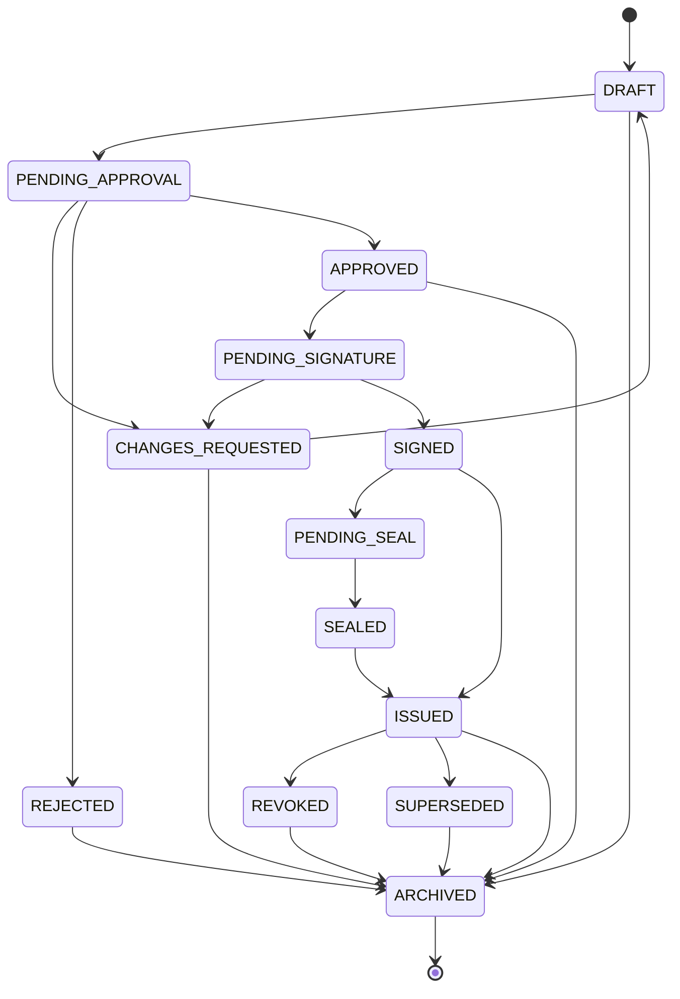

# HITL & Approval Workflow — Admin Service Desk Agent (BO-19)

**Phiên bản:** 0.9 · **Trạng thái:** Draft chờ duyệt · **v0.3:** đợt sửa 3 sau Phase 13, lượt sửa có phép của PO — viết lại phần sai (AUD-06), giao bốn việc thiếu (AUD-02: ba bảng mã, thao tác tiếp quản), cạnh `SUBMITTED → REJECTED` gắn vào tiếp quản (AUD-07), phép xác định "chỉ còn một người đủ quyền" và đường thoát tự duyệt cho thu hồi (AUD-23 (e)(f)); sửa theo AUD-01, AUD-05, AUD-08, AUD-11, AUD-17 phần nằm trong file này. Chi tiết ở mục ngày 2026-09-26 (đợt sửa 3) của `CHANGELOG.md` · **v0.4:** quyết định PO khi nhận đợt 3 — ADR-027 `Accepted`, A-044 `Đã chốt`; ca K3, K4 ở `10-eval.md`; A-078 cho người vắng dài ngày · **v0.5:** đợt sửa 3b — việc (g)–(j) của AUD-23: hiển thị khoảng hoàn tất phát hành, đóng phiên nhàn rỗi, giao diện ca `HR_PROFILE` sai, giao diện nhãn phá huỷ · **v0.6:** A-055 `Đã chốt` — hướng 1, danh sách miễn `audit_event` (2026-09-27) · **v0.7:** A-084 — `PUT` nhận `412`: mã nội bộ `STORAGE_WRITE_CONFLICT` (PO, 2026-10-02) · **v0.8:** `PROVIDER_UNAVAILABLE`: mã con `PROVIDER_RATE_LIMITED`, `PROVIDER_ERROR` (ADR-035, 2026-10-02) · **v0.9:** mã con `PROVIDER_CALL_FAILED` thay `PROVIDER_ERROR` — tránh trùng giá trị `llm_usage.outcome` (2026-10-02)

> File này chốt luồng người duyệt: hàng đợi, thứ tự, tách biệt trách nhiệm, yêu cầu sửa, định tuyến ký, duyệt dấu, thu hồi, dừng có kiểm soát và tiếp quản, bảng mã. File này **không** thiết kế AuthZ chi tiết hay rate limit (`09-security.md`), không định cỡ trần (`11-ops.md`), không viết prompt (`07-prompts.md`).

Tên entity, trạng thái, permission, agent, node, tool dùng đúng `GLOSSARY.md`. Quyết định `D-xxx`/`A-xxx` tham chiếu `00-domain.md` và `ASSUMPTIONS.md`.

**Đã đối chiếu (v0.3):** `CLAUDE.md`, `_PLAN.md`, `GLOSSARY.md`, `ASSUMPTIONS.md`, `00-domain.md`, `01-prd.md`, `02-architecture.md`, `03-agents.md`, `04-data.md`, `05-api.md`, `06-structure.md`, `11-ops.md`, `12-roadmap.md`, `13-audit.md`, `contracts/schema.sql` cùng migration `0002`→`0006`, `contracts/openapi.yaml`, `decisions/ADR-001` → `ADR-026`.

**Việc Phase 8 được giao, làm ở đợt sửa 3b:** hiển thị khoảng hoàn tất phát hành (mục 6), đóng phiên nhàn rỗi (mục 13), giao diện ca `HR_PROFILE` sai và giao diện nhãn phá huỷ (mục 14) — việc (g)–(j) của AUD-23.

---

## 1. Hai cổng HITL — bất biến

Bất biến thứ nhất ở mục Vòng đời `document` của `00-domain.md`, và NFR-01: không có đường từ `DRAFT` tới `ISSUED` mà không qua `PENDING_APPROVAL`; khi `requires_seal = true` thì không tới `ISSUED` mà không qua `PENDING_SEAL`. Hai cổng là **hai quyết định riêng**, hai permission (`document.approve_content` / `document.apply_seal`), hai `audit_event`, kể cả cùng một người. Không có nhánh auto-approve, không ngưỡng confidence nào bỏ qua được. INV-01 (mục Ba bất biến nền của `03-agents.md`) bảo đảm sau `PENDING_APPROVAL` không LLM nào sửa `document` trừ khi quay về `DRAFT`.

Thao tác tiếp quản (mục 9.3) **không** mở đường nào vòng qua hai cổng: nó chỉ cho graph chạy lại một node đã dừng, trả văn bản về hàng đợi phát hành, hoặc kết thúc yêu cầu.

---

## 2. Hàng đợi

### 2.1 Bốn hàng đợi duyệt và một hàng đợi tiếp quản

| Hàng đợi | Điều kiện | Permission xem | Endpoint |
|---|---|---|---|
| Duyệt nội dung | `document` ở `PENDING_APPROVAL` | `document.approve_content` | `GET /review-queue?status=PENDING_APPROVAL` |
| Chờ ký | `PENDING_SIGNATURE` | `document.sign` | `GET /review-queue?status=PENDING_SIGNATURE` |
| Chờ đóng dấu | `PENDING_SEAL` | `document.apply_seal` | `GET /review-queue?status=PENDING_SEAL` |
| Chờ phát hành | `SIGNED` không cần dấu hoặc `SEALED`, không có lệnh phát hành đang chạy, không đang dừng | `document.issue` | `GET /issue-queue` |
| Chờ tiếp quản | Có `approval_step` loại `TAKEOVER` đang `OPEN` | `document.approve_content`, `document.reject` hoặc `document.issue`, cộng `request.read_all` — bước `TAKEOVER` không giao cho ai | `GET /takeover-queue` |

Mỗi hàng đợi duyệt là **một** trạng thái, vì cột đầu của `ix_document_review_queue` là `status` (mục Phân trang của `05-api.md`). Hàng đợi tiếp quản không theo trạng thái `document` — văn bản dừng ở `DRAFT` không nằm trong hàng đợi duyệt nào — mà theo bước `TAKEOVER` đang mở (ADR-027).

### 2.2 Sắp xếp và phân trang

- **Hàng đợi duyệt và phát hành:** `document.status_changed_at` tăng dần — chờ lâu nhất trước. Không dùng `request.status_changed_at`: ở ca `FREE_CONTENT` `request` đứng yên `IN_REVIEW` trong khi `document` đi vòng mới. Không dùng `due_at`: SLA còn `TBD` (A-002).
- **Hàng đợi tiếp quản:** `approval_step.opened_at` tăng dần, qua `ix_approval_step_open_by_kind` (migration `0007`).
- **Phân trang:** keyset, `limit` `TBD` (A-031), `next_cursor` mờ, không trả tổng số dòng.
- **Tín hiệu làm mới:** chủ đề `REVIEW_QUEUE` của stream tín hiệu (mục Stream tín hiệu của `05-api.md`) phủ cả hàng đợi tiếp quản.

### 2.3 Trên mỗi dòng

`request_type` + `status_label` do server trả + thời gian chờ + cờ `halted` + cờ `issue_in_progress` + cờ `job_failed`. Ba cờ là cờ dẫn xuất (mục Agent, graph, node, tool của `GLOSSARY.md`). `halted` = có bước `TAKEOVER` `OPEN`. Cách hiển thị `issue_in_progress`: mục 6.

---

## 3. Thao tác của người duyệt và tách biệt trách nhiệm

### 3.1 Thao tác cổng trên văn bản

Đi vào từ `api`, người thật là tác nhân (mục Thao tác cổng — không node nào của graph được gọi của `03-agents.md`). Mỗi thao tác kiểm permission, kiểm D-006, chuyển trạng thái, ghi `decision_record` và `audit_event`, enqueue job — **trong cùng một giao dịch** (ADR-010).

| Thao tác | Permission | `document` | `request` | `decision_record.kind` | Bước mang cờ D-006 |
|---|---|---|---|---|---|
| `document_approve_content` | `document.approve_content` | `PENDING_APPROVAL → APPROVED` + `approved_content_hash` | ở nguyên `IN_REVIEW` | `APPROVED` | `CONTENT_REVIEW` |
| `document_request_changes` | `document.request_changes` | `PENDING_APPROVAL`/`PENDING_SIGNATURE` → `CHANGES_REQUESTED` | `SLOT_DATA`: `IN_REVIEW → CHANGES_REQUESTED`; `FREE_CONTENT`: ở nguyên | `CHANGES_REQUESTED` | `CONTENT_REVIEW` hoặc `SIGNATURE` |
| `document_reject` | `document.reject` | `PENDING_APPROVAL → REJECTED` | `IN_REVIEW → REJECTED` | `REJECTED` | `CONTENT_REVIEW` |
| `document_sign` | `document.sign` | `PENDING_SIGNATURE → SIGNED`, rồi `→ PENDING_SEAL` nếu `requires_seal` | `IN_REVIEW → APPROVED` — `APPROVED` nghĩa là đã ký (AUD-01) | `SIGNED` | `SIGNATURE` |
| `document_apply_seal` | `document.apply_seal` | `PENDING_SEAL → SEALED` + `seal_action` | — | `SEALED` | `SEAL` |
| `document_issue` | `document.issue` | Không đổi; ghi lệnh phát hành, không cấp số | — | `ISSUE_ORDERED` | `ISSUE_ORDER`, sinh ra đã `DECIDED` |
| `document_takeover_resolve` | Theo lối ra — mục 9.3 | Theo lối ra | Theo lối ra | `TAKEOVER_RESOLVED` | `TAKEOVER` |
| `document_revoke_initiate` `[Should]` | `document.revoke_initiate` | Không đổi | — | `REVOKE_INITIATED` | `REVOKE_INITIATE`, sinh ra đã `DECIDED` |
| `document_revoke_confirm` `[Should]` | `document.revoke_confirm` | `ISSUED → REVOKED` | — | `REVOKE_CONFIRMED` | `REVOKE_CONFIRM` |

`ISSUED` chỉ do `finalize_issue` trong `queue_worker` (mục Thao tác cổng — không node nào của graph được gọi của `03-agents.md`).

**`DOCUMENT_AWAITING_TAKEOVER`.** Thao tác nào đánh thức `document_graph` — `request_submit` ở ca `SLOT_DATA`, `document_issue` — trả `DOCUMENT_AWAITING_TAKEOVER` khi `document` đang có bước `TAKEOVER` `OPEN`: thread đang chờ ở `await_human_takeover`, không ở `interrupt` mà thao tác đó nhắm tới. `request_cancel` là ngoại lệ — mục 9.3.

### 3.2 Tách biệt trách nhiệm — D-006

**Căn cứ chặn** là `request.beneficiary_employee_id == actor` (mục Tách biệt trách nhiệm — quyết định D-006 của `00-domain.md`), không phải người tạo — nhập hộ rồi duyệt là hợp lệ. Ràng buộc thứ hai, riêng cho thu hồi: người xác nhận khác người khởi tạo (mục 7).

**"Chỉ còn một người đủ quyền" — phép xác định (AUD-23 (e)).** Với thao tác dùng permission P trên văn bản d, tập **người thay thế** E(P, d) là mọi nhân viên thoả cả bốn điều:

1. `employee.is_active = true`;
2. mang P — qua vai trò (`employee_role` → `role_permission`) hoặc cấp lẻ (`employee_permission_grant`);
3. không phải người thụ hưởng của `request` của d;
4. riêng P = `document.revoke_confirm`: không phải người khởi tạo lần thu hồi đang chờ xác nhận.

Người đang thao tác **bị chặn** khi họ là người thụ hưởng, hoặc — với `document.revoke_confirm` — là người khởi tạo. **Đường thoát áp dụng khi và chỉ khi người đó bị chặn và E(P, d) rỗng.**

- Tính **tại lúc thao tác, trong chính giao dịch của nó**, từ bảng quyền. Không cache, không cờ cấu hình, không danh sách trắng. Client không gửi cờ nào; client chỉ gửi `self_approval_reason`.
- **Vắng mặt không làm ai rời khỏi E** — quyết định PO, 2026-09-26. Người khác mang P mà đang nghỉ vẫn nằm trong E, nên không có đường thoát. Lối cho người vắng mặt là uỷ quyền `[Should]`, đã cắt khỏi Sprint đầu (AUD-15). Lối ra khi mọi người khác mang P vắng dài ngày — A-078, `Đã chốt`: người vận hành cấp P tạm cho một người thay thế không phải người thụ hưởng, ghi lý do, người duyệt, ngày dự kiến thu hồi (mục Runbook — cấp và thu hồi permission tạm của `11-ops.md`). Quan hệ giữa E và uỷ quyền chốt khi uỷ quyền được kích hoạt.
- `approval_step.self_approval_expected` chỉ là **gợi ý** cho giao diện, tính lúc mở bước (ví dụ `signing_route`). Nó có thể cũ. Phép xác định lúc thao tác mới là quyết định.

**Kết quả:**

| Bị chặn? | E(P, d) | `self_approval_reason` | Kết quả |
|---|---|---|---|
| Không | — | Bỏ qua, không lưu | Thao tác chạy thường |
| Có — là người thụ hưởng | Khác rỗng | — | `SELF_APPROVAL_BLOCKED` |
| Có — chỉ là người khởi tạo thu hồi | Khác rỗng | — | `SEPARATION_OF_DUTIES_VIOLATION` |
| Có | Rỗng | Thiếu hoặc rỗng | `SELF_APPROVAL_REASON_REQUIRED` |
| Có | Rỗng | Có | Chạy, đủ bốn điều kiện của D-006 bên dưới |

Đủ **bốn điều kiện** của D-006:

1. `self_approval_reason` không rỗng, không có giá trị mặc định;
2. `approval_step.self_approved = true` trên bước ở cột cuối của bảng mục 3.1 (ADR-027);
3. `audit_event` mức `WARNING` — ca D-006 trong danh sách đóng của mục Enum khác của `GLOSSARY.md`;
4. hiện ở `GET /self-approvals`, mục tự duyệt riêng.

Cấm mọi phương án tự động bỏ qua: cấu hình tắt ràng buộc, whitelist, im lặng cho qua.

**Không bị D-006 chặn:** lối ra `RETRY` và `RETURN_TO_ISSUE_QUEUE` của thao tác tiếp quản. Chúng không quyết định gì về văn bản — mọi cổng phía sau vẫn còn nguyên và vẫn kiểm D-006. Ca K3, K4 ở mục Ca kiểm cơ chế graph của `10-eval.md` chứng minh điều đó bằng máy.

**Luồng cấu hình `request_type`** dùng permission `request_type.manage` — đã có trong danh mục từ Phase 9 (A-042 `Đã chốt`, mục AuthZ của `09-security.md`).

---

## 4. Luồng yêu cầu sửa và agent làm lại

Nguồn: mục Thao tác cổng và mục `document_graph` của `03-agents.md`.

```mermaid
sequenceDiagram
    actor CB as Can bo duyet
    actor NV as Nhan vien
    participant API as api
    participant DB as postgresql
    participant W as queue_worker
    participant DG as document_graph

    CB->>API: POST request-changes voi change_scope, change_reason, change_targets
    API->>DB: document_request_changes - document sang CHANGES_REQUESTED, ca SLOT_DATA request sang CHANGES_REQUESTED, decision_record, audit_event, job - cung giao dich
    W->>DG: Resume tai await_content_review hoac await_signature
    DG->>DG: route_review doc quyet dinh tu DB
    alt FREE_CONTENT
        DG->>DB: reopen_draft - document ve DRAFT, tang revision_round
        DG->>DG: compute_targets roi revise_free_content, validate_free_content, render_draft
    else SLOT_DATA
        Note over DG: Cho o await_resubmission, document van CHANGES_REQUESTED
        NV->>API: Bo sung qua hoi thoai hoac confirm-slots, roi submit
        API->>DB: request_submit - request sang SUBMITTED, job resume
        W->>DG: Resume tai await_resubmission
        DG->>DB: reopen_draft - document ve DRAFT
        DG->>DG: compute_targets, revise_free_content neu can, render_draft
    end
    DG->>DB: check_review_readiness roi submit_for_review - DRAFT sang PENDING_APPROVAL
```

- **Bắt buộc:** `change_scope` ∈ {`FREE_CONTENT`, `SLOT_DATA`} và `change_reason` không rỗng. `change_targets` tuỳ chọn — rỗng thì mọi biến nội dung tự do được sinh lại.
- **`FREE_CONTENT`:** `request` ở nguyên `IN_REVIEW`; chỉ biến trong `change_targets` cộng biến có input đổi được sinh lại (ADR-009).
- **`SLOT_DATA`:** thao tác cổng đưa `request` về `CHANGES_REQUESTED` trong giao dịch của nó; `document` đứng ở `CHANGES_REQUESTED`, thread chờ ở `await_resubmission`. Nhân viên bổ sung qua chính hội thoại (`request_slots_write` nhận `CHANGES_REQUESTED` ca `SLOT_DATA`) hoặc `request_slot_confirm`, rồi `request_submit`. Chỉ **sau** đó `reopen_draft` mới đưa `document` về `DRAFT`.
- **Chạm trần số vòng:** `route_review` vào `halt_for_human` thay vì mở vòng mới — mục 9.
- **Từ chối:** `document_reject` kèm `REJECTION_REASON` không rỗng.

---

## 5. Định tuyến ký và uỷ quyền vắng mặt

- **Sprint đầu: một cấp ký.** `route_signing` gọi `render_integrity_check` trên bản đã duyệt, rồi `signing_route` xác định người ký, ghi `signer_user_id`, chuyển `APPROVED → PENDING_SIGNATURE`. Không có người ký hợp lệ → `halt_for_human` với `NO_ELIGIBLE_SIGNER` (mục 10.1).
- **Tự duyệt ở bước ký:** khi E(`document.sign`, d) rỗng và người mang `document.sign` là người thụ hưởng, `signing_route` chỉ đặt `self_approval_expected = true` — không tự chọn đường thoát. Người đó nhập `self_approval_reason` khi `document_sign` (mục 3.2).
- **Nhiều cấp `[Should]`:** `approval_step.level` + vai trò `SIGNER`.
- **Uỷ quyền `[Should]`:** `delegation`, `delegation.manage`. Sprint đầu cắt phạm vi, giữ thiết kế (AUD-15). Ngữ nghĩa cho người duyệt chốt khi kích hoạt.

---

## 6. Duyệt dấu và khoảng hoàn tất phát hành

`document_apply_seal` chỉ nhận `PENDING_SEAL → SEALED`, ghi `seal_action`: một loại dấu một dòng, `copies_count ≥ 1`, `page_count ≥ 2` nếu `EDGE_STAMP`. Ở `NON_PRODUCTION` ghi là dấu thử nghiệm (mục Chế độ phi sản xuất — quyết định D-009 của `00-domain.md`). Không có lối từ chối dùng dấu ở `PENDING_SEAL` — A-034, còn mở.

Máy trạng thái `document` — chép đúng mục Vòng đời `document` của `00-domain.md`:

```mermaid
stateDiagram-v2
    [*] --> DRAFT
    DRAFT --> PENDING_APPROVAL
    PENDING_APPROVAL --> CHANGES_REQUESTED
    CHANGES_REQUESTED --> DRAFT
    PENDING_APPROVAL --> REJECTED
    PENDING_APPROVAL --> APPROVED
    APPROVED --> PENDING_SIGNATURE
    PENDING_SIGNATURE --> CHANGES_REQUESTED
    PENDING_SIGNATURE --> SIGNED
    SIGNED --> PENDING_SEAL
    PENDING_SEAL --> SEALED
    SIGNED --> ISSUED
    SEALED --> ISSUED
    ISSUED --> REVOKED
    ISSUED --> SUPERSEDED
    ISSUED --> ARCHIVED
    REVOKED --> ARCHIVED
    SUPERSEDED --> ARCHIVED
    REJECTED --> ARCHIVED
    CHANGES_REQUESTED --> ARCHIVED
    DRAFT --> ARCHIVED
    APPROVED --> ARCHIVED
    ARCHIVED --> [*]
```

Ba cạnh vào `ARCHIVED` từ `CHANGES_REQUESTED`, `DRAFT`, `APPROVED` là **bản nháp bị bỏ** — văn bản chưa từng ký, chưa từng có hiệu lực — và bắt buộc `archive_reason` (mục 10.2).

**Khoảng hoàn tất phát hành** — từ lệnh phát hành tới `ISSUED` hoặc số `VOIDED`. `document` đứng yên `SIGNED`/`SEALED`; có thể đã có số mà chưa phát hành. Dữ liệu ở mục Khoảng hoàn tất phát hành trong dữ liệu của `04-data.md`.

**Hiển thị (AUD-23 (g)).** Hai đoạn của khoảng — chưa có số, và đã có số nhưng chưa phát hành — hiện **giống hệt nhau** với mọi người dùng:

- **Không hiện số ở đoạn 2.** Số đó còn có thể chuyển `VOIDED` nếu `finalize_issue` bỏ cuộc. Hiện nó là mời người khác ghi, gọi, in một số chưa có hiệu lực. Giữ đúng mục Dữ liệu trong response của `05-api.md`: `document_number` chỉ có từ `ISSUED`.
- **Một nhãn cho cả khoảng.** `status_label` do server tính theo cặp (`status`, `issue_in_progress`): khi cờ đúng, nhãn là nhãn "đang cấp số và phát hành" của danh mục nhãn phía server, thay nhãn của `SIGNED` hay `SEALED`. `status` vẫn là mã thật. Nhân viên thấy cùng nhãn đó trong `RequestDetail`.
- **Không có việc gì cho người ở cả hai đoạn.** Văn bản không nằm trong hàng đợi phát hành (mục 2.1) và nút phát hành không hiện. Khoảng kết thúc theo một trong ba đường, mỗi đường một tín hiệu riêng: `ISSUED`; `halted` — bỏ cuộc sau khi có số, số `VOIDED`, chờ tiếp quản (mục 9); `job_failed` — worker không chạy được job, graph chưa tới node nào.
- **Đoạn nào đang chạy là việc của vận hành**, không phải của giao diện: dẫn xuất được ở mục Khoảng hoàn tất phát hành trong dữ liệu của `04-data.md`. Khoảng kéo dài bao lâu thì bất thường — SLA `TBD` (A-002).

---

## 7. Thu hồi văn bản — F5 `[Should]`, trạng thái bắt buộc

Trạng thái `REVOKED`/`SUPERSEDED`/`ARCHIVED` tồn tại từ Sprint đầu; màn hình thu hồi là `[Should]`.

| Bước | Permission | Ghi, trong một giao dịch |
|---|---|---|
| `document_revoke_initiate` | `document.revoke_initiate` | Bước `REVOKE_INITIATE` sinh ra đã `DECIDED`; `decision_record` `REVOKE_INITIATED`; `REVOCATION_REASON` không rỗng; **mở** bước `REVOKE_CONFIRM` (`assignee_employee_id` `NULL`). `document` ở nguyên `ISSUED` |
| `document_revoke_confirm` | `document.revoke_confirm` | Đóng bước `REVOKE_CONFIRM` `DECIDED`; `decision_record` `REVOKE_CONFIRMED`; `ISSUED → REVOKED` |

**Đường thoát cho tổ chức một người (AUD-23 (f)).** Giữ D-006 — "cùng cơ chế áp dụng cho ràng buộc hai người ở bước thu hồi". Người xác nhận trùng người khởi tạo thì chạy phép xác định ở mục 3.2 với P = `document.revoke_confirm`: E rỗng → nhập `self_approval_reason`, bước `REVOKE_CONFIRM` mang `self_approved = true`, `audit_event` `WARNING`; E khác rỗng → `SEPARATION_OF_DUTIES_VIOLATION`. Người thụ hưởng khởi tạo hay xác nhận thu hồi văn bản của chính mình thì theo đúng bảng Kết quả ở mục 3.2.

`uq_approval_step_one_open` chặn hai lần khởi tạo cùng chờ trên một văn bản. Huỷ một lần khởi tạo đang chờ — chưa thiết kế; F5 là `[Should]`, sau UAT. `REVOKED` vẫn truy xuất được; số đã cấp không tái sử dụng. `SUPERSEDED` chưa có thao tác (A-054).

---

## 8. SLA, escalation và nhắc hạn

- **Quá hạn SLA không đổi trạng thái** — là cờ `sla_breached` tính từ `due_at` (mục Vòng đời `request` của `00-domain.md`). SLA `TBD` (A-002).
- **Nhắc `NEEDS_INFO`:** Cron Job `needs_info_reminder` (mục Thao tác vận hành của `03-agents.md`) gửi `NEEDS_INFO_REMINDER` cho người tạo. `expire_request` chỉ làm việc hết hạn. Mốc nhắc và thời hạn `EXPIRED`: A-014.
- **Escalation trong Sprint đầu:** chỉ cảnh báo — không tự duyệt, không tự đổi người duyệt. Dashboard SLA và tồn đọng: mục Dashboard SLA & tồn đọng của `11-ops.md`.

---

## 9. Dừng có kiểm soát và tiếp quản — NFR-06

### 9.1 Hai trần độc lập

| Trần | Đơn vị | Chặn gì |
|---|---|---|
| Số vòng `CHANGES_REQUESTED` mỗi `document` — `R` | vòng | Vòng qua lại người—hệ thống, bất kể token |
| Token budget mỗi `request` | token | Chi phí mỗi `request` |

Nguyên tử chi phí: **một lời gọi LLM sinh một biến** (ADR-009). Giá trị hai trần và cận trên số lời gọi: mục Định cỡ A-022 của `11-ops.md` — không chép lại ở đây.

### 9.2 Đường vào `halt_for_human`

Mọi nhánh lỗi và mọi trần của `document_graph` đi qua **một** node `halt_for_human` (mục `document_graph` của `03-agents.md`). Node này **không đổi trạng thái `document`**. Không đường nào dừng ở `PENDING_APPROVAL`, `PENDING_SIGNATURE` hay `PENDING_SEAL` — graph chỉ dừng ở node chạy máy, không ở cổng:

| `at_node` | `document` khi dừng | `request` khi dừng |
|---|---|---|
| `draft_free_content`, `revise_free_content`, `validate_free_content`, `render_draft`, `check_review_readiness` | `DRAFT` | `SUBMITTED` ở vòng soạn đầu và vòng sau khi gửi lại ca `SLOT_DATA`; `IN_REVIEW` ở vòng `FREE_CONTENT` |
| `route_review` | `CHANGES_REQUESTED` | `IN_REVIEW` ca `FREE_CONTENT`; `CHANGES_REQUESTED` ca `SLOT_DATA` |
| `route_signing` | `APPROVED` | `IN_REVIEW` |
| `finalize_issue` | `SIGNED` hoặc `SEALED`; số của lần này đã `VOIDED` nếu đã cấp | `APPROVED` |

`halt_for_human`, theo thứ tự:

1. `document_halt_record` — trong **một** giao dịch: mở bước `TAKEOVER`, ghi `document_halt` (`reason_code`, `at_node`, `revision_round`, `trace_id`, `takeover_step_id`), ghi `audit_event`. **Idempotency (A-044):** `document` đã có bước `TAKEOVER` `OPEN` thì trả lại lần dừng của bước đó, không ghi gì mới; `uq_approval_step_one_open` là lớp chặn ở DB. Lần dừng sau một lần `RETRY`, dù cùng node cùng vòng, là một bước và một lần dừng mới (ADR-027).
2. `notification_send` — `DOCUMENT_HALTED` (mục 10.3).
3. `interrupt` tại `await_human_takeover`.

**Lỗi trước khi có `document` không vào đây.** `template_fetch` trả `NO_ACTIVE_TEMPLATE` ở `prepare_draft` thì chưa có `document` để gắn `document_halt`; job `render_document` đi đường job lỗi vĩnh viễn của mục Background worker & Cron của `11-ops.md` và `RENDER_JOB_FAILED`.

### 9.3 Tiếp quản — `document_takeover_resolve` (AUD-02 (d))

**Thao tác cổng** `document_takeover_resolve`, endpoint `POST /documents/{document_id}/actions/resolve-halt`, `SYNC_ENQUEUE`, khoá idempotency = id của `decision_record` `TAKEOVER_RESOLVED`. Body: `expected_row_version`, `document_halt_id`, `resolution`, `rejection_reason` (bắt buộc khi và chỉ khi `REJECT_REQUEST`), `self_approval_reason`.

**Ba lối ra** — `decision_record.takeover_resolution`:

| Lối ra | Permission | D-006 | Được dùng khi | Chuyển trạng thái | Graph đi tiếp |
|---|---|---|---|---|---|
| `RETRY` | `document.approve_content` | Không kiểm | `at_node` ≠ `finalize_issue` và `reason_code` có cột `RETRY` ở mục 10.1. Người tiếp quản đã sửa nguyên nhân **ngoài** hệ thống: cài font, cấp quyền ký, khôi phục object, chờ provider | Không | `route_takeover` → chính `at_node` |
| `REJECT_REQUEST` | `document.reject` | **Có** — như `document_reject` | `at_node` ≠ `finalize_issue` | `request` `SUBMITTED`/`IN_REVIEW`/`CHANGES_REQUESTED` → `REJECTED`; `document` `DRAFT`/`CHANGES_REQUESTED`/`APPROVED` → `ARCHIVED`, `archive_reason = TAKEOVER_REJECTED`; `decision_record_text` `REJECTION_REASON` | `route_takeover` → `END` |
| `RETURN_TO_ISSUE_QUEUE` | `document.issue` | Không kiểm | `at_node` = `finalize_issue` và `reason_code` ≠ `CONTENT_HASH_MISMATCH` | Không. Lệnh phát hành cũ đã bỏ cuộc; văn bản trở lại hàng đợi phát hành, phát hành lại cần một **lệnh mới** — mỗi lệnh tiêu tối đa một số | `route_takeover` → `await_issue` |

Mọi lối ra, cùng một giao dịch (ADR-010): đóng bước `TAKEOVER` `DECIDED`; ghi `decision_record` `TAKEOVER_RESOLVED` trỏ `document_halt_id` và `approval_step_id`; `audit_event`; enqueue `resume_document_graph`. Node `route_takeover` đọc quyết định từ DB — payload resume chỉ mang `decision_record_id`, như `route_review`.

**`REJECT_REQUEST` là đường của cạnh `SUBMITTED → REJECTED`** ("không đủ điều kiện theo quy chế", AUD-07) — cạnh đã có trong máy trạng thái `request` mà trước đây không thao tác nào đi qua. Nó thêm hai cạnh cho `request` và `document` — `CHANGES_REQUESTED → REJECTED` của `request`; `DRAFT → ARCHIVED`, `APPROVED → ARCHIVED` của `document` — ghi ở mục Vòng đời của `00-domain.md`.

**Lỗi:**

| Tình huống | Mã |
|---|---|
| Lần dừng không phải lần đang mở, hoặc đã được giải | `STATE_CONFLICT` |
| Lối ra không được dùng cho `at_node` và `reason_code` này | `TAKEOVER_RESOLUTION_NOT_ALLOWED`, `details.allowed_resolutions` |
| Thiếu `rejection_reason` với `REJECT_REQUEST`, hoặc có nó với lối ra khác | `VALIDATION_FAILED` |
| D-006 ở `REJECT_REQUEST` | Bảng Kết quả ở mục 3.2 |

**`request_cancel` trong lúc đang dừng.** Chỉ xảy ra được ở ca `SLOT_DATA` dừng tại `route_review` — lúc đó `request` đã ở `CHANGES_REQUESTED`. `request_cancel` chạy như thường (mục Khi `request` bị huỷ lúc `document` đang `CHANGES_REQUESTED` của `04-data.md`), cộng: đóng bước `TAKEOVER` `CANCELLED`, và resume tại `await_human_takeover` thay vì `await_resubmission`. `route_takeover` đọc DB, thấy `request` `CANCELLED`, tới `END`.

**Mỗi vòng lặp đi qua một người.** `RETRY` có thể dừng lại lần nữa; mỗi lần là một bước `TAKEOVER` mới và một hành động của người thật, và token budget của `request` vẫn đếm (dòng Điều kiện thoát vòng lặp ở mục `drafting_agent` của `03-agents.md` giữ nguyên).

**Không có trong Sprint đầu** — A-077: người tiếp quản tự viết biến nội dung tự do thay LLM; lối ra cho `CONTENT_HASH_MISMATCH`. Sửa `variable_guidance` hay `template_variable` **không** phải lối tiếp quản: phiên bản template bất biến, `template_variable` chỉ thêm (mục Bảng chi tiết của `04-data.md`); sửa template là tải phiên bản mới, và văn bản đã ghim phiên bản cũ.

### 9.4 Hiển thị

- `DocumentReviewView.latest_halt` mang `document_halt_id`, `reason_code`, `at_node`, `created_at` và `allowed_resolutions` — server tính từ bảng mục 10.1, **không** theo permission của người xem. Giao diện đối chiếu permission trong `GET /me` để bật nút.
- Banner `halted` khác banner `issue_in_progress` và cờ `job_failed`: `halted` là graph đã dừng có tên và chờ người; `job_failed` là hạ tầng không chạy được job, graph chưa tới node nào (mục Background worker & Cron của `11-ops.md`).
- Nhân viên không thấy `reason_code`. `RequestDetail` giữ nguyên trạng thái; `request_submit` trong lúc dừng trả `DOCUMENT_AWAITING_TAKEOVER`, `message` bảo chờ phòng hành chính.

---

## 10. Bảng mã

Ba bảng dưới đây là bảng mã mà `04-data.md`, `05-api.md` và `GLOSSARY.md` giao cho Phase 8. Migration `0007` biến chúng thành `CHECK`; thêm mã là thêm một migration và một dòng ở đây.

### 10.1 `document_halt.reason_code` (AUD-02 (a))

Mã của người tiếp quản, không phải nguyên văn mã lỗi của tool (mục Mã lỗi của tool và thao tác của `05-api.md`). Mã con của tool ghi trong `audit_event` của lần dừng và trong `observability`.

| `reason_code` | `at_node` | Từ đâu | `RETRY`? |
|---|---|---|---|
| `FREE_CONTENT_INVALID` | `validate_free_content` | Biến trượt kiểm lần hai trong cùng vòng | Không |
| `PARSE_FAILED` | `draft_free_content`, `revise_free_content` | JSON hỏng sau lần sửa parse duy nhất | Không |
| `PROVIDER_UNAVAILABLE` | như trên | Lỗi gọi model hết lượt retry (A-031). Mã con trong `audit_event`: `PROVIDER_RATE_LIMITED` — 429; `PROVIDER_CALL_FAILED` — 5xx, timeout, lỗi mạng (enum `provider_failure_subcode` của `GLOSSARY.md`; ADR-035, mục Retry, backoff và job lỗi vĩnh viễn của `11-ops.md`) | Có |
| `BUDGET_EXCEEDED` | như trên | `ai_gateway` chặn: chạm trần token budget (ADR-019) | Không |
| `BUDGET_UNAVAILABLE` | như trên | `ai_gateway` không đọc được sổ budget, chặn fail-closed (ADR-019) | Có |
| `SYSTEM_DEFECT` | như trên | Lỗi lập trình: `SLOT_NOT_DECLARED`, `ALLOWLIST_REJECTED` | Có — sau khi bản sửa đã deploy |
| `TEMPLATE_NOT_ACTIVE` | `render_draft`, `check_review_readiness` | `docx_render` `TEMPLATE_NOT_ACTIVE`; `review_readiness_check` `TEMPLATE_NOT_ACTIVE_AT_RENDER` | Không — văn bản đã ghim phiên bản |
| `RENDER_INPUT_INVALID` | `render_draft` | `docx_render` `MISSING_VARIABLE`, `UNKNOWN_VARIABLE` | Không |
| `RENDER_CONVERSION_FAILED` | `render_draft`, `finalize_issue` | `pdf_export` `CONVERSION_FAILED`, `TIMEOUT` | Có |
| `FONT_MISSING` | `render_draft`, `finalize_issue` | `pdf_export` `FONT_MISSING` (ADR-015) | Có — sau khi image có font |
| `REVIEW_NOT_READY` | `check_review_readiness` | `VARIABLE_MISSING`, `PLACEHOLDER_VALUE`, `WRONG_SOURCE`, `FRAME_TEXT_IN_VARIABLE`, `SEAL_UNDETERMINED` | Không |
| `MAX_ROUNDS_EXCEEDED` | `route_review` | Chạm trần `R` | Không |
| `NO_ELIGIBLE_SIGNER` | `route_signing` | `signing_route` | Có — sau khi cấp `document.sign` |
| `RENDER_CHECKSUM_MISMATCH` | `route_signing`, `finalize_issue`, `render_draft` | `render_integrity_check`; `docx_render`, `pdf_export` `STORAGE_WRITE_CONFLICT` (A-084) | Có ở `route_signing` — sau khi khôi phục byte. Có ở `render_draft` — sau khi khôi phục byte, hoặc sau khi `object_claim_reconcile` dọn object lạ |
| `RENDER_OBJECT_MISSING` | `route_signing`, `finalize_issue` | `render_integrity_check` | Như trên |
| `CONTENT_HASH_MISMATCH` | `finalize_issue` | Kiểm `approved_content_hash` trượt — INV-01 | Không lối ra nào (A-077) |
| `ISSUE_RETRIES_EXHAUSTED` | `finalize_issue` | Hết lượt retry trong `finalize_issue` sau khi đã có số | — |

Ở `finalize_issue` không có `RETRY`: lối ra duy nhất là `RETURN_TO_ISSUE_QUEUE`, trừ `CONTENT_HASH_MISMATCH`. Mọi `at_node` khác đều nhận `REJECT_REQUEST`.

`FREE_CONTENT_INVALID` thay tên cũ `VALIDATION_FAILED` — tên cũ trùng một `error_code` của `05-api.md` (AUD-20).

**Khôi phục byte của object** — cho `RETRY` ở `RENDER_CHECKSUM_MISMATCH`, `RENDER_OBJECT_MISSING` — phụ thuộc năng lực của nhà cung cấp object storage (A-024), `[CẦN XÁC MINH]`. Không khôi phục được thì `REJECT_REQUEST`: khoá render theo input nên render lại cùng input trùng khoá và không ghi đè (mục Khoá object theo input và ràng buộc ghi một lần của `03-agents.md`).

### 10.2 `document.archive_reason` (AUD-02 (b))

| `archive_reason` | Từ `archived_from_status` | Thao tác |
|---|---|---|
| `REQUEST_CANCELLED` | `CHANGES_REQUESTED` | `request_cancel` ca `SLOT_DATA` (A-035) |
| `TAKEOVER_REJECTED` | `DRAFT`, `CHANGES_REQUESTED`, `APPROVED` | `document_takeover_resolve` lối ra `REJECT_REQUEST` |
| `RETENTION_DUE` | `ISSUED`, `REVOKED`, `SUPERSEDED`, `REJECTED` | `document_retention_archive` — chưa chạy được tới khi A-010 đóng |

Bắt buộc ở ba đường vào của bản nháp bị bỏ; tuỳ chọn ở đường hết hạn lưu. `ck_document_archive_reason_value` ép mỗi mã đi với đúng đường vào của nó. Server gán, người dùng không chọn.

### 10.3 `notification.event_code` (AUD-02 (c))

| `event_code` | Ai gửi | Người nhận | `dedupe_key` |
|---|---|---|---|
| `DOCUMENT_ISSUED` | `notify_issued` | Người tạo `request` | `document_id` |
| `DOCUMENT_HALTED` | `halt_for_human` | Người mang permission của các lối ra được dùng: trước `finalize_issue` — `document.approve_content` hoặc `document.reject`; ở `finalize_issue` — `document.issue` | `document_halt_id` |
| `NEEDS_INFO_REMINDER` | `needs_info_reminder` | Người tạo `request` | `request_id` cộng mốc nhắc |
| `DOCUMENT_JOB_FAILED` | Job `resume_document_graph` hoặc `finalize_issue` lỗi vĩnh viễn (mục Background worker & Cron của `11-ops.md`) | Người mang `document.approve_content` | id của job |
| `RENDER_JOB_FAILED` | Job `render_document` lỗi vĩnh viễn — chưa có `document` | Người mang `document.approve_content` | id của job |

Thông báo chỉ mang mã và tham chiếu (`request_id`, `document_id`), không mang giá trị slot. Câu hiển thị là khuôn theo `event_code` ở `client`. Thao tác cổng **không** gửi thông báo cho nhân viên — nhân viên thấy trạng thái đổi qua chủ đề `MY_REQUESTS` của stream tín hiệu.

---

## 11. Audit log

### 11.1 Ghi gì

Mọi thao tác ghi của `tool_layer` sinh `audit_event` trong **cùng giao dịch** (ADR-010). `audit_event` chỉ thêm, không mang văn bản tự do — chỉ mã và tham chiếu (mục Audit log bất biến của `04-data.md`).

| Nhóm | Sự kiện | `severity` |
|---|---|---|
| Hội thoại | `request_open`. **Không** ghi cho từng tin nhắn chat hay lần mở phiên — danh sách miễn của A-055 ở mục Tool Registry của `03-agents.md` | `INFO` |
| Slot | `request_slots_write`, `request_slot_confirm` | `INFO` |
| Duyệt | `APPROVED`, `CHANGES_REQUESTED`, `REJECTED` — mã lý do ở `decision_record_text`, không ở `audit_event` | `INFO`; `WARNING` nếu tự duyệt |
| Ký, dấu, phát hành | `SIGNED`, `SEALED`, `ISSUE_ORDERED` → `ISSUED` hoặc `VOIDED`, `REVOKE_INITIATED`, `REVOKE_CONFIRMED` | `INFO`; `WARNING` nếu tự duyệt |
| Dừng và tiếp quản | `document_halt_record` kèm mã con của tool; `TAKEOVER_RESOLVED` kèm lối ra | `INFO`; `WARNING` nếu tự duyệt |
| Cấu hình | `template_version_upload`, `slot_sensitivity_change` | `INFO` |

`decision_record_text.body` (`RES`) tách riêng, xoá được khi hết hạn lưu (A-010), không sửa được.

### 11.2 Ai xem được

- `audit.read_own` — chỉ sự kiện của `request` do mình tạo.
- `audit.read_all` — mọi `request`; kèm `GET /self-approvals`, mục tự duyệt riêng.
- `GET /audit-events?request_id=&document_id=&severity=&action=` (mục Nhật ký và tự duyệt của `05-api.md`).

### 11.3 Chứng minh bất biến

Thi hành bằng `GRANT`/`REVOKE`: `bo19_app` **không** có `UPDATE`/`DELETE` trên `audit_event`, `decision_record`, `document_render_pin`, `document_register_format`, `document_halt` (mục Nguyên tắc dữ liệu của `04-data.md`). Bộ kiểm `tools/contract-checks/check_grants.py` (mục Xác minh contract của `06-structure.md`); lần chạy ở đợt sửa 3, `0001` → `0007`: 176 từ chối đúng, 68 cho phép đúng, lệch 0. Credential `bo19_migrator` chỉ có ở CI (ADR-022).

---

## 12. Quy tắc cứng — không bao giờ tự động hoá

| # | Hành động | Vì sao không tự động |
|---|---|---|
| 1 | Duyệt nội dung `PENDING_APPROVAL` | NFR-01, RISK-01 — văn bản sai thể thức vô hiệu |
| 2 | Duyệt dấu `PENDING_SEAL` | D-009, EC-SR-05 — hai cổng tách rời, không gộp |
| 3 | Cấp số `document_number` | ADR-011 — chỉ sau lệnh phát hành của người mang `document.issue`; mỗi lệnh tiêu tối đa một số |
| 4 | Thu hồi `REVOKED` | Hai người khác nhau; một người chỉ qua đường thoát D-006, ghi `WARNING` |
| 5 | Đổi `operating_mode` `NON_PRODUCTION` → `PRODUCTION` | D-009, ADR-020, ADR-023 |
| 6 | Tự duyệt khi người thụ hưởng là người thao tác | D-006 — phép xác định ở mục 3.2, đủ bốn điều kiện |
| 7 | Chọn `change_targets`/`change_scope` | ADR-009 — LLM không tự quyết phạm vi sửa |
| 8 | Gỡ một lần dừng | Chỉ `document_takeover_resolve`; không cron, không job nào tự gỡ |

Tự động hoá bất kỳ hành động nào ở trên là vi phạm M4 — metric loại Bất biến ở mục Goals & metrics của `01-prd.md`.

---

## 13. Đóng phiên nhàn rỗi — `chat_session_idle_close` (AUD-23 (h))

Cron Job của `queue_worker`, tên đặt ở mục Thao tác vận hành của `03-agents.md`. Lớp phòng thủ hai của ADR-008 cho thread `intake`: phiên không có `request` nào `EXPIRED` vẫn phải đóng, để thread và checkpoint của nó được purge.

**Chọn phiên.** `chat_session` `OPEN` có `last_message_at` < `now()` − `T_idle`, đi theo `ix_chat_session_idle`. `T_idle` là thời hạn đóng phiên nhàn rỗi — `TBD` (A-010). Số phiên mỗi lượt quét: `TBD` (A-031).

**Ràng buộc giữa hai tham số:** `T_idle` phải dài hơn hạn chót của một lượt chat (A-031). Lượt đang chạy luôn có `last_message_at` gần hơn hạn chót của nó, nên phiên có lượt đang chạy không bao giờ thoả điều kiện chọn. Kiểm ở bước kiểm khởi động cùng các trần khác (mục Bước kiểm khởi động của `06-structure.md`).

**Mỗi phiên, một giao dịch:**

1. `chat_session` → `CLOSED`, `close_reason = IDLE_TIMEOUT`, ghi `closed_at` — bằng `UPDATE` có điều kiện: `status = 'OPEN'` **và** `last_message_at` vẫn cũ hơn mốc cắt. Một tin nhắn tới giữa lúc chọn và lúc ghi làm câu `UPDATE` khớp 0 dòng: phiên được bỏ qua, không đóng nhầm.
2. `graph_thread` của phiên → `ENDED`.
3. Enqueue `checkpoint_purge`.
4. `audit_event`, tác nhân `SYSTEM` — `chat_session_idle_close` **không** thuộc danh sách miễn của A-055: dòng này là bằng chứng hệ thống đã khởi động việc xoá checkpoint.

**Idempotent và không tranh với `expire_request`.** Cả hai đóng phiên bằng `UPDATE` có điều kiện `status = 'OPEN'`: ai tới trước thắng, người sau khớp 0 dòng và không làm gì. `close_reason` là của người thắng.

**Không làm:**

- **Không đổi trạng thái `request` nào.** `request` `DRAFT` hay `NEEDS_INFO` trong phiên vẫn sống tới `EXPIRED` (A-014). Nhân viên quay lại trong hạn thì vào một phiên mới, nơi `load_turn` không thấy `request` đang dở — đúng ca A-038 mô tả, còn chờ PO. Bước này không giải A-038 và không làm nó nặng hơn.
- **Không xoá văn bản tin nhắn.** Thời hạn của `chat_message` khi phiên đóng mà không có `request` nào `EXPIRED`: A-010 (mục Lưu trữ và xoá dữ liệu cá nhân của `04-data.md`).

Nhân viên gửi lượt vào phiên đã đóng thì nhận `CHAT_SESSION_CLOSED` kèm `close_reason`, và `client` mở phiên mới (mục Hội thoại của `05-api.md`).

---

## 14. Hai giao diện được giao cho Phase 8

### 14.1 Ca `SLOT_DATA` do `HR_PROFILE` sai (AUD-23 (i))

Người duyệt yêu cầu sửa một slot nguồn `HR_PROFILE`. Nhân viên không tự sửa được giá trị đó — nó chép từ `employee`, và chỉ `employee.import` ghi được `employee` (D-002; mục Người duyệt phân loại, LLM không phân loại của `03-agents.md`).

**Phía người duyệt** — `DocumentReviewPage`, hộp yêu cầu sửa:

- Mỗi slot trong danh sách chọn `change_targets` hiện nguồn của nó, và với nguồn `HR_PROFILE` thì hiện cả `provenance` (`source`, `synced_at`).
- Chọn một slot nguồn `HR_PROFILE` thì hiện chú thích: nhân viên không tự sửa được; hồ sơ phải được nhập lại ở `/config/employee-imports`. Có `employee.import` thì chú thích kèm đường dẫn tới đó. Chú thích không chặn việc gửi.

**Phía nhân viên** — `RequestDetail` và hội thoại:

- Trong `changes_requested`, slot nguồn `HR_PROFILE` hiện: "lấy từ hồ sơ nhân sự, cập nhật lúc `synced_at`; phòng hành chính cập nhật hồ sơ, sau đó bạn xác nhận lại". Không có ô nhập.
- Nút xác nhận chỉ hiện khi slot đang `PROPOSED` — tức đã có giá trị mới để xác nhận.

**Đường dữ liệu — hai quy tắc, là thứ làm cho giao diện trên có nghĩa:**

1. **`document_request_changes`, ca `SLOT_DATA`:** trong cùng giao dịch, slot nguồn `HR_PROFILE` nằm trong `change_targets` bị **bỏ xác nhận** (`CONFIRMED` → `PROPOSED`, giữ giá trị cũ). Nhờ vậy `request_submit` từ chối cho tới khi nhân viên xác nhận lại. Cùng khuôn với bước bỏ xác nhận `HR_PROFILE` của `expire_request` (mục Khi `request` `EXPIRED` của `04-data.md`).
2. **`propose_values`, khi `request` ở `CHANGES_REQUESTED` ca `SLOT_DATA`:** với slot nguồn `HR_PROFILE` nằm trong `change_targets` của lần yêu cầu sửa gần nhất, nếu `employee.synced_at` **mới hơn** `request_slot.provenance_synced_at` thì đề xuất lại — giá trị và `provenance` mới, `PROPOSED`. Chưa có dữ liệu mới thì không đề xuất lại, và câu trả lời nói hồ sơ chưa được cập nhật. `route_intent` đã coi `CHANGES_REQUESTED` ca `SLOT_DATA` là loại đang mở (mục `intake_graph` của `03-agents.md`), nên một lượt chat của nhân viên là đủ để chạy quy tắc này.

Không chặn được một việc: nhân viên xác nhận lại đúng giá trị cũ khi hồ sơ chưa được cập nhật. Người duyệt thấy `provenance_synced_at` không đổi và yêu cầu sửa lần nữa — vòng này tính vào trần `R` (mục 9.1).

### 14.2 Nhãn phá huỷ của `slot_sensitivity_change` (AUD-23 (j))

Màn hình `/config/request-types` (mục Tuyến của `06-structure.md`), dòng của từng slot, hành động "đổi độ nhạy". Contract đã có: `sensitivity-change-preview` trả `from`, `to`, `destructive`, `erase_count`; `change-sensitivity` đòi `expected_erase_count` khi phá huỷ (mục Cấu hình của `05-api.md`).

1. **Chọn mức mới** → gọi preview. Hiện `from` → `to`.
2. **Không phá huỷ** (`destructive = false`): một nút xác nhận, gửi `change-sensitivity` không kèm `expected_erase_count`.
3. **Phá huỷ** (`destructive = true`): hộp xác nhận riêng, tách khỏi màn hình sửa slot.
   - Nhãn phá huỷ nói ba điều: số giá trị sẽ bị xoá — đúng `erase_count`, chỉ số đếm, không một giá trị nào; xoá không hoàn tác được; xoá áp cho `request` đã `EXPIRED` (mục Lưu trữ và xoá dữ liệu cá nhân của `04-data.md`).
   - Một ô xác nhận **không tick sẵn** — cùng lý do F1 cấm tick sẵn. Nút gửi mang chính con số: "Xoá N giá trị và đổi độ nhạy". Nút chỉ bật khi ô đã tick.
   - Gửi `expected_erase_count = erase_count` của **lần preview đang hiện**, không tính lại ở `client`.
4. **`DESTRUCTIVE_COUNT_CHANGED`:** hiện số mới từ `details.erase_count`, bỏ tick, quay lại bước 3. Không tự gửi lại.
5. **Thành công:** hiện số giá trị đã xoá — `SensitivityChangeResult.erased_count`. `audit_event` của thao tác do server ghi.

---

## Open Questions

Không có câu hỏi mở chỉ tồn tại trong file này. Giả định liên quan: A-022 (trần), A-029 (`CHANGES_REQUESTED` ca `SLOT_DATA` sang `EXPIRED`), A-034 (lối ra ở `PENDING_SEAL`), A-044 (`Đã chốt` theo ADR-027), A-078 (người vắng dài ngày — `Đã chốt`, cấp permission tạm), A-052 (nhập hộ, uỷ quyền), A-053 (huỷ ở `NEEDS_INFO` và vế EC-CV-02), A-077 (lối tiếp quản chưa có trong Sprint đầu).

---

## Quyết định kiến trúc

ADR-027 (mới ở v0.3, `Accepted` 2026-09-26) — cờ tự duyệt và việc tiếp quản nằm trên `approval_step`. Phần còn lại dựa trên ADR-009, ADR-010, ADR-011, ADR-019, ADR-022, D-006, D-009 đã chốt.
