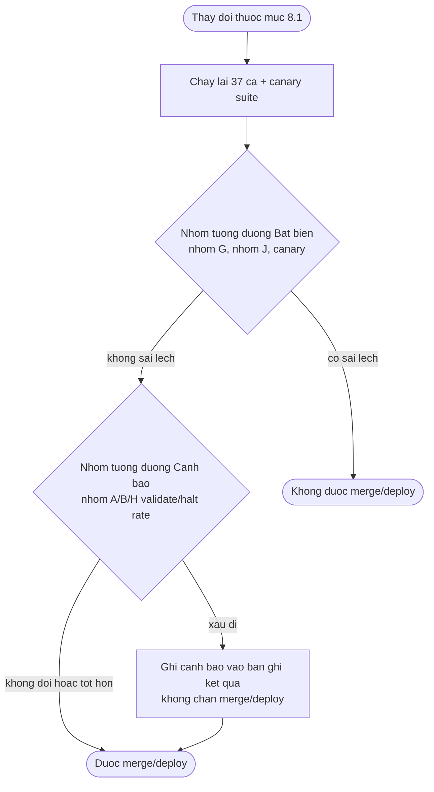

# Evaluation Framework — Admin Service Desk Agent (BO-19)

**Phiên bản:** 0.1 · **Trạng thái:** Draft chờ duyệt

> File này chốt: bộ dữ liệu vàng (golden dataset) dùng để đo, metric cho từng chặng xử lý, cách chạy offline/online, rubric người chấm, phân loại lỗi (failure mode) và điều kiện được phép đổi prompt hoặc model. File này **không** định nghĩa lại nội dung hay phân bố 37 ca của bộ eval — nguồn duy nhất là mục Bộ eval chuẩn của `01-prd.md` (NFR-07). File này **không** thiết kế dashboard SLA hay ngưỡng cảnh báo vận hành (Phase 11), **không** chọn provider/model cụ thể (A-026, A-028, A-065), **không** viết prompt (Phase 7 đã chốt), **không** thiết kế bảng mã lý do dừng (Phase 8).

Tên entity, trạng thái, permission, agent, node, tool dùng đúng `GLOSSARY.md`. Quyết định `D-xxx`/`A-xxx` tham chiếu `00-domain.md` và `ASSUMPTIONS.md`. Không có entity, agent, node hay tool mới nào được đưa ra ở phase này — mọi tên dùng lại nguyên trạng, nên không có mục nào của `GLOSSARY.md` cần sửa.

**Đã đối chiếu:** `CLAUDE.md`, `_PLAN.md`, `GLOSSARY.md`, `ASSUMPTIONS.md`, `00-domain.md`, `01-prd.md`, `02-architecture.md`, `03-agents.md`, `04-data.md`, `05-api.md`, `06-structure.md`, `07-prompts.md`, `08-hitl.md`, `09-security.md`, `decisions/ADR-001` → `ADR-021`.

---

## 1. Phạm vi và nguyên tắc

### 1.1 Quan hệ với NFR-07

`01-prd.md` đã chốt: nội dung, phân bố cố định (37 ca, nhóm A–J), cách dẫn xuất (bảng edge case của `00-domain.md` cộng ba định nghĩa vận hành ở F1/F2), và người duyệt đáp án chuẩn (Trưởng phòng Hành chính, A-023). Phase 10 **không lặp lại** bảng đó. Việc của phase này là: biến 37 ca đó thành thứ **chạy được** (input hội thoại cụ thể, trạng thái hệ thống giả định, đáp án chuẩn ở dạng máy đọc được), định nghĩa **ai/cái gì chấm mỗi ca**, và nối kết quả tới các metric M1–M8.

### 1.2 Phạm vi ngoài 37 ca

Ba việc PRD không phủ, vì lý do khác nhau, thuộc về Phase 10:

1. **Canary suite** — kiểm hạ tầng (checkpoint không chứa PII), không kiểm hành vi nghiệp vụ. Giao cho Phase 10 ở mục Checkpointer và PII của `03-agents.md`.
2. **Phương pháp recall@k** — NFR-07 dùng kho quy trình *giả lập* cho nhóm J vì kho thật chưa tồn tại (A-027); đó là 5 ca hội thoại, không phải một bộ đo retrieval. A-028 giao Phase 10 tiêu chí chọn embedding model bằng recall@k trên "bộ eval của chính dự án" — cần một bộ đo riêng, tách khỏi 37 ca.
3. **Phương pháp so tier rẻ/mạnh** — `04-data.md` mục 3.8 (định nghĩa `llm_usage`) để ngỏ câu "có hạ tier được không là câu hỏi của Phase 10", và mục Agent Registry của `03-agents.md` nhắc lại đúng câu đó cho `drafting_agent`.

Cả ba việc trên đều dừng ở **phương pháp**, không ra **kết quả** — xem lý do ở mục 9.

### 1.3 Nguyên tắc kế thừa

| # | Nguyên tắc | Vì sao |
|---|---|---|
| 1 | Đáp án chuẩn của 37 ca chỉ Trưởng phòng Hành chính đổi được | A-023 đã giao; Phase 10 không có thẩm quyền diễn giải lại nghiệp vụ |
| 2 | Không đặt ngưỡng số chưa có căn cứ | Mục 4 của `CLAUDE.md` — cấm bịa số liệu; số nào chưa có nguồn thì `TBD` + `ASSUMPTIONS.md` |
| 3 | Metric loại Bất biến (M4, M5, M6, M8) vẫn là ngưỡng tuyệt đối ở mọi phiên bản | `01-prd.md` mục 2 — không có phiên bản nào được "nợ" một ca sai |
| 4 | Metric loại Cảnh báo không chặn deploy | Cùng triết lý PRD; xem mục 8 |
| 5 | Không chọn provider/model ở phase này | A-026 chưa chọn; chọn trước khi có phương tiện đo thật là bịa kết quả |

---

## 2. Golden dataset

### 2.1 Bộ eval hành vi — 37 ca

**Nguồn:** mục Bộ eval chuẩn của `01-prd.md` (NFR-07). **Kích thước:** 37, chia 10 nhóm A–J theo đúng bảng đó. **Gán nhãn:** đáp án chuẩn do Trưởng phòng Hành chính duyệt (A-023, trạng thái `Mở`, hạn "Trước UAT"). **Phase 10 không đổi số ca, không đổi nhóm.**

Việc còn thiếu để 37 ca chạy được: mỗi ca trong NFR-07 chỉ có "cách dẫn xuất" — một câu văn xuôi. Phase 10 thêm cho mỗi ca bốn phần, theo schema `EvalCase` ở mục 10:

1. **Hội thoại giả lập** — chuỗi lượt chat (giả), viết bằng tiếng Việt, đánh dấu rõ là dữ liệu giả (cùng quy ước few-shot của `07-prompts.md`).
2. **Trạng thái hệ thống trước khi chạy** — ví dụ: hồ sơ `employee` giả cho nhóm B (thử việc, đã nghỉ việc), một `request` `EXPIRED` giả cho nhóm D/I, một phiên bản `template` giả thiếu biến cho một số ca nhóm H.
3. **Đáp án chuẩn ở dạng máy đọc được** — mã `intent`, danh sách slot kỳ vọng, mã lỗi kỳ vọng của `review_readiness_check`, hoặc câu trích dẫn nguyên văn kỳ vọng — không phải mô tả văn xuôi.
4. **Nhóm và metric liên kết** — tra ở bảng mục 3.

**Ai viết bốn phần trên:** người triển khai soạn dựa trên câu dẫn xuất của NFR-07; **Trưởng phòng Hành chính duyệt đáp án chuẩn ở phần 3** — đúng người, đúng việc đã giao ở A-023, chỉ khác là bây giờ duyệt ở dạng cụ thể hơn văn xuôi.

**Hai ca cố ý không có trong 37 ca** — EC-SR-01 và EC-SR-05 — giữ nguyên như NFR-07 đã quyết: kiểm bằng M4 và test permission, không bằng bộ eval hành vi.

### 2.2 Canary suite — kiểm hạ tầng, tách khỏi bộ eval hành vi

Hai ca, nguồn ở mục Checkpointer và PII của `03-agents.md`. **Không thuộc 37 ca** vì chúng không chấm hành vi nghiệp vụ đúng/sai — chúng chấm việc PII có rời khỏi ranh giới đã vẽ hay không.

| Canary | Kịch bản | Điều kiện đạt | Đóng giả định nào |
|---|---|---|---|
| C1 — hội thoại | Chạy một hội thoại chứa giá trị `RES` đánh dấu (không phải dữ liệu thật), cho `request` gắn với hội thoại đó `EXPIRED` | Quét toàn bộ bảng checkpoint của LangGraph — **không tìm thấy** giá trị đánh dấu | Lớp 3 của mục Checkpointer và PII, `03-agents.md` |
| C2 — exception | Ép một node ném exception mà thông điệp mang giá trị `RES` đánh dấu | Quét `checkpoint_writes` và mọi bảng checkpoint khác — **không tìm thấy** giá trị đánh dấu | Vế còn lại của A-045 ("exception được tuần tự hoá thế nào") |

Canary không có "đáp án chuẩn cần người duyệt" — tiêu chí đạt là nhị phân, kiểm bằng máy (quét chuỗi). Chạy canary không thay thế 37 ca, và 37 ca không thay thế canary: một hội thoại chạy đúng về nghiệp vụ không bao giờ ném exception mang giá trị, nên C2 không được bao phủ bởi bất kỳ ca nào trong 37 ca (đúng như mục 6.5 của `03-agents.md` đã nói).

### 2.3 Bộ đo retrieval (recall@k) — phương pháp, chưa có dữ liệu để chạy thật

**Tại sao tách khỏi nhóm J.** Nhóm J (5 ca) là ca **hội thoại** — chấm việc agent có báo đúng "đủ căn cứ"/"không đủ căn cứ" hay không (định nghĩa ở F1). recall@k đo một thứ khác: trong số các đoạn *đúng* cho một câu hỏi, `procedure_retrieval` có đưa được chúng vào top-k trước khi `select_procedure_passages` chọn hay không. Hai phép đo khác đơn vị: nhóm J đếm theo *ca*, recall@k đếm theo *câu hỏi × đoạn*. Dùng 5 ca hội thoại để tính recall@k sẽ là một con số không có ý nghĩa thống kê.

**Phương pháp** (áp dụng khi có dữ liệu, xem giới hạn dưới đây):

- Đơn vị đo: một câu hỏi (`retrieval_query` giả lập) gắn với tập id `procedure_chunk` được coi là *đúng* cho câu hỏi đó — id lấy theo đơn vị trích dẫn ở mục Chunk strategy của `03-agents.md`.
- `recall@k` cho một câu hỏi = 1 nếu tập top-k trả về bởi `procedure_retrieval` (**trước** khi `select_procedure_passages` lọc) chứa mọi id đúng đã gán, ngược lại 0. `recall@k` của bộ đo = trung bình trên toàn bộ câu hỏi.
- So sánh model: cùng một bộ câu hỏi, cùng `k` (giá trị `top_k` theo A-031), chạy qua từng ứng viên ở A-028, chọn `recall@k` cao nhất — **không** theo hai benchmark ngoài (ViRE, VN-MTEB) đã ghi ở A-028; hai benchmark đó chỉ cắt danh sách ứng viên trước khi đo, không dùng để kết luận.

**Giới hạn phải nói thẳng:** phương pháp trên **không chạy được với dữ liệu thật** ở Sprint đầu, vì hai lẽ:

1. Kho `procedure_document` chưa tồn tại (A-027) — không có đoạn nào để gán "đúng".
2. Chưa có số liệu vận hành để biết nhân viên thật sẽ hỏi gì (A-002) — một bộ câu hỏi tự nghĩ ra không đại diện cho phân phối câu hỏi thật.

Bộ đo trên **được phép chạy trên kho giả lập của nhóm J** — nhưng chỉ để **kiểm harness hoạt động đúng** (đường ống tính `recall@k` không lỗi cú pháp, không lệch chỉ số), **không** dùng kết quả đó để chọn model thật. Ghi rõ trong mọi báo cáo chạy trên kho giả lập: *"Kết quả trên dữ liệu giả — không dùng để quyết định."*

**Ai gán "đoạn nào đúng cho câu hỏi nào" khi có kho thật:** chưa quyết — xem A-064.

---

## 3. Metric theo từng chặng

Cột *Chấm bằng* dùng hai giá trị: **Máy** (so khớp cấu trúc/enum với đáp án, không cần đọc hiểu tiếng Việt) và **Người** (đọc nội dung, cần Trưởng phòng Hành chính hoặc người có nghiệp vụ tương đương).

| Chặng / lời gọi | Metric | Tiêu chí | Nguồn đo | Liên kết `01-prd.md` | Chấm bằng |
|---|---|---|---|---|---|
| `classify_intent` | Phân loại đúng `request_type`, nhóm G | Đúng/sai theo đáp án chuẩn nhóm G | Offline eval | **M8** (bất biến, 0 ca sai) | Máy |
| `classify_intent` | Phân loại đúng, ngoài nhóm G | Đúng/sai theo đáp án chuẩn nhóm A–F, I | Offline eval | **M1** (cảnh báo) | Máy |
| `extract_slots` | Tỷ lệ `EVIDENCE_MISMATCH`, thiếu/dư slot | So tập slot trích được với đáp án nhóm C, D | Offline eval | Không map M riêng — góp vào tiêu chí "đủ điều kiện xử lý" tổng của F1 | Máy |
| `select_procedure_passages` + hiển thị | Báo đúng "đủ căn cứ"/"không đủ căn cứ" | Theo định nghĩa "Hướng xử lý thủ công đủ căn cứ" của F1 | Offline eval nhóm J | **M6** (bất biến) | Máy chấm cấu trúc câu trả lời (có/không trích nguồn) · Người chấm đoạn trích có đúng nguyên văn, đúng phiên bản hiệu lực |
| `procedure_retrieval` (kênh riêng) | `recall@k` | Mục 2.3 | Bộ đo retrieval riêng — **chưa chạy được với dữ liệu thật** | Không map M — phục vụ A-028 | Máy |
| `draft_free_content` / `revise_free_content` | Tỷ lệ trượt `validate_free_content`, tỷ lệ vào `halt_for_human` do `VALIDATION_FAILED`/`PARSE_FAILED` | Đếm trên nhóm A, B, H | Offline eval | Không map M riêng — góp vào taxonomy mục 7 | Máy |
| `review_readiness_check` | Đạt/không đạt, theo mã lỗi (`VARIABLE_MISSING`, `PLACEHOLDER_VALUE`, `WRONG_SOURCE`, `FRAME_TEXT_IN_VARIABLE`, `SEAL_UNDETERMINED`) | Theo định nghĩa "Văn bản đủ điều kiện trình duyệt" của F2 | Offline eval nhóm H | Điều kiện cần của **M4** | Máy |
| Vòng duyệt tại `PENDING_APPROVAL`/`PENDING_SIGNATURE` | Tỷ lệ `document` quay lại `CHANGES_REQUESTED` trước khi được duyệt | UAT: tử số/mẫu số ghi nhận trực tiếp. Production: `COUNT(decision_record.kind IN ('CHANGES_REQUESTED'))` / `COUNT(document đã SUBMITTED)` trong kỳ | UAT (quan sát) · Production (`decision_record`, `document`) | **M2** (cảnh báo) | Người (UAT) · Máy (production, truy vấn) |
| Toàn cuộc hội thoại | Số người không hoàn tất được `SUBMITTED` mà không cần trợ giúp ngoài hệ thống | Ghi nhận trực tiếp tại buổi UAT | UAT | **M3** (cảnh báo) | Người |
| Hệ thống thực nhận (sau milestone sản xuất) | Tỷ lệ yêu cầu vào qua hệ thống trên tổng yêu cầu phòng hành chính thực nhận | `TBD` — cần số liệu ngoài hệ thống (A-002) | Phỏng vấn/đếm ngoài hệ thống | **M7** | Người |
| `intake_graph`, node `ask_clarification` | Tỷ lệ hội thoại chạm trần hỏi lại (A-031) rồi chuyển khuôn "liên hệ trực tiếp" | Đếm `chat_message` mang mã khuôn đó / tổng hội thoại | Production | Không map M — tín hiệu escalation tầng tiếp nhận | Máy |
| `document_graph`, `halt_for_human` | Tỷ lệ `document` rơi vào `halt_for_human`, theo `reason_code` | `COUNT(document_halt)` / `COUNT(document SUBMITTED)` trong kỳ, tách theo mã | Production (`document_halt`) | Không map M — tín hiệu escalation tầng soạn/duyệt | Máy |
| `request` mỗi kỳ | Chi phí mỗi `request` | `SUM(llm_usage.token)` `GROUP BY request_id`, loại trừ `outcome IN ('BUDGET_UNAVAILABLE', 'ALLOWLIST_REJECTED')` — hai mã này không gọi provider, không tốn tiền thật | `llm_usage` | Nguồn cho NFR-06; ngưỡng cảnh báo định cỡ ở Phase 11 | Máy |
| Một lượt chat (`intake_graph`), một vòng `document_graph` | Độ trễ | Thời lượng từ node đầu tới node cuối của một lượt/một vòng, theo `trace_id` | Offline eval (mỗi ca golden đo kèm latency) và production (`observability`) | NFR-08 — không đặt ngưỡng ở Sprint đầu | Máy |

**Ghi chú công thức chi phí.** Đơn vị chi phí đúng theo ADR-009 là **một lời gọi LLM sinh một biến**, không phải "một lần render". Cận trên lý thuyết cho một `document` là `(1 + R) × V × 2 × 2` (mục 9.3 của `03-agents.md`, A-022). Offline eval nên đối chiếu số lời gọi thật của mỗi ca với cận trên này: một ca vượt cận trên mà không phải do `R` hay `V` khác dự kiến là **lỗi lập trình** (ví dụ vòng lặp không thoát đúng điều kiện), không phải chi phí hợp lệ — đây là một dạng kiểm tra hồi quy miễn phí đi kèm mỗi lần chạy offline eval.

---

## 4. Offline eval

### 4.1 Cách chạy

Mỗi ca trong 37 ca (mục 2.1) được đưa qua đúng graph mà nó kiểm:

- Nhóm A–G, I: chỉ `intake_graph` (không cần `document` render).
- Nhóm H: `intake_graph` tới `SUBMITTED`, rồi `document_graph` tới `check_review_readiness` — nhóm này kiểm F2, cần bản render thật tồn tại.
- Nhóm J: `intake_graph`, nhánh ngoài phạm vi (`embed_query` → `procedure_retrieval` → `select_procedure_passages`), chạy trên kho giả lập.

Canary suite (mục 2.2) chạy **riêng**, không lẫn vào 37 ca — vì tiêu chí đạt khác loại (quét PII, không so đáp án nghiệp vụ).

### 4.2 Bản ghi kết quả và baseline

Mỗi lần chạy gắn với: phiên bản `prompt_module_version` của mọi prompt module liên quan (`07-prompts.md` mục 7), tier/provider model nếu đã chọn (A-026), phiên bản template dùng để render (nhóm H), commit mã nguồn. Đây là artefact vận hành của việc build/CI, **không** là bảng nghiệp vụ trong `contracts/schema.sql` — nơi lưu và định dạng file cụ thể thuộc Phase 11/người triển khai.

**Baseline là kết quả chạy gần nhất được coi là "đúng như mong đợi".** Kỹ thuật (Phase 11/người triển khai) tự chốt baseline mới sau một thay đổi cải thiện có chủ đích, **miễn đáp án chuẩn không đổi** — đáp án chuẩn (nội dung 37 ca, mục 2.1) chỉ Trưởng phòng Hành chính đổi được (A-023). Hai việc này phải tách: đổi baseline (kỹ thuật tự làm) khác đổi đáp án chuẩn (cần duyệt lại theo nghiệp vụ) — lẫn hai việc là tự cho phép sửa đáp án qua đường kỹ thuật.

---

## 5. Online eval

| Giai đoạn | Nguồn | Metric | Ai đọc kết quả |
|---|---|---|---|
| UAT (trước milestone sản xuất) | Quan sát trực tiếp buổi UAT | M1, M2, M3 | PO + Trưởng phòng Hành chính (A-020 chốt số người/số ca) |
| Production (sau khi A-018 đóng, D-009) | `decision_record`, `document`, `document_halt`, `llm_usage`, ngoài hệ thống (M7) | M2 thật, M7, tỷ lệ halt, tỷ lệ tự duyệt | Hiển thị ở dashboard thuộc Phase 11 — Phase 10 chỉ định nghĩa câu truy vấn/công thức ở mục 3 |

Phase 10 **không** chốt ba con số của buổi UAT (số người, số ca, ai chấm) — đó là A-020, chưa đóng, owner PO + Trưởng phòng Hành chính, hạn "Trước grooming F1".

---

## 6. Human eval rubric

Người chấm duy nhất cho nội dung nghiệp vụ: **Trưởng phòng Hành chính** (A-023). Rubric dưới đây không tạo tiêu chí mới — nó chỉ trỏ mỗi nhóm về đúng một trong ba định nghĩa đã chốt ở PRD, để người chấm không phải tự suy diễn "đạt" nghĩa là gì.

| Nhóm | Chấm gì | Theo định nghĩa nào | PASS khi |
|---|---|---|---|
| A, B | `intent` đúng, slot đúng, không hỏi thừa | "Yêu cầu đủ điều kiện xử lý" (F1) | Mọi điều kiện 1–4 của định nghĩa đó đạt |
| C | Agent hỏi đúng đúng slot còn thiếu, không suy diễn | Mục "Bị coi là KHÔNG đủ điều kiện xử lý" (F1) | Không rơi vào bất kỳ ca liệt kê ở đó |
| D | Agent không tự lấp giá trị chưa xác nhận | Như C | Như C |
| E | Agent nhận ra không đủ điều kiện theo quy chế, không tự quyết thay người duyệt | F1 + rule kiểm tra slot ở `00-domain.md` | Agent chuyển đúng, không cho `SUBMITTED` |
| F | Agent nhận ra ngoài phạm vi, không ép vào loại gần giống | AC đầu của F1 | Không gán `request_type` nào cho ca này |
| **G** | Hai tiêu chí **tách rời** (theo đúng NFR-07): phân loại đúng · không mang slot cũ sang | AC F1 (EC-CV-01, EC-CV-02, EC-CV-03) | **Cả hai** tiêu chí đạt — đạt một, trượt một vẫn là **TRƯỢT** |
| H | `document` không vào `PENDING_APPROVAL` khi còn trượt điều kiện | "Văn bản đủ điều kiện trình duyệt" (F2) | Không rơi vào bất kỳ ca "Bị coi là KHÔNG đủ điều kiện trình duyệt" |
| I | Agent khôi phục hoặc báo đúng trạng thái sau gián đoạn | AC "Quay lại sau gián đoạn" của F1 | Không âm thầm dùng dữ liệu đã hết hạn |
| J | Câu trả lời đủ căn cứ hoặc nói rõ không có căn cứ | "Hướng xử lý thủ công đủ căn cứ" (F1) | Không rơi vào bất kỳ ca "Bị coi là KHÔNG đủ căn cứ" |

**Với văn phong nội dung tự do (biến `purpose_statement`, `work_content_statement`):** `review_readiness_check` chỉ kiểm **cấu trúc** (có giá trị, không placeholder, không tràn khung) — không kiểm văn phong có hợp lý hay không. Với nhóm A, B, H, người chấm còn phải đọc `body` được sinh ra và đánh giá **có thể dùng để trình cán bộ hành chính** hay không (không phải "hoàn hảo", mà "không phải sửa lại hoàn toàn"). Đây là chỗ Phase 10 trả lời được ở mức tiêu chí, còn con số ngưỡng chấp nhận là bao nhiêu phần trăm câu tốt thì chưa có căn cứ (A-002) — không đặt số.

---

## 7. Taxonomy failure mode

Không tạo mã lỗi mới. Mục này chỉ **xếp lại** các mã đã tồn tại rải rác ở ba tầng, để biết ca nào của 37 ca + canary phủ được mã nào, và mã nào chỉ quan sát được ở production.

| Tầng | Mã | Nguồn | Bộ eval nào phủ được |
|---|---|---|---|
| Tool (`tool_layer`) | `EVIDENCE_MISMATCH`, `RULE_FAILED`, `NOT_EDITABLE`, `SLOT_NOT_ALLOWED`, `TYPE_NOT_SUPPORTED` | Mục Tool Registry của `03-agents.md` | Nhóm C, D, G |
| Tool (`tool_layer`) | `VARIABLE_MISSING`, `PLACEHOLDER_VALUE`, `WRONG_SOURCE`, `FRAME_TEXT_IN_VARIABLE`, `SEAL_UNDETERMINED`, `TEMPLATE_NOT_ACTIVE_AT_RENDER` | `review_readiness_check`, mục Tool Registry của `03-agents.md` | Nhóm H |
| Tool (`tool_layer`, hạ tầng file) | `RENDER_CHECKSUM_MISMATCH`, `RENDER_OBJECT_MISSING`, `FONT_MISSING`, `CONVERSION_FAILED`, `MISSING_VARIABLE`, `UNKNOWN_VARIABLE` | `render_integrity_check`, `docx_render`, `pdf_export` | **Không phủ được bằng offline eval** — cần môi trường render thật (image, font, `object_storage`). Canary hoặc kiểm thủ công |
| Tool (`tool_layer`, duyệt) | `NO_ELIGIBLE_SIGNER`, `NO_ISSUE_ORDER` | `signing_route`, `document_number_assign` | Không thuộc phạm vi 37 ca (chấm bằng M4 + test permission, giống EC-SR-01/05) |
| `ai_gateway` (`llm_usage.outcome`) | `OK`, `PARSE_REPAIRED`, `PARSE_FAILED`, `PROVIDER_ERROR` | ADR-019 | `PARSE_REPAIRED`/`PARSE_FAILED` giả lập được offline (ép JSON hỏng có chủ đích); `PROVIDER_ERROR` thật **cần provider thật** — offline chỉ giả lập được hình dạng lỗi, không giả lập được tần suất thật |
| `ai_gateway` (`llm_usage.outcome`) | `BUDGET_EXCEEDED`, `BUDGET_UNAVAILABLE`, `ALLOWLIST_REJECTED` | ADR-019 | Giả lập được offline bằng cách đặt trần thấp có chủ đích cho ca kiểm thử — không dùng để đo tỷ lệ thật |
| Dừng có kiểm soát (`document_halt.reason_code`) | `VALIDATION_FAILED`, `PARSE_FAILED`, `BUDGET_EXCEEDED`, `MAX_ROUNDS_EXCEEDED`, `RENDER_CHECKSUM_MISMATCH`, `FONT_MISSING` | Mục 9.2–9.3 của `08-hitl.md` | Tổng hợp từ hai tầng trên — không phải mã gốc |

**Đọc bảng này để biết gì.** Một tấm lưới đủ dày để nói: mọi mã lỗi ở tầng tool và tầng duyệt nghiệp vụ đều nằm dưới một ca của 37 ca hoặc một test permission đã có nơi ở (M4). Lỗ hở thật duy nhất là tầng **hạ tầng render** và **provider thật** — hai thứ 37 ca không giả lập trung thực được, vì chúng phụ thuộc môi trường (`object_storage`, font, provider) mà môi trường đó chưa tồn tại ở giai đoạn thiết kế. Đây không phải lỗ hở của bộ eval — nó là giới hạn thật của việc kiểm tra offline, và phải được kiểm bằng cách khác (canary tầng hạ tầng, hoặc kiểm thủ công khi triển khai) — không thuộc phạm vi thiết kế của phase này.

**Bảng mã `notification.event_code` và `document_halt.reason_code` đầy đủ còn treo ở Phase 8** (mục 8 của `GLOSSARY.md`). Phase 10 dùng đúng các mã đã xuất hiện ở `08-hitl.md`, không bịa thêm mã mới.

---

## 8. Regression gate

### 8.1 Khi nào kích hoạt

Trước khi merge/deploy một thay đổi thuộc bất kỳ loại nào dưới đây:

- Đổi `prompt_module_version` (major hoặc minor) của bất kỳ prompt module nào (mục 7 của `07-prompts.md`).
- Đổi model/provider hoặc tier của `intake_agent`/`drafting_agent` (A-026, A-065).
- Đổi embedding model (A-028).
- Đổi phiên bản library `langgraph`/`langgraph-checkpoint-postgres`, hoặc sửa biên node của `orchestrator` (A-045).

### 8.2 Quy trình



1. Chạy lại toàn bộ 37 ca (mục 2.1) và canary suite (mục 2.2).
2. **Nhóm tương đương Bất biến** — mọi ca chấm bằng tiêu chí M8 (nhóm G) hay M6 (nhóm J), cộng canary C1/C2: **0 sai lệch** là điều kiện **hard**. Trượt một ca ở đây thì không được merge/deploy, không có ngoại lệ — đúng tinh thần "Bất biến là ngưỡng tuyệt đối" của `01-prd.md` mục 2.
3. **Nhóm tương đương Cảnh báo** — tỷ lệ trượt `validate_free_content`/`halt_for_human` ở nhóm A/B/H, và M1-proxy (phân loại sai ngoài nhóm G): xấu đi so với baseline chỉ **cảnh báo**, ghi vào bản ghi kết quả của lần chạy, **không chặn** merge/deploy. Đây là lựa chọn đã chốt: giữ đúng triết lý "Cảnh báo không phải cổng nghiệm thu" của PRD cho cả gate kỹ thuật, không riêng gì cổng nghiệm thu UAT.
4. Đáp án chuẩn (nội dung 37 ca) **không đổi** trong một lần gate. Nếu trong lúc chạy gate phát hiện một ca cũ có đáp án sai, đó là một thay đổi riêng, cần Trưởng phòng Hành chính duyệt lại và ghi `CHANGELOG.md` — không lẫn vào kết quả của lần gate đang chạy.

### 8.3 Ngưỡng "bao nhiêu là xấu đi đáng kể"

Chưa có căn cứ để đặt một con số cho nhóm Cảnh báo ở bước 3 — xem A-063. Vì bước này là **soft** (chỉ cảnh báo, không chặn), thiếu con số không chặn được việc gì; nhưng thiếu con số thì "cảnh báo" chỉ còn là hiển thị thô (mọi thay đổi số đều được liệt ra) chứ chưa phải một tín hiệu đã hiệu chỉnh. Cùng loại giới hạn với A-019 (ngưỡng metric Cảnh báo của PRD) — không đặt số vô căn cứ.

---

## 9. Hai câu hỏi mở — trả lời bằng phương pháp, không bằng kết quả

### 9.1 Hạ tier rẻ/mạnh cho `drafting_agent`

Câu hỏi từ mục 3.8 của `04-data.md` và mục Agent Registry của `03-agents.md`. **Phương pháp A/B:**

1. Chạy đúng các ca sinh biến nội dung tự do — nhóm A, B, H — qua **cả hai** tier (rẻ và mạnh), cùng một `variable_guidance`.
2. Chấm bằng rubric mục 6 (Người: Trưởng phòng Hành chính đọc `body` sinh ra, đánh giá dùng được hay phải sửa lại hoàn toàn) + đo chi phí/độ trễ theo mục 3.
3. **Tiêu chí quyết:** chỉ hạ tier khi **0 ca** trong nhóm này bị người chấm đánh giá tệ hơn tier mạnh. Có ít nhất một ca tệ hơn thì **không hạ** — dù chi phí thấp hơn, vì văn bản sai vẫn là RISK-01 (thể thức/nội dung sai), và M2 chỉ là metric Cảnh báo về chi phí duyệt lại, không đủ để đánh đổi một rủi ro Bất biến.

Phase 10 **không chọn** tier ở đây, vì A/B thật cần provider thật (A-026 chưa chọn). Giả định theo dõi: **A-065**.

### 9.2 Chọn embedding model theo recall@k

Phương pháp đã đặc tả đầy đủ ở mục 2.3. Tóm lại: khi có kho `procedure_document` thật (A-027 đóng) và một tập câu hỏi đại diện, lặp lại đúng phương pháp đó trên năm ứng viên đã liệt kê ở A-028, chọn model có `recall@k` cao nhất trên bộ câu hỏi thật — không theo hai benchmark ngoài. Phase 10 **không chọn** model ở đây vì chưa có dữ liệu để đo trung thực (mục 2.3, giới hạn đã nói thẳng).

---

## 10. `EvalCase` — schema khai báo

Contract cho một ca trong bộ eval hành vi (mục 2.1). Chỉ khai field và kiểu; không có thân xử lý — đúng phạm vi DESIGN MODE.

```json
{
  "$schema": "https://json-schema.org/draft/2020-12/schema",
  "title": "EvalCase",
  "type": "object",
  "additionalProperties": false,
  "properties": {
    "case_id": { "type": "string", "description": "Mã ca, ví dụ EC-WC-01 hoặc mã tự sinh trong nhóm" },
    "group": { "type": "string", "enum": ["A", "B", "C", "D", "E", "F", "G", "H", "I", "J"] },
    "derivation_source": {
      "type": "string",
      "enum": ["EDGE_CASE_00_DOMAIN", "F1_ELIGIBLE_TO_PROCESS", "F1_MANUAL_GROUNDED", "F2_APPROVAL_READY"]
    },
    "request_type": {
      "type": ["string", "null"],
      "enum": ["WORK_CONFIRMATION", "INTRODUCTION_LETTER", "ROOM_BOOKING", "SEAL_REQUEST", "INCOME_CONFIRMATION", "BUSINESS_TRIP_ORDER", null]
    },
    "conversation_turns": {
      "type": "array",
      "items": {
        "type": "object",
        "additionalProperties": false,
        "properties": {
          "author": { "type": "string", "enum": ["EMPLOYEE", "AGENT"] },
          "text": { "type": "string" }
        },
        "required": ["author", "text"]
      }
    },
    "preset_system_state": {
      "type": "object",
      "description": "Trạng thái hệ thống giả định trước khi chạy ca — employee giả, request EXPIRED giả, template giả, v.v. Nội dung cụ thể tự do theo ca, không chuẩn hoá ở đây vì mỗi nhóm cần một hình dạng khác nhau"
    },
    "expected_outcome": {
      "type": "object",
      "description": "Đáp án chuẩn ở dạng máy đọc được — mã intent, danh sách slot kỳ vọng, mã lỗi kỳ vọng, hoặc câu trích dẫn nguyên văn kỳ vọng, tuỳ nhóm"
    },
    "graded_by": { "type": "string", "enum": ["MACHINE", "HUMAN", "BOTH"] },
    "linked_metrics": {
      "type": "array",
      "items": { "type": "string", "enum": ["M1", "M2", "M3", "M4", "M6", "M8"] }
    },
    "answer_key_approved_by": { "type": ["string", "null"] },
    "answer_key_approved_at": { "type": ["string", "null"], "format": "date" },
    "is_fake_data": { "const": true, "description": "Luôn true — mọi EvalCase là dữ liệu giả, không phải hội thoại thật" }
  },
  "required": ["case_id", "group", "derivation_source", "conversation_turns", "expected_outcome", "graded_by", "is_fake_data"]
}
```

---

## 11. Ánh xạ sang thành phần kiến trúc

Bộ eval và canary suite chạy **bên ngoài** `orchestrator`/`ai_gateway`/`tool_layer` — chúng gọi vào các thành phần đó như một client giả lập (thay `api`/`queue_worker` gọi thật), không phải một agent hay node mới. Không thêm thành phần kiến trúc nào vào mục Thành phần kiến trúc hệ thống của `GLOSSARY.md`. Vị trí file thực thi (nơi đặt harness trong cây dự án) là việc của Phase 11/người triển khai — Phase 10 chỉ chốt nội dung và schema, không mở lại cấu trúc dự án đã chốt ở `06-structure.md`.

---

## Open Questions

Không có câu hỏi mở chỉ tồn tại trong file này. Ba giả định mới, và các giả định liên quan:

- **A-063** (mới) — ngưỡng "xấu đi đáng kể" cho nhóm Cảnh báo ở regression gate (mục 8.3): chưa có số.
- **A-064** (mới) — ai gán "đoạn nào đúng cho câu hỏi nào" của bộ đo recall@k khi có kho `procedure_document` thật (mục 2.3): chưa quyết.
- **A-065** (mới) — hạ tier rẻ/mạnh cho `drafting_agent` (mục 9.1): phương pháp đã có, kết quả chưa có vì cần provider thật.
- **A-028** — cập nhật ở phase này: phương pháp chọn model đã đặc tả (mục 2.3, 9.2), việc chọn vẫn `Mở` vì thiếu dữ liệu thật (A-027, A-002).
- **A-023** — đáp án chuẩn của 37 ca vẫn `Mở`, chưa có gì đổi; Phase 10 chỉ làm rõ đáp án chuẩn cần ở dạng máy đọc được.
- **A-045** — canary C2 (mục 2.2) là cách đóng vế còn lại của giả định này khi được chạy thật; tới lúc đó vẫn `Đã chốt — trừ vế tuần tự hoá exception`.

---

## Quyết định kiến trúc

Không có ADR mới. Ba quyết định của phase này (gate mềm cho Cảnh báo, kỹ thuật tự chốt baseline, chỉ đưa phương pháp cho hai câu hỏi mở A/B) là quyết định trực tiếp của Product Owner trong phiên làm việc này, không phải lựa chọn công nghệ — không thuộc phạm vi ADR theo mục 3 của `CLAUDE.md`. Thiết kế dựa trên ADR-007, ADR-008, ADR-009, ADR-019 đã chốt.
