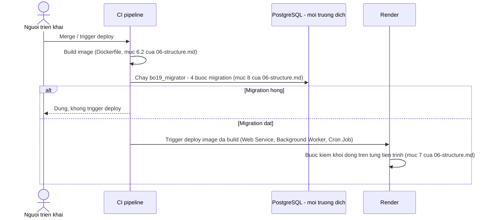

# Ops, Cost & Deployment — Admin Service Desk Agent (BO-19)

**Phiên bản:** 0.1 · **Trạng thái:** Draft chờ duyệt

> File này chốt vận hành trên Render: môi trường dev/staging/prod, cold start, worker nền, cron, migration, backup & restore, observability, dashboard SLA & tồn đọng, mô hình chi phí LLM, ngưỡng cảnh báo & cơ chế cắt chi phí, và định cỡ A-022. File này **không** thiết kế lại state machine, schema DB, endpoint API, hay `halt_for_human` — chỉ tham chiếu và bổ sung phần vận hành chưa phase nào chạm tới.

Tên entity, trạng thái, permission, agent, node, tool, component dùng đúng `GLOSSARY.md`. Quyết định `D-xxx`/`A-xxx` tham chiếu `00-domain.md` và `ASSUMPTIONS.md`.

**Đã đối chiếu:** `CLAUDE.md`, `_PLAN.md`, `GLOSSARY.md`, `ASSUMPTIONS.md`, `00-domain.md`, `01-prd.md`, `02-architecture.md`, `03-agents.md`, `04-data.md`, `05-api.md`, `06-structure.md`, `07-prompts.md`, `08-hitl.md`, `09-security.md`, `10-eval.md`, `decisions/ADR-001` → `ADR-021`.

---

## 1. Môi trường Render

### 1.1 Ba môi trường, một ánh xạ dịch vụ

Bảng ánh xạ đơn vị triển khai đã chốt ở mục Ánh xạ sang đơn vị triển khai trên Render của `02-architecture.md` (Web Service, Background Worker, Cron Job, PostgreSQL managed, dịch vụ ngoài Render) áp **nguyên vẹn** cho cả ba môi trường `dev`, `staging`, `prod` — mỗi môi trường là một bộ instance riêng của đúng năm đơn vị đó, không có đơn vị nào chỉ tồn tại ở một môi trường.

| Môi trường | Mục đích | PostgreSQL | `object_storage` | Ai truy cập |
|---|---|---|---|---|
| `dev` | Phát triển, chạy thử migration mới | Instance riêng, dữ liệu giả | Bucket/namespace riêng | Người triển khai |
| `staging` | UAT (A-020), diễn tập trước khi cân nhắc đổi `operating_mode` | Instance riêng | Bucket/namespace riêng | PO, Trưởng phòng Hành chính, người triển khai |
| `prod` | Vận hành thật | Instance riêng | Bucket/namespace riêng | Toàn bộ người dùng cuối |

Ba môi trường **không chia sẻ** database hay object storage — mỗi môi trường tự chạy migration riêng (mục 4). Không có "staging trỏ vào DB của prod" hay ngược lại.

### 1.2 `operating_mode` không phải môi trường deploy — và chính sách ràng buộc chúng

`operating_mode` (`NON_PRODUCTION`/`PRODUCTION`, D-009) và môi trường Render (`dev`/`staging`/`prod`) là **hai trục độc lập theo thiết kế** (ADR-020): cơ chế chuyển `operating_mode` là một endpoint có permission, chạy giống hệt nhau ở mọi môi trường; không dòng nào từ `00-domain.md` đến `09-security.md` buộc một môi trường Render cụ thể phải mang một `operating_mode` cụ thể. Một database mới luôn khởi đầu ở `NON_PRODUCTION` (mục 3.8 của `04-data.md`) — đúng ở cả ba môi trường.

**Quyết định vận hành của phase này** — đây là chính sách cấp quyền/seed data theo môi trường, không phải lựa chọn công nghệ nên không cần ADR: **`dev` và `staging` không bao giờ có ai được cấp `operating_mode.change`.** Dữ liệu seed permission (`backend/migrations/data/0001_permission_catalog.sql`, mục 3.2 của `09-security.md`) tồn tại giống nhau ở mọi môi trường, nhưng thao tác **gán** permission đó cho một `employee_role` là một thao tác vận hành riêng theo môi trường, ngoài mọi migration đóng, và chỉ được thực hiện ở `prod`. Lý do: chừng nào A-018 còn ở trạng thái "không có ai nghiệm thu thể thức" (mở vĩnh viễn theo thiết kế), không môi trường nào ngoài `prod` thật sự cần phát hành văn bản thật; giữ `dev`/`staging` ở `NON_PRODUCTION` loại trừ khả năng một buổi UAT hay một lần thử migration vô tình tạo ra một văn bản mang dải số `OFFICIAL`.

**Residual risk, nói thẳng:** đây là ràng buộc bằng **quy trình cấp quyền**, không phải ràng buộc bằng schema hay code — không có `CHECK` nào trong DB ngăn một người vận hành gán `operating_mode.change` cho ai đó ở `staging`. Rủi ro được chấp nhận, cùng khuôn với cách A-033/A-018 đã dựa vào cam kết vận hành thay vì kiểm tự động. Khoá cứng bằng code (ví dụ biến môi trường chặn thẳng ở `tool_layer`) là một quyết định kiến trúc mới, cần ADR — không làm ở đây.

### 1.3 Biến môi trường theo môi trường

Bảng secret đã chốt ở mục Secret management trên Render của `09-security.md` áp dụng, nhân theo ba lần — mỗi môi trường có **giá trị riêng** cho mọi secret trong bảng đó (session secret, credential `bo19_app`, provider key, S3 credential). Không chia sẻ giá trị secret giữa các môi trường, kể cả giữa `staging` và `prod` — chia sẻ session secret giữa hai môi trường nghĩa là một token ký ở `staging` dùng được ở `prod`. Biến môi trường không phải secret (múi giờ tổ chức A-041, tên bucket, tên collection embedding hiện hành) cũng khai riêng theo môi trường, cùng cơ chế.

---

## 2. Cold start, khởi động và tắt tiến trình êm

Không thiết kế lại — tham chiếu nguyên vẹn:

- Đặc tả `Dockerfile` và lý do một image chung cho mọi tiến trình: mục Đặc tả `Dockerfile` của `06-structure.md`, ADR-015.
- Bảng 15 bước kiểm khởi động (Blocking/Cảnh báo theo từng tiến trình): mục Bước kiểm khởi động của `06-structure.md`.
- Trình tự tắt êm theo `SIGTERM`/`SIGKILL` của từng tiến trình: mục Tắt tiến trình êm của `06-structure.md`, ADR-016.

**Phần Phase 11 sở hữu — chỗ quan sát, không phải cơ chế mới:** cold start của `api` sau khi thêm LibreOffice vào image, đặt cạnh kích thước image, là một dòng của bảng chỗ quan sát ở `_PLAN.md` (hàng ADR-015). Ngưỡng "chấp nhận được" chưa có số — để trống theo đúng chỉ dẫn của `_PLAN.md`, đo được rồi mới đặt.

---

## 3. Background worker & Cron — vận hành job

### 3.1 Tái sử dụng, không thiết kế lại

Cột của bảng `job`, sáu `job_type`, cơ chế lease (`SELECT ... FOR UPDATE SKIP LOCKED`), và bảng index đã chốt ở mục Vận hành của `04-data.md`. Danh sách entrypoint tiến trình (`worker_main`, `cron_main <thao tác>`) đã chốt ở mục Entrypoint và deploy trên Render của `06-structure.md`. Phase 11 không đổi cột nào, không thêm `job_type` nào.

### 3.2 Retry, backoff và job lỗi vĩnh viễn — đất trống, thiết kế ở đây

Không phase nào trước đã quyết cơ chế backoff cụ thể hay điều gì xảy ra khi một job chạm `max_attempts`. `run_after` (đã có trong DDL) là chỗ cắm backoff; giá trị cụ thể thuộc A-031.

**Backoff — đề xuất, nhãn "chưa hiệu chỉnh":** exponential, `run_after = now() + base × 2^attempts` giây.

| `job_type` | `max_attempts` đề xuất | `base` đề xuất | Lý do chọn nhóm |
|---|---|---|---|
| `render_document`, `resume_document_graph`, `finalize_issue` | 5 | 10s | Trên đường vào `halt_for_human` — cần đủ lượt để vượt qua lỗi tạm thời của provider/`object_storage` trước khi phiền một người thật |
| `checkpoint_purge`, `notification_send` | 5 | 10s | Không trên đường tới cổng HITL, nhưng ảnh hưởng nghĩa vụ xoá PII (`checkpoint_purge`) hoặc trải nghiệm (`notification_send`) |
| `procedure_ingest` | 3 | 30s | Chạy nền, không ai chờ đồng bộ; ít nhạy thời gian hơn |

**Job lỗi vĩnh viễn (`attempts = max_attempts`, `status = FAILED`) — thiết kế mới của phase này, theo `job_type`:**

| Nhóm | Khi `FAILED` vĩnh viễn | Vì sao |
|---|---|---|
| `render_document`, `resume_document_graph`, `finalize_issue` | Enqueue một job `notification_send` riêng, đường mã hoá cứng không qua hàng đợi thường, báo cho người mang `document.approve_content`/`document.apply_seal` liên quan; `document` hiện cờ `job_failed` trên hàng đợi duyệt (mục 7) | `document` không được phép mồ côi mà không ai biết — cùng tinh thần NFR-06 nhưng cho lỗi hạ tầng, không chỉ lỗi trần token. **Khác `halt_for_human`:** `halt_for_human` là graph tự dừng ở một node còn biết lý do nghiệp vụ; job `FAILED` vĩnh viễn là hạ tầng không chạy được job, graph chưa kịp tới node nào |
| `checkpoint_purge` | Ghi metric + alert `observability` (mục 6), không tự tạo job thông báo mới | Nghĩa vụ xoá PII trễ, không phải một `document` treo — xử lý bằng cảnh báo kỹ thuật |
| `notification_send` | Ghi metric + alert `observability`, không tự enqueue lại `notification_send` khác | Tránh vòng lặp job thông báo báo lỗi của chính job thông báo |
| `procedure_ingest` | Ghi metric + alert `observability` | Không nằm trên đường tới cổng HITL nào |

Job `FAILED` vĩnh viễn **không tự động retry** — một người xem alert rồi enqueue lại thủ công (thao tác vận hành, ngoài `tool_layer`, cùng khuôn với các thao tác vận hành khác đã có) sau khi đã sửa nguyên nhân.

### 3.3 Cron

Danh sách `cron_main <thao tác>` — `expire_request`, `object_claim_reconcile` (Sprint đầu); `[Should]` quét SLA, nhả `HELD`, hoàn tất `room_booking` — đã chốt ở `06-structure.md`. Bổ sung của phase này: **dọn `rate_limit_window`** (mục Dọn cửa sổ hết hạn của `09-security.md`) chạy như một thao tác `cron_main` mới. Tần suất và số cửa sổ giữ lại trước khi dọn: `TBD`, gộp vào A-031 (đã ghi ở `09-security.md`).

---

## 4. Migration

### 4.1 Ngữ cảnh chạy `migrate` — đóng A-060

**Quyết định: ADR-022 — chạy ở CI pipeline, trước khi trigger deploy Render.** Lập luận đầy đủ, phương án bị loại (Render one-off Job/Shell) và consequences ở `decisions/ADR-022-migrate-qua-ci-pipeline.md`.

Thứ tự bốn bước migration (extension → schema → `setup()` checkpointer → checkpointer grants → data) đã chốt ở mục Migration và checkpointer của `06-structure.md` — không đổi. ADR-022 chỉ trả lời **ai/ở đâu chạy** bốn bước đó.

### 4.2 Thứ tự trong một lần deploy



Migration chạy **trước** deploy, không song song — một migration hỏng thì không tiến trình runtime nào khởi động với schema mới chưa sẵn sàng. Bước kiểm khởi động #1 (mọi migration đã biết có mặt trong `schema_migration`, sha256 khớp) là lớp phòng thủ thứ hai nếu thứ tự này bị vi phạm bởi một thao tác thủ công.

### 4.3 `tools/contract-checks/`

Chạy ở chế độ `--app-dsn` như một bước riêng trong CI, **sau** migration, **trước** khi trigger deploy — dùng đúng công cụ đã có từ Phase 6 (mục Chạy lại của `06-structure.md`), không viết lại. Trượt thì dừng CI, không trigger deploy — cùng mức nghiêm trọng với migration hỏng.

---

## 5. Backup & Restore

Đất trống hoàn toàn trước phase này — không file nào từ Phase 0 đến Phase 10 nhắc tới sao lưu, khôi phục hay retention ngoài thời hạn xoá PII (A-010) và dọn bản render trung gian (mục Dọn bản trung gian của `04-data.md`). Thiết kế từ đầu, giữ nguyên tắc không bịa số của `CLAUDE.md`.

### 5.1 Nguyên tắc

- **`postgresql`:** dựa vào backup mặc định của PostgreSQL managed trên Render. Tần suất, retention và khả năng point-in-time recovery thật của dịch vụ này — `[CẦN XÁC MINH]` theo tài liệu Render, chưa có bản gốc trong `docs/reference/`. Không tự dựng thêm cơ chế `pg_dump` định kỳ song song — quyết định của phase này, lý do ở mục 5.3.
- **`object_storage`:** lớp bảo vệ chính là versioning/conditional-write của nhà cung cấp — đã là yêu cầu mua sắm bắt buộc ở A-024 (đóng ca ghi đè). Đây **không** phải backup theo nghĩa RPO/RTO: nó bảo vệ khỏi ghi đè giữa hai lần ghi tranh nhau, không bảo vệ khỏi xoá nhầm ở tầng tài khoản hay mất toàn bộ bucket.
- **Dữ liệu không được mất — nhắc lại ranh giới đã chốt, không thêm ranh giới mới:** `audit_event` (chỉ thêm), `document_register_entry` (số không tái sử dụng), bản render gắn với `document` ở `SEALED`/`ISSUED` (ghim — ADR-003, mục Lưu trữ file và bất biến bản render của `04-data.md`). Ba bất biến này đứng ở **tầng ứng dụng** (quyền DB, khoá ghi-một-lần). Backup là một **lớp khác**, bảo vệ khỏi việc cả tầng ứng dụng biến mất (hỏng đĩa, xoá nhầm database, sự cố nhà cung cấp) — không phải cơ chế thay thế cho các bất biến đó.

### 5.2 Residual risk — nói thẳng

Nếu Render managed PostgreSQL không cung cấp point-in-time recovery đủ mạnh (chưa xác minh), và nếu nhà cung cấp `object_storage` được chọn không có tính năng gì ngoài mức tối thiểu ở A-024 (đóng ca ghi đè, không phải backup toàn bucket), thì một sự cố ở tầng hạ tầng (xoá nhầm database qua console Render, tài khoản object storage bị khoá) có thể mất dữ liệu không phục hồi được — kể cả `audit_event` và bản văn bản đã `ISSUED`. Rủi ro thật, chấp nhận theo lựa chọn ở mục 5.3, không phải khoảng trống bị bỏ sót.

### 5.3 Quyết định phạm vi — không mở rộng ngoài managed backup

Không thiết kế thêm lớp `pg_dump`/export định kỳ độc lập ở Sprint đầu. Lý do: (1) tốn thêm dung lượng `object_storage` và một `job_type` mới chưa có trong Registry đã chốt (`04-data.md`) — thêm nó là sửa một phase đã đóng, cần lý do mạnh hơn "phòng xa"; (2) chưa có số liệu tải hay ngân sách (A-002) để định cỡ chi phí lưu trữ thêm; (3) đây là quyết định rẻ để đảo ngược — thêm cron `pg_dump` sau này không đụng gì đã có.

**Điều kiện xét lại:** ngay khi A-002 (số liệu tải) đóng, hoặc ngay khi xác minh được Render managed PostgreSQL **không** có PITR đủ mạnh (mục 5.1), quyết định này phải mở lại.

### 5.4 Diễn tập khôi phục

Ai chịu trách nhiệm và tần suất diễn tập khôi phục thử — `TBD`, thêm dòng mới trong `ASSUMPTIONS.md` (A-066).

---

## 6. Observability

### 6.1 Log schema

Log JSON có cấu trúc ra stdout (đã chốt ở mục `observability` của `02-architecture.md`), thu bởi log viewer của Render. Mọi dòng log mang tối thiểu: `trace_id` (xuyên `api` → `orchestrator` → `tool_layer` → `queue_worker`, cùng `trace_id` với `llm_usage.trace_id` — mục Vận hành của `04-data.md`), `component` (một trong mười tên ở mục Thành phần kiến trúc hệ thống của `GLOSSARY.md`), `level`, `message` đã qua handler mask duy nhất (bước kiểm khởi động #10, mục Bước kiểm khởi động của `06-structure.md`; quy tắc mask theo `slot_sensitivity` ở mục Mask trong log kỹ thuật của `09-security.md`).

**Khác `audit_event` — nhắc lại ranh giới đã chốt:** log kỹ thuật có thể xoay vòng/hết hạn theo retention kỹ thuật; `audit_event` không bao giờ. Retention của log kỹ thuật: `TBD`, thuộc chính sách của log viewer Render — `[CẦN XÁC MINH]`.

### 6.2 Metric taxonomy

| Nhóm | Ví dụ metric | Nguồn |
|---|---|---|
| Nghiệp vụ | Số `request`/`document` theo trạng thái và `request_type`; số `sla_breached`; tỷ lệ tự duyệt | `postgresql` (truy vấn định kỳ) |
| Chi phí | Token theo `request_type`, theo `outcome`; số lời gọi/`document` so với cận trên (mục 8) | `llm_usage` |
| Độ tin cậy | Tỷ lệ job `SUCCEEDED`/`FAILED` theo `job_type`; độ trễ dispatch (`started_at - enqueued_at`); độ trễ giành lease | `job` |
| Cổng & dừng | Tỷ lệ `document_halt` theo `reason_code`; thời lượng một lượt `IN_REVIEW`/`PENDING_SIGNATURE`/`PENDING_SEAL` | `document_halt`, `decision_record` |
| Bảo mật | Số lần `rate_limit` chặn; số `INVALID_CREDENTIALS` | `rate_limit_window`, log kỹ thuật |
| Hạ tầng | Cold start `api`; độ trễ `soffice`; độ trễ upload `object_storage` | `observability`, đo trực tiếp |

Công cụ APM/metric cụ thể — `TBD`, thuộc A-002 và mục `observability` của `02-architecture.md` (chưa đủ số liệu tải để biện minh công cụ trả phí). Cấu trúc metric ở trên **không phụ thuộc** công cụ cụ thể — bất kỳ công cụ nào chọn sau đều đọc từ cùng nguồn dữ liệu (`postgresql`, `llm_usage`, `job`, log JSON).

### 6.3 Chỗ quan sát cho điều kiện đảo ngược của ADR

Bảng đầy đủ đã chốt ở `_PLAN.md` (ADR-002, 004, 005, 011, 012, 013, 014, 015, 016) — **không lặp lại nội dung**, chỉ dẫn tới `_PLAN.md`. Mục này bổ sung **hai** chỗ quan sát chưa có mã ADR, phát hiện ở mục Resume sau nhiều giờ, nhiều ngày của `03-agents.md` — cả hai đã được gán "thuộc Phase 11" từ Phase 3 nhưng chưa có chỗ trong một bảng nào:

| Tín hiệu | Chỗ phải quan sát được |
|---|---|
| Bộ phát hiện thread kẹt dạng (1) — `document` ở trạng thái chờ mà thread không đứng ở `interrupt` tương ứng, và không có job resume nào đang chờ | Truy vấn định kỳ đối chiếu `document.status` với `graph_thread.waiting_at_node` và `job` đang `QUEUED`/`RUNNING` cho cùng `document_id`; đếm số ca lệch |
| Bộ phát hiện thread kẹt dạng (2) — thread đứng đúng `interrupt` nhưng `request` cha đã ở trạng thái kết thúc | Truy vấn định kỳ đối chiếu `graph_thread.status = WAITING` với trạng thái kết thúc của `request` cha; đếm số ca lệch — lưới an toàn, ca đã biết (`request_cancel`, A-035) đã có đường đánh thức riêng |

Cả hai chỉ cần **tồn tại** như metric, chưa cần ngưỡng — đúng nguyên tắc đã áp cho toàn bảng của `_PLAN.md`.

### 6.4 Alert — nguyên tắc, không bịa ngưỡng

Theo đúng phân loại Bất biến/Cảnh báo đã dùng ở mục Goals & metrics của `01-prd.md`: alert "cứng" (cần xử lý ngay) chỉ đặt trên điều kiện đã có định nghĩa tất định — job `FAILED` vĩnh viễn (mục 3.2), `document_halt` tăng đột biến, bước kiểm khởi động thất bại. Alert "mềm" (ngưỡng số, cần hiệu chỉnh) — ví dụ "chi phí/`request` xấu đi đáng kể" (A-063) — chưa có số, cùng lý do A-019 đã nêu cho PRD: chưa có dữ liệu thật để hiệu chỉnh. Đặt một con số vô căn cứ ở đây vi phạm đúng quy tắc cấm bịa số liệu của mục 4 trong `CLAUDE.md`.

---

## 7. Dashboard SLA & tồn đọng

Dành cho `ADMIN_OFFICER`. Composed từ dữ liệu **đã có endpoint** — không mở endpoint mới (ngoài phạm vi Ops/Cost/Deployment, thuộc Phase 5 đã đóng):

- **Theo `request_type` × trạng thái:** đếm từ danh sách `request` đã có filter (`05-api.md`), tổng hợp phía `client` hoặc bằng một câu truy vấn tổng hợp phía `api` nếu số dòng vượt mức phân trang hợp lý để tổng hợp phía client. **Đây là một gap thật:** `05-api.md` không có endpoint trả sẵn số đếm tổng hợp (aggregate count) theo nhóm; nếu tổng hợp phía client trên dữ liệu phân trang không đủ, cần một endpoint tổng hợp mới — **đề xuất cho một bản sửa của Phase 5, không tự thêm ở đây.**
- **Ba hàng đợi duyệt + hàng đợi phát hành:** tái dùng `GET /review-queue`, `GET /issue-queue` (mục Hàng đợi duyệt của `08-hitl.md`) — đã có cờ `halted`, `issue_in_progress` trên từng dòng.
- **Tự duyệt:** `GET /self-approvals` (D-006 điều kiện 4) — hiển thị riêng, đã chốt.
- **`sla_breached`:** cờ dẫn xuất từ `due_at` (chưa có giá trị — A-002); hiển thị được về mặt cấu trúc ngay khi có giá trị, không cần đổi gì ở dashboard.
- **Job/queue backlog, chi phí, độ trễ:** **không** thuộc dashboard này — đây là dữ liệu vận hành cho kỹ sư (mục 6), không phải màn hình nghiệp vụ của `ADMIN_OFFICER` trong `client`. Giữ đúng ranh giới hai đối tượng đọc đã chốt ở mục `observability` của `02-architecture.md`.

---

## 8. Mô hình chi phí LLM theo `request_type`

### 8.1 Công thức — biến số, không số ví dụ

Giá token của provider chưa chọn (A-026) — mọi số cụ thể ở đây là bịa nếu không ghi rõ là ví dụ minh hoạ gắn giả định. Phase này trình bày công thức thuần biến số:

```
Chi_phi(request) = Sigma(loi_goi_LLM) [ token_input x gia_input(tier) + token_output x gia_output(tier) ]
                  + Sigma(loi_goi_embedding) [ token x gia_embedding ]
```

`gia_input`, `gia_output`, `gia_embedding` — `TBD`, phụ thuộc provider (A-026). Không đưa số ví dụ minh hoạ.

### 8.2 Số lời gọi kỳ vọng theo `request_type` × node

| `request_type` | Node gọi LLM (tier) | Số lời gọi kỳ vọng — đường đi không sửa |
|---|---|---|
| `WORK_CONFIRMATION` | `classify_intent`, `extract_slots` (rẻ, mỗi lượt chat cho tới khi đủ slot) · `select_procedure_passages` (rẻ, chỉ khi ngoài phạm vi) · `draft_free_content` (mạnh, một lần — `V=1`, biến `purpose_statement`) | Tối thiểu một lời gọi mạnh; số lời gọi rẻ phụ thuộc số lượt hỏi lại |
| `INTRODUCTION_LETTER` | Như trên, biến `work_content_statement` | Như trên |

Cận trên khi có vòng sửa: mục 10.

### 8.3 Nguồn dữ liệu chi phí thật

`SUM(llm_usage.token) GROUP BY request_id`, loại trừ `outcome IN ('BUDGET_UNAVAILABLE', 'ALLOWLIST_REJECTED')` — hai mã không gọi provider, đã chốt ở mục Metric theo từng chặng của `10-eval.md`. Đây là nguồn duy nhất cho chi phí thật; không suy chi phí từ số lượt chat hay số `document` — hai đơn vị đó không tuyến tính với token.

---

## 9. Ngưỡng cảnh báo & cơ chế cắt chi phí

- **Cắt cứng (đã chốt, không đổi ở đây):** `BUDGET_EXCEEDED` (chạm trần đã cấu hình) và `BUDGET_UNAVAILABLE` (không đọc được số đã tiêu — fail-closed, ADR-019) đều làm `ai_gateway` từ chối lời gọi **trước khi** gọi provider; node nhận kết quả từ chối và đi vào `halt_for_human` (mục Cơ chế dừng khi chạm trần của `08-hitl.md`).
- **Không gộp khi đọc thống kê:** `BUDGET_UNAVAILABLE` là dấu hiệu sự cố (không đọc được `llm_usage`), khác `BUDGET_EXCEEDED` (dấu hiệu nghiệp vụ — trần đặt thấp, hoặc nội dung khó sinh).
- **Cảnh báo mềm (mới ở phase này):** tần suất `BUDGET_UNAVAILABLE` tăng bất thường là tín hiệu sự cố hạ tầng (kết nối `postgresql` từ `ai_gateway`, hoặc lỗi truy vấn budget). Tần suất `BUDGET_EXCEEDED` tăng là tín hiệu cần xem lại `R`/`V` hoặc prompt. Alert tách riêng hai mã, không gộp thành một con số "tỷ lệ từ chối".
- **Ngưỡng "xấu đi đáng kể" cho alert mềm:** chưa có số — A-063, xem mục 6.4.

---

## 10. Định cỡ A-022

### 10.1 Đơn vị đã chốt, không đổi ở đây

Nguyên tử chi phí (một lời gọi LLM sinh một biến), cận trên `(1 + R) × V × 2 × 2`, và cơ chế dừng khi chạm trần — đã chốt ở ADR-009, mục Đơn vị render lại của `03-agents.md`, mục Cơ chế dừng khi chạm trần của `08-hitl.md`. Phase 11 chỉ gán **giá trị** cho `R` và cho trần token, đúng điều kiện `_PLAN.md` đặt ra: định cỡ sau khi Phase 3 (đơn vị) và Phase 8 (cơ chế dừng) đã chốt — cả hai đã chốt.

### 10.2 Giá trị đề xuất — nhãn "chưa hiệu chỉnh" (A-031)

| Tham số | Giá trị đề xuất | Cơ sở |
|---|---|---|
| `R` — trần số vòng `CHANGES_REQUESTED` mỗi `document` | **3** | Không có số liệu tải (A-002). Một số nhỏ đủ cho phần lớn sửa lỗi thông thường (một lần sửa nội dung, một lần sửa slot, một lần sửa lại nội dung sau khi sửa slot), giới hạn worst-case chi phí. Cùng khuôn đề xuất-không-có-nguồn như A-014 (7 ngày), A-017 (90 ngày) |
| `V` — số biến nội dung tự do mỗi template, Sprint đầu | **1** cho cả hai `request_type` | Đã chốt ở mục Biến nội dung tự do của `GLOSSARY.md` — trích lại, không phải giá trị mới |
| Cận trên số lời gọi LLM/`document` | `(1+3) × 1 × 2 × 2 =` **16** | Công thức đã chốt (A-022), thay số |
| Trần token mỗi lời gọi sinh biến (input + output cộng gộp) | **4.000 token** | Đề xuất, chưa hiệu chỉnh. Input gồm hướng dẫn biến (`template_variable`) cộng giá trị slot đã khai (ngắn, đã allowlist); output là một đoạn văn hành chính ngắn. Đây là trần **số lượng token**, không phải giá — không phụ thuộc provider (A-026 vẫn mở) |
| Trần token mỗi `request` (phía `drafting_agent`) | `16 × 4.000 =` **64.000 token** | Nhân trực tiếp — câu trả lời cho "token budget mỗi request" mà A-022 yêu cầu |
| Trần token mỗi `chat_session` (phía `intake_agent`) | **Vẫn TBD** | Phụ thuộc trần số lần hỏi làm rõ trước khi chuyển khuôn liên hệ trực tiếp — một tham số khác của A-031, chưa định cỡ ở phase này. Không gán một số thiếu cả cơ sở suy luận như `R`/`V` ở trên |

### 10.3 Đường vào `halt_for_human` khi chạm trần token/`chat_session`

Chưa định cỡ được (mục trên), nhưng cơ chế đã có sẵn — chạm trần bất kỳ trần nào trong `ai_gateway` đều trả `BUDGET_EXCEEDED`, và với `intake_agent` điều đó dẫn tới khuôn "liên hệ phòng hành chính trực tiếp" (mục Agent Registry của `03-agents.md`), không phải `halt_for_human` — `halt_for_human` là cơ chế riêng của `document_graph`. Không thiết kế lại ở đây.

---

## 11. ADR mới ở phase này

**ADR-022** — Migrate qua CI pipeline, không qua thao tác one-off của Render. Đóng A-060.

Không có ADR nào khác mới. Thiết kế còn lại dựa trên ADR-002 đến ADR-021 đã chốt.

---

## 12. Phát hiện, không tự sửa

Theo mục 4 (luật 1 và 11) của `CLAUDE.md`: `GLOSSARY.md` mục Enum khác vẫn ghi `document_halt.reason_code` là "Chờ Phase 8 — chưa nâng được... bảng mã thuộc Phase 8", nhưng mục Đường vào `halt_for_human` và mục Tiếp quản của `08-hitl.md` (đã đóng, ☑ ở `_PLAN.md`) đã liệt đầy đủ sáu giá trị (`VALIDATION_FAILED`, `PARSE_FAILED`, `BUDGET_EXCEEDED`, `MAX_ROUNDS_EXCEEDED`, `RENDER_CHECKSUM_MISMATCH`, `FONT_MISSING`). Đây là việc promote-vào-GLOSSARY mà Phase 8 đã có dữ liệu để làm nhưng `GLOSSARY.md` chưa được cập nhật theo — không thuộc phạm vi Ops/Cost/Deployment của phase này nên không tự sửa. Đề nghị xử lý ở Phase 13 (Consistency Audit) hoặc một lượt sửa riêng cho Phase 8.

---

## Open Questions

Không có câu hỏi mở chỉ tồn tại trong file này. Giả định liên quan: A-022 (thu hẹp, mục 10), A-025, A-031 (nhiều tham số vẫn `TBD`, một phần định cỡ ở mục 3.2/10), A-041, A-057, A-059, A-060 (đóng, mục 4), A-062, A-063, A-065, A-024 (hạn "Trước Phase 11" — vẫn `Mở`, không đóng được ở đây vì phụ thuộc lựa chọn nhà cung cấp thật), A-066 (mới, mục 5.4) — xem `ASSUMPTIONS.md`.
