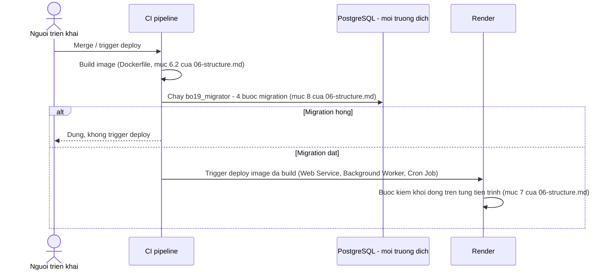

# Ops, Cost & Deployment — Admin Service Desk Agent (BO-19)

**Phiên bản:** 0.2 · **Trạng thái:** Draft chờ duyệt

> File này chốt vận hành trên Render: môi trường dev/staging/prod, cold start, worker nền, cron, migration, backup & restore, observability, dashboard SLA & tồn đọng, mô hình chi phí LLM, ngưỡng cảnh báo & cơ chế cắt chi phí, và định cỡ A-022. File này **không** thiết kế lại state machine, schema DB, endpoint API, hay `halt_for_human` — chỉ tham chiếu và bổ sung phần vận hành chưa phase nào chạm tới. Ba thay đổi cần chạm phase đã đóng (`06-structure.md`, `04-data.md`, `05-api.md`/`openapi.yaml`) được viết thành **đề xuất diff riêng**, không tự áp — xem mục 13.

Tên entity, trạng thái, permission, agent, node, tool, component dùng đúng `GLOSSARY.md`. Quyết định `D-xxx`/`A-xxx` tham chiếu `00-domain.md` và `ASSUMPTIONS.md`.

**Đã đối chiếu:** `CLAUDE.md`, `_PLAN.md`, `GLOSSARY.md`, `ASSUMPTIONS.md`, `00-domain.md`, `01-prd.md`, `02-architecture.md`, `03-agents.md`, `04-data.md`, `05-api.md`, `06-structure.md`, `07-prompts.md`, `08-hitl.md`, `09-security.md`, `10-eval.md`, `decisions/ADR-001` → `ADR-023`.

---

## 1. Môi trường Render

### 1.1 Ba môi trường, một ánh xạ dịch vụ

Bảng ánh xạ đơn vị triển khai đã chốt ở mục Ánh xạ sang đơn vị triển khai trên Render của `02-architecture.md` (Web Service, Background Worker, Cron Job, PostgreSQL managed, dịch vụ ngoài Render) áp **nguyên vẹn** cho cả ba môi trường `dev`, `staging`, `prod` — mỗi môi trường là một bộ instance riêng của đúng năm đơn vị đó.

| Môi trường | Mục đích | PostgreSQL | `object_storage` | Ai truy cập |
|---|---|---|---|---|
| `dev` | Phát triển, chạy thử migration mới | Instance riêng, dữ liệu giả | Bucket/namespace riêng | Người triển khai |
| `staging` | UAT (A-020), diễn tập trước khi cân nhắc đổi `operating_mode` | Instance riêng | Bucket/namespace riêng | PO, Trưởng phòng Hành chính, người triển khai |
| `prod` | Vận hành thật | Instance riêng | Bucket/namespace riêng | Toàn bộ người dùng cuối |

Ba môi trường **không chia sẻ** database hay object storage — mỗi môi trường tự chạy migration riêng (mục 4).

### 1.2 `operating_mode` không phải môi trường deploy — ba lớp ràng buộc (ADR-023)

`operating_mode` (`NON_PRODUCTION`/`PRODUCTION`, D-009) và môi trường Render (`dev`/`staging`/`prod`) là **hai trục độc lập theo thiết kế** (ADR-020). `dev`/`staging` bắt buộc `NON_PRODUCTION` bằng **ba lớp phòng thủ độc lập**, mỗi lớp bắt một thất bại mà các lớp kia không bắt được — lập luận đầy đủ, phương án bị loại, và câu trả lời cho việc ghi `audit_event` ở `decisions/ADR-023-moi-truong-khoa-operating-mode.md`:

| Lớp | Cơ chế | Bắt được gì |
|---|---|---|
| 1 | Chính sách cấp quyền — không cấp `operating_mode.change` ở `dev`/`staging` | Đường đi thông thường |
| 2 | Bước kiểm khởi động mới — lệch giữa `BO19_ENVIRONMENT` và `operating_mode` hiện hành thì **Chặn**, không khởi động | Trạng thái đã nằm trong DB, bất kể đến bằng đường nào, nhưng chỉ kiểm lúc khởi động |
| 3 | Chặn tại endpoint — `POST /operating-mode/transitions` từ chối chuyển sang `PRODUCTION` khi `BO19_ENVIRONMENT ≠ prod`, ghi `audit_event` mức `WARNING` qua thao tác `operating_mode_transition_reject` | Mọi lần gọi endpoint, tại thời điểm gọi, không chờ khởi động lại |

Đề xuất diff cho bảng bước kiểm khởi động của `06-structure.md` (Lớp 2) và cho `05-api.md`/`openapi.yaml` (Lớp 3, mã lỗi mới) — chưa áp, xem mục 13.

**Residual risk còn lại sau ba lớp:** một lần restore dữ liệu (không qua endpoint) chèn thẳng một dòng `operating_mode_change` mang `PRODUCTION` vào DB của `staging`, xảy ra **giữa** hai lần khởi động — Lớp 2 chỉ bắt ở lần khởi động kế tiếp, không tức thời; Lớp 3 không áp vì không đi qua endpoint. Chấp nhận, vì tần suất restore thấp hơn nhiều tần suất khởi động.

### 1.3 Biến môi trường theo môi trường

Bảng secret đã chốt ở mục Secret management trên Render của `09-security.md` áp dụng, nhân theo ba lần — mỗi môi trường có **giá trị riêng** cho mọi secret (session secret, credential `bo19_app`, provider key, S3 credential). Không chia sẻ giá trị secret giữa các môi trường. Thêm biến mới (ADR-023): `BO19_ENVIRONMENT` (`dev`/`staging`/`prod`), đọc lúc khởi động và tại mỗi lần gọi `POST /operating-mode/transitions`; thiếu biến này là **fail-closed** — coi như môi trường hạn chế nhất, không mặc định `prod`.

---

## 2. Cold start, khởi động và tắt tiến trình êm

Không thiết kế lại — tham chiếu nguyên vẹn: mục Đặc tả `Dockerfile` của `06-structure.md` (ADR-015), mục Bước kiểm khởi động của `06-structure.md` (15 bước hiện có — Lớp 2 của ADR-023 là đề xuất bước thứ 16 và 17, xem mục 13), mục Tắt tiến trình êm của `06-structure.md` (ADR-016).

**Chỗ quan sát:** cold start của `api` sau khi thêm LibreOffice, đặt cạnh kích thước image — dòng ADR-015 ở bảng chỗ quan sát của `_PLAN.md`.

---

## 3. Background worker & Cron — vận hành job

### 3.1 Tái sử dụng, không thiết kế lại

Cột bảng `job`, sáu `job_type`, cơ chế lease, bảng index — đã chốt ở mục Vận hành của `04-data.md`. Entrypoint tiến trình — mục Entrypoint và deploy trên Render của `06-structure.md`.

### 3.2 Retry, backoff và job lỗi vĩnh viễn

**Backoff — đề xuất, nhãn "chưa hiệu chỉnh":** exponential, `run_after = now() + base × 2^attempts`.

| `job_type` | `max_attempts` | `base` | Lý do |
|---|---|---|---|
| `render_document`, `resume_document_graph`, `finalize_issue` | 5 | 10s | Trên đường vào `halt_for_human` |
| `checkpoint_purge`, `notification_send` | 5 | 10s | Ảnh hưởng nghĩa vụ xoá PII / trải nghiệm |
| `procedure_ingest` | 3 | 30s | Chạy nền, ít nhạy thời gian |

**Job lỗi vĩnh viễn (`attempts = max_attempts`, `status = FAILED`):**

| Nhóm | Khi `FAILED` vĩnh viễn | Vì sao |
|---|---|---|
| `render_document`, `resume_document_graph`, `finalize_issue` | Enqueue một job `notification_send` riêng, đường mã hoá cứng; `document` hiện cờ **`job_failed`** trên hàng đợi duyệt (mục 7) | `document` không được mồ côi mà không ai biết. **Khác `halt_for_human`:** đây là hạ tầng không chạy được job, graph chưa tới node nào |
| `checkpoint_purge`, `notification_send` | Ghi metric + alert `observability`, không tự tạo job/enqueue lại | Sổ sách kỹ thuật, tránh vòng lặp job báo lỗi chính nó |
| `procedure_ingest` | Ghi metric + alert `observability` | Không trên đường tới cổng HITL |

Job `FAILED` vĩnh viễn **không tự động retry** — người xem alert enqueue lại thủ công sau khi sửa nguyên nhân.

**`job_failed` — cờ dẫn xuất, chưa có chỗ đứng trong contract:** tính từ dòng `job` mới nhất theo từng `job_type` liên quan cho một `document_id`; bật khi dòng đó `status = FAILED`. Chưa có trong response nào của `05-api.md`; `ix_job_pending_by_document` là partial trên `QUEUED`/`RUNNING`, không phủ truy vấn `FAILED` theo `document_id` — cần index mới nếu contract dưới được duyệt. **Đề xuất diff cho `05-api.md`+`openapi.yaml`, chưa áp — mục 13.**

### 3.3 Cron

`expire_request`, `object_claim_reconcile` (Sprint đầu); `[Should]` quét SLA, nhả `HELD`, hoàn tất `room_booking` — đã chốt ở `06-structure.md`. Bổ sung: **dọn `rate_limit_window`** như một thao tác `cron_main` mới. Tần suất và số cửa sổ giữ lại: `TBD`, gộp vào A-031.

---

## 4. Migration

Ngữ cảnh chạy `migrate` (đóng A-060): **ADR-022 — CI pipeline**, trước khi trigger deploy Render. Lập luận đầy đủ ở `decisions/ADR-022-migrate-qua-ci-pipeline.md`. Thứ tự bốn bước migration không đổi (mục Migration và checkpointer của `06-structure.md`).



`tools/contract-checks/` chạy `--app-dsn` sau migration, trước trigger deploy (mục Chạy lại của `06-structure.md`) — trượt thì dừng CI.

---

## 5. Backup & Restore

Đất trống hoàn toàn trước phase này. Thiết kế từ đầu, giữ nguyên tắc không bịa số.

### 5.1 Nguyên tắc

- **`postgresql`:** dựa backup mặc định của PostgreSQL managed trên Render — tần suất, retention, PITR thật `[CẦN XÁC MINH]`, chưa có bản gốc trong `docs/reference/`. Không tự dựng thêm `pg_dump` định kỳ song song (mục 5.3).
- **`object_storage`:** lớp bảo vệ chính là versioning/conditional-write của nhà cung cấp (yêu cầu mua sắm ở A-024) — không phải backup theo nghĩa RPO/RTO, chỉ đóng ca ghi đè.
- **Dữ liệu không được mất:** `audit_event` (chỉ thêm), `document_register_entry` (số không tái sử dụng), bản render ghim ở `SEALED`/`ISSUED`. Ba bất biến này đứng ở tầng ứng dụng; backup là lớp khác, bảo vệ khỏi việc cả tầng ứng dụng biến mất.

### 5.2 Đối soát sau khôi phục — cơ chế và ranh giới, không số RPO/RTO

Một point-in-time restore về T đưa **cả** `document_register_counter` **và** `document_register_entry` về cùng T một cách nhất quán với nhau — bất biến `uq_register_entry_seq` (mục Bất biến nào đứng ở đâu của `04-data.md`: *"Số không tái sử dụng | `uq_register_entry_seq` — đứng ở dòng sổ, không ở bộ đếm. Kể cả khi bộ đếm bị ghi lùi, dòng mới vẫn đụng dòng cũ"*) chỉ chặn được ca **bộ đếm bị ghi lùi một mình** — nó **không** chặn được PITR toàn bộ, vì dòng sổ biến mất theo cùng lần restore, không còn gì để "đụng".

**(a) Thứ tự khôi phục.** `object_storage` không lùi theo `postgresql` (địa chỉ theo khoá bất biến). Thứ tự bắt buộc: khôi phục `postgresql` về T → **không nhận traffic** → chạy đối soát (b) → chỉ mở lại sau khi có người xác nhận.

**(b) Phát hiện "phát hành ma".** Khoá object hiện tại (`renders/{document_id}/{input_hash}`) không phân biệt được bản ghim `ISSUED` với các bản nháp tích luỹ dưới cùng `document_id` — không đối soát được bằng khoá. **Đề xuất (chưa áp, cần duyệt Phase 4 — mục 13):** gắn object metadata (không phải khoá, không phải byte nội dung) lúc ghim bản cuối — `pin_reason`, `document_number`. Bốn điều kiện của đề xuất: (1) chỉ gắn cho bản ghim `ISSUED`, không gắn bản nháp; (2) chỉ hai trường trên, không gì khác; (3) `postgresql` vẫn là nguồn sự thật duy nhất — tag chỉ đọc lúc thảm hoạ, không đường truy vấn nào ở code đường-nóng đọc nó; (4) **giới hạn phải nói thẳng:** tag chỉ tồn tại trên object ghi **sau** khi thay đổi này triển khai — không phủ ngược các văn bản phát hành trước đó. Đối soát có một ngày bắt đầu.

**(c) Sổ số văn bản sau restore.** Không chèn lại `document_register_entry` — FK `document_id`/`issue_decision_id` trỏ tới `document`/`decision_record`, cả hai đã mất theo cùng lần restore, `INSERT` bù không qua được FK. **Cơ chế:** `document_register_counter.next_seq` là bảng riêng, không FK tới `document` — sau khi (b) xác nhận số lớn nhất dùng thật, **đẩy `next_seq` vượt qua số đó**, chặn cấp trùng mà không cần entry row. **Cái giá:** khoảng số bị nhảy qua không có dòng sổ nào, kể cả không đánh dấu `VOIDED` được (`VOIDED` cần một entry đã tồn tại). Đây là một loại "lỗ hổng số" **ngoài** cơ chế đã thiết kế ở Phase 4 — ghi thành **RISK-08** (mục Risk register của `01-prd.md`, xem mục 10 dưới), rủi ro chấp nhận có người ký, không phải cơ chế đã giải quyết.

**(d) Ranh giới của (b), không phải lỗ của (b).** Ca "`ASSIGNED` mà chưa `ISSUED`" (đoạn 2, `issue_in_progress`, mục Khoảng hoàn tất phát hành trong dữ liệu của `04-data.md`) đúng theo thiết kế **không có object nào** — bản ghim chỉ tạo ở bước cuối của `finalize_issue`, cùng lúc `ISSUED`. PITR đưa DB về đúng trạng thái transactionally-consistent tại T; nếu T rơi giữa hai bước, entry `ASSIGNED`-chưa-`ISSUED` **tự nó nằm đúng trong snapshot**, không lệch gì — xử lý bằng cơ chế `halt_for_human`/resume đã có, không cần (b).

### 5.3 Quyết định phạm vi — không mở rộng ngoài managed backup

Không thiết kế thêm `pg_dump` định kỳ độc lập ở Sprint đầu: (1) tốn thêm `job_type` mới ngoài Registry đã chốt; (2) chưa có số liệu tải (A-002) để định cỡ; (3) rẻ để đảo ngược sau. **Xét lại khi:** A-002 đóng, hoặc xác minh được Render managed PostgreSQL không có PITR đủ mạnh.

### 5.4 Diễn tập khôi phục

Ai chịu trách nhiệm và tần suất — `TBD` (A-066).

---

## 6. Observability

### 6.1 Log schema

Log JSON có cấu trúc ra stdout (mục `observability` của `02-architecture.md`). Mọi dòng: `trace_id` (cùng `llm_usage.trace_id`), `component`, `level`, `message` qua handler mask duy nhất (bước kiểm khởi động #10; quy tắc mask ở mục Mask trong log kỹ thuật của `09-security.md`). Khác `audit_event`: log kỹ thuật xoay vòng theo retention kỹ thuật (`TBD`, `[CẦN XÁC MINH]`), `audit_event` không bao giờ.

### 6.2 Metric taxonomy

| Nhóm | Ví dụ metric | Nguồn |
|---|---|---|
| Nghiệp vụ | Số `request`/`document` theo trạng thái, `request_type`; `sla_breached`; tỷ lệ tự duyệt | `postgresql` |
| Chi phí | Token theo `request_type`, `outcome`; số lời gọi/`document` so với cận trên | `llm_usage` |
| Độ tin cậy | Tỷ lệ job `SUCCEEDED`/`FAILED` theo `job_type`; độ trễ dispatch; độ trễ lease | `job` |
| Cổng & dừng | Tỷ lệ `document_halt` theo `reason_code`; thời lượng `IN_REVIEW`/`PENDING_SIGNATURE`/`PENDING_SEAL` | `document_halt`, `decision_record` |
| Bảo mật | Số lần `rate_limit` chặn; số `INVALID_CREDENTIALS`; số lần Lớp 3 (ADR-023) từ chối | `rate_limit_window`, log kỹ thuật, `audit_event` |
| Hạ tầng | Cold start `api`; độ trễ `soffice`; độ trễ upload `object_storage` | `observability`, đo trực tiếp |

Công cụ APM/metric cụ thể: `TBD` (A-002).

### 6.3 Chỗ quan sát cho điều kiện đảo ngược — bổ sung của phase này

Bảng đầy đủ đã chốt ở `_PLAN.md` (ADR-002, 004, 005, 011, 012, 013, 014, 015, 016) — không lặp lại, chỉ dẫn tới đó. Bổ sung các chỗ quan sát mới phát sinh trong phase này:

| Tín hiệu | Chỗ phải quan sát được |
|---|---|
| Bộ phát hiện thread kẹt dạng (1) — `document` ở trạng thái chờ mà thread không đứng ở `interrupt` tương ứng, không có job resume đang chờ | Đối chiếu `document.status` với `graph_thread.waiting_at_node` và `job` `QUEUED`/`RUNNING` cùng `document_id`; đếm ca lệch |
| Bộ phát hiện thread kẹt dạng (2) — thread đứng đúng `interrupt` nhưng `request` cha đã kết thúc | Đối chiếu `graph_thread.status = WAITING` với trạng thái kết thúc của `request` cha; đếm ca lệch — lưới an toàn |
| Token trung bình `classify_intent`, đặt cạnh số `request_type` đang hiệu lực, trên cùng trục thời gian | Trần 1.500/lời gọi là hằng số cấu hình build, không tự co giãn theo F6 — tín hiệu này phát hiện độ trôi trước khi `BUDGET_EXCEEDED` xảy ra |
| Số lời gọi `extract_slots` trả về đúng `maxItems: 8` (bão hoà), đặt cạnh số slot `USER_INPUT` của `request_type` đang xử lý | Tín hiệu ma sát khai gộp tăng — một loại mới nhiều slot làm nhân viên phải lặp lại thông tin ở lượt sau |
| Trần token `chat_session` đang dùng giá trị nào (32.000 hay 46.500) | Phụ thuộc A-068 — xem mục 10.4. Tự nó là một chỗ quan sát: nếu A-068 đóng mà cấu hình chưa cập nhật, hệ thống chạy sai giá trị |

### 6.4 Alert — nguyên tắc, không bịa ngưỡng

Alert "cứng": job `FAILED` vĩnh viễn, `document_halt` tăng đột biến, bước kiểm khởi động thất bại, Lớp 3 (ADR-023) từ chối tăng bất thường. Alert "mềm" (A-063): chưa có số, cùng lý do A-019 — chưa có dữ liệu thật để hiệu chỉnh.

---

## 7. Dashboard SLA & tồn đọng

Dành cho `ADMIN_OFFICER`, composed từ endpoint đã có: `GET /review-queue`, `GET /issue-queue` (cờ `halted`, `issue_in_progress`, và **`job_failed`** nếu contract ở mục 13 được duyệt), `GET /self-approvals`, danh sách `request` (cờ `sla_breached`). **Gap đã biết, chưa tự vá:** không có endpoint đếm tổng hợp theo `request_type` × trạng thái — nằm trong đề xuất diff `05-api.md` ở mục 13. Job/queue backlog, chi phí, độ trễ **không** thuộc dashboard này — dữ liệu vận hành cho kỹ sư (mục 6), khác đối tượng đọc.

---

## 8. Mô hình chi phí LLM theo `request_type`

### 8.1 Công thức — biến số, không số ví dụ

```
Chi_phi(request) = Sigma(loi_goi_LLM) [ token_input x gia_input(tier) + token_output x gia_output(tier) ]
                  + Sigma(loi_goi_embedding) [ token x gia_embedding ]
```

`gia_input`, `gia_output`, `gia_embedding` — `TBD` (A-026).

### 8.2 Số lời gọi kỳ vọng theo `request_type` × node

| `request_type` | Node gọi LLM (tier) | Ghi chú |
|---|---|---|
| `WORK_CONFIRMATION` | `classify_intent`, `extract_slots` (rẻ) · `select_procedure_passages` (rẻ, ngoài phạm vi) · `draft_free_content` (mạnh, `V=1`) | Tối thiểu một lời gọi mạnh |
| `INTRODUCTION_LETTER` | Như trên, `work_content_statement` | Như trên |

### 8.3 Nguồn dữ liệu chi phí thật

`SUM(llm_usage.token) GROUP BY request_id`, loại trừ `outcome IN ('BUDGET_UNAVAILABLE', 'ALLOWLIST_REJECTED')` (mục Metric theo từng chặng của `10-eval.md`).

---

## 9. Ngưỡng cảnh báo & cơ chế cắt chi phí

- **Cắt cứng:** `BUDGET_EXCEEDED`/`BUDGET_UNAVAILABLE` chặn lời gọi trước khi tới provider (ADR-019); node đi vào `halt_for_human` (phía `drafting_agent`) hoặc khuôn liên hệ trực tiếp (phía `intake_agent`).
- **Không gộp thống kê:** `BUDGET_UNAVAILABLE` là dấu hiệu sự cố hạ tầng; `BUDGET_EXCEEDED` là dấu hiệu cần xem lại `R`/`V`/prompt.
- **Ngưỡng "xấu đi đáng kể":** chưa có số — A-063.

---

## 10. Định cỡ A-022

### 10.1 Đơn vị đã chốt

Nguyên tử chi phí (một lời gọi LLM sinh một biến), cận trên `(1+R)×V×2×2` — ADR-009, mục Đơn vị render lại của `03-agents.md`. Cơ chế dừng — mục Cơ chế dừng khi chạm trần của `08-hitl.md`.

### 10.2 Bảng giá trị — mỗi thành phần gắn nhãn loại

| Thành phần | Giá trị | Loại |
|---|---|---|
| `R` — trần vòng `CHANGES_REQUESTED` | 3 | **Cận trên cứng** (A-022, ADR-009) |
| Cận trên lời gọi `drafting_agent`/`document` | (1+3)×1×2×2 = 16 | **Cận trên cứng** |
| Trần token/lời gọi `drafting_agent` | 4.000 | **Cận trên cứng** |
| **Trần token/`request` — phần `drafting_agent`** | **64.000** | **Cận trên cứng** |
| `C` — trần lượt `CLARIFY_TYPE` | 5 | **Cận trên cứng** (A-031) — điều kiện reset xem mục 10.4 (A-068) |
| Trần token/lời gọi `classify_intent` | 1.500 | Ước lượng — phụ thuộc kích thước `request_type_catalog` (mục 10.3) |
| Trần token/lời gọi `extract_slots` | 3.500 | Ước lượng — phụ thuộc số slot của loại đang mở + trần output đã cố định ở Phase 7 (`maxItems:8`, `evidence_quote` 300 ký tự); biên rộng có chủ đích vì đây là ô ước lượng thô nhất bảng |
| Trần token/lời gọi `select_procedure_passages` | 6.000 | Ước lượng — input lớn hơn (đoạn quy trình ứng viên) |
| Trần token/lời gọi `embed_query` | 500 | Ước lượng có căn cứ — `retrieval_query.maxLength = 200` ký tự (mục Output contract của `07-prompts.md`), ~100–150 token, dư ~3× |
| Số lượt thu slot điển hình (sau `request_open`) | 4 | **Kích cỡ điển hình** — không có trần lượt cho `ASK_SLOT` |
| Số yêu cầu nối tiếp điển hình/phiên (`N`) | 3 | **Kích cỡ điển hình** |
| Giả định: 1 lần đi lạc ngoài phạm vi mỗi chu kỳ yêu cầu | — | **Giả định kích cỡ, chưa có số liệu (A-002)** — không phải quan sát thật, phán đoán worst-case |
| **Trần token/`request` — phần `intake_agent`** (`4×(1.500+3.500) + 6.500`) | **26.500** | **Kích cỡ điển hình** |
| **Trần token/`request` — TỔNG** (`64.000 + 26.500`) | **92.000** (làm tròn từ 90.500) | **Hỗn hợp** — 64.000 cứng + 26.500 điển hình. Đã khoá |

### 10.3 Trần `V` và `1.500`/`extract_slots` — mốc F6, không phải mốc vỡ

`request_type_catalog` (input `classify_intent`) và `slot_specs` (input `extract_slots`) đều lớn theo `request_type_upsert` (F6), nhưng trên **hai trục khác nhau**: `classify_intent` theo tổng số loại trong catalog; `extract_slots` theo số slot của **loại đang mở**. `maxItems: 8` của `extract_slots` (mục P2 của `07-prompts.md`) là trần **một lượt trích** (`check_completeness` tích luỹ qua nhiều lượt từ DB, không đọc trực tiếp output một lần gọi) — một loại >8 slot không hỏng F6, chỉ tăng ma sát: nhân viên khai gộp toàn bộ trong một tin nhắn sẽ bị cắt ở giá trị thứ 8, phần dư phải hỏi lại ở lượt sau.

**Owner + mốc kích hoạt (A-031):** người vận hành đo lại token thật (qua provider thật, khi có A-026) và điều chỉnh trần khi: (a) tổng số `request_type` active vượt bội số kế tiếp của 5 (mốc kế: 10); hoặc (b) một `request_type` mới có > 8 slot `USER_INPUT` (mốc ma sát khai gộp, không phải mốc vỡ token). Chỗ quan sát tương ứng — mục 6.3.

### 10.4 Trần `chat_session` — giá trị đang hiệu lực, phụ thuộc A-068

**A-068** (mới — xem mục 12 của `ASSUMPTIONS.md`): `clarification_count` (state của `intake_graph`) không có cơ chế reset trong thiết kế đã chốt — chỉ tăng ở cạnh `route_intent → ask_clarification`. Với một phiên nhiều `request` nối tiếp, bộ đếm cộng dồn cả phiên.

| Giá trị | Trạng thái | Điều kiện |
|---|---|---|
| **32.000** | **ĐANG HIỆU LỰC** | `(C+N)×1.500 + N×6.500` = `8×1.500+3×6.500` — đúng với thiết kế hiện tại, `clarification_count` không reset |
| 46.500 | Giá trị thay thế, tự động áp khi A-068 đóng theo phương án (b') | `N×C×1.500 + N×1.500 + N×6.500` = `3×5×1.500+3×1.500+3×6.500` — mỗi chu kỳ yêu cầu được cấp lại đủ `C` lượt làm rõ |

Đây là **một điều kiện đảo ngược có tên** (chỗ quan sát ở mục 6.3): trần build với 32.000 nếu A-068 chưa đóng khi build; đổi sang 46.500 ngay khi A-068 đóng theo (b') — cấu hình phải cập nhật cùng lúc, không trễ.

**Phương án (b') — đề xuất cho đợt sửa `03-agents.md` riêng (không thuộc Phase 11):** reset `clarification_count = 0` tại `load_turn`, khi node phát hiện `request` trước đó của phiên đã đạt một trong các trạng thái: `SUBMITTED`, `IN_REVIEW`, `CHANGES_REQUESTED`, `APPROVED`, `FULFILLED`, `REJECTED` (đích danh — không dùng chữ "kết thúc"). **Không bao giờ** reset khi trạng thái là `CANCELLED` hoặc `EXPIRED` — cả hai không phải một kết quả nhân viên đạt được, và `CANCELLED` từ `DRAFT` (đổi loại giữa chừng, EC-CV-02) không được phép cấp lại ngân sách miễn phí. Đã rà đủ 10 trạng thái của `request` (mục Trạng thái `request` của `GLOSSARY.md`), không còn trạng thái nào ở vùng xám. `load_turn` đã đọc sẵn điều kiện tương tự (bảng cạnh điều kiện, mục `6.3` của `03-agents.md`: *"request đã gửi, đã đóng hoặc hết hạn"*) — thêm nhánh reset là mở rộng logic đã có, không phải khớp nối mới; phương án (a) (reset tại `open_request`) và việc reset trực tiếp tại thời điểm `request_submit` bị loại vì lý do ở A-068.

---

## 11. ADR mới ở phase này

**ADR-022** — Migrate qua CI pipeline, không qua thao tác one-off của Render. Đóng A-060.
**ADR-023** — Ba lớp khoá `operating_mode` theo môi trường (chính sách cấp quyền, bước kiểm khởi động, chặn tại endpoint).

---

## 12. Phát hiện, không tự sửa

Theo mục 4 (luật 1 và 11) của `CLAUDE.md` — rà lại toàn bộ file này một lượt, không chỉ hai chỗ đã biết trước:

1. `GLOSSARY.md` mục Enum khác vẫn ghi `document_halt.reason_code` là "Chờ Phase 8", nhưng `08-hitl.md` (đã đóng) đã liệt đủ sáu giá trị. **Chưa sửa.**
2. `notification.event_code` — **chưa từng có bảng mã ở bất kỳ phase nào**, không chỉ chưa promote (xác nhận bằng grep ba nguồn: `04-data.md`, `10-eval.md`, `GLOSSARY.md` đều nói "thuộc Phase 8", không nơi nào có danh sách giá trị). **Chưa sửa.**
3. `job_failed` — cờ dẫn xuất mới, cần một dòng ở mục Thuật ngữ của `GLOSSARY.md` (cùng tiền lệ `issue_in_progress`/`sla_breached`). **Chưa sửa**, phụ thuộc contract ở mục 13 được duyệt.
4. `operating_mode_transition_reject` — thao tác `tool_layer` mới, cần thêm vào nhóm "Thao tác do endpoint gọi" của mục Agent, graph, node, tool của `GLOSSARY.md`. **Chưa sửa.**
5. Định nghĩa `WARNING` (mục Enum khác của `GLOSSARY.md`) cần mở rộng thành danh sách đóng: áp cho tự duyệt (D-006) và cho lần thử chuyển `operating_mode` bị chặn bởi luật môi trường (ADR-023); thêm ca mới là một quyết định có ADR, không phải một phép suy. **Chưa sửa.**
6. `BO19_ENVIRONMENT` — biến môi trường mới (ADR-023), tham chiếu xuyên ba file (`11-ops.md`, và hai đề xuất diff cho `06-structure.md`/`05-api.md` ở mục 13) — cùng loại định danh hạ tầng đã có trong mục Cấu trúc dự án của `GLOSSARY.md` (`bo19_migrator`, `bo19_app`, `schema_migration`). **Chưa sửa.** *(Không cần GLOSSARY: `ENVIRONMENT_NOT_ALLOWED` — error code, GLOSSARY tự nói "`error_code` — nguồn duy nhất là `05-api.md`, không chép lại"; các trường object metadata đề xuất ở mục 13 — khoá kỹ thuật nội bộ, không xuất hiện trong API response hay màn hình nào.)*

Cả sáu gộp vào lượt sửa GLOSSARY cho Phase 8, một phiên riêng, sau khi ba đề xuất diff ở mục 13 được duyệt (mục 3, 4, 6 phụ thuộc kết quả duyệt đó).

---

## 13. Đề xuất diff chờ duyệt riêng — chưa áp

Ba thay đổi chạm phase đã đóng, viết thành đề xuất riêng, không tự áp vào file gốc:

| Đề xuất | File đích | Nội dung |
|---|---|---|
| `docs/design/proposals/diff-06-structure-startup-checks.md` | `06-structure.md` | Hai bước kiểm khởi động mới (Lớp 2 của ADR-023): #16 lệch `BO19_ENVIRONMENT`/`operating_mode` (Chặn), #17 thiếu `BO19_ENVIRONMENT` (Chặn). Không nâng mức bước #15 (giữ "Ghi log") |
| `docs/design/proposals/diff-04-data-object-metadata-tag.md` | `04-data.md` | Gắn object metadata (`pin_reason`, `document_number`) lúc ghim bản `ISSUED` — phục vụ đối soát sau khôi phục (mục 5.2(b)) |
| `docs/design/proposals/diff-05-api-job-failed-and-reject-error.md` | `05-api.md`, `contracts/openapi.yaml` | Trường `job_failed` trên `GET /review-queue`/`GET /issue-queue`; mã lỗi mới cho Lớp 3 (ADR-023) từ chối |

---

## Open Questions

Không có câu hỏi mở chỉ tồn tại trong file này. Giả định liên quan: A-022 (thu hẹp, mục 10), A-025, A-031 (mốc F6 mới, mục 10.3), A-041, A-057, A-059, A-060 (đóng), A-062, A-063, A-065, A-066 (mới), **A-067 (Mở — ba vế secret CI)**, **A-068 (mới, Mở — reset `clarification_count`, phương án (b'), owner đợt sửa `03-agents.md` riêng do PO khởi động, hạn trước buổi UAT vì làm hỏng M3)**, A-024 (vẫn `Mở`) — xem `ASSUMPTIONS.md`.
