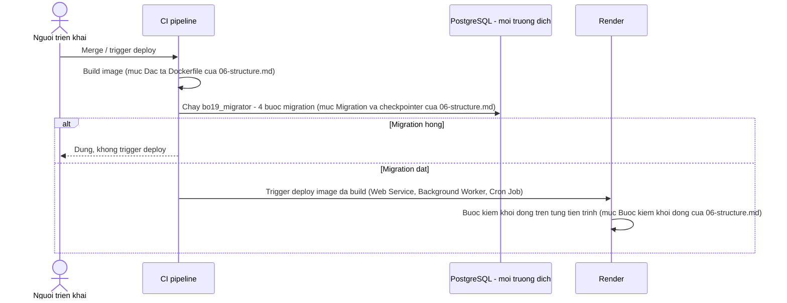

# Ops, Cost & Deployment — Admin Service Desk Agent (BO-19)

**Phiên bản:** 0.30 · **Trạng thái:** Draft chờ duyệt — bốn đề xuất diff đã áp; đợt sửa `03-agents.md` cho A-068 đã áp (2026-09-25); lượt GLOSSARY/contract cho Phase 5, 8 đã chạy ở đợt sửa 2, 3 sau Phase 13 · **v0.11:** căn cứ bảo vệ dữ liệu cá nhân — A-080 (AUD-26) · **v0.10:** mục 14 — runbook cấp và thu hồi permission tạm (A-078 `Đã chốt`), mục ngày 2026-09-26 (quyết định PO sau đợt 3b) · **v0.9:** mục 10.4 — trần `chat_session` 46.500 thành giá trị đang hiệu lực, sửa câu về phương án (b') — mục ngày 2026-09-25 (đợt sửa A-068, A-073, A-075) của `CHANGELOG.md` · **v0.12:** đợt sửa 4 sau Phase 13 — hai dòng chỗ quan sát (AUD-12); runbook object mồ côi, nơi lưu bản ghi eval (AUD-24); nội dung cũ (AUD-11) · **v0.13:** đợt sửa 5 sau Phase 13 — tham chiếu tới mục không tồn tại của `ASSUMPTIONS.md` (AUD-17); W3C Trace Context, quy đổi token `[CẦN XÁC MINH]` (AUD-21) · **v0.14:** sơ đồ migration ở mục Migration: ba nhãn trỏ `06-structure.md` theo tên mục thay số mục — luật 12 (2026-10-02) · **v0.15:** giai đoạn build: một môi trường, Backup & Restore không thử được, runbook dựng lại PostgreSQL free — A-085 (PO, 2026-10-02) · **v0.16:** runbook dựng lại PostgreSQL free: lịch theo ngày thật; kiểm trước Sprint 4 (PO, 2026-10-02) · **v0.17:** mục Định cỡ A-022: `reasoning_tokens` tính vào budget (ADR-035, 2026-10-02) · **v0.18:** mục Retry, backoff và job lỗi vĩnh viễn: 429 của provider LLM trong job (PO, 2026-10-02) · **v0.19:** 429 trong job: ngưỡng WV-19 cho `retry-after`; mã con `PROVIDER_CALL_FAILED` thay `PROVIDER_ERROR` (2026-10-02) · **v0.20:** nhật ký vận hành: chu kỳ 1 của DB free — tạo 2026-10-04, dựng lại 2026-10-29, hết hạn 2026-11-03, PostgreSQL 18 (2026-10-04) · **v0.21:** kết quả S0: PostgreSQL 18.6, kết nối ngoài Render được, `vector` do user mặc định tạo (2026-10-04) · **v0.22:** runbook bước 5: bước 0 bằng `bo19_admin`, do PO (2026-10-04) · **v0.23:** mục Biến môi trường theo môi trường: `BO19_DATABASE_URL` (2026-10-04) · **v0.24:** `BO19_MIGRATOR_DATABASE_URL`; runbook bước 5 trỏ `tools/db-bootstrap/`; chu kỳ 2 — lần thử đầu cho cổng 2.11 (2026-10-04) · **v0.25:** runbook bước 5: PostgreSQL Version 18; credential `bo19_admin` ở `~/.bo19/admin.env`, ngoài repo (2026-10-04) · **v0.26:** nhật ký chu kỳ 2 — ngày PO gửi (2026-10-04) · **v0.27:** chu kỳ 2 — bước 0 đạt; ghi chú tên database (2026-10-04) · **v0.28:** chu kỳ 2 — bước 7–8 đạt (2026-10-04) · **v0.29:** chu kỳ 2 — bước 9 đạt; lệch so với runbook (2026-10-04) · **v0.30:** chu kỳ 2 — cổng 2.11 chưa đạt (2026-10-04)

> File này chốt vận hành trên Render: môi trường dev/staging/prod, cold start, worker nền, cron, migration, backup & restore, observability, dashboard SLA & tồn đọng, mô hình chi phí LLM, ngưỡng cảnh báo & cơ chế cắt chi phí, và định cỡ A-022. File này **không** thiết kế lại state machine, schema DB, endpoint API, hay `halt_for_human` — chỉ tham chiếu và bổ sung phần vận hành chưa phase nào chạm tới. Bốn thay đổi cần chạm phase đã đóng (`06-structure.md`, `04-data.md` ×2, `05-api.md`/`openapi.yaml`) được viết thành **đề xuất diff riêng**, duyệt từng cái một — **cả bốn đã áp**, PO duyệt lần lượt 2026-09-16 và 2026-09-25 — xem mục 13.

Tên entity, trạng thái, permission, agent, node, tool, component dùng đúng `GLOSSARY.md`. Quyết định `D-xxx`/`A-xxx` tham chiếu `00-domain.md` và `ASSUMPTIONS.md`.

**Đã đối chiếu:** `CLAUDE.md`, `_PLAN.md`, `GLOSSARY.md`, `ASSUMPTIONS.md`, `00-domain.md`, `01-prd.md`, `02-architecture.md`, `03-agents.md`, `04-data.md`, `05-api.md`, `06-structure.md`, `07-prompts.md`, `08-hitl.md`, `09-security.md`, `10-eval.md`, `decisions/ADR-001` → `ADR-024`.

---

## 1. Môi trường Render

### 1.1 Ba môi trường, một ánh xạ dịch vụ

Bảng ánh xạ đơn vị triển khai đã chốt ở mục Ánh xạ sang đơn vị triển khai trên Render của `02-architecture.md` (Web Service, Background Worker, Cron Job, PostgreSQL managed, dịch vụ ngoài Render) áp **nguyên vẹn** cho cả ba môi trường `dev`, `staging`, `prod` — mỗi môi trường là một bộ instance riêng của đúng năm đơn vị đó.

| Môi trường | Mục đích | PostgreSQL | `object_storage` | Ai truy cập |
|---|---|---|---|---|
| `dev` | Phát triển, chạy thử migration mới | Instance riêng, dữ liệu giả | Bucket/namespace riêng | Người triển khai |
| `staging` | UAT (A-020), diễn tập trước khi cân nhắc đổi `operating_mode` | Instance riêng | Bucket/namespace riêng | PO, Trưởng phòng Hành chính, người triển khai |
| `prod` | Vận hành thật | Instance riêng | Bucket/namespace riêng | Toàn bộ người dùng cuối |

Ba môi trường **không chia sẻ** database hay object storage — mỗi môi trường tự chạy migration riêng (mục 4).

**Giai đoạn build (A-085, F4 — PO 2026-10-02):** Render chỉ có **một** môi trường, `dev`, vì gói free chỉ cho một Postgres mỗi workspace. Nó chạy `combined_main` trên một Web Service free (ADR-033), và là nơi chạy cả buổi UAT của Sprint 4. Bảng trên áp khi lên gói trả phí.

### 1.2 `operating_mode` không phải môi trường deploy — ba lớp ràng buộc (ADR-023)

`operating_mode` (`NON_PRODUCTION`/`PRODUCTION`, D-009) và môi trường Render (`dev`/`staging`/`prod`) là **hai trục độc lập theo thiết kế** (ADR-020). `dev`/`staging` bắt buộc `NON_PRODUCTION` bằng **ba lớp phòng thủ độc lập**, mỗi lớp bắt một thất bại mà các lớp kia không bắt được — lập luận đầy đủ, phương án bị loại, và câu trả lời cho việc ghi `audit_event` ở `decisions/ADR-023-moi-truong-khoa-operating-mode.md`:

| Lớp | Cơ chế | Bắt được gì |
|---|---|---|
| 1 | Chính sách cấp quyền — không cấp `operating_mode.change` ở `dev`/`staging` | Đường đi thông thường |
| 2 | Bước kiểm khởi động mới — lệch giữa `BO19_ENVIRONMENT` và `operating_mode` hiện hành thì **Chặn**, không khởi động | Trạng thái đã nằm trong DB, bất kể đến bằng đường nào, nhưng chỉ kiểm lúc khởi động |
| 3 | Chặn tại endpoint — `POST /operating-mode/transitions` từ chối chuyển sang `PRODUCTION` khi `BO19_ENVIRONMENT ≠ prod`, ghi `audit_event` mức `WARNING` qua thao tác `operating_mode_transition_reject` | Mọi lần gọi endpoint, tại thời điểm gọi, không chờ khởi động lại |

Đề xuất diff cho bảng bước kiểm khởi động của `06-structure.md` (Lớp 2) và cho `05-api.md`/`openapi.yaml` (Lớp 3, mã lỗi mới) — đã áp (mục 13).

**Residual risk còn lại sau ba lớp:** một lần restore dữ liệu (không qua endpoint) chèn thẳng một dòng `operating_mode_change` mang `PRODUCTION` vào DB của `staging`, xảy ra **giữa** hai lần khởi động — Lớp 2 chỉ bắt ở lần khởi động kế tiếp, không tức thời; Lớp 3 không áp vì không đi qua endpoint. Chấp nhận, vì tần suất restore thấp hơn nhiều tần suất khởi động.

### 1.3 Biến môi trường theo môi trường

Bảng secret đã chốt ở mục Secret management trên Render của `09-security.md` áp dụng, nhân theo ba lần — mỗi môi trường có **giá trị riêng** cho mọi secret (session secret, credential `bo19_app`, provider key, S3 credential). Không chia sẻ giá trị secret giữa các môi trường. Thêm biến mới (ADR-023): `BO19_ENVIRONMENT` (`dev`/`staging`/`prod`), đọc lúc khởi động và tại mỗi lần gọi `POST /operating-mode/transitions`; thiếu biến này là **fail-closed** — coi như môi trường hạn chế nhất, không mặc định `prod`.

**`BO19_DATABASE_URL` — thêm 2026-10-04 (PO).** DSN mà `api`, `worker`, cron nối PostgreSQL — **credential của `bo19_app`**, host **nội bộ** của Render, `sslmode=require`. **Không** dán nguyên URL nội bộ Render hiển thị: URL đó mang credential của user mặc định `bo19_admin` (`docs/reference/render-web-service-health-checks.md`; S1). Dựng bằng cách lấy host, cổng, tên database của URL nội bộ, ghép user `bo19_app` và mật khẩu của nó. Bước kiểm khởi động #2 chặn khi lỡ dùng credential khác — kể cả `bo19_migrator` hay `bo19_admin`.

**`BO19_MIGRATOR_DATABASE_URL` — thêm 2026-10-04.** DSN duy nhất mà `migrate_main` đọc — credential `bo19_migrator`, `sslmode=require`. Chỉ có ở ngữ cảnh chạy migrate (ADR-022), **không bao giờ** là biến của Web Service hay của tiến trình runtime nào. Tên khác `BO19_DATABASE_URL` có chủ ý: một tiến trình runtime không thể vô tình đọc nhầm credential của role sở hữu.
**Biến cấu hình của tiến trình runtime — thêm 2026-10-05 (B2).** Đọc một lần lúc khởi động bởi `bo19.config.settings`; giá trị rỗng hoặc chỉ có khoảng trắng coi như **không đặt**. Bước kiểm khởi động trượt ở biến nào thì log chỉ ghi **tên biến** và mã, không ghi giá trị (đúng luật của `CLAUDE.md` về secret).

| Biến | Bắt buộc | Mặc định | Nguồn | Bước kiểm |
|---|---|---|---|---|
| `BO19_ENVIRONMENT` | Có — thiếu là **Chặn**, không mặc định `prod` | — | ADR-023 | #16, #17 |
| `BO19_DATABASE_URL` | Có, ở `api`/`worker`/cron | — | Đoạn trên | #1, #2, #15, #17 |
| `BO19_SESSION_SECRET` | Có, ở `api` | — | ADR-013; mục Secret management trên Render của `09-security.md`; độ dài tối thiểu: A-088 | #12 |
| `PORT` | Render tự đặt | `10000` | Render | — |
| `BO19_ORG_TIMEZONE` | Không | `Asia/Ho_Chi_Minh` | A-041 `Đã chốt` | #13 — đặt giá trị khác là **Chặn** |
| `BO19_SHUTDOWN_DELAY_SECONDS` | Không | `30` | WV-01 | #11 |
| `BO19_TURN_DEADLINE_SECONDS` | Không | `20` | WV-02 | #11 |
| `BO19_TURN_DEADLINE_MARGIN_SECONDS` | Không | `10` | WV-03 | #11 |
| `BO19_OBJECT_STORAGE_TIMEOUT_SECONDS` | Không | `30` | WV-08 | #11 |
| `BO19_STORED_OBJECT_LEASE_SECONDS` | Không | `120` | WV-10 | #11 |
| `BO19_ARGON2_TIME_COST` | Không | `2` | WV-16 | #20 |
| `BO19_ARGON2_MEMORY_COST_KIB` | Không | `19456` | WV-16 | #20 |
| `BO19_ARGON2_PARALLELISM` | Không | `1` | WV-16 | #20 |

Chín biến sau cùng có mặc định bằng đúng giá trị WV; trên Render **không cần đặt**. Chúng là biến để bước kiểm #11, #13, #20 có thứ để kiểm — một giá trị viết cứng thì bước kiểm chỉ kiểm chính hằng số. Giá trị không phải số nguyên dương, hay vượt miền cho phép của bước kiểm, là **Chặn**. Bước kiểm #11 so **giá trị cấu hình** với nhau — không đo shutdown delay thực của Render (S4 đo được ≈ 5 s trên gói free so với 30 s cấu hình; A-031, R2-5).

---

## 2. Cold start, khởi động và tắt tiến trình êm

Không thiết kế lại — tham chiếu nguyên vẹn: mục Đặc tả `Dockerfile` của `06-structure.md` (ADR-015), mục Bước kiểm khởi động của `06-structure.md` (Lớp 2 của ADR-023 đã áp thành hai bước bổ sung ở cuối bảng đó, mục 13; **không đếm số bước ở đây** — đúng luật 12 của `CLAUDE.md`, trỏ theo tên mục chứ không theo một con số có thể gãy khi bảng dài ra, đúng họ lỗi "45 bảng/47 bảng" của Phase 9), mục Tắt tiến trình êm của `06-structure.md` (ADR-016).

**Chỗ quan sát:** cold start của `api` sau khi thêm LibreOffice, đặt cạnh kích thước image — dòng ADR-015 ở bảng chỗ quan sát của `_PLAN.md`.

---

## 3. Background worker & Cron — vận hành job

### 3.1 Tái sử dụng, không thiết kế lại

Cột bảng `job`, sáu `job_type`, cơ chế lease, bảng index — đã chốt ở mục Vận hành của `04-data.md`. Entrypoint tiến trình — mục Entrypoint và deploy trên Render của `06-structure.md`.

### 3.2 Retry, backoff và job lỗi vĩnh viễn

**Backoff — đề xuất, nhãn "chưa hiệu chỉnh":** exponential, `run_after = now() + base × 2^attempts`.

| `job_type` | `max_attempts` | `base` | Lý do |
|---|---|---|---|
| `render_document`, `resume_document_graph`, `finalize_issue` | 5 | 10s | Trên đường vào `halt_for_human` |
| `checkpoint_purge`, `notification_send` | 5 | 10s | Ảnh hưởng nghĩa vụ xoá PII / trải nghiệm |
| `procedure_ingest` | 3 | 30s | Chạy nền, ít nhạy thời gian |

**429 của provider LLM trong job — PO, 2026-10-02 (ADR-035):**

- **Thời điểm chạy lại** = `max(backoff thường, retry-after)`: `run_after = now() + max(base × 2^attempts, retry-after)`. `retry-after` lấy từ header của response 429, tính bằng giây (`docs/reference/llm-groq.md`). Không có header thì dùng backoff thường.
- **429 vẫn tính vào `job.max_attempts`** — không có lượt thử miễn phí.
- **`retry-after` vượt WV-19 — 120 giây, "chưa hiệu chỉnh" — thì coi là hết hạn mức theo ngày, không chờ.** Job chuyển `FAILED` ngay, bỏ các lượt còn lại, đi vào nhánh lỗi vĩnh viễn của `job_type` đó ở bảng dưới, với mã con `PROVIDER_RATE_LIMITED`; log ghi giá trị `retry-after` đã nhận. Căn cứ: RPM, TPM của Groq tính theo phút, RPD, TPD tính theo ngày (`docs/reference/llm-groq.md`) — nên một 429 do giới hạn theo phút không bắt chờ quá cỡ 60 giây, còn giới hạn theo ngày bắt chờ tới hết ngày. 120 giây là hai lần cửa sổ một phút, cùng bậc với lần backoff dài nhất của job (`base` 10 giây × 2^4). PO, 2026-10-02.
- **Log phân biệt được nguyên nhân 429.** Mỗi lần thử hỏng vì 429 ghi mã con `PROVIDER_RATE_LIMITED` của `ai_gateway` vào log kỹ thuật, kèm `retry-after` nhận được. Khi job hết lượt và `document_graph` vào `halt_for_human` với `reason_code` `PROVIDER_UNAVAILABLE`, mã con đó đi vào `audit_event` của lần dừng — tách được với lỗi 5xx, timeout hay lỗi mạng, mang mã con `PROVIDER_CALL_FAILED`. Hai mã con là enum `provider_failure_subcode` ở mục Enum khác của `GLOSSARY.md` — chỉ nằm trong payload `audit_event` và log kỹ thuật, không phải `error_code` của `05-api.md`.
**Job lỗi vĩnh viễn (`attempts = max_attempts`, `status = FAILED`):**

| Nhóm | Khi `FAILED` vĩnh viễn | Vì sao |
|---|---|---|
| `resume_document_graph`, `finalize_issue` | Enqueue một job `notification_send` riêng, đường mã hoá cứng; `document` hiện cờ **`job_failed`** trên hàng đợi duyệt (mục 7) | `document` không được mồ côi mà không ai biết. **Khác `halt_for_human`:** đây là hạ tầng không chạy được job, graph chưa tới node nào |
| `render_document` | Enqueue một job `notification_send` riêng, tham chiếu `request_id` (từ `payload`) — **không** qua cờ `document.job_failed` | **Sửa sau khi kiểm DDL thật (mục Vận hành của `04-data.md`):** `job.subject_document_id` **không** bắt buộc cho `render_document` — *"render_document không có vì document chưa tồn tại lúc enqueue"*, và `ck_job_document_subject` chỉ ép NOT NULL cho `resume_document_graph`/`finalize_issue`. Một `render_document` thất bại vĩnh viễn nghĩa là **chưa từng có `document`** — không có `document_id` nào để gắn cờ, và document (nếu có) sẽ không bao giờ tới `PENDING_APPROVAL` để xuất hiện trên `GET /review-queue`/`GET /issue-queue` (mục 7) trong mọi trường hợp. Đường thông báo đúng là qua `request` đang `SUBMITTED`, không qua `document` — **gap còn hở, chưa thiết kế ở đây** (không có endpoint/màn hình nào hiện hiển thị "job hạ tầng thất bại" trên một `request`); ghi nhận, không tự mở rộng phạm vi đề xuất `job_failed` để giải nốt |
| `checkpoint_purge`, `notification_send` | Ghi metric + alert `observability`, không tự tạo job/enqueue lại | Sổ sách kỹ thuật, tránh vòng lặp job báo lỗi chính nó |
| `procedure_ingest` | Ghi metric + alert `observability` | Không trên đường tới cổng HITL |

Job `FAILED` vĩnh viễn **không tự động retry** — người xem alert enqueue lại thủ công sau khi sửa nguyên nhân.

**`job_failed` — cờ dẫn xuất, đã có trong contract (`DocumentSummary.job_failed`, đề xuất ở mục 13 đã áp):** tính từ dòng `job` mới nhất trong `{resume_document_graph, finalize_issue}` cho một `document_id` (**không** gồm `render_document` — lý do ở bảng trên); bật khi dòng đó `status = FAILED`. Chưa có trong response nào của `05-api.md`; `ix_job_pending_by_document` là partial trên `QUEUED`/`RUNNING`, không phủ truy vấn `FAILED` theo `document_id` — cần index mới nếu contract dưới được duyệt. **Đề xuất diff cho `05-api.md`+`openapi.yaml` — đã áp, mục 13.**

### 3.3 Cron

`expire_request`, `object_claim_reconcile` (Sprint đầu); `[Should]` quét SLA, nhả `HELD`, hoàn tất `room_booking` — đã chốt ở `06-structure.md`. Bổ sung: **dọn `rate_limit_window`** như một thao tác `cron_main` mới. Tần suất và số cửa sổ giữ lại: `TBD`, gộp vào A-031.

---

## 4. Migration

Ngữ cảnh chạy `migrate` (đóng A-060): **ADR-022 — CI pipeline**, trước khi trigger deploy Render. Lập luận đầy đủ ở `decisions/ADR-022-migrate-qua-ci-pipeline.md`. Thứ tự bốn bước migration không đổi (mục Migration và checkpointer của `06-structure.md`).


```mermaid
sequenceDiagram
    actor Dev as Nguoi trien khai
    participant CI as CI pipeline
    participant DB as PostgreSQL - moi truong dich
    participant Render as Render

    Dev->>CI: Merge / trigger deploy
    CI->>CI: Build image (muc Dac ta Dockerfile cua 06-structure.md)
    CI->>DB: Chay bo19_migrator - 4 buoc migration (muc Migration va checkpointer cua 06-structure.md)
    alt Migration hong
        CI-->>Dev: Dung, khong trigger deploy
    else Migration dat
        CI->>Render: Trigger deploy image da build (Web Service, Background Worker, Cron Job)
        Render->>Render: Buoc kiem khoi dong tren tung tien trinh (muc Buoc kiem khoi dong cua 06-structure.md)
    end
```

`tools/contract-checks/` chạy `--app-dsn` sau migration, trước trigger deploy (mục Chạy lại của `06-structure.md`) — trượt thì dừng CI.

---

## 5. Backup & Restore

Đất trống hoàn toàn trước phase này. Thiết kế từ đầu, giữ nguyên tắc không bịa số.

**Giai đoạn build (A-085, F5 — PO 2026-10-02):** Postgres free *"don't support any form of backups"* (`docs/reference/render-free-tier.md`). Mục này **không thử được trên Render** cho tới khi lên gói trả phí, kể cả diễn tập khôi phục ở mục 5.4 — rủi ro chấp nhận, R4-3 của `12-roadmap.md`. Thiết kế của mục này giữ nguyên.

### 5.1 Nguyên tắc

- **`postgresql`:** dựa backup mặc định của PostgreSQL managed trên Render — tần suất, retention, PITR thật `[CẦN XÁC MINH]`, chưa có bản gốc trong `docs/reference/`. Không tự dựng thêm `pg_dump` định kỳ song song (mục 5.3).
- **`object_storage`:** lớp bảo vệ chính là versioning/conditional-write của nhà cung cấp (yêu cầu mua sắm ở A-024) — không phải backup theo nghĩa RPO/RTO, chỉ đóng ca ghi đè.
- **Dữ liệu không được mất:** `audit_event` (chỉ thêm), `document_register_entry` (số không tái sử dụng), bản render ghim ở `SEALED`/`ISSUED`. Ba bất biến này đứng ở tầng ứng dụng; backup là lớp khác, bảo vệ khỏi việc cả tầng ứng dụng biến mất.

### 5.2 Đối soát sau khôi phục — cơ chế và ranh giới, không số RPO/RTO

Một point-in-time restore về T đưa **cả** `document_register_counter` **và** `document_register_entry` về cùng T một cách nhất quán với nhau — bất biến `uq_register_entry_seq` (mục Bất biến nào đứng ở đâu của `04-data.md`: *"Số không tái sử dụng | `uq_register_entry_seq` — đứng ở dòng sổ, không ở bộ đếm. Kể cả khi bộ đếm bị ghi lùi, dòng mới vẫn đụng dòng cũ"*) chỉ chặn được ca **bộ đếm bị ghi lùi một mình** — nó **không** chặn được PITR toàn bộ, vì dòng sổ biến mất theo cùng lần restore, không còn gì để "đụng".

**(a) Thứ tự khôi phục.** `object_storage` không lùi theo `postgresql` (địa chỉ theo khoá bất biến). Thứ tự bắt buộc: khôi phục `postgresql` về T → **không nhận traffic** → chạy đối soát (b) → chỉ mở lại sau khi có người xác nhận.

**(b) Phát hiện "phát hành ma".** Khoá object hiện tại (`renders/{document_id}/{input_hash}`) không phân biệt được bản ghim `ISSUED` với các bản nháp tích luỹ dưới cùng `document_id` — không đối soát được bằng khoá riêng. **✅ Đã áp (2026-09-25, PO duyệt):** gắn object metadata (không phải khoá, không phải byte nội dung) lúc ghim bản cuối — `x-bo19-pin-reason`, `x-bo19-document-number` (mục 5.1/5.3 của `04-data.md`, v0.8). Bốn điều kiện đã áp: (1) chỉ gắn cho bản ghim `ISSUED`, không gắn bản nháp; (2) chỉ hai trường trên, không gì khác; (3) `postgresql` vẫn là nguồn sự thật duy nhất — tag chỉ đọc lúc thảm hoạ, không đường truy vấn nào ở code đường-nóng đọc nó; (4) **giới hạn phải nói thẳng:** tag chỉ tồn tại trên object ghi **sau** khi thay đổi này triển khai (2026-09-25) — không phủ ngược các văn bản phát hành trước đó. Đối soát có một ngày bắt đầu, không phải một cơ chế toàn diện.

**(c) Sổ số văn bản sau restore.** Không chèn lại `document_register_entry` — FK `document_id`/`issue_decision_id` trỏ tới `document`/`decision_record`, cả hai đã mất theo cùng lần restore, `INSERT` bù không qua được FK. **Cơ chế:** `document_register_counter.next_seq` là bảng riêng, không FK tới `document` — sau khi (b) xác nhận số lớn nhất dùng thật, **đẩy `next_seq` vượt qua số đó**, chặn cấp trùng mà không cần entry row. **Cái giá:** khoảng số bị nhảy qua không có dòng sổ nào, kể cả không đánh dấu `VOIDED` được (`VOIDED` cần một entry đã tồn tại). Đây là một loại "lỗ hổng số" **ngoài** cơ chế đã thiết kế ở Phase 4 — ghi thành **RISK-08** (mục Risk register của `01-prd.md`, xem mục 10 dưới), rủi ro chấp nhận có người ký, không phải cơ chế đã giải quyết.

**(d) Ranh giới của (b), không phải lỗ của (b).** Ca "`ASSIGNED` mà chưa `ISSUED`" (đoạn 2, `issue_in_progress`, mục Khoảng hoàn tất phát hành trong dữ liệu của `04-data.md`) đúng theo thiết kế **không có object nào** — bản ghim chỉ tạo ở bước cuối của `finalize_issue`, cùng lúc `ISSUED`. PITR đưa DB về đúng trạng thái transactionally-consistent tại T; nếu T rơi giữa hai bước, entry `ASSIGNED`-chưa-`ISSUED` **tự nó nằm đúng trong snapshot**, không lệch gì — xử lý bằng cơ chế `halt_for_human`/resume đã có, không cần (b).

### 5.3 Quyết định phạm vi — không mở rộng ngoài managed backup

Không thiết kế thêm `pg_dump` định kỳ độc lập ở Sprint đầu: (1) tốn thêm `job_type` mới ngoài Registry đã chốt; (2) chưa có số liệu tải (A-002) để định cỡ; (3) rẻ để đảo ngược sau. **Xét lại khi:** A-002 đóng, hoặc xác minh được Render managed PostgreSQL không có PITR đủ mạnh.

### 5.4 Diễn tập khôi phục

Ai chịu trách nhiệm và tần suất — `TBD` (A-066).

---

## 6. Observability

### 6.1 Log schema

Log JSON có cấu trúc ra stdout (mục `observability` của `02-architecture.md`). Mọi dòng: `trace_id`, `component`, `level`, `message` qua handler mask duy nhất (bước kiểm khởi động #10; quy tắc mask ở mục Mask trong log kỹ thuật của `09-security.md`). Khác `audit_event`: log kỹ thuật xoay vòng theo retention kỹ thuật, `audit_event` không bao giờ. Retention kỹ thuật — `TBD`, ghi thành **A-070** (`ASSUMPTIONS.md`), không để trống không ID.

**Quy ước bổ sung — nguồn dữ liệu cho mục 6.3, không phải trang trí:** mọi lời gọi `tool_layer` và mọi truy vấn `persistence` trên đường nóng được nêu đích danh ở mục 6.3 ghi kèm `duration_ms` trong log kỹ thuật, gắn `trace_id`. Đây là quy ước log — thuộc phạm vi thiết kế của Phase 11 (`observability`), không đụng schema hay contract nào đã đóng. Cụ thể, bốn điểm đo **mới** cần thêm để mục 6.3 có nguồn thật (không chỉ áp cho các lời gọi đã hiển nhiên có `duration_ms`):

1. Bước giành khoá (`SELECT ... FOR UPDATE SKIP LOCKED`) của `queue_worker` và bước tăng `document_register_counter` — mỗi bước log `duration_ms` **riêng**, tách khỏi thời lượng xử lý job/thời lượng giao dịch cấp số nói chung.
2. `api` giữ một bộ đếm trong tiến trình (cùng khuôn "bộ giám sát lượt" của mục Cấu trúc dự án trong `GLOSSARY.md`) cho số connection stream tín hiệu đang mở, log định kỳ dưới dạng gauge.
3. Endpoint tải file (`stored_file_fetch` và chiều tải lên) log `duration_ms` cùng kích thước file.
4. Với lời gọi trả về một tập hợp có kích thước thay đổi (`extract_slots`), `ai_gateway` log thêm trường đếm số phần tử (`output_item_count`) — **không** phải cột mới trong `llm_usage` (vẫn cấm theo ADR-019), chỉ một trường log, vì `ai_gateway` vốn đã đọc cấu trúc JSON để ép schema nên biết số phần tử mà không cần lưu nội dung.

**Giới hạn của quy ước này, nói thẳng:** nó cho nguồn ở mức **một lời gọi/một tiến trình**. Nó **không** cho được các chỉ số tổng hợp ở mức server (tỷ trọng IO của một loại truy vấn trên **tổng tải** `postgresql`) — hai tín hiệu như vậy ở mục 6.3 (ADR-004(c), một nửa ADR-013) cần `pg_stat_statements` hoặc bảng điều khiển giám sát của chính PostgreSQL managed trên Render, cùng họ chưa xác minh với A-030. Ghi rõ ở mục 6.3, không giả vờ đã có.

**Định dạng `trace_id` — chốt bằng ADR-024, đóng câu bỏ ngỏ của ADR-019** (*"Thêm `CHECK` hình dạng cần định dạng của `trace_id`, mà chưa phase nào chốt — không bịa ở đây"*): **UUID v4, chữ thường, có gạch nối** (`8-4-4-4-12` hex, ví dụ `550e8400-e29b-41d4-a716-446655440000`) — cùng khuôn mọi khoá chính `uuid` khác trong `schema.sql`, không cần thư viện hay quy ước mới. Sinh **một lần cho mỗi đơn vị công việc** tại điểm vào: một lần cho mỗi request HTTP của `api` (một lượt chat, dù chạy ở task tách khỏi request theo ADR-016, vẫn sinh `trace_id` khi task bắt đầu — không tái dùng qua nhiều lượt); một lần cho mỗi lượt job của `queue_worker`. Truyền xuyên `orchestrator`/`tool_layer`/`ai_gateway` trong cùng đơn vị công việc, ghi vào mọi dòng log, `llm_usage.trace_id`, và `audit_event.trace_id`.

**Có điều kiện đảo ngược — vì vậy là ADR-024, không phải một dòng cấu hình trơn:** công cụ APM chọn ở A-069 có thể ép một định dạng khác (ví dụ W3C Trace Context, 32 hex không gạch nối — `[CẦN XÁC MINH]` — bản gốc chưa có trong `docs/reference/` (AUD-21)). Áp phép thử J3: có điều kiện đảo ngược nêu được → cần ADR. A-069 buộc chéo ngược lại ADR-024 — người chọn công cụ APM phải đọc được ràng buộc này trước khi chọn, không phát hiện xung đột sau khi đã chọn.

**Kéo theo một `CHECK` mới trên `llm_usage.trace_id`, ở đúng hiện vật của nó — một migration, không phải sửa `contracts/schema.sql` đã đóng:** **✅ Đã áp (2026-09-25)** — `backend/migrations/schema/0004_observability_trace_id.sql` (mục 13, đúng tiền lệ Phase 9 — `contracts/schema.sql` giữ nguyên trạng đóng Phase 6). `trace_id` của `llm_usage` đã là `NOT NULL` trong `contracts/schema.sql` (khác `audit_event.trace_id`, cột đó nullable) — `CHECK` chỉ thêm hình dạng, không có nhánh `IS NULL OR`.

### 6.2 Metric taxonomy

| Nhóm | Ví dụ metric | Nguồn |
|---|---|---|
| Nghiệp vụ | Số `request`/`document` theo trạng thái, `request_type`; `sla_breached`; tỷ lệ tự duyệt | `postgresql` |
| Chi phí | Token theo `request_type`, `outcome`; số lời gọi/`document` so với cận trên | `llm_usage` |
| Độ tin cậy | Tỷ lệ job `SUCCEEDED`/`FAILED` theo `job_type`; độ trễ dispatch **tách theo `job_type`**; độ trễ lease | `job` |
| Cổng & dừng | Tỷ lệ `document_halt` theo `reason_code`; thời lượng `IN_REVIEW`/`PENDING_SIGNATURE`/`PENDING_SEAL` | `document_halt`, `decision_record` |
| Bảo mật | Số lần `rate_limit` chặn; số `INVALID_CREDENTIALS`; số lần Lớp 3 (ADR-023) từ chối | `rate_limit_window`, log kỹ thuật, `audit_event` |
| Hạ tầng | Cold start `api`; độ trễ `soffice`; độ trễ upload `object_storage` | `observability`, đo trực tiếp |

Đây là bảng **minh hoạ theo nhóm**, không phải danh sách đầy đủ — danh sách đầy đủ, đối chiếu từng tín hiệu của `_PLAN.md`, ở mục 6.3.

**Công cụ APM/metric cụ thể — không phải một TBD chờ A-002 trả lời.** A-002 là số liệu vận hành (số nhân viên, số yêu cầu/tháng) — nó không bao giờ trả lời "dùng công cụ nào", chỉ xác nhận **có đủ tải để việc trả phí cho một công cụ đáng giá hay không**. Việc **chọn** công cụ là một quyết định riêng, ghi thành **A-069** (`ASSUMPTIONS.md`), owner Người triển khai, tiêu chí chọn nêu trong đó — không đội lốt TBD của A-002.

### 6.3 Chỗ quan sát cho điều kiện đảo ngược — ánh xạ đầy đủ, đối chiếu từng dòng của `_PLAN.md`

Không lặp lại **nội dung** tín hiệu (đã phát biểu đủ ở `_PLAN.md`) — bảng dưới trả lời đúng câu DoD hỏi: **mỗi tín hiệu có chỗ quan sát trong thiết kế này chưa, và ở đâu.** Chín nhóm ADR, mười ba dòng tín hiệu — không bỏ dòng nào *(đợt sửa 4 sau Phase 13: thêm hai dòng ADR-008 và ADR-015 vế công cụ, AUD-12 — mười nhóm, mười lăm dòng; hai dòng này đã thêm vào `_PLAN.md` ở lần khép audit, theo lệnh của PO)*; dòng nào chưa có trước phiên này thì bổ sung ngay, vì đây chính là việc `_PLAN.md` giao cho Phase 11.

**Cột "Nguồn dữ liệu" trả lời đúng câu phải trả lời — metric lấy từ đâu, có thật hay còn là chỗ trống.** Dòng nào không chỉ được nguồn thì ghi thẳng "chưa có nguồn", không giả vờ đã tuân thủ.

| ADR | Tín hiệu (rút gọn) | Chỗ quan sát trong `11-ops.md` | Nguồn dữ liệu |
|---|---|---|---|
| ADR-002 | Latency truy vấn nghiệp vụ chậm đúng lúc retrieval tăng | Latency trung bình truy vấn nghiệp vụ thường, đặt cạnh số truy vấn `procedure_retrieval`, cùng trục thời gian | **Có, sau quy ước mục 6.1** — `duration_ms` log trên truy vấn nghiệp vụ đường nóng (ví dụ `request_slots_write`, `request_transition`) + đếm log gọi `procedure_retrieval` |
| ADR-002 | Reindex embedding làm chậm ghi giao dịch | Thời lượng `procedure_ingest` reindex, cạnh latency ghi giao dịch trong/ngoài cửa sổ | **Có** — `job.started_at`/`finished_at` (reindex) + `duration_ms` log (ghi giao dịch, quy ước mục 6.1) |
| ADR-004 | Tranh khoá trên bảng `job` | Thời gian chờ khoá trên bảng `job`, tách khỏi độ trễ dispatch | **Có, sau quy ước mục 6.1 (điểm 1)** — `duration_ms` riêng cho bước giành khoá `SKIP LOCKED` |
| ADR-004 | Độ trễ dispatch không chấp nhận được | Mục 6.2, dòng Độ tin cậy — "độ trễ dispatch, tách theo `job_type`" | **Có** — `job.enqueued_at`/`started_at` |
| ADR-004 | Vòng poll chiếm IO đáng kể | Tỷ trọng truy vấn/IO do vòng poll `SKIP LOCKED`, trên tổng tải `postgresql` | **Chưa có nguồn** — cần thống kê server-level (`pg_stat_statements` hoặc bảng điều khiển giám sát của Render), `[CẦN XÁC MINH]`, cùng họ A-030. Quy ước log mục 6.1 chỉ cho thời lượng của **một** truy vấn, không cho tỷ trọng trên **tổng tải** |
| ADR-005 · ADR-016 | Lượt tiến sát hạn chót/shutdown delay | Phân phối thời lượng một lượt `orchestrator` trong `api`, cạnh hạn chót và shutdown delay | **Có** — cặp log bắt đầu/kết thúc lượt cùng `trace_id` (mục 6.1) |
| ADR-011 | Tranh khoá trên bộ đếm sổ số | Thời gian chờ khoá trên `document_register_counter`, tách theo sổ và dải | **Có, sau quy ước mục 6.1 (điểm 1)** |
| ADR-012 | Tìm chính xác chậm dần khi kho lớn lên | Latency `procedure_retrieval` và số `procedure_chunk` hiệu lực, cùng trục thời gian | **Có** — `duration_ms` log (điểm 1, mục 6.1) + `COUNT(procedure_chunk) WHERE hiệu lực` |
| ADR-013 | Vòng poll tín hiệu chiếm tải và connection | Tỷ trọng truy vấn/IO vòng poll stream tín hiệu trên tổng tải `postgresql`, và số connection mở, cạnh trần pool (A-057) | **Một nửa.** Số connection mở: **Có, sau quy ước mục 6.1 (điểm 2)** — gauge trong `api`. Tỷ trọng IO trên tổng tải: **Chưa có nguồn**, cùng lý do ADR-004(c) |
| ADR-014 | Một lần tải file tiến sát giới hạn thời gian request | Phân phối thời lượng tải file, cạnh kích thước file và giới hạn request (A-025) | **Có, sau quy ước mục 6.1 (điểm 3)** |
| ADR-015 | Cold start của `api` sau khi có LibreOffice | Đã có — mục 2, không lặp ở đây | **Có** — "đo trực tiếp", đã ở mục 6.2 từ Phase 2 |
| ADR-015 | Lease `stored_object` so với thời lượng upload | Phân phối thời lượng upload bản render, cạnh độ dài lease, kèm số lần `render_integrity_check` trượt `RENDER_CHECKSUM_MISMATCH` | **Một phần.** Số lần trượt checksum: **Có** — `document_halt WHERE reason_code = 'RENDER_CHECKSUM_MISMATCH'`. Thời lượng upload: **Có, sau quy ước mục 6.1** (cùng điểm 1, mở rộng cho bước upload của `docx_render`/`pdf_export`) |
| ADR-008 | Số truy vấn và latency đọc DB do node gọi LLM gây ra, cạnh latency lượt chat | Số lần đọc `persistence` và tổng `duration_ms` của chúng trong một lượt, theo node, đặt cạnh thời lượng lượt cùng `trace_id` | **Có, sau quy ước mục 6.1** — `duration_ms` log trên truy vấn `persistence`; cần thêm trường tên node vào bản ghi log. *Thêm ở đợt sửa 4 sau Phase 13 (AUD-12)* |
| ADR-015, vế công cụ | Bộ nhớ hay thời lượng chuyển đổi của worker tiến sát giới hạn của gói Render | Phân phối thời lượng `pdf_export`, cạnh bộ nhớ tiến trình `worker` | Thời lượng: **Có** — `duration_ms` log của `pdf_export`. Bộ nhớ: **chưa có nguồn** — số liệu bộ nhớ tiến trình trên Render `[CẦN XÁC MINH]`, cùng họ dòng ADR-004 vòng poll. *Thêm ở đợt sửa 4 sau Phase 13 (AUD-12)* |
| ADR-013 · A-050 | Proxy Render gom đệm stream | Không phải metric liên tục — phép thử một lần | **Không áp dụng** — nguồn là kết quả phép thử thủ công/CI một lần, theo dõi qua hạn A-050, không phải một dòng taxonomy |

**Tổng kết trung thực:** 11/13 dòng có nguồn (một phần hoặc đầy đủ) sau khi mục 6.1 bổ sung bốn điểm đo mới; **2 dòng thật sự chưa có nguồn** — cả hai đều là "tỷ trọng IO trên tổng tải `postgresql`" (ADR-004(c), nửa của ADR-013), cần thống kê ở tầng PostgreSQL/Render mà quy ước log của riêng ứng dụng không tạo ra được. Không che giấu hai dòng này bằng chữ "Mới" mơ hồ như bản trước.

**Bổ sung không gắn ADR, phát sinh trong phase này:**

| Tín hiệu | Chỗ phải quan sát được | Nguồn dữ liệu |
|---|---|---|
| Bộ phát hiện thread kẹt dạng (1) | Đối chiếu `document.status` với `graph_thread.waiting_at_node` và `job` `QUEUED`/`RUNNING` cùng `document_id` | **Có** — ba bảng đều tồn tại (`04-data.md`) |
| Bộ phát hiện thread kẹt dạng (2) | Đối chiếu `graph_thread.status = WAITING` với trạng thái kết thúc của `request` cha | **Có** |
| Token trung bình `classify_intent`, cạnh số `request_type` đang hiệu lực | Phát hiện độ trôi trước khi `BUDGET_EXCEEDED` (mục 10.3) | **Có** — `llm_usage` (`call_name`, `token`) + `COUNT(request_type WHERE support_status='SUPPORTED')` |
| Số lời gọi `extract_slots` bão hoà ở `maxItems: 8` | Tín hiệu ma sát khai gộp tăng (mục 10.3) | **Có, sau quy ước mục 6.1 (điểm 4)** — `output_item_count` trong log, không phải cột `llm_usage` |
| Trần token `chat_session` đang dùng giá trị nào | A-068 đã đóng — 46.500 (mục 10.4); log vẫn giữ để thấy cấu hình có được cập nhật cùng lúc không | **Có** — log giá trị cấu hình hiện hành lúc khởi động |

### 6.4 Alert — nguyên tắc, không bịa ngưỡng

Alert "cứng": job `FAILED` vĩnh viễn, `document_halt` tăng đột biến, bước kiểm khởi động thất bại, Lớp 3 (ADR-023) từ chối tăng bất thường. Alert "mềm" (A-063): chưa có số, cùng lý do A-019 — chưa có dữ liệu thật để hiệu chỉnh.

---

## 7. Dashboard SLA & tồn đọng

Dành cho `ADMIN_OFFICER`, composed từ endpoint đã có: `GET /review-queue`, `GET /issue-queue` (cờ `halted`, `issue_in_progress`, **`job_failed`** — cả ba đã trong `DocumentSummary` của `contracts/openapi.yaml`), `GET /self-approvals`, danh sách `request` (cờ `sla_breached`). **Gap còn hở, chưa tự vá:** (1) không có endpoint đếm tổng hợp theo `request_type` × trạng thái; (2) `job_failed` không phủ `render_document` thất bại — document đó chưa từng tồn tại hoặc không bao giờ tới hàng đợi này (mục 3.2). Job/queue backlog, chi phí, độ trễ **không** thuộc dashboard này — dữ liệu vận hành cho kỹ sư (mục 6), khác đối tượng đọc.

---

## 8. Mô hình chi phí LLM theo `request_type`

### 8.1 Công thức — biến số, không số ví dụ

```
Chi_phi(request) = Sigma(loi_goi_LLM) [ token_input x gia_input(tier) + token_output x gia_output(tier) ]
                  + Sigma(loi_goi_embedding) [ token x gia_embedding ]
```

`gia_input`, `gia_output`, `gia_embedding` — `TBD` (A-026).

### 8.2 Số lời gọi kỳ vọng theo `request_type` × node

| `request_type` | Node gọi LLM (tier) | Ghi chú |
|---|---|---|
| `WORK_CONFIRMATION` | `classify_intent`, `extract_slots` (rẻ) · `select_procedure_passages` (rẻ, ngoài phạm vi) · `draft_free_content` (mạnh, `V=1`) | Tối thiểu một lời gọi mạnh |
| `INTRODUCTION_LETTER` | Như trên, `work_content_statement` | Như trên |

### 8.3 Nguồn dữ liệu chi phí thật

`SUM(llm_usage.token) GROUP BY request_id`, loại trừ `outcome IN ('BUDGET_UNAVAILABLE', 'ALLOWLIST_REJECTED')` (mục Metric theo từng chặng của `10-eval.md`).

---

## 9. Ngưỡng cảnh báo & cơ chế cắt chi phí

- **Cắt cứng:** `BUDGET_EXCEEDED`/`BUDGET_UNAVAILABLE` chặn lời gọi trước khi tới provider (ADR-019); node đi vào `halt_for_human` (phía `drafting_agent`) hoặc khuôn liên hệ trực tiếp (phía `intake_agent`).
- **Không gộp thống kê:** `BUDGET_UNAVAILABLE` là dấu hiệu sự cố hạ tầng; `BUDGET_EXCEEDED` là dấu hiệu cần xem lại `R`/`V`/prompt.
- **Ngưỡng "xấu đi đáng kể":** chưa có số — A-063.

---

## 10. Định cỡ A-022

**Cập nhật 2026-10-02 (ADR-035):** token suy luận — `reasoning_tokens` trong `usage` của provider — **tính vào** mọi trần ở mục này, và được ghi vào `llm_usage.reasoning_tokens` (migration 0009). `completion_tokens` đã gồm token suy luận hay chưa: dòng O1-3 ở mục Mục mở của Sprint 1 của `12-roadmap.md`; tới khi có kết luận, budget cộng cả hai.

### 10.1 Đơn vị đã chốt

Nguyên tử chi phí (một lời gọi LLM sinh một biến), cận trên `(1+R)×V×2×2` — ADR-009, mục Đơn vị render lại của `03-agents.md`. Cơ chế dừng — mục Dừng có kiểm soát và tiếp quản của `08-hitl.md`.

### 10.2 Bảng giá trị — mỗi thành phần gắn nhãn loại

| Thành phần | Giá trị | Loại |
|---|---|---|
| `R` — trần vòng `CHANGES_REQUESTED` | 3 | **Cận trên cứng** (A-022, ADR-009) |
| Cận trên lời gọi `drafting_agent`/`document` | (1+3)×1×2×2 = 16 | **Cận trên cứng** |
| Trần token/lời gọi `drafting_agent` | 4.000 | **Cận trên cứng** |
| **Trần token/`request` — phần `drafting_agent`** | **64.000** | **Cận trên cứng** |
| `C` — trần lượt `CLARIFY_TYPE` | 5 | **Cận trên cứng** (A-031) — điều kiện reset xem mục 10.4 (A-068) |
| Trần token/lời gọi `classify_intent` | 1.500 | Ước lượng — phụ thuộc kích thước `request_type_catalog` (mục 10.3) |
| Trần token/lời gọi `extract_slots` | 3.500 | Ước lượng — phụ thuộc số slot của loại đang mở + trần output đã cố định ở Phase 7 (`maxItems:8`, `evidence_quote` 300 ký tự); biên rộng có chủ đích vì đây là ô ước lượng thô nhất bảng |
| Trần token/lời gọi `select_procedure_passages` | 6.000 | Ước lượng — input lớn hơn (đoạn quy trình ứng viên) |
| Trần token/lời gọi `embed_query` | 500 | Ước lượng có căn cứ — `retrieval_query.maxLength = 200` ký tự (mục Output contract của `07-prompts.md`), ~100–150 token `[CẦN XÁC MINH]` — bản gốc chưa có trong `docs/reference/` (AUD-21): quy đổi ký tự tiếng Việt ra token phụ thuộc tokenizer của model chưa chọn, A-026, dư ~3× |
| Số lượt thu slot điển hình (sau `request_open`) | 4 | **Kích cỡ điển hình** — không có trần lượt cho `ASK_SLOT` |
| Số yêu cầu nối tiếp điển hình/phiên (`N`) | 3 | **Kích cỡ điển hình** |
| Giả định: 1 lần đi lạc ngoài phạm vi mỗi chu kỳ yêu cầu | — | **Giả định kích cỡ, chưa có số liệu (A-002)** — không phải quan sát thật, phán đoán worst-case |
| **Trần token/`request` — phần `intake_agent`** (`4×(1.500+3.500) + 6.500`) | **26.500** | **Kích cỡ điển hình** |
| **Trần token/`request` — TỔNG** (`64.000 + 26.500`) | **92.000** (làm tròn từ 90.500) | **Hỗn hợp** — 64.000 cứng + 26.500 điển hình. Đã khoá |

### 10.3 Trần `V` và `1.500`/`extract_slots` — mốc F6, không phải mốc vỡ

`request_type_catalog` (input `classify_intent`) và `slot_specs` (input `extract_slots`) đều lớn theo `request_type_upsert` (F6), nhưng trên **hai trục khác nhau**: `classify_intent` theo tổng số loại trong catalog; `extract_slots` theo số slot của **loại đang mở**. `maxItems: 8` của `extract_slots` (mục P2 của `07-prompts.md`) là trần **một lượt trích** (`check_completeness` tích luỹ qua nhiều lượt từ DB, không đọc trực tiếp output một lần gọi) — một loại >8 slot không hỏng F6, chỉ tăng ma sát: nhân viên khai gộp toàn bộ trong một tin nhắn sẽ bị cắt ở giá trị thứ 8, phần dư phải hỏi lại ở lượt sau.

**Owner + mốc kích hoạt (A-031):** người vận hành đo lại token thật (qua provider thật, khi có A-026) và điều chỉnh trần khi: (a) tổng số `request_type` active vượt bội số kế tiếp của 5 (mốc kế: 10); hoặc (b) một `request_type` mới có > 8 slot `USER_INPUT` (mốc ma sát khai gộp, không phải mốc vỡ token). Chỗ quan sát tương ứng — mục 6.3.

### 10.4 Trần `chat_session` — giá trị đang hiệu lực sau khi A-068 đóng

**A-068** (xem `ASSUMPTIONS.md`): ở bản thiết kế trước đợt sửa ngày 2026-09-25, `clarification_count` (state của `intake_graph`) không có cơ chế reset — chỉ tăng ở cạnh `route_intent → ask_clarification`, nên một phiên nhiều `request` nối tiếp cộng dồn bộ đếm cả phiên. **Đã đóng** theo phương án (b') đã sửa — đoạn cuối mục này.

| Giá trị | Trạng thái | Điều kiện |
|---|---|---|
| 32.000 | Giá trị cũ — hiệu lực tới khi A-068 đóng (2026-09-25) | `(C+N)×1.500 + N×6.500` = `8×1.500+3×6.500` — đúng với thiết kế cũ, `clarification_count` không reset |
| **46.500** | **ĐANG HIỆU LỰC** — A-068 đóng theo (b') ngày 2026-09-25 | `N×C×1.500 + N×1.500 + N×6.500` = `3×5×1.500+3×1.500+3×6.500` — mỗi chu kỳ yêu cầu được cấp lại đủ `C` lượt làm rõ |

Đây là **một điều kiện đảo ngược có tên** (chỗ quan sát ở mục 6.3): trần build với 32.000 nếu A-068 chưa đóng khi build; đổi sang 46.500 ngay khi A-068 đóng theo (b') — cấu hình phải cập nhật cùng lúc, không trễ. **A-068 đã đóng trước khi có build nào** (2026-09-25), nên bản build đầu tiên dùng thẳng 46.500.

**Phương án (b') — đề xuất cho đợt sửa `03-agents.md` riêng (không thuộc Phase 11) — đã áp 2026-09-25:** reset `clarification_count = 0` tại `load_turn`, khi node phát hiện `request` trước đó của phiên đã đạt một trong các trạng thái: `SUBMITTED`, `IN_REVIEW`, `CHANGES_REQUESTED`, `APPROVED`, `FULFILLED`, `REJECTED` (đích danh — không dùng chữ "kết thúc"). **Không bao giờ** reset khi trạng thái là `CANCELLED` hoặc `EXPIRED` — cả hai không phải một kết quả nhân viên đạt được, và `CANCELLED` từ `DRAFT` (đổi loại giữa chừng, EC-CV-02) không được phép cấp lại ngân sách miễn phí. **`DRAFT` và `NEEDS_INFO` không nằm ở cả hai danh sách** vì đó là request **chưa kết thúc** — điều kiện reset (đòi trạng thái sau cùng của request trước) không áp dụng cho một request còn đang chạy, không phải bị bỏ sót. Đã rà đủ 10 trạng thái của `request` (mục Trạng thái `request` của `GLOSSARY.md`): 6 trạng thái reset + `CANCELLED`/`EXPIRED` không reset + `DRAFT`/`NEEDS_INFO` không áp dụng = 10, không còn trạng thái nào ở vùng xám. ~~`load_turn` đã đọc sẵn điều kiện tương tự (bảng cạnh điều kiện, mục `6.3` của `03-agents.md`: *"request đã gửi, đã đóng hoặc hết hạn"*) — thêm nhánh reset là mở rộng logic đã có, không phải khớp nối mới~~; phương án (a) (reset tại `open_request`) và việc reset trực tiếp tại thời điểm `request_submit` bị loại vì lý do ở A-068.

**Sửa ở đợt sửa ngày 2026-09-25 (quyết định PO) — câu gạch ở trên sai.** Điều kiện "`request` đã gửi, đã đóng hoặc hết hạn" đúng ở **mọi** lượt sau khi gửi, không chỉ lượt đầu. Đặt lại bộ đếm theo điều kiện đó nghĩa là đặt lại ở mọi lượt, và trần `C` không bao giờ chạm. (b') vì vậy **không** mở rộng được logic có sẵn mà không thêm gì: cần thêm một trường mã trạng thái, `last_seen_request_status`, để đặt lại **đúng một lần** — khi `request` rời `DRAFT`/`NEEDS_INFO` lần đầu. Cùng trường đó sửa luôn cạnh `load_turn → resume_context`, vốn cũng đúng ở mọi lượt. Luật đầy đủ ở mục `intake_graph` của `03-agents.md`; ca kiểm K1, K2 ở mục Ca kiểm cơ chế graph của `10-eval.md`. Hệ quả với lý do đã loại phương án (d) ở A-068 — "thêm trường `IntakeState` mới, xâm lấn nhiều hơn (b') trong khi (b') đủ": vế "(b') đủ" không còn đúng. (b') đã sửa vẫn được giữ vì trường thêm vào là một mã trạng thái, không phải bộ đếm thứ hai — nghĩa của `clarification_count` vẫn là một bộ đếm duy nhất.

---

## 11. ADR mới ở phase này

**ADR-022** — Migrate qua CI pipeline, không qua thao tác one-off của Render. Đóng A-060.
**ADR-023** — Ba lớp khoá `operating_mode` theo môi trường (chính sách cấp quyền, bước kiểm khởi động, chặn tại endpoint).
**ADR-024** — Định dạng `trace_id`: UUID v4, điều kiện đảo ngược buộc chéo vào A-069. Đóng câu bỏ ngỏ của ADR-019.

---

## 12. Phát hiện, không tự sửa

Theo mục 4 (luật 1 và 11) của `CLAUDE.md` — rà lại toàn bộ file này một lượt, không chỉ hai chỗ đã biết trước:

1. `GLOSSARY.md` mục Enum khác vẫn ghi `document_halt.reason_code` là "Chờ Phase 8", nhưng `08-hitl.md` (đã đóng) đã liệt đủ sáu giá trị. **Chưa sửa.**
2. `notification.event_code` — **chưa từng có bảng mã ở bất kỳ phase nào**, không chỉ chưa promote (xác nhận bằng grep ba nguồn: `04-data.md`, `10-eval.md`, `GLOSSARY.md` đều nói "thuộc Phase 8", không nơi nào có danh sách giá trị). **Chưa sửa.**
3. `job_failed` — cờ dẫn xuất mới, cần một dòng ở mục Thuật ngữ của `GLOSSARY.md` (cùng tiền lệ `issue_in_progress`/`sla_breached`). **Chưa sửa**, phụ thuộc contract ở mục 13 được duyệt.
4. `operating_mode_transition_reject` — thao tác `tool_layer` mới, cần thêm vào nhóm "Thao tác do endpoint gọi" của mục Agent, graph, node, tool của `GLOSSARY.md`. **Chưa sửa.**
5. Định nghĩa `WARNING` (mục Enum khác của `GLOSSARY.md`) cần mở rộng thành danh sách đóng: áp cho tự duyệt (D-006) và cho lần thử chuyển `operating_mode` bị chặn bởi luật môi trường (ADR-023); thêm ca mới là một quyết định có ADR, không phải một phép suy. **Chưa sửa.**
6. `BO19_ENVIRONMENT` — biến môi trường mới (ADR-023), tham chiếu xuyên nhiều file — cùng loại định danh hạ tầng đã có trong mục Cấu trúc dự án của `GLOSSARY.md` (`bo19_migrator`, `bo19_app`, `schema_migration`). **Chưa sửa.** *(Không cần GLOSSARY: `ENVIRONMENT_NOT_ALLOWED` — error code, GLOSSARY tự nói "`error_code` — nguồn duy nhất là `05-api.md`, không chép lại"; các trường object metadata đã áp — khoá kỹ thuật nội bộ, không xuất hiện trong API response hay màn hình nào.)*
7. **Phát hiện ngoài phạm vi đề xuất `05-api.md`, khi thêm `ENVIRONMENT_NOT_ALLOWED` vào enum `ErrorCode` của `contracts/openapi.yaml`:** `OPERATING_MODE_UNCHANGED` và `RATE_LIMITED` — cả hai có trong bảng Mã lỗi của `05-api.md` và được nhắc tới trong `description` của endpoint liên quan — **không có mặt trong chính enum `ErrorCode`** (đã kiểm bằng đọc file, không suy đoán). Lệch giữa `05-api.md` và `openapi.yaml`, có trước Phase 11, không thuộc phạm vi đề xuất vừa duyệt nên **không tự sửa**.

Bảy việc trên gộp vào lượt sửa GLOSSARY/contract cho Phase 8 và Phase 5, một phiên riêng — mục 1–6 đã đủ điều kiện xử lý (ba đề xuất liên quan đều đã áp); mục 7 là việc của `05-api.md`/`openapi.yaml` (Phase 5), không phải Phase 8.

**Cả bảy đã giải** *(ghi ở đợt sửa 4 sau Phase 13)*: 7 ở đợt sửa 1 (AUD-04); 3, 4, 5, 6 ở đợt sửa 2 (AUD-10); 1, 2 ở đợt sửa 3 — bảng mã ở mục Bảng mã của `08-hitl.md` (AUD-02).

---

## 13. Đề xuất diff — cả bốn đã áp (2026-09-16, 2026-09-25)

Bốn thay đổi chạm phase đã đóng, viết thành đề xuất riêng, duyệt từng cái một — **cả bốn đã áp** (2026-09-16, 2026-09-25 ×3):

| Đề xuất | File đích | Nội dung |
|---|---|---|
| `docs/design/proposals/diff-06-structure-startup-checks.md` | `06-structure.md` | **✅ Đã áp (2026-09-16).** Hai bước kiểm khởi động mới (Lớp 2 của ADR-023): #16 lệch `BO19_ENVIRONMENT`/`operating_mode` (Chặn), #17 thiếu `BO19_ENVIRONMENT` (Chặn). Không nâng mức bước #15 (giữ "Ghi log") |
| `docs/design/proposals/diff-04-data-object-metadata-tag.md` | `04-data.md` | **✅ Đã áp (2026-09-25).** Object metadata (`x-bo19-pin-reason`, `x-bo19-document-number`) lúc ghim bản `ISSUED` — phục vụ đối soát sau khôi phục (mục 5.2(b)) |
| `docs/design/proposals/diff-05-api-job-failed-and-reject-error.md` | `05-api.md`, `contracts/openapi.yaml`, `04-data.md` | **✅ Đã áp (2026-09-25).** Trường `job_failed` trên `DocumentSummary` (`GET /review-queue`/`GET /issue-queue`); mã lỗi `ENVIRONMENT_NOT_ALLOWED` cho Lớp 3 (ADR-023) từ chối; index `ix_job_latest_by_document` — `backend/migrations/schema/0003_job_failed_index.sql`, không sửa `contracts/schema.sql` |
| `docs/design/proposals/migration-0004-trace-id-format.md` | `backend/migrations/schema/0004_observability_trace_id.sql` + câu mô tả ở `04-data.md` — **không** sửa `contracts/schema.sql` | **✅ Đã áp (2026-09-25).** `CHECK` hình dạng UUID v4 trên `llm_usage.trace_id` (ADR-024) — đóng câu bỏ ngỏ của ADR-019 (mục 6.1). Cột đã `NOT NULL`, không thêm `IS NULL OR`. ~~**Chưa kiểm bằng `tools/contract-checks`** — công cụ đó chỉ áp `contracts/schema.sql`, không chạy migration `0002`–`0004`~~ **Đã kiểm:** `--local-migrated` áp `0001` → `0008`, lệch 0 (đợt sửa 4 sau Phase 13) |

---

## 14. Runbook — cấp và thu hồi permission tạm (A-078)

*Thêm theo quyết định PO sau đợt sửa 3b sau Phase 13: A-078 chọn (a).*

**Khi nào dùng.** Văn bản đứng ở hàng đợi vì mọi người khác mang permission P đang vắng dài ngày, và người có mặt duy nhất mang P là người thụ hưởng — D-006 chặn người đó, còn người vắng vẫn nằm trong tập người thay thế (mục Tách biệt trách nhiệm — D-006 của `08-hitl.md`). Cũng dùng khi không ai có mặt mang P. "Dài ngày" là phán đoán của người duyệt nghiệp vụ; không có ngưỡng số.

**Ai làm gì.**

- **Người duyệt** — một nhân viên có trong `employee`, do tổ chức chỉ định — quyết cấp, cho ai, vì sao, tới ngày nào. Không phải người được cấp: `ck_permission_grant_approver_not_grantee`.
- **Người vận hành** chạy lệnh qua CI bằng `bo19_migrator` — credential đó chỉ có ở CI (ADR-022). Không có endpoint: không có thao tác cấp permission ở `tool_layer` (mục AuthZ của `09-security.md`).

**Cấp — một giao dịch:**

1. **Chốt đủ năm thứ:** permission P; người được cấp S; lý do; người duyệt A; ngày dự kiến thu hồi R, không sớm hơn hôm nay.
2. **Kiểm trước, chỉ đọc:**
   - S `is_active = true`.
   - S **không phải người thụ hưởng** của văn bản nào đang chờ ở bước dùng P — điều kiện của PO cho A-078. Cấp cho người thụ hưởng là vô ích: phép kiểm D-006 lúc thao tác vẫn chặn S trên chính văn bản của S, vì người vắng vẫn nằm trong tập người thay thế.
   - S chưa mang P — qua vai trò, hay qua một dòng `employee_permission_grant` chưa thu hồi.
3. **Ghi** một dòng `employee_permission_grant`: `employee_id` = S, `permission_code` = P, `grant_reason`, `approved_by_employee_id` = A, `expected_revoke_on` = R. Thiếu một trong ba trường cuối thì `ck_permission_grant_temporary_complete` từ chối (migration `0008`).
4. **Xác minh:** `GET /me` của S có P — `Me.permissions` gồm quyền cấp lẻ còn hiệu lực. Từ đây S nằm trong tập người thay thế và duyệt được văn bản của người thụ hưởng kia; đường thoát tự duyệt không mở cho ai.

**Thu hồi:**

1. **Khi nào:** người vắng trở lại, hoặc tới R — tuỳ cái nào sớm hơn.
2. **Kiểm trước:** không còn `approval_step` `OPEN` nào giao cho S (`assignee_employee_id` = S) ở bước dùng P — ví dụ bước ký mà `signing_route` đã chọn S. Còn thì S làm xong trước; định tuyến lại bước đang mở chưa được thiết kế.
3. **Ghi** `revoked_at = now()` trên đúng dòng đó, bằng `UPDATE` có điều kiện `revoked_at IS NULL`.
4. **Gia hạn** không sửa `expected_revoke_on` của dòng cũ: thu hồi dòng cũ, cấp một dòng mới với lý do mới — lịch sử cấp giữ được từng lần.

**Quá hạn chưa thu hồi.** Truy vấn: dòng có `expected_revoke_on < current_date` và `revoked_at IS NULL`. Người vận hành chạy mỗi ngày làm việc; tự động hoá thành cảnh báo đi cùng công cụ ở A-069. Bảng nhỏ, không cần index.

**Dấu vết.** Việc cấp và thu hồi không qua `tool_layer`, nên không sinh `audit_event`. Bằng chứng là chính dòng `employee_permission_grant` — lý do, người duyệt, thời điểm cấp, thời điểm thu hồi — cộng nhật ký lần chạy CI. Mọi quyết định S đưa ra trong thời gian được cấp là `decision_record` thường, có `actor_employee_id` = S.

---

## 15. Runbook — đối chiếu object mồ côi *(đợt sửa 4 sau Phase 13, AUD-24)*

`04-data.md` mục Dọn bản trung gian: tiến trình chết giữa bước xoá dòng DB và bước xoá object để lại object không còn dòng nào trong DB — **rò dung lượng**, không phải lỗi đúng sai. Ca "lệnh ghi treo tới sau" ở mục Ba ca của L2 của `04-data.md` cũng để lại object không có claim. `object_claim_reconcile` chỉ nhặt claim đã hết lease — không thấy object không có dòng nào.

- **Làm gì:** liệt kê object trong bucket theo tiền tố khoá của dự án, trừ đi mọi `object_key` có trong `stored_object`. Phần còn lại, nếu cũ hơn độ dài lease (A-031), là mồ côi.
- **Ai, khi nào:** người vận hành, định kỳ. Chu kỳ `TBD` (A-031). Không tự động hoá ở Sprint đầu: không có thao tác có tên, không Cron.
- **Xoá hay không:** chỉ báo. Người vận hành xoá tay sau khi kiểm — một object mà DB không biết có thể là bằng chứng của đúng ca ghi đè ở mục Ba ca của L2, nên xoá tự động là xoá bằng chứng.
- **Phụ thuộc:** thao tác liệt kê object của nhà cung cấp và chi phí của nó — `[CẦN XÁC MINH]`, A-024.

## 16. Nơi lưu bản ghi kết quả eval *(đợt sửa 4 sau Phase 13, AUD-24)*

`10-eval.md` mục Bản ghi kết quả và baseline để việc này cho người triển khai.

- **Mỗi lần chạy:** artefact của lần chạy CI, gắn đủ các trường mà mục đó liệt kê. Thời gian CI giữ artefact phụ thuộc nhà cung cấp CI — `[CẦN XÁC MINH]`.
- **Baseline:** commit vào repo, cùng commit với thay đổi được chốt làm baseline, vì baseline phải sống lâu hơn thời gian giữ artefact của CI và phải đi theo đúng phiên bản mã. Đường dẫn chốt cùng lúc đặt harness eval vào cây thư mục — cây ở mục Cây thư mục gốc của `06-structure.md` chưa có chỗ cho harness.
- **Không chứa dữ liệu cá nhân thật:** bộ eval dùng ca soạn sẵn; UAT dùng dữ liệu giả (quyết định PO về AUD-24). Chạy eval trên dữ liệu thật thì bản ghi thành dữ liệu cá nhân — cùng điều kiện với A-079.

---

## 17. Runbook — dựng lại PostgreSQL free của giai đoạn build *(A-085, F3 — PO 2026-10-02)*

**Vì sao:** Postgres free hết hạn 30 ngày sau khi tạo, rồi bị xoá sau 14 ngày ân hạn; mỗi workspace chỉ có một DB free hoạt động (`docs/reference/render-free-tier.md`). Render gửi email khi DB sắp hết hạn — theo cùng nguồn.

**Khi nào:** khi DB hiện hành được **25 ngày** tuổi, hoặc sớm hơn nếu một buổi thử sắp tới sẽ vượt qua ngày hết hạn. 25 là chọn — chừa năm ngày cho trục trặc. Không làm trong buổi thử nào đang diễn ra.

**Lịch theo ngày thật — PO, 2026-10-02.** Không đếm tuổi DB theo trí nhớ. Mỗi lần dựng, ghi vào nhật ký vận hành bốn ngày dương lịch, tính từ ngày tạo DB:

| Mốc | Cách tính | Việc |
|---|---|---|
| Ngày tạo | Ngày DB free được tạo | Ghi vào nhật ký |
| Ngày dựng lại | Ngày tạo + 25 | Chạy runbook này — đặt lịch nhắc theo ngày này |
| Ngày hết hạn | Ngày tạo + 30 | DB không truy cập được nữa (`docs/reference/render-free-tier.md`) |
| Ngày bị xoá | Ngày hết hạn + 14 | Render xoá DB cùng dữ liệu |

**Nhật ký vận hành — các chu kỳ DB free:**

| Chu kỳ | Ngày tạo | Ngày dựng lại | Ngày hết hạn | Ngày bị xoá | PostgreSQL | Region | Nguồn |
|---|---|---|---|---|---|---|---|
| 1 | **2026-10-04** | **2026-10-29** | **2026-11-03** | **2026-11-17** | 18 | Singapore | PO, 2026-10-04: Render báo "Your database will expire on November 3, 2026. PostgreSQL Version 18."; region do PO chọn. **Ngày tạo suy ra** = ngày hết hạn − 30, theo luật hết hạn 30 ngày sau khi tạo (`docs/reference/render-free-tier.md`) — trùng ngày PO báo đã tạo. **Đã xoá sớm**, 2026-10-04 — chu kỳ 2 |
| 2 | **2026-10-04** | **2026-10-29** | **2026-11-03** | **2026-11-17** | 18 | Singapore — cùng các trường như chu kỳ 1 | **Lần thử đầu tiên của runbook này cho cổng 2.11** (`12-roadmap.md`), PO chọn 2026-10-04: dựng lại có chủ ý trước S2 để Web Service tạo trên DB mới. Bước 1–3 không áp — chưa có Web Service, dữ liệu là của S0, S1. PO gửi 2026-10-04: tạo 04/10/2026, hết hạn 03/11/2026 — trùng luật 30 ngày (`docs/reference/render-free-tier.md`); ngày dựng lại, ngày bị xoá tính theo bảng mốc ở trên. Cùng ngày với chu kỳ 1 vì chu kỳ 1 bị xoá ngay trong ngày tạo. **Bước 4–5 đạt, 2026-10-04:** bước 0 qua `tools/db-bootstrap/`; xác nhận bằng `bo19_app` — PostgreSQL 18.6, `vector` 0.8.1, hai role đúng thuộc tính, 0 bảng (`docs/reference/render-postgres-s2-step0.md`). **Bước 7–8 đạt, 2026-10-04:** `migrate_main` từ local — lệch có chủ ý so với ADR-022 của S2 — áp 9 + 1 file, chạy lại áp 0; `check_grants.py --app-dsn` 180 / 69 / Lệch 0 (`docs/reference/render-web-service-s2.md`). **Bước 9 đạt, 2026-10-04:** deploy B của S2 Live, `/healthz` 200 — bản S2 chạy `api_main`, bước kiểm #1, #2; chưa phải `combined_main` và #18. **Lệch so với runbook ở lượt này:** bước 6–8 chạy từ máy người triển khai, không từ CI (chưa có workflow migrate); bước 9 là `api_main`. **Cổng 2.11: chưa đạt — PO, 2026-10-04;** điều kiện đóng ở dòng 2.11 của `12-roadmap.md` |

**S0, 2026-10-04:** `SELECT version()` — PostgreSQL **18.6**; pgvector có sẵn 0.8.1; kết nối từ ngoài Render được (`docs/reference/render-postgres-s0.md`).

**Kiểm trước Sprint 4 — PO, 2026-10-02:**

- Ngày UAT nằm **trước** ngày dựng lại của DB hiện hành, và còn đủ thời gian để xuất bằng chứng trước ngày hết hạn — cổng 4.5 của `12-roadmap.md`. Không thì dựng lại DB **trước** buổi UAT, không phải giữa chừng.
- Hạn mức gói Free của Groq đủ cho số người thử cùng lúc của buổi UAT — cổng 4.6 của `12-roadmap.md`, dùng số đo `usage` thật.

**Điều kiện cần — chưa xác minh:** CI phải kết nối được tới Postgres free từ ngoài Render — ADR-022 vốn đã cần điều này để migrate. Gói free có cho kết nối từ ngoài hay không — **S0, 2026-10-04: có**, từ máy người triển khai qua External Database URL (`docs/reference/render-postgres-s0.md`). Từ runner CI chưa thử.

| Bước | Việc | Ai |
|---|---|---|
| 1 | Xuất những gì cần giữ. Dữ liệu giả thì không cần gì; trong thời gian có UAT thì theo cổng 4.5 của `12-roadmap.md`. Kết quả eval đã có nơi lưu riêng (mục 16) | Người triển khai |
| 2 | Báo người thử: hệ thống gián đoạn, mọi yêu cầu và văn bản thử sẽ mất | Người triển khai |
| 3 | Dừng Web Service, để không còn lệnh ghi nào vào DB cũ | Người triển khai |
| 4 | Xoá DB free cũ — gói free chỉ cho một DB hoạt động | Người triển khai |
| 5 | Tạo DB free mới — **PostgreSQL Version = 18**, khớp image `pgvector/pgvector:0.8.1-pg18` ghim digest ở ADR-033 mà bộ kiểm local dùng; `step0.sql` dừng nếu máy chủ không phải bản 18. Region, tên như chu kỳ trước. **Credential `bo19_admin`** — External Database URL của DB mới — PO ghi vào file **ngoài repo** `~/.bo19/admin.env`, biến `BO19_RENDER_ADMIN_DSN`; **không** vào `.env` của repo (mục Secret management trên Render của `09-security.md`). Vào `.env` của repo chỉ ba giá trị không bí mật: `BO19_RENDER_EXTERNAL_HOST` (host:cổng của URL ngoài), `BO19_RENDER_DB_NAME` — **tên database Render đặt**, có hậu tố, chép từ trang Info, không đoán theo tên DB (chu kỳ 2), `BO19_RENDER_INTERNAL_HOST` (host của URL nội bộ). **Bước 0, bằng user mặc định `bo19_admin`:** `CREATE EXTENSION vector`; tạo `bo19_migrator`, `bo19_app` có `LOGIN`, mật khẩu sinh ngẫu nhiên, truyền qua stdin hay biến môi trường — không trên dòng lệnh; `GRANT CREATE ON SCHEMA public TO bo19_migrator`; `CREATE EXTENSION btree_gist` chỉ khi A-046 chốt là cần. Mục Migration và checkpointer của `06-structure.md`. **Công cụ — 2026-10-04:** `tools/db-bootstrap/` — người triển khai chạy `role_secrets.py generate` và `internal-dsn`: mật khẩu mới và SCRAM-SHA-256 verifier, DSN của hai role vào `.env` của repo, verifier ra file tạm ngoài repo — không đọc `~/.bo19/admin.env`; rồi PO chạy `step0.sh`: đọc `~/.bo19/admin.env`, chạy `step0.sql` một giao dịch, xoá file verifier. Máy chủ chỉ nhận verifier. Cách chạy: `tools/db-bootstrap/README.md` | **PO** — chỉ PO giữ `bo19_admin` (mục Secret management trên Render của `09-security.md`) |
| 6 | Cập nhật secret kết nối ở CI (ADR-022) và biến môi trường của Web Service | Người triển khai |
| 7 | CI chạy `migrate_main` đủ bốn bước của mục Migration và checkpointer của `06-structure.md`, kể cả data migration; rồi thao tác vận hành seed bằng `bo19_migrator` — `employee` giả, `employee_credential`, `employee_role`, quyền cấp lẻ | CI |
| 8 | `check_grants.py --app-dsn` trên DB mới: `Lệch: 0` | CI |
| 9 | Bật lại Web Service; mọi bước kiểm khởi động của `combined_main` qua, kể cả #18 | Người triển khai |
| 10 | `object_storage`: object của chu kỳ trước thành mồ côi, vì DB trỏ tới chúng đã mất. Dùng một bucket hoặc tiền tố mới cho mỗi chu kỳ, hoặc dọn theo mục 15 | Người triển khai |
| 11 | Ghi ngày tạo DB mới vào nhật ký vận hành — mốc tính chu kỳ sau | Người triển khai |

**Mất gì ở mỗi chu kỳ:** mọi `request`, `document`, checkpoint của LangGraph, `audit_event`, sổ số dải `TRIAL`. Văn bản đang chờ duyệt ở chu kỳ trước không resume được. Chấp nhận trong giai đoạn build vì dữ liệu là giả; với buổi UAT thì cổng 4.5 bảo đảm bằng chứng đã được xuất.

## Open Questions

Không có câu hỏi mở chỉ tồn tại trong file này. Giả định liên quan: A-022 (thu hẹp, mục 10), A-025, A-031 (mốc F6 mới, mục 10.3), A-041, A-057, A-059, A-060 (đóng), A-062, A-063, A-065, A-066 (mới), **A-067 (Mở — ba vế secret CI)**, **A-068 (`Đã chốt` 2026-09-25 — reset `clarification_count`, phương án (b'), owner đợt sửa `03-agents.md` riêng do PO khởi động, hạn trước buổi UAT vì làm hỏng M3)**, **A-069 (mới, Mở — chọn công cụ APM, không phải A-002 "trả lời")**, **A-070 (mới, Mở — retention log kỹ thuật, cân nhắc căn cứ bảo vệ dữ liệu cá nhân — A-080)**, A-024 (vẫn `Mở`) — xem `ASSUMPTIONS.md`. Bốn đề xuất diff — cả bốn đã áp (mục 13). Còn chờ: đợt sửa `03-agents.md` riêng cho A-068, và lượt GLOSSARY/contract cho Phase 5 và Phase 8 (bảy việc, mục 12).
