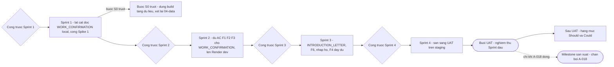

# Roadmap — Admin Service Desk Agent (BO-19)

**Phiên bản:** 0.4 · **Trạng thái:** Đã duyệt (PO, 2026-09-25) · **v0.2:** vòng duyệt Phase 12 — đối chiếu đủ `07-prompts.md`, `09-security.md` và mọi endpoint của `openapi.yaml`; tiêu chí loại yêu cầu thứ ba; owner nợ Phase 8 về Product Owner — mục ngày 2026-09-25 (vòng duyệt Phase 12) của `CHANGELOG.md` · **v0.3:** thứ tự cắt của Sprint 1 và phần an ninh không được cắt (R1-2), cổng 2.8, Open Questions sau khi PO trả lời — mục ngày 2026-09-25 (duyệt Phase 12) của `CHANGELOG.md` · **v0.4:** đợt sửa A-068, A-073, A-075 — cổng 2.3 và 3.6 đạt, AC của F6 thêm biện pháp bù của A-076, tiêu chí T6 bỏ — mục ngày 2026-09-25 (đợt sửa A-068, A-073, A-075) của `CHANGELOG.md`

> File này xếp phạm vi Must của PRD thành các sprint có thứ tự, mỗi sprint có Objective, Deliverable, Dependency, Acceptance Criteria và rủi ro chính, kèm các cổng phải qua trước từng sprint. File này **không** khai lại mức MoSCoW (nguồn duy nhất: mục Scope & priority của `01-prd.md`), **không** đặt ngày hay ước lượng khối lượng (A-071), **không** thiết kế lại bất cứ thứ gì đã chốt, và **không** giải hộ các giả định của phase khác — chỉ đặt chúng vào đúng cổng.

Tên entity, trạng thái, permission, agent, node, tool, component dùng đúng `GLOSSARY.md`. Quyết định `D-xxx`/`A-xxx` tham chiếu `00-domain.md` và `ASSUMPTIONS.md`.

**Đã đối chiếu:** `CLAUDE.md`, `_PLAN.md`, `GLOSSARY.md`, `ASSUMPTIONS.md`, `CHANGELOG.md`, `00-domain.md`, `01-prd.md`, `02-architecture.md`, `03-agents.md`, `04-data.md`, `05-api.md`, `06-structure.md`, `07-prompts.md`, `08-hitl.md`, `09-security.md`, `10-eval.md`, `11-ops.md`, `contracts/openapi.yaml` (danh sách endpoint và nhãn `x-bo19-scope`), `decisions/ADR-001` → `ADR-024`, `.claude/commands/spike.md`, `tools/contract-checks/`.

---

## 1. Nguyên tắc xếp sprint

Quyết định của PO (2026-09-25):

- **Sprint 1 làm `WORK_CONFIRMATION`.** Người thụ hưởng mặc định là người tạo, nên lát cắt không đi qua đường nhập hộ (A-052). Chỉ hai slot `USER_INPUT` bắt buộc, không phụ thuộc trần hiệu lực A-011. Vẫn đi qua đủ **hai cổng HITL** vì `requires_seal` luôn đúng với loại này (mục Request Type Catalog của `00-domain.md`).
- **Sprint 1 chạy end-to-end ở local**; Render đến ở Sprint 2. Local cần một object storage nói giao thức S3 — A-072.
- **Spike 1 gộp vào Sprint 1**, thành một track riêng. Luật VERIFY MODE của `.claude/commands/spike.md` vẫn áp cho mọi thứ track đó viết ra.
- **Phase 8 giữ ☑.** Giả định còn mở của Phase 8 thành cổng theo sprint (mục 10), owner là **Product Owner** — Phase 8 đã đóng nên không còn ai khác quyết. Hạn của A-052 đổi thành "trước cổng Sprint 3".
- **A-073 theo hướng (a) — đã áp (2026-09-25):** ở lượt ngoài phạm vi, `route_intent` gọi tool chỉ đọc `procedure_store_status`; kho chưa sẵn sàng cho người đang chat thì không gọi `embed_query` mà trả hướng xử lý thủ công tất định (mục `intake_graph` của `03-agents.md`).
- **Không gắn ngày, không ước lượng khối lượng** — A-071.

Nguyên tắc xếp:

- **Mỗi sprint kết thúc bằng một thứ chạy được**, không bằng một tầng hạ tầng dựng xong.
- **"Sprint đầu" của PRD ≠ Sprint 1.** "Sprint đầu" là phạm vi phát hành đầu tiên, trải trên Sprint 1 → Sprint 4 (mục Thuật ngữ nghiệp vụ của `GLOSSARY.md`).
- **Phạm vi Sprint đầu theo contract:** mọi endpoint không mang `x-bo19-scope: Should` trong `openapi.yaml` là Sprint đầu (mục Nhãn phạm vi và loại trừ có chủ đích của `05-api.md`). Mục 9 đối chiếu từng endpoint với sprint; không endpoint Sprint đầu nào bị đẩy ra sau UAT.
- **Cổng là điều kiện, không phải việc.** Mỗi dòng cổng ghi nó **chặn khởi động** sprint hay **chặn AC**. Việc đóng giả định thuộc owner ở `ASSUMPTIONS.md`.
- **Không ADR mới.** Thứ tự sprint là quyết định sản phẩm (mục Tech stack của `CLAUDE.md`). Lựa chọn công nghệ duy nhất roadmap làm phát sinh — object storage cho local — được giao ADR ở A-072.

---

## 2. Tổng quan

| Sprint | Objective — một câu | Feature chạm tới |
|---|---|---|
| Sprint 1 | Một nhân viên đi trọn hành trình của `WORK_CONFIRMATION` trên máy local; Render được đo, chưa được dùng | F1, F2, F3, F4 — đường chính; NFR-01, NFR-03, NFR-05 |
| Sprint 2 | Mọi nhánh lệch khỏi đường chính của `WORK_CONFIRMATION` đều có đích; lát cắt chạy trên Render `dev` | F1, F2, F3 — nhánh lỗi, sửa, hết hạn; NFR-06 |
| Sprint 3 | Loại thứ hai, nhập hộ, và thêm loại thứ ba không cần sửa code | F1, F2 cho `INTRODUCTION_LETTER`; F6; F4 đầy đủ; NFR-02 |
| Sprint 4 | Bằng chứng nghiệm thu trên `staging`, đổi `operating_mode` có khoá môi trường, buổi UAT | NFR-03, NFR-07; mục Definition of Done của `01-prd.md` |

---

## 3. Cổng trước Sprint 1

| # | Điều kiện | Nguồn | Owner | Chặn |
|---|---|---|---|---|
| 1.1 | Anh tuyên bố chuyển sang BUILD MODE | Mục Chế độ làm việc hiện tại của `CLAUDE.md` | Anh | Khởi động |
| 1.2 | Phase 13 (Consistency Audit) xong và các lỗi nó tìm thấy đã có quyết định sửa hay không. Code bám vào tên; sửa tên sau khi có code đắt hơn nhiều | `_PLAN.md` | Anh | Khởi động |
| 1.3 | A-055 có quyết định: `audit_event` ghi cho thao tác nào | Hạn gốc của A-055: "trước khi viết code của `tool_layer`" | Product Owner | Khởi động |
| 1.4 | Có quyết định và ADR cho object storage chạy local | A-072 | Người triển khai | Khởi động |
| 1.5 | Chọn nhà cung cấp và model cho hai tier | A-026 — hạn gốc "trước khi viết adapter provider của `ai_gateway`" | Product Owner | AC — AC-1.1 cần lời gọi LLM thật |
| 1.6 | Mẫu `tpl_work_confirmation` `.docx` đúng thể thức, bộ font nó dùng, và quyền phân phối font trong image | A-058, mục Thể thức văn bản của `00-domain.md` | Product Owner | AC — không có mẫu thì không render; thiếu font thì `worker` không khởi động (bước kiểm khởi động #7) |
| 1.7 | Giá trị định dạng số và ký hiệu cho sổ, kể cả dải `TRIAL` | A-009 — hạn gốc "trước lần cấp số đầu tiên, kể cả số dải `TRIAL`" | Product Owner | AC — cấp số ở AC-1.2 |
| 1.8 | Giá trị `contract_type` và các cột CSV hồ sơ nhân viên | A-013 | Product Owner | AC — `contract_type` là slot bắt buộc của `WORK_CONFIRMATION` |
| 1.9 | Múi giờ của tổ chức | A-041 | Product Owner | AC — bước kiểm khởi động #13 chặn khi thiếu |
| 1.10 | Giá trị làm việc cho tham số vận hành chưa định cỡ — số lần retry, hạn chót lượt, ba lớp timeout, ngưỡng và độ dài cửa sổ rate limit đăng nhập. Được mang nhãn "chưa hiệu chỉnh", không được vắng | A-031; bước kiểm khởi động #5, #11; mục Rate limit của `09-security.md` | Người triển khai | AC |
| 1.11 | Giá trị làm việc cho tham số `argon2id` và thời hạn token phiên, nhãn "chưa hiệu chỉnh" | A-048, ADR-021 | Người triển khai | AC — đăng nhập ở AC-1.1 |

Trần token và trần số vòng **không** nằm ở đây — đã có giá trị khởi tạo ở mục Định cỡ A-022 của `11-ops.md`.

---

## 4. Sprint 1 — lát cắt dọc `WORK_CONFIRMATION`, local, cộng Spike 1

**Objective.** Một nhân viên đăng nhập, mô tả nhu cầu bằng chat, xác nhận hồ sơ, gửi; một cán bộ hành chính duyệt nội dung, ký, duyệt dấu, phát hành; nhân viên thấy `FULFILLED` và tải được bản PDF có watermark — toàn bộ trên máy local, với LLM thật. Song song, Spike 1 đo Render để Sprint 2 không phải đoán.

### 4.1 Track build — Deliverable

| Tầng | Deliverable | Ghi chú phạm vi |
|---|---|---|
| Dữ liệu | `migrate_main` chạy đủ bốn bước của mục Migration và checkpointer của `06-structure.md` trên PostgreSQL local, gồm `0001`–`0004`; data migration `0001_permission_catalog.sql`; data migration nạp cấu hình `WORK_CONFIRMATION`, một `document_register` và một phiên bản template `ACTIVE` | Cấu hình nạp bằng data migration — màn hình F6 ở Sprint 3. Danh mục biến của template nạp sẵn vẫn phải qua đúng phép kiểm lúc tải lên (mục Template của `04-data.md`) |
| Kiểm contract | Chạy `tools/contract-checks/check_grants.py --app-dsn` trên DB local đã migrate bằng `migrate_main` | Nhóm quyền của `employee_credential` và `rate_limit_window` đã bổ sung vào `check_grants.py` ở vòng duyệt Phase 12 |
| Vận hành seed | Nạp `employee` giả qua data migration; seed `employee_role`, `employee_credential` và một dòng `employee_permission_grant` cấp `document.sign` cho một `ADMIN_OFFICER` — bằng thao tác vận hành chạy `bo19_migrator` (mục AuthZ của `09-security.md`) | **Không** cấp `operating_mode.change` cho ai — lớp 1 của ADR-023 |
| Khởi động | `bo19.startup` với mọi bước ở mục Bước kiểm khởi động của `06-structure.md` áp cho `api` và `worker`, gồm #16–17 — lớp 2 của ADR-023 | `BO19_ENVIRONMENT = dev` |
| Xác thực | `POST /auth/session` (hash `argon2id`, một mã lỗi `INVALID_CREDENTIALS` cho cả sai mã lẫn sai mật khẩu), `DELETE /auth/session`, `GET /me`; rate limit đăng nhập bằng `rate_limit_window`, khoá theo IP, kiểm **trước** khi chạm `employee_credential` (mục Rate limit của `09-security.md`) | Local đọc IP từ kết nối trực tiếp; IP phía sau proxy của Render là A-062, Sprint 2 |
| `ai_gateway` | Lối vào duy nhất `call(module, inputs, budget_owner)`: kiểm allowlist fail-closed (INV-03), kiểm budget và ghi `llm_usage` (ADR-019), ép JSON theo hai nhánh năng lực provider và sửa lỗi parse đúng một lần (mục Chiến lược ép JSON và xử lý lỗi parse của `07-prompts.md`), adapter của provider đã chọn; enum output của P1 và P4 **sinh lúc gọi** từ catalog và danh mục biến của template, `catalog_fingerprint` trong log kỹ thuật (ADR-025) | Prompt module P1 `classify_intent`, P2 `extract_slots`, P4 `draft_free_content` — mỗi module khai input đích danh đúng mục Allowlist input của `03-agents.md`, có `prompt_module_version` |
| `intake_graph` | `load_turn` (luật `last_seen_request_status`) → `classify_intent` → `route_intent` (bảng ánh xạ output P1 → `intent_result`) → `open_request` → `extract_slots` → `propose_values` → `check_completeness` → `ask_missing`/`offer_submit` → `render_reply`; `request_slots_write` với kiểm bằng chứng `EVIDENCE_MISMATCH`; stream lượt chat | Nhánh `ask_clarification` có mặt vì `route_intent` cần đích cho `AMBIGUOUS`; nhánh ngoài phạm vi ở Sprint 2 |
| Thao tác của nhân viên | `request_slot_confirm`, `request_submit` | `request_cancel` ở Sprint 2 |
| `document_graph` | Job `render_document`: `draft_free_content` cho `purpose_statement` → `validate_free_content`, gồm ba kiểm an ninh của mục Output validation trước khi render của `09-security.md` → `render_draft` → `check_review_readiness` → `PENDING_APPROVAL`; `document_free_content` ghi `prompt_module_version`; resume qua `await_content_review`, `route_signing` (`render_integrity_check`, `signing_route` một cấp), `await_signature`, `await_seal`; job `finalize_issue` cấp số dải `TRIAL` | Nhánh `reopen_draft`, `halt_for_human` ở Sprint 2 — lỗi ở Sprint 1 làm job `FAILED`, chấp nhận vì chưa có người dùng thật |
| Thao tác cổng | `document_approve_content`, `document_sign`, `document_apply_seal`, `document_issue`; kiểm tách biệt trách nhiệm theo `beneficiary_employee_id` | `document_request_changes`, `document_reject` ở Sprint 2; đường thoát tự duyệt ở Sprint 3 |
| Tải file | `stored_file_fetch` — so checksum trước byte đầu tiên, `audit_event` mỗi lần tải; không URL công khai nào của `object_storage` (mục Chống lộ template mật của `09-security.md`) | Chỉ tải bản render; tải bản gốc template ở Sprint 3 |
| `client` | `/login`, `/chat`, `/my-requests` và `/my-requests/:requestId` (bảng xác nhận từng slot, nút gửi, tải bản `FINAL`), `/review/:status`, `/issue`, `/documents/:documentId` với provenance và hiển thị theo `slot_sensitivity` — `RES` ẩn theo mặc định, bấm để hiện; `PER` có huy hiệu (mục PII masking và hiển thị theo `slot_sensitivity` của `09-security.md`); dải báo chế độ thử nghiệm | Chưa có stream tín hiệu: người dùng tải lại trang để thấy trạng thái mới (Sprint 3) |
| `observability` | Handler mask duy nhất theo `slot_sensitivity`, `trace_id` theo ADR-024 | Bốn điểm đo của mục Log schema của `11-ops.md` ở Sprint 4 |

### 4.2 Track Spike 1 — Deliverable

Bảng bước, giả định cần đóng và luật riêng ở `.claude/commands/spike.md`; ở đây chỉ nêu thứ tự so với track build.

| Bước | Thứ tự so với track build |
|---|---|
| S0 — cổng | **Việc đầu tiên của Sprint 1**, trước mọi mã của `bo19.persistence` và `migrate_main`. Trượt thì áp luật "S0 là cổng" của `spike.md` cho **cả** track build ở tầng dữ liệu — rủi ro R1-1 |
| S1, S2 | Sau S0. S2 dùng lại `bo19.startup` bước #1, #2 của track build — một mã, không viết hai lần. S1 chạy `check_grants.py --app-dsn` trên Render |
| S3, S4 | Sau S2. Kết quả S4 là căn cứ cho hạn chót lượt (A-031) mà track build đang dùng giá trị tạm |
| S5 | Sau khi có mẫu và font (cổng 1.6) |
| S6 | Cần khoảng 50 đoạn văn bản hành chính tiếng Việt thật — nguồn do PO cấp |
| S7 | Cần danh sách ngắn nhà cung cấp do PO duyệt; spike không tự chọn nhà cung cấp |

### 4.3 Acceptance Criteria

| ID | Tiêu chí | Truy vết |
|---|---|---|
| AC-1.1 | Hành trình ở điều 1 của mục Definition of Done của `01-prd.md` chạy trọn cho `WORK_CONFIRMATION` trên local, với provider LLM thật và dữ liệu `employee` giả đánh dấu là giả | DoD điều 1 |
| AC-1.2 | Trên dữ liệu của lần chạy AC-1.1: có hai `decision_record` riêng loại `APPROVED` và `SEALED`, mỗi cái một `audit_event`; `document_number` lấy từ `document_register` thuộc dải `TRIAL` | M4, M5 — hình dạng; ngưỡng đo ở Sprint 4 |
| AC-1.3 | Bản `FINAL` mang watermark `BẢN THỬ NGHIỆM — KHÔNG CÓ GIÁ TRỊ PHÁP LÝ` **trong file**; nhân viên chỉ tải được `pdf` bản `FINAL` sau `ISSUED`; tải `docx` hay bản nháp trả lỗi quyền | NFR-03, mục Tải file của `05-api.md` |
| AC-1.4 | `request_submit` trả `REQUEST_NOT_READY` khi còn một giá trị `HR_PROFILE` chưa xác nhận, kể cả khi mọi giá trị khác đã xác nhận | F1 — định nghĩa "Yêu cầu đủ điều kiện xử lý" |
| AC-1.5 | Màn hình duyệt hiện `source` và `synced_at` cho mọi giá trị `HR_PROFILE` có trong văn bản; giá trị `RES` không hiện khi tải trang, chỉ hiện sau khi bấm | F2; mục PII masking và hiển thị theo `slot_sensitivity` của `09-security.md` |
| AC-1.6 | `check_grants.py --app-dsn` trên DB local đã migrate bằng `migrate_main`: `Lệch: 0`, mã thoát `0` | Mục Nguyên tắc dữ liệu của `04-data.md` |
| AC-1.7 | `api` khởi động bằng credential của `bo19_migrator` bị chặn ở bước kiểm khởi động #2; thiếu `BO19_ENVIRONMENT` bị chặn ở #16; DB có `operating_mode` hiện hành là `PRODUCTION` với `BO19_ENVIRONMENT = dev` bị chặn ở #17; khởi động bằng `bo19_app` với cấu hình đúng qua đủ các bước | Mục Bước kiểm khởi động của `06-structure.md`; ADR-023 lớp 2 |
| AC-1.8 | Một giá trị `RES` đánh dấu nhập vào `purpose` trong lần chạy AC-1.1 không xuất hiện dạng thật trong log kỹ thuật của lần chạy đó | NFR-05 |
| AC-1.9 | Gọi `ai_gateway` với một khoá input không có trong danh sách tự khai của module — thừa hay thiếu — bị từ chối với `ALLOWLIST_REJECTED`, không có lời gọi nào tới provider. Trong lần chạy AC-1.1, tập khoá gửi đi của `draft_free_content` đúng bằng `purpose`, `variable_guidance`, `request_type` | NFR-05; INV-03; ADR-008 |
| AC-1.10 | Vượt ngưỡng rate limit trong một cửa sổ thì `POST /auth/session` trả `RATE_LIMITED` mà không kiểm mật khẩu; sai mã nhân viên và sai mật khẩu trả cùng `INVALID_CREDENTIALS` | Mục AuthN và mục Rate limit của `09-security.md` |
| AC-1.11 | Đưa thẳng vào `validate_free_content` một đầu ra giả chứa cú pháp trường của template, và một đầu ra giả chứa nguyên văn giá trị của một slot `RES` khác: cả hai trượt | Mục Output validation trước khi render của `09-security.md` |
| AC-1.12 | CI đỏ khi vi phạm luật import (`import-linter`, ESLint) — chứng minh bằng một vi phạm cố ý | Mục Luật import của `06-structure.md` |
| AC-1.13 | Mỗi bước S0–S7 có kết quả ghi vào `ASSUMPTIONS.md` và `CHANGELOG.md` theo luật của `spike.md`: số đo nguyên văn, hoặc ghi rõ không chạy được và vì sao. Không bước nào ghi "đạt" khi không chạy | Spike 1 |

### 4.4 Rủi ro chính

- **R1-1 — S0 trượt giữa sprint.** Nếu Render không cho role runtime không sở hữu bảng hoặc không cho migrate bằng role khác, mô hình hai role của `04-data.md` phải xét lại. Đặt S0 làm việc đầu tiên giới hạn thiệt hại ở phần chưa bắt đầu; phần ngoài tầng dữ liệu (`intake_graph`, `ai_gateway`, `client`) không phụ thuộc kết quả S0.
- **R1-2 — Sprint 1 gánh hai track với năng lực chưa biết** (A-071). Nếu phải cắt, cắt theo thứ tự dưới đây, hết bậc trên mới sang bậc dưới. Mọi thứ bị cắt chuyển sang Sprint 2, và AC tương ứng của Sprint 1 ghi rõ phần đã cắt thay vì âm thầm hạ chuẩn.

  | Thứ tự cắt | Hạng mục | Điều kiện nếu cắt |
  |---|---|---|
  | 1 | S5, S6, S7 của Spike 1 | Đầu ra là đầu vào của Sprint 2, không phải của AC Sprint 1 |
  | 2 | S3, S4 của Spike 1 | Hạn chót lượt (A-031) giữ giá trị tạm tới khi có số đo |
  | 3 | `GET …/messages` và việc dựng lại lượt khi stream đứt | Local hiếm đứt stream; phải có trước cổng Sprint 2 |
  | 4 | Trang danh sách `/my-requests` — giữ trang chi tiết `/my-requests/:requestId` | — |
  | 5 | Dải báo chế độ thử nghiệm trên `client` | Watermark **trong file** không thuộc hạng mục này và không được cắt |
  | 6 | Rate limit đăng nhập — phần rate limit của AC-1.10 | **An ninh, cắt có điều kiện:** local không lộ ra mạng; phải có trước cổng Sprint 2 (cổng 2.8), tức trước lần đầu hệ thống nhận request từ ngoài máy người triển khai |
  | 7 | `RES` ẩn theo mặc định trên màn hình duyệt — phần hiển thị của AC-1.5 | **An ninh, cắt có điều kiện:** Sprint 1 chỉ có dữ liệu giả trên một máy; phải có trước cổng Sprint 2 (cổng 2.8) |

  **Không được cắt, kể cả khi phải cắt hết bảng trên** — S0, S1, S2, hành trình AC-1.1, và mọi phần an ninh dưới đây. Lý do chung: chúng hoặc là bất biến của thiết kế, hoặc định hình cách viết mọi mã đến sau, nên thêm vào sau nghĩa là viết lại chứ không phải bổ sung.

  | Phần an ninh | Vì sao không cắt |
  |---|---|
  | Allowlist fail-closed của `ai_gateway` (AC-1.9) | Sprint 1 gọi provider LLM **thật**: không có allowlist thì dữ liệu ra bên thứ ba ngay từ lời gọi đầu tiên (NFR-05, INV-03) |
  | Handler mask duy nhất theo `slot_sensitivity` (AC-1.8, bước kiểm khởi động #10) | Log viết ra trước khi có handler là log đã lộ, không mask lại được |
  | Chạy runtime bằng `bo19_app`; bước kiểm khởi động #2; `check_grants.py` (AC-1.6, AC-1.7) | Bất biến của dữ liệu đứng bằng quyền DB (mục Nguyên tắc dữ liệu của `04-data.md`); mã viết quen dưới quyền rộng hơn sẽ vỡ khi siết |
  | Kiểm permission fail-closed ở `tool_layer`, chặn theo `beneficiary_employee_id` (D-006) | Mọi thao tác ghi đi qua đây; thêm sau là sửa mọi tool |
  | Hai cổng HITL là hai endpoint, hai `decision_record` | NFR-01 — bất biến của mục Bối cảnh đề tài của `CLAUDE.md` |
  | Watermark trong file, dải `TRIAL`, ghim `operating_mode` (AC-1.2, AC-1.3) | NFR-03, D-009 — văn bản sinh thiếu chúng là văn bản trông như thật |
  | Lớp 1 và lớp 2 của ADR-023 — không cấp `operating_mode.change`, bước kiểm khởi động #16–17 | Rẻ, và là thứ duy nhất giữ `dev` ở `NON_PRODUCTION` trước khi có endpoint đổi chế độ |
  | `argon2id` và một mã `INVALID_CREDENTIALS` (phần còn lại của AC-1.10) | Mật khẩu seed lưu ở dạng khác lúc đầu là một đợt migrate credential về sau |
  | `stored_file_fetch` có kiểm quyền và checksum, không URL công khai (AC-1.3) | Đường tải file là đường rò template và bản render (mục Chống lộ template mật của `09-security.md`) |
  | Ba kiểm an ninh của `validate_free_content` (AC-1.11) | Nằm trên đường tới bản render; trượt không có chúng là nội dung LLM chèn cú pháp vào `.docx` |
- **R1-3 — Local khác image Linux.** Mục Xác minh contract của `06-structure.md` ghi máy triển khai chạy PostgreSQL bản Windows và Docker Desktop không khởi động được. Font, `soffice`, object storage local và IP client đều có thể khác Render. AC-1.1 đạt ở local **không** chứng minh lát cắt đạt trên Render — đó là AC-2.1.
- **R1-4 — Đầu vào của PO về muộn** (cổng 1.5–1.9). Chúng chặn AC, không chặn khởi động; nhưng AC-1.1 không đạt được bằng dữ liệu giả thay cho mẫu `.docx` hay định dạng số thật.

---

## 5. Sprint 2 — đủ AC F1–F3 cho `WORK_CONFIRMATION`, lên Render `dev`

**Objective.** Mọi nhánh lệch khỏi đường chính của `WORK_CONFIRMATION` đều có một đích có tên — sửa, từ chối, dừng có kiểm soát, hết hạn, huỷ, ngoài phạm vi — và lát cắt của Sprint 1 chạy trên Render `dev`.

### 5.1 Cổng trước Sprint 2

| # | Điều kiện | Nguồn | Chặn |
|---|---|---|---|
| 2.1 | S0 của Spike 1 đạt, hoặc đã có quyết định thay kiến trúc dữ liệu | `spike.md`, AC-1.13 | Khởi động |
| 2.2 | A-029, A-034, A-038, A-044, A-053 có quyết định | Mục 10 | Khởi động |
| 2.3 | ~~Đợt sửa `03-agents.md` cho A-068 và A-073 hướng (a) đã áp~~ **Đã đạt** — áp 2026-09-25 | A-068, A-073 | — |
| 2.4 | Thời hạn chờ ở `NEEDS_INFO` trước `EXPIRED` có giá trị làm việc | A-014 | AC-2.7 |
| 2.5 | Chọn nhà cung cấp object storage | A-024, kết quả S7 | AC-2.1 |
| 2.6 | Ba vế secret của CI | A-067 | AC-2.1 |
| 2.7 | Cách đọc IP thật của client phía sau proxy Render | A-062 | AC-2.9 |
| 2.8 | Nếu Sprint 1 đã cắt bậc 3, 6 hoặc 7 ở R1-2: các hạng mục đó đã có | R1-2 | Khởi động — trước lần đầu hệ thống nhận request từ ngoài máy người triển khai |

### 5.2 Deliverable

- **Vòng sửa và từ chối:** `document_request_changes` cả hai `change_scope`; `reopen_draft`, `compute_targets`, P5 `revise_free_content` với `previous_statement` và `change_reason` chỉ tới biến trong `change_targets` (mục P5 `revise_free_content` của `07-prompts.md`); gửi lại ở ca `SLOT_DATA` qua `request_submit`; `document_reject` — theo mục Luồng yêu cầu sửa và agent làm lại của `08-hitl.md`.
- **Dừng có kiểm soát:** mọi đường vào `halt_for_human` ở mục Cơ chế dừng khi chạm trần của `08-hitl.md`, gồm JSON hỏng lần hai và `BUDGET_EXCEEDED`; `document_halt_record`; banner `halted` trên `/documents/:documentId`; nhánh `VOIDED` của `finalize_issue`.
- **Hết hạn và huỷ:** cron `expire_request` với số phận dữ liệu theo `slot_sensitivity` (A-014); `prior_attempt_lookup`; `checkpoint_purge`; `request_cancel`.
- **Hội thoại:** EC-CV-01 → EC-CV-04; `ask_clarification` với luật đặt lại đúng một lần (A-068); `MULTIPLE` qua `secondary_intent` (EC-CV-01); khuôn riêng cho loại `KNOWN_UNSUPPORTED` — nêu tên loại, liệt kê mọi loại đang hỗ trợ (EC-WC-03, EC-CV-03); nhánh ngoài phạm vi khi `procedure_store_status` trả `NOT_READY` — không gọi `embed_query`, trả hướng xử lý thủ công tất định và nói rõ kho không có căn cứ (A-073); bổ sung dữ liệu cho ca `SLOT_DATA` qua chính hội thoại. Luật ở mục `intake_graph` của `03-agents.md`.
- **Render `dev`:** CI pipeline chạy `migrate_main` rồi mới trigger deploy (ADR-022); Web Service, Background Worker, Cron Job từ **một** image (ADR-015); `check_grants.py --app-dsn` chạy sau migrate trong CI; secret riêng cho môi trường, credential `bo19_migrator` chỉ có ở CI, không ở biến môi trường của `api` hay `worker` (mục Secret management trên Render của `09-security.md`).
- **Rate limit trên Render:** khoá theo IP đọc đúng theo A-062; cron dọn `rate_limit_window` (mục Rate limit của `09-security.md`, mục Background worker & Cron của `11-ops.md`).
- **Harness eval:** schema `EvalCase` ở mục `EvalCase` của `10-eval.md`; các nhóm chạy được với `WORK_CONFIRMATION`; canary C1, C2; ca kiểm cơ chế K1, K2 (mục Ca kiểm cơ chế graph của `10-eval.md`). Kết quả **không kết luận được** trước khi A-023 đóng — ghi rõ trong mọi báo cáo chạy.

### 5.3 Acceptance Criteria

| ID | Tiêu chí | Truy vết |
|---|---|---|
| AC-2.1 | AC-1.1, AC-1.3, AC-1.7 đạt lại trên Render `dev` | DoD điều 1; R1-3 |
| AC-2.2 | Yêu cầu sửa `FREE_CONTENT` chỉ sinh lại biến trong `change_targets`; `request` ở nguyên `IN_REVIEW`; `change_reason` không tới lời gọi nào của biến ngoài `change_targets` | F3; ADR-009; mục P5 `revise_free_content` của `07-prompts.md` |
| AC-2.3 | Chạm trần `R` vòng `CHANGES_REQUESTED`, và chạm trần token đặt thấp có chủ đích: `document` dừng ở `halt_for_human`, không vào `PENDING_APPROVAL` với biến rỗng, có dòng `document_halt` | NFR-06 |
| AC-2.4 | Hai lệnh phát hành đồng thời không nhận cùng số; lỗi sau khi có số chuyển số sang `VOIDED` kèm lý do và không tái sử dụng | F3 |
| AC-2.5 | Canary C1 và C2: không tìm thấy giá trị đánh dấu trong bảng checkpoint | Mục Canary suite của `10-eval.md` |
| AC-2.6 | Yêu cầu ngoài phạm vi khi `procedure_store_status` trả `NOT_READY` được báo chưa hỗ trợ và **nói rõ kho không có căn cứ**; `llm_usage` của lượt đó không có dòng `embed_query` | F1; M6; A-073 |
| AC-2.7 | EC-CV-04 cả hai nhánh: quay lại trong hạn khôi phục đúng slot đã thu; quay lại sau `EXPIRED` báo đã hết hạn, không dùng lại dữ liệu cũ, slot `RES` đã bị xoá | F1; A-014 |
| AC-2.8 | EC-CV-01 và EC-CV-02: hai nhu cầu thành hai `request` xử lý tuần tự; đổi loại giữa chừng không mang slot nào sang; một phiên có nhiều `request` nối tiếp không bị chuyển sang khuôn liên hệ trực tiếp chỉ vì bộ đếm làm rõ cộng dồn; K1 và K2 đạt | F1; nhóm G; A-068 |
| AC-2.9 | Rate limit đăng nhập trên Render khoá đúng IP của client, không khoá chung IP của proxy | A-062 |
| AC-2.10 | Yêu cầu mà `classify_intent` nhận ra là một loại `KNOWN_UNSUPPORTED` nhận khuôn riêng: nêu tên loại chưa hỗ trợ, liệt kê mọi loại đang hỗ trợ, kèm hướng xử lý thủ công; không `request` nào được mở | F1; EC-WC-03; EC-CV-03; mục `intake_graph` của `03-agents.md` |

### 5.4 Rủi ro chính

- **R2-1 — Nợ Phase 8 chưa quyết kịp** (cổng 2.2). Năm giả định, mỗi cái chạm một nhánh của Sprint 2. Quyết từng phần thì Sprint 2 bắt đầu được với các nhánh đã có quyết định.
- **R2-2 — A-024 chưa chọn.** Không có nhà cung cấp thì không có Render `dev` đầy đủ; bất biến bản render ở tầng lưu trữ tiếp tục chỉ được chứng minh trên sản phẩm local (A-072 hệ quả 2).
- **R2-3 — A-062 không xác minh được.** Rate limit khi đó chỉ còn là gờ giảm tốc (mục Rate limit của `09-security.md`) — không chặn Sprint 2, nhưng phải ghi rủi ro trước khi lên `PRODUCTION`.
- **R2-4 — Harness chạy mà không kết luận được** (A-023). Rủi ro là đội đọc kết quả "đạt" trên đáp án chưa duyệt như thể đã nghiệm thu.

---

## 6. Sprint 3 — `INTRODUCTION_LETTER`, F6, nhập hộ, F4 đầy đủ

**Objective.** Loại yêu cầu thứ hai chạy bằng cấu hình và mẫu, nhập hộ chạy đúng ở cả hai loại, và một loại thứ ba được thêm vào mà không sửa code — diễn tập điều 4 của mục Definition of Done của `01-prd.md` trước UAT.

### 6.1 Cổng trước Sprint 3

| # | Điều kiện | Nguồn | Chặn |
|---|---|---|---|
| 3.1 | A-052 có quyết định — hạn của chính nó | Mục 10 | Khởi động |
| 3.2 | A-056 có quyết định | Mục 10 | AC-3.8 |
| 3.3 | Trần `copies_count` và trần hiệu lực giấy giới thiệu | A-011 | AC-3.1 |
| 3.4 | Mẫu `tpl_introduction_letter` `.docx` và font của nó | A-058 | AC-3.1 |
| 3.5 | PO chọn loại yêu cầu thứ ba theo tiêu chí ở mục 8, và có mẫu của nó | A-074 | AC-3.2 |
| 3.6 | ~~Output contract của P1 `classify_intent` nhận được mã `request_type` mới mà không sửa code~~ **Đã đạt** — ADR-025, áp 2026-09-25 | A-075 | — |
| 3.7 | Chọn embedding model | A-028; A-073 | AC-3.7 — nhánh có kho của nhóm J |

### 6.2 Deliverable

- **`INTRODUCTION_LETTER`:** P4 cho `work_content_statement`; EC-IL-01 → EC-IL-03, gồm `requires_seal` và `bearer_national_id` theo `recipient_org`.
- **Nhập hộ và tách biệt trách nhiệm:** theo quyết định A-052 ở cả hai loại; đường thoát tự duyệt đủ bốn điều kiện; `GET /self-approvals`, `GET /audit-events`; `/audit`, `/audit/self-approvals`.
- **F6 — template:** `template_create`, `template_version_upload` với các phép kiểm lúc tải lên — đủ biến bắt buộc, input của biến nội dung tự do chỉ là slot `USER_INPUT` của đúng `request_type`, font có trong image — và `audit_event` khi danh sách input đổi (mục Phiên bản và thay đổi của `07-prompts.md`); `template_version_activate`; tải bản gốc chỉ cho `template.manage`.
- **F6 — hồ sơ và cấu hình:** `employee_import`; `request_type_upsert` — **từ chối đặt `SUPPORTED` khi `example_phrases` rỗng** (A-076), `slot_definition_upsert`, xem trước và thực hiện `slot_sensitivity_change`; seed `employee_permission_grant` cho `request_type.manage`, `procedure.manage`, `procedure.read_all` bằng thao tác vận hành.
- **F6 — kho quy trình:** `procedure_version_upload`, job `procedure_ingest` với E2 `embed_corpus_chunk`, `procedure_version_deactivate`; `procedure_retrieval` với bộ lọc quyền trong SQL theo `department_scope` và `procedure.read_all` (mục AuthZ của `09-security.md`); nhánh có kho: E1 `embed_query` → P3 `select_procedure_passages` chỉ chọn id, hiển thị nguyên văn có trích nguồn (mục Prompt injection của `09-security.md`).
- **F4 đầy đủ:** stream tín hiệu `GET /signals` với ba chủ đề `REVIEW_QUEUE`, `MY_REQUESTS`, `NOTIFICATIONS`; `notification_send` và `GET /notifications`; `/requests` sắp chờ lâu nhất trước; `status_label` tiếng Việt.
- **Eval:** đủ 37 ca chạy được trên harness, nhóm J trên kho quy trình giả lập đánh dấu là dữ liệu giả; mở rộng theo công thức dẫn xuất của NFR-07 cho loại thứ ba.

### 6.3 Acceptance Criteria

| ID | Tiêu chí | Truy vết |
|---|---|---|
| AC-3.1 | AC-1.1 đạt cho `INTRODUCTION_LETTER` trên Render `dev`; ca EC-IL-03 không vào hàng đợi duyệt khi thiếu `bearer_national_id` | F1, F2; DoD điều 2 |
| AC-3.2 | Thêm loại yêu cầu thứ ba trên `dev` chỉ bằng `request_type_upsert`, `slot_definition_upsert` và một phiên bản template — không commit mã, không deploy lại — rồi đi trọn hành trình của nó, kể cả được `classify_intent` nhận ra. **Biện pháp bù của A-076:** loại đó có `example_phrases`; `request_type_upsert` từ chối `SUPPORTED` khi `example_phrases` rỗng — chứng minh bằng một lần thử cố ý; lần đi trọn hành trình trên `dev` chính là lần **diễn tập thủ công** trước khi loại được đặt `SUPPORTED` ở `staging`, có người ghi kết quả | F6 — AC cứng; DoD điều 4 (diễn tập); A-076 |
| AC-3.3 | Tải lên template thiếu biến bắt buộc bị từ chối, nêu đúng tên biến thiếu; khai một slot `HR_PROFILE` làm input của biến nội dung tự do bị từ chối; văn bản đã render ghi lại phiên bản template đã dùng | F6; mục Catalog prompt module của `07-prompts.md` |
| AC-3.4 | Import CSV ghi `source`, `synced_at` cho từng bản ghi và một `audit_event` cho đợt | F6 |
| AC-3.5 | Nhập hộ: người thụ hưởng khác người tạo được ghi đúng vào `request.beneficiary_employee_id`; người duyệt trùng **người thụ hưởng** bị chặn; cán bộ nhập hộ cho người khác rồi tự duyệt thì **không** bị chặn | NFR-02; D-006; A-052 |
| AC-3.6 | Tự duyệt chỉ đi qua khi đủ bốn điều kiện; thiếu một thì bị từ chối | NFR-02 |
| AC-3.7 | 37 ca của NFR-07 chạy hết trên harness, mỗi ca có bản ghi kết quả gắn phiên bản prompt module, template và commit; `procedure_retrieval` không trả đoạn nào ngoài quyền của người đang chat | NFR-07; mục Offline eval của `10-eval.md`; mục AuthZ của `09-security.md` |
| AC-3.8 | Ở `NEEDS_INFO` và `CHANGES_REQUESTED`, trang chi tiết nêu thiếu gì hoặc cần sửa gì; trạng thái `request` và trạng thái `document` hiển thị riêng; không mã trạng thái trần nào lộ ra trang của nhân viên | F4; NFR-04 |

### 6.4 Rủi ro chính

- **R3-1 — Loại thứ ba không đi được bằng cấu hình.** Loại được chọn đòi năng lực ngoài Sprint đầu (A-074) thì AC-3.2 trượt vì phạm vi, không vì F6 hỏng. Lý do thứ hai của bản trước — output contract của P1 khoá cứng danh sách mã (A-075) — đã giải bằng ADR-025. Còn lại một rủi ro mới cùng họ: thêm loại làm P1 phân loại sai loại đã có, mà regression gate không bắt (A-076).
- **R3-2 — Quyết định A-052 chạm danh mục permission** (phương án (b) của A-052 sửa nghĩa `request.read_own`) — kéo theo quyền tải bản `FINAL` và chủ đề `MY_REQUESTS`, đều đã có mã từ Sprint 1 và Sprint 3.
- **R3-3 — F6 là sprint rộng nhất.** Nếu phải cắt trong F6, giữ đường thêm loại thứ ba (AC-3.2) trước, kho quy trình sau — kho rỗng là trạng thái được hỗ trợ (A-027), còn AC-3.2 là điều kiện nghiệm thu.

---

## 7. Sprint 4 — sẵn sàng UAT trên `staging`

**Objective.** Có bằng chứng cho từng điều của mục Definition of Done của `01-prd.md`, trên `staging`; đổi `operating_mode` là một hành động có người chịu trách nhiệm và bị khoá theo môi trường; chạy buổi UAT.

### 7.1 Cổng trước Sprint 4

| # | Điều kiện | Nguồn | Chặn |
|---|---|---|---|
| 4.1 | Đáp án chuẩn 37 ca đã được Trưởng phòng Hành chính duyệt | A-023 | AC-4.1 |
| 4.2 | Ba con số của buổi UAT: số người, số ca kịch bản, ai chấm | A-020 | AC-4.3 |
| 4.3 | Ngưỡng metric Cảnh báo đã chốt **trước** khi đo | A-019 | AC-4.3 |

### 7.2 Deliverable

- Môi trường `staging` theo mục Môi trường Render của `11-ops.md`.
- **Đổi `operating_mode` — ADR-020 và lớp 3 của ADR-023:** `POST /operating-mode/transitions` với `operating_mode_transition`; từ chối chuyển sang `PRODUCTION` khi `BO19_ENVIRONMENT ≠ prod` bằng `operating_mode_transition_reject`, mã `ENVIRONMENT_NOT_ALLOWED`, `audit_event` mức `WARNING`; `GET /operating-mode/transitions`. Ba lớp của ADR-023 đủ mặt từ đây — lớp 1 và lớp 2 đã có từ Sprint 1.
- Regression gate trong CI theo mục Regression gate của `10-eval.md`: nhóm tương đương Bất biến chặn merge, nhóm tương đương Cảnh báo chỉ ghi.
- Log schema và bốn điểm đo mới của mục Log schema của `11-ops.md`; alert cứng của mục Alert của `11-ops.md`.
- Kịch bản UAT theo A-020; loại yêu cầu thứ ba và mẫu của nó sẵn sàng để thêm **trong** buổi UAT.

### 7.3 Acceptance Criteria

| ID | Tiêu chí | Truy vết |
|---|---|---|
| AC-4.1 | M8, M4, M5, M6 đạt ngưỡng tuyệt đối trên 37 ca có đáp án đã duyệt và trên dữ liệu buổi UAT | DoD điều 3 |
| AC-4.2 | Regression gate chặn merge khi một ca nhóm G, nhóm J hoặc canary lệch — chứng minh bằng một thay đổi cố ý làm lệch | Mục Regression gate của `10-eval.md` |
| AC-4.3 | M1, M2, M3 được ghi đủ tử số và mẫu số; không đạt ngưỡng thì mở rà soát, không trượt nghiệm thu | Mục Goals & metrics của `01-prd.md` |
| AC-4.4 | Trong buổi UAT, loại yêu cầu thứ ba được thêm bằng cấu hình và một file template, không sửa code — loại đó đã qua diễn tập thủ công ở AC-3.2 trước khi sang `SUPPORTED` trên `staging` (A-076) | DoD điều 4 |
| AC-4.5 | Hành trình của AC-1.1 cho cả hai loại chạy trên `staging` với người thật thao tác | DoD điều 1, điều 2 |
| AC-4.6 | Trên `staging`, người có `operating_mode.change` gọi chuyển sang `PRODUCTION` nhận `ENVIRONMENT_NOT_ALLOWED`, có `audit_event` mức `WARNING`, `operating_mode` không đổi; trên `staging` và `dev` không nhân viên nào mang `operating_mode.change` | NFR-03; ADR-023 lớp 1 và 3 |

AC-4.1 → AC-4.5 cùng đạt là **Sprint đầu done** theo mục Definition of Done của `01-prd.md`. AC-4.6 là nghĩa vụ của NFR-03, không phải điều kiện của DoD. M7 và milestone sản xuất không thuộc điều kiện này.

### 7.4 Rủi ro chính

- **R4-1 — A-023 là đường găng không thuộc đội kỹ thuật.** Ba trong bốn metric Bất biến không chấm được khi chưa có đáp án chuẩn; không có cách kỹ thuật nào rút ngắn việc duyệt 37 ca.
- **R4-2 — RISK-03 vẫn vô hình.** Buổi UAT đo được M3 nhưng không đo được việc nhân viên bỏ hệ thống quay lại email; đó là M7, chỉ đo được sau milestone sản xuất.

---

## 8. Loại yêu cầu thứ ba — tiêu chí và ứng viên (A-074)

**Tiêu chí — chỉ dùng năng lực đã có trong Sprint đầu.** Ứng viên phải đạt **mọi** dòng; trượt một dòng là loại.

| # | Tiêu chí | Vì sao — năng lực nào của Sprint đầu nó dựa vào |
|---|---|---|
| T1 | Artifact là `document`, `artifact_kind = DOCUMENT` | Máy trạng thái `room_booking` là `[Should]`; `seal_action` độc lập là `[Could]` |
| T2 | Người duyệt nội dung là `ADMIN_OFFICER`; ký một cấp bởi người được cấp lẻ `document.sign` | `SIGNER` và định tuyến nhiều cấp là `[Should]` — loại trừ `BUSINESS_TRIP_ORDER` |
| T3 | Không cần tầng phê duyệt nào ngoài hai cổng HITL | Loại trừ `INCOME_CONFIRMATION` (mục Hai loại `[ĐỀ XUẤT]` của `00-domain.md`) |
| T4 | Mọi slot có nguồn `USER_INPUT`, `HR_PROFILE` hoặc `SYSTEM`; slot `HR_PROFILE` chỉ lấy cột **đã có** của `employee` | `UPLOAD` đi cùng `SEAL_REQUEST` `[Could]`; `RESOURCE_CATALOG` đi cùng `ROOM_BOOKING` `[Should]`; cột mới của `employee` là migration, tức sửa code |
| T5 | `data_type` của slot nằm trong tập đã có ở `slot_definition`; rule kiểm khai được bằng `validation_rules` | Mục Cấu hình loại yêu cầu và slot schema của `04-data.md` |
| T6 | ~~**Không có biến nội dung tự do**, hoặc có thì chỉ khi A-075 đã giải cho cả P4~~ **Bỏ** sau ADR-025 — enum `variable_name` của P4/P5 nay sinh lúc gọi. Giữ ID để tham chiếu cũ không gãy | — |
| T7 | Dùng một `document_register` đã có | Tạo sổ mới không có endpoint — mục Không có endpoint vì chưa có thao tác của `05-api.md` |
| T8 | Mẫu `.docx` chỉ dùng font đã có trong `fonts/` | Thêm font là build lại image, tức deploy lại (ADR-015, A-058) |
| T9 | Ý định phân biệt rõ với `WORK_CONFIRMATION` và `INTRODUCTION_LETTER` bằng từ ngữ thông dụng | Loại mới vào `request_type_catalog` làm nhóm G của bộ eval khó hơn (NFR-07 mở rộng theo công thức); một loại dễ lẫn đẩy thẳng rủi ro M8 vào buổi UAT |
| T10 | Phòng Hành chính của tổ chức **thật sự đang phát hành** loại văn bản này | Bài học của A-015: loại `[ĐỀ XUẤT]` chưa xác nhận là có thật không chứng minh được gì ở UAT |

**Hai ứng viên** — đều `[ĐỀ XUẤT]`, T10 chưa kiểm; căn cứ pháp lý và mẫu của cả hai `[CẦN XÁC MINH]`, chưa có bản gốc trong `docs/reference/`.

| | Ứng viên 1 — Giấy đi đường | Ứng viên 2 — Giấy mời họp gửi đối tác |
|---|---|---|
| Slot `USER_INPUT` | Nơi đến, `valid_from`, `valid_to`, phương tiện (`ENUM`) | Đơn vị được mời (`recipient_org`), thời gian (`TIMESTAMP`), địa điểm (`STRING`), nội dung cuộc họp (`TEXT`, điền thẳng vào template, không qua LLM) |
| Slot `HR_PROFILE` | `full_name`, `job_title`, `department_name` | `full_name`, `job_title` của người mời |
| Biến nội dung tự do | Không | Không |
| `requires_seal` | Có | Có |
| Điểm mạnh | Không có văn bản tự do nào dài — gần như thuần điền biến; từ ngữ "giấy đi đường" khác hẳn hai loại đang có | Là văn bản đối ngoại nhân viên thật sự cần; kiểm thêm một kiểu slot chưa loại nào dùng (`TIMESTAMP`) |
| Điểm yếu | Thường đi kèm một quyết định cử đi công tác — tổ chức có phát hành riêng lẻ hay không là T10 | Dễ lẫn với `ROOM_BOOKING` (`KNOWN_UNSUPPORTED`) khi nhân viên nói "tôi cần tổ chức họp" — đúng dạng EC-CV-03, tăng tải cho M8 |

Cả hai đều có dấu, nên không ứng viên nào đi nhánh `SIGNED → ISSUED` khi `requires_seal = false` — nhánh đó của máy trạng thái vẫn chưa loại nào dùng tới trong Sprint đầu.

---

## 9. Endpoint → sprint

Mọi cặp method–path của `openapi.yaml`, và sprint đầu tiên dựng nó. Endpoint mang `x-bo19-scope: Should` ở dòng cuối.

| Endpoint | Sprint |
|---|---|
| `POST`, `DELETE /auth/session` · `GET /me` | 1 |
| `POST /chat-sessions` · `GET /chat-sessions/{chat_session_id}` · `GET …/messages` · `POST …/turns` | 1 — `GET …/messages` là đường dựng lại lượt khi stream đứt (mục SSE của `05-api.md`) |
| `GET /requests` (`scope=OWN`) · `GET /requests/{request_id}` · `POST …/confirm-slots` · `POST …/submit` | 1 |
| `GET /requests` (`scope=ALL`, `ASSIGNED`) | 3 |
| `POST /requests/{request_id}/actions/cancel` | 2 |
| `GET /review-queue` · `GET /issue-queue` · `GET /documents/{document_id}` | 1 |
| `POST /documents/{document_id}/actions/approve-content`, `sign`, `apply-seal`, `issue` | 1 |
| `POST /documents/{document_id}/actions/request-changes`, `reject` | 2 |
| `GET /documents/{document_id}/renders/{render_id}/file` | 1 |
| `GET /notifications` · `GET /signals` | 3 |
| `GET`, `POST /templates` · `GET /templates/{template_id}` · `POST …/versions` · `POST …/activate` · `GET …/source` | 3 |
| `POST /employee-imports` · `GET /employee-imports/{import_id}` | 3 |
| `GET /procedures` · `POST /procedures/versions` · `POST …/deactivate` | 3 |
| `GET /config/request-types` · `GET`, `PUT /config/request-types/{request_type_code}` · `PUT …/slots/{slot_name}` · `GET …/sensitivity-change-preview` · `POST …/change-sensitivity` | 3 |
| `GET /audit-events` · `GET /self-approvals` | 3 |
| `POST`, `GET /operating-mode/transitions` | 4 |
| `[Should]` `POST …/revoke-initiate`, `revoke-confirm` · `GET`, `POST /delegations` · `POST …/revoke` | Sau UAT |

---

## 10. Nợ thiết kế Phase 8 — cổng theo sprint

Phase 8 giữ ☑ (quyết định PO, 2026-09-25). Các giả định dưới đây vẫn `Mở`; roadmap đặt mỗi cái vào cổng của sprint đầu tiên cần nó. Owner của mọi dòng là **Product Owner** — Phase 8 đã đóng nên không còn ai khác quyết.

| Mã | Chạm tới | Owner | Cổng | Vì sao ở cổng đó |
|---|---|---|---|---|
| A-055 | `audit_event` ghi cho thao tác nào | Product Owner | Trước Sprint 1 | Hạn gốc: trước khi viết code của `tool_layer` |
| A-029 | `CHANGES_REQUESTED` ca `SLOT_DATA` không có đường sang `EXPIRED` | Product Owner | Trước Sprint 2 | Sprint 2 dựng vòng `SLOT_DATA` |
| A-034 | `PENDING_SEAL` không có lối ra ngoài `SEALED` | Product Owner | Trước Sprint 2 | Sprint 2 dựng nhánh từ chối và sửa; cổng 2 là chỗ duy nhất không có |
| A-038 | Quay lại trong hạn ở một `chat_session` mới | Product Owner | Trước Sprint 2 | AC-2.7 |
| A-044 | Khoá idempotency của `document_halt_record` khi dừng hai lần cùng node | Product Owner | Trước Sprint 2 | Sprint 2 dựng `halt_for_human` và tiếp quản |
| A-053 | Huỷ ở `NEEDS_INFO`, `SUBMITTED`, `IN_REVIEW` | Product Owner | Trước Sprint 2 | Sprint 2 dựng `request_cancel` |
| A-068 | Reset `clarification_count` | Product Owner — đợt sửa `03-agents.md` riêng, gộp cùng A-073 hướng (a) | Trước Sprint 2 | Hạn gốc "trước UAT"; kéo sớm lên vì Sprint 2 dựng EC-CV-01 (AC-2.8) |
| A-056 | Lượt chat chết giữa chừng không có điểm dừng có tên | Product Owner | Trước Sprint 3 | Phải có trước UAT; nếu quyết thêm một thao tác thì cần một sprint để dựng |
| A-052 | Nhập hộ ở cả hai loại; D-006 đang sai theo hai chiều | Product Owner | Trước Sprint 3 | Hạn đổi ở vòng duyệt Phase 12 — thay hạn cũ "Phase 8 không được duyệt khi A-052 chưa giải" |
| A-054 | Không thao tác nào đưa `document` sang `SUPERSEDED` | Product Owner | Sau UAT, cùng F5 | Không chạm hạng mục nào của Sprint đầu |

---

## 11. Sau UAT — thứ tự đề xuất, chưa xếp sprint

Chưa đánh số sprint: độ dài sprint chưa có (A-071), và thứ tự dưới đây nên được xét lại bằng kết quả UAT.

| # | Hạng mục | Phụ thuộc | Vì sao ở vị trí này |
|---|---|---|---|
| 1 | F5 — màn hình thu hồi `[Should]`, cùng thao tác đưa `document` sang `SUPERSEDED` | A-054 | Dữ liệu và trạng thái đã có từ Sprint 1 (AC F3); chỉ cần khi có văn bản thật đang hiệu lực |
| 2 | Dashboard SLA và cảnh báo tồn đọng `[Should]` | A-002, hai gap ở mục Dashboard SLA & tồn đọng của `11-ops.md` | Ngưỡng cần số liệu vận hành thật |
| 3 | Định tuyến ký nhiều cấp, `SIGNER`, uỷ quyền `[Should]` | Ngữ nghĩa uỷ quyền cho người duyệt (mục Định tuyến ký và uỷ quyền vắng mặt của `08-hitl.md`) | Chỉ cần khi tổ chức có cấp ký trên phòng hành chính |
| 4 | `ROOM_BOOKING` `[Should]` | A-008, A-012, A-046 | Máy trạng thái `room_booking` riêng; contract đang `[NGOÀI-OPENAPI]` |
| 5 | Hạng mục `[Could]` | Mục Scope & priority của `01-prd.md` | — |

**Milestone sản xuất** nằm ngoài roadmap này: chỉ mở khi A-018 đóng (D-009), và trước đó phải đóng những giả định có hạn "trước khi lên `PRODUCTION`" hoặc "trước khi hệ thống sinh văn bản thật" — tối thiểu A-025, A-031, A-036, A-048, A-057, A-059, A-062, A-066, A-070 — cộng ký nhận RISK-08.

---

## 12. Ma trận truy vết

Mỗi dòng là một AC hay NFR của `01-prd.md`, và sprint mà nó **đạt lần đầu**. Sprint sau chỉ giữ cho nó không vỡ.

| PRD | Nội dung, rút gọn | Sprint |
|---|---|---|
| F1 | Phân loại hoặc hỏi lại khi nhập nhằng | 1 (đường chính), 2 (EC-CV-03) |
| F1 | Ngoài phạm vi có hướng xử lý thủ công, đúng cả khi kho rỗng | 2 (kho rỗng), 3 (có kho) |
| F1 | Thu slot, chỉ `SUBMITTED` khi đủ điều kiện xử lý | 1 |
| F1 | Nhiều nhu cầu một lượt; đổi loại giữa chừng; quay lại sau gián đoạn | 2 |
| F2 | Render tại thời điểm `SUBMITTED` | 1 |
| F2 | Chỉ điền biến; LLM chỉ sinh nội dung tự do | 1 |
| F2 | Provenance `HR_PROFILE` trên màn hình duyệt | 1 |
| F2 | Chỉ vào `PENDING_APPROVAL` khi đủ điều kiện trình duyệt | 1 (kiểm), 2 (nhánh trượt → `halt_for_human`) |
| F3 | Hai cổng là hai quyết định | 1 |
| F3 | Từ chối, yêu cầu sửa có lý do | 2 |
| F3 | Cấp số đúng một lần, nguyên tử, không trùng khi đồng thời; `VOIDED` không tái sử dụng | 1 (cấp số), 2 (đồng thời, `VOIDED`) |
| F3 | Mỗi quyết định một `audit_event` | 1 |
| F3 | Bản render ở `SEALED`/`ISSUED` bất biến; không xoá cứng `ISSUED`; mô hình có `REVOKED`/`SUPERSEDED` | 1 (ứng dụng, local), 2 (tầng lưu trữ, Render) |
| F4 | Trạng thái có diễn giải tiếng Việt; thiếu gì, sửa gì; hàng đợi chờ lâu nhất trước; `request` và artifact hiển thị riêng | 1 (hàng đợi), 3 (đủ) |
| F6 | Thêm loại thứ ba không sửa code | 3 (diễn tập), 4 (UAT) |
| F6 | Template có phiên bản, bản gốc bất biến; kiểm biến khi tải lên; import CSV có provenance; không kiểm thể thức | 3 |
| NFR-01 | HITL hai cổng | 1 |
| NFR-02 | Tách biệt trách nhiệm theo người thụ hưởng, đường thoát tự duyệt | 1 (chặn), 3 (nhập hộ, đường thoát) |
| NFR-03 | Chế độ phi sản xuất: watermark, dải `TRIAL`, dấu thử nghiệm; đổi chế độ là hành động được ghi nhận | 1 (ba ràng buộc, lớp 1–2 của ADR-023), 4 (endpoint đổi chế độ, lớp 3) |
| NFR-04 | Người dùng thưa | 3 (đo ở M3, Sprint 4) |
| NFR-05 | Mask log theo `slot_sensitivity`; allowlist prompt; nội dung người dùng là dữ liệu | 1 |
| NFR-06 | Dừng có kiểm soát khi chạm trần | 2 |
| NFR-07 | Bộ eval 37 ca | 3 (chạy), 4 (có đáp án, là cổng) |
| NFR-08 | Phản hồi chat tăng dần; thao tác duyệt không chờ mù | 1 (stream lượt), 2 (trên Render; số đo gom đệm từ S3 của Spike 1) |
| DoD 1–4 | Mục Definition of Done của `01-prd.md` | 4 |

Không có AC nào của F1, F2, F3, F4, F6 hay NFR-01 → NFR-08 không có sprint, và không endpoint Sprint đầu nào không có sprint (mục 9).

---

## Open Questions

Mọi mục có owner và hạn ở `ASSUMPTIONS.md`. Mục này gom những gì Phase 12 và vòng duyệt của nó phát hiện.

1. **A-075 — đã chốt** bằng ADR-025 ở đợt sửa ngày 2026-09-25, gộp cùng A-068 và A-073. Hệ quả còn mở: A-076 — thay đổi catalog qua F6 không đi qua regression gate; biện pháp bù ở AC-3.2 và AC-4.4.
2. **`rate_limit_window` — PO chốt quyền theo cột của `04-data.md` là chuẩn.** Đề xuất migration `0005` cùng phần sửa `check_grants.py` ở `docs/design/proposals/migration-0005-rate-limit-window-column-grant.md`, **chưa áp**.
3. **Ký tự lạ trong `07-prompts.md` — đã sửa** thành "sinh lại" theo phép của PO (2026-09-25).
4. **Owner và hạn của nợ Phase 8 trong `ASSUMPTIONS.md` — PO chấp nhận** (2026-09-25): owner là Product Owner, hạn là cổng sprint ở mục 10.
5. **A-071, A-072 — vẫn mở, cổng trước Sprint 1.**
6. **Tên "Sprint đầu" dễ đọc lẫn với Sprint 1.** Đã có định nghĩa ở `GLOSSARY.md`; đổi hẳn tên, nếu cần, là việc của Phase 13.
