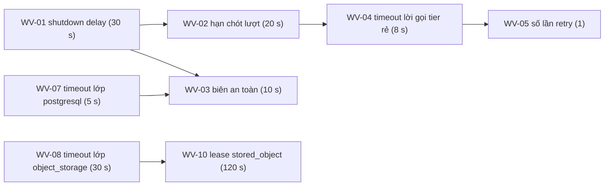

# Đề xuất — giá trị làm việc cho tham số vận hành (A-031) và tham số đăng nhập (A-048), Sprint 1

**Trạng thái:** ✅ PO duyệt 2026-09-27 — WV-01…WV-15, WV-17, WV-18; **2026-10-02 — WV-16 bản sửa và WV-16b**. Gói Render của giai đoạn build là **free** (PO, 2026-10-02; A-085) ·  **Ngày:** 2026-09-27 · **Người đề xuất:** người triển khai (câu 7) · **Cổng:** 1.10 và 1.11 của `12-roadmap.md` · **Nguồn:** A-031, A-048, ADR-016, ADR-021, mục Lưu trữ file và bất biến bản render của `04-data.md`, mục Rate limit của `09-security.md`, mục Định cỡ A-022 của `11-ops.md`, `docs/reference/render-deploys-docker.md`, `docs/reference/argon2-cffi-parameters.md`

---

## 0. Luật của bảng này

- **Mọi giá trị mang nhãn "chưa hiệu chỉnh".** Chúng tồn tại để bước kiểm khởi động #5 và #11 có thứ để kiểm, và để code Sprint 1 không phải đoán. Không giá trị nào là số đo.
- **Mỗi giá trị ghi rõ căn cứ thuộc loại nào:**
  - **Dẫn xuất:** tính từ một con số đã có nguồn, hoặc từ một ràng buộc đã chốt trong thiết kế.
  - **Chọn:** không có căn cứ đo. Ghi lý do chọn và thứ sẽ thay nó.
- **Không ghi con số nào từ trí nhớ.** Con số duy nhất lấy từ bên ngoài là shutdown delay mặc định của Render (`docs/reference/render-deploys-docker.md`) và mặc định của `argon2-cffi` (`docs/reference/argon2-cffi-parameters.md`).
- **Ngoài phạm vi, không đề xuất:**
  - `top_k`, tham số gộp thứ hạng, kích thước chunk — nhánh ngoài phạm vi, tức retrieval, ở Sprint 2 (mục Track build — Deliverable của `12-roadmap.md`).
  - Chu kỳ poll và các tham số của stream tín hiệu — Sprint 3.
  - Trần kích thước file tải lên — tải template ở Sprint 3.
  - `job.max_attempts` và backoff — đã có giá trị khởi tạo ở mục Retry, backoff và job lỗi vĩnh viễn của `11-ops.md`.
  - Trần token và trần số vòng — mục Định cỡ A-022 của `11-ops.md`.

## 1. A-031 — thời gian, retry, timeout

Các giá trị trong bảng móc vào nhau. Hình dưới là chuỗi ràng buộc; số trong ngoặc là giá trị đề xuất.

| ID | Tham số | Giá trị làm việc | Loại căn cứ | Căn cứ | Ràng buộc máy kiểm | Thay bằng |
|---|---|---|---|---|---|---|
| WV-01 | Shutdown delay đã cấu hình — `api` và `worker` | **30 s** | Dẫn xuất | Mặc định của Render, và Render không cần cấu hình gì thêm cho giá trị này (`docs/reference/render-deploys-docker.md`). Không nâng ở Sprint 1–2: nâng là một thiết lập trên Render mà người vận hành phải nhớ, trong khi chưa có số đo nào đòi nâng | Là một mục cấu hình của ứng dụng, để bước kiểm #11 có vế phải | S4 của Spike 1 — shutdown delay thật |
| WV-02 | Hạn chót một lượt chat | **20 s** | Dẫn xuất | WV-01 − WV-03 | Bước kiểm #11: WV-02 + WV-03 ≤ WV-01 | S3/S4 và phân phối thời lượng lượt (chỗ quan sát ADR-005 · ADR-016 ở `_PLAN.md`) |
| WV-03 | Biên an toàn giữa hạn chót lượt và shutdown delay | **10 s** | Dẫn xuất | Lượt quá hạn còn hai việc chạm DB: huỷ lượt chạy graph, rồi ghi tin nhắn agent mang mã khuôn lỗi (ADR-016). Biên = 2 × WV-07 | Như WV-02 | Như WV-02 |
| WV-04 | Timeout một lời gọi model, **tier rẻ** — `classify_intent`, `extract_slots` ở Sprint 1; lời gọi của nhánh ngoài phạm vi dùng cùng giá trị khi nó vào ở Sprint 2 | **8 s** | Chọn | Một lượt đường chính có hai lời gọi tuần tự (`classify_intent`, `extract_slots`). 2 × 8 s còn 4 s trong WV-02 cho tool | — | `llm_usage` và log kỹ thuật của Sprint 1 — thời lượng thật theo provider (A-026) |
| WV-05 | Số lần retry một lời gọi model — tại `ai_gateway`, cả hai tier | **1** — tổng hai lần gọi; nghỉ cố định **1 s** giữa hai lần. Tier rẻ **chỉ** retry khi thời gian còn lại của hạn chót lượt ≥ WV-04 | Chọn | Lượt chat chỉ có 20 s; bên `worker`, lớp retry thật là retry của job (mục Retry, backoff và job lỗi vĩnh viễn của `11-ops.md`). Retry trong lời gọi chỉ để bắt lỗi thoáng qua **429 — PO, 2026-10-02 (ADR-035):** chờ theo `retry-after` chỉ khi thời gian còn lại của WV-02 ≥ `retry-after` + WV-04; không đủ thì khuôn "hệ thống đang bận". Lần chờ này là lần retry duy nhất, không cộng thêm | — | Tỷ lệ lỗi provider trong log |
| WV-06 | Timeout một lời gọi model, **tier mạnh** — `draft_free_content`, `revise_free_content` | **60 s** | Chọn | Chạy trong `worker`, không bị hạn chót lượt. Không cần ≤ WV-01: job đang chạy khi nhận `SIGTERM` được trả về hàng đợi (ADR-016), và job giao theo kiểu ít nhất một lần (ADR-004) | — | Như WV-04 |
| WV-07 | Timeout lớp tool **chỉ `postgresql`** | **5 s** | Chọn | Một lượt gọi nhiều tool của lớp này; mỗi tool ≤ 1/4 WV-02 | — | Latency truy vấn (chỗ quan sát ADR-002, ADR-008 ở `_PLAN.md`) |
| WV-08 | Timeout lớp tool **chạm `object_storage`** | **30 s** | Chọn | Gồm `stored_file_fetch` trong `api` (ADR-014) và ghi bản render trong `worker`. File là một `.docx` hoặc `.pdf` một vài trang | Bước kiểm #11: WV-10 > WV-08 | A-059 — phân phối thời lượng upload, trên nhà cung cấp thật |
| WV-09 | Timeout lớp tool **chuyển đổi file** (`pdf_export`) | **120 s** | Chọn | Chỉ chạy trong `worker`. Chưa có số đo LibreOffice nào | — | S5 của Spike 1 — ít nhất 30 lần chuyển đổi, có phần đuôi |
| WV-10 | Lease của `stored_object` | **120 s** = 4 × WV-08 | Dẫn xuất | "Dài hơn hẳn" timeout của lớp chạm `object_storage` (mục Lưu trữ file và bất biến bản render của `04-data.md`). Hệ số 4 là chọn | Bước kiểm #11 | A-059 — lease đặt từ phần đuôi đo được, như A-031 đã ghi |
| WV-11 | Số lần hỏi làm rõ trước khi chuyển sang khuôn hướng dẫn liên hệ phòng hành chính | **2** | Chọn | Sprint 1 có nhánh `ask_clarification` vì `route_intent` cần đích cho `AMBIGUOUS` | — | Eval Phase 10 — nhóm ca hội thoại mơ hồ |
| WV-12 | Rate limit đăng nhập: độ dài cửa sổ; ngưỡng mỗi `scope` `login_ip:{ip}` | **15 phút; 20 lần thử** | Chọn | Bộ đếm tăng ở **mọi** lần thử, kể cả lần đúng (mục Rate limit của `09-security.md`). Người sau cùng một NAT chia chung một ngưỡng. Sprint 1 local chỉ có người thử | — | Số nhân viên sau cùng một IP (A-002) và cách đọc IP thật phía sau proxy của Render (A-062, cổng 2.7) |
| WV-13 | Dọn `rate_limit_window`: số cửa sổ giữ lại; chu kỳ cron | **2 cửa sổ; mỗi giờ** | Chọn | Kiểm ngưỡng chỉ đọc cửa sổ hiện tại. Giữ thêm một cửa sổ để còn dấu vết khi xem log | — | — |
| WV-14 | `limit` phân trang: mặc định; trần | **20; 100** | Chọn | Danh sách của Sprint 1 là hàng đợi và "yêu cầu của tôi". Trần chặn chi phí một truy vấn | — | Kích thước hàng đợi thật (A-002) |
| WV-15 | Độ dài tối đa một tin nhắn chat | **2.000 ký tự** | Chọn | Tin nhắn là input chính của `extract_slots`, và trần một lời gọi là 3.500 token (mục Định cỡ A-022 của `11-ops.md`). Tỷ lệ ký tự trên token của tiếng Việt tuỳ tokenizer của provider — chưa biết (A-026) | — | Kiểm lại ngay khi chọn provider: 2.000 ký tự phải còn chỗ trong 3.500 token cùng phần khung của prompt |

**WV-04, WV-05 và WV-06 là tham số mới.** A-031 hiện ghi "số lần retry gọi model" nhưng không ghi timeout của một lời gọi model. Timeout ba lớp tool không phủ lời gọi model, vì lời gọi model đi qua `ai_gateway`, không qua `tool_layer`. Nếu PO duyệt, dòng A-031 thêm hai tham số này.

## 2. A-048 — đăng nhập

| ID | Tham số | Giá trị làm việc | Loại căn cứ | Căn cứ | Thay bằng |
|---|---|---|---|---|---|
| WV-16 | Tham số `argon2id`: `time_cost`, `memory_cost`, `parallelism` | ~~3; 65.536 KiB; 4~~ → **2; 19.456 KiB (19 MiB); 1** — PO duyệt 2026-10-02, mục 2.1 | Dẫn xuất | Cấu hình thứ hai trong năm cấu hình của OWASP (`docs/reference/owasp-password-storage-argon2id.md`), chọn sau khi đối chiếu RAM — mục 2.1 | p95 thời lượng verify và RAM còn trống, đo trên Render `dev` ở Sprint 2 — điều kiện đảo ngược của ADR-021 |
| WV-17 | Thời hạn token phiên | **8 giờ, tính tuyệt đối** — không gia hạn trượt | Chọn | Một ngày làm việc: đăng nhập mỗi sáng một lần (NFR-04: người dùng thưa). Đăng xuất không thu hồi token (mục Phiên đăng nhập của `05-api.md`), nên thời hạn chính là cửa sổ tối đa một cookie bị lộ còn dùng được khi nhân viên vẫn `is_active`. Giờ làm việc của tổ chức chưa có | Hành vi dùng thật (A-002) |
| WV-18 | Xoay vòng session secret | **Theo sự kiện, không theo lịch**, tới hết UAT: khi nghi lộ; khi người giữ secret rời dự án; trước lần đầu dữ liệu nhân viên thật vào hệ thống | Chọn | Không phải điều kiện của cổng 1.11. Ghi vì A-048 đang để "tần suất `TBD`". Mục AuthN của `09-security.md` đã chốt: xoay vòng là việc tay của người vận hành, vì mọi phiên bị đăng xuất | Lịch cố định, sau UAT |

**Ba điều WV-16 kéo theo — PO cần biết trước khi duyệt:**

1. **Chọn `argon2-cffi` làm căn cứ không phải là chọn thư viện.** ADR-021 để việc chọn thư viện cho BUILD MODE. Nếu chọn thư viện khác, WV-16 phải đề xuất lại.
2. **Hạ tham số về sau không phá hash cũ**, nhưng **ứng dụng không tự hash lại được.** Chuỗi hash mang tham số, và một hasher có tham số khác vẫn verify đúng hash cũ (mục Đổi tham số — hash cũ còn verify được không của `docs/reference/argon2-cffi-parameters.md`). Thư viện khuyên hash lại sau lần đăng nhập thành công. Ở BO-19, `bo19_app` chỉ đọc `employee_credential` (A-048, H1), nên hash lại là **thao tác vận hành**, cùng loại với đặt lại mật khẩu. Không đổi H1.
3. ~~**64 MiB cho mỗi lần verify đang chạy.**~~ Điều 3 là lý do PO không duyệt bản đầu. Bản sửa ở mục 2.1.

### 2.1 WV-16 — đối chiếu bộ nhớ mỗi lần verify với RAM của Render

**Yêu cầu của PO (2026-09-27):** đối chiếu bộ nhớ mỗi lần verify với RAM của gói Render dự kiến. Nếu vài lượt đăng nhập đồng thời có thể làm cạn RAM thì đề xuất tham số thấp hơn, không dưới mức tối thiểu OWASP, kèm căn cứ.

**Gói Render dự kiến:** ~~chưa có~~ — **`free` trong suốt giai đoạn build** (PO, 2026-10-02; A-085): 512 MB RAM, số CPU không in trên trang giá (`docs/reference/render-instance-compute.md`). Phép đối chiếu dưới đây dùng `0.5c-512mb` — cùng 512 MB RAM, dưới 1 CPU — nên kết luận về RAM áp nguyên cho `free`.

**Bộ nhớ mỗi lần verify — số đo, không phải số suy:** bộ nhớ đỉnh của tiến trình tăng xấp xỉ `m` cho mỗi lần verify đang chạy (mục Bộ nhớ đỉnh và thời lượng khi verify đồng thời của `docs/reference/argon2-cffi-parameters.md`).

| Cấu hình | `m` | 4 lần đồng thời — phần của verify, đo trên máy người triển khai | So với 512 MB | Thời lượng dài nhất trong 4 lần |
|---|---|---|---|---|
| Bản đầu — mặc định `argon2-cffi` (`t=3, p=4`) | 64 MiB | khoảng 256 MiB | **khoảng một nửa** | 866 ms |
| OWASP 1 (`t=1, p=1`) | 46 MiB | khoảng 181 MiB | khoảng 35% | 408 ms |
| **OWASP 2 (`t=2, p=1`) — đề xuất** | **19 MiB** | **khoảng 76 MiB** | **khoảng 15%** | **230 ms** |
| OWASP 3 (`t=3, p=1`) | 12 MiB | khoảng 48 MiB | khoảng 9% | 131 ms |
| OWASP 4 (`t=4, p=1`) | 9 MiB | khoảng 36 MiB | khoảng 7% | 116 ms |
| OWASP 5 (`t=5, p=1`) | 7 MiB | khoảng 28 MiB | khoảng 5% | 117 ms |

Cột "phần của verify" = đỉnh sau khi chạy 4 lần, trừ nền ước tính (đỉnh sau một lần hash trừ `m`). Máy đo có 12 CPU logic; Render `0.5c-512mb` có dưới 1 CPU, nên thời lượng trên Render sẽ dài hơn — **không suy ra được bao nhiêu**.

**Kết luận: điều kiện của PO xảy ra với bản đầu.** Bốn lượt đăng nhập đồng thời chiếm khoảng một nửa RAM của `0.5c-512mb`, **chưa tính** bộ nhớ của chính tiến trình `api` — ứng dụng, LangGraph, pool kết nối, lượt chat đang chạy (ADR-016). Bộ nhớ nền đó chưa đo được trước BUILD MODE. Thêm nữa, `p=4` đòi bốn luồng tính song song trên một instance có dưới 1 CPU.

**Đề xuất sửa: `t=2`, `m=19456` KiB, `p=1`** — đúng cấu hình thứ hai của OWASP:

- **Không dưới mức OWASP.** OWASP không nêu một mức tối thiểu duy nhất. Nó nêu năm cấu hình "provide an equal level of defense", khác nhau ở cân bằng CPU với RAM. Đề xuất dùng nguyên một cấu hình trong năm, không pha.
- **Vì sao không chọn cấu hình ít RAM nhất (7 MiB).** Theo OWASP, năm cấu hình ngang nhau. Nhưng ADR-021 chọn `argon2id` **vì** chiều bộ nhớ — cuộc dò song song bị giới hạn bởi RAM. Chọn 19 MiB giữ chiều đó cao nhất có thể mà vẫn chỉ chiếm khoảng 15% RAM ở bốn lượt đồng thời. Nếu đo trên Render `dev` thấy RAM căng, lùi tiếp sang OWASP 3–5 không cần ADR mới — đúng điều kiện đảo ngược của ADR-021.
- **`p=1`** — cả năm cấu hình OWASP đều vậy, và khớp instance dưới 1 CPU.
- **Không phá gì nếu đổi lần nữa.** Chuỗi hash mang tham số, hasher mới verify được hash cũ (mục Đổi tham số — hash cũ còn verify được không của `docs/reference/argon2-cffi-parameters.md`). Hash lại vẫn là thao tác vận hành (H1).

**Kèm một lựa chọn cho PO — WV-16b, trần số lần verify đồng thời trong một tiến trình `api`: 4.** Rate limit (WV-12) giới hạn **số lần thử theo IP trong một cửa sổ**, không giới hạn **số lần chạy cùng lúc**. Không có trần thì bộ nhớ dành cho verify không có cận trên. Với trần 4, cận trên là 4 × 19 MiB ≈ 76 MiB, bất kể tải. Lần thứ năm chờ. Đây là **thêm một cơ chế**, không chỉ là giá trị. **PO duyệt 2026-10-02**; ghi ở mục AuthN của `09-security.md`.

## 3. Việc áp — đã làm 2026-09-27, trừ phần của WV-16

- **`ASSUMPTIONS.md`:**
  - A-031 và A-048 ghi "giá trị làm việc đã duyệt, chưa hiệu chỉnh" kèm trỏ file này. Trạng thái vẫn `Mở` — hiệu chỉnh mới đóng.
  - A-031 thêm WV-04 và WV-06 vào danh sách tham số.
- **`12-roadmap.md`:** cổng 1.10 → Đạt (đã áp 2026-09-27). Cổng 1.11 → Đạt (2026-10-02).
- **`06-structure.md`:** không đổi bước kiểm nào. Bước #5 và #11 đã đòi đúng các giá trị này.
- **Nơi các giá trị sống ở BUILD MODE:** cấu hình của ứng dụng, không phải hằng số trong code — cùng luật với trần budget ở bước kiểm #5.
- **`CHANGELOG.md`:** một mục.

## Open Questions

- Giờ làm việc của tổ chức — căn cứ của WV-17. Chưa có giả định nào mang nó; nếu PO muốn, thêm vào A-048 thay vì mở giả định mới.
- Hệ số 4 ở WV-10 và biên 2 × WV-07 ở WV-03 là hai lựa chọn có tên. PO có thể đổi hệ số mà không đổi cấu trúc.
